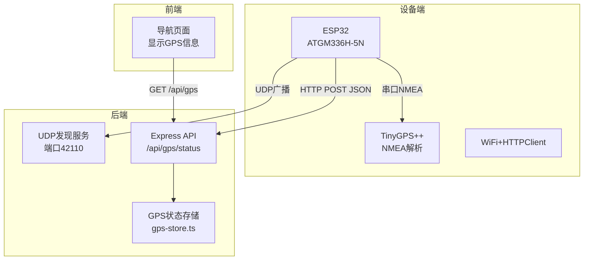
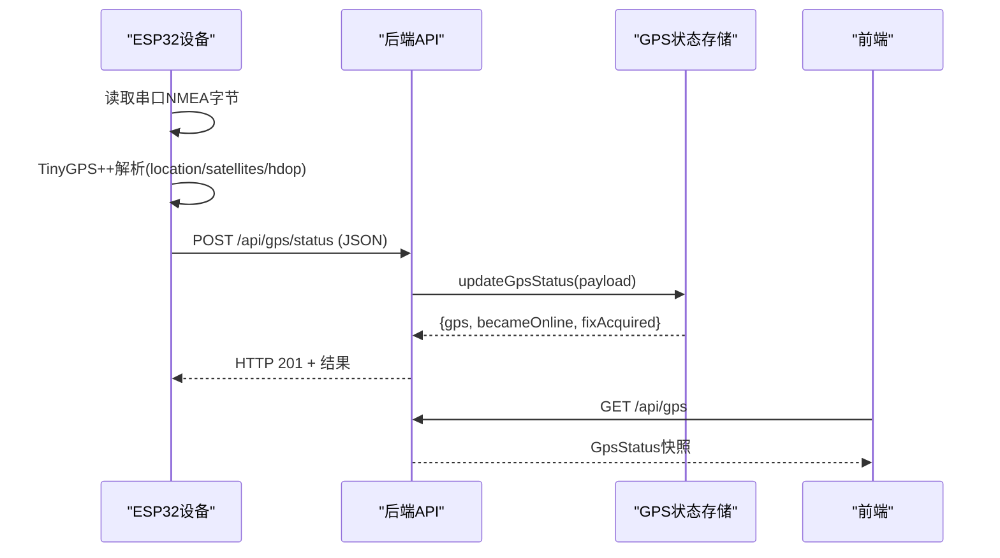
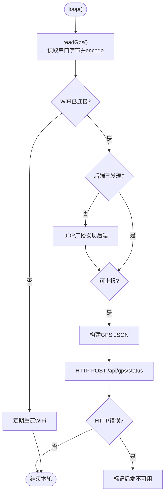
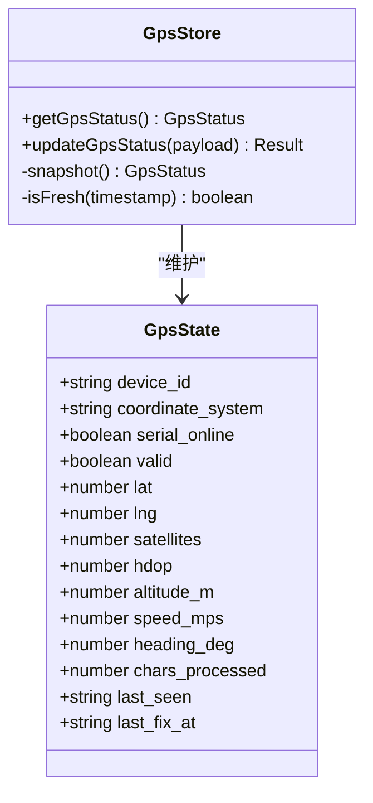
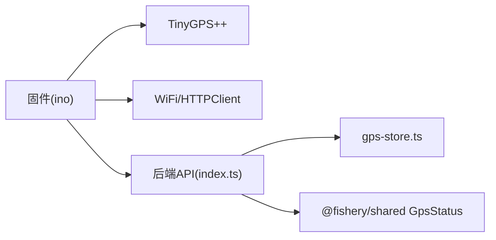

# GPS数据处理

<cite>
**本文引用的文件**
- [gps-store.ts](file://fishery-digital-twin-platform/apps/backend/src/gps-store.ts)
- [index.ts](file://fishery-digital-twin-platform/apps/backend/src/index.ts)
- [maker_esp32_pro_gps_only.ino](file://fishery-digital-twin-platform/firmware/esp32/maker_esp32_pro_gps_only/maker_esp32_pro_gps_only.ino)
- [index.ts（共享类型）](file://fishery-digital-twin-platform/packages/shared/src/index.ts)
</cite>

## 目录
1. [简介](#简介)
2. [项目结构](#项目结构)
3. [核心组件](#核心组件)
4. [架构总览](#架构总览)
5. [详细组件分析](#详细组件分析)
6. [依赖关系分析](#依赖关系分析)
7. [性能考量](#性能考量)
8. [故障排查指南](#故障排查指南)
9. [结论](#结论)
10. [附录](#附录)

## 简介
本模块实现从GPS设备到后端平台的完整数据链路：固件侧通过串口读取NMEA语句，解析经纬度、卫星数、HDOP等指标，按固定周期上报至后端；后端对数据进行校验、缓存与状态计算，并通过API暴露给前端展示。系统采用WGS84坐标系统，提供定位有效性判断、在线超时检测、日志记录与调试输出能力。

## 项目结构
- 固件端（ESP32）：负责串口接收NMEA、使用TinyGPS++解析、构建JSON并HTTP POST到后端。
- 后端端（Node.js/Express）：提供UDP发现服务、HTTP接口接收GPS状态、维护内存中的GPS状态快照、对外暴露查询接口。
- 共享类型：定义GpsStatus等数据结构，保证前后端一致。

图表来源
- [maker_esp32_pro_gps_only.ino:82-116](file://fishery-digital-twin-platform/firmware/esp32/maker_esp32_pro_gps_only/maker_esp32_pro_gps_only.ino#L82-L116)
- [maker_esp32_pro_gps_only.ino:313-365](file://fishery-digital-twin-platform/firmware/esp32/maker_esp32_pro_gps_only/maker_esp32_pro_gps_only.ino#L313-L365)
- [index.ts:271-318](file://fishery-digital-twin-platform/apps/backend/src/index.ts#L271-L318)
- [index.ts:348-365](file://fishery-digital-twin-platform/apps/backend/src/index.ts#L348-L365)
- [gps-store.ts:59-102](file://fishery-digital-twin-platform/apps/backend/src/gps-store.ts#L59-L102)

章节来源
- [maker_esp32_pro_gps_only.ino:82-116](file://fishery-digital-twin-platform/firmware/esp32/maker_esp32_pro_gps_only/maker_esp32_pro_gps_only.ino#L82-L116)
- [index.ts:271-318](file://fishery-digital-twin-platform/apps/backend/src/index.ts#L271-L318)
- [gps-store.ts:59-102](file://fishery-digital-twin-platform/apps/backend/src/gps-store.ts#L59-L102)

## 核心组件
- 固件GPS采集与上报：串口读取、NMEA编码、有效性判断、定时上报。
- 后端GPS状态管理：参数校验、时间戳处理、在线性判定、状态快照。
- 共享数据类型：统一GpsStatus字段语义。

章节来源
- [maker_esp32_pro_gps_only.ino:118-142](file://fishery-digital-twin-platform/firmware/esp32/maker_esp32_pro_gps_only/maker_esp32_pro_gps_only.ino#L118-L142)
- [gps-store.ts:25-53](file://fishery-digital-twin-platform/apps/backend/src/gps-store.ts#L25-L53)
- [index.ts（共享类型）:35-51](file://fishery-digital-twin-platform/packages/shared/src/index.ts#L35-L51)

## 架构总览
整体流程如下：
- 设备端循环读取串口字节，交给TinyGPS++增量解析，得到位置、卫星数、HDOP等。
- 每2秒检查一次网络与后端可达性，构造JSON并POST到/api/gps/status。
- 后端在收到请求后校验coordinate_system必须为WGS84，校验经纬度范围，更新内存状态，返回是否获得有效定位或刚上线的事件。
- 前端通过/api/gps获取当前GPS状态用于展示。

图表来源
- [maker_esp32_pro_gps_only.ino:118-142](file://fishery-digital-twin-platform/firmware/esp32/maker_esp32_pro_gps_only/maker_esp32_pro_gps_only.ino#L118-L142)
- [maker_esp32_pro_gps_only.ino:313-365](file://fishery-digital-twin-platform/firmware/esp32/maker_esp32_pro_gps_only/maker_esp32_pro_gps_only.ino#L313-L365)
- [index.ts:348-365](file://fishery-digital-twin-platform/apps/backend/src/index.ts#L348-L365)
- [gps-store.ts:59-102](file://fishery-digital-twin-platform/apps/backend/src/gps-store.ts#L59-L102)

## 详细组件分析

### 固件端GPS采集与上报
- 串口配置：GPS TX接GPIO33，波特率9600；调试串口115200。
- NMEA解析：使用TinyGPS++逐字节encode，支持可选回显原始NMEA。
- 有效性判断：
  - 串口在线：最近有字节且未超过5秒无数据。
  - 定位有效：location有效且年龄不超过5秒。
- 上报策略：每2秒尝试上报一次，包含device_id、coordinate_system=WGS84、serial_online、valid、lat/lng、satellites、hdop、altitude_m、speed_mps、heading_deg、chars_processed。
- 网络与后端发现：
  - WiFi连接成功后启动UDP广播监听，向本地网段广播“UISYS_DISCOVER_V1”，等待后端响应“UISYS_BACKEND_V1|端口”。
  - 若HTTP失败则失效后端地址并重试发现。

图表来源
- [maker_esp32_pro_gps_only.ino:99-116](file://fishery-digital-twin-platform/firmware/esp32/maker_esp32_pro_gps_only/maker_esp32_pro_gps_only.ino#L99-L116)
- [maker_esp32_pro_gps_only.ino:118-142](file://fishery-digital-twin-platform/firmware/esp32/maker_esp32_pro_gps_only/maker_esp32_pro_gps_only.ino#L118-L142)
- [maker_esp32_pro_gps_only.ino:144-186](file://fishery-digital-twin-platform/firmware/esp32/maker_esp32_pro_gps_only/maker_esp32_pro_gps_only.ino#L144-L186)
- [maker_esp32_pro_gps_only.ino:204-263](file://fishery-digital-twin-platform/firmware/esp32/maker_esp32_pro_gps_only/maker_esp32_pro_gps_only.ino#L204-L263)
- [maker_esp32_pro_gps_only.ino:313-365](file://fishery-digital-twin-platform/firmware/esp32/maker_esp32_pro_gps_only/maker_esp32_pro_gps_only.ino#L313-L365)

章节来源
- [maker_esp32_pro_gps_only.ino:82-116](file://fishery-digital-twin-platform/firmware/esp32/maker_esp32_pro_gps_only/maker_esp32_pro_gps_only.ino#L82-L116)
- [maker_esp32_pro_gps_only.ino:118-142](file://fishery-digital-twin-platform/firmware/esp32/maker_esp32_pro_gps_only/maker_esp32_pro_gps_only.ino#L118-L142)
- [maker_esp32_pro_gps_only.ino:204-263](file://fishery-digital-twin-platform/firmware/esp32/maker_esp32_pro_gps_only/maker_esp32_pro_gps_only.ino#L204-L263)
- [maker_esp32_pro_gps_only.ino:313-365](file://fishery-digital-twin-platform/firmware/esp32/maker_esp32_pro_gps_only/maker_esp32_pro_gps_only.ino#L313-L365)

### 后端GPS状态管理与API
- 状态存储：内存中维护GpsState，包含设备ID、坐标系、串口在线、定位有效、经纬度、卫星数、HDOP、高度、速度、航向、字符计数、最后看到时间、最后定位时间。
- 数据校验：
  - coordinate_system必须为WGS84，否则拒绝。
  - lat/lng需为数字且在合法范围[-90,90]、[-180,180]。
  - 其他数值字段使用安全转换，非法值置空。
- 在线性判定：
  - online = serial_online && last_seen在10秒内。
  - valid = valid && online。
- 事件反馈：
  - becameOnline：由离线变为在线。
  - fixAcquired：由无效定位变为有效定位。
- API：
  - POST /api/gps/status：接收设备上报，返回结果并记录日志。
  - GET /api/gps：返回当前GPS状态快照。
  - GET /api/navigation：当GPS在线且有效时，使用GPS位置作为导航源。

图表来源
- [gps-store.ts:8-23](file://fishery-digital-twin-platform/apps/backend/src/gps-store.ts#L8-L23)
- [gps-store.ts:46-53](file://fishery-digital-twin-platform/apps/backend/src/gps-store.ts#L46-L53)
- [gps-store.ts:59-102](file://fishery-digital-twin-platform/apps/backend/src/gps-store.ts#L59-L102)

章节来源
- [gps-store.ts:25-53](file://fishery-digital-twin-platform/apps/backend/src/gps-store.ts#L25-L53)
- [gps-store.ts:59-102](file://fishery-digital-twin-platform/apps/backend/src/gps-store.ts#L59-L102)
- [index.ts:348-365](file://fishery-digital-twin-platform/apps/backend/src/index.ts#L348-L365)
- [index.ts:197-222](file://fishery-digital-twin-platform/apps/backend/src/index.ts#L197-L222)

### WGS84坐标系统与精度评估
- 坐标系统：固件与后端均强制使用WGS84。后端在接收时校验coordinate_system字段，非WGS84直接拒绝。
- 经纬度格式：固件以十进制度数上报（例如lat/lng保留7位小数），后端进行范围校验。
- 精度评估：
  - 卫星数量：来自TinyGPS++的satellites.value()，后端原样缓存。
  - HDOP：水平精度因子，越小越好；后端原样缓存。
  - 定位有效性：固件基于location有效性与年龄（≤5秒）判断；后端结合online与valid综合判定。
- 误差修正：代码中未实现额外算法修正，仅做基础合法性校验与有效性过滤。

章节来源
- [maker_esp32_pro_gps_only.ino:313-365](file://fishery-digital-twin-platform/firmware/esp32/maker_esp32_pro_gps_only/maker_esp32_pro_gps_only.ino#L313-L365)
- [gps-store.ts:59-75](file://fishery-digital-twin-platform/apps/backend/src/gps-store.ts#L59-L75)
- [index.ts（共享类型）:35-51](file://fishery-digital-twin-platform/packages/shared/src/index.ts#L35-L51)

### GPS状态监控功能
- 卫星数量检测：固件读取并上报satellites；后端缓存并在日志中体现。
- HDOP精度指标：固件读取并上报hdop；后端缓存。
- 信号强度评估：当前未直接上报RSSI或信噪比，可通过串口调试观察NMEA质量或使用外部工具测量。
- 定位有效性判断：
  - 固件：serial_online且location有效且age≤5秒。
  - 后端：online=serial_online且last_seen在10秒内；valid=valid&&online。

章节来源
- [maker_esp32_pro_gps_only.ino:133-142](file://fishery-digital-twin-platform/firmware/esp32/maker_esp32_pro_gps_only/maker_esp32_pro_gps_only.ino#L133-L142)
- [gps-store.ts:40-53](file://fishery-digital-twin-platform/apps/backend/src/gps-store.ts#L40-L53)
- [index.ts:348-365](file://fishery-digital-twin-platform/apps/backend/src/index.ts#L348-L365)

### GPS数据缓存与更新策略
- 去重：后端内存状态按最新上报覆盖，未实现基于时间戳的去重逻辑；设备端每2秒上报一次，天然降低重复频率。
- 时间戳处理：
  - 设备端：使用millis()控制上报间隔与超时。
  - 后端：使用ISO时间字符串记录last_seen与last_fix_at，用于在线性判定。
- 异常值过滤：
  - 后端对lat/lng进行范围校验，非法值不更新有效定位。
  - 数值字段使用安全转换，非法值置空。
  - 整数字段（如satellites、chars_processed）取非负整型。

章节来源
- [gps-store.ts:29-44](file://fishery-digital-twin-platform/apps/backend/src/gps-store.ts#L29-L44)
- [gps-store.ts:59-102](file://fishery-digital-twin-platform/apps/backend/src/gps-store.ts#L59-L102)
- [maker_esp32_pro_gps_only.ino:99-116](file://fishery-digital-twin-platform/firmware/esp32/maker_esp32_pro_gps_only/maker_esp32_pro_gps_only.ino#L99-L116)

### GPS设备通信协议
- 串口通信配置：
  - GPS UART：9600bps，8N1，RX接GPIO33。
  - 调试串口：115200bps。
- 数据流控制：
  - 设备端循环读取串口字节，设置缓冲区大小2048。
  - 上报周期2秒，避免频繁HTTP请求。
- 错误重试机制：
  - WiFi断线自动重连。
  - 后端发现失败时周期性重试UDP广播。
  - HTTP失败时标记后端不可用，下次重新发现。

章节来源
- [maker_esp32_pro_gps_only.ino:25-28](file://fishery-digital-twin-platform/firmware/esp32/maker_esp32_pro_gps_only/maker_esp32_pro_gps_only.ino#L25-L28)
- [maker_esp32_pro_gps_only.ino:82-97](file://fishery-digital-twin-platform/firmware/esp32/maker_esp32_pro_gps_only/maker_esp32_pro_gps_only.ino#L82-L97)
- [maker_esp32_pro_gps_only.ino:144-186](file://fishery-digital-twin-platform/firmware/esp32/maker_esp32_pro_gps_only/maker_esp32_pro_gps_only.ino#L144-L186)
- [maker_esp32_pro_gps_only.ino:204-263](file://fishery-digital-twin-platform/firmware/esp32/maker_esp32_pro_gps_only/maker_esp32_pro_gps_only.ino#L204-L263)
- [maker_esp32_pro_gps_only.ino:313-365](file://fishery-digital-twin-platform/firmware/esp32/maker_esp32_pro_gps_only/maker_esp32_pro_gps_only.ino#L313-L365)

### GPS调试工具与故障诊断
- 串口调试：
  - 启用ECHO_RAW_NMEA可在调试串口查看原始NMEA语句，便于确认设备输出。
  - 打印GPS状态包括串口在线、字节数、字符数、定位状态、经纬度、卫星数、HDOP、高度等。
- 后端日志：
  - 获得有效定位或串口接入时会写入系统日志，便于追踪。
- 常见问题排查：
  - 无定位：检查天线位置、室外环境、串口接线（5V/GND/GPS-TX→GPIO33）。
  - 无法上报：检查WiFi连接、后端UDP发现、HTTP端口与令牌配置。
  - 数据不更新：检查设备上报周期、后端在线超时（10秒）、last_seen是否刷新。

章节来源
- [maker_esp32_pro_gps_only.ino:42-49](file://fishery-digital-twin-platform/firmware/esp32/maker_esp32_pro_gps_only/maker_esp32_pro_gps_only.ino#L42-L49)
- [maker_esp32_pro_gps_only.ino:265-311](file://fishery-digital-twin-platform/firmware/esp32/maker_esp32_pro_gps_only/maker_esp32_pro_gps_only.ino#L265-L311)
- [index.ts:348-365](file://fishery-digital-twin-platform/apps/backend/src/index.ts#L348-L365)

## 依赖关系分析
- 固件依赖：
  - HardwareSerial：串口读写。
  - TinyGPS++：NMEA解析。
  - WiFi/HTTPClient：网络通信。
- 后端依赖：
  - Express：HTTP服务。
  - dgram：UDP发现服务。
  - gps-store：状态管理。
- 共享类型：
  - GpsStatus：统一数据结构。

图表来源
- [maker_esp32_pro_gps_only.ino:18-23](file://fishery-digital-twin-platform/firmware/esp32/maker_esp32_pro_gps_only/maker_esp32_pro_gps_only.ino#L18-L23)
- [index.ts:1-21](file://fishery-digital-twin-platform/apps/backend/src/index.ts#L1-L21)
- [gps-store.ts:1-6](file://fishery-digital-twin-platform/apps/backend/src/gps-store.ts#L1-L6)
- [index.ts（共享类型）:35-51](file://fishery-digital-twin-platform/packages/shared/src/index.ts#L35-L51)

章节来源
- [maker_esp32_pro_gps_only.ino:18-23](file://fishery-digital-twin-platform/firmware/esp32/maker_esp32_pro_gps_only/maker_esp32_pro_gps_only.ino#L18-L23)
- [index.ts:1-21](file://fishery-digital-twin-platform/apps/backend/src/index.ts#L1-L21)
- [gps-store.ts:1-6](file://fishery-digital-twin-platform/apps/backend/src/gps-store.ts#L1-L6)
- [index.ts（共享类型）:35-51](file://fishery-digital-twin-platform/packages/shared/src/index.ts#L35-L51)

## 性能考量
- 上报频率：设备端每2秒上报一次，平衡实时性与网络负载。
- 超时控制：
  - 设备端串口超时5秒，定位年龄限制5秒。
  - 后端在线超时10秒，避免陈旧数据影响online状态。
- 内存占用：后端使用内存状态，适合单实例运行；如需持久化可扩展。
- 网络开销：HTTP请求体较小，建议保持合理上报周期。

[本节为通用指导，不直接分析具体文件]

## 故障排查指南
- 设备端无串口数据：
  - 检查供电与接线（5V/GND/GPS-TX→GPIO33）。
  - 查看调试串口输出，确认是否有NMEA字节流入。
- 无法获得定位：
  - 将天线移至开阔区域，等待卫星锁定。
  - 检查location有效性与age阈值。
- 无法上报后端：
  - 确认WiFi连接成功。
  - 检查后端UDP发现是否响应（端口42110）。
  - 检查HTTP令牌配置与端口可达性。
- 后端状态不更新：
  - 检查last_seen是否在10秒内。
  - 查看系统日志是否记录GPS接入或定位事件。

章节来源
- [maker_esp32_pro_gps_only.ino:265-311](file://fishery-digital-twin-platform/firmware/esp32/maker_esp32_pro_gps_only/maker_esp32_pro_gps_only.ino#L265-L311)
- [index.ts:348-365](file://fishery-digital-twin-platform/apps/backend/src/index.ts#L348-L365)

## 结论
该GPS数据处理模块实现了从设备端到后端的完整链路，具备基本的NMEA解析、WGS84坐标处理、在线性判定与状态缓存能力。系统通过UDP发现与HTTP上报完成设备与后端通信，并提供调试输出与日志记录辅助排障。未来可考虑增加信号强度上报、更严格的异常值过滤、历史数据持久化与可视化增强等功能。

[本节为总结，不直接分析具体文件]

## 附录
- 关键常量参考：
  - 设备端：GPS_BAUD=9600，DEBUG_BAUD=115200，REPORT_INTERVAL_MS=2000，GPS_FIX_MAX_AGE_MS=5000。
  - 后端：GPS_ONLINE_TIMEOUT_MS=10000，DISCOVERY_PORT=42110。
- 接口说明：
  - POST /api/gps/status：设备上报GPS状态。
  - GET /api/gps：查询当前GPS状态。
  - GET /api/navigation：导航数据，可能来源于GPS。

章节来源
- [maker_esp32_pro_gps_only.ino:25-49](file://fishery-digital-twin-platform/firmware/esp32/maker_esp32_pro_gps_only/maker_esp32_pro_gps_only.ino#L25-L49)
- [index.ts:57-68](file://fishery-digital-twin-platform/apps/backend/src/index.ts#L57-L68)
- [index.ts:345-346](file://fishery-digital-twin-platform/apps/backend/src/index.ts#L345-L346)
- [index.ts:348-365](file://fishery-digital-twin-platform/apps/backend/src/index.ts#L348-L365)