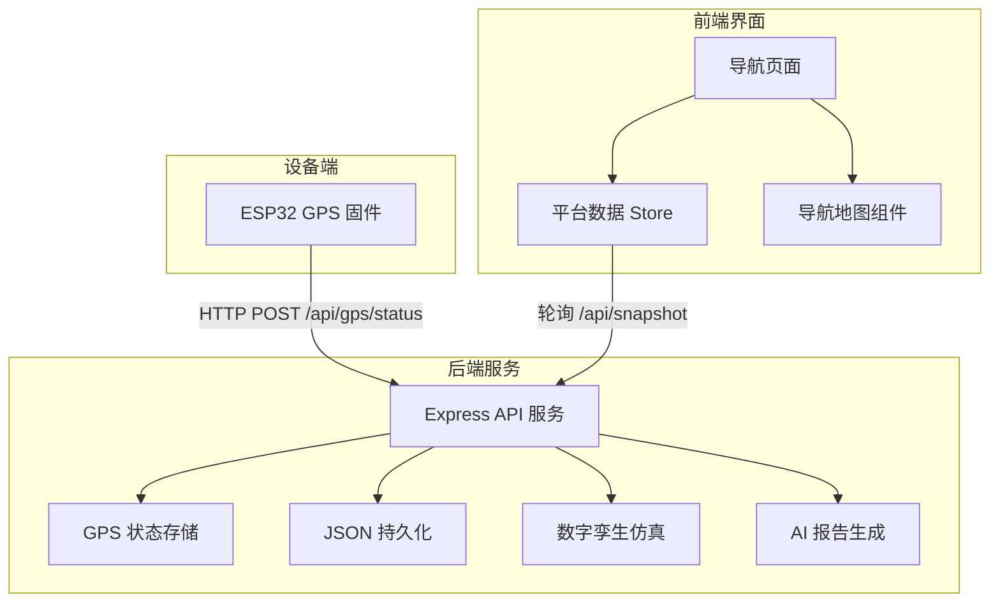
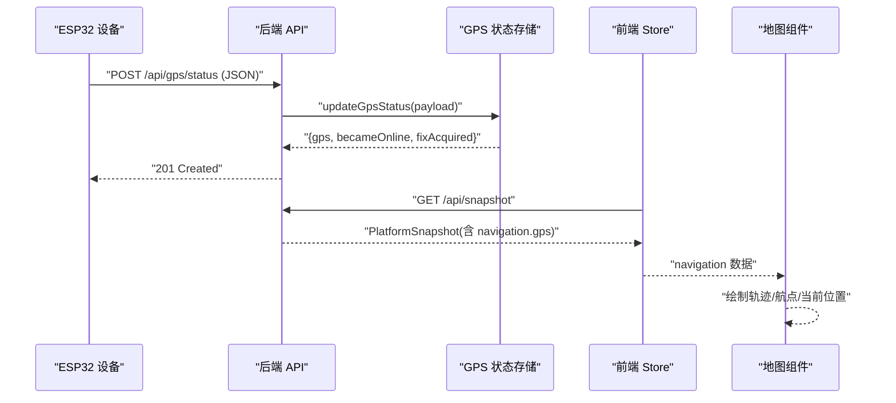
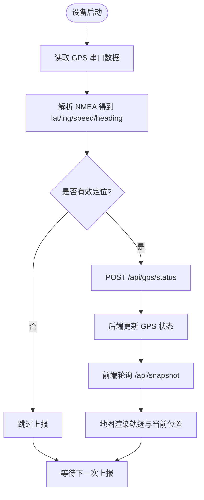
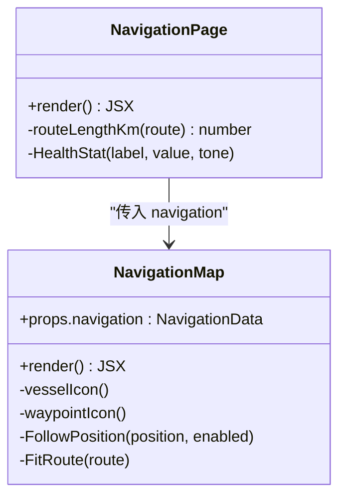
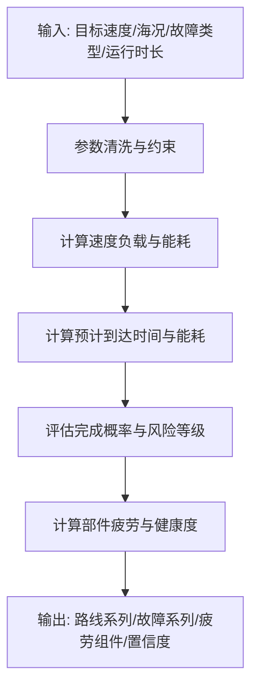
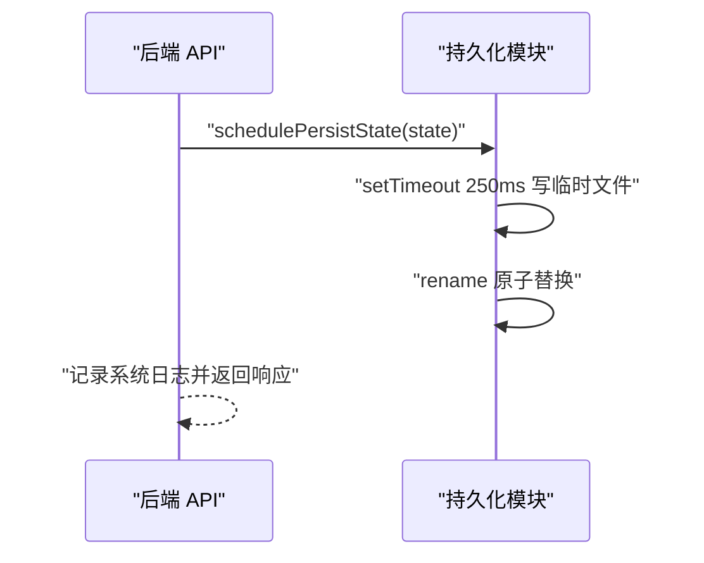
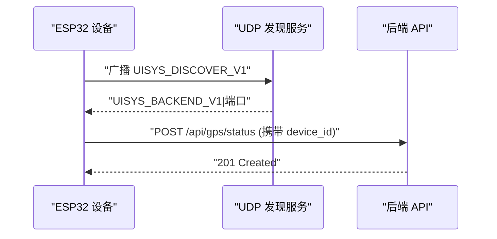
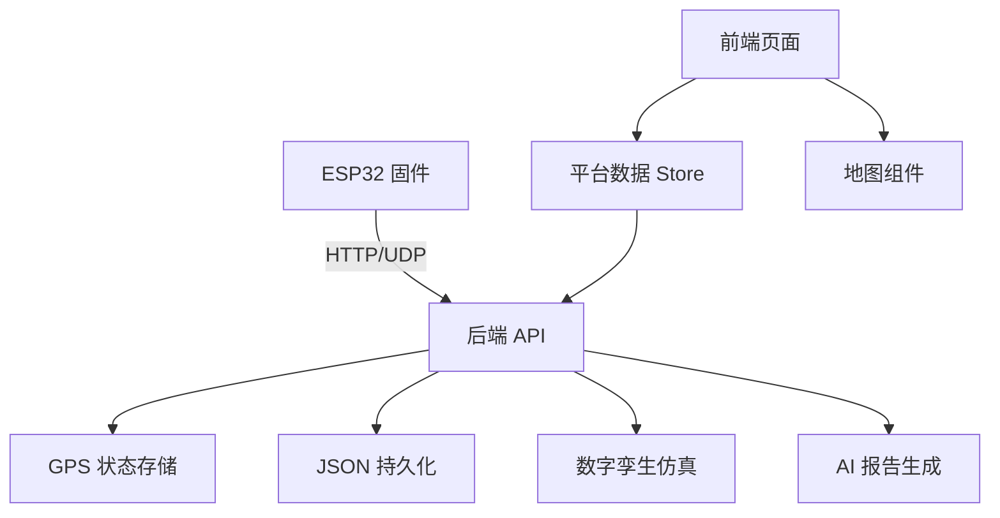

# 位置跟踪

<cite>
**本文引用的文件**
- [apps/backend/src/index.ts](file://fishery-digital-twin-platform/apps/backend/src/index.ts)
- [apps/backend/src/gps-store.ts](file://fishery-digital-twin-platform/apps/backend/src/gps-store.ts)
- [apps/backend/src/persistence.ts](file://fishery-digital-twin-platform/apps/backend/src/persistence.ts)
- [apps/backend/src/mock-data.ts](file://fishery-digital-twin-platform/apps/backend/src/mock-data.ts)
- [apps/backend/src/ai-service.ts](file://fishery-digital-twin-platform/apps/backend/src/ai-service.ts)
- [apps/backend/src/twin-simulator.ts](file://fishery-digital-twin-platform/apps/backend/src/twin-simulator.ts)
- [firmware/esp32/maker_esp32_pro_gps_only/maker_esp32_pro_gps_only.ino](file://fishery-digital-twin-platform/firmware/esp32/maker_esp32_pro_gps_only/maker_esp32_pro_gps_only.ino)
- [apps/frontend/src/components/map/NavigationMap.tsx](file://fishery-digital-twin-platform/apps/frontend/src/components/map/NavigationMap.tsx)
- [apps/frontend/src/components/dashboard/NavigationPage.tsx](file://fishery-digital-twin-platform/apps/frontend/src/components/dashboard/NavigationPage.tsx)
- [apps/frontend/src/lib/platformStore.ts](file://fishery-digital-twin-platform/apps/frontend/src/lib/platformStore.ts)
- [apps/frontend/src/hooks/usePlatformData.ts](file://fishery-digital-twin-platform/apps/frontend/src/hooks/usePlatformData.ts)
</cite>

## 目录
1. [简介](#简介)
2. [项目结构](#项目结构)
3. [核心组件](#核心组件)
4. [架构总览](#架构总览)
5. [详细组件分析](#详细组件分析)
6. [依赖关系分析](#依赖关系分析)
7. [性能与优化](#性能与优化)
8. [故障排查指南](#故障排查指南)
9. [结论](#结论)
10. [附录：API 与数据模型速查](#附录api-与数据模型速查)

## 简介
本系统为“智慧渔业数字孪生平台”的位置跟踪子系统，覆盖从设备端采集、后端状态管理、前端可视化到持久化与仿真推演的完整链路。重点包括：
- 实时位置更新机制：采集频率、传输协议、在线判定与状态同步策略
- 轨迹绘制功能：历史航点存储、轨迹线渲染、回放控制
- 统计分析：速度计算、航向分析、运动模式识别（基于仿真与统计）
- 数据持久化：JSON 文件存储、限长历史、快速写入
- 位置精度评估：GPS 精度指标、漂移检测思路与校正建议
- 多设备同步：设备发现、位置共享与冲突解决
- 性能优化与调试：轮询间隔、节流、日志与诊断接口

## 项目结构
位置跟踪相关代码分布在固件、后端服务、前端页面与地图组件中：
- 固件层：ESP32 通过串口读取 GPS NMEA，周期上报至后端
- 后端层：Express 提供 HTTP API，维护 GPS 状态、水质与航行快照，支持 UDP 设备发现与本地持久化
- 前端层：Next.js 页面订阅平台快照，使用 Leaflet 展示地图、轨迹与实时定位

图表来源
- [apps/backend/src/index.ts:56-114](file://fishery-digital-twin-platform/apps/backend/src/index.ts#L56-L114)
- [apps/backend/src/gps-store.ts:1-103](file://fishery-digital-twin-platform/apps/backend/src/gps-store.ts#L1-L103)
- [apps/backend/src/persistence.ts:1-68](file://fishery-digital-twin-platform/apps/backend/src/persistence.ts#L1-L68)
- [apps/backend/src/twin-simulator.ts:74-254](file://fishery-digital-twin-platform/apps/backend/src/twin-simulator.ts#L74-L254)
- [apps/backend/src/ai-service.ts:167-233](file://fishery-digital-twin-platform/apps/backend/src/ai-service.ts#L167-L233)
- [apps/frontend/src/lib/platformStore.ts:20-139](file://fishery-digital-twin-platform/apps/frontend/src/lib/platformStore.ts#L20-L139)
- [apps/frontend/src/components/map/NavigationMap.tsx:27-85](file://fishery-digital-twin-platform/apps/frontend/src/components/map/NavigationMap.tsx#L27-L85)
- [apps/frontend/src/components/dashboard/NavigationPage.tsx:44-145](file://fishery-digital-twin-platform/apps/frontend/src/components/dashboard/NavigationPage.tsx#L44-L145)

章节来源
- [apps/backend/src/index.ts:56-114](file://fishery-digital-twin-platform/apps/backend/src/index.ts#L56-L114)
- [apps/frontend/src/lib/platformStore.ts:20-139](file://fishery-digital-twin-platform/apps/frontend/src/lib/platformStore.ts#L20-L139)

## 核心组件
- GPS 状态存储：维护设备在线、坐标、卫星数、HDOP、高度、速度、航向等字段，并判断有效定位与在线超时
- 后端 API：暴露健康检查、快照、GPS 状态、传感器数据、舵机与推进器控制、数字孪生仿真、AI 报告等接口
- 前端 Store：统一轮询平台快照与设备反馈，驱动页面渲染
- 地图组件：基于 Leaflet 渲染轨迹、航点与当前位置，支持跟随与适配
- 导航页面：聚合显示当前任务、进度、速度与航向、GPS 信息
- 持久化模块：将水质历史、电池、AI 报告与系统日志落盘，采用临时文件原子替换
- 数字孪生仿真：根据输入参数与实时快照，预测能耗、到达时间、风险等级与疲劳度
- AI 报告：基于水质统计与电池均值生成决策建议，可选调用外部大模型

章节来源
- [apps/backend/src/gps-store.ts:1-103](file://fishery-digital-twin-platform/apps/backend/src/gps-store.ts#L1-L103)
- [apps/backend/src/index.ts:322-557](file://fishery-digital-twin-platform/apps/backend/src/index.ts#L322-L557)
- [apps/frontend/src/lib/platformStore.ts:20-139](file://fishery-digital-twin-platform/apps/frontend/src/lib/platformStore.ts#L20-L139)
- [apps/frontend/src/components/map/NavigationMap.tsx:27-85](file://fishery-digital-twin-platform/apps/frontend/src/components/map/NavigationMap.tsx#L27-L85)
- [apps/frontend/src/components/dashboard/NavigationPage.tsx:44-145](file://fishery-digital-twin-platform/apps/frontend/src/components/dashboard/NavigationPage.tsx#L44-L145)
- [apps/backend/src/persistence.ts:1-68](file://fishery-digital-twin-platform/apps/backend/src/persistence.ts#L1-L68)
- [apps/backend/src/twin-simulator.ts:74-254](file://fishery-digital-twin-platform/apps/backend/src/twin-simulator.ts#L74-L254)
- [apps/backend/src/ai-service.ts:167-233](file://fishery-digital-twin-platform/apps/backend/src/ai-service.ts#L167-L233)

## 架构总览
位置跟踪的数据流从设备端到前端展示，关键路径如下：
- 设备端定时读取 GPS 串口数据，解析 NMEA，构造 JSON 并通过 HTTP 上报
- 后端接收 GPS 状态，校验坐标范围与有效性，更新内存中的 GPS 状态
- 前端每 2 秒拉取平台快照，包含导航、水质、电池、AI 报告与设备状态
- 地图组件根据导航数据绘制轨迹与航点，并在 GPS 模式下跟随当前位置
- 导航页面汇总显示任务进度、速度与航向、GPS 精度等信息
- 所有平台状态可周期性持久化为 JSON 文件，重启后恢复

图表来源
- [firmware/esp32/maker_esp32_pro_gps_only/maker_esp32_pro_gps_only.ino:313-365](file://fishery-digital-twin-platform/firmware/esp32/maker_esp32_pro_gps_only/maker_esp32_pro_gps_only.ino#L313-L365)
- [apps/backend/src/index.ts:348-365](file://fishery-digital-twin-platform/apps/backend/src/index.ts#L348-L365)
- [apps/backend/src/gps-store.ts:59-102](file://fishery-digital-twin-platform/apps/backend/src/gps-store.ts#L59-L102)
- [apps/frontend/src/lib/platformStore.ts:98-139](file://fishery-digital-twin-platform/apps/frontend/src/lib/platformStore.ts#L98-L139)
- [apps/frontend/src/components/map/NavigationMap.tsx:27-85](file://fishery-digital-twin-platform/apps/frontend/src/components/map/NavigationMap.tsx#L27-L85)

## 详细组件分析

### 实时位置更新机制
- 采集频率
  - 设备端：每 2 秒上报一次 GPS 状态；串口数据持续读取，NMEA 解析
  - 后端：无固定采集频率，由设备主动推送；内部维护在线超时（10 秒）
  - 前端：每 2 秒轮询平台快照，获取导航与 GPS 信息
- 数据传输协议
  - 设备到后端：HTTP POST /api/gps/status，携带 device_id、coordinate_system、serial_online、valid、lat、lng、satellites、hdop、altitude_m、speed_mps、heading_deg、chars_processed
  - 后端到前端：HTTP GET /api/snapshot，返回 PlatformSnapshot，其中 navigation 包含 position、route、targetWaypoint、speed、heading、remainingDistance、etaMinutes、source、gps
- 状态同步策略
  - 后端 GPS 状态：仅当 serial_online 且 last_seen 在超时内才视为 online；valid 需满足 requestedValid 与坐标范围合法
  - 前端 Store：snapshotConnected 表示快照连接成功；feedbackConnected 表示舵机/推进器反馈连接成功
  - 导航源切换：若 GPS 在线且有效，则 source 为 gps；否则回退到模拟航线

图表来源
- [firmware/esp32/maker_esp32_pro_gps_only/maker_esp32_pro_gps_only.ino:99-116](file://fishery-digital-twin-platform/firmware/esp32/maker_esp32_pro_gps_only/maker_esp32_pro_gps_only.ino#L99-L116)
- [firmware/esp32/maker_esp32_pro_gps_only/maker_esp32_pro_gps_only.ino:313-365](file://fishery-digital-twin-platform/firmware/esp32/maker_esp32_pro_gps_only/maker_esp32_pro_gps_only.ino#L313-L365)
- [apps/backend/src/gps-store.ts:40-102](file://fishery-digital-twin-platform/apps/backend/src/gps-store.ts#L40-L102)
- [apps/frontend/src/lib/platformStore.ts:20-139](file://fishery-digital-twin-platform/apps/frontend/src/lib/platformStore.ts#L20-L139)

章节来源
- [firmware/esp32/maker_esp32_pro_gps_only/maker_esp32_pro_gps_only.ino:99-116](file://fishery-digital-twin-platform/firmware/esp32/maker_esp32_pro_gps_only/maker_esp32_pro_gps_only.ino#L99-L116)
- [apps/backend/src/gps-store.ts:40-102](file://fishery-digital-twin-platform/apps/backend/src/gps-store.ts#L40-L102)
- [apps/frontend/src/lib/platformStore.ts:20-139](file://fishery-digital-twin-platform/apps/frontend/src/lib/platformStore.ts#L20-L139)

### 轨迹绘制功能
- 历史轨迹存储
  - 后端 mock 数据提供默认巡航路线（WGS84），用于演示与回退
  - 真实 GPS 模式下，导航的 route 为空数组，position 来自 GPS 最新定位
- 轨迹线渲染
  - 前端地图组件根据 navigation.route 绘制 Polyline，并在非 GPS 模式下自动适配边界
  - 航点以 Marker 展示，带 Tooltip 标签
- 轨迹回放控制
  - 前端未实现播放控件；可通过调整 navigation.route 或扩展页面增加回放逻辑
  - 3D 场景中存在演示路线与预测路线的图层，可用于未来回放扩展

图表来源
- [apps/frontend/src/components/map/NavigationMap.tsx:27-85](file://fishery-digital-twin-platform/apps/frontend/src/components/map/NavigationMap.tsx#L27-L85)
- [apps/frontend/src/components/dashboard/NavigationPage.tsx:44-145](file://fishery-digital-twin-platform/apps/frontend/src/components/dashboard/NavigationPage.tsx#L44-L145)

章节来源
- [apps/backend/src/mock-data.ts:151-176](file://fishery-digital-twin-platform/apps/backend/src/mock-data.ts#L151-L176)
- [apps/frontend/src/components/map/NavigationMap.tsx:27-85](file://fishery-digital-twin-platform/apps/frontend/src/components/map/NavigationMap.tsx#L27-L85)
- [apps/frontend/src/components/dashboard/NavigationPage.tsx:44-145](file://fishery-digital-twin-platform/apps/frontend/src/components/dashboard/NavigationPage.tsx#L44-L145)

### 统计分析功能
- 速度计算
  - 后端导航在 GPS 模式下直接使用 speed_mps；模拟模式下基于路线相位计算瞬时速度
- 航向分析
  - GPS 模式下使用 heading_deg；模拟模式下通过两点方位角计算航向
- 运动模式识别
  - 数字孪生仿真根据海况、执行机构反馈、电机负载估算有效速度、能耗与到达概率，输出风险等级与建议
  - AI 报告基于水质统计与电池均值给出趋势判断与建议

图表来源
- [apps/backend/src/twin-simulator.ts:35-50](file://fishery-digital-twin-platform/apps/backend/src/twin-simulator.ts#L35-L50)
- [apps/backend/src/twin-simulator.ts:74-254](file://fishery-digital-twin-platform/apps/backend/src/twin-simulator.ts#L74-L254)

章节来源
- [apps/backend/src/mock-data.ts:151-176](file://fishery-digital-twin-platform/apps/backend/src/mock-data.ts#L151-L176)
- [apps/backend/src/twin-simulator.ts:74-254](file://fishery-digital-twin-platform/apps/backend/src/twin-simulator.ts#L74-L254)
- [apps/backend/src/ai-service.ts:49-122](file://fishery-digital-twin-platform/apps/backend/src/ai-service.ts#L49-L122)

### 位置数据持久化
- 数据库设计
  - 使用 JSON 文件 platform-state.json 存储 waterHistory、batteries、latestAiReport、systemLogs
  - 启动时加载历史，限制长度（如 waterHistory 最多 180 条，systemLogs 最多 80 条）
- 数据压缩
  - 未实现压缩；采用 JSON 文本存储，体积较小
- 历史数据查询
  - 前端通过 /api/water、/api/batteries、/api/logs 获取历史数据
  - 后端在请求快照时追加演示数据（若启用）并返回最新状态

图表来源
- [apps/backend/src/persistence.ts:17-68](file://fishery-digital-twin-platform/apps/backend/src/persistence.ts#L17-L68)
- [apps/backend/src/index.ts:112-129](file://fishery-digital-twin-platform/apps/backend/src/index.ts#L112-L129)

章节来源
- [apps/backend/src/persistence.ts:1-68](file://fishery-digital-twin-platform/apps/backend/src/persistence.ts#L1-L68)
- [apps/backend/src/index.ts:338-346](file://fishery-digital-twin-platform/apps/backend/src/index.ts#L338-L346)

### 位置精度评估
- GPS 精度分析
  - HDOP 作为精度指标，前端导航页面显示 HDOP 值，大于阈值时提示警告
  - 卫星数量影响定位稳定性，后端记录 satellites 字段
- 漂移检测
  - 未实现自动漂移检测；可通过比较连续定位点的距离变化与速度异常进行简单检测
- 校正算法
  - 未实现自动校正；可结合地图底图与已知航点进行视觉校正或滤波（如卡尔曼滤波）

章节来源
- [apps/frontend/src/components/dashboard/NavigationPage.tsx:94-105](file://fishery-digital-twin-platform/apps/frontend/src/components/dashboard/NavigationPage.tsx#L94-L105)
- [apps/backend/src/gps-store.ts:8-23](file://fishery-digital-twin-platform/apps/backend/src/gps-store.ts#L8-L23)

### 多设备位置同步
- 设备间通信
  - 后端通过 UDP 广播发现自身端口，设备端发送发现请求并接收响应
  - 设备端维护后端地址与端口，失败时重试
- 位置共享
  - 每个设备上报独立 device_id，后端按设备维度记录 GPS 状态
- 冲突解决
  - 后端不合并多设备位置；前端导航页面显示单一设备的 GPS 状态
  - 可扩展为多设备聚合与优先级策略

图表来源
- [apps/backend/src/index.ts:271-318](file://fishery-digital-twin-platform/apps/backend/src/index.ts#L271-L318)
- [firmware/esp32/maker_esp32_pro_gps_only/maker_esp32_pro_gps_only.ino:204-263](file://fishery-digital-twin-platform/firmware/esp32/maker_esp32_pro_gps_only/maker_esp32_pro_gps_only.ino#L204-L263)
- [firmware/esp32/maker_esp32_pro_gps_only/maker_esp32_pro_gps_only.ino:313-365](file://fishery-digital-twin-platform/firmware/esp32/maker_esp32_pro_gps_only/maker_esp32_pro_gps_only.ino#L313-L365)

章节来源
- [apps/backend/src/index.ts:271-318](file://fishery-digital-twin-platform/apps/backend/src/index.ts#L271-L318)
- [firmware/esp32/maker_esp32_pro_gps_only/maker_esp32_pro_gps_only.ino:204-263](file://fishery-digital-twin-platform/firmware/esp32/maker_esp32_pro_gps_only/maker_esp32_pro_gps_only.ino#L204-L263)

## 依赖关系分析
- 固件依赖 TinyGPS++ 解析 NMEA，HTTPClient 上报，WiFi 管理与 UDP 发现
- 后端依赖 Express、cors、dotenv，集成 GPS 状态、持久化、AI 报告与数字孪生仿真
- 前端依赖 React、Leaflet、Next.js，使用 useSyncExternalStore 管理平台数据

图表来源
- [firmware/esp32/maker_esp32_pro_gps_only/maker_esp32_pro_gps_only.ino:18-23](file://fishery-digital-twin-platform/firmware/esp32/maker_esp32_pro_gps_only/maker_esp32_pro_gps_only.ino#L18-L23)
- [apps/backend/src/index.ts:1-45](file://fishery-digital-twin-platform/apps/backend/src/index.ts#L1-L45)
- [apps/frontend/src/lib/platformStore.ts:1-5](file://fishery-digital-twin-platform/apps/frontend/src/lib/platformStore.ts#L1-L5)

章节来源
- [apps/backend/src/index.ts:1-45](file://fishery-digital-twin-platform/apps/backend/src/index.ts#L1-L45)
- [apps/frontend/src/lib/platformStore.ts:1-5](file://fishery-digital-twin-platform/apps/frontend/src/lib/platformStore.ts#L1-L5)

## 性能与优化
- 轮询间隔
  - 前端快照轮询 2 秒，设备反馈轮询 1 秒，平衡实时性与网络开销
- 节流与去抖
  - 后端持久化采用 250ms 延迟批量写入，减少频繁磁盘 I/O
- 资源限制
  - 请求体大小限制 1MB，避免过大 payload
- 缓存与回退
  - 地图瓦片加载失败时切换离线底图，提升鲁棒性
- 调试工具
  - 健康检查接口 /api/health 返回服务状态、GPS、舵机、推进器与 AI 状态
  - 系统日志接口 /api/logs 查看最近日志条目

章节来源
- [apps/frontend/src/lib/platformStore.ts:20-139](file://fishery-digital-twin-platform/apps/frontend/src/lib/platformStore.ts#L20-L139)
- [apps/backend/src/persistence.ts:51-68](file://fishery-digital-twin-platform/apps/backend/src/persistence.ts#L51-L68)
- [apps/backend/src/index.ts:110-114](file://fishery-digital-twin-platform/apps/backend/src/index.ts#L110-L114)
- [apps/frontend/src/components/map/NavigationMap.tsx:56-69](file://fishery-digital-twin-platform/apps/frontend/src/components/map/NavigationMap.tsx#L56-L69)
- [apps/backend/src/index.ts:322-334](file://fishery-digital-twin-platform/apps/backend/src/index.ts#L322-L334)
- [apps/backend/src/index.ts:557-558](file://fishery-digital-twin-platform/apps/backend/src/index.ts#L557-L558)

## 故障排查指南
- GPS 无法定位
  - 检查串口连接与天线位置，确认 NMEA 数据是否到达
  - 查看设备串口日志，确认 serial_online 与 valid 状态
- 后端拒绝 LAN 控制
  - 配置 UISYS_API_TOKEN，并在请求头携带 X-UISYS-Token
  - 本地回环地址可免令牌访问
- 地图瓦片加载失败
  - 自动切换离线底图，检查网络连接与代理设置
- 数据未持久化
  - 检查 data 目录权限与磁盘空间，查看持久化错误日志
- 数字孪生仿真失败
  - 检查输入参数是否在约束范围内，查看系统日志中的错误信息

章节来源
- [firmware/esp32/maker_esp32_pro_gps_only/maker_esp32_pro_gps_only.ino:265-311](file://fishery-digital-twin-platform/firmware/esp32/maker_esp32_pro_gps_only/maker_esp32_pro_gps_only.ino#L265-L311)
- [apps/backend/src/index.ts:143-157](file://fishery-digital-twin-platform/apps/backend/src/index.ts#L143-L157)
- [apps/backend/src/persistence.ts:22-29](file://fishery-digital-twin-platform/apps/backend/src/persistence.ts#L22-L29)
- [apps/backend/src/index.ts:540-555](file://fishery-digital-twin-platform/apps/backend/src/index.ts#L540-L555)

## 结论
本位置跟踪系统实现了从设备端到前端的完整闭环：设备定时上报 GPS 状态，后端维护在线与有效定位，前端实时渲染地图与轨迹。通过数字孪生仿真与 AI 报告，系统提供了速度、能耗、风险与健康度的综合评估。持久化模块确保数据可恢复，UDP 发现简化了设备接入。未来可在漂移检测、轨迹回放与多设备聚合方面进一步增强。

## 附录：API 与数据模型速查
- 设备上报
  - POST /api/gps/status：GPS 状态，包含 device_id、coordinate_system、serial_online、valid、lat、lng、satellites、hdop、altitude_m、speed_mps、heading_deg、chars_processed
- 前端查询
  - GET /api/snapshot：平台快照，包含 water、batteries、navigation、aiReport、vessel
  - GET /api/navigation：导航数据，包含 position、route、targetWaypoint、speed、heading、remainingDistance、etaMinutes、source、gps
  - GET /api/gps：GPS 状态快照
  - GET /api/water：水质历史
  - GET /api/batteries：电池历史
  - GET /api/logs：系统日志
- 控制接口（需令牌）
  - POST /api/data：传感器数据
  - POST /api/servos：舵机目标角度
  - POST /api/propulsion：推进器目标功率
  - POST /api/twin/simulate：数字孪生仿真
  - POST /api/ai/report：生成 AI 报告

章节来源
- [apps/backend/src/index.ts:322-557](file://fishery-digital-twin-platform/apps/backend/src/index.ts#L322-L557)