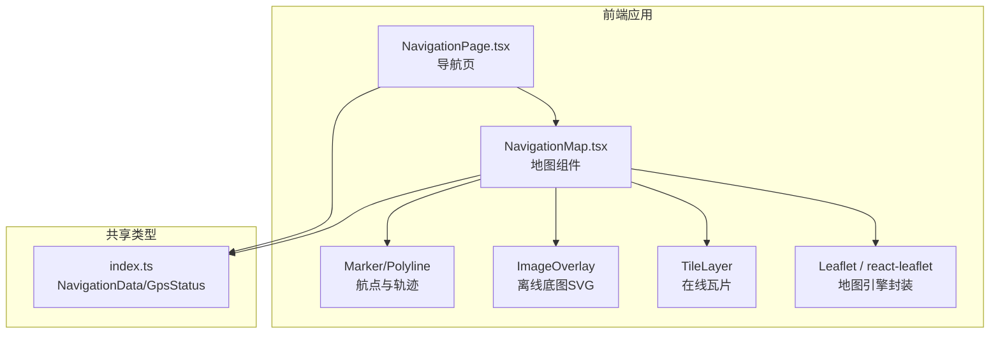
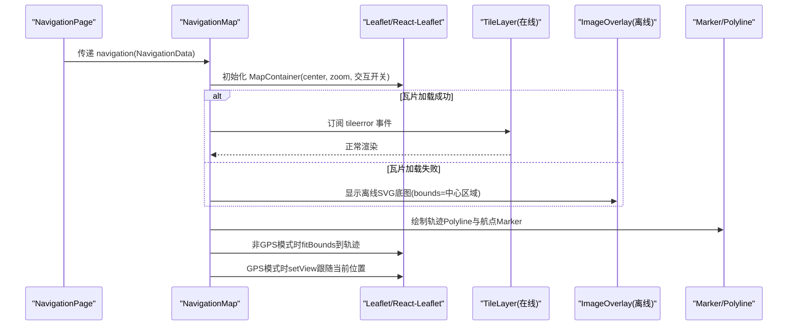
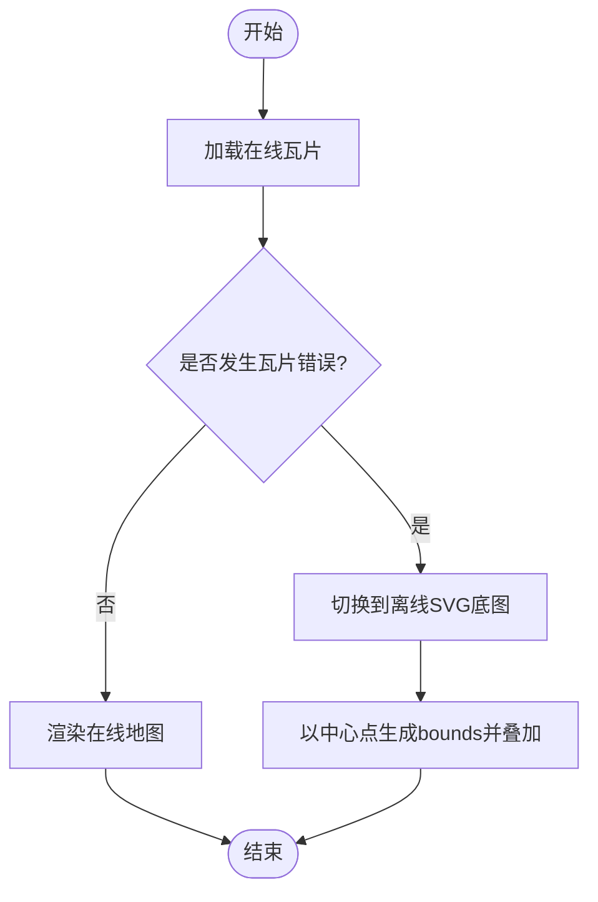
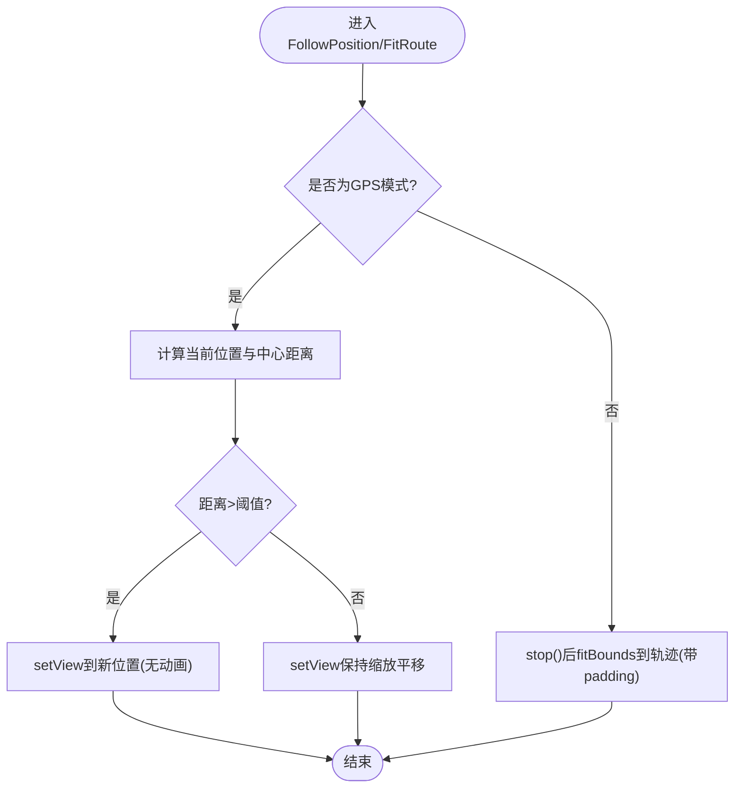
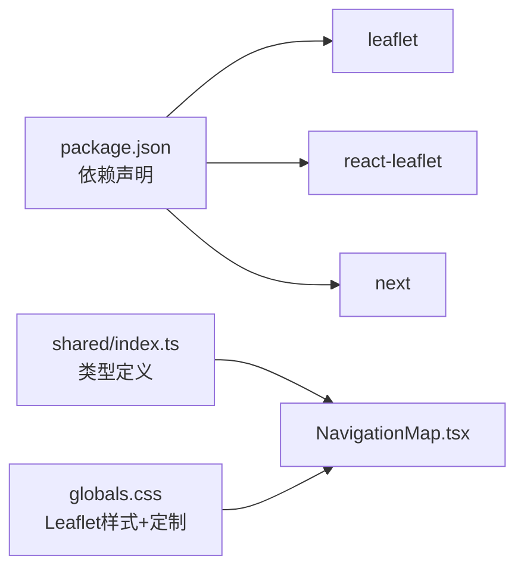

# 地图可视化

<cite>
**本文引用的文件**
- [NavigationMap.tsx](file://fishery-digital-twin-platform/apps/frontend/src/components/map/NavigationMap.tsx)
- [NavigationPage.tsx](file://fishery-digital-twin-platform/apps/frontend/src/components/dashboard/NavigationPage.tsx)
- [index.ts（共享类型）](file://fishery-digital-twin-platform/packages/shared/src/index.ts)
- [package.json（前端依赖）](file://fishery-digital-twin-platform/apps/frontend/package.json)
- [globals.css](file://fishery-digital-twin-platform/apps/frontend/src/app/globals.css)
- [offline-basemap.svg](file://fishery-digital-twin-platform/apps/frontend/public/map/offline-basemap.svg)
</cite>

## 目录
1. [简介](#简介)
2. [项目结构](#项目结构)
3. [核心组件](#核心组件)
4. [架构总览](#架构总览)
5. [详细组件分析](#详细组件分析)
6. [依赖关系分析](#依赖关系分析)
7. [性能考虑](#性能考虑)
8. [故障排查指南](#故障排查指南)
9. [结论](#结论)
10. [附录](#附录)

## 简介
本文件面向“智慧渔业巡检船”的地图可视化能力，围绕 Leaflet 集成、WGS84 坐标映射、离线底图支持、图层管理、交互控制与性能优化进行系统化说明。该实现基于 React + react-leaflet，结合 Next.js 动态导入与全局样式定制，提供轨迹绘制、航点标记、实时定位跟随、离线降级等关键能力。

## 项目结构
- 地图组件位于前端应用的组件目录中，通过页面组件以客户端动态导入方式加载，避免服务端渲染问题。
- 导航数据与 GPS 状态由共享类型定义，确保前后端数据结构一致。
- 全局样式引入 Leaflet 样式并定制容器背景与控件外观。
- 离线底图以静态资源形式提供，在瓦片加载失败时自动切换。

图表来源
- [NavigationPage.tsx:1-145](file://fishery-digital-twin-platform/apps/frontend/src/components/dashboard/NavigationPage.tsx#L1-L145)
- [NavigationMap.tsx:1-137](file://fishery-digital-twin-platform/apps/frontend/src/components/map/NavigationMap.tsx#L1-L137)
- [index.ts（共享类型）:28-63](file://fishery-digital-twin-platform/packages/shared/src/index.ts#L28-L63)

章节来源
- [NavigationPage.tsx:1-145](file://fishery-digital-twin-platform/apps/frontend/src/components/dashboard/NavigationPage.tsx#L1-L145)
- [NavigationMap.tsx:1-137](file://fishery-digital-twin-platform/apps/frontend/src/components/map/NavigationMap.tsx#L1-L137)
- [index.ts（共享类型）:28-63](file://fishery-digital-twin-platform/packages/shared/src/index.ts#L28-L63)

## 核心组件
- NavigationMap：基于 react-leaflet 的地图容器，负责初始化地图、管理瓦片层、轨迹与标记、离线降级与实时跟随。
- NavigationPage：导航页面，聚合平台快照数据，计算航线进度，并将导航数据传递给地图组件。
- 共享类型：定义 NavigationData、NavigationPoint、GpsStatus 等，统一坐标系统与字段语义。

章节来源
- [NavigationMap.tsx:27-86](file://fishery-digital-twin-platform/apps/frontend/src/components/map/NavigationMap.tsx#L27-L86)
- [NavigationPage.tsx:44-145](file://fishery-digital-twin-platform/apps/frontend/src/components/dashboard/NavigationPage.tsx#L44-L145)
- [index.ts（共享类型）:28-63](file://fishery-digital-twin-platform/packages/shared/src/index.ts#L28-L63)

## 架构总览
下图展示了从页面到地图渲染的关键调用链与数据流：页面获取平台快照，将导航数据传入地图组件；地图组件根据数据源决定在线瓦片或离线 SVG 底图，并在需要时自动适配视图范围或跟随实时位置。

图表来源
- [NavigationMap.tsx:43-86](file://fishery-digital-twin-platform/apps/frontend/src/components/map/NavigationMap.tsx#L43-L86)
- [NavigationMap.tsx:88-137](file://fishery-digital-twin-platform/apps/frontend/src/components/map/NavigationMap.tsx#L88-L137)
- [NavigationPage.tsx:44-75](file://fishery-digital-twin-platform/apps/frontend/src/components/dashboard/NavigationPage.tsx#L44-L75)

## 详细组件分析

### 地图初始化与配置
- 使用 MapContainer 设置初始中心、缩放范围与交互行为（滚轮缩放、禁用惯性/动画以提升响应性）。
- 通过 className 绑定自定义样式类，配合全局样式覆盖默认主题。
- 缩放级别限制在合理区间，保证近景细节与整体视野平衡。

章节来源
- [NavigationMap.tsx:43-55](file://fishery-digital-twin-platform/apps/frontend/src/components/map/NavigationMap.tsx#L43-L55)
- [globals.css:46-55](file://fishery-digital-twin-platform/apps/frontend/src/app/globals.css#L46-L55)

### WGS84 坐标映射机制
- 坐标系统：共享类型明确 coordinate_system 为 WGS84，经纬度直接用于 Leaflet 的 LatLng。
- 经纬度到屏幕坐标：由 Leaflet 内部投影与视口变换完成，无需手动转换。
- 缩放级别处理：通过 minZoom/maxZoom 限制；轨迹拟合时限制最大缩放，避免过度放大。
- 投影变换：Leaflet 默认使用 Web Mercator，适用于 OpenStreetMap 瓦片；离线 SVG 通过 bounds 指定地理边界进行叠加。

章节来源
- [index.ts（共享类型）:35-51](file://fishery-digital-twin-platform/packages/shared/src/index.ts#L35-L51)
- [NavigationMap.tsx:29-41](file://fishery-digital-twin-platform/apps/frontend/src/components/map/NavigationMap.tsx#L29-L41)
- [NavigationMap.tsx:88-113](file://fishery-digital-twin-platform/apps/frontend/src/components/map/NavigationMap.tsx#L88-L113)

### 离线底图支持
- 在线瓦片：使用 OpenStreetMap 瓦片服务，监听 tileerror 事件。
- 离线降级：当瓦片加载失败时，切换到本地 SVG 作为 ImageOverlay，并以当前中心点为中心生成一个固定地理范围进行叠加。
- 缓存策略：依赖浏览器对静态资源的 HTTP 缓存；如需更强离线能力，可结合 Service Worker 缓存瓦片或 SVG。
- 降级方案：仅在 tileerror 触发后切换，避免不必要的额外开销。

图表来源
- [NavigationMap.tsx:56-69](file://fishery-digital-twin-platform/apps/frontend/src/components/map/NavigationMap.tsx#L56-L69)
- [offline-basemap.svg](file://fishery-digital-twin-platform/apps/frontend/public/map/offline-basemap.svg)

章节来源
- [NavigationMap.tsx:56-69](file://fishery-digital-twin-platform/apps/frontend/src/components/map/NavigationMap.tsx#L56-L69)

### 图层管理（轨迹、标记、路径、围栏）
- 轨迹与路径：使用 Polyline 绘制闭合或开放轨迹，颜色与线宽可配置。
- 标记点：使用 Marker + Tooltip 展示航点与当前位置，支持永久提示。
- 地理围栏：可通过 Polygon 或 Circle 扩展实现；当前代码未包含，可按相同模式添加。
- 更新策略：基于 useMemo 派生 route/center，减少重复计算；非 GPS 模式下自动 fitBounds 到轨迹。

章节来源
- [NavigationMap.tsx:29-86](file://fishery-digital-twin-platform/apps/frontend/src/components/map/NavigationMap.tsx#L29-L86)

### 交互控制（缩放平移、点击、右键菜单、信息窗口）
- 缩放与平移：启用滚轮缩放，禁用惯性与动画以获得更直接的操控体验。
- 点击事件与信息窗口：可在 Marker/Polyline 上绑定 click 事件与 Popup；当前未显式实现，可按需扩展。
- 右键菜单：Leaflet 支持 contextmenu，可在 MapContainer 或图层上注册；当前未显式实现，可按需扩展。
- 比例尺：底部左侧显示公制比例尺。

章节来源
- [NavigationMap.tsx:43-75](file://fishery-digital-twin-platform/apps/frontend/src/components/map/NavigationMap.tsx#L43-L75)

### 实时定位跟随与轨迹适配
- 实时跟随：当数据源为 GPS 时，使用 setView 将地图中心移动到目标位置；若距离过大则直接跳转，否则保持缩放平滑移动。
- 轨迹适配：非 GPS 模式下，根据轨迹点集自动调整视图范围，确保整条航线可见。

图表来源
- [NavigationMap.tsx:88-137](file://fishery-digital-twin-platform/apps/frontend/src/components/map/NavigationMap.tsx#L88-L137)

章节来源
- [NavigationMap.tsx:88-137](file://fishery-digital-twin-platform/apps/frontend/src/components/map/NavigationMap.tsx#L88-L137)

### 页面集成与数据流
- 页面通过 usePlatformData 获取平台快照，提取导航数据并传递给地图组件。
- 页面侧还计算航线总长度与进度，并在右侧面板展示速度、航向、卫星数、HDOP 等信息。
- 当 GPS 在线且有效时，页面提示“实时坐标已接入”，强调 WGS-84 坐标直接映射到 OSM。

章节来源
- [NavigationPage.tsx:44-145](file://fishery-digital-twin-platform/apps/frontend/src/components/dashboard/NavigationPage.tsx#L44-L145)

## 依赖关系分析
- 运行时依赖：Leaflet 与 react-leaflet 提供地图能力；Next.js 动态导入避免 SSR 问题。
- 类型依赖：共享包定义导航与 GPS 数据结构，确保前后端一致性。
- 样式依赖：全局样式引入 Leaflet CSS，并覆盖容器与控件外观。

图表来源
- [package.json（前端依赖）:14-31](file://fishery-digital-twin-platform/apps/frontend/package.json#L14-L31)
- [index.ts（共享类型）:28-63](file://fishery-digital-twin-platform/packages/shared/src/index.ts#L28-L63)
- [globals.css:1-55](file://fishery-digital-twin-platform/apps/frontend/src/app/globals.css#L1-L55)

章节来源
- [package.json（前端依赖）:14-31](file://fishery-digital-twin-platform/apps/frontend/package.json#L14-L31)
- [index.ts（共享类型）:28-63](file://fishery-digital-twin-platform/packages/shared/src/index.ts#L28-L63)
- [globals.css:1-55](file://fishery-digital-twin-platform/apps/frontend/src/app/globals.css#L1-L55)

## 性能考虑
- 瓦片缓存：依赖浏览器 HTTP 缓存；必要时可引入 Service Worker 缓存瓦片与 SVG 资源。
- 标记点聚合：当前为少量航点与单船标记，未使用聚合；若数据量增大，可引入 marker-cluster 等方案。
- 大数据量渲染：轨迹使用 Polyline 一次性绘制；若点数过多，建议分段绘制或采样降点。
- 内存管理：禁用地图动画与惯性以减少重排；在跟随与适配过程中使用 stop() 避免多余动画队列。
- 组件渲染：使用 useMemo 派生路线与中心，减少重复计算；动态导入地图组件避免首屏阻塞。

[本节为通用性能建议，不直接分析具体文件]

## 故障排查指南
- 瓦片加载失败：检查网络与 OSM 服务可用性；确认 tileerror 事件触发后已切换至离线 SVG。
- 地图不显示：确认 MapContainer 容器高度不为零；检查全局样式是否正确引入 Leaflet CSS。
- 坐标偏移：确认数据源为 WGS84；如使用其他坐标系，需在接入层转换为 WGS84。
- 跟随异常：检查 GPS 数据有效性；若距离过大，会直接跳转；若距离较小，保持缩放平移。
- 轨迹不显示：确认 route 至少有两个点；非 GPS 模式下会自动 fitBounds，若为空则不会触发。

章节来源
- [NavigationMap.tsx:56-86](file://fishery-digital-twin-platform/apps/frontend/src/components/map/NavigationMap.tsx#L56-L86)
- [NavigationMap.tsx:88-137](file://fishery-digital-twin-platform/apps/frontend/src/components/map/NavigationMap.tsx#L88-L137)
- [globals.css:1-55](file://fishery-digital-twin-platform/apps/frontend/src/app/globals.css#L1-L55)

## 结论
该地图可视化实现以简洁可靠的 Leaflet 集成为核心，提供了在线瓦片与离线 SVG 双轨渲染、轨迹与标记绘制、实时定位跟随与轨迹适配等关键能力。通过共享类型约束数据格式、全局样式统一主题，并结合 Next.js 的动态导入提升首屏性能。后续可根据业务需求扩展点击事件、右键菜单、地理围栏与大规模数据聚合等高级功能。

[本节为总结性内容，不直接分析具体文件]

## 附录
- 自定义样式与主题：通过 globals.css 覆盖 .leaflet-container 背景与控件样式；可在 NavigationMap 中通过 pathOptions 调整轨迹颜色与粗细。
- 扩展地理围栏：参考 Polyline 的使用方式，新增 Polygon/Circle 图层即可；注意 bounds 与层级顺序。
- 扩展交互：在 Marker/Polyline 上绑定 click 事件与 Popup；在 MapContainer 上注册 contextmenu 事件以实现右键菜单。
- 离线增强：结合 Service Worker 缓存瓦片与 SVG，提升弱网环境下的可用性。

[本节为补充说明，不直接分析具体文件]