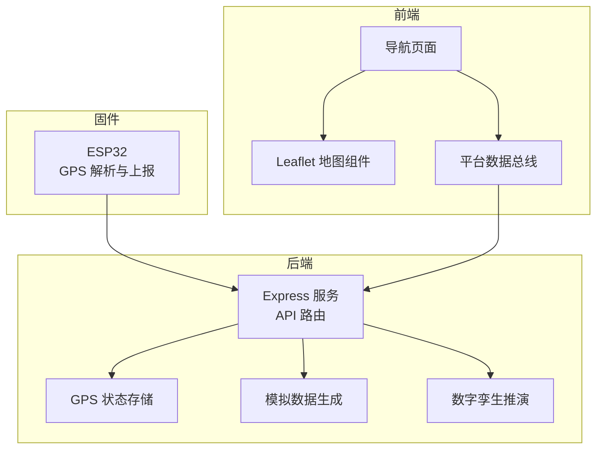
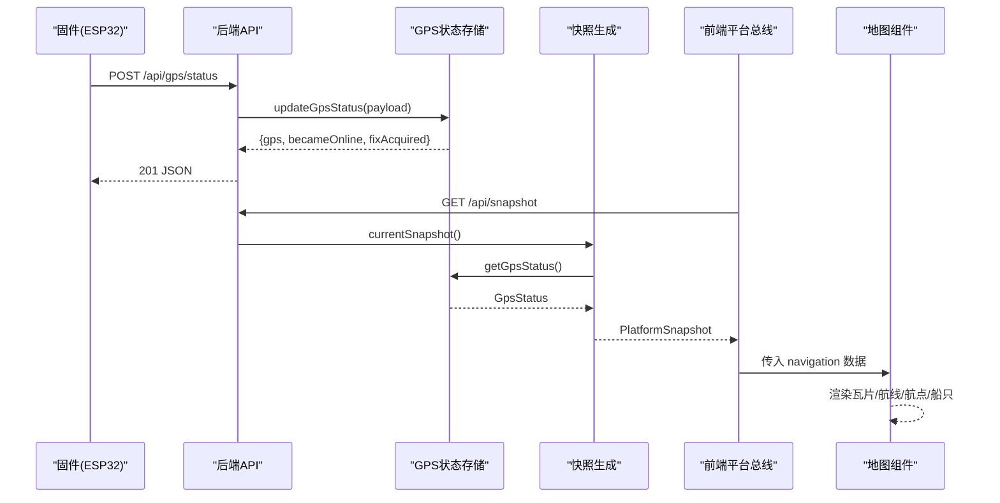
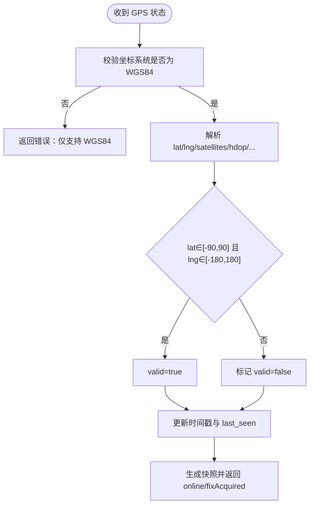
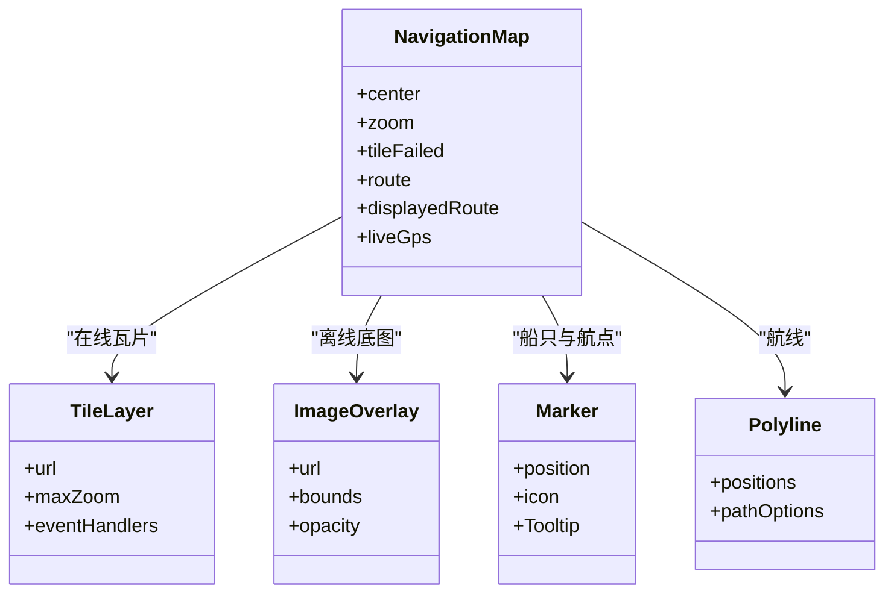
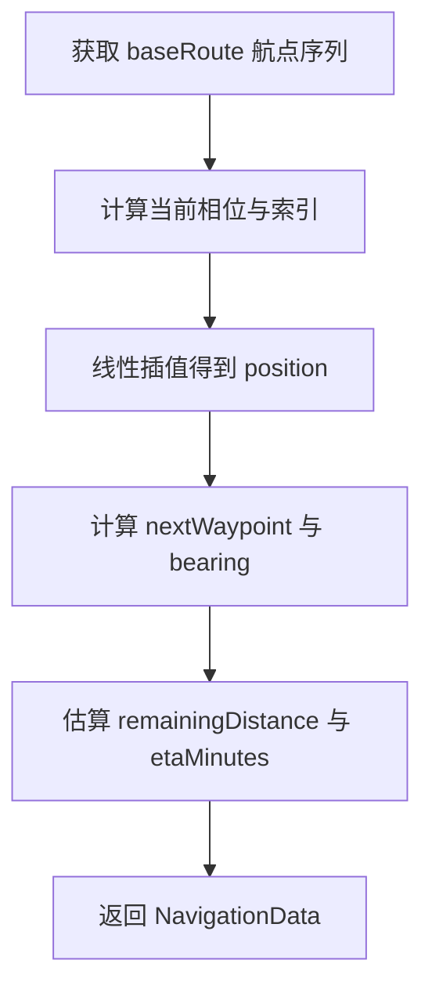
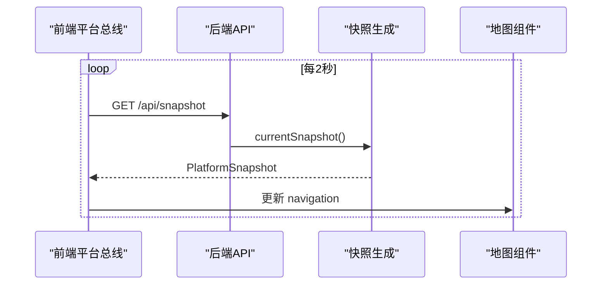
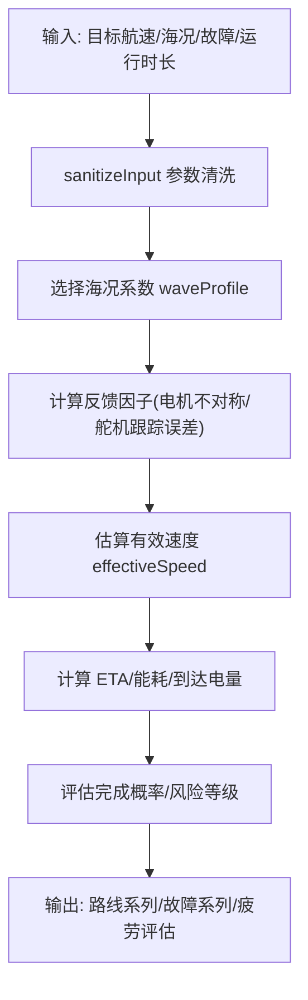
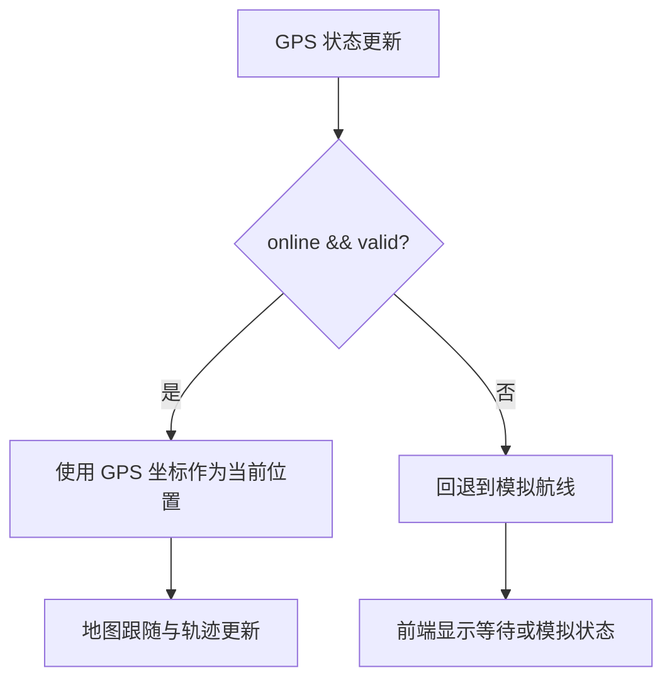
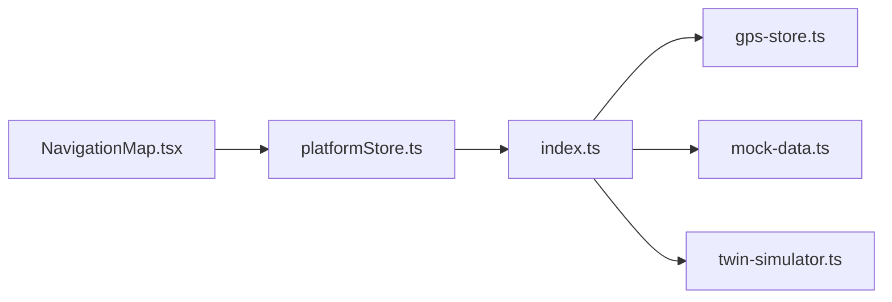

# 导航定位系统

<cite>
**本文引用的文件**
- [apps/backend/src/index.ts](file://fishery-digital-twin-platform/apps/backend/src/index.ts)
- [apps/backend/src/gps-store.ts](file://fishery-digital-twin-platform/apps/backend/src/gps-store.ts)
- [apps/backend/src/mock-data.ts](file://fishery-digital-twin-platform/apps/backend/src/mock-data.ts)
- [apps/backend/src/twin-simulator.ts](file://fishery-digital-twin-platform/apps/backend/src/twin-simulator.ts)
- [apps/frontend/src/components/map/NavigationMap.tsx](file://fishery-digital-twin-platform/apps/frontend/src/components/map/NavigationMap.tsx)
- [apps/frontend/src/components/dashboard/NavigationPage.tsx](file://fishery-digital-twin-platform/apps/frontend/src/components/dashboard/NavigationPage.tsx)
- [apps/frontend/src/lib/platformStore.ts](file://fishery-digital-twin-platform/apps/frontend/src/lib/platformStore.ts)
- [firmware/esp32/maker_esp32_pro_gps_only/maker_esp32_pro_gps_only.ino](file://fishery-digital-twin-platform/firmware/esp32/maker_esp32_pro_gps_only/maker_esp32_pro_gps_only.ino)
</cite>

## 目录
1. [简介](#简介)
2. [项目结构](#项目结构)
3. [核心组件](#核心组件)
4. [架构总览](#架构总览)
5. [详细组件分析](#详细组件分析)
6. [依赖关系分析](#依赖关系分析)
7. [性能考虑](#性能考虑)
8. [故障排查指南](#故障排查指南)
9. [结论](#结论)
10. [附录](#附录)

## 简介
本文件面向船舶导航与位置跟踪功能，系统性说明 GPS 数据处理、地图可视化、航线规划、实时位置跟踪、导航算法、异常处理机制以及配置调试与性能优化要点。系统由后端服务、前端界面与固件三部分组成：后端负责数据聚合、GPS 状态管理、仿真与数字孪生推演；前端基于 Leaflet 实现地图展示与交互；固件通过串口上报 NMEA/GPS 数据至后端，形成端到端的导航闭环。

## 项目结构
- 后端（Node/Express）
  - 入口与路由：统一暴露健康检查、平台快照、导航、GPS、设备控制等接口，并集成 UDP 发现服务。
  - GPS 存储：维护 GPS 在线状态、坐标、精度、速度、航向等指标，提供更新与读取。
  - 模拟数据：生成默认巡航路线、船位插值、速度与航向等，用于无真实 GPS 时的演示。
  - 数字孪生：根据海况、执行机构反馈、电池与运行时长进行能耗、风险与疲劳评估。
- 前端（Next.js + React + Leaflet）
  - 地图组件：使用 react-leaflet 渲染瓦片图层、离线底图、航线、航点与船只图标，支持跟随与自动适配视图。
  - 导航页面：汇总当前任务、进度、速度、航向、卫星数、HDOP、剩余距离与 ETA 等关键信息。
  - 平台数据总线：集中轮询后端快照与设备反馈，驱动 UI 刷新。
- 固件（ESP32）
  - 解析 GPS 模块输出，构造状态报文并通过 HTTP POST 上报到后端 GPS 状态接口。

**图表来源**
- [apps/backend/src/index.ts:197-222](file://fishery-digital-twin-platform/apps/backend/src/index.ts#L197-L222)
- [apps/backend/src/gps-store.ts:59-102](file://fishery-digital-twin-platform/apps/backend/src/gps-store.ts#L59-L102)
- [apps/backend/src/mock-data.ts:151-176](file://fishery-digital-twin-platform/apps/backend/src/mock-data.ts#L151-L176)
- [apps/backend/src/twin-simulator.ts:74-253](file://fishery-digital-twin-platform/apps/backend/src/twin-simulator.ts#L74-L253)
- [apps/frontend/src/components/map/NavigationMap.tsx:27-86](file://fishery-digital-twin-platform/apps/frontend/src/components/map/NavigationMap.tsx#L27-L86)
- [apps/frontend/src/components/dashboard/NavigationPage.tsx:44-145](file://fishery-digital-twin-platform/apps/frontend/src/components/dashboard/NavigationPage.tsx#L44-L145)
- [apps/frontend/src/lib/platformStore.ts:98-139](file://fishery-digital-twin-platform/apps/frontend/src/lib/platformStore.ts#L98-L139)

**章节来源**
- [apps/backend/src/index.ts:1-599](file://fishery-digital-twin-platform/apps/backend/src/index.ts#L1-L599)
- [apps/frontend/src/components/map/NavigationMap.tsx:1-137](file://fishery-digital-twin-platform/apps/frontend/src/components/map/NavigationMap.tsx#L1-L137)
- [apps/frontend/src/components/dashboard/NavigationPage.tsx:1-145](file://fishery-digital-twin-platform/apps/frontend/src/components/dashboard/NavigationPage.tsx#L1-L145)
- [apps/frontend/src/lib/platformStore.ts:1-196](file://fishery-digital-twin-platform/apps/frontend/src/lib/platformStore.ts#L1-L196)

## 核心组件
- GPS 状态管理
  - 接收来自固件的 GPS 状态，校验坐标范围与有效性，记录时间戳与在线超时判断，输出统一的 GpsStatus。
- 导航数据生成
  - 当 GPS 在线且有效时，直接使用 GPS 坐标作为当前位置；否则回退到模拟航线，计算插值位置、速度、航向与剩余距离。
- 地图可视化
  - 基于 Leaflet 渲染 OpenStreetMap 瓦片，失败时切换为本地离线 SVG 底图；绘制航线、航点与船只标记；支持实时跟随与自动适配视图。
- 平台数据总线
  - 前端每 2 秒拉取一次平台快照，每 1 秒拉取舵机与推进器反馈；连接失败时降级显示，避免阻塞 UI。
- 数字孪生推演
  - 输入目标航速、海况、故障类型与严重度，结合执行机构反馈与电池状态，估算能耗、ETA、完成概率、风险等级与部件疲劳。

**章节来源**
- [apps/backend/src/gps-store.ts:59-102](file://fishery-digital-twin-platform/apps/backend/src/gps-store.ts#L59-L102)
- [apps/backend/src/index.ts:197-222](file://fishery-digital-twin-platform/apps/backend/src/index.ts#L197-L222)
- [apps/backend/src/mock-data.ts:151-176](file://fishery-digital-twin-platform/apps/backend/src/mock-data.ts#L151-L176)
- [apps/frontend/src/components/map/NavigationMap.tsx:27-86](file://fishery-digital-twin-platform/apps/frontend/src/components/map/NavigationMap.tsx#L27-L86)
- [apps/frontend/src/lib/platformStore.ts:98-139](file://fishery-digital-twin-platform/apps/frontend/src/lib/platformStore.ts#L98-L139)
- [apps/backend/src/twin-simulator.ts:74-253](file://fishery-digital-twin-platform/apps/backend/src/twin-simulator.ts#L74-L253)

## 架构总览
系统采用“固件上报 → 后端聚合 → 前端展示”的分层架构。后端通过统一快照接口将水质、电池、导航、AI 报告与设备状态整合，前端以订阅模式消费快照并驱动地图与仪表盘。GPS 数据经严格校验后进入导航管线，若无效则自动回退到模拟航线，保证界面始终可用。

**图表来源**
- [apps/backend/src/index.ts:348-365](file://fishery-digital-twin-platform/apps/backend/src/index.ts#L348-L365)
- [apps/backend/src/index.ts:247-262](file://fishery-digital-twin-platform/apps/backend/src/index.ts#L247-L262)
- [apps/backend/src/gps-store.ts:59-102](file://fishery-digital-twin-platform/apps/backend/src/gps-store.ts#L59-L102)
- [apps/frontend/src/lib/platformStore.ts:98-139](file://fishery-digital-twin-platform/apps/frontend/src/lib/platformStore.ts#L98-L139)
- [apps/frontend/src/components/map/NavigationMap.tsx:27-86](file://fishery-digital-twin-platform/apps/frontend/src/components/map/NavigationMap.tsx#L27-L86)

## 详细组件分析

### GPS 数据处理
- 原始数据解析
  - 固件侧解析 NMEA 或 GPS 模块输出，提取经纬度、卫星数、HDOP、海拔、速度、航向等字段，并以 JSON 形式 POST 到后端 GPS 状态接口。
- 坐标格式转换
  - 后端强制要求 coordinate_system 为 WGS84，仅接受 WGS84 坐标；前端直接以 WGS84 经纬度映射到 Leaflet 地图。
- 精度评估
  - HDOP 用于定位精度评估；前端在 HDOP > 3 时给出警告提示。
- 误差修正
  - 当前未实现滤波或漂移修正；可通过后续引入卡尔曼滤波或滑动窗口平滑提升轨迹稳定性。

**图表来源**
- [apps/backend/src/gps-store.ts:59-102](file://fishery-digital-twin-platform/apps/backend/src/gps-store.ts#L59-L102)

**章节来源**
- [apps/backend/src/gps-store.ts:59-102](file://fishery-digital-twin-platform/apps/backend/src/gps-store.ts#L59-L102)
- [apps/frontend/src/components/dashboard/NavigationPage.tsx:94-105](file://fishery-digital-twin-platform/apps/frontend/src/components/dashboard/NavigationPage.tsx#L94-L105)
- [firmware/esp32/maker_esp32_pro_gps_only/maker_esp32_pro_gps_only.ino:291-317](file://fishery-digital-twin-platform/firmware/esp32/maker_esp32_pro_gps_only/maker_esp32_pro_gps_only.ino#L291-L317)

### 地图可视化
- Leaflet 集成
  - 使用 react-leaflet 的 MapContainer、TileLayer、Marker、Polyline、ScaleControl 等组件构建地图。
- WGS84 坐标映射
  - 直接将 WGS84 经纬度作为 Leaflet 坐标；中心点随船只位置更新，缩放级别限制在 15-19。
- 离线底图支持
  - 当瓦片加载失败时，自动切换到本地离线 SVG 底图，确保弱网或离线环境仍可显示基础地理信息。
- 图层管理
  - 航线闭合显示（首尾相连），航点带标签，船只图标固定于中心；非 GPS 模式下自动适配视图以包含整条航线。

**图表来源**
- [apps/frontend/src/components/map/NavigationMap.tsx:27-86](file://fishery-digital-twin-platform/apps/frontend/src/components/map/NavigationMap.tsx#L27-L86)

**章节来源**
- [apps/frontend/src/components/map/NavigationMap.tsx:27-86](file://fishery-digital-twin-platform/apps/frontend/src/components/map/NavigationMap.tsx#L27-L86)

### 航线规划
- 路径计算
  - 模拟模式下，后端维护一组预定义航点，按时间相位线性插值得到当前位置，并计算下一航点与航向。
- 航点设置
  - 航点包含经纬度与标签；前端以 Marker 标注并在 Tooltip 中显示名称。
- 距离测量
  - 前端使用 Haversine 公式计算航线总长度；后端在模拟模式下估算剩余距离与 ETA。
- 偏航检测
  - 当前未实现偏航检测；可在后续加入最近点投影与阈值判定，触发偏航告警与重新规划。

**图表来源**
- [apps/backend/src/mock-data.ts:151-176](file://fishery-digital-twin-platform/apps/backend/src/mock-data.ts#L151-L176)

**章节来源**
- [apps/backend/src/mock-data.ts:151-176](file://fishery-digital-twin-platform/apps/backend/src/mock-data.ts#L151-L176)
- [apps/frontend/src/components/dashboard/NavigationPage.tsx:13-32](file://fishery-digital-twin-platform/apps/frontend/src/components/dashboard/NavigationPage.tsx#L13-L32)

### 实时位置跟踪
- 位置更新频率
  - 前端每 2 秒拉取一次平台快照；设备反馈（舵机/推进器）每 1 秒拉取一次，保证导航与控制的低延迟。
- 轨迹绘制
  - 地图组件将 route 数组转换为折线，并在 GPS 模式下持续跟随船只位置；非 GPS 模式自动适配视图以显示整条航线。
- 历史回放
  - 当前未提供历史回放控件；可基于 waterHistory 或新增轨迹存储接口扩展回放能力。
- 统计分析
  - 前端统计总航程、剩余距离与 ETA；后端数字孪生提供能耗、完成概率与风险等级等统计。

**图表来源**
- [apps/frontend/src/lib/platformStore.ts:98-139](file://fishery-digital-twin-platform/apps/frontend/src/lib/platformStore.ts#L98-L139)
- [apps/backend/src/index.ts:247-262](file://fishery-digital-twin-platform/apps/backend/src/index.ts#L247-L262)
- [apps/frontend/src/components/map/NavigationMap.tsx:27-86](file://fishery-digital-twin-platform/apps/frontend/src/components/map/NavigationMap.tsx#L27-L86)

**章节来源**
- [apps/frontend/src/lib/platformStore.ts:98-139](file://fishery-digital-twin-platform/apps/frontend/src/lib/platformStore.ts#L98-L139)
- [apps/backend/src/index.ts:247-262](file://fishery-digital-twin-platform/apps/backend/src/index.ts#L247-L262)
- [apps/frontend/src/components/map/NavigationMap.tsx:27-86](file://fishery-digital-twin-platform/apps/frontend/src/components/map/NavigationMap.tsx#L27-L86)

### 导航算法
- 最短路径计算
  - 当前未实现动态最短路径；可接入栅格化水域或图搜索算法（A*/Dijkstra）并结合障碍物与禁航区。
- 避障策略
  - 数字孪生推演中包含故障场景（如舵机卡滞、电机降额、反馈丢失）对速度与航向的影响，可作为避障与降级的参考依据。
- 转向控制
  - 模拟模式下通过 bearingBetween 计算航向；实际转向需结合推进器与舵机控制回路。
- 速度调节
  - 数字孪生根据海况、负载与反馈因子估算有效航速，并据此计算 ETA 与能耗；前端展示当前速度与 ETA。

**图表来源**
- [apps/backend/src/twin-simulator.ts:35-50](file://fishery-digital-twin-platform/apps/backend/src/twin-simulator.ts#L35-L50)
- [apps/backend/src/twin-simulator.ts:74-253](file://fishery-digital-twin-platform/apps/backend/src/twin-simulator.ts#L74-L253)

**章节来源**
- [apps/backend/src/twin-simulator.ts:74-253](file://fishery-digital-twin-platform/apps/backend/src/twin-simulator.ts#L74-L253)
- [apps/backend/src/mock-data.ts:100-112](file://fishery-digital-twin-platform/apps/backend/src/mock-data.ts#L100-L112)

### 异常处理机制
- GPS 信号丢失
  - 后端通过 last_seen 时间戳与超时阈值判断在线状态；若失效则导航回退到模拟航线，前端显示“GPS 等待定位”。
- 定位漂移
  - 当前未做漂移抑制；建议在 GPS 存储中加入滑动平均或置信度加权，结合 HDOP 阈值过滤异常点。
- 地图加载失败
  - 瓦片加载失败时切换为本地离线 SVG 底图，保证基本可视性。
- 网络与服务异常
  - 前端平台总线在请求失败时标记 snapshotConnected=false，避免无限重试；设备反馈使用 Promise.allSettled 容错。

**图表来源**
- [apps/backend/src/index.ts:197-222](file://fishery-digital-twin-platform/apps/backend/src/index.ts#L197-L222)
- [apps/frontend/src/components/map/NavigationMap.tsx:56-69](file://fishery-digital-twin-platform/apps/frontend/src/components/map/NavigationMap.tsx#L56-L69)
- [apps/frontend/src/lib/platformStore.ts:98-139](file://fishery-digital-twin-platform/apps/frontend/src/lib/platformStore.ts#L98-L139)

**章节来源**
- [apps/backend/src/gps-store.ts:40-53](file://fishery-digital-twin-platform/apps/backend/src/gps-store.ts#L40-L53)
- [apps/backend/src/index.ts:197-222](file://fishery-digital-twin-platform/apps/backend/src/index.ts#L197-L222)
- [apps/frontend/src/components/map/NavigationMap.tsx:56-69](file://fishery-digital-twin-platform/apps/frontend/src/components/map/NavigationMap.tsx#L56-L69)
- [apps/frontend/src/lib/platformStore.ts:98-139](file://fishery-digital-twin-platform/apps/frontend/src/lib/platformStore.ts#L98-L139)

## 依赖关系分析
- 后端内部依赖
  - index.ts 依赖 gps-store、mock-data、twin-simulator 与 persistence，组合成统一快照。
  - gps-store 提供 GPS 状态读写；mock-data 提供默认航线与状态；twin-simulator 提供推演结果。
- 前后端耦合
  - 前端 platformStore 依赖后端 /api/snapshot、/api/servos、/api/propulsion；NavigationMap 依赖 NavigationData 结构。
- 固件耦合
  - 固件通过 HTTP POST 上报 GPS 状态；后端在收到后更新状态并影响导航源选择。

**图表来源**
- [apps/backend/src/index.ts:197-262](file://fishery-digital-twin-platform/apps/backend/src/index.ts#L197-L262)
- [apps/frontend/src/lib/platformStore.ts:98-139](file://fishery-digital-twin-platform/apps/frontend/src/lib/platformStore.ts#L98-L139)
- [apps/frontend/src/components/map/NavigationMap.tsx:27-86](file://fishery-digital-twin-platform/apps/frontend/src/components/map/NavigationMap.tsx#L27-L86)

**章节来源**
- [apps/backend/src/index.ts:197-262](file://fishery-digital-twin-platform/apps/backend/src/index.ts#L197-L262)
- [apps/frontend/src/lib/platformStore.ts:98-139](file://fishery-digital-twin-platform/apps/frontend/src/lib/platformStore.ts#L98-L139)
- [apps/frontend/src/components/map/NavigationMap.tsx:27-86](file://fishery-digital-twin-platform/apps/frontend/src/components/map/NavigationMap.tsx#L27-L86)

## 性能考虑
- 前端轮询间隔
  - 快照 2 秒、设备反馈 1 秒，平衡实时性与网络开销；可根据带宽与设备能力调整。
- 地图渲染优化
  - 关闭动画与惯性以减少重绘；仅在 GPS 模式下跟随，非 GPS 模式一次性适配视图。
- 后端计算
  - 数字孪生推演为轻量级数学模型，适合高频调用；注意限流与缓存策略以避免重复计算。
- 离线与弱网
  - 瓦片失败自动切换离线底图；前端连接失败时降级显示，不阻断主流程。

[本节为通用指导，无需特定文件引用]

## 故障排查指南
- GPS 无法定位
  - 检查固件是否成功解析 NMEA 并上报；确认后端 GPS 状态接口返回 becameOnline/fixAcquired；查看 HDOP 与卫星数。
- 地图不显示或闪烁
  - 检查瓦片服务可用性；确认 tileerror 事件触发后是否切换离线底图；验证 center 与 zoom 设置。
- 导航数据不更新
  - 检查前端平台总线连接状态；确认 /api/snapshot 返回正常；观察 snapshotConnected 标志。
- 数字孪生结果异常
  - 检查输入参数是否被 sanitizeInput 约束；核对海况、故障类型与严重度；确认执行机构反馈是否在线。

**章节来源**
- [apps/backend/src/index.ts:348-365](file://fishery-digital-twin-platform/apps/backend/src/index.ts#L348-L365)
- [apps/frontend/src/components/map/NavigationMap.tsx:56-69](file://fishery-digital-twin-platform/apps/frontend/src/components/map/NavigationMap.tsx#L56-L69)
- [apps/frontend/src/lib/platformStore.ts:98-139](file://fishery-digital-twin-platform/apps/frontend/src/lib/platformStore.ts#L98-L139)
- [apps/backend/src/twin-simulator.ts:35-50](file://fishery-digital-twin-platform/apps/backend/src/twin-simulator.ts#L35-L50)

## 结论
该系统实现了从固件 GPS 上报到前端地图展示的完整导航链路。GPS 数据经过严格校验与在线超时管理，导航在无 GPS 时自动回退到模拟航线，地图具备离线底图容错能力。数字孪生提供了能耗、风险与疲劳评估，为航线规划与避障策略提供依据。后续可增强偏航检测、轨迹平滑、最短路径计算与历史回放等功能，以提升导航系统的鲁棒性与实用性。

[本节为总结，无需特定文件引用]

## 附录
- 配置项与环境变量
  - 端口与主机：PORT、HOST
  - 设备发现：UISYS_DISCOVERY_PORT
  - CORS 白名单：CORS_ORIGIN
  - 控制令牌：UISYS_API_TOKEN
  - 传感器新鲜度：UISYS_SENSOR_FRESHNESS_MS
  - 演示水样开关与间隔：UISYS_DEMO_WATER_FEED、UISYS_DEMO_WATER_INTERVAL_MS
- 调试建议
  - 使用 /api/health 检查服务状态与 GPS、舵机、推进器在线情况。
  - 通过 /api/logs 查看系统日志，定位 GPS 上线、定位获得与数据接收事件。
  - 在前端控制台观察 platformStore 的连接状态与快照更新时间。

**章节来源**
- [apps/backend/src/index.ts:48-76](file://fishery-digital-twin-platform/apps/backend/src/index.ts#L48-L76)
- [apps/backend/src/index.ts:322-334](file://fishery-digital-twin-platform/apps/backend/src/index.ts#L322-L334)
- [apps/backend/src/index.ts:557-557](file://fishery-digital-twin-platform/apps/backend/src/index.ts#L557-L557)