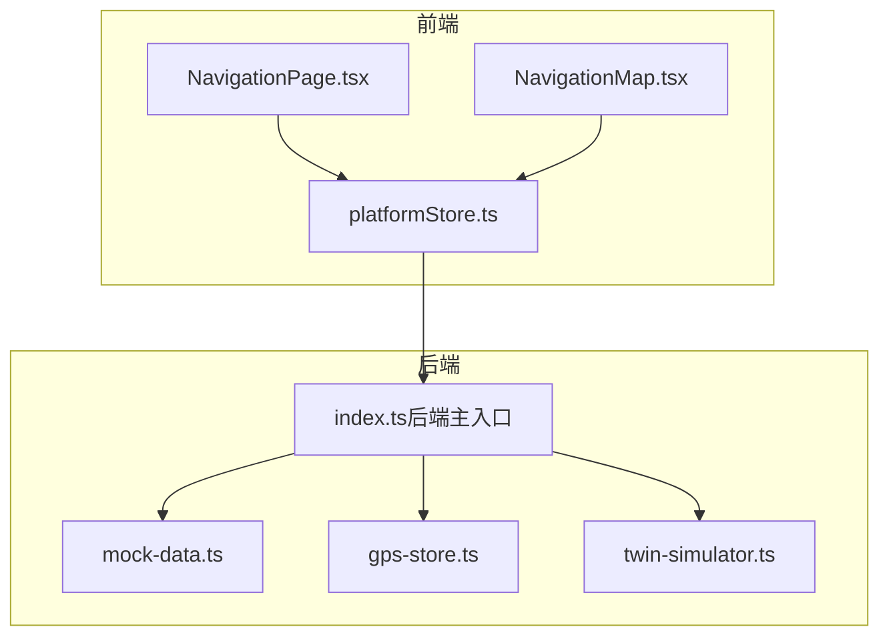
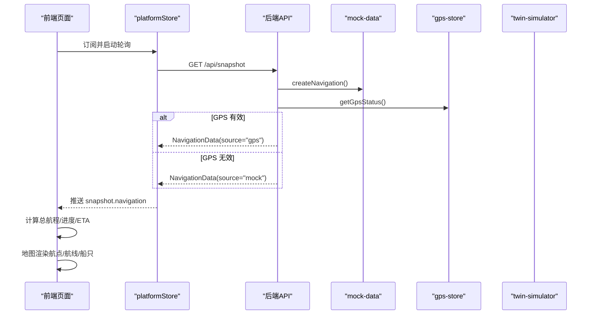
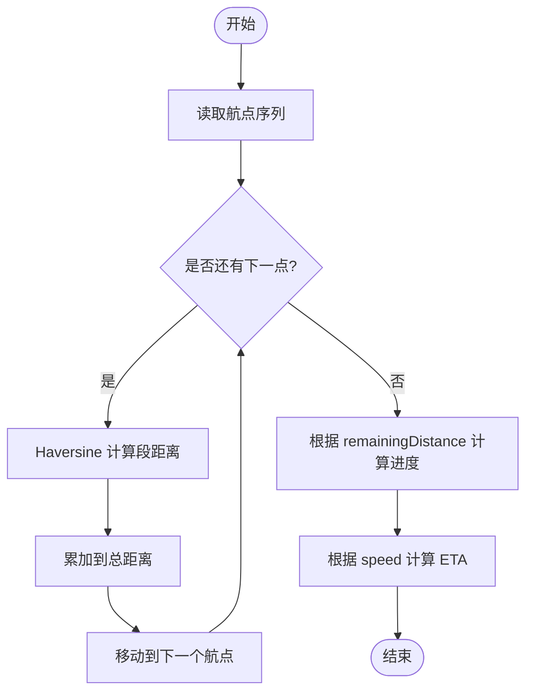
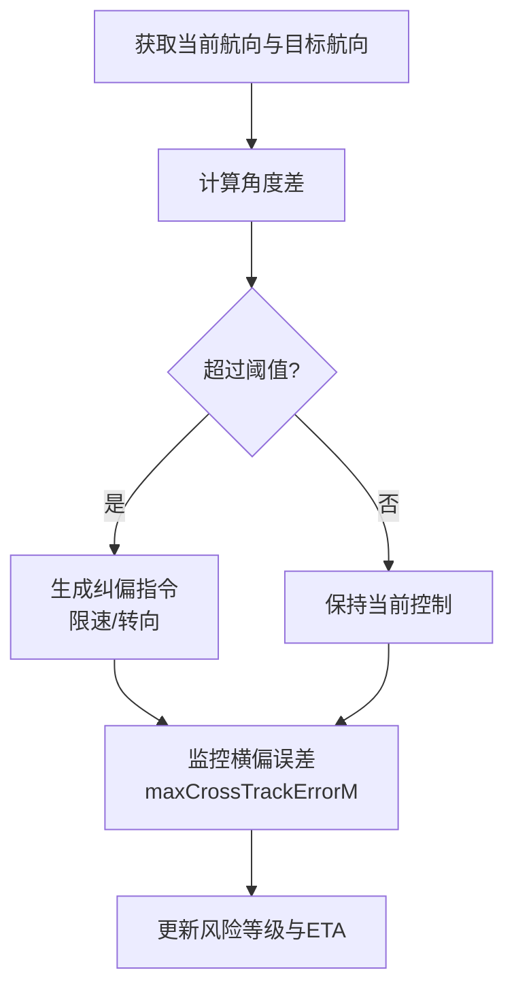
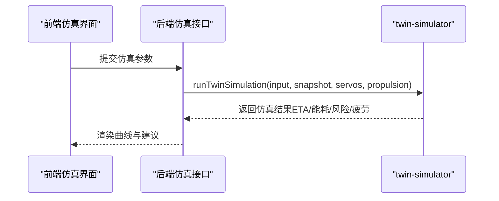
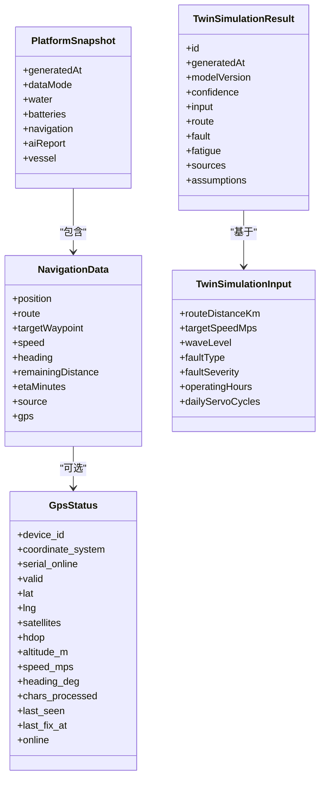

# 航线规划

<cite>
**本文引用的文件**
- [NavigationPage.tsx](file://fishery-digital-twin-platform/apps/frontend/src/components/dashboard/NavigationPage.tsx)
- [NavigationMap.tsx](file://fishery-digital-twin-platform/apps/frontend/src/components/map/NavigationMap.tsx)
- [mock-data.ts](file://fishery-digital-twin-platform/apps/backend/src/mock-data.ts)
- [twin-simulator.ts](file://fishery-digital-twin-platform/apps/backend/src/twin-simulator.ts)
- [gps-store.ts](file://fishery-digital-twin-platform/apps/backend/src/gps-store.ts)
- [index.ts（后端主入口）](file://fishery-digital-twin-platform/apps/backend/src/index.ts)
- [index.ts（共享类型定义）](file://fishery-digital-twin-platform/packages/shared/src/index.ts)
- [platformStore.ts](file://fishery-digital-twin-platform/apps/frontend/src/lib/platformStore.ts)
</cite>

## 目录
1. [简介](#简介)
2. [项目结构](#项目结构)
3. [核心组件](#核心组件)
4. [架构总览](#架构总览)
5. [详细组件分析](#详细组件分析)
6. [依赖关系分析](#依赖关系分析)
7. [性能考虑](#性能考虑)
8. [故障排查指南](#故障排查指南)
9. [结论](#结论)
10. [附录](#附录)

## 简介
本文件面向“航线规划”功能，围绕路径计算、航点管理、距离与导航计算、偏航检测与纠正、导入导出、模拟预演与优化建议进行系统化说明。当前代码库实现了：
- 基于 Haversine 的累积距离计算与进度估算
- 基于 GPS 或模拟数据的实时位置与航向展示
- 地图可视化（航点、航线、跟随定位）
- 双模导航数据源（GPS 实时与演示路线）
- 数字孪生仿真（能耗、ETA、风险、疲劳）
- 前端状态管理与轮询刷新

尚未实现的功能（仓库中未包含对应逻辑）包括：GPX 导入导出、障碍物规避的最短路径搜索算法、航点排序与坐标编辑界面、自动纠偏控制指令下发等。文档将明确标注哪些能力已实现、哪些为扩展建议。

## 项目结构
与航线规划相关的前后端关键模块如下：
- 前端展示与交互
  - 导航页面：计算总航程、剩余距离、ETA、进度条、航点列表
  - 地图组件：绘制航线、航点、船只图标；支持离线底图与跟随定位
  - 平台数据总线：定时拉取快照与设备反馈，驱动 UI 更新
- 后端数据与仿真
  - 模拟导航数据：生成基础航点序列、插值当前位置、速度、航向、剩余距离、ETA
  - GPS 状态存储：校验坐标范围、有效性、在线超时、最新定位时间
  - 数字孪生仿真：ETA、能耗、到达电量、最大横向偏差、完成概率、风险等级、部件疲劳
  - API 路由：提供 /api/navigation、/api/gps、/api/snapshot 等接口

图表来源
- [NavigationPage.tsx:1-145](file://fishery-digital-twin-platform/apps/frontend/src/components/dashboard/NavigationPage.tsx#L1-L145)
- [NavigationMap.tsx:1-137](file://fishery-digital-twin-platform/apps/frontend/src/components/map/NavigationMap.tsx#L1-L137)
- [platformStore.ts:1-196](file://fishery-digital-twin-platform/apps/frontend/src/lib/platformStore.ts#L1-L196)
- [mock-data.ts:1-258](file://fishery-digital-twin-platform/apps/backend/src/mock-data.ts#L1-L258)
- [gps-store.ts:1-102](file://fishery-digital-twin-platform/apps/backend/src/gps-store.ts#L1-L102)
- [twin-simulator.ts:1-254](file://fishery-digital-twin-platform/apps/backend/src/twin-simulator.ts#L1-L254)
- [index.ts（后端主入口）:197-365](file://fishery-digital-twin-platform/apps/backend/src/index.ts#L197-L365)

章节来源
- [NavigationPage.tsx:1-145](file://fishery-digital-twin-platform/apps/frontend/src/components/dashboard/NavigationPage.tsx#L1-L145)
- [NavigationMap.tsx:1-137](file://fishery-digital-twin-platform/apps/frontend/src/components/map/NavigationMap.tsx#L1-L137)
- [platformStore.ts:1-196](file://fishery-digital-twin-platform/apps/frontend/src/lib/platformStore.ts#L1-L196)
- [mock-data.ts:1-258](file://fishery-digital-twin-platform/apps/backend/src/mock-data.ts#L1-L258)
- [gps-store.ts:1-102](file://fishery-digital-twin-platform/apps/backend/src/gps-store.ts#L1-L102)
- [twin-simulator.ts:1-254](file://fishery-digital-twin-platform/apps/backend/src/twin-simulator.ts#L1-L254)
- [index.ts（后端主入口）:197-365](file://fishery-digital-twin-platform/apps/backend/src/index.ts#L197-L365)

## 核心组件
- 导航页面（NavigationPage）
  - 使用 Haversine 公式计算总航程
  - 根据 remainingDistance 计算进度百分比
  - 显示航点列表、当前速度、航向、卫星数/HDOP、ETA
- 地图组件（NavigationMap）
  - 渲染航点、航线折线、船只标记
  - 非 GPS 模式自动适配视图到整条航线
  - GPS 模式跟随当前位置移动
- 平台数据总线（platformStore）
  - 每 2 秒拉取平台快照（含导航数据）
  - 每 1 秒拉取舵机与推进器反馈
- 后端模拟导航（mock-data）
  - 固定基础航点序列
  - 按时间相位插值当前位置、目标航点、速度、航向、剩余距离、ETA
- GPS 状态存储（gps-store）
  - 校验坐标范围、有效性、在线超时
  - 输出 online/valid/last_fix_at 等字段
- 数字孪生仿真（twin-simulator）
  - 输入：航距、目标速度、海况、故障类型与严重度、运行时长、日动作次数
  - 输出：ETA、能耗、到达电量、最大横向偏差、完成概率、风险等级、系列曲线、部件疲劳与健康度

章节来源
- [NavigationPage.tsx:13-32](file://fishery-digital-twin-platform/apps/frontend/src/components/dashboard/NavigationPage.tsx#L13-L32)
- [NavigationPage.tsx:44-145](file://fishery-digital-twin-platform/apps/frontend/src/components/dashboard/NavigationPage.tsx#L44-L145)
- [NavigationMap.tsx:27-85](file://fishery-digital-twin-platform/apps/frontend/src/components/map/NavigationMap.tsx#L27-L85)
- [platformStore.ts:20-25](file://fishery-digital-twin-platform/apps/frontend/src/lib/platformStore.ts#L20-L25)
- [platformStore.ts:98-139](file://fishery-digital-twin-platform/apps/frontend/src/lib/platformStore.ts#L98-L139)
- [mock-data.ts:11-21](file://fishery-digital-twin-platform/apps/backend/src/mock-data.ts#L11-L21)
- [mock-data.ts:151-176](file://fishery-digital-twin-platform/apps/backend/src/mock-data.ts#L151-L176)
- [gps-store.ts:40-102](file://fishery-digital-twin-platform/apps/backend/src/gps-store.ts#L40-L102)
- [twin-simulator.ts:74-254](file://fishery-digital-twin-platform/apps/backend/src/twin-simulator.ts#L74-L254)

## 架构总览
导航数据流从后端到前端的时序如下：

图表来源
- [platformStore.ts:98-139](file://fishery-digital-twin-platform/apps/frontend/src/lib/platformStore.ts#L98-L139)
- [index.ts（后端主入口）:197-222](file://fishery-digital-twin-platform/apps/backend/src/index.ts#L197-L222)
- [mock-data.ts:151-176](file://fishery-digital-twin-platform/apps/backend/src/mock-data.ts#L151-L176)
- [gps-store.ts:55-102](file://fishery-digital-twin-platform/apps/backend/src/gps-store.ts#L55-L102)

## 详细组件分析

### 路径计算与距离测量
- Haversine 实现
  - 在导航页面内对 route 相邻点依次计算球面距离并累加，得到总航程（公里）
  - 用于进度条与剩余距离对比
- 剩余距离与 ETA
  - 后端模拟数据维护 remainingDistance（公里），前端据此计算进度百分比
  - ETA 由 remainingDistance 与 speed 推导（分钟）
- 航向计算
  - 后端使用方位角函数计算当前点到下一点的 bearing（度）

图表来源
- [NavigationPage.tsx:13-32](file://fishery-digital-twin-platform/apps/frontend/src/components/dashboard/NavigationPage.tsx#L13-L32)
- [mock-data.ts:151-176](file://fishery-digital-twin-platform/apps/backend/src/mock-data.ts#L151-L176)

章节来源
- [NavigationPage.tsx:13-32](file://fishery-digital-twin-platform/apps/frontend/src/components/dashboard/NavigationPage.tsx#L13-L32)
- [NavigationPage.tsx:44-145](file://fishery-digital-twin-platform/apps/frontend/src/components/dashboard/NavigationPage.tsx#L44-L145)
- [mock-data.ts:100-112](file://fishery-digital-twin-platform/apps/backend/src/mock-data.ts#L100-L112)
- [mock-data.ts:151-176](file://fishery-digital-twin-platform/apps/backend/src/mock-data.ts#L151-L176)

### 航点设置与管理
- 当前实现
  - 后端维护固定基础航点序列（WGS84 坐标）
  - 前端以只读方式展示航点列表与当前目标航点
- 缺失能力（需扩展）
  - 添加/删除航点、排序、坐标编辑
  - 批量操作与模板管理
  - 与地图交互式编辑（拖拽、右键菜单等）
- 建议实现
  - 在前端增加航点编辑器，提交到后端持久化
  - 后端提供 CRUD 接口，校验坐标范围与顺序合理性
  - 支持导入导出 GPX（见后文“导入导出”）

章节来源
- [mock-data.ts:11-21](file://fishery-digital-twin-platform/apps/backend/src/mock-data.ts#L11-L21)
- [NavigationPage.tsx:108-120](file://fishery-digital-twin-platform/apps/frontend/src/components/dashboard/NavigationPage.tsx#L108-L120)

### 偏航检测与纠正机制
- 偏航检测
  - 数字孪生仿真输出 maxCrossTrackErrorM（最大横向偏差米），结合海况、舵机跟踪误差、电机不对称等因素
  - 完成概率与风险等级随偏差增大而降低
- 纠正策略（仿真层面）
  - 不同故障类型给出推荐策略（如切换剩余舵机、限制航速、重新计算返航能耗）
  - 通过 headingDriftDeg 量化航向漂移影响
- 实际纠正（待实现）
  - 需要闭环控制：比较期望航向与实际航向，计算偏差角度，生成转向指令
  - 阈值与自动纠偏算法需在控制层实现，并与 GPS/IMU 数据联动

图表来源
- [twin-simulator.ts:91-106](file://fishery-digital-twin-platform/apps/backend/src/twin-simulator.ts#L91-L106)
- [twin-simulator.ts:118-144](file://fishery-digital-twin-platform/apps/backend/src/twin-simulator.ts#L118-L144)

章节来源
- [twin-simulator.ts:91-106](file://fishery-digital-twin-platform/apps/backend/src/twin-simulator.ts#L91-L106)
- [twin-simulator.ts:118-144](file://fishery-digital-twin-platform/apps/backend/src/twin-simulator.ts#L118-L144)

### 航线导入导出
- 当前实现
  - 未包含 GPX 解析/生成逻辑
  - 未提供批量航点操作与模板管理接口
- 建议实现
  - 后端新增导入导出服务：解析 GPX 航点、校验 WGS84、去重与排序、生成标准航点数组
  - 前端提供上传/下载控件，支持批量选择与预览
  - 模板管理：保存常用航线模板，支持一键加载

[本节为概念性说明，不直接分析具体文件]

### 航线模拟与预演
- 数字孪生仿真
  - 输入：航距、目标速度、海况、故障类型与严重度、运行时长、日动作次数
  - 输出：ETA、能耗、到达电量、最大横偏、完成概率、风险等级、系列曲线、部件健康度
- 用途
  - 评估不同速度与海况下的能耗与可靠性
  - 故障推演：预测速度损失、航向漂移、完成概率变化
  - 维护计划：依据疲劳结果安排检修间隔

图表来源
- [twin-simulator.ts:74-254](file://fishery-digital-twin-platform/apps/backend/src/twin-simulator.ts#L74-L254)

章节来源
- [twin-simulator.ts:74-254](file://fishery-digital-twin-platform/apps/backend/src/twin-simulator.ts#L74-L254)

### 最佳实践与优化建议
- 航点设计
  - 合理间距：避免过密导致频繁转向，过疏降低精度
  - 安全边界：避开浅滩、禁行区与已知障碍
- 导航参数
  - 根据海况调整目标速度，平衡能耗与时效
  - 关注 HDOP 与卫星数量，低质量定位时降低自动化强度
- 偏航与纠偏
  - 设定合理的横偏阈值，避免过度纠偏造成震荡
  - 结合舵机跟踪误差与电机不对称，动态调整纠偏增益
- 仿真与验证
  - 使用数字孪生对不同工况进行预演，评估风险与健康度
  - 记录实际偏差与能耗，持续校准模型参数

[本节为通用指导，不直接分析具体文件]

## 依赖关系分析
- 前端依赖
  - NavigationPage 依赖 platformStore 提供的 snapshot.navigation
  - NavigationMap 依赖 NavigationData 中的 route、position、source
- 后端依赖
  - currentNavigation 组合 mock-data 与 gps-store 的状态
  - twin-simulator 依赖平台快照、舵机与推进器反馈，计算能耗与风险
- 类型契约
  - shared/index.ts 定义了 NavigationData、GpsStatus、TwinSimulationInput/Result 等核心类型，前后端共用

图表来源
- [index.ts（共享类型定义）:28-63](file://fishery-digital-twin-platform/packages/shared/src/index.ts#L28-L63)
- [index.ts（共享类型定义）:98-106](file://fishery-digital-twin-platform/packages/shared/src/index.ts#L98-L106)
- [index.ts（共享类型定义）:209-287](file://fishery-digital-twin-platform/packages/shared/src/index.ts#L209-L287)

章节来源
- [index.ts（共享类型定义）:28-63](file://fishery-digital-twin-platform/packages/shared/src/index.ts#L28-L63)
- [index.ts（共享类型定义）:98-106](file://fishery-digital-twin-platform/packages/shared/src/index.ts#L98-L106)
- [index.ts（共享类型定义）:209-287](file://fishery-digital-twin-platform/packages/shared/src/index.ts#L209-L287)

## 性能考虑
- 前端轮询频率
  - 快照每 2 秒、设备反馈每 1 秒，兼顾实时性与网络负载
- 地图渲染
  - 使用 useMemo 缓存航点与中心点，减少重复计算
  - 离线底图降级：瓦片失败时回退到静态覆盖图
- 后端计算
  - Haversine 与方位角计算复杂度 O(n)，n 为航点数，通常较小
  - 数字孪生仿真为常数级计算，适合高频调用

[本节为通用指导，不直接分析具体文件]

## 故障排查指南
- GPS 无定位或定位失效
  - 检查 serial_online 与 valid 标志
  - 确认坐标范围合法（纬度 -90~90，经度 -180~180）
  - 关注 last_seen 与 last_fix_at，判断是否超时
- 地图不显示航线或航点
  - 确认 navigation.route 非空且 source 正确
  - 检查 TileLayer 是否成功加载，必要时启用离线底图
- 进度与 ETA 异常
  - 核对 remainingDistance 与 speed 的一致性
  - 若 speed 接近 0，ETA 可能趋于无穷，需做下限保护
- 仿真结果不合理
  - 检查输入参数是否在约束范围内
  - 关注海况与故障严重度对能耗与风险的放大效应

章节来源
- [gps-store.ts:55-102](file://fishery-digital-twin-platform/apps/backend/src/gps-store.ts#L55-L102)
- [NavigationMap.tsx:56-69](file://fishery-digital-twin-platform/apps/frontend/src/components/map/NavigationMap.tsx#L56-L69)
- [NavigationPage.tsx:44-145](file://fishery-digital-twin-platform/apps/frontend/src/components/dashboard/NavigationPage.tsx#L44-L145)
- [twin-simulator.ts:35-50](file://fishery-digital-twin-platform/apps/backend/src/twin-simulator.ts#L35-L50)

## 结论
当前系统已具备航线规划的核心能力：基于 Haversine 的距离与进度计算、GPS/模拟双模导航数据、地图可视化、数字孪生仿真与风险评估。缺失的能力主要集中在航点编辑、GPX 导入导出、障碍物规避的最短路径搜索以及自动纠偏控制指令下发。建议在现有架构基础上，逐步补齐这些能力，形成完整的“规划—执行—反馈—优化”闭环。

## 附录
- 关键数据类型参考
  - NavigationData、GpsStatus、PlatformSnapshot、TwinSimulationInput/Result 等定义位于共享类型文件中
- 关键接口
  - /api/snapshot、/api/navigation、/api/gps、/api/gps/status
- 关键算法
  - Haversine 距离、方位角计算、数字孪生能耗与风险模型

[本节为索引与参考，不直接分析具体文件]