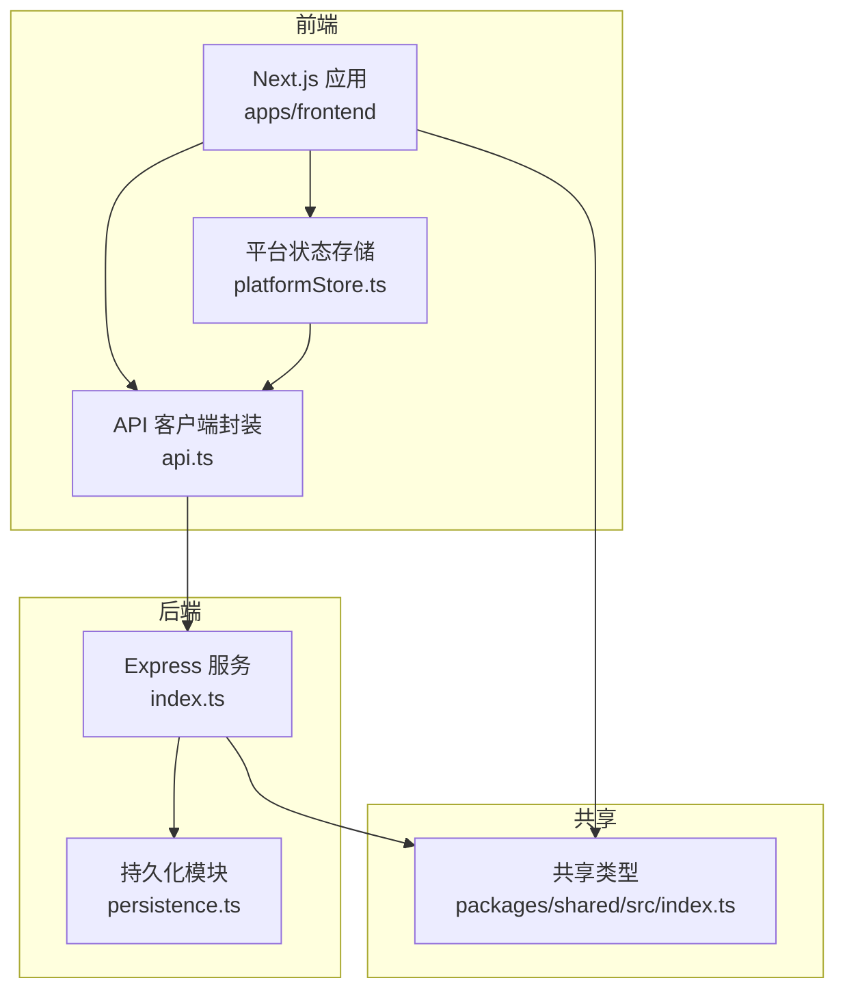
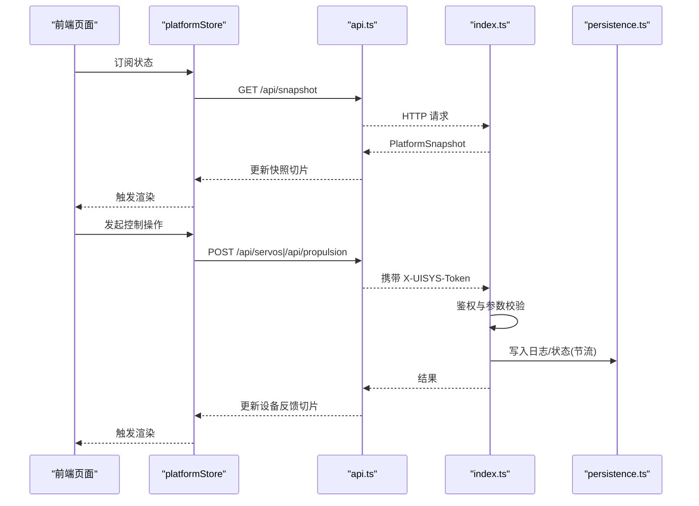
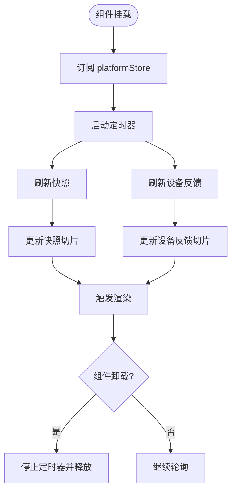
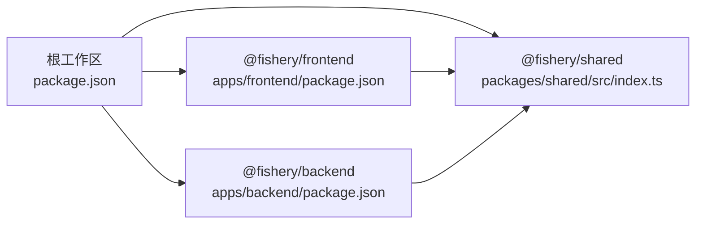

# 代码规范

<cite>
**本文引用的文件**
- [package.json](file://fishery-digital-twin-platform/package.json)
- [apps/frontend/package.json](file://fishery-digital-twin-platform/apps/frontend/package.json)
- [apps/backend/package.json](file://fishery-digital-twin-platform/apps/backend/package.json)
- [apps/frontend/eslint.config.mjs](file://fishery-digital-twin-platform/apps/frontend/eslint.config.mjs)
- [apps/frontend/tsconfig.json](file://fishery-digital-twin-platform/apps/frontend/tsconfig.json)
- [apps/backend/tsconfig.json](file://fishery-digital-twin-platform/apps/backend/tsconfig.json)
- [apps/frontend/src/app/layout.tsx](file://fishery-digital-twin-platform/apps/frontend/src/app/layout.tsx)
- [apps/backend/src/index.ts](file://fishery-digital-twin-platform/apps/backend/src/index.ts)
- [apps/backend/src/persistence.ts](file://fishery-digital-twin-platform/apps/backend/src/persistence.ts)
- [packages/shared/src/index.ts](file://fishery-digital-twin-platform/packages/shared/src/index.ts)
- [apps/frontend/src/lib/platformStore.ts](file://fishery-digital-twin-platform/apps/frontend/src/lib/platformStore.ts)
- [apps/frontend/src/lib/api.ts](file://fishery-digital-twin-platform/apps/frontend/src/lib/api.ts)
- [README.md](file://fishery-digital-twin-platform/README.md)
- [docs/security-and-network.md](file://fishery-digital-twin-platform/docs/security-and-network.md)
- [docs/code-review-2026-08-08.md](file://fishery-digital-twin-platform/docs/code-review-2026-08-08.md)
</cite>

## 目录
1. [简介](#简介)
2. [项目结构](#项目结构)
3. [核心组件](#核心组件)
4. [架构总览](#架构总览)
5. [详细组件分析](#详细组件分析)
6. [依赖分析](#依赖分析)
7. [性能考虑](#性能考虑)
8. [故障排查指南](#故障排查指南)
9. [结论](#结论)
10. [附录](#附录)

## 简介
本规范面向“智慧渔业巡检船数字孪生与 AI 决策平台”的前后端工程，统一 TypeScript/JavaScript、React、Express 后端的编码标准与实践，覆盖命名约定、文件组织、注释与函数设计、组件结构与状态管理、样式处理、事件处理、API 设计、错误处理、日志记录、安全策略、Git 提交与分支策略、代码审查流程、ESLint/Prettier/TypeScript 配置与使用、重构指南与设计模式、常见反模式及避免方法。目标是让不同背景的开发者都能快速上手并保持一致的代码质量。

## 项目结构
仓库采用 Monorepo 组织：
- apps/backend：Express 后端服务，提供数据快照、设备控制、AI 报告、日志等接口，并实现 UDP 自动发现与本地持久化。
- apps/frontend：Next.js 前端应用，包含页面、组件、共享类型调用、状态存储与 API 封装。
- packages/shared：前后端共享的 TypeScript 类型定义，确保契约一致。
- firmware/esp32：ESP32 固件（不在本规范范围内）。
- docs：项目说明与安全网络文档。

**图示来源**
- [apps/frontend/src/lib/api.ts:1-101](file://fishery-digital-twin-platform/apps/frontend/src/lib/api.ts#L1-L101)
- [apps/frontend/src/lib/platformStore.ts:1-196](file://fishery-digital-twin-platform/apps/frontend/src/lib/platformStore.ts#L1-L196)
- [apps/backend/src/index.ts:1-599](file://fishery-digital-twin-platform/apps/backend/src/index.ts#L1-L599)
- [apps/backend/src/persistence.ts:1-68](file://fishery-digital-twin-platform/apps/backend/src/persistence.ts#L1-L68)
- [packages/shared/src/index.ts:1-288](file://fishery-digital-twin-platform/packages/shared/src/index.ts#L1-L288)

**章节来源**
- [README.md:16-34](file://fishery-digital-twin-platform/README.md#L16-L34)
- [package.json:12-24](file://fishery-digital-twin-platform/package.json#L12-L24)

## 核心组件
- 共享类型层（packages/shared）：集中定义水质、电池、导航、AI 报告、设备状态、推进器、舵机、系统日志、数字孪生仿真输入输出等类型，作为前后端契约。
- 前端状态层（platformStore）：基于 useSyncExternalStore 思想，维护平台快照和设备反馈两类切片，定时轮询后端，避免不必要的重渲染。
- 前端 API 层（api.ts）：统一的 fetch 封装，支持超时、令牌注入、错误抛出和类型化返回。
- 后端服务（index.ts）：Express 路由、CORS、鉴权中间件、数据聚合、UDP 自动发现、日志与持久化、健康检查、AI 报告限流、设备命令下发与查询。
- 持久化（persistence.ts）：原子写入 JSON 文件，支持加载、节流保存与优雅关闭时 flush。

**章节来源**
- [packages/shared/src/index.ts:1-288](file://fishery-digital-twin-platform/packages/shared/src/index.ts#L1-L288)
- [apps/frontend/src/lib/platformStore.ts:1-196](file://fishery-digital-twin-platform/apps/frontend/src/lib/platformStore.ts#L1-L196)
- [apps/frontend/src/lib/api.ts:1-101](file://fishery-digital-twin-platform/apps/frontend/src/lib/api.ts#L1-L101)
- [apps/backend/src/index.ts:1-599](file://fishery-digital-twin-platform/apps/backend/src/index.ts#L1-L599)
- [apps/backend/src/persistence.ts:1-68](file://fishery-digital-twin-platform/apps/backend/src/persistence.ts#L1-L68)

## 架构总览
前端通过 platformStore 定时拉取 /api/snapshot 与设备反馈接口，展示实时数据；用户操作经 api.ts 转发到后端受控接口，后端在 requireControlAuthorization 校验令牌后执行业务逻辑，并将关键事件写入系统日志与持久化文件。

**图示来源**
- [apps/frontend/src/lib/platformStore.ts:98-139](file://fishery-digital-twin-platform/apps/frontend/src/lib/platformStore.ts#L98-L139)
- [apps/frontend/src/lib/api.ts:6-24](file://fishery-digital-twin-platform/apps/frontend/src/lib/api.ts#L6-L24)
- [apps/backend/src/index.ts:143-157](file://fishery-digital-twin-platform/apps/backend/src/index.ts#L143-L157)
- [apps/backend/src/index.ts:367-430](file://fishery-digital-twin-platform/apps/backend/src/index.ts#L367-L430)
- [apps/backend/src/persistence.ts:51-68](file://fishery-digital-twin-platform/apps/backend/src/persistence.ts#L51-L68)

## 详细组件分析

### 前端编码规范（TypeScript/JavaScript 与 React）
- 命名约定
  - 组件与页面：PascalCase，如 DashboardPage、ServosPage。
  - Hook：useXxx，如 usePlatformData、useDeviceFeedback。
  - 常量：UPPER_SNAKE_CASE，如 SNAPSHOT_INTERVAL。
  - 变量与函数：camelCase。
  - 类型与接口：PascalCase，如 PlatformSnapshot、WaterData。
- 文件组织
  - 按功能域划分：src/app 下按页面组织；src/components 按业务域或通用 UI 拆分；src/hooks 存放自定义 Hook；src/lib 存放工具与跨层能力（如 api.ts、platformStore.ts）。
  - 共享类型统一放在 packages/shared，禁止在业务包内重复定义。
- 注释标准
  - 对外暴露的函数/接口需有 JSDoc 或 TS 类型描述，说明参数、返回值与副作用。
  - 复杂逻辑处添加行内注释解释意图与边界条件。
- 函数设计原则
  - 单一职责：每个函数只做一件事，便于测试与复用。
  - 纯函数优先：对输入进行严格校验，避免隐式全局状态。
  - 可组合：小函数组合成业务流程，减少嵌套。
- React 组件开发规范
  - 组件结构：容器组件负责数据获取与状态协调，展示组件只关注渲染。
  - 状态管理：使用 platformStore 提供的切片订阅，避免在组件内维护全局状态。
  - 样式处理：Tailwind CSS 类名优先，避免内联样式；公共样式放入 globals.css 或模块样式。
  - 事件处理：将事件处理器下沉到最小粒度，避免在 JSX 中写复杂逻辑。
- 示例参考路径
  - 根布局与元信息：[apps/frontend/src/app/layout.tsx:1-20](file://fishery-digital-twin-platform/apps/frontend/src/app/layout.tsx#L1-L20)
  - 平台状态存储：[apps/frontend/src/lib/platformStore.ts:1-196](file://fishery-digital-twin-platform/apps/frontend/src/lib/platformStore.ts#L1-L196)
  - API 客户端封装：[apps/frontend/src/lib/api.ts:1-101](file://fishery-digital-twin-platform/apps/frontend/src/lib/api.ts#L1-L101)

**章节来源**
- [apps/frontend/src/app/layout.tsx:1-20](file://fishery-digital-twin-platform/apps/frontend/src/app/layout.tsx#L1-L20)
- [apps/frontend/src/lib/platformStore.ts:1-196](file://fishery-digital-twin-platform/apps/frontend/src/lib/platformStore.ts#L1-L196)
- [apps/frontend/src/lib/api.ts:1-101](file://fishery-digital-twin-platform/apps/frontend/src/lib/api.ts#L1-L101)

### 后端编码规范（Express/Node.js）
- API 设计
  - RESTful 风格：GET 读取、POST 写入；资源命名清晰，如 /api/snapshot、/api/servos、/api/propulsion。
  - 统一响应：成功返回业务数据，失败返回 { error } 并设置合适状态码。
  - 鉴权：局域网控制接口必须携带 X-UISYS-Token，回环地址允许免鉴权。
  - 限流：AI 报告生成限制每分钟一次，防止滥用。
- 错误处理
  - 参数校验：使用范围校验函数，拒绝非法值。
  - 异常捕获：路由内部 try/catch，统一返回错误对象。
  - 全局错误中间件：区分 CORS 错误与其他服务器错误。
- 日志记录
  - 统一 appendLog 记录 info/success/warning/error，限制长度并持久化。
  - 启动、设备在线、控制命令、AI 报告生成均记录日志。
- 安全考虑
  - CORS 默认仅允许本机前端；可通过环境变量扩展。
  - 令牌比较使用 timingSafeEqual 防时序攻击。
  - 敏感配置通过 .env 与环境变量管理，不入库。
- 示例参考路径
  - 鉴权中间件与令牌校验：[apps/backend/src/index.ts:131-157](file://fishery-digital-twin-platform/apps/backend/src/index.ts#L131-L157)
  - 传感器数据接收与校验：[apps/backend/src/index.ts:367-430](file://fishery-digital-twin-platform/apps/backend/src/index.ts#L367-L430)
  - AI 报告限流与生成：[apps/backend/src/index.ts:456-473](file://fishery-digital-twin-platform/apps/backend/src/index.ts#L456-L473)
  - 全局错误处理：[apps/backend/src/index.ts:559-561](file://fishery-digital-twin-platform/apps/backend/src/index.ts#L559-L561)

**章节来源**
- [apps/backend/src/index.ts:131-157](file://fishery-digital-twin-platform/apps/backend/src/index.ts#L131-L157)
- [apps/backend/src/index.ts:367-430](file://fishery-digital-twin-platform/apps/backend/src/index.ts#L367-L430)
- [apps/backend/src/index.ts:456-473](file://fishery-digital-twin-platform/apps/backend/src/index.ts#L456-L473)
- [apps/backend/src/index.ts:559-561](file://fishery-digital-twin-platform/apps/backend/src/index.ts#L559-L561)

### 数据模型与契约（packages/shared）
- 类型集中管理：WaterData、BatteryData、NavigationData、AIReport、VesselStatus、ServoSnapshot、PropulsionSnapshot、SystemLog、TwinSimulationInput/Result 等。
- 枚举与字面量联合类型：如 WaterStatus、DeviceStatus、PlatformDataMode、PropulsionMode，增强可读性与约束力。
- 建议：新增字段时同步更新前后端类型，避免契约漂移。

**章节来源**
- [packages/shared/src/index.ts:1-288](file://fishery-digital-twin-platform/packages/shared/src/index.ts#L1-L288)

### 前端状态管理与数据流
- 切片设计：snapshot（平台快照）与 deviceFeedback（设备反馈）分离，降低无关重渲染。
- 轮询策略：快照每 2s 刷新，设备反馈每 1s 刷新；失败时标记断线状态。
- 初始快照：服务端与客户端使用确定性初始快照，避免 hydration 不匹配。
- 订阅机制：refCount 控制生命周期，组件挂载时启动，卸载时停止。

**图示来源**
- [apps/frontend/src/lib/platformStore.ts:132-159](file://fishery-digital-twin-platform/apps/frontend/src/lib/platformStore.ts#L132-L159)
- [apps/frontend/src/lib/platformStore.ts:98-130](file://fishery-digital-twin-platform/apps/frontend/src/lib/platformStore.ts#L98-L130)

**章节来源**
- [apps/frontend/src/lib/platformStore.ts:1-196](file://fishery-digital-twin-platform/apps/frontend/src/lib/platformStore.ts#L1-L196)

### 后端数据持久化与可靠性
- 原子写入：先写临时文件再 rename，避免部分写入导致损坏。
- 节流保存：250ms 内多次变更合并为一次落盘，降低 I/O 压力。
- 优雅关闭：进程信号处理时 flush 待保存状态，关闭 UDP 与 HTTP 服务。
- 数据恢复：启动时加载历史数据，限制最大条目数，保证内存可控。

**章节来源**
- [apps/backend/src/persistence.ts:17-68](file://fishery-digital-twin-platform/apps/backend/src/persistence.ts#L17-L68)
- [apps/backend/src/index.ts:581-599](file://fishery-digital-twin-platform/apps/backend/src/index.ts#L581-L599)

## 依赖分析
- 工作区与工作脚本：根 package.json 定义 workspaces、scripts，统一构建与类型检查。
- 前端依赖：Next.js、React、Three.js、Recharts、Leaflet、onnxruntime-web 等。
- 后端依赖：Express、cors、dotenv。
- 共享包：@fishery/shared 被前后端共同引用，确保类型一致。

**图示来源**
- [package.json:12-24](file://fishery-digital-twin-platform/package.json#L12-L24)
- [apps/frontend/package.json:14-43](file://fishery-digital-twin-platform/apps/frontend/package.json#L14-L43)
- [apps/backend/package.json:13-25](file://fishery-digital-twin-platform/apps/backend/package.json#L13-L25)
- [packages/shared/src/index.ts:1-288](file://fishery-digital-twin-platform/packages/shared/src/index.ts#L1-L288)

**章节来源**
- [package.json:12-24](file://fishery-digital-twin-platform/package.json#L12-L24)
- [apps/frontend/package.json:14-43](file://fishery-digital-twin-platform/apps/frontend/package.json#L14-L43)
- [apps/backend/package.json:13-25](file://fishery-digital-twin-platform/apps/backend/package.json#L13-L25)

## 性能考虑
- 前端
  - 使用切片订阅减少不必要重渲染。
  - 合理设置轮询间隔，避免高频请求造成带宽与 CPU 压力。
  - 使用 Next.js 构建优化与静态资源缓存。
- 后端
  - 节流持久化，避免频繁磁盘写入。
  - 限制历史数据大小，控制内存占用。
  - 使用 NodeNext 模块解析与严格 TS 编译选项提升运行期稳定性。
- 网络
  - CORS 白名单最小化，仅允许必要来源。
  - 令牌校验使用恒定时间比较，避免侧信道泄露。

[本节为通用指导，无需具体文件来源]

## 故障排查指南
- 常见问题定位
  - 端口冲突：监听失败时退出并提示 EADDRINUSE/EACCES。
  - CORS 错误：非白名单来源将被拒绝，检查 CORS_ORIGIN 配置。
  - 令牌缺失或不匹配：局域网控制接口返回 401，检查 X-UISYS-Token。
  - 数据断线：前端 snapshotConnected/feedbackConnected 为 false 时显示离线占位。
- 诊断命令
  - 日常质量检查：lint、test、typecheck、build、audit。
  - 设备与健康检查：doctor 脚本检查令牌、端口、防火墙与服务状态。
- 相关参考
  - 安全与网络配置说明。
  - 系统审查与修复记录中的验证命令清单。

**章节来源**
- [apps/backend/src/index.ts:559-579](file://fishery-digital-twin-platform/apps/backend/src/index.ts#L559-L579)
- [README.md:197-205](file://fishery-digital-twin-platform/README.md#L197-L205)
- [docs/security-and-network.md:17-44](file://fishery-digital-twin-platform/docs/security-and-network.md#L17-L44)
- [docs/code-review-2026-08-08.md:19-27](file://fishery-digital-twin-platform/docs/code-review-2026-08-08.md#L19-L27)

## 结论
本规范以共享类型为核心契约，结合前端切片化状态管理与后端严格的鉴权、校验、日志与持久化，形成稳定可靠的数字孪生平台。遵循本规范可显著提升代码一致性、可维护性与安全性，建议在团队内强制执行并通过 CI 与代码审查保障落地。

[本节为总结性内容，无需具体文件来源]

## 附录

### TypeScript/JavaScript 编码规范细则
- 命名约定
  - 模块与文件：kebab-case 或 PascalCase（组件），统一团队风格。
  - 类型与接口：PascalCase，明确语义。
  - 常量：UPPER_SNAKE_CASE，用于不可变配置。
- 文件组织
  - 按功能域分层：app/pages、components、hooks、lib。
  - 共享类型集中在 packages/shared，禁止重复定义。
- 注释标准
  - 对外 API 使用 JSDoc 或 TS 类型描述。
  - 复杂算法与边界条件添加行内注释。
- 函数设计原则
  - 单一职责、纯函数优先、可组合、可测试。
- 示例参考路径
  - 根布局与元信息：[apps/frontend/src/app/layout.tsx:1-20](file://fishery-digital-twin-platform/apps/frontend/src/app/layout.tsx#L1-L20)
  - 平台状态存储：[apps/frontend/src/lib/platformStore.ts:1-196](file://fishery-digital-twin-platform/apps/frontend/src/lib/platformStore.ts#L1-L196)
  - API 客户端封装：[apps/frontend/src/lib/api.ts:1-101](file://fishery-digital-twin-platform/apps/frontend/src/lib/api.ts#L1-L101)

**章节来源**
- [apps/frontend/src/app/layout.tsx:1-20](file://fishery-digital-twin-platform/apps/frontend/src/app/layout.tsx#L1-L20)
- [apps/frontend/src/lib/platformStore.ts:1-196](file://fishery-digital-twin-platform/apps/frontend/src/lib/platformStore.ts#L1-L196)
- [apps/frontend/src/lib/api.ts:1-101](file://fishery-digital-twin-platform/apps/frontend/src/lib/api.ts#L1-L101)

### React 组件开发规范
- 组件结构
  - 容器组件：负责数据获取、状态协调与副作用。
  - 展示组件：只关注渲染与交互回调。
- 状态管理
  - 使用 platformStore 的切片订阅，避免在组件内维护全局状态。
- 样式处理
  - Tailwind 类名优先，公共样式放入全局或模块样式。
- 事件处理
  - 事件处理器下沉到最小粒度，避免在 JSX 中写复杂逻辑。
- 示例参考路径
  - 平台状态存储：[apps/frontend/src/lib/platformStore.ts:1-196](file://fishery-digital-twin-platform/apps/frontend/src/lib/platformStore.ts#L1-L196)

**章节来源**
- [apps/frontend/src/lib/platformStore.ts:1-196](file://fishery-digital-twin-platform/apps/frontend/src/lib/platformStore.ts#L1-L196)

### 后端 API 设计规范
- RESTful 风格与资源命名
- 鉴权与限流
- 参数校验与错误响应
- 日志与持久化
- 示例参考路径
  - 鉴权中间件：[apps/backend/src/index.ts:143-157](file://fishery-digital-twin-platform/apps/backend/src/index.ts#L143-L157)
  - 传感器数据接收：[apps/backend/src/index.ts:367-430](file://fishery-digital-twin-platform/apps/backend/src/index.ts#L367-L430)
  - AI 报告限流：[apps/backend/src/index.ts:456-473](file://fishery-digital-twin-platform/apps/backend/src/index.ts#L456-L473)

**章节来源**
- [apps/backend/src/index.ts:143-157](file://fishery-digital-twin-platform/apps/backend/src/index.ts#L143-L157)
- [apps/backend/src/index.ts:367-430](file://fishery-digital-twin-platform/apps/backend/src/index.ts#L367-L430)
- [apps/backend/src/index.ts:456-473](file://fishery-digital-twin-platform/apps/backend/src/index.ts#L456-L473)

### Git 提交规范与分支策略
- 提交信息格式
  - 建议使用 conventional commits：feat/fix/docs/style/refactor/perf/test/build/ci/chore/revert。
  - 主题简洁，正文说明动机与影响。
- 分支策略
  - main：生产可用分支。
  - develop：集成分支。
  - feature/*：功能分支。
  - hotfix/*：紧急修复分支。
- 代码审查流程
  - PR 需通过 lint、test、typecheck、build。
  - 至少一名 reviewer 批准后方可合并。
  - 涉及安全与网络的变更需额外审批。

[本节为通用实践，无需具体文件来源]

### 代码质量检查工具配置与使用
- ESLint
  - 前端使用 Next.js 官方规则集，并针对 Three.js/相机场景关闭特定规则。
  - 配置路径：[apps/frontend/eslint.config.mjs:1-19](file://fishery-digital-twin-platform/apps/frontend/eslint.config.mjs#L1-L19)
- Prettier
  - 建议与 ESLint 集成，统一格式化规则（本项目未显式配置，可在团队内补充）。
- TypeScript 编译器选项
  - 前端：strict、noEmit、moduleResolution bundler、jsx react-jsx、paths @/*。
  - 后端：strict、NodeNext module、outDir dist。
  - 配置路径：
    - 前端：[apps/frontend/tsconfig.json:1-44](file://fishery-digital-twin-platform/apps/frontend/tsconfig.json#L1-L44)
    - 后端：[apps/backend/tsconfig.json:1-15](file://fishery-digital-twin-platform/apps/backend/tsconfig.json#L1-L15)

**章节来源**
- [apps/frontend/eslint.config.mjs:1-19](file://fishery-digital-twin-platform/apps/frontend/eslint.config.mjs#L1-L19)
- [apps/frontend/tsconfig.json:1-44](file://fishery-digital-twin-platform/apps/frontend/tsconfig.json#L1-L44)
- [apps/backend/tsconfig.json:1-15](file://fishery-digital-twin-platform/apps/backend/tsconfig.json#L1-L15)

### 重构指南与设计模式应用
- 重构原则
  - 小步快跑，保持测试通过。
  - 提取公共逻辑为独立函数/模块。
  - 用类型约束替代运行时判断。
- 设计模式
  - 工厂模式：创建模拟数据与快照（mock-data 与 createSnapshot）。
  - 观察者模式：platformStore 的 subscribe/emit。
  - 中间件模式：Express 鉴权与错误处理中间件。
  - 单例模式：Express app 实例与 UDP 发现服务。
- 示例参考路径
  - 观察者模式：[apps/frontend/src/lib/platformStore.ts:59-96](file://fishery-digital-twin-platform/apps/frontend/src/lib/platformStore.ts#L59-L96)
  - 中间件模式：[apps/backend/src/index.ts:101-157](file://fishery-digital-twin-platform/apps/backend/src/index.ts#L101-L157)

**章节来源**
- [apps/frontend/src/lib/platformStore.ts:59-96](file://fishery-digital-twin-platform/apps/frontend/src/lib/platformStore.ts#L59-L96)
- [apps/backend/src/index.ts:101-157](file://fishery-digital-twin-platform/apps/backend/src/index.ts#L101-L157)

### 常见反模式与避免方法
- 反模式
  - 在组件内维护全局状态：应使用 platformStore。
  - 直接操作 DOM 或外部库状态：应在 effect 中同步并受控。
  - 忽略参数校验：后端应使用范围校验与类型约束。
  - 明文密钥与令牌：使用 .env 与环境变量，禁止提交到仓库。
  - 过度耦合：将业务逻辑抽离为独立函数/模块。
- 避免方法
  - 使用共享类型与严格 TS 编译选项。
  - 通过 ESLint 规则与 CI 拦截问题。
  - 日志与错误处理统一化，便于追踪与排障。
- 示例参考路径
  - 参数校验与错误处理：[apps/backend/src/index.ts:159-176](file://fishery-digital-twin-platform/apps/backend/src/index.ts#L159-L176)
  - 安全与网络配置：[docs/security-and-network.md:1-55](file://fishery-digital-twin-platform/docs/security-and-network.md#L1-L55)

**章节来源**
- [apps/backend/src/index.ts:159-176](file://fishery-digital-twin-platform/apps/backend/src/index.ts#L159-L176)
- [docs/security-and-network.md:1-55](file://fishery-digital-twin-platform/docs/security-and-network.md#L1-L55)