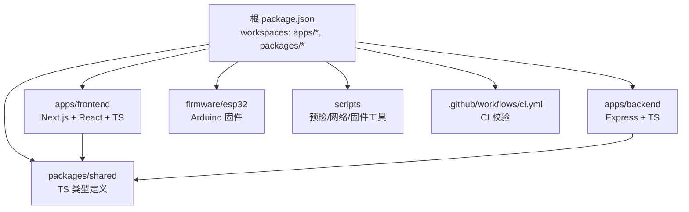
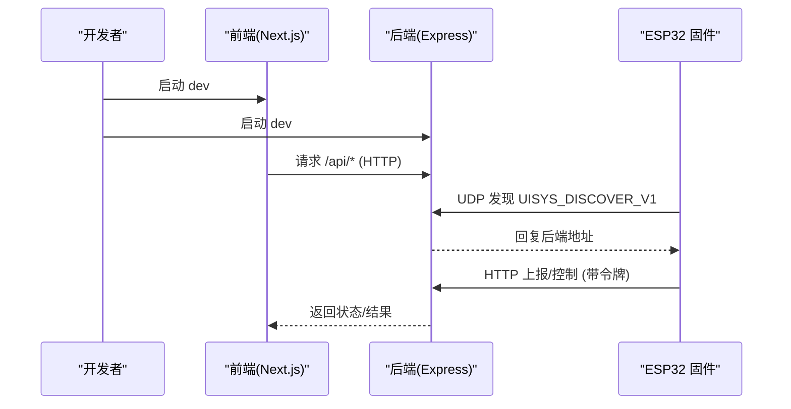
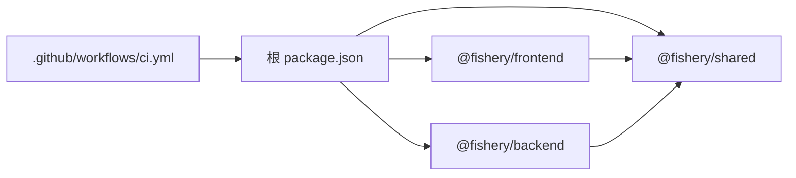

# 开发指南

<cite>
**本文引用的文件**
- [README.md](file://fishery-digital-twin-platform/README.md)
- [package.json](file://fishery-digital-twin-platform/package.json)
- [ci.yml](file://.github/workflows/ci.yml)
- [project-structure.md](file://fishery-digital-twin-platform/docs/project-structure.md)
- [frontend package.json](file://fishery-digital-twin-platform/apps/frontend/package.json)
- [backend package.json](file://fishery-digital-twin-platform/apps/backend/package.json)
- [shared package.json](file://fishery-digital-twin-platform/packages/shared/package.json)
- [frontend eslint.config.mjs](file://fishery-digital-twin-platform/apps/frontend/eslint.config.mjs)
- [backend tsconfig.json](file://fishery-digital-twin-platform/apps/backend/tsconfig.json)
- [frontend tsconfig.json](file://fishery-digital-twin-platform/apps/frontend/tsconfig.json)
- [device-stores.test.ts](file://fishery-digital-twin-platform/apps/backend/src/device-stores.test.ts)
- [.gitignore](file://.gitignore)
- [preflight.ps1](file://fishery-digital-twin-platform/scripts/preflight.ps1)
</cite>

## 目录
1. [简介](#简介)
2. [项目结构](#项目结构)
3. [核心组件](#核心组件)
4. [架构总览](#架构总览)
5. [详细组件分析](#详细组件分析)
6. [依赖关系分析](#依赖关系分析)
7. [性能与构建优化](#性能与构建优化)
8. [故障排查指南](#故障排查指南)
9. [结论](#结论)
10. [附录：工作流与规范清单](#附录工作流与规范清单)

## 简介
本指南面向参与“智慧渔业巡检船数字孪生与 AI 决策平台”的开发者，覆盖开发环境配置、代码规范、Git 工作流、测试策略、构建发布、文档维护与贡献流程。项目采用 Monorepo 组织，包含前端（Next.js）、后端（Express）、共享类型包、ESP32 固件以及桌面打包产物。根脚本统一编排开发、构建、诊断与设备配置任务，CI 在 GitHub Actions 中执行 lint、测试、类型检查与构建。

## 项目结构
仓库采用分层 Monorepo：
- apps：应用层，包含 backend、frontend、desktop（Electron 入口）
- packages：跨模块共享代码，当前为 TypeScript 类型包 shared
- firmware：ESP32 固件源码
- docs：项目结构、硬件接入、模型训练等说明
- scripts：Windows PowerShell 预检、网络配置、固件工具、清理等脚本
- .github/workflows：CI 流水线

图表来源
- [package.json:12-37](file://fishery-digital-twin-platform/package.json#L12-L37)
- [project-structure.md:15-107](file://fishery-digital-twin-platform/docs/project-structure.md#L15-L107)

章节来源
- [README.md:16-34](file://fishery-digital-twin-platform/README.md#L16-L34)
- [project-structure.md:1-138](file://fishery-digital-twin-platform/docs/project-structure.md#L1-L138)

## 核心组件
- 前端（Next.js）：提供 3D 船模展示、环境监测、设备控制、导航与健康页面；使用 TailwindCSS、Three.js、Recharts 等生态。
- 后端（Express）：注册 API 路由，处理 AI 报告生成、设备命令队列与状态存储、模拟数据等。
- 共享类型（@fishery/shared）：前后端共用类型，避免接口不一致。
- 固件（ESP32）：舵机板、GPS、推进器控制，通过 UDP 自动发现后端并 HTTP 上报。
- 桌面应用（Electron）：将前端与后端打包为 Windows 安装程序。

章节来源
- [project-structure.md:15-107](file://fishery-digital-twin-platform/docs/project-structure.md#L15-L107)
- [README.md:5-14](file://fishery-digital-twin-platform/README.md#L5-L14)

## 架构总览
系统由前端、后端、设备固件组成。前端通过 Next.js 提供服务，调用后端 REST API；后端监听局域网端口供前端和设备访问；设备通过 UDP 广播发现后端 IP，再使用令牌鉴权进行通信。

图表来源
- [README.md:143-153](file://fishery-digital-twin-platform/README.md#L143-L153)
- [preflight.ps1:116-142](file://fishery-digital-twin-platform/scripts/preflight.ps1#L116-L142)

## 详细组件分析

### 前端（Next.js）
- 技术栈：Next.js、React、TypeScript、TailwindCSS、Three.js、Recharts、Leaflet。
- 开发脚本：dev/dev:turbopack/build/start/typecheck/lint。
- 类型检查：tsc -p tsconfig.typecheck.json --noEmit。
- ESLint：基于 next/core-web-vitals 与 typescript 规则，针对 Three.js 场景关闭部分严格规则。
- 路径别名：@/* -> src/*。

章节来源
- [frontend package.json:6-13](file://fishery-digital-twin-platform/apps/frontend/package.json#L6-L13)
- [frontend tsconfig.json:1-44](file://fishery-digital-twin-platform/apps/frontend/tsconfig.json#L1-L44)
- [frontend eslint.config.mjs:1-19](file://fishery-digital-twin-platform/apps/frontend/eslint.config.mjs#L1-L19)
- [project-structure.md:15-63](file://fishery-digital-twin-platform/docs/project-structure.md#L15-L63)

### 后端（Express）
- 技术栈：Express、TypeScript、dotenv、cors。
- 开发脚本：dev(build with tsx watch)/build/start/typecheck/test。
- 类型检查：tsc -p tsconfig.json --noEmit。
- 测试：tsx --test src/*.test.ts，覆盖 GPS、舵机、推进器等 Store 行为。
- 监听：默认 0.0.0.0:5000，供网页与设备访问。

章节来源
- [backend package.json:6-12](file://fishery-digital-twin-platform/apps/backend/package.json#L6-L12)
- [backend tsconfig.json:1-15](file://fishery-digital-twin-platform/apps/backend/tsconfig.json#L1-L15)
- [device-stores.test.ts:1-93](file://fishery-digital-twin-platform/apps/backend/src/device-stores.test.ts#L1-L93)
- [project-structure.md:65-97](file://fishery-digital-twin-platform/docs/project-structure.md#L65-L97)

### 共享类型包（@fishery/shared）
- 作用：前后端共用类型定义，确保接口一致。
- 构建：tsc -p tsconfig.json；类型检查：tsc --noEmit。

章节来源
- [shared package.json:1-17](file://fishery-digital-twin-platform/packages/shared/package.json#L1-L17)
- [project-structure.md:99-107](file://fishery-digital-twin-platform/docs/project-structure.md#L99-L107)

### 固件（ESP32）
- 自动发现：UDP 广播 UISYS_DISCOVER_V1，后端回复地址；设备以该地址访问 HTTP 5000。
- 安全：使用统一令牌鉴权；不同设备监听不同 UDP 端口。
- 推荐烧录入口：servo_temp_01、four_servo_02、simplefoc_dual_propulsion。

章节来源
- [README.md:94-171](file://fishery-digital-twin-platform/README.md#L94-L171)
- [project-structure.md:109-138](file://fishery-digital-twin-platform/docs/project-structure.md#L109-L138)

### 桌面应用（Electron）
- 打包：electron-builder 输出 NSIS 安装包到 release。
- 资源：main.cjs、runtime、assets。
- 构建链：npm run build && npm run desktop:prepare && electron-builder。

章节来源
- [package.json:36-90](file://fishery-digital-twin-platform/package.json#L36-L90)

## 依赖关系分析
Monorepo 通过 workspaces 管理依赖，根 package.json 统一脚本与 Electron 构建配置；前端与后端均依赖 @fishery/shared 类型包；CI 在 Ubuntu 上执行 lint、test、typecheck、build。

图表来源
- [package.json:12-37](file://fishery-digital-twin-platform/package.json#L12-L37)
- [ci.yml:1-26](file://.github/workflows/ci.yml#L1-L26)

章节来源
- [package.json:1-96](file://fishery-digital-twin-platform/package.json#L1-L96)
- [ci.yml:1-26](file://.github/workflows/ci.yml#L1-L26)

## 性能与构建优化
- 前端构建：Next.js 支持 webpack 与 Turbopack；开发时可使用 dev:turbopack 提升热更新体验。
- 类型检查：前后端分别启用 tsc 严格模式，减少运行时错误。
- 依赖锁定：使用 package-lock.json 与 npm ci 保证可重复构建。
- 产物体积：按需引入 Three.js、Recharts 等库；公共模型与 ONNX 运行时位于 public/onnx。
- 生产模式：使用 build 与 start 启动，减少调试开销。

章节来源
- [frontend package.json:6-13](file://fishery-digital-twin-platform/apps/frontend/package.json#L6-L13)
- [backend package.json:6-12](file://fishery-digital-twin-platform/apps/backend/package.json#L6-L12)
- [package.json:21-26](file://fishery-digital-twin-platform/package.json#L21-L26)

## 故障排查指南
- 预检脚本：运行 npm run doctor 或 preflight.ps1 检查 Node 版本、端口占用、健康状态、防火墙规则与设备在线情况。
- 常见端口：前端 3000、后端 5000、ESP32 发现 UDP 42110。
- 网络与防火墙：专用网络需放行 TCP 5000 与 UDP 42110；可通过 setup:network 自动配置。
- 令牌与环境：确保 apps/backend/.env 存在且 HOST=0.0.0.0，UISYS_API_TOKEN 长度满足要求；固件 wifi_secrets.h 中的令牌需与后端一致。
- 服务健康：前端 /api/desktop-health 与后端 /api/health 用于健康检查。

章节来源
- [preflight.ps1:66-153](file://fishery-digital-twin-platform/scripts/preflight.ps1#L66-L153)
- [README.md:56-69](file://fishery-digital-twin-platform/README.md#L56-L69)
- [README.md:173-185](file://fishery-digital-twin-platform/README.md#L173-L185)

## 结论
本项目以 Monorepo 组织前后端与固件，提供统一的开发、构建与诊断脚本；通过严格的类型检查与测试保障质量；CI 流水线确保提交前完成 lint、测试、类型检查与构建。遵循本指南可快速搭建开发环境、规范代码风格、稳定发布产品并高效协作。

## 附录：工作流与规范清单

### 开发环境配置
- Node.js 版本：>=22.20 <25（根 engines 指定），推荐使用 22.x/23.x/24.x。
- 首次安装：npm install，然后 npm run setup:local，最后 npm run dev。
- IDE 建议：VS Code，启用 ESLint、TypeScript 语言服务；前端使用 Next.js 插件；后端使用 tsx 调试。
- 格式化与检查：
  - 前端：eslint src --max-warnings=0
  - 全仓：npm run lint、npm run typecheck
- 调试：
  - 前端：next dev 或 next dev（Turbopack）
  - 后端：tsx watch 启动，断点调试 dist/index.js 或直接在 tsx 中打断点
  - 设备：通过 UDP 发现与 HTTP 日志定位问题

章节来源
- [package.json:7-10](file://fishery-digital-twin-platform/package.json#L7-L10)
- [README.md:36-54](file://fishery-digital-twin-platform/README.md#L36-L54)
- [frontend package.json:6-13](file://fishery-digital-twin-platform/apps/frontend/package.json#L6-L13)
- [backend package.json:6-12](file://fishery-digital-twin-platform/apps/backend/package.json#L6-L12)

### 代码规范与最佳实践
- 命名约定：
  - 前端组件与页面使用 PascalCase；API 路径使用小写短横线；Store 函数使用动词+名词。
  - 后端模块按职责拆分（store、service、route）。
- 文件组织：
  - 前端：src/app 路由、src/components 组件、src/lib 工具、src/hooks 自定义 Hook。
  - 后端：src/index.ts 注册路由，业务逻辑拆分为 store/service。
  - 共享类型：packages/shared/src/index.ts 集中导出。
- 注释标准：
  - 对外暴露的函数与类型添加 JSDoc 或 TSDoc 注释，说明参数、返回值与副作用。
- 编码风格：
  - 严格 TypeScript（strict: true），禁止隐式 any。
  - 前端 ESLint 继承 next/core-web-vitals 与 typescript 规则。
  - 避免在 effect 中直接修改外部可变状态，尽量使用不可变更新。

章节来源
- [frontend eslint.config.mjs:1-19](file://fishery-digital-twin-platform/apps/frontend/eslint.config.mjs#L1-L19)
- [backend tsconfig.json:1-15](file://fishery-digital-twin-platform/apps/backend/tsconfig.json#L1-L15)
- [frontend tsconfig.json:1-44](file://fishery-digital-twin-platform/apps/frontend/tsconfig.json#L1-L44)
- [project-structure.md:15-107](file://fishery-digital-twin-platform/docs/project-structure.md#L15-L107)

### Git 工作流
- 分支策略：
  - main：稳定分支，CI 触发验证。
  - feature/*：功能分支，完成后合并至 main。
  - hotfix/*：紧急修复分支。
- 提交规范：
  - 建议采用 Conventional Commits（如 feat、fix、docs、chore）。
  - 提交信息简洁明确，关联 Issue 编号。
- 代码审查：
  - Pull Request 需通过 CI（lint、test、typecheck、build）。
  - 至少一名 reviewer 批准后方可合并。
- 版本管理：
  - 根 package.json version 字段作为应用版本号。
  - 发布前执行完整构建与审计。

章节来源
- [ci.yml:3-26](file://.github/workflows/ci.yml#L3-L26)
- [package.json:3-10](file://fishery-digital-twin-platform/package.json#L3-L10)

### 测试策略
- 单元测试：
  - 后端使用 node:test，覆盖 GPS、舵机、推进器 Store 的核心逻辑。
  - 关键断言：坐标系统校验、设备在线校验、命令队列与限制、紧急停止。
- 集成测试：
  - 通过健康端点验证前后端服务可用性。
- 端到端测试：
  - 建议在 UI 层补充关键流程的 E2E 用例（如登录、控制舵机、查看地图）。
- 性能测试：
  - 对 3D 渲染与地图交互进行基准测试，关注帧率与内存占用。

章节来源
- [device-stores.test.ts:1-93](file://fishery-digital-twin-platform/apps/backend/src/device-stores.test.ts#L1-L93)
- [preflight.ps1:116-142](file://fishery-digital-twin-platform/scripts/preflight.ps1#L116-L142)

### 构建与发布流程
- 本地构建：
  - npm run build：构建 shared、backend、frontend。
  - npm run start：同时启动后端与前端。
- 桌面打包：
  - npm run desktop:build：构建并生成 NSIS 安装包到 release。
- 依赖管理：
  - 使用 npm workspaces 与 package-lock.json 锁定依赖。
  - 公共类型集中在 @fishery/shared。
- 发布渠道：
  - 桌面版：NSIS 安装包分发。
  - Web 版：部署 Next.js 构建产物与 Express 服务。

章节来源
- [package.json:21-37](file://fishery-digital-twin-platform/package.json#L21-L37)
- [package.json:53-90](file://fishery-digital-twin-platform/package.json#L53-L90)

### 文档维护
- API 文档：在后端路由文件中补充 OpenAPI/Swagger 注解（建议）。
- 用户手册：README 已包含启动、配置与安全说明；可进一步扩展操作指南。
- 开发指南：本文档持续更新，保持与工作流一致。
- 更新日志：建议维护 CHANGELOG.md，记录重大变更与修复。

章节来源
- [README.md:36-185](file://fishery-digital-twin-platform/README.md#L36-L185)

### 贡献指南
- 问题报告：
  - 描述复现步骤、环境信息（Node 版本、操作系统）、期望与实际行为。
- 功能请求：
  - 说明需求背景、影响范围与优先级。
- Pull Request：
  - 遵循分支策略与提交规范；确保 CI 通过。
  - 附带必要测试与文档更新。
- 社区参与：
  - 讨论设计决策与架构演进；遵守代码规范与安全要求。

章节来源
- [ci.yml:3-26](file://.github/workflows/ci.yml#L3-L26)
- [README.md:173-185](file://fishery-digital-twin-platform/README.md#L173-L185)