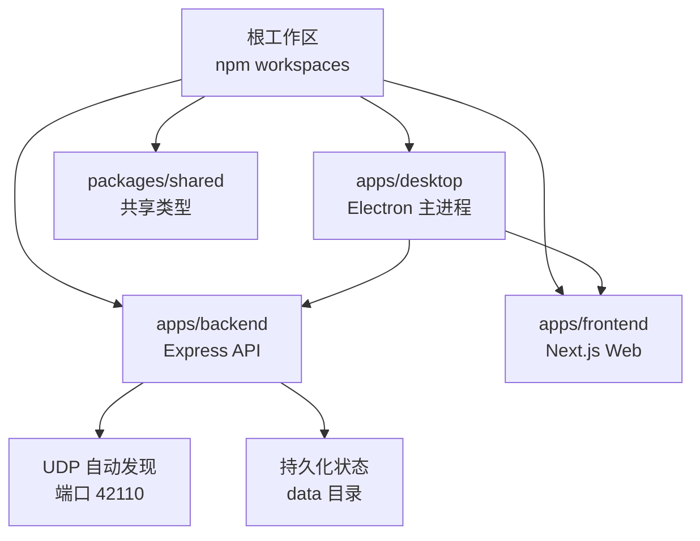
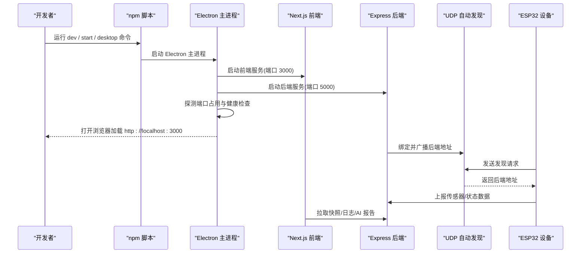
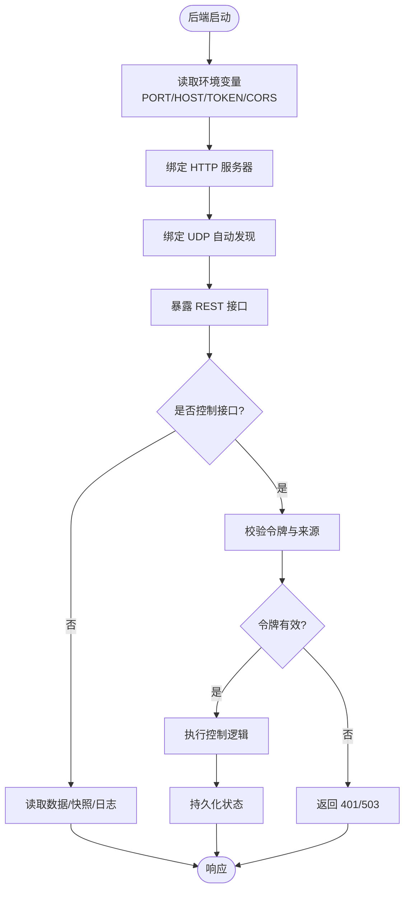
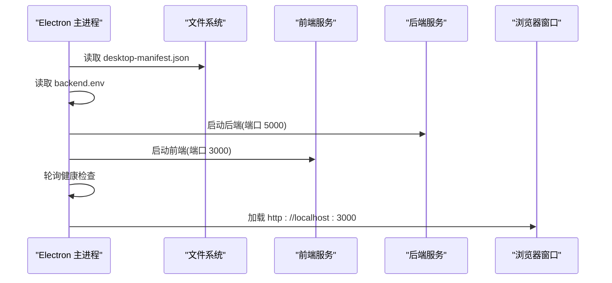
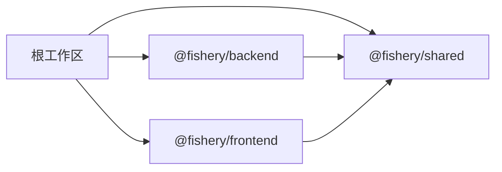

# 开发环境配置

<cite>
**本文引用的文件**
- [package.json](file://fishery-digital-twin-platform/package.json)
- [apps/backend/package.json](file://fishery-digital-twin-platform/apps/backend/package.json)
- [apps/frontend/package.json](file://fishery-digital-twin-platform/apps/frontend/package.json)
- [apps/backend/tsconfig.json](file://fishery-digital-twin-platform/apps/backend/tsconfig.json)
- [apps/frontend/tsconfig.json](file://fishery-digital-twin-platform/apps/frontend/tsconfig.json)
- [packages/shared/package.json](file://fishery-digital-twin-platform/packages/shared/package.json)
- [apps/backend/src/index.ts](file://fishery-digital-twin-platform/apps/backend/src/index.ts)
- [apps/desktop/main.cjs](file://fishery-digital-twin-platform/apps/desktop/main.cjs)
- [scripts/preflight.ps1](file://fishery-digital-twin-platform/scripts/preflight.ps1)
- [README.md](file://fishery-digital-twin-platform/README.md)
- [apps/frontend/next.config.mjs](file://fishery-digital-twin-platform/apps/frontend/next.config.mjs)
</cite>

## 目录
1. [简介](#简介)
2. [项目结构](#项目结构)
3. [核心组件](#核心组件)
4. [架构总览](#架构总览)
5. [详细组件分析](#详细组件分析)
6. [依赖分析](#依赖分析)
7. [性能考虑](#性能考虑)
8. [故障排查指南](#故障排查指南)
9. [结论](#结论)
10. [附录](#附录)

## 简介
本文件面向首次或重新搭建“智慧渔业巡检船数字孪生与 AI 决策平台”的开发者，提供从 Node.js 版本、包管理器、IDE 设置到多应用启动顺序、环境变量管理、热重载与调试的一站式说明。项目采用 monorepo 工作区，包含后端服务、前端页面、桌面端打包入口以及共享类型库；同时配套 ESP32 固件工具链脚本与预检脚本，帮助快速完成本地网络与设备令牌等敏感信息配置。

## 项目结构
- 根工作区通过 npm workspaces 管理 apps/* 与 packages/*，统一安装与脚本编排。
- apps/backend：Express 后端，提供健康检查、数据快照、设备控制、AI 报告、日志等接口，并实现 UDP 自动发现广播。
- apps/frontend：Next.js 前端，支持 webpack 模式开发与独立构建输出。
- apps/desktop：Electron 桌面入口，负责拉起前后端进程、注入运行期环境变量、端口探测与健康等待。
- packages/shared：前后端共享 TypeScript 类型定义。
- scripts：Windows PowerShell 预检、设备密钥生成、网络规则配置、固件工具集成等。

图表来源
- [package.json:12-15](file://fishery-digital-twin-platform/package.json#L12-L15)
- [apps/backend/src/index.ts:271-318](file://fishery-digital-twin-platform/apps/backend/src/index.ts#L271-L318)
- [apps/desktop/main.cjs:82-118](file://fishery-digital-twin-platform/apps/desktop/main.cjs#L82-L118)

章节来源
- [package.json:1-38](file://fishery-digital-twin-platform/package.json#L1-L38)
- [README.md:16-76](file://fishery-digital-twin-platform/README.md#L16-L76)

## 核心组件
- Node.js 与包管理器
  - 要求 Node.js 版本满足工作区 engines 约束，推荐使用 Node.js 22 系列（>=22.20 <25），npm 版本在 10 至 11 之间。
  - 使用 npm 作为包管理器，并通过 workspaces 统一管理依赖。
- 后端服务
  - Express 框架，默认监听 5000 端口，支持 CORS、JSON 解析、CORS 白名单、令牌鉴权、UDP 自动发现、持久化状态。
  - 关键环境变量：PORT、HOST、UISYS_DISCOVERY_PORT、UISYS_API_TOKEN、CORS_ORIGIN、UISYS_DEMO_WATER_FEED、UISYS_DEMO_WATER_INTERVAL_MS、UISYS_SENSOR_FRESHNESS_MS。
- 前端服务
  - Next.js 应用，开发时使用 webpack 模式，生产构建为 standalone 输出，开发缓存目录与生产目录分离。
- 桌面端
  - Electron 主进程负责启动前后端子进程、读取运行期 backend.env、探测端口占用、等待健康检查、加载前端页面。
- 预检脚本
  - Windows PowerShell 脚本用于启动前校验 Node 版本、端口占用、环境变量、防火墙规则与服务健康。

章节来源
- [package.json:7-10](file://fishery-digital-twin-platform/package.json#L7-L10)
- [apps/backend/src/index.ts:46-76](file://fishery-digital-twin-platform/apps/backend/src/index.ts#L46-L76)
- [apps/frontend/next.config.mjs:8-16](file://fishery-digital-twin-platform/apps/frontend/next.config.mjs#L8-L16)
- [apps/desktop/main.cjs:18-118](file://fishery-digital-twin-platform/apps/desktop/main.cjs#L18-L118)
- [scripts/preflight.ps1:68-148](file://fishery-digital-twin-platform/scripts/preflight.ps1#L68-L148)

## 架构总览
下图展示开发环境与运行时各组件的关系与调用顺序：

图表来源
- [apps/desktop/main.cjs:82-118](file://fishery-digital-twin-platform/apps/desktop/main.cjs#L82-L118)
- [apps/backend/src/index.ts:271-318](file://fishery-digital-twin-platform/apps/backend/src/index.ts#L271-L318)
- [apps/backend/src/index.ts:322-334](file://fishery-digital-twin-platform/apps/backend/src/index.ts#L322-L334)

## 详细组件分析

### 后端服务（Express）
- 启动与监听
  - 从环境变量读取 PORT、HOST，默认 5000/0.0.0.0。
  - 启用 CORS，限制允许的来源，默认允许本机前端地址。
- 安全与鉴权
  - 非回环地址访问控制接口需携带 X-UISYS-Token，且长度与后端配置的 UISYS_API_TOKEN 一致。
  - 若未配置令牌，局域网控制将返回 503。
- 自动发现
  - 创建 UDP 套接字监听 UISYS_DISCOVERY_PORT（默认 42110），接收客户端发现请求并广播后端地址。
- 数据与状态
  - 提供健康检查、快照、水质历史、电池、导航、GPS、设备状态、AI 报告、舵机与推进器控制、数字孪生推演、日志等接口。
  - 演示模式可通过环境变量开关与间隔控制。
- 错误处理
  - 全局错误中间件区分 CORS 错误与其他异常，返回相应状态码。

图表来源
- [apps/backend/src/index.ts:46-76](file://fishery-digital-twin-platform/apps/backend/src/index.ts#L46-L76)
- [apps/backend/src/index.ts:101-110](file://fishery-digital-twin-platform/apps/backend/src/index.ts#L101-L110)
- [apps/backend/src/index.ts:136-157](file://fishery-digital-twin-platform/apps/backend/src/index.ts#L136-L157)
- [apps/backend/src/index.ts:271-318](file://fishery-digital-twin-platform/apps/backend/src/index.ts#L271-L318)
- [apps/backend/src/index.ts:559-561](file://fishery-digital-twin-platform/apps/backend/src/index.ts#L559-L561)

章节来源
- [apps/backend/src/index.ts:46-76](file://fishery-digital-twin-platform/apps/backend/src/index.ts#L46-L76)
- [apps/backend/src/index.ts:101-110](file://fishery-digital-twin-platform/apps/backend/src/index.ts#L101-L110)
- [apps/backend/src/index.ts:136-157](file://fishery-digital-twin-platform/apps/backend/src/index.ts#L136-L157)
- [apps/backend/src/index.ts:271-318](file://fishery-digital-twin-platform/apps/backend/src/index.ts#L271-L318)
- [apps/backend/src/index.ts:322-334](file://fishery-digital-twin-platform/apps/backend/src/index.ts#L322-L334)
- [apps/backend/src/index.ts:559-561](file://fishery-digital-twin-platform/apps/backend/src/index.ts#L559-L561)

### 前端服务（Next.js）
- 开发模式
  - 使用 webpack 模式进行开发，便于与现有生态兼容。
  - 开发缓存目录 .next-dev 与生产目录 .next 分离，避免产物混淆。
- 构建与运行
  - 构建输出为 standalone，便于独立部署。
  - 支持 transpilePackages 引入共享类型库。

章节来源
- [apps/frontend/package.json:6-12](file://fishery-digital-twin-platform/apps/frontend/package.json#L6-L12)
- [apps/frontend/next.config.mjs:8-16](file://fishery-digital-twin-platform/apps/frontend/next.config.mjs#L8-L16)

### 桌面端（Electron）
- 进程管理
  - 通过 child_process 启动前后端子进程，注入运行期环境变量（如 PORT、HOST、NODE_ENV）。
  - 读取用户数据目录下的 backend.env，注入后端令牌与环境变量。
- 健康检查与等待
  - 启动前后端后，轮询健康接口，确保服务就绪后再加载前端页面。
  - 检测端口占用，若被其他程序占用则提示关闭并重试。
- 窗口与安全
  - 禁用菜单、限制新窗口打开、仅允许同源导航。
  - 针对媒体权限进行白名单放行。

图表来源
- [apps/desktop/main.cjs:18-52](file://fishery-digital-twin-platform/apps/desktop/main.cjs#L18-L52)
- [apps/desktop/main.cjs:82-118](file://fishery-digital-twin-platform/apps/desktop/main.cjs#L82-L118)
- [apps/desktop/main.cjs:121-149](file://fishery-digital-twin-platform/apps/desktop/main.cjs#L121-L149)

章节来源
- [apps/desktop/main.cjs:18-52](file://fishery-digital-twin-platform/apps/desktop/main.cjs#L18-L52)
- [apps/desktop/main.cjs:82-118](file://fishery-digital-twin-platform/apps/desktop/main.cjs#L82-L118)
- [apps/desktop/main.cjs:121-149](file://fishery-digital-twin-platform/apps/desktop/main.cjs#L121-L149)

### 预检脚本（Windows）
- 启动前检查
  - Node 版本支持性校验。
  - 端口占用检测（前端 3000、后端 5000、UDP 42110）。
  - 环境变量完整性（后端 .env、HOST、令牌长度）。
  - 桌面应用令牌一致性。
  - 固件 wifi_secrets.h 存在性与内容校验。
  - 防火墙规则是否存在（专用网络 TCP 5000、UDP 42110）。
- 运行时检查
  - 前端与后端健康接口可达性。
  - 设备在线状态汇总。

章节来源
- [scripts/preflight.ps1:68-148](file://fishery-digital-twin-platform/scripts/preflight.ps1#L68-L148)

## 依赖分析
- 工作区依赖
  - 根 package.json 声明 workspaces，统一安装 apps/* 与 packages/*。
  - 根脚本通过 concurrently 并行启动后端与前端。
- 后端依赖
  - express、cors、dotenv、@fishery/shared。
  - 开发依赖 tsx、typescript、@types/*。
- 前端依赖
  - next、react、three、leaflet、recharts 等。
  - 开发依赖 typescript、eslint、postcss、tailwindcss。
- 共享类型
  - @fishery/shared 提供前后端共享类型，构建产物位于 dist。

图表来源
- [package.json:12-15](file://fishery-digital-twin-platform/package.json#L12-L15)
- [apps/backend/package.json:13-25](file://fishery-digital-twin-platform/apps/backend/package.json#L13-L25)
- [apps/frontend/package.json:14-43](file://fishery-digital-twin-platform/apps/frontend/package.json#L14-L43)
- [packages/shared/package.json:1-15](file://fishery-digital-twin-platform/packages/shared/package.json#L1-L15)

章节来源
- [package.json:12-38](file://fishery-digital-twin-platform/package.json#L12-L38)
- [apps/backend/package.json:1-27](file://fishery-digital-twin-platform/apps/backend/package.json#L1-L27)
- [apps/frontend/package.json:1-45](file://fishery-digital-twin-platform/apps/frontend/package.json#L1-L45)
- [packages/shared/package.json:1-17](file://fishery-digital-twin-platform/packages/shared/package.json#L1-L17)

## 性能考虑
- 开发模式
  - 前端使用 webpack 模式，适合与现有插件生态配合；如需更快编译可切换 Turbopack（脚本中已提供对应命令）。
  - 后端使用 tsx watch 实时编译，减少构建开销。
- 构建优化
  - 前端构建为 standalone，便于独立部署与冷启动。
  - 共享类型库单独构建，避免重复编译。
- 资源与内存
  - 3D 场景与地图渲染可能消耗较多内存，建议合理控制模型大小与贴图分辨率。
  - 后端历史数据与日志有上限保护，避免无限增长。

[本节为通用指导，不直接分析具体文件]

## 故障排查指南
- 端口冲突
  - 前端 3000、后端 5000、UDP 42110 被占用时，预检脚本会提示 PID 与进程名；请关闭占用程序后重试。
  - 桌面端也会探测端口占用并抛出明确错误。
- 环境变量缺失或不匹配
  - 后端 .env 必须存在，HOST 设置为 0.0.0.0，UISYS_API_TOKEN 长度至少 32 字符。
  - 桌面端运行期 backend.env 中的令牌需与后端一致，否则局域网控制会被拒绝。
- 网络与防火墙
  - Windows 专用网络需开放 TCP 5000 与 UDP 42110；可使用脚本自动添加规则。
  - 热点不能开启客户端隔离，所有设备需在同一局域网。
- 服务健康
  - 通过 npm run doctor 检查前后端健康与设备在线状态。
  - 前端健康接口 /api/desktop-health，后端健康接口 /api/health。
- 常见错误定位
  - 后端全局错误中间件会区分 CORS 错误与其他异常，返回 403 或 500。
  - 桌面端启动失败会弹出错误对话框并指向日志位置。

章节来源
- [scripts/preflight.ps1:116-148](file://fishery-digital-twin-platform/scripts/preflight.ps1#L116-L148)
- [apps/desktop/main.cjs:93-118](file://fishery-digital-twin-platform/apps/desktop/main.cjs#L93-L118)
- [apps/backend/src/index.ts:559-561](file://fishery-digital-twin-platform/apps/backend/src/index.ts#L559-L561)
- [README.md:56-76](file://fishery-digital-twin-platform/README.md#L56-L76)

## 结论
本项目采用清晰的多应用架构与脚本化工具链，结合预检与桌面端封装，显著降低了环境搭建与联调成本。遵循本文档的版本要求、环境变量管理与启动顺序，可快速完成本地开发、调试与打包。遇到问题时优先使用预检脚本与健康接口定位，再结合日志与端口占用信息进行修复。

[本节为总结，不直接分析具体文件]

## 附录

### 开发工具链与环境设置
- Node.js 与 npm
  - 安装 Node.js 22.20+（<25），npm 10+（<=11）。
  - 在项目根目录执行 npm install 安装依赖。
- IDE 推荐（VS Code）
  - 插件：TypeScript/JavaScript 语言支持、ESLint、Tailwind CSS IntelliSense、React/Next.js 相关扩展。
  - 调试配置：
    - 后端：使用 Node.js 调试器，指向 apps/backend/dist/index.js（生产）或使用 tsx watch 进行开发调试。
    - 前端：使用 Chrome 调试器或 VS Code 内置调试器，附加到 localhost:3000。
    - 桌面端：在 Electron 主进程中设置断点，或通过控制台查看日志。
- 环境变量管理
  - 后端 .env：存放 DeepSeek 密钥、控制令牌、CORS 白名单等敏感信息，不要提交到版本库。
  - 桌面端运行期 backend.env：由脚本生成或同步，包含令牌与必要环境变量。
- 依赖安装流程
  - 全局依赖：Node.js、npm、可选 Arduino IDE（用于固件烧录）。
  - 局部依赖：在项目根目录执行 npm install；固件工具通过 npm run firmware:setup 安装。
- 启动命令与热重载
  - 开发：npm run dev（并行启动后端与前端）。
  - 生产：npm run build && npm run start。
  - 桌面端：npm run desktop:build 构建并打包。
- 多应用启动顺序与依赖关系
  - 桌面端先启动后端（5000），再启动前端（3000），健康检查通过后加载页面。
  - 后端提供 UDP 自动发现，供 ESP32 设备接入。
- 平台特定配置
  - Windows：使用 PowerShell 脚本进行预检、网络规则配置与设备密钥生成。
  - macOS/Linux：可参考脚本逻辑手动配置防火墙与端口，环境变量与启动命令保持一致。

章节来源
- [package.json:7-10](file://fishery-digital-twin-platform/package.json#L7-L10)
- [package.json:16-38](file://fishery-digital-twin-platform/package.json#L16-L38)
- [apps/backend/package.json:6-12](file://fishery-digital-twin-platform/apps/backend/package.json#L6-L12)
- [apps/frontend/package.json:6-12](file://fishery-digital-twin-platform/apps/frontend/package.json#L6-L12)
- [apps/desktop/main.cjs:82-118](file://fishery-digital-twin-platform/apps/desktop/main.cjs#L82-L118)
- [scripts/preflight.ps1:68-148](file://fishery-digital-twin-platform/scripts/preflight.ps1#L68-L148)
- [README.md:36-76](file://fishery-digital-twin-platform/README.md#L36-L76)