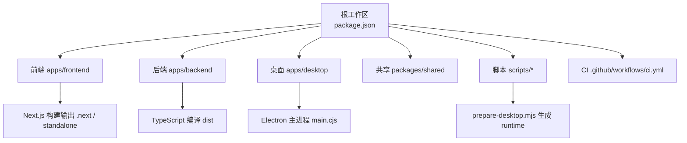
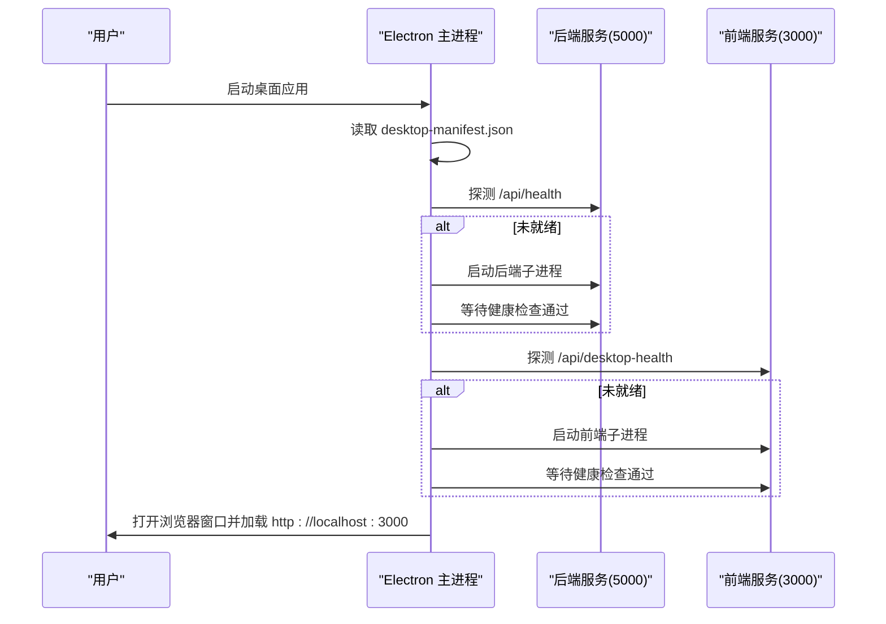
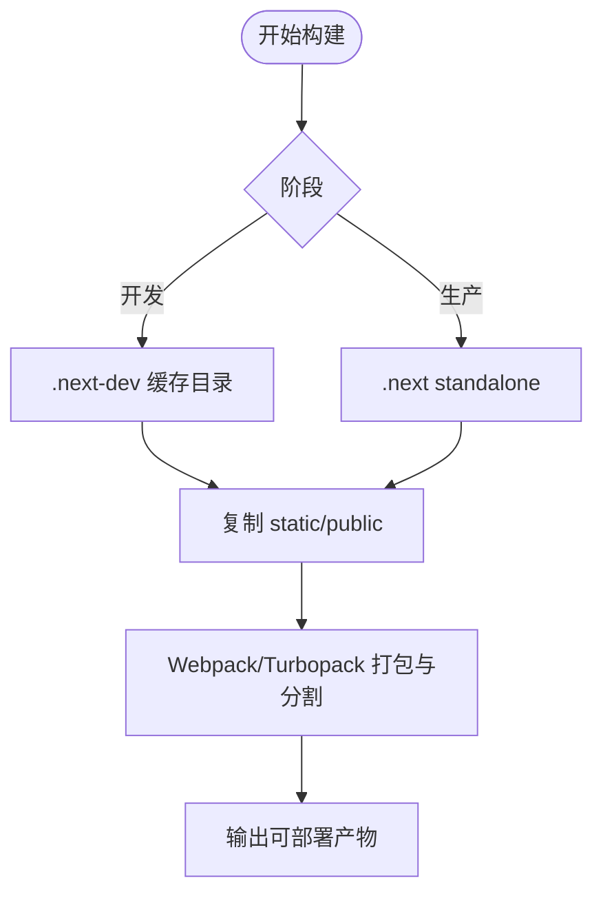
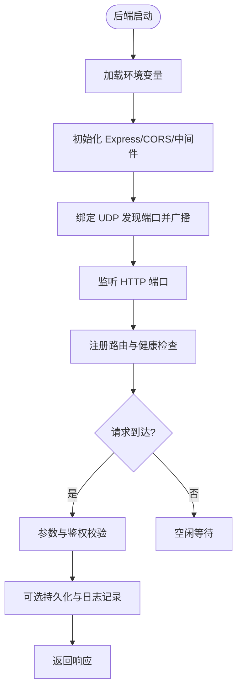
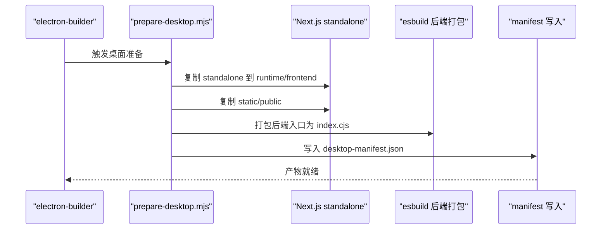
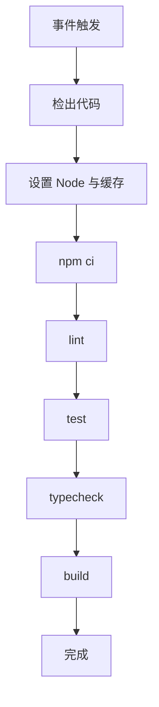
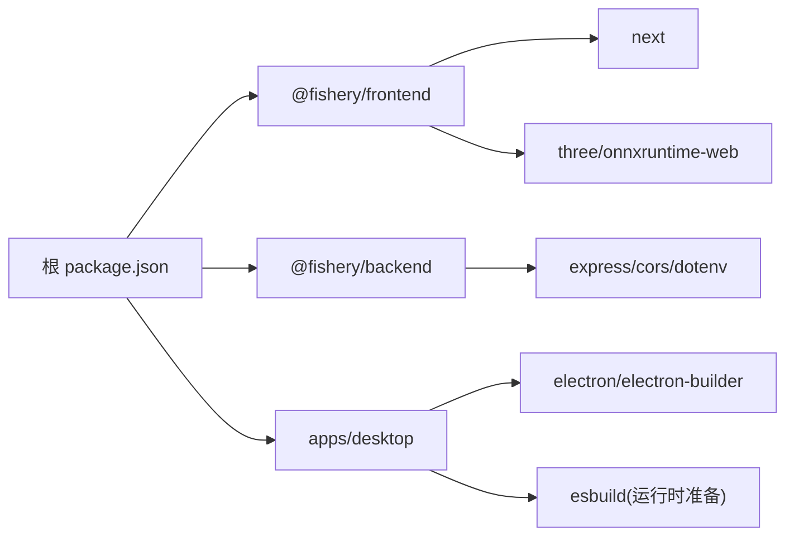

# 构建与部署

<cite>
**本文引用的文件**
- [CI 流水线](file://.github/workflows/ci.yml)
- [根工作区配置](file://fishery-digital-twin-platform/package.json)
- [前端包配置](file://fishery-digital-twin-platform/apps/frontend/package.json)
- [后端包配置](file://fishery-digital-twin-platform/apps/backend/package.json)
- [Next.js 配置](file://fishery-digital-twin-platform/apps/frontend/next.config.mjs)
- [PostCSS 配置](file://fishery-digital-twin-platform/apps/frontend/postcss.config.mjs)
- [Tailwind 配置](file://fishery-digital-twin-platform/apps/frontend/tailwind.config.mjs)
- [前端 TypeScript 配置](file://fishery-digital-twin-platform/apps/frontend/tsconfig.json)
- [后端 TypeScript 配置](file://fishery-digital-twin-platform/apps/backend/tsconfig.json)
- [桌面应用主进程](file://fishery-digital-twin-platform/apps/desktop/main.cjs)
- [桌面运行时准备脚本](file://fishery-digital-twin-platform/scripts/prepare-desktop.mjs)
- [后端入口服务](file://fishery-digital-twin-platform/apps/backend/src/index.ts)
</cite>

## 目录
1. [简介](#简介)
2. [项目结构](#项目结构)
3. [核心组件](#核心组件)
4. [架构总览](#架构总览)
5. [详细组件分析](#详细组件分析)
6. [依赖关系分析](#依赖关系分析)
7. [性能考量](#性能考量)
8. [故障排查指南](#故障排查指南)
9. [结论](#结论)
10. [附录](#附录)

## 简介
本文件面向“渔博士”数字孪生平台的构建与部署，覆盖前端 Next.js、后端 Node/Express、Electron 桌面应用打包、CI/CD 流水线、多环境策略、容器化与云服务部署、回滚与监控告警等主题。目标是帮助开发者在本地、测试和生产环境中高效、稳定地构建和发布产品。

## 项目结构
仓库采用 monorepo 组织：apps 下包含 frontend（Next.js）、backend（Node/Express）、desktop（Electron），packages/shared 为共享类型与工具；scripts 提供桌面运行时准备与设备配置脚本；根 package.json 定义工作区与工作流脚本；.github/workflows/ci.yml 定义 CI 流水线。

图表来源
- [根工作区配置:1-96](file://fishery-digital-twin-platform/package.json#L1-L96)
- [CI 流水线:1-26](file://.github/workflows/ci.yml#L1-L26)

章节来源
- [根工作区配置:1-96](file://fishery-digital-twin-platform/package.json#L1-L96)
- [CI 流水线:1-26](file://.github/workflows/ci.yml#L1-L26)

## 核心组件
- 前端（Next.js）：使用 webpack 模式构建，输出 standalone 产物，开发期与生产期缓存目录分离，支持 transpilePackages 共享包。
- 后端（Node/Express）：TypeScript 源码通过 tsc 编译到 dist，运行 node dist/index.js；提供健康检查、数据接口、设备发现广播、持久化与日志。
- 桌面（Electron）：主进程启动并管理前后端子进程，读取 desktop-manifest.json 定位运行时，端口探测与服务等待，单实例锁与权限控制。
- 桌面运行时准备：将 Next.js standalone 复制到 runtime/frontend，复制静态资源与 public，用 esbuild 将后端入口打包为 cjs，写入 manifest。
- CI/CD：检出代码、安装依赖、执行 lint/test/typecheck/build。

章节来源
- [前端包配置:1-45](file://fishery-digital-twin-platform/apps/frontend/package.json#L1-L45)
- [后端包配置:1-27](file://fishery-digital-twin-platform/apps/backend/package.json#L1-L27)
- [桌面应用主进程:1-202](file://fishery-digital-twin-platform/apps/desktop/main.cjs#L1-L202)
- [桌面运行时准备脚本:1-82](file://fishery-digital-twin-platform/scripts/prepare-desktop.mjs#L1-L82)
- [CI 流水线:1-26](file://.github/workflows/ci.yml#L1-L26)

## 架构总览
下图展示桌面应用启动时，Electron 主进程如何拉起后端与前端服务，并通过健康检查确保就绪后加载页面。

图表来源
- [桌面应用主进程:82-119](file://fishery-digital-twin-platform/apps/desktop/main.cjs#L82-L119)
- [桌面应用主进程:152-177](file://fishery-digital-twin-platform/apps/desktop/main.cjs#L152-L177)
- [后端入口服务:322-334](file://fishery-digital-twin-platform/apps/backend/src/index.ts#L322-L334)

## 详细组件分析

### 前端构建（Next.js）
- 构建目标与缓存
  - 开发期使用独立缓存目录，避免与生产输出混用导致 chunk 引用错误。
  - 生产构建输出 standalone 可移植产物，便于直接部署或嵌入桌面运行时。
- 资源与分包
  - 通过 Next.js 内置机制进行代码分割与静态资源优化；公共静态资源位于 public，构建时复制到产物中。
  - Tailwind 通过 PostCSS 注入，使用绝对 glob 扫描以避免 worker 重载问题。
- 共享包
  - 通过 transpilePackages 对 @fishery/shared 进行转译，保证在浏览器与 Node 环境下一致行为。
- 类型检查与质量
  - 使用 tsc 进行类型检查；ESLint 用于代码规范检查。

图表来源
- [Next.js 配置:8-16](file://fishery-digital-twin-platform/apps/frontend/next.config.mjs#L8-L16)
- [PostCSS 配置:1-12](file://fishery-digital-twin-platform/apps/frontend/postcss.config.mjs#L1-L12)
- [Tailwind 配置:1-72](file://fishery-digital-twin-platform/apps/frontend/tailwind.config.mjs#L1-L72)

章节来源
- [Next.js 配置:8-16](file://fishery-digital-twin-platform/apps/frontend/next.config.mjs#L8-L16)
- [前端包配置:6-12](file://fishery-digital-twin-platform/apps/frontend/package.json#L6-L12)
- [前端 TypeScript 配置:1-44](file://fishery-digital-twin-platform/apps/frontend/tsconfig.json#L1-L44)
- [PostCSS 配置:1-12](file://fishery-digital-twin-platform/apps/frontend/postcss.config.mjs#L1-L12)
- [Tailwind 配置:1-72](file://fishery-digital-twin-platform/apps/frontend/tailwind.config.mjs#L1-L72)

### 后端构建（TypeScript + Express）
- 编译与运行
  - 使用 tsc 将 src 编译至 dist，运行 node dist/index.js。
  - 环境变量通过 dotenv 加载，端口、主机、CORS 来源、令牌等均可配置。
- 关键能力
  - 健康检查 /api/health，返回服务名与子系统状态。
  - 设备发现 UDP 广播，便于局域网内自动发现后端端口。
  - 数据持久化与系统日志，异常路径统一处理。
- 安全与校验
  - 控制类接口要求 X-UISYS-Token（非本机访问时）。
  - 输入参数范围校验，越界即拒绝。

图表来源
- [后端入口服务:46-76](file://fishery-digital-twin-platform/apps/backend/src/index.ts#L46-L76)
- [后端入口服务:101-110](file://fishery-digital-twin-platform/apps/backend/src/index.ts#L101-L110)
- [后端入口服务:271-318](file://fishery-digital-twin-platform/apps/backend/src/index.ts#L271-L318)
- [后端入口服务:322-334](file://fishery-digital-twin-platform/apps/backend/src/index.ts#L322-L334)
- [后端入口服务:559-561](file://fishery-digital-twin-platform/apps/backend/src/index.ts#L559-L561)

章节来源
- [后端包配置:6-11](file://fishery-digital-twin-platform/apps/backend/package.json#L6-L11)
- [后端 TypeScript 配置:1-15](file://fishery-digital-twin-platform/apps/backend/tsconfig.json#L1-L15)
- [后端入口服务:46-76](file://fishery-digital-twin-platform/apps/backend/src/index.ts#L46-L76)
- [后端入口服务:101-110](file://fishery-digital-twin-platform/apps/backend/src/index.ts#L101-L110)
- [后端入口服务:271-318](file://fishery-digital-twin-platform/apps/backend/src/index.ts#L271-L318)
- [后端入口服务:322-334](file://fishery-digital-twin-platform/apps/backend/src/index.ts#L322-L334)
- [后端入口服务:559-561](file://fishery-digital-twin-platform/apps/backend/src/index.ts#L559-L561)

### 桌面应用打包（Electron）
- 主进程职责
  - 单实例锁、窗口创建、权限控制（媒体权限限制到前端源）。
  - 读取 desktop-manifest.json 定位前端与后端运行时脚本。
  - 端口探测与等待：若端口被占用则报错；若不可达则启动对应子进程并等待健康检查通过。
  - 日志输出到应用 logs 目录，启动失败弹窗提示并退出。
- 打包产物
  - electron-builder 配置输出目录、图标、NSIS 安装器选项与产物命名。
  - asar 打包，runtime 目录解包以便运行时读写。
- 运行时准备
  - prepare-desktop.mjs 将 Next.js standalone 复制到 runtime/frontend，复制静态资源与 public。
  - 使用 esbuild 将后端入口打包为 cjs 输出到 runtime/backend/index.cjs。
  - 生成 desktop-manifest.json 供主进程读取。

图表来源
- [桌面应用主进程:10-13](file://fishery-digital-twin-platform/apps/desktop/main.cjs#L10-L13)
- [桌面应用主进程:82-119](file://fishery-digital-twin-platform/apps/desktop/main.cjs#L82-L119)
- [桌面应用主进程:121-150](file://fishery-digital-twin-platform/apps/desktop/main.cjs#L121-L150)
- [桌面应用主进程:152-177](file://fishery-digital-twin-platform/apps/desktop/main.cjs#L152-L177)
- [桌面运行时准备脚本:1-82](file://fishery-digital-twin-platform/scripts/prepare-desktop.mjs#L1-L82)
- [根工作区配置:53-90](file://fishery-digital-twin-platform/package.json#L53-L90)

章节来源
- [桌面应用主进程:1-202](file://fishery-digital-twin-platform/apps/desktop/main.cjs#L1-L202)
- [桌面运行时准备脚本:1-82](file://fishery-digital-twin-platform/scripts/prepare-desktop.mjs#L1-L82)
- [根工作区配置:53-90](file://fishery-digital-twin-platform/package.json#L53-L90)

### CI/CD 流水线
- 触发条件：push 到 main 分支与所有 pull_request。
- 步骤：检出代码、设置 Node 版本、缓存 npm 依赖、安装依赖、执行 lint、test、typecheck、build。
- 建议扩展：增加制品上传、签名、发布到云存储或包仓库、通知渠道。

图表来源
- [CI 流水线:1-26](file://.github/workflows/ci.yml#L1-L26)

章节来源
- [CI 流水线:1-26](file://.github/workflows/ci.yml#L1-L26)

### 多环境部署策略
- 开发环境
  - 使用 concurrently 同时启动后端与前端，热更新与独立缓存目录提升体验。
  - 环境变量通过 dotenv 注入，CORS 默认允许 localhost:3000。
- 测试环境
  - 复用构建产物，仅替换环境变量（如 API Token、CORS 来源、演示数据开关）。
  - 建议在 CI 中并行执行 lint/test/typecheck/build，确保质量门禁。
- 生产环境
  - 使用 Next.js standalone 产物直接部署；后端以 node dist/index.js 运行。
  - 严格 CORS 白名单，启用 API Token 校验，关闭演示数据。
  - 桌面应用通过 electron-builder 生成 NSIS 安装包，runtime 目录解包便于动态配置。

章节来源
- [根工作区配置:16-37](file://fishery-digital-twin-platform/package.json#L16-L37)
- [后端入口服务:46-76](file://fishery-digital-twin-platform/apps/backend/src/index.ts#L46-L76)
- [Next.js 配置:8-16](file://fishery-digital-twin-platform/apps/frontend/next.config.mjs#L8-L16)

### 容器化与云服务部署
- Docker 镜像建议
  - 多阶段构建：第一阶段构建前端 Next.js standalone 与后端 dist；第二阶段基于精简 Node 镜像拷贝产物并暴露端口。
  - 环境变量：PORT、HOST、CORS_ORIGIN、UISYS_API_TOKEN、UISYS_DEMO_WATER_*、UISYS_SENSOR_FRESHNESS_MS 等。
  - 健康检查：HTTP GET /api/health 判定后端就绪；前端可通过 /api/desktop-health 或静态资源可达性判断。
- Kubernetes 部署
  - Deployment：前后端各一个副本，配置 liveness/readiness 探针指向健康接口。
  - Service：对外暴露前端与后端端口（或通过 Ingress 统一入口）。
  - ConfigMap/Secret：集中管理环境变量与敏感信息。
  - 滚动更新：利用 kubectl rollout restart 实现零停机升级。
- 云服务
  - 平台选择：Vercel/Netlify（前端）、Node 托管（后端）、或统一容器编排平台。
  - 域名与 HTTPS：通过平台证书或反向代理（Nginx/Traefik）统一管理。
  - 日志与指标：接入集中式日志与监控系统（如 Prometheus/Grafana、ELK）。

[本节为通用指导，不直接引用具体文件]

### 回滚策略
- 前端
  - 保留上一版本 Next.js standalone 产物，回滚时切换目录并重启服务。
  - CDN/对象存储按版本分桶或前缀隔离，回滚即切换 DNS 或路径。
- 后端
  - 保留历史 dist 目录，回滚时切换版本并重启进程。
  - 数据库与持久化文件按时间戳备份，必要时回退快照。
- 桌面应用
  - 安装包按版本号命名，客户端侧支持灰度与回滚；主进程启动失败弹窗并记录日志位置。
- 自动化
  - CI 流水线产出带版本号的制品，配合发布流水线一键回滚。

[本节为通用指导，不直接引用具体文件]

### 监控与告警
- 后端健康接口 /api/health 作为存活探针，结合外部监控采集可用性。
- 系统日志通过 /api/logs 获取，建议聚合到日志平台并设置阈值告警。
- 设备发现 UDP 端口与 HTTP 端口异常时，后端会记录错误并退出，需纳入基础设施监控。
- 桌面应用日志写入应用 logs 目录，启动失败弹窗提示，便于现场排查。

章节来源
- [后端入口服务:322-334](file://fishery-digital-twin-platform/apps/backend/src/index.ts#L322-L334)
- [后端入口服务:559-561](file://fishery-digital-twin-platform/apps/backend/src/index.ts#L559-L561)
- [桌面应用主进程:152-177](file://fishery-digital-twin-platform/apps/desktop/main.cjs#L152-L177)

## 依赖关系分析
- 工作区依赖
  - 根 package.json 声明 workspaces 与脚本，统一驱动各子项目构建与运行。
  - 前端依赖 next、react、three、onnxruntime-web 等；后端依赖 express、cors、dotenv。
- 构建依赖
  - 前端使用 webpack 模式构建；桌面运行时准备使用 esbuild 打包后端。
  - Electron 依赖 electron/electron-builder，NSIS 安装器用于 Windows 分发。
- 运行时依赖
  - 桌面主进程依赖 Node 子进程与文件系统；后端依赖 UDP 套接字与文件系统持久化。

图表来源
- [根工作区配置:1-96](file://fishery-digital-twin-platform/package.json#L1-L96)
- [前端包配置:14-43](file://fishery-digital-twin-platform/apps/frontend/package.json#L14-L43)
- [后端包配置:13-25](file://fishery-digital-twin-platform/apps/backend/package.json#L13-L25)
- [桌面运行时准备脚本:1-82](file://fishery-digital-twin-platform/scripts/prepare-desktop.mjs#L1-L82)

章节来源
- [根工作区配置:1-96](file://fishery-digital-twin-platform/package.json#L1-L96)
- [前端包配置:14-43](file://fishery-digital-twin-platform/apps/frontend/package.json#L14-L43)
- [后端包配置:13-25](file://fishery-digital-twin-platform/apps/backend/package.json#L13-L25)
- [桌面运行时准备脚本:1-82](file://fishery-digital-twin-platform/scripts/prepare-desktop.mjs#L1-L82)

## 性能考量
- 前端
  - 使用 Next.js 代码分割与静态资源优化；开发期与生产期缓存目录分离避免冲突。
  - Tailwind 使用绝对 glob 减少重复扫描；公共库通过 transpilePackages 提升一致性。
- 后端
  - 输入参数范围校验减少无效计算；演示数据与实时数据分离，降低干扰。
  - 持久化与日志异步调度，避免阻塞请求路径。
- 桌面
  - 端口探测与等待避免竞态；单实例锁防止重复进程；权限最小化（仅允许前端源媒体访问）。
- 构建
  - esbuild 快速打包后端；electron-builder 按需打包资源，asar 压缩体积。

[本节为通用指导，不直接引用具体文件]

## 故障排查指南
- 端口占用
  - 桌面主进程在启动前后端时会探测端口，若被其他服务占用将抛出明确错误并提示关闭占用程序。
- 服务超时
  - 健康检查有超时限制，若后端或前端未在限定时间内就绪，将抛出服务启动超时错误。
- 权限与安全
  - 非本机访问控制接口需要正确的 X-UISYS-Token；CORS 不允许的来源将被拒绝。
- 日志定位
  - 桌面应用启动失败弹窗会显示日志位置；后端错误统一返回错误消息，便于集成日志系统。

章节来源
- [桌面应用主进程:93-118](file://fishery-digital-twin-platform/apps/desktop/main.cjs#L93-L118)
- [桌面应用主进程:152-177](file://fishery-digital-twin-platform/apps/desktop/main.cjs#L152-L177)
- [后端入口服务:101-110](file://fishery-digital-twin-platform/apps/backend/src/index.ts#L101-L110)
- [后端入口服务:559-561](file://fishery-digital-twin-platform/apps/backend/src/index.ts#L559-L561)

## 结论
本项目通过 Next.js standalone、Node/Express 后端与 Electron 桌面应用形成完整交付闭环；CI 流水线保障质量与一致性；桌面主进程负责服务编排与健壮性；通过环境变量与配置项实现多环境差异化管理。建议在生产环境完善容器化、监控告警与回滚流程，进一步提升稳定性与可运维性。

## 附录
- 常用命令
  - 开发：npm run dev（同时启动后端与前端）
  - 构建：npm run build（依次构建 shared、backend、frontend）
  - 桌面构建：npm run desktop:build（构建并生成 Windows NSIS 安装包）
  - 类型检查：npm run typecheck
  - 测试：npm run test
- 关键环境变量（示例）
  - PORT、HOST、CORS_ORIGIN、UISYS_API_TOKEN、UISYS_DEMO_WATER_FEED、UISYS_DEMO_WATER_INTERVAL_MS、UISYS_SENSOR_FRESHNESS_MS、UISYS_DISCOVERY_PORT

[本节为通用指导，不直接引用具体文件]