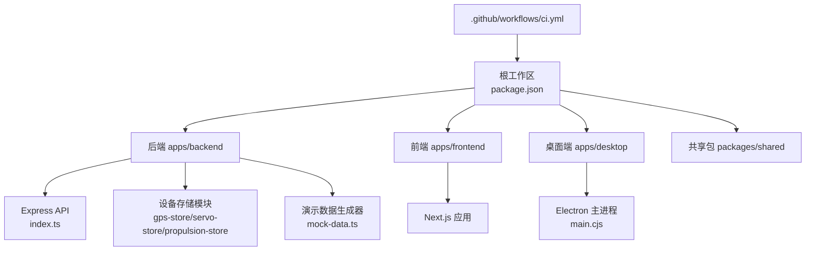
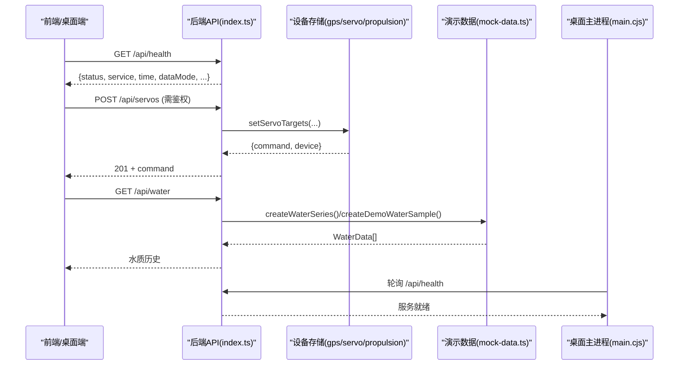
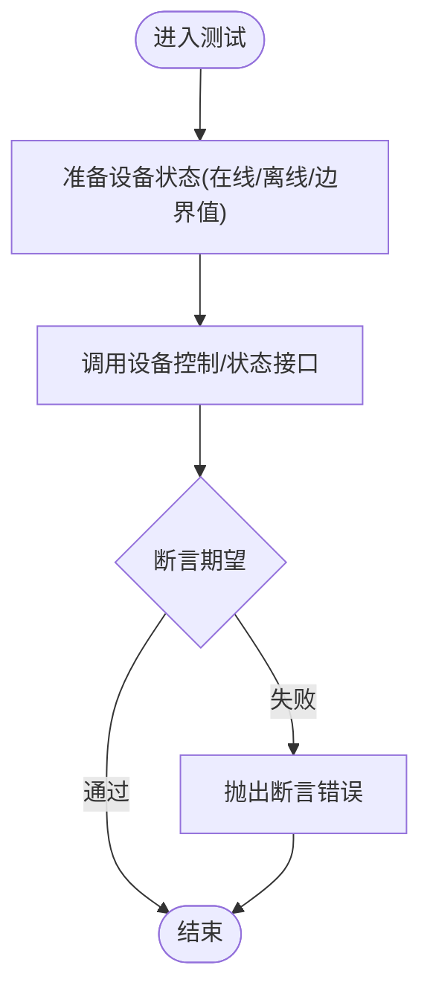
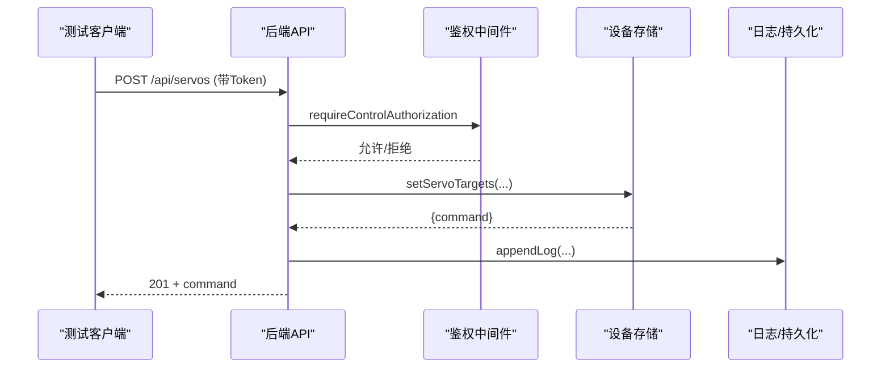
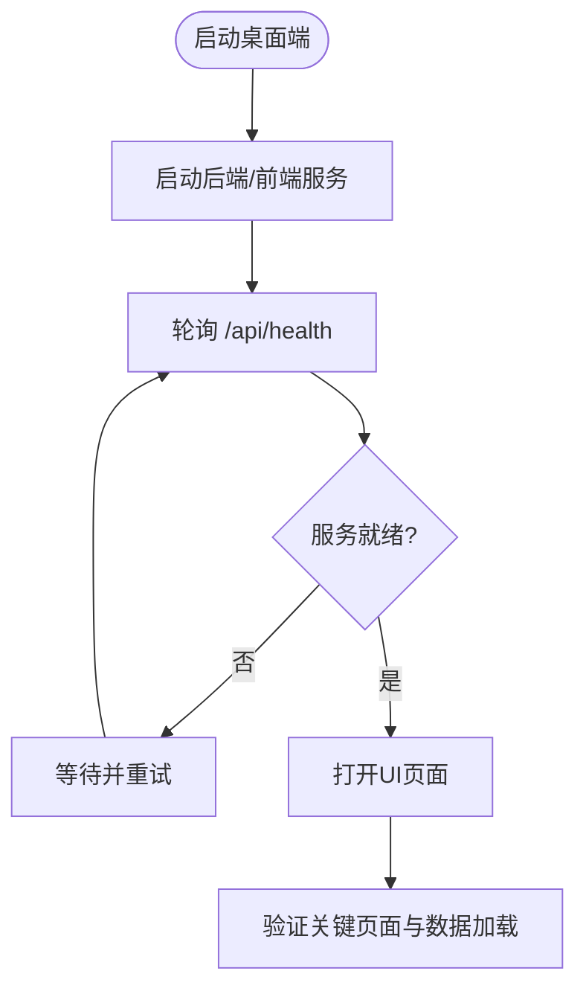
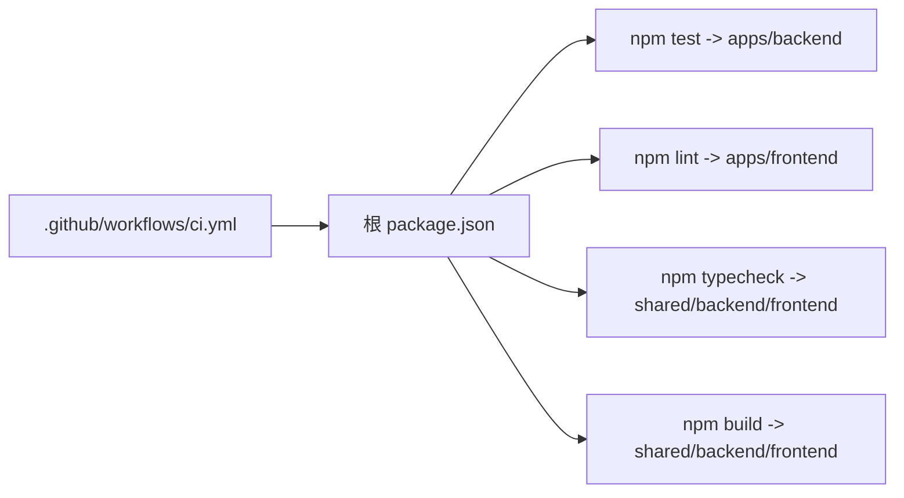

# 测试策略

<cite>
**本文引用的文件**
- [apps/backend/src/device-stores.test.ts](file://fishery-digital-twin-platform/apps/backend/src/device-stores.test.ts)
- [apps/backend/package.json](file://fishery-digital-twin-platform/apps/backend/package.json)
- [apps/frontend/package.json](file://fishery-digital-twin-platform/apps/frontend/package.json)
- [package.json](file://fishery-digital-twin-platform/package.json)
- [.github/workflows/ci.yml](file://.github/workflows/ci.yml)
- [apps/backend/src/index.ts](file://fishery-digital-twin-platform/apps/backend/src/index.ts)
- [apps/backend/src/mock-data.ts](file://fishery-digital-twin-platform/apps/backend/src/mock-data.ts)
- [apps/frontend/src/lib/fallback-data.ts](file://fishery-digital-twin-platform/apps/frontend/src/lib/fallback-data.ts)
- [apps/desktop/main.cjs](file://fishery-digital-twin-platform/apps/desktop/main.cjs)
</cite>

## 目录
1. [简介](#简介)
2. [项目结构](#项目结构)
3. [核心组件](#核心组件)
4. [架构总览](#架构总览)
5. [详细组件分析](#详细组件分析)
6. [依赖分析](#依赖分析)
7. [性能考虑](#性能考虑)
8. [故障排查指南](#故障排查指南)
9. [结论](#结论)
10. [附录](#附录)

## 简介
本测试策略面向“渔业数字孪生平台”，覆盖单元测试、集成测试、端到端测试与性能测试，并给出覆盖率要求、持续集成配置、测试数据管理与环境隔离方案。当前仓库已具备后端 Node.js 单元测试能力（基于 node:test），前端尚未引入专用测试框架；CI 流水线包含 lint、test、typecheck、build 四步验证。

## 项目结构
- 工作区根目录通过 npm workspaces 管理 apps/* 与 packages/*。
- 后端使用 Express + TypeScript，提供 HTTP 与 UDP 发现服务，内置演示数据生成器与持久化。
- 前端为 Next.js 应用，当前未配置前端测试脚本。
- CI 在 GitHub Actions 中执行 lint、test、typecheck、build。

**图表来源**
- [package.json:12-24](file://fishery-digital-twin-platform/package.json#L12-L24)
- [.github/workflows/ci.yml:8-24](file://.github/workflows/ci.yml#L8-L24)
- [apps/backend/src/index.ts:56-110](file://fishery-digital-twin-platform/apps/backend/src/index.ts#L56-L110)
- [apps/backend/src/mock-data.ts:114-140](file://fishery-digital-twin-platform/apps/backend/src/mock-data.ts#L114-L140)
- [apps/desktop/main.cjs:37-72](file://fishery-digital-twin-platform/apps/desktop/main.cjs#L37-L72)

**章节来源**
- [package.json:12-24](file://fishery-digital-twin-platform/package.json#L12-L24)
- [.github/workflows/ci.yml:8-24](file://.github/workflows/ci.yml#L8-L24)

## 核心组件
- 后端测试：基于 node:test 的单元测试，覆盖 GPS、舵机、推进器等设备状态与命令队列逻辑。
- 后端 API：Express 路由提供健康检查、快照、水质历史、设备控制等接口，支持鉴权与限流。
- 演示数据：统一的 mock-data 生成器，用于界面展示与流程验证。
- 桌面端：Electron 主进程负责启动前后端服务并轮询健康检查。

**章节来源**
- [apps/backend/src/device-stores.test.ts:1-93](file://fishery-digital-twin-platform/apps/backend/src/device-stores.test.ts#L1-L93)
- [apps/backend/src/index.ts:322-557](file://fishery-digital-twin-platform/apps/backend/src/index.ts#L322-L557)
- [apps/backend/src/mock-data.ts:114-140](file://fishery-digital-twin-platform/apps/backend/src/mock-data.ts#L114-L140)
- [apps/desktop/main.cjs:54-72](file://fishery-digital-twin-platform/apps/desktop/main.cjs#L54-L72)

## 架构总览
下图展示了从客户端到后端 API、设备存储与演示数据的调用关系，以及桌面端对服务的探测流程。

**图表来源**
- [apps/backend/src/index.ts:322-346](file://fishery-digital-twin-platform/apps/backend/src/index.ts#L322-L346)
- [apps/backend/src/index.ts:475-503](file://fishery-digital-twin-platform/apps/backend/src/index.ts#L475-L503)
- [apps/backend/src/mock-data.ts:114-140](file://fishery-digital-twin-platform/apps/backend/src/mock-data.ts#L114-L140)
- [apps/desktop/main.cjs:54-72](file://fishery-digital-twin-platform/apps/desktop/main.cjs#L54-L72)

## 详细组件分析

### 单元测试规范与实践（后端）
- 测试框架：node:test + node:assert/strict。
- 用例组织：按设备域划分（GPS、舵机、推进器），每个测试聚焦单一职责。
- 断言方法：使用 assert.throws 校验异常信息，assert.equal/assert.deepEqual 校验返回值与状态。
- Mock 数据：通过 store 的状态更新函数构造在线/离线、边界值场景。
- 关键场景示例：
  - GPS 坐标系统校验与有效定位接受。
  - 舵机在线性校验、命令入队与取出的幂等性。
  - 推进器目标与反馈分离、急停命令优先级。

**图表来源**
- [apps/backend/src/device-stores.test.ts:12-37](file://fishery-digital-twin-platform/apps/backend/src/device-stores.test.ts#L12-L37)
- [apps/backend/src/device-stores.test.ts:39-77](file://fishery-digital-twin-platform/apps/backend/src/device-stores.test.ts#L39-L77)
- [apps/backend/src/device-stores.test.ts:79-93](file://fishery-digital-twin-platform/apps/backend/src/device-stores.test.ts#L79-L93)

**章节来源**
- [apps/backend/src/device-stores.test.ts:1-93](file://fishery-digital-twin-platform/apps/backend/src/device-stores.test.ts#L1-L93)
- [apps/backend/package.json:6-12](file://fishery-digital-twin-platform/apps/backend/package.json#L6-L12)

### 集成测试策略（API、数据库、外部服务）
- API 接口测试：
  - 健康检查：GET /api/health，验证服务名、时间戳、dataMode 等字段。
  - 传感器数据上报：POST /api/data，校验数值范围、状态计算、日志写入与持久化。
  - 设备控制：POST /api/servos、POST /api/propulsion，校验鉴权、命令入队与返回结构。
  - 演示数据：POST /api/demo/simulate，验证不污染实时历史。
- 鉴权与限流：
  - 非本地请求需携带 X-UISYS-Token，否则返回 401/503。
  - AI 报告生成限制频率（每分钟一次）。
- 外部服务：
  - UDP 发现服务监听与广播，用于局域网设备发现。
  - 桌面端通过轮询 /api/health 确认服务就绪。

**图表来源**
- [apps/backend/src/index.ts:143-157](file://fishery-digital-twin-platform/apps/backend/src/index.ts#L143-L157)
- [apps/backend/src/index.ts:475-488](file://fishery-digital-twin-platform/apps/backend/src/index.ts#L475-L488)
- [apps/backend/src/index.ts:509-523](file://fishery-digital-twin-platform/apps/backend/src/index.ts#L509-L523)
- [apps/backend/src/index.ts:456-473](file://fishery-digital-twin-platform/apps/backend/src/index.ts#L456-L473)

**章节来源**
- [apps/backend/src/index.ts:143-157](file://fishery-digital-twin-platform/apps/backend/src/index.ts#L143-L157)
- [apps/backend/src/index.ts:322-557](file://fishery-digital-twin-platform/apps/backend/src/index.ts#L322-L557)

### 端到端测试方案（UI、业务流程、跨浏览器）
- 当前前端未配置测试框架与脚本，建议后续引入 Playwright/Cypress 进行页面交互与 API 联调。
- 桌面端可通过 Electron 主进程启动前后端并轮询健康检查，作为 E2E 入口。
- 跨浏览器兼容性：基于 Next.js 构建产物，可在多浏览器环境下运行 UI 自动化测试。

**图表来源**
- [apps/desktop/main.cjs:54-72](file://fishery-digital-twin-platform/apps/desktop/main.cjs#L54-L72)

**章节来源**
- [apps/frontend/package.json:6-13](file://fishery-digital-twin-platform/apps/frontend/package.json#L6-L13)
- [apps/desktop/main.cjs:54-72](file://fishery-digital-twin-platform/apps/desktop/main.cjs#L54-L72)

### 性能测试方法（负载、压力、内存泄漏）
- 负载/压力测试：
  - 针对 /api/water、/api/snapshot、/api/data 等高吞吐接口，使用 k6/Locust/JMeter 模拟并发写入与读取。
  - 关注 CPU、内存、网络带宽与磁盘 I/O（持久化）瓶颈。
- 内存泄漏检测：
  - 使用 Node.js --inspect 与 Chrome DevTools 进行堆快照对比。
  - 重点监控长时间运行的服务（如 demo 数据注入、UDP 广播）。
- 基准指标建议：
  - P95/P99 响应时间、错误率、吞吐量（RPS）、资源利用率阈值。

[本节为通用指导，不直接分析具体文件]

## 依赖分析
- 工作区脚本：根 package.json 统一编排 test、lint、typecheck、build。
- 后端脚本：apps/backend/package.json 定义 test 命令，使用 tsx 执行 *.test.ts。
- 前端脚本：apps/frontend/package.json 未定义测试脚本，仅包含类型检查与 lint。
- CI：GitHub Actions 在 ubuntu-latest 上执行 npm ci、lint、test、typecheck、build。

**图表来源**
- [package.json:16-24](file://fishery-digital-twin-platform/package.json#L16-L24)
- [apps/backend/package.json:6-12](file://fishery-digital-twin-platform/apps/backend/package.json#L6-L12)
- [apps/frontend/package.json:6-13](file://fishery-digital-twin-platform/apps/frontend/package.json#L6-L13)
- [.github/workflows/ci.yml:8-24](file://.github/workflows/ci.yml#L8-L24)

**章节来源**
- [package.json:16-24](file://fishery-digital-twin-platform/package.json#L16-L24)
- [apps/backend/package.json:6-12](file://fishery-digital-twin-platform/apps/backend/package.json#L6-L12)
- [apps/frontend/package.json:6-13](file://fishery-digital-twin-platform/apps/frontend/package.json#L6-L13)
- [.github/workflows/ci.yml:8-24](file://.github/workflows/ci.yml#L8-L24)

## 性能考虑
- 接口层：合理设置请求体大小限制与超时；对高频写入接口（如 /api/data）进行批处理或节流。
- 存储层：持久化采用异步调度，避免阻塞请求路径；注意历史数组长度上限与切片开销。
- 演示数据：控制注入间隔与最大历史条数，防止内存增长。
- 桌面端：健康检查轮询间隔与超时需平衡稳定性与资源消耗。

[本节为通用指导，不直接分析具体文件]

## 故障排查指南
- 端口冲突/权限：
  - HTTP 端口与 UDP 发现端口占用将导致启动失败，需检查并释放端口。
- 鉴权失败：
  - 非本地请求缺少或错误 X-UISYS-Token 将返回 401；未配置令牌时 LAN 控制返回 503。
- CORS 限制：
  - 非白名单 Origin 将被拒绝，需调整 CORS_ORIGIN。
- 服务就绪：
  - 桌面端轮询 /api/health 超时将抛出服务启动超时错误。

**章节来源**
- [apps/backend/src/index.ts:559-579](file://fishery-digital-twin-platform/apps/backend/src/index.ts#L559-L579)
- [apps/desktop/main.cjs:54-72](file://fishery-digital-twin-platform/apps/desktop/main.cjs#L54-L72)

## 结论
- 后端已具备稳定的单元测试基础，覆盖关键设备控制与状态逻辑。
- 集成测试可围绕现有 API 扩展，结合鉴权、限流与持久化进行端到端验证。
- 前端测试框架尚未引入，建议尽快补齐以支撑 UI 与业务流验证。
- CI 已覆盖 lint、test、typecheck、build，可作为质量门禁。
- 建议补充覆盖率统计与性能基线，完善测试数据与环境治理。

[本节为总结性内容，不直接分析具体文件]

## 附录

### 测试覆盖率要求
- 建议目标：
  - 后端核心逻辑（设备存储、API 控制器）行覆盖率 ≥ 80%，分支覆盖率 ≥ 70%。
  - 前端待引入测试框架后，逐步达到相同标准。
- 工具建议：
  - 后端：c8（Node.js 默认覆盖率工具）或 istanbul。
  - 前端：Vitest + @vitest/coverage-v8（若采用 Next.js 兼容方案）。

[本节为通用指导，不直接分析具体文件]

### 持续集成配置
- 触发条件：push 至 main 与所有 pull_request。
- 步骤：安装依赖、代码检查、运行测试、类型检查、构建产物。
- 缓存：启用 npm 缓存加速构建。

**章节来源**
- [.github/workflows/ci.yml:1-24](file://.github/workflows/ci.yml#L1-L24)

### 测试数据管理策略
- 演示数据：
  - 后端 mock-data.ts 提供水质、电池、导航、AI 报告等生成器，确保数据连续性与合理性。
  - 前端 fallback-data.ts 提供离线/降级数据，便于无网络场景下的 UI 验证。
- 数据隔离：
  - 演示数据注入开关由环境变量控制，避免污染真实历史。
  - 传感器数据源标记为 “sensor”，演示数据源标记为 “demo” 或 “fallback”。

**章节来源**
- [apps/backend/src/mock-data.ts:114-140](file://fishery-digital-twin-platform/apps/backend/src/mock-data.ts#L114-L140)
- [apps/frontend/src/lib/fallback-data.ts:67-91](file://fishery-digital-twin-platform/apps/frontend/src/lib/fallback-data.ts#L67-L91)
- [apps/backend/src/index.ts:178-195](file://fishery-digital-twin-platform/apps/backend/src/index.ts#L178-L195)

### 测试环境隔离方案
- 环境变量：
  - PORT、HOST、UISYS_DISCOVERY_PORT、UISYS_API_TOKEN、CORS_ORIGIN、UISYS_DEMO_WATER_FEED、UISYS_DEMO_WATER_INTERVAL_MS、UISYS_SENSOR_FRESHNESS_MS。
- 网络与防火墙：
  - 私有网络规则需开放 TCP 5000 与 UDP 42110，确保设备发现与服务通信。
- 桌面端：
  - 主进程负责启动/停止子进程，并在退出时清理资源。

**章节来源**
- [apps/backend/src/index.ts:48-76](file://fishery-digital-twin-platform/apps/backend/src/index.ts#L48-L76)
- [scripts/preflight.ps1:145-152](file://fishery-digital-twin-platform/scripts/preflight.ps1#L145-L152)
- [apps/desktop/main.cjs:74-80](file://fishery-digital-twin-platform/apps/desktop/main.cjs#L74-L80)

### 常见测试场景实现示例与最佳实践
- 单元测试（设备域）：
  - 使用 node:test 与 assert 编写最小化、可重复的用例，覆盖正常、边界与异常路径。
  - 通过 store 的状态更新函数构造在线/离线与极限值场景。
- 集成测试（API）：
  - 对鉴权、限流、参数校验、日志与持久化进行端到端验证。
  - 使用独立 Token 与环境变量隔离不同测试环境。
- 端到端测试（UI/桌面）：
  - 借助桌面端启动服务并轮询健康检查，再驱动 UI 自动化验证关键流程。
- 性能测试：
  - 对高吞吐接口进行压测，记录 P95/P99 与错误率，建立回归基线。
  - 定期执行内存快照对比，识别潜在泄漏。

[本节为通用指导，不直接分析具体文件]