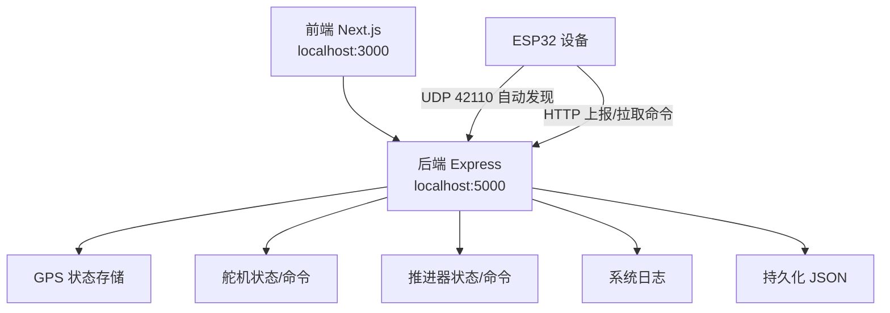
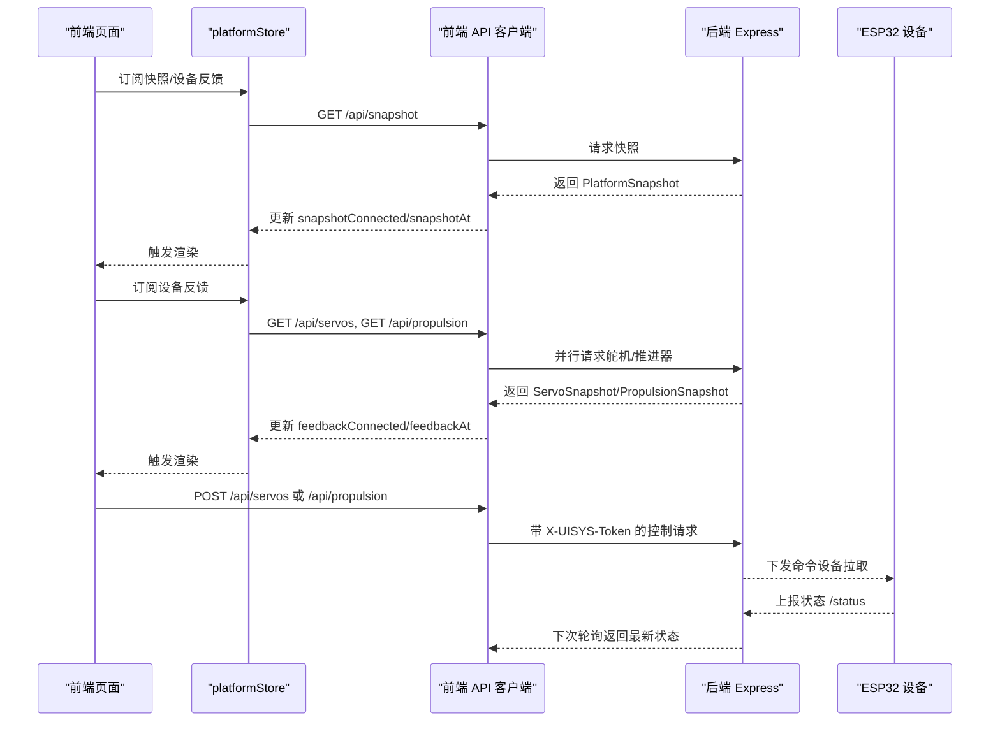
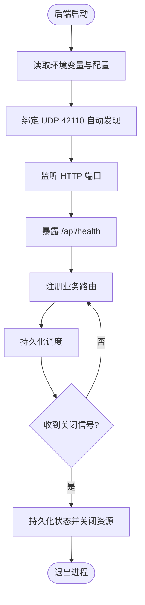
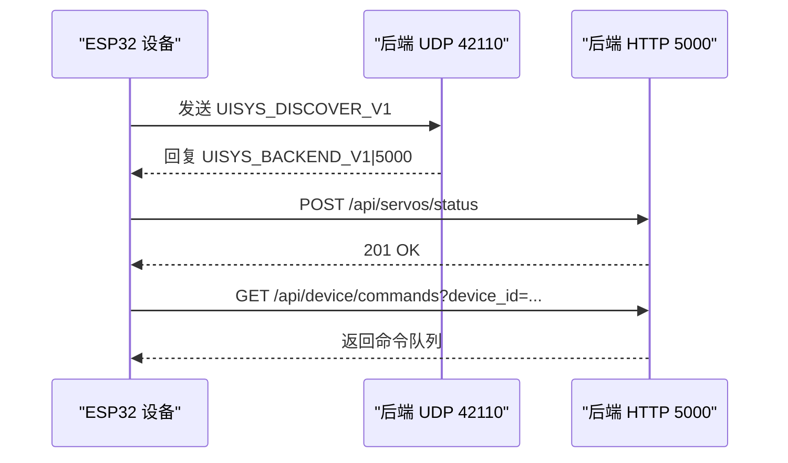
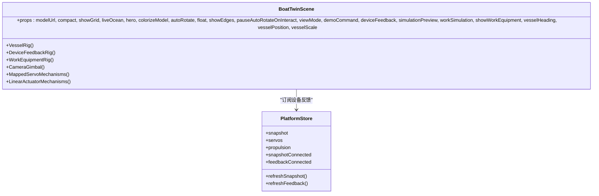
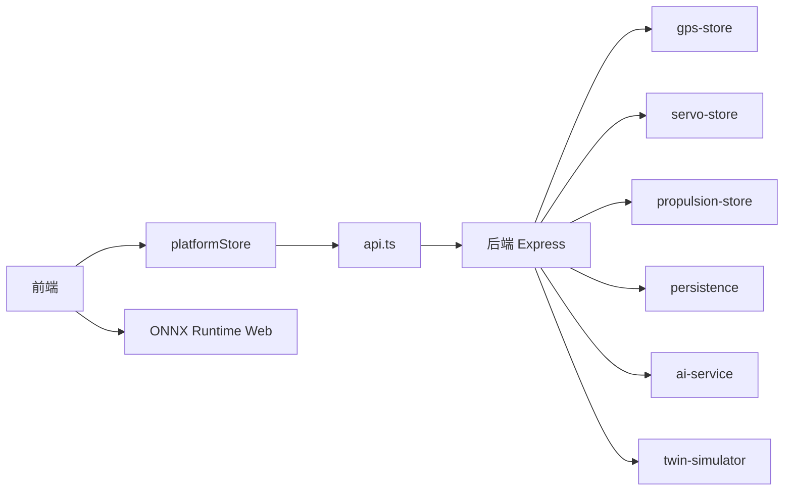

# 调试与故障排查

<cite>
**本文引用的文件**
- [README.md](file://fishery-digital-twin-platform/README.md)
- [package.json](file://fishery-digital-twin-platform/package.json)
- [后端入口 index.ts](file://fishery-digital-twin-platform/apps/backend/src/index.ts)
- [前端 API 客户端 api.ts](file://fishery-digital-twin-platform/apps/frontend/src/lib/api.ts)
- [设备反馈 Hook useDeviceFeedback.ts](file://fishery-digital-twin-platform/apps/frontend/src/hooks/useDeviceFeedback.ts)
- [平台状态存储 platformStore.ts](file://fishery-digital-twin-platform/apps/frontend/src/lib/platformStore.ts)
- [日志页面 LogsPage.tsx](file://fishery-digital-twin-platform/apps/frontend/src/components/dashboard/LogsPage.tsx)
- [持久化 persistence.ts](file://fishery-digital-twin-platform/apps/backend/src/persistence.ts)
- [GPS 状态 gps-store.ts](file://fishery-digital-twin-platform/apps/backend/src/gps-store.ts)
- [3D 船模场景 BoatTwinScene.tsx](file://fishery-digital-twin-platform/apps/frontend/src/components/three/BoatTwinScene.tsx)
- [硬件与固件说明 hardware-and-firmware.md](file://fishery-digital-twin-platform/docs/hardware-and-firmware.md)
- [预检脚本 preflight.ps1](file://fishery-digital-twin-platform/scripts/preflight.ps1)
</cite>

## 目录
1. [简介](#简介)
2. [项目结构](#项目结构)
3. [核心组件](#核心组件)
4. [架构总览](#架构总览)
5. [详细组件分析](#详细组件分析)
6. [依赖关系分析](#依赖关系分析)
7. [性能考虑](#性能考虑)
8. [故障排查指南](#故障排查指南)
9. [结论](#结论)
10. [附录](#附录)

## 简介
本文件面向“智慧渔业巡检船数字孪生与 AI 决策平台”的调试与故障排查，覆盖前端调试、后端调试、设备通信调试、数字孪生系统调试、常见错误模式诊断、日志收集与分析策略，以及故障恢复流程与应急预案。目标是帮助开发者快速定位问题并修复，保障演示与比赛现场稳定运行。

## 项目结构
- 前端：Next.js 应用，提供 3D 船模展示、环境监测、设备控制、日志查看等页面。
- 后端：Express 服务，提供健康检查、数据快照、传感器数据上报、AI 报告、舵机与推进器控制、数字孪生推演、系统日志等接口；内置 UDP 自动发现服务，供 ESP32 设备发现后端地址。
- 固件：ESP32 系列固件，负责舵机、电机、推杆、GPS 数据采集与控制命令执行，并通过 HTTP/UDP 与后端交互。
- 共享类型：packages/shared 定义前后端共享的数据结构。
- 桌面打包：Electron + electron-builder 打包为 Windows 安装程序。

**图表来源**
- [后端入口 index.ts:56-336](file://fishery-digital-twin-platform/apps/backend/src/index.ts#L56-L336)
- [硬件与固件说明 hardware-and-firmware.md:140-189](file://fishery-digital-twin-platform/docs/hardware-and-firmware.md#L140-L189)

**章节来源**
- [README.md:16-69](file://fishery-digital-twin-platform/README.md#L16-L69)
- [package.json:16-37](file://fishery-digital-twin-platform/package.json#L16-L37)

## 核心组件
- 后端服务：Express 中间件、CORS、端口与令牌校验、健康检查、数据快照、传感器数据接收、AI 报告生成、舵机与推进器控制、数字孪生推演、系统日志、UDP 自动发现、优雅关闭与持久化。
- 前端状态管理：platformStore 定时轮询后端快照与设备反馈，使用 React useSyncExternalStore 订阅更新，避免不必要的重渲染。
- 日志中心：LogsPage 每 5 秒刷新后端日志，支持按级别过滤，统计预警与异常数量。
- 设备通信：ESP32 通过 UDP 广播发现后端，再访问 HTTP 接口上报状态或拉取命令；后端对 LAN 控制接口要求令牌。
- 3D 渲染：BoatTwinScene 根据设备反馈驱动舵机、电机、推杆可视化，支持仿真预览与动画。

**章节来源**
- [后端入口 index.ts:101-561](file://fishery-digital-twin-platform/apps/backend/src/index.ts#L101-L561)
- [平台状态存储 platformStore.ts:20-139](file://fishery-digital-twin-platform/apps/frontend/src/lib/platformStore.ts#L20-L139)
- [日志页面 LogsPage.tsx:14-33](file://fishery-digital-twin-platform/apps/frontend/src/components/dashboard/LogsPage.tsx#L14-L33)
- [设备反馈 Hook useDeviceFeedback.ts:6-20](file://fishery-digital-twin-platform/apps/frontend/src/hooks/useDeviceFeedback.ts#L6-L20)
- [3D 船模场景 BoatTwinScene.tsx:34-50](file://fishery-digital-twin-platform/apps/frontend/src/components/three/BoatTwinScene.tsx#L34-L50)

## 架构总览
下图展示了从前端到后端再到设备的完整请求链路，包括健康检查、数据快照、设备控制与日志获取。

**图表来源**
- [前端 API 客户端 api.ts:6-24](file://fishery-digital-twin-platform/apps/frontend/src/lib/api.ts#L6-L24)
- [平台状态存储 platformStore.ts:98-130](file://fishery-digital-twin-platform/apps/frontend/src/lib/platformStore.ts#L98-L130)
- [后端入口 index.ts:322-538](file://fishery-digital-twin-platform/apps/backend/src/index.ts#L322-L538)

## 详细组件分析

### 后端服务调试要点
- 启动与健康检查
  - 监听端口与环境变量：PORT、HOST、UISYS_DISCOVERY_PORT、CORS_ORIGIN、UISYS_API_TOKEN。
  - 健康检查接口 /api/health 返回服务状态、数据模式、AI/GPS/舵机/推进器状态。
  - 预检脚本会检查 Node 版本、环境变量、端口占用、防火墙规则与服务健康。
- 令牌与授权
  - 非本地回环地址访问控制接口必须携带 X-UISYS-Token，否则返回 401 或 503。
  - 令牌比较使用时序安全比较，防止时序攻击。
- 数据与日志
  - 传感器数据接口 /api/data 接收水质参数与电池百分比，写入历史并计算水样状态。
  - 系统日志统一追加，限制长度，持久化到 data/platform-state.json。
- 自动发现
  - UDP 42110 监听设备发现请求，向各设备端口广播后端地址。
  - 绑定失败或权限不足时退出进程，便于快速定位端口冲突或权限问题。
- 优雅关闭
  - 捕获 SIGINT/SIGTERM，持久化状态、关闭定时器与 UDP Socket、关闭 HTTP Server。

**图表来源**
- [后端入口 index.ts:48-77](file://fishery-digital-twin-platform/apps/backend/src/index.ts#L48-L77)
- [后端入口 index.ts:271-318](file://fishery-digital-twin-platform/apps/backend/src/index.ts#L271-L318)
- [后端入口 index.ts:559-599](file://fishery-digital-twin-platform/apps/backend/src/index.ts#L559-L599)
- [持久化 persistence.ts:17-68](file://fishery-digital-twin-platform/apps/backend/src/persistence.ts#L17-L68)

**章节来源**
- [后端入口 index.ts:48-157](file://fishery-digital-twin-platform/apps/backend/src/index.ts#L48-L157)
- [后端入口 index.ts:322-561](file://fishery-digital-twin-platform/apps/backend/src/index.ts#L322-L561)
- [预检脚本 preflight.ps1:116-148](file://fishery-digital-twin-platform/scripts/preflight.ps1#L116-L148)

### 前端调试要点
- React DevTools
  - 在浏览器中打开开发者工具，切换到 Components 面板，观察 platformStore 提供的 slice 变化与连接状态。
  - 使用 Performance 面板录制关键交互（如切换页面、发起控制命令），定位渲染瓶颈。
- 网络请求调试
  - 使用 Network 面板查看 /api/snapshot、/api/servos、/api/propulsion、/api/logs 的请求与响应。
  - 关注超时设置（默认 5 秒）、CORS 错误、令牌缺失导致的 401/503。
- 性能分析
  - 使用 Performance 面板识别长任务与阻塞调用，结合 React Profiler 分析重渲染原因。
  - 对于 3D 渲染，使用 GPU 时间线观察帧率与着色器开销。

**章节来源**
- [前端 API 客户端 api.ts:6-24](file://fishery-digital-twin-platform/apps/frontend/src/lib/api.ts#L6-L24)
- [平台状态存储 platformStore.ts:20-139](file://fishery-digital-twin-platform/apps/frontend/src/lib/platformStore.ts#L20-L139)
- [日志页面 LogsPage.tsx:14-33](file://fishery-digital-twin-platform/apps/frontend/src/components/dashboard/LogsPage.tsx#L14-L33)

### 设备通信调试要点
- 串口与网络
  - ESP32 通过 UDP 42110 自动发现后端，再访问 HTTP 5000 上报状态或拉取命令。
  - 确保电脑与设备在同一热点，且热点未开启客户端隔离。
- 固件调试
  - 检查 wifi_secrets.h 中的 SSID、密码与令牌是否与后端一致。
  - 使用 Arduino IDE 编译与上传，观察串口输出确认连接与命令执行。
- 后端侧验证
  - 通过 /api/health 查看设备在线状态；通过 /api/device/commands 与 /api/propulsion/commands 拉取待执行命令。
  - 通过 /api/servos/status 与 /api/propulsion/status 接收设备状态上报。

**图表来源**
- [硬件与固件说明 hardware-and-firmware.md:140-189](file://fishery-digital-twin-platform/docs/hardware-and-firmware.md#L140-L189)
- [后端入口 index.ts:271-318](file://fishery-digital-twin-platform/apps/backend/src/index.ts#L271-L318)
- [后端入口 index.ts:500-538](file://fishery-digital-twin-platform/apps/backend/src/index.ts#L500-L538)

**章节来源**
- [硬件与固件说明 hardware-and-firmware.md:118-189](file://fishery-digital-twin-platform/docs/hardware-and-firmware.md#L118-L189)
- [后端入口 index.ts:143-157](file://fishery-digital-twin-platform/apps/backend/src/index.ts#L143-L157)

### 数字孪生系统调试要点
- 3D 渲染问题
  - 模型加载失败时回退到程序化模型；检查模型路径与 GLTF 资源。
  - 使用 Three.js 调试工具观察场景图、材质与光照。
- 状态同步异常
  - 通过 platformStore 的 snapshotConnected 与 feedbackConnected 判断连接状态。
  - 若设备反馈长时间不更新，检查后端 /api/servos 与 /api/propulsion 是否可访问。
- 性能瓶颈定位
  - 使用 Performance 面板分析 useFrame 循环与几何更新频率。
  - 降低动画帧率或减少复杂几何体以提升帧率。

**图表来源**
- [3D 船模场景 BoatTwinScene.tsx:9-50](file://fishery-digital-twin-platform/apps/frontend/src/components/three/BoatTwinScene.tsx#L9-L50)
- [平台状态存储 platformStore.ts:7-18](file://fishery-digital-twin-platform/apps/frontend/src/lib/platformStore.ts#L7-L18)

**章节来源**
- [3D 船模场景 BoatTwinScene.tsx:128-151](file://fishery-digital-twin-platform/apps/frontend/src/components/three/BoatTwinScene.tsx#L128-L151)
- [平台状态存储 platformStore.ts:98-139](file://fishery-digital-twin-platform/apps/frontend/src/lib/platformStore.ts#L98-L139)

## 依赖关系分析
- 前端依赖
  - Next.js、React 19、Three.js、@react-three/fiber、@react-three/drei。
  - 通过 platformStore 统一管理快照与设备反馈，useDeviceFeedback 提供便捷 Hook。
- 后端依赖
  - Express、cors、dotenv、dgram（UDP）。
  - 模块耦合：ai-service、gps-store、persistence、propulsion-store、servo-store、twin-simulator。
- 外部依赖
  - ONNX Runtime Web（WASM）用于前端推理，具备日志级别与错误码输出能力。

**图表来源**
- [前端 API 客户端 api.ts:1-101](file://fishery-digital-twin-platform/apps/frontend/src/lib/api.ts#L1-L101)
- [后端入口 index.ts:21-44](file://fishery-digital-twin-platform/apps/backend/src/index.ts#L21-L44)
- [GPS 状态 gps-store.ts:1-23](file://fishery-digital-twin-platform/apps/backend/src/gps-store.ts#L1-L23)

**章节来源**
- [package.json:43-52](file://fishery-digital-twin-platform/package.json#L43-L52)
- [后端入口 index.ts:21-44](file://fishery-digital-twin-platform/apps/backend/src/index.ts#L21-L44)

## 性能考虑
- 前端
  - 使用 useSyncExternalStore 避免不必要重渲染；合理设置轮询间隔（快照 2s，设备反馈 1s）。
  - 3D 场景中使用 AdaptiveDpr 与按需渲染，降低高分屏下的绘制压力。
- 后端
  - 持久化采用节流保存（250ms），避免频繁磁盘写入。
  - 系统日志限制长度（80 条），历史水样限制（180 点），控制内存占用。
- 设备通信
  - 固件仅在目标角度变化时更新 PWM，减少网络与 IO 开销。
  - 推杆控制具备冷却与限次保护，避免长时间连续运行导致过热。

[本节为通用性能建议，不直接分析具体文件]

## 故障排查指南

### 常见问题与修复步骤
- 前端无法连接后端
  - 现象：Network 面板显示 CORS 错误或 401/503。
  - 排查：检查 NEXT_PUBLIC_API_BASE、NEXT_PUBLIC_UISYS_API_TOKEN；确认后端 CORS 允许来源；确认局域网令牌一致。
  - 修复：修正 .env 配置，重新构建或重启前端；在后端启用正确 CORS 与令牌。
- 设备无法发现后端
  - 现象：ESP32 无法上报状态或拉取命令。
  - 排查：确认 UDP 42110 未被占用；检查防火墙规则；确认设备与电脑在同一热点。
  - 修复：运行 npm run setup:network 添加防火墙规则；重启后端以重新绑定 UDP。
- 3D 模型不显示
  - 现象：页面空白或回退到程序化模型。
  - 排查：检查模型路径 /models/inspection-boat.glb；确认静态资源可访问。
  - 修复：放置正确模型文件或调整模型 URL。
- 数字孪生状态不同步
  - 现象：3D 视图与设备实际状态不一致。
  - 排查：检查 platformStore 的 feedbackConnected 与 updatedAt；查看 /api/servos 与 /api/propulsion 返回值。
  - 修复：确保设备正常上报状态；必要时重置 store 或刷新页面。
- AI 报告生成失败
  - 现象：/api/ai/report 返回 503 或 429。
  - 排查：检查 DeepSeek API Key 配置；确认请求频率限制（每分钟一次）。
  - 修复：补充密钥或等待冷却后重试。

**章节来源**
- [前端 API 客户端 api.ts:6-24](file://fishery-digital-twin-platform/apps/frontend/src/lib/api.ts#L6-L24)
- [后端入口 index.ts:101-157](file://fishery-digital-twin-platform/apps/backend/src/index.ts#L101-L157)
- [后端入口 index.ts:447-473](file://fishery-digital-twin-platform/apps/backend/src/index.ts#L447-L473)
- [硬件与固件说明 hardware-and-firmware.md:140-189](file://fishery-digital-twin-platform/docs/hardware-and-firmware.md#L140-L189)

### 日志收集与分析策略
- 结构化日志
  - 后端统一 appendLog 记录事件，包含 level、title、detail、source、timestamp。
  - 前端 LogsPage 每 5 秒刷新，支持按级别过滤与统计预警/异常数量。
- 错误追踪
  - 后端全局错误处理区分 CORS 错误与其他错误，返回相应状态码。
  - 前端 fetchJson 抛出错误文本，便于在控制台查看。
- 性能指标监控
  - 使用浏览器 Performance 面板与 React Profiler 监控渲染与网络耗时。
  - 后端 /api/health 提供数据模式与设备在线状态，辅助性能评估。

**章节来源**
- [后端入口 index.ts:116-129](file://fishery-digital-twin-platform/apps/backend/src/index.ts#L116-L129)
- [后端入口 index.ts:559-561](file://fishery-digital-twin-platform/apps/backend/src/index.ts#L559-L561)
- [日志页面 LogsPage.tsx:14-33](file://fishery-digital-twin-platform/apps/frontend/src/components/dashboard/LogsPage.tsx#L14-L33)
- [持久化 persistence.ts:32-49](file://fishery-digital-twin-platform/apps/backend/src/persistence.ts#L32-L49)

### 故障恢复流程与应急预案
- 启动前检查
  - 运行 npm run doctor 进行预检，确认 Node 版本、环境变量、端口占用、防火墙规则与服务健康。
- 运行时恢复
  - 若后端崩溃，检查端口冲突与权限错误；重启服务并查看控制台日志。
  - 若设备离线，检查 WiFi 配置与令牌一致性；重新烧录固件或更换热点。
- 演示现场应急
  - 准备离线底图与演示数据，确保无网络情况下仍可展示。
  - 提前备份 platform-state.json，以便快速恢复状态。

**章节来源**
- [README.md:56-63](file://fishery-digital-twin-platform/README.md#L56-L63)
- [预检脚本 preflight.ps1:116-148](file://fishery-digital-twin-platform/scripts/preflight.ps1#L116-L148)
- [持久化 persistence.ts:17-68](file://fishery-digital-twin-platform/apps/backend/src/persistence.ts#L17-L68)

## 结论
本调试与故障排查文档基于代码库的实际实现，提供了从前端、后端到设备通信与数字孪生的系统化调试方法。通过健康检查、日志中心、预检脚本与状态持久化，能够快速定位并修复常见问题。建议在开发与演示前严格执行预检流程，确保环境配置正确、网络连接稳定、设备在线可靠。

[本节为总结性内容，不直接分析具体文件]

## 附录
- 常用命令
  - npm run dev：同时启动后端与前端开发服务器。
  - npm run build：构建共享类型、后端与前端。
  - npm run start：生产模式启动后端与前端。
  - npm run doctor：运行预检脚本，检查环境与依赖。
  - npm run firmware:setup：安装固件依赖并编译所有固件。
- 关键端口
  - 前端：3000（TCP）
  - 后端：5000（TCP）
  - 设备自动发现：42110（UDP）
  - 设备回调端口：42111/42112/42113/42114（UDP）

**章节来源**
- [package.json:16-37](file://fishery-digital-twin-platform/package.json#L16-L37)
- [硬件与固件说明 hardware-and-firmware.md:140-189](file://fishery-digital-twin-platform/docs/hardware-and-firmware.md#L140-L189)