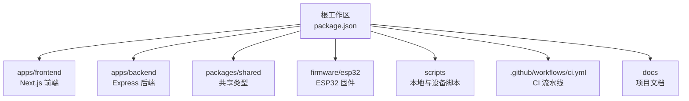
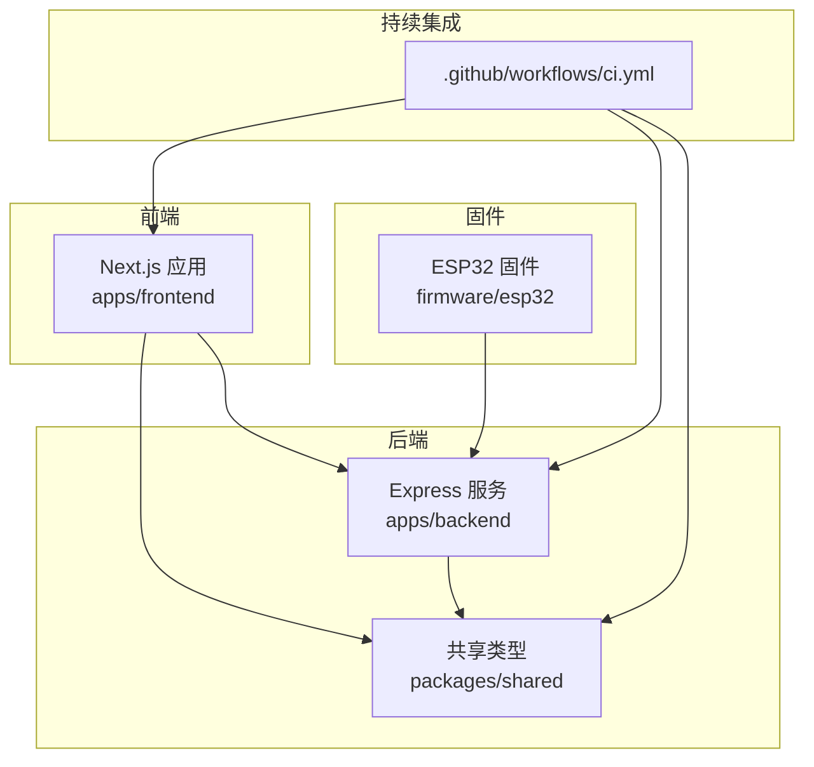
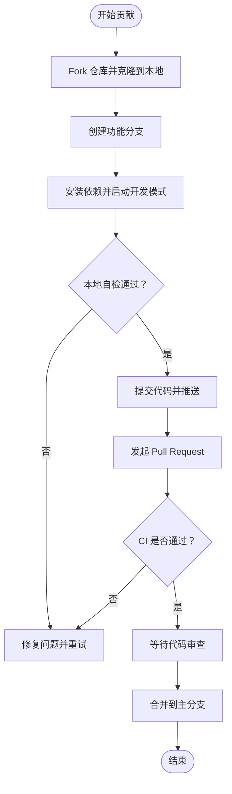
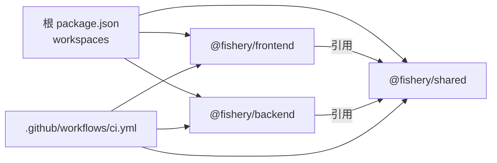

# 贡献指南

<cite>
**本文引用的文件**
- [README.md](file://fishery-digital-twin-platform/README.md)
- [package.json](file://fishery-digital-twin-platform/package.json)
- [CI 工作流](file://.github/workflows/ci.yml)
- [项目结构说明](file://fishery-digital-twin-platform/docs/project-structure.md)
- [最终检查清单](file://fishery-digital-twin-platform/docs/final-checklist.md)
- [系统审查与修复记录](file://fishery-digital-twin-platform/docs/code-review-2026-08-08.md)
- [后端包配置](file://fishery-digital-twin-platform/apps/backend/package.json)
- [前端包配置](file://fishery-digital-twin-platform/apps/frontend/package.json)
- [设备存储测试](file://fishery-digital-twin-platform/apps/backend/src/device-stores.test.ts)
- [预检脚本](file://fishery-digital-twin-platform/scripts/preflight.ps1)
</cite>

## 目录
1. [简介](#简介)
2. [项目结构](#项目结构)
3. [核心组件](#核心组件)
4. [架构总览](#架构总览)
5. [详细组件分析](#详细组件分析)
6. [依赖分析](#依赖分析)
7. [性能考虑](#性能考虑)
8. [故障排查指南](#故障排查指南)
9. [结论](#结论)
10. [附录](#附录)

## 简介
本贡献指南面向希望参与“智慧渔业巡检船数字孪生与 AI 决策平台”开发与维护的协作者。文档覆盖代码贡献流程、代码审查标准、新功能开发流程、文档贡献方式、问题报告规范以及社区参与和行为准则，帮助你在保证质量的前提下高效协作。

## 项目结构
仓库采用 Monorepo 组织：
- apps/backend：Express 后端服务，提供 AI、设备命令与健康接口。
- apps/frontend：Next.js 前端，包含 3D 展示、图表、地图与控制页面。
- packages/shared：前后端共享 TypeScript 类型定义。
- firmware/esp32：ESP32 固件（舵机板、GPS、SimpleFOC 推进器）。
- docs：项目结构、硬件接入、模型训练与安全网络等文档。
- scripts：本地环境初始化、设备配置、网络配置、固件工具等脚本。
- .github/workflows：CI 流水线，统一执行 lint、测试、类型检查与构建。

**图示来源**
- [package.json:12-37](file://fishery-digital-twin-platform/package.json#L12-L37)
- [CI 工作流:1-26](file://.github/workflows/ci.yml#L1-L26)

**章节来源**
- [README.md:16-28](file://fishery-digital-twin-platform/README.md#L16-L28)
- [项目结构说明:1-138](file://fishery-digital-twin-platform/docs/project-structure.md#L1-L138)
- [package.json:1-37](file://fishery-digital-twin-platform/package.json#L1-L37)

## 核心组件
- 前端（Next.js）：提供首页 3D 船模、系统总览、三维孪生、环境监测、执行机构控制、航线规划、设备健康与操作日志等页面。
- 后端（Express）：注册 API 路由，监听 0.0.0.0:5000，处理 AI 报告、设备状态与命令队列、持久化日志与快照。
- 共享类型（packages/shared）：统一水质、电池、导航、AI 报告、舵机、推进器与日志类型，避免前后端字段不一致。
- 固件（ESP32）：两块舵机板与双无刷推进器固件，通过 UDP 自动发现后端并上报状态。
- 脚本与 CI：本地预检、设备与网络配置、固件编译；CI 在 push/PR 时执行 lint、测试、类型检查与构建。

**章节来源**
- [项目结构说明:15-138](file://fishery-digital-twin-platform/docs/project-structure.md#L15-L138)
- [README.md:36-69](file://fishery-digital-twin-platform/README.md#L36-L69)
- [CI 工作流:1-26](file://.github/workflows/ci.yml#L1-L26)

## 架构总览
下图展示了前端、后端、共享类型与固件之间的交互关系，以及 CI 对代码质量的保障。

**图示来源**
- [项目结构说明:15-138](file://fishery-digital-twin-platform/docs/project-structure.md#L15-L138)
- [CI 工作流:1-26](file://.github/workflows/ci.yml#L1-L26)

## 详细组件分析

### 代码贡献流程
- Fork 仓库并在本地克隆。
- 创建功能分支，命名建议体现变更内容（如 feature/xxx、fix/xxx）。
- 在 fishery-digital-twin-platform 目录下安装依赖并运行本地预检：
  - 安装依赖：npm install
  - 启动开发模式：npm run dev（同时启动后端与前端）
  - 运行诊断：npm run doctor
- 提交前自检：
  - 代码风格：npm run lint
  - 单元测试：npm test
  - 类型检查：npm run typecheck
  - 构建验证：npm run build
- 推送分支并提交 Pull Request，确保 CI 全部通过。
- 根据审查意见修改后再次推送，直至合并。

**章节来源**
- [README.md:36-69](file://fishery-digital-twin-platform/README.md#L36-L69)
- [package.json:16-37](file://fishery-digital-twin-platform/package.json#L16-L37)
- [CI 工作流:1-26](file://.github/workflows/ci.yml#L1-L26)

### 代码审查标准
- 审查清单
  - 变更范围清晰，仅包含必要改动。
  - 新增或修改的 API 与类型已在共享类型中同步。
  - 前端 ESLint 零警告，后端类型检查通过。
  - 单元测试覆盖关键路径，边界条件有断言。
  - 构建成功且无安全漏洞告警。
  - 敏感信息未提交（密钥、令牌、WiFi 密码）。
- 质量要求
  - 输入参数需进行范围校验与类型约束。
  - 设备离线时拒绝活动控制命令，急停仍可下发。
  - 命令采用短 TTL 幂等轮询，避免丢失导致的状态不一致。
  - CORS 默认仅允许本机前端，局域网控制与上报要求令牌。
- 反馈处理方式
  - 针对每条审查意见逐条回复与修改。
  - 使用最小可行补丁逐步迭代，避免一次性大改。
  - 若涉及外部账号或远程历史重写，需单独审批。

**章节来源**
- [系统审查与修复记录:1-37](file://fishery-digital-twin-platform/docs/code-review-2026-08-08.md#L1-L37)
- [设备存储测试:12-93](file://fishery-digital-twin-platform/apps/backend/src/device-stores.test.ts#L12-L93)
- [CI 工作流:1-26](file://.github/workflows/ci.yml#L1-L26)

### 新功能开发流程
- 需求分析
  - 明确业务目标与用户场景，评估对前后端与固件的影响面。
  - 识别数据模型变化与接口契约变更。
- 技术方案设计
  - 更新 packages/shared 中的类型定义，确保前后端一致。
  - 设计后端 API 路由与命令队列策略（TTL、幂等性）。
  - 前端页面与组件拆分，保持可复用性与可测试性。
- 实现计划
  - 先完成核心路径的最小可用版本，再扩展边缘情况。
  - 为关键逻辑编写单元测试与类型检查用例。
- 测试验证
  - 本地运行 npm run doctor 确认端口、令牌与服务健康。
  - 执行 npm run lint/test/typecheck/build 确保质量门禁。
  - 在真实设备上复测控制、通信与异常恢复。

**章节来源**
- [项目结构说明:65-107](file://fishery-digital-twin-platform/docs/project-structure.md#L65-L107)
- [设备存储测试:12-93](file://fishery-digital-twin-platform/apps/backend/src/device-stores.test.ts#L12-L93)
- [README.md:56-69](file://fishery-digital-twin-platform/README.md#L56-L69)

### 文档贡献方式
- API 文档更新
  - 当新增或修改后端接口时，补充请求/响应示例与错误码说明。
  - 确保共享类型与接口契约保持一致。
- 用户手册编写
  - 描述功能入口、操作步骤与注意事项，参考现有页面结构与演示顺序。
- 示例代码维护
  - 保持示例可运行，遵循 ESLint 与类型检查规则。
  - 将示例与真实设备解耦，必要时提供模拟数据。

**章节来源**
- [README.md:189-207](file://fishery-digital-twin-platform/README.md#L189-L207)
- [项目结构说明:15-64](file://fishery-digital-twin-platform/docs/project-structure.md#L15-L64)

### 问题报告规范
- Bug 描述模板
  - 标题：简明扼要说明问题。
  - 环境信息：操作系统、Node/npm 版本、浏览器、设备型号与固件版本。
  - 复现步骤：按顺序列出操作步骤，尽量最小化复现场景。
  - 期望行为与实际行为：对比说明差异。
  - 日志与截图：附上相关日志片段与界面截图。
- 环境信息收集
  - 使用 npm run doctor 输出诊断结果。
  - 检查端口占用、防火墙规则与 WiFi 配置。
  - 确认后端健康接口与 ESP32 心跳正常。

**章节来源**
- [README.md:56-69](file://fishery-digital-twin-platform/README.md#L56-L69)
- [最终检查清单:1-58](file://fishery-digital-twin-platform/docs/final-checklist.md#L1-L58)

### 社区参与指南
- 讨论参与
  - 在 Issue 或讨论区提出想法与问题，提供背景与证据。
  - 尊重不同观点，聚焦技术与用户体验。
- 技术分享
  - 分享调试经验、性能优化与最佳实践。
  - 将知识沉淀到 docs 与 README，便于后来者查阅。
- 知识传播
  - 编写教程与示例，降低上手门槛。
  - 维护示例代码的可运行性与可复现性。

[本节为通用指导，不直接分析具体文件]

### 贡献者行为准则与社区规范
- 尊重与包容：以建设性方式沟通，避免人身攻击。
- 透明与开放：公开变更记录与决策依据。
- 质量优先：遵循代码规范与质量门禁，不牺牲稳定性换取速度。
- 安全合规：不提交敏感信息，遵守网络安全与隐私保护要求。

[本节为通用指导，不直接分析具体文件]

## 依赖分析
Monorepo 通过 workspaces 管理多包依赖，CI 统一执行质量检查。

**图示来源**
- [package.json:12-37](file://fishery-digital-twin-platform/package.json#L12-L37)
- [CI 工作流:1-26](file://.github/workflows/ci.yml#L1-L26)

**章节来源**
- [package.json:1-37](file://fishery-digital-twin-platform/package.json#L1-L37)
- [CI 工作流:1-26](file://.github/workflows/ci.yml#L1-L26)

## 性能考虑
- 前端
  - 合理使用 React 与 Three.js 渲染，避免不必要的重绘。
  - 图表与地图数据按需加载，减少首屏体积。
- 后端
  - 命令队列采用短 TTL 幂等轮询，降低重复与丢失风险。
  - 日志与快照采用原子 JSON 持久化，提升可靠性。
  - AI 接口增加超时与限流，防止阻塞。
- 固件
  - 通过 UDP 自动发现后端，减少手动配置与维护成本。
  - 传感器与执行机构需进行量程与限位校验，确保安全。

[本节为通用指导，结合仓库已有机制总结]

## 故障排查指南
- 启动与端口冲突
  - 使用 npm run doctor 检查 3000、5000、42110 端口占用。
  - 确保 Windows 防火墙允许 TCP 5000 与 UDP 42110 入站。
- 设备连接与令牌
  - 确认 ESP32 与电脑在同一热点，且未启用客户端隔离。
  - 后端与固件使用相同令牌；缺少令牌会被拒绝。
- 网络与自动发现
  - 固件广播 UISYS_DISCOVER_V1，后端监听 UDP 42110 并回复。
  - 设备分别监听 42111/42112/42113/42114，独立 GPS 与推进器互不干扰。
- 安全与环境
  - 不要提交 .env 与 wifi_secrets.h；使用脚本生成与轮换令牌。
  - DeepSeek 密钥仅保存在本机 .env，不上传至仓库。

**章节来源**
- [README.md:143-185](file://fishery-digital-twin-platform/README.md#L143-L185)
- [最终检查清单:24-47](file://fishery-digital-twin-platform/docs/final-checklist.md#L24-L47)
- [预检脚本:1-42](file://fishery-digital-twin-platform/scripts/preflight.ps1#L1-L42)

## 结论
本贡献指南基于仓库现有的工程实践与文档，提供了从贡献流程、审查标准、新功能的端到端流程到问题报告与社区参与的完整指引。遵循这些规范，可以显著提升协作效率与代码质量，确保系统在本地与真实设备上稳定运行。

## 附录
- 常用命令速查
  - 安装依赖：npm install
  - 启动开发：npm run dev
  - 诊断环境：npm run doctor
  - 代码风格：npm run lint
  - 单元测试：npm test
  - 类型检查：npm run typecheck
  - 构建产物：npm run build
- 推荐演示顺序
  - 首页 3D 船模 → 系统总览 → 三维孪生 → 环境监测（数据采集与 AI 报告）→ 水上执行机构 → 航线规划与设备健康 → 操作日志

**章节来源**
- [README.md:36-77](file://fishery-digital-twin-platform/README.md#L36-L77)
- [最终检查清单:48-58](file://fishery-digital-twin-platform/docs/final-checklist.md#L48-L58)