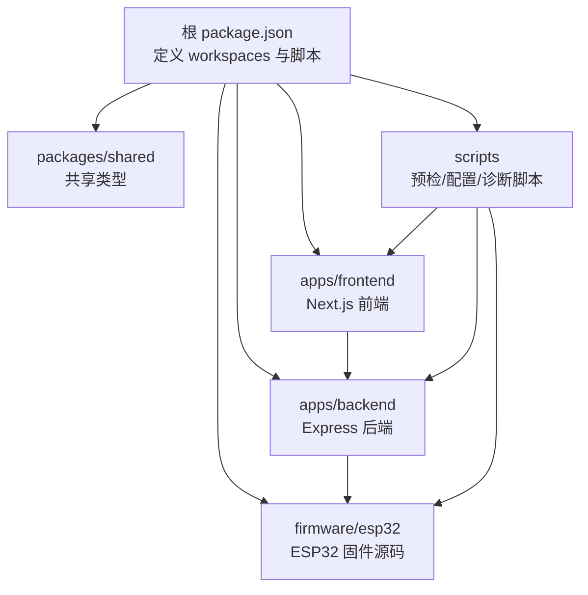
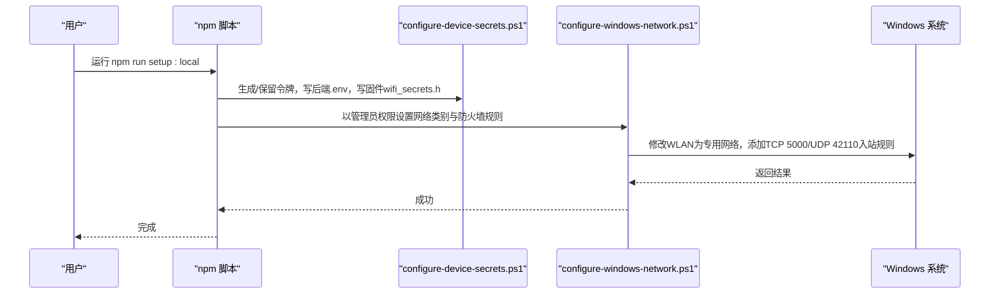

# 快速开始

<cite>
**本文引用的文件**
- [README.md](file://fishery-digital-twin-platform/README.md)
- [package.json](file://fishery-digital-twin-platform/package.json)
- [apps/backend/package.json](file://fishery-digital-twin-platform/apps/backend/package.json)
- [apps/frontend/package.json](file://fishery-digital-twin-platform/apps/frontend/package.json)
- [scripts/preflight.ps1](file://fishery-digital-twin-platform/scripts/preflight.ps1)
- [scripts/configure-device-secrets.ps1](file://fishery-digital-twin-platform/scripts/configure-device-secrets.ps1)
- [scripts/configure-windows-network.ps1](file://fishery-digital-twin-platform/scripts/configure-windows-network.ps1)
- [scripts/firmware-tooling.ps1](file://fishery-digital-twin-platform/scripts/firmware-tooling.ps1)
- [docs/hardware-and-firmware.md](file://fishery-digital-twin-platform/docs/hardware-and-firmware.md)
- [firmware/esp32/maker_esp32_pro_servo_temp_01/wifi_secrets.example.h](file://fishery-digital-twin-platform/firmware/esp32/maker_esp32_pro_servo_temp_01/wifi_secrets.example.h)
</cite>

## 目录
1. [简介](#简介)
2. [项目结构](#项目结构)
3. [环境准备](#环境准备)
4. [克隆与安装](#克隆与安装)
5. [本地初始化 setup:local](#本地初始化-setuplocal)
6. [启动方式](#启动方式)
7. [常用命令速查](#常用命令速查)
8. [硬件与固件烧录](#硬件与固件烧录)
9. [网络与安全配置](#网络与安全配置)
10. [常见问题排查](#常见问题排查)
11. [结论](#结论)

## 简介
本指南面向首次接触“智慧渔业巡检船数字孪生平台”的用户，目标是帮助你在 Windows 环境下快速完成环境准备、依赖安装、令牌与网络配置，并顺利进入开发调试或生产运行。平台包含前端（Next.js）、后端（Express + TypeScript）、共享类型包以及 ESP32 固件工具链；首次运行会生成控制令牌、配置本机防火墙规则，并为后续设备自动发现打通 UDP/TCP 端口。

## 项目结构
仓库采用多工作区（workspaces）组织：
- apps/backend：后端服务，提供设备接口、AI 接口与健康检查等。
- apps/frontend：前端页面，包含三维展示、地图、图表与控制面板。
- packages/shared：前后端共享的 TypeScript 类型定义。
- firmware/esp32：ESP32/MAKER-ESP32-PRO/SimpleFOC 固件源码与示例。
- scripts：Windows PowerShell 脚本，负责预检、设备密钥生成、网络规则设置、固件工具链管理等。
- docs：硬件接入、安全与网络说明等文档。

图示来源
- [package.json:12-37](file://fishery-digital-twin-platform/package.json#L12-L37)

章节来源
- [README.md:16-28](file://fishery-digital-twin-platform/README.md#L16-L28)
- [package.json:12-37](file://fishery-digital-twin-platform/package.json#L12-L37)

## 环境准备
在首次复制到新 Windows 电脑时，请按顺序完成以下准备：
- 安装 Node.js 22（推荐 22.20+），并确保 npm 版本满足要求。
- 如需烧录或编译固件，安装 Arduino IDE 2.x。
- 确保当前用户具备管理员权限（用于设置 Windows 防火墙规则）。

说明
- 项目通过引擎约束指定 Node.js 与 npm 版本范围，并在启动前进行预检。
- 固件工具链会自动查找已安装的 Arduino CLI，若缺失则提示先安装 Arduino IDE 2.x。

章节来源
- [package.json:7-10](file://fishery-digital-twin-platform/package.json#L7-L10)
- [scripts/firmware-tooling.ps1:10-32](file://fishery-digital-twin-platform/scripts/firmware-tooling.ps1#L10-L32)
- [scripts/preflight.ps1:68-76](file://fishery-digital-twin-platform/scripts/preflight.ps1#L68-L76)

## 克隆与安装
在项目根目录执行：
- 安装依赖：npm install
- 首次本地初始化：npm run setup:local
- 启动开发模式：npm run dev

说明
- setup:local 会依次调用设备配置与网络配置脚本，生成令牌、写入后端与环境变量、为固件生成 wifi_secrets.h，并开放必要的防火墙规则。
- dev 会同时启动后端与前端，默认监听端口见下文。

章节来源
- [README.md:38-54](file://fishery-digital-twin-platform/README.md#L38-L54)
- [package.json:16-37](file://fishery-digital-twin-platform/package.json#L16-L37)

## 本地初始化 setup:local
setup:local 是首次运行的关键步骤，它会：
- 生成或复用后端控制令牌（UISYS_API_TOKEN），长度不少于 32 位十六进制。
- 写入后端 .env（HOST、PORT、CORS_ORIGIN 等），并同步到桌面应用配置路径。
- 为所有固件目录生成一致的 wifi_secrets.h（SSID、密码、令牌），不会被 Git 跟踪。
- 将当前 WLAN 网络设为“专用网络”，并创建入站规则允许 TCP 5000 与 UDP 42110。
- 不打印任何敏感信息（热点密码、令牌等）。

执行流程概览

图示来源
- [scripts/configure-device-secrets.ps1:20-30](file://fishery-digital-twin-platform/scripts/configure-device-secrets.ps1#L20-L30)
- [scripts/configure-device-secrets.ps1:85-169](file://fishery-digital-twin-platform/scripts/configure-device-secrets.ps1#L85-L169)
- [scripts/configure-windows-network.ps1:10-63](file://fishery-digital-twin-platform/scripts/configure-windows-network.ps1#L10-L63)
- [package.json:28-32](file://fishery-digital-twin-platform/package.json#L28-L32)

注意事项
- 首次运行会询问热点名称和密码；重复运行默认保留原令牌。
- 仅在确认所有 ESP32 都会重新烧录时，才使用旋转令牌命令。
- 生成的 wifi_secrets.h 会被 .gitignore 忽略，避免泄露。

章节来源
- [README.md:46-48](file://fishery-digital-twin-platform/README.md#L46-L48)
- [scripts/configure-device-secrets.ps1:57-83](file://fishery-digital-twin-platform/scripts/configure-device-secrets.ps1#L57-L83)
- [scripts/configure-device-secrets.ps1:96-169](file://fishery-digital-twin-platform/scripts/configure-device-secrets.ps1#L96-L169)
- [scripts/configure-windows-network.ps1:33-63](file://fishery-digital-twin-platform/scripts/configure-windows-network.ps1#L33-L63)
- [scripts/preflight.ps1:112-114](file://fishery-digital-twin-platform/scripts/preflight.ps1#L112-L114)

## 启动方式
- 开发模式：npm run dev
  - 同时启动后端与前端，便于热重载与联调。
  - 默认地址：前端 http://localhost:3000，后端 http://localhost:5000。
- 生产模式：npm run build && npm run start
  - 构建产物后并行启动后端与前端，适合比赛展示或长时间运行。

说明
- 启动前会执行预检脚本，检查 Node.js 版本、端口占用、健康状态与防火墙规则。
- 若端口被占用，需先停止旧进程再启动。

章节来源
- [README.md:64-76](file://fishery-digital-twin-platform/README.md#L64-L76)
- [package.json:17-26](file://fishery-digital-twin-platform/package.json#L17-L26)
- [scripts/preflight.ps1:116-148](file://fishery-digital-twin-platform/scripts/preflight.ps1#L116-L148)

## 常用命令速查
- npm run dev：并行启动后端与前端开发服务器。
- npm run build：构建共享包、后端与前端。
- npm run start：并行启动后端与前端生产服务。
- npm run doctor：运行时诊断，检查前后端健康、设备在线状态与防火墙规则。
- npm run setup:local：生成令牌、配置设备与网络。
- npm run setup:desktop：仅同步桌面应用配置（不询问热点密码、不更换令牌）。
- npm run setup:devices:rotate：主动轮换令牌（需重新烧录受影响设备）。
- npm run firmware:setup：安装 Arduino Core 与库依赖。
- npm run firmware:check：编译全部固件源码。
- npm run lint / npm test / npm run typecheck：代码质量检查。

章节来源
- [package.json:16-37](file://fishery-digital-twin-platform/package.json#L16-L37)
- [README.md:56-63](file://fishery-digital-twin-platform/README.md#L56-L63)

## 硬件与固件烧录
- 首次需要安装 Arduino IDE 2.x，然后运行固件工具链命令安装依赖并验证编译。
- 使用 setup:local 会为所有固件生成一致的 wifi_secrets.h（包含 SSID、密码与令牌），无需手动复制示例文件。
- 若只更新桌面应用配置，可使用 setup:desktop。
- 若更换热点或令牌，必须重新烧录受影响的 ESP32。

固件入口与设备 ID
- 舵机板1（servo-quad-01）：maker_esp32_pro_servo_temp_01.ino
- 舵机板2（servo-quad-02）：maker_esp32_pro_four_servo_02.ino
- 双无刷推进板（mks-foc-dual-01）：esp32_simplefoc_dual_propulsion.ino

章节来源
- [README.md:94-141](file://fishery-digital-twin-platform/README.md#L94-L141)
- [docs/hardware-and-firmware.md:11-57](file://fishery-digital-twin-platform/docs/hardware-and-firmware.md#L11-L57)
- [scripts/firmware-tooling.ps1:46-74](file://fishery-digital-twin-platform/scripts/firmware-tooling.ps1#L46-L74)
- [scripts/configure-device-secrets.ps1:13-18](file://fishery-digital-twin-platform/scripts/configure-device-secrets.ps1#L13-L18)

## 网络与安全配置
- 自动发现机制：ESP32 通过 UDP 广播 UISYS_DISCOVER_V1 到电脑 UDP 42110，电脑回复/主动广播后端地址，ESP32 据此访问 HTTP 5000。
- 端口与协议：
  - TCP 5000：后端 API（局域网内设备访问需令牌）。
  - UDP 42110：设备自动发现。
  - 各固件监听不同 UDP 端口接收回包（如 42111/42112/42113/42114）。
- 防火墙：setup:network 会将 WLAN 设为“专用网络”，并创建入站规则允许 TCP 5000 与 UDP 42110。
- 安全建议：
  - 使用手机热点或专用路由器，避免公共网络。
  - 不要公开 .env 与 wifi_secrets.h。
  - 局域网控制接口要求令牌，缺少将被拒绝。

章节来源
- [README.md:143-180](file://fishery-digital-twin-platform/README.md#L143-L180)
- [scripts/configure-windows-network.ps1:33-63](file://fishery-digital-twin-platform/scripts/configure-windows-network.ps1#L33-L63)
- [scripts/preflight.ps1:145-148](file://fishery-digital-twin-platform/scripts/preflight.ps1#L145-L148)

## 常见问题排查
- 无法访问前端或后端
  - 检查是否已运行 npm run dev 或 npm run start。
  - 使用 npm run doctor 查看端口占用与服务健康状态。
  - 若端口被占用，先停止旧进程再启动。
- 设备离线或无法上报
  - 确认 ESP32 与电脑在同一 WiFi，且热点未开启客户端隔离。
  - 确认已运行 setup:local 并重新烧录对应固件。
  - 检查 Windows 防火墙是否允许 TCP 5000 与 UDP 42110。
- 令牌不一致
  - 若更换了热点或令牌，需重新烧录受影响设备。
  - 使用 setup:desktop 可仅同步桌面应用配置。
- 端口冲突
  - 前端 3000、后端 5000、发现 42110 必须可用。
  - 使用 netstat 或任务管理器释放占用端口。
- 预检失败
  - 根据 doctor 输出逐项修复：Node.js 版本、.env 是否存在、HOST 是否为 0.0.0.0、令牌长度是否足够、防火墙规则是否存在。

章节来源
- [scripts/preflight.ps1:68-148](file://fishery-digital-twin-platform/scripts/preflight.ps1#L68-L148)
- [README.md:56-63](file://fishery-digital-twin-platform/README.md#L56-L63)
- [docs/hardware-and-firmware.md:177-204](file://fishery-digital-twin-platform/docs/hardware-and-firmware.md#L177-L204)

## 结论
通过本指南，你可以在 Windows 上快速完成 Node.js 与 Arduino IDE 的环境准备，使用 npm install 与 npm run setup:local 完成依赖安装、令牌生成与网络配置，并以开发或生产模式启动平台。配合 npm run doctor 与文档中的排查步骤，能够高效定位并解决常见问题，保障开发与演示顺利进行。