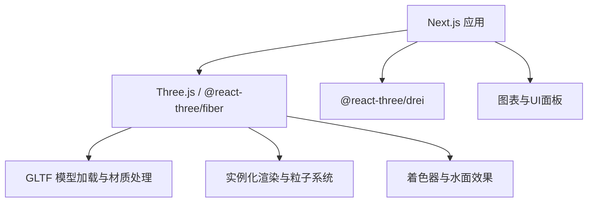
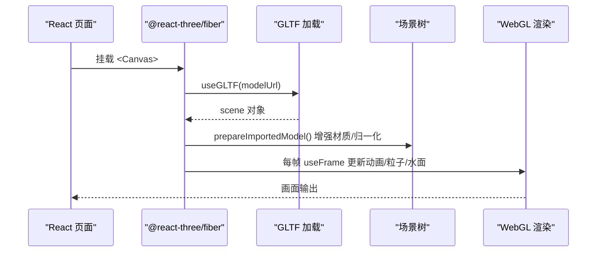
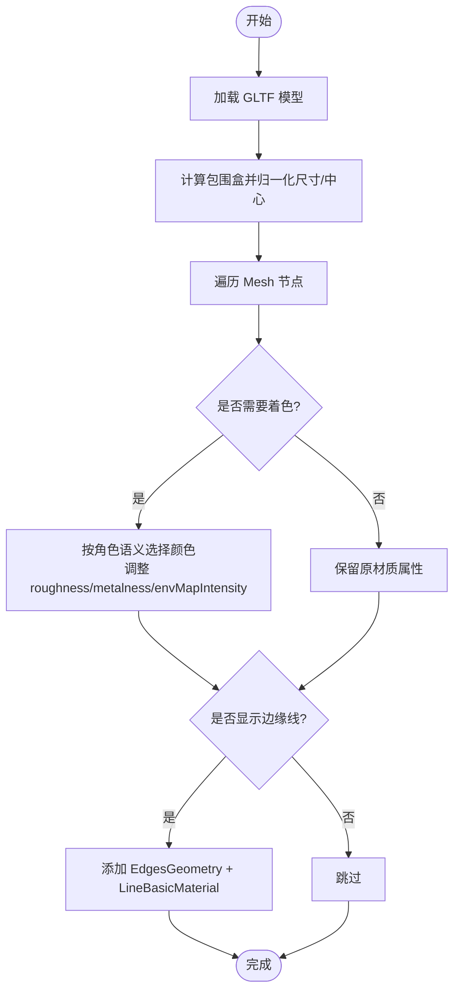
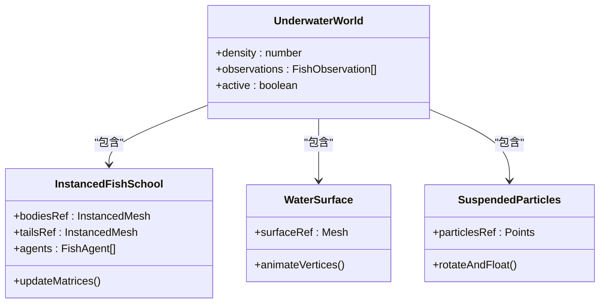
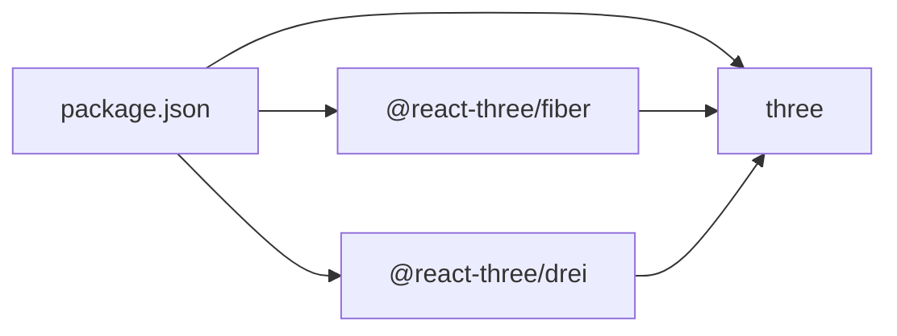

# 3D场景渲染

<cite>
**本文引用的文件**
- [BoatTwinScene.tsx](file://fishery-digital-twin-platform/apps/frontend/src/components/three/BoatTwinScene.tsx)
- [UnderwaterFishScene.tsx](file://fishery-digital-twin-platform/apps/frontend/src/components/three/UnderwaterFishScene.tsx)
- [WaterPage.tsx](file://fishery-digital-twin-platform/apps/frontend/src/components/dashboard/WaterPage.tsx)
- [package.json](file://fishery-digital-twin-platform/apps/frontend/package.json)
</cite>

## 目录
1. [简介](#简介)
2. [项目结构](#项目结构)
3. [核心组件](#核心组件)
4. [架构总览](#架构总览)
5. [详细组件分析](#详细组件分析)
6. [依赖关系分析](#依赖关系分析)
7. [性能考虑](#性能考虑)
8. [故障排查指南](#故障排查指南)
9. [结论](#结论)
10. [附录](#附录)

## 简介
本文件面向基于 Three.js 的 3D 场景渲染实现，聚焦于渔业数字孪生平台前端中的船模加载与渲染、水下场景构建（鱼类动画、水流粒子、光线折射模拟与环境氛围）、场景管理架构（层次结构、对象池、渲染管线优化、内存控制）以及实时渲染优化策略（LOD、纹理压缩、阴影优化、GPU资源管理）。同时提供定制指南与性能监控调试建议，帮助开发者快速扩展新的模型、材质与视觉效果。

## 项目结构
本项目采用 Next.js + React + Three.js 技术栈，3D 相关能力集中在前端应用的 three 组件目录中：
- 船模与水面场景：BoatTwinScene.tsx
- 水下鱼群与水体环境：UnderwaterFishScene.tsx
- 数据可视化与页面编排：WaterPage.tsx
- 依赖声明：package.json

图示来源
- [package.json:14-31](file://fishery-digital-twin-platform/apps/frontend/package.json#L14-L31)

章节来源
- [package.json:14-31](file://fishery-digital-twin-platform/apps/frontend/package.json#L14-L31)

## 核心组件
- BoatTwinScene.tsx：负责 GLTF 船模导入、材质增强、光照与水波着色器、设备反馈可视化、演示路径与轨迹、海洋平面与养殖环境等。
- UnderwaterFishScene.tsx：负责水下世界构建，包括水面波动、海底地形、悬浮粒子、鱼群实例化动画与追踪观测点。
- WaterPage.tsx：负责水质数据展示与分析，与 3D 场景配合形成“监测+可视化”的闭环。

章节来源
- [BoatTwinScene.tsx:1-1776](file://fishery-digital-twin-platform/apps/frontend/src/components/three/BoatTwinScene.tsx#L1-L1776)
- [UnderwaterFishScene.tsx:1-356](file://fishery-digital-twin-platform/apps/frontend/src/components/three/UnderwaterFishScene.tsx#L1-L356)
- [WaterPage.tsx:1-612](file://fishery-digital-twin-platform/apps/frontend/src/components/dashboard/WaterPage.tsx#L1-L612)

## 架构总览
整体渲染架构以 React 组件为入口，通过 @react-three/fiber 创建 Canvas，并在其中组合多个子场景：
- 船模场景：使用 useGLTF 加载 GLB/GLTF，遍历 Mesh 进行材质增强与边缘线叠加，结合自定义 ShaderMaterial 实现动态水面。
- 水下场景：使用 InstancedMesh 批量绘制鱼体与尾鳍，Points 粒子模拟悬浮微粒，PlaneGeometry 顶点动画模拟水面波动。
- 交互与控制：OrbitControls 提供视角控制；useFrame 驱动动画与状态更新；useProgress 显示模型加载进度。

图示来源
- [BoatTwinScene.tsx:809-870](file://fishery-digital-twin-platform/apps/frontend/src/components/three/BoatTwinScene.tsx#L809-L870)
- [BoatTwinScene.tsx:1060-1094](file://fishery-digital-twin-platform/apps/frontend/src/components/three/BoatTwinScene.tsx#L1060-L1094)
- [UnderwaterFishScene.tsx:90-250](file://fishery-digital-twin-platform/apps/frontend/src/components/three/UnderwaterFishScene.tsx#L90-L250)

## 详细组件分析

### 船模加载与渲染流程（GLTF 导入、材质贴图、光照与环境映射）
- 模型加载与预处理
  - 使用 useGLTF 获取场景图，clone(true) 避免共享引用，计算包围盒并归一化尺寸与中心位置，确保多模型统一尺度。
  - 遍历所有 Mesh，关闭阴影投射/接收以减少开销，替换或增强材质，保留贴图通道（map、normalMap、roughnessMap、metalnessMap、aoMap、emissiveMap），根据角色语义选择颜色与物理属性。
  - 可选添加边缘线叠加（EdgesGeometry + LineBasicMaterial），用于高亮轮廓。
- 材质增强策略
  - 将原始 MeshStandardMaterial 复制为新材质，按“仅浅色材质着色”或“全量着色”模式调整 roughness/metalness/envMapIntensity。
  - 对带贴图的着色材质降低金属度与粗糙度，提升视觉一致性。
- 光照与环境
  - 场景中配置环境光、半球光、方向光与点光源，营造水下/水面混合光照氛围。
  - 材质 envMapIntensity 根据是否着色调整，平衡反射强度。
- 水面与波浪
  - 使用自定义 Vertex/Fragment Shader 实现波浪位移与高光涟漪，透明渲染且关闭深度写入以避免遮挡问题。
- 设备反馈与演示
  - 舵机、电机、线性推杆等部件根据设备反馈或仿真参数驱动旋转/伸缩，呈现实时状态。
  - 演示模式下沿预设路径移动船体，生成尾迹粒子。

图示来源
- [BoatTwinScene.tsx:833-870](file://fishery-digital-twin-platform/apps/frontend/src/components/three/BoatTwinScene.tsx#L833-L870)
- [BoatTwinScene.tsx:872-923](file://fishery-digital-twin-platform/apps/frontend/src/components/three/BoatTwinScene.tsx#L872-L923)
- [BoatTwinScene.tsx:987-1011](file://fishery-digital-twin-platform/apps/frontend/src/components/three/BoatTwinScene.tsx#L987-L1011)

章节来源
- [BoatTwinScene.tsx:809-1011](file://fishery-digital-twin-platform/apps/frontend/src/components/three/BoatTwinScene.tsx#L809-L1011)

### 水下场景构建（鱼类动画、水流粒子、光线折射模拟、环境氛围）
- 鱼群动画
  - 使用 InstancedMesh 批量绘制鱼体与尾鳍，设置 DynamicDrawUsage 提高更新效率。
  - 每帧计算速度、转向、边界约束与观测点跟随，更新 instanceMatrix 并标记 needsUpdate。
- 水面波动
  - PlaneGeometry 顶点在 useFrame 中按正弦函数扰动 Z 轴，模拟水面起伏。
  - 使用 meshPhysicalMaterial 半透明渲染，关闭 depthWrite 避免遮挡。
- 悬浮粒子
  - Points + BufferGeometry 存储大量粒子坐标，缓慢旋转与上下浮动，营造水体悬浮感。
- 海底与岩石
  - 地面平面与随机分布的多面体岩石构成海底地貌，增加真实感。
- 光照与环境
  - 背景色、雾效、环境光、半球光、方向光与点光源共同塑造水下氛围。

图示来源
- [UnderwaterFishScene.tsx:53-88](file://fishery-digital-twin-platform/apps/frontend/src/components/three/UnderwaterFishScene.tsx#L53-L88)
- [UnderwaterFishScene.tsx:90-250](file://fishery-digital-twin-platform/apps/frontend/src/components/three/UnderwaterFishScene.tsx#L90-L250)
- [UnderwaterFishScene.tsx:252-355](file://fishery-digital-twin-platform/apps/frontend/src/components/three/UnderwaterFishScene.tsx#L252-L355)

章节来源
- [UnderwaterFishScene.tsx:53-355](file://fishery-digital-twin-platform/apps/frontend/src/components/three/UnderwaterFishScene.tsx#L53-L355)

### 3D 场景管理架构（层次结构、对象池、渲染管线优化、内存控制）
- 层次结构
  - 以 Group 组织船体、设备反馈、工作设备、养殖环境与轨迹层，便于独立控制与动画。
- 对象池与复用
  - 鱼群使用 InstancedMesh 作为“对象池”，减少 draw call 与内存分配。
  - 粒子系统使用预分配的 Float32Array 与 BufferAttribute，避免每帧 new。
- 渲染管线优化
  - 关闭不必要的阴影投射/接收，降低 GPU 压力。
  - 使用 renderOrder 控制透明物体渲染顺序，避免闪烁。
  - 使用 frustumCulled=false 时谨慎评估可见性，当前鱼群禁用视锥剔除以提升稳定性。
- 内存控制
  - 使用 useMemo/useCallback 缓存几何与材质参数，减少重复创建。
  - 模型 clone(true) 后及时释放中间变量，避免泄漏。
  - 使用 useProgress 监听加载状态，避免阻塞主线程。

章节来源
- [BoatTwinScene.tsx:153-273](file://fishery-digital-twin-platform/apps/frontend/src/components/three/BoatTwinScene.tsx#L153-L273)
- [BoatTwinScene.tsx:809-870](file://fishery-digital-twin-platform/apps/frontend/src/components/three/BoatTwinScene.tsx#L809-L870)
- [UnderwaterFishScene.tsx:90-250](file://fishery-digital-twin-platform/apps/frontend/src/components/three/UnderwaterFishScene.tsx#L90-L250)

### 实时渲染优化策略（LOD、纹理压缩、阴影计算优化、GPU资源管理）
- LOD 级别控制
  - 当前未显式实现多级 LOD，但可通过距离阈值切换不同复杂度模型或关闭边缘线/粒子数量来降级。
- 纹理压缩
  - 建议在模型导出阶段使用 KTX2/Draco 压缩，减少带宽与显存占用；当前代码保留原始贴图通道，便于后续集成。
- 阴影计算优化
  - 关闭 Mesh 阴影投射/接收，减少 Shadow Map 计算；如需阴影，建议使用级联阴影或烘焙静态阴影。
- GPU 资源管理
  - 使用 DynamicDrawUsage 与 instanceMatrix.needsUpdate 精确更新实例矩阵。
  - 使用 transparent 与 depthWrite=false 控制透明渲染批次，避免过度重绘。
  - 限制粒子数量与几何细分，平衡画质与性能。

章节来源
- [UnderwaterFishScene.tsx:135-160](file://fishery-digital-twin-platform/apps/frontend/src/components/three/UnderwaterFishScene.tsx#L135-L160)
- [UnderwaterFishScene.tsx:234-250](file://fishery-digital-twin-platform/apps/frontend/src/components/three/UnderwaterFishScene.tsx#L234-L250)
- [BoatTwinScene.tsx:856-867](file://fishery-digital-twin-platform/apps/frontend/src/components/three/BoatTwinScene.tsx#L856-L867)

### 3D 场景定制指南（添加新模型、材质、视觉效果）
- 添加新模型
  - 在 public/models 下放置 GLB/GLTF，修改默认 URL 或通过 props 传入 modelUrl。
  - 使用 useGLTF 加载后，prepareImportedModel 会自动归一化与材质增强。
- 自定义材质
  - 在 enhanceSingleMaterial 中扩展角色颜色与物理属性，支持新增材质类型与贴图通道。
- 新增视觉效果
  - 水面/粒子：参考 OceanPlane 与 SuspendedParticles，使用 ShaderMaterial 与 Points 实现。
  - 设备反馈：参考 DeviceFeedbackRig 与 MappedServoMechanisms，绑定传感器数据驱动动画。
- 光照与环境映射
  - 在场景根节点添加环境光、半球光、方向光与点光源，调整 envMapIntensity 匹配材质反射。

章节来源
- [BoatTwinScene.tsx:57-74](file://fishery-digital-twin-platform/apps/frontend/src/components/three/BoatTwinScene.tsx#L57-L74)
- [BoatTwinScene.tsx:809-870](file://fishery-digital-twin-platform/apps/frontend/src/components/three/BoatTwinScene.tsx#L809-L870)
- [BoatTwinScene.tsx:1060-1094](file://fishery-digital-twin-platform/apps/frontend/src/components/three/BoatTwinScene.tsx#L1060-L1094)

## 依赖关系分析
- 运行时依赖
  - three：核心 3D 引擎。
  - @react-three/fiber：React 与 Three.js 的桥梁，提供 Canvas、useFrame、useThree 等。
  - @react-three/drei：常用工具如 OrbitControls、Line、useGLTF、useProgress。
- 构建与开发
  - Next.js 作为框架，TypeScript 提供类型安全，Tailwind 用于 UI 样式。

图示来源
- [package.json:14-31](file://fishery-digital-twin-platform/apps/frontend/package.json#L14-L31)

章节来源
- [package.json:14-31](file://fishery-digital-twin-platform/apps/frontend/package.json#L14-L31)

## 性能考虑
- 渲染频率控制
  - 使用 frameloop="demand" 或按需 invalidate 降低空闲帧率，节省电量与 CPU/GPU。
- 实例化与批处理
  - 鱼群使用 InstancedMesh，减少 draw call；粒子使用 Points，避免逐对象更新。
- 透明与深度写入
  - 透明物体关闭 depthWrite，合理设置 renderOrder，避免排序错误导致的闪烁。
- 几何与材质复杂度
  - 控制几何细分与贴图分辨率，必要时启用 Draco/KTX2 压缩。
- 内存与生命周期
  - 使用 useMemo/useCallback 缓存计算结果；及时清理定时器与事件监听。

[本节为通用指导，不直接分析具体文件]

## 故障排查指南
- 模型未显示
  - 检查 modelUrl 是否正确，useGLTF 是否成功返回 scene；确认 prepareImportedModel 是否执行。
- 材质异常
  - 检查 enhanceSingleMaterial 是否覆盖原材质；确认 map/normalMap 等通道是否正确传递。
- 水面不渲染
  - 确认 ShaderMaterial 的 uniforms.uTime 是否在 useFrame 中更新；检查 transparent 与 depthWrite 设置。
- 鱼群卡顿
  - 检查 instancedMesh.instanceMatrix.needsUpdate 是否设置；确认 agents 数组长度与 count 一致。
- 性能下降
  - 减少粒子数量与几何细分；关闭不必要的光照与阴影；使用 demand 帧循环。

章节来源
- [BoatTwinScene.tsx:1762-1773](file://fishery-digital-twin-platform/apps/frontend/src/components/three/BoatTwinScene.tsx#L1762-L1773)
- [UnderwaterFishScene.tsx:135-160](file://fishery-digital-twin-platform/apps/frontend/src/components/three/UnderwaterFishScene.tsx#L135-L160)
- [UnderwaterFishScene.tsx:252-283](file://fishery-digital-twin-platform/apps/frontend/src/components/three/UnderwaterFishScene.tsx#L252-L283)

## 结论
该 3D 场景渲染实现以 React + Three.js 为核心，通过 GLTF 模型加载与材质增强、自定义水面着色器、实例化鱼群与粒子系统，构建了完整的船模与水下环境。架构上注重层次化管理与渲染优化，具备良好的可扩展性与性能基础。开发者可在此基础上继续引入 LOD、纹理压缩与更精细的 GPU 资源管理，进一步提升复杂场景下的表现力与流畅度。

[本节为总结，不直接分析具体文件]

## 附录
- 关键 API 与工具
  - useGLTF：加载 GLTF/GLB 模型。
  - useFrame：每帧回调，驱动动画与状态更新。
  - OrbitControls：相机交互控制。
  - InstancedMesh：批量渲染相同几何体。
  - ShaderMaterial：自定义顶点/片段着色器。
- 推荐实践
  - 模型导出阶段启用 Draco/KTX2 压缩。
  - 使用 useProgress 显示加载状态，提升用户体验。
  - 通过 demo/simulation 模式验证视觉效果与性能。

[本节为补充信息，不直接分析具体文件]