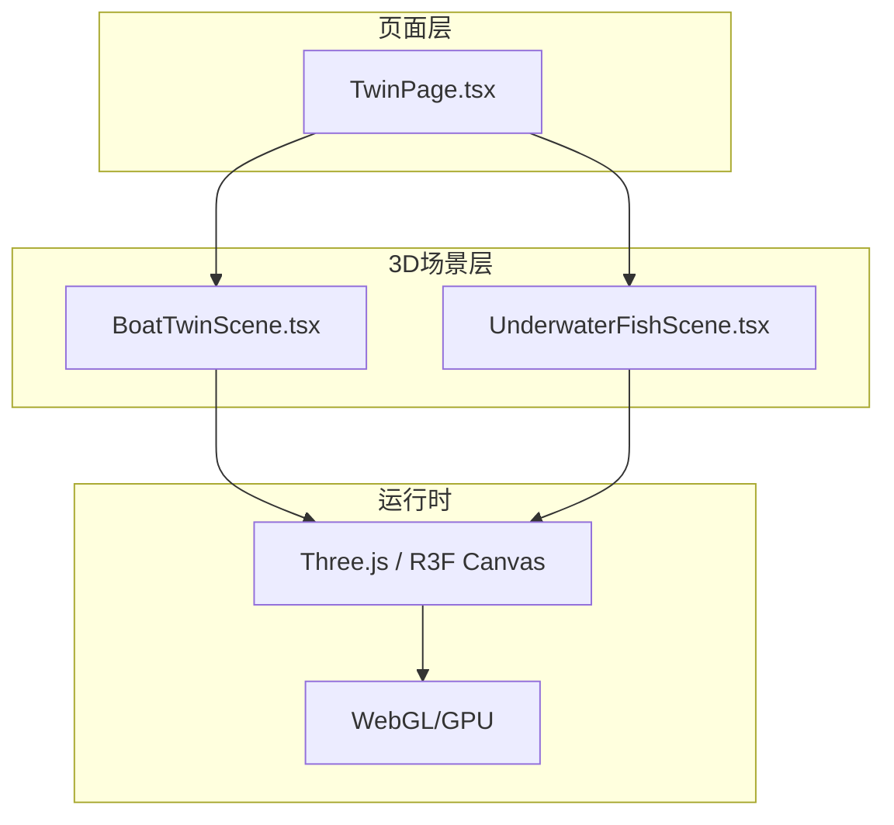
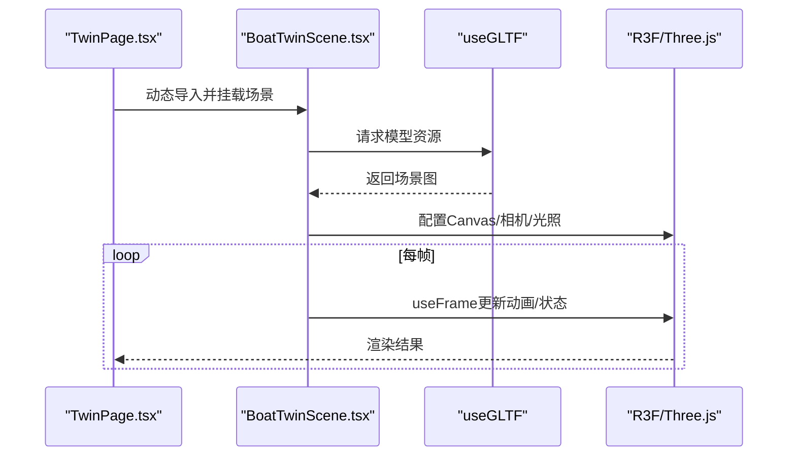
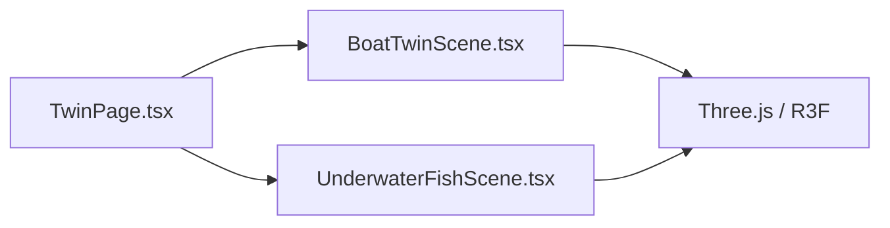

# 场景管理与优化

<cite>
**本文引用的文件**
- [BoatTwinScene.tsx](file://fishery-digital-twin-platform/apps/frontend/src/components/three/BoatTwinScene.tsx)
- [UnderwaterFishScene.tsx](file://fishery-digital-twin-platform/apps/frontend/src/components/three/UnderwaterFishScene.tsx)
- [TwinPage.tsx](file://fishery-digital-twin-platform/apps/frontend/src/components/dashboard/TwinPage.tsx)
</cite>

## 目录
1. [简介](#简介)
2. [项目结构](#项目结构)
3. [核心组件](#核心组件)
4. [架构总览](#架构总览)
5. [详细组件分析](#详细组件分析)
6. [依赖关系分析](#依赖关系分析)
7. [性能考量](#性能考量)
8. [故障排查指南](#故障排查指南)
9. [结论](#结论)
10. [附录](#附录)

## 简介
本文件面向3D数字孪生前端中的场景管理与渲染优化，围绕以下目标展开：
- 场景生命周期管理：Canvas组件使用、初始化流程、资源加载与释放策略。
- 渲染管线优化：useFrame的正确用法、帧率控制、渲染批次优化、GPU资源管理。
- 对象池模式：几何体复用、材质缓存、纹理管理、实例化渲染。
- LOD系统：距离检测、模型切换策略、纹理压缩、阴影优化。
- 性能监控：FPS计数器、内存使用分析、渲染统计、瓶颈识别。
- 最佳实践：高效3D渲染代码编写与常见问题解决。

## 项目结构
本项目的前端采用Next.js + React Three Fiber（R3F）构建3D场景。关键目录与职责如下：
- apps/frontend/src/components/three：3D场景组件，包含船舶数字孪生场景与水下鱼群场景。
- apps/frontend/src/components/dashboard：页面级组合与交互，动态加载3D场景并传递参数。
- apps/frontend/public/models：静态模型资源（GLB等）。

图表来源
- [TwinPage.tsx:14-102](file://fishery-digital-twin-platform/apps/frontend/src/components/dashboard/TwinPage.tsx#L14-L102)
- [BoatTwinScene.tsx:1567-1600](file://fishery-digital-twin-platform/apps/frontend/src/components/three/BoatTwinScene.tsx#L1567-L1600)
- [UnderwaterFishScene.tsx:38-50](file://fishery-digital-twin-platform/apps/frontend/src/components/three/UnderwaterFishScene.tsx#L38-L50)

章节来源
- [TwinPage.tsx:14-102](file://fishery-digital-twin-platform/apps/frontend/src/components/dashboard/TwinPage.tsx#L14-L102)
- [BoatTwinScene.tsx:1567-1600](file://fishery-digital-twin-platform/apps/frontend/src/components/three/BoatTwinScene.tsx#L1567-L1600)
- [UnderwaterFishScene.tsx:38-50](file://fishery-digital-twin-platform/apps/frontend/src/components/three/UnderwaterFishScene.tsx#L38-L50)

## 核心组件
- BoatTwinScene：船舶数字孪生主场景，负责模型加载、材质增强、设备反馈可视化、动画与交互控制。
- UnderwaterFishScene：水下鱼群场景，使用实例化渲染实现大规模群体动画。
- TwinPage：页面容器，动态导入3D场景，提供全屏、复位、仿真预览等交互。

章节来源
- [BoatTwinScene.tsx:1-1776](file://fishery-digital-twin-platform/apps/frontend/src/components/three/BoatTwinScene.tsx#L1-L1776)
- [UnderwaterFishScene.tsx:1-356](file://fishery-digital-twin-platform/apps/frontend/src/components/three/UnderwaterFishScene.tsx#L1-L356)
- [TwinPage.tsx:1-768](file://fishery-digital-twin-platform/apps/frontend/src/components/dashboard/TwinPage.tsx#L1-L768)

## 架构总览
整体数据流与控制流：
- 页面通过动态导入加载BoatTwinScene，并传入视图模式、缩放、仿真预览等参数。
- 场景内部使用R3F的Canvas进行渲染，结合useFrame驱动动画与状态更新。
- 模型资源通过useGLTF加载并进行标准化与材质增强；设备反馈数据驱动机械部件动画。
- 水下鱼群场景通过InstancedMesh批量绘制，减少Draw Call，提升性能。

图表来源
- [TwinPage.tsx:14-102](file://fishery-digital-twin-platform/apps/frontend/src/components/dashboard/TwinPage.tsx#L14-L102)
- [BoatTwinScene.tsx:809-870](file://fishery-digital-twin-platform/apps/frontend/src/components/three/BoatTwinScene.tsx#L809-L870)
- [BoatTwinScene.tsx:1567-1600](file://fishery-digital-twin-platform/apps/frontend/src/components/three/BoatTwinScene.tsx#L1567-L1600)

## 详细组件分析

### 场景生命周期管理（Canvas、初始化、资源加载、释放）
- Canvas配置：
  - 设置dpr范围、frameloop模式（always/demand）、相机参数、gl抗锯齿与powerPreference。
  - 示例参考：[UnderwaterFishScene.tsx:42-47](file://fishery-digital-twin-platform/apps/frontend/src/components/three/UnderwaterFishScene.tsx#L42-L47)。
- 模型加载与预处理：
  - 使用useGLTF加载GLB模型，并通过prepareImportedModel进行尺寸归一化、中心对齐、材质增强与可选边缘叠加。
  - 示例参考：[BoatTwinScene.tsx:809-870](file://fishery-digital-twin-platform/apps/frontend/src/components/three/BoatTwinScene.tsx#L809-L870)。
- 资源释放机制：
  - 在React卸载时清理requestAnimationFrame、定时器、事件监听等，避免内存泄漏。
  - 示例参考：[BoatTwinScene.tsx:131-148](file://fishery-digital-twin-platform/apps/frontend/src/components/three/BoatTwinScene.tsx#L131-L148)。

章节来源
- [UnderwaterFishScene.tsx:42-47](file://fishery-digital-twin-platform/apps/frontend/src/components/three/UnderwaterFishScene.tsx#L42-L47)
- [BoatTwinScene.tsx:809-870](file://fishery-digital-twin-platform/apps/frontend/src/components/three/BoatTwinScene.tsx#L809-L870)
- [BoatTwinScene.tsx:131-148](file://fishery-digital-twin-platform/apps/frontend/src/components/three/BoatTwinScene.tsx#L131-L148)

### 渲染管线优化（useFrame、帧率控制、批次优化、GPU资源）
- useFrame正确用法：
  - 将动画逻辑放入useFrame中，使用delta时间确保跨设备一致性。
  - 示例参考：[BoatTwinScene.tsx:219-246](file://fishery-digital-twin-platform/apps/frontend/src/components/three/BoatTwinScene.tsx#L219-L246)、[BoatTwinScene.tsx:400-418](file://fishery-digital-twin-platform/apps/frontend/src/components/three/BoatTwinScene.tsx#L400-L418)。
- 帧率控制：
  - 自定义Ticker组件基于requestAnimationFrame与fps参数限制刷新频率，降低CPU开销。
  - 示例参考：[BoatTwinScene.tsx:128-151](file://fishery-digital-twin-platform/apps/frontend/src/components/three/BoatTwinScene.tsx#L128-L151)。
- 渲染批次优化：
  - 使用InstancedMesh批量绘制鱼群，减少Draw Call；设置DynamicDrawUsage以支持频繁矩阵更新。
  - 示例参考：[UnderwaterFishScene.tsx:135-160](file://fishery-digital-twin-platform/apps/frontend/src/components/three/UnderwaterFishScene.tsx#L135-L160)、[UnderwaterFishScene.tsx:162-236](file://fishery-digital-twin-platform/apps/frontend/src/components/three/UnderwaterFishScene.tsx#L162-L236)。
- GPU资源管理：
  - 合理设置透明材质、深度写入、法线贴图、环境贴图强度，避免过度消耗GPU带宽。
  - 示例参考：[BoatTwinScene.tsx:888-923](file://fishery-digital-twin-platform/apps/frontend/src/components/three/BoatTwinScene.tsx#L888-L923)。

章节来源
- [BoatTwinScene.tsx:128-151](file://fishery-digital-twin-platform/apps/frontend/src/components/three/BoatTwinScene.tsx#L128-L151)
- [BoatTwinScene.tsx:219-246](file://fishery-digital-twin-platform/apps/frontend/src/components/three/BoatTwinScene.tsx#L219-L246)
- [BoatTwinScene.tsx:400-418](file://fishery-digital-twin-platform/apps/frontend/src/components/three/BoatTwinScene.tsx#L400-L418)
- [UnderwaterFishScene.tsx:135-160](file://fishery-digital-twin-platform/apps/frontend/src/components/three/UnderwaterFishScene.tsx#L135-L160)
- [UnderwaterFishScene.tsx:162-236](file://fishery-digital-twin-platform/apps/frontend/src/components/three/UnderwaterFishScene.tsx#L162-L236)
- [BoatTwinScene.tsx:888-923](file://fishery-digital-twin-platform/apps/frontend/src/components/three/BoatTwinScene.tsx#L888-L923)

### 对象池模式应用（几何体复用、材质缓存、纹理管理、实例化渲染）
- 几何体复用：
  - 对重复使用的几何体（如鱼身、鱼尾）使用共享Geometry并通过InstancedMesh更新矩阵。
  - 示例参考：[UnderwaterFishScene.tsx:238-249](file://fishery-digital-twin-platform/apps/frontend/src/components/three/UnderwaterFishScene.tsx#L238-L249)。
- 材质缓存：
  - 对材质进行统一创建与复用，避免每帧new Material导致的GC压力。
  - 示例参考：[BoatTwinScene.tsx:888-923](file://fishery-digital-twin-platform/apps/frontend/src/components/three/BoatTwinScene.tsx#L888-L923)。
- 纹理管理：
  - 保留原始模型的map/normalMap/roughnessMap等贴图，按需调整metalness/roughness与环境贴图强度。
  - 示例参考：[BoatTwinScene.tsx:891-921](file://fishery-digital-twin-platform/apps/frontend/src/components/three/BoatTwinScene.tsx#L891-L921)。
- 实例化渲染：
  - 使用InstancedMesh批量绘制大量相同或相似对象，显著降低Draw Call数量。
  - 示例参考：[UnderwaterFishScene.tsx:99-160](file://fishery-digital-twin-platform/apps/frontend/src/components/three/UnderwaterFishScene.tsx#L99-L160)。

章节来源
- [UnderwaterFishScene.tsx:99-160](file://fishery-digital-twin-platform/apps/frontend/src/components/three/UnderwaterFishScene.tsx#L99-L160)
- [UnderwaterFishScene.tsx:238-249](file://fishery-digital-twin-platform/apps/frontend/src/components/three/UnderwaterFishScene.tsx#L238-L249)
- [BoatTwinScene.tsx:888-923](file://fishery-digital-twin-platform/apps/frontend/src/components/three/BoatTwinScene.tsx#L888-L923)

### LOD系统（距离检测、模型切换、纹理压缩、阴影优化）
- 距离检测与模型切换：
  - 当前未实现自动LOD切换，但可通过相机距离计算触发不同精度模型或简化材质。
  - 建议：在CameraViewController中根据camera.position.distance判断并切换模型或材质。
- 纹理压缩：
  - 建议使用KTX2/ETC等压缩纹理格式，减少显存占用与加载时间。
- 阴影优化：
  - 关闭不必要的castShadow/receiveShadow，或使用分层阴影、阴影贴图分辨率调优。
  - 示例参考：[BoatTwinScene.tsx:856-867](file://fishery-digital-twin-platform/apps/frontend/src/components/three/BoatTwinScene.tsx#L856-L867)。

章节来源
- [BoatTwinScene.tsx:856-867](file://fishery-digital-twin-platform/apps/frontend/src/components/three/BoatTwinScene.tsx#L856-L867)

### 性能监控工具（FPS计数器、内存分析、渲染统计、瓶颈识别）
- FPS计数器：
  - 可基于useThree的invalidate与requestAnimationFrame实现简易FPS统计。
- 内存使用分析：
  - 使用浏览器开发者工具的Memory面板观察JS堆与GPU内存变化，定位泄漏点。
- 渲染统计：
  - 使用stats.js或Three.js内置renderer.info统计Draw Call、三角形数量。
- 瓶颈识别：
  - 关注useFrame中的密集循环、材质更新、几何体重建等热点路径。

章节来源
- [BoatTwinScene.tsx:128-151](file://fishery-digital-twin-platform/apps/frontend/src/components/three/BoatTwinScene.tsx#L128-L151)

## 依赖关系分析
- TwinPage依赖BoatTwinScene进行动态加载，传递视图模式、仿真预览等参数。
- BoatTwinScene依赖Three.js与@react-three/fiber/drei提供的Canvas、useFrame、OrbitControls等。
- UnderwaterFishScene同样依赖R3F与Three.js，重点在于InstancedMesh的性能优势。

图表来源
- [TwinPage.tsx:14-102](file://fishery-digital-twin-platform/apps/frontend/src/components/dashboard/TwinPage.tsx#L14-L102)
- [BoatTwinScene.tsx:1567-1600](file://fishery-digital-twin-platform/apps/frontend/src/components/three/BoatTwinScene.tsx#L1567-L1600)
- [UnderwaterFishScene.tsx:38-50](file://fishery-digital-twin-platform/apps/frontend/src/components/three/UnderwaterFishScene.tsx#L38-L50)

章节来源
- [TwinPage.tsx:14-102](file://fishery-digital-twin-platform/apps/frontend/src/components/dashboard/TwinPage.tsx#L14-L102)
- [BoatTwinScene.tsx:1567-1600](file://fishery-digital-twin-platform/apps/frontend/src/components/three/BoatTwinScene.tsx#L1567-L1600)
- [UnderwaterFishScene.tsx:38-50](file://fishery-digital-twin-platform/apps/frontend/src/components/three/UnderwaterFishScene.tsx#L38-L50)

## 性能考量
- 使用useFrame集中处理动画与状态更新，避免在render中进行重计算。
- 通过InstancedMesh批量绘制大量对象，减少Draw Call。
- 合理设置材质属性（透明度、深度写入、金属度、粗糙度），避免过度渲染。
- 使用自适应dpr与frameloop模式，平衡清晰度与性能。
- 对模型进行预处理（归一化、材质增强），减少运行时开销。
- 关闭不必要的阴影与反射，或使用低分辨率阴影贴图。

## 故障排查指南
- 场景卡顿：
  - 检查useFrame中是否存在高复杂度计算或频繁创建对象。
  - 确认是否启用了过多透明材质或复杂着色器。
- 内存泄漏：
  - 确保在组件卸载时清理requestAnimationFrame、定时器与事件监听。
- 模型显示异常：
  - 检查模型坐标与相机位置，确认材质是否正确应用。
- 鱼群动画不流畅：
  - 检查InstancedMesh的矩阵更新是否频繁，必要时降低密度或简化动画。

章节来源
- [BoatTwinScene.tsx:131-148](file://fishery-digital-twin-platform/apps/frontend/src/components/three/BoatTwinScene.tsx#L131-L148)
- [UnderwaterFishScene.tsx:162-236](file://fishery-digital-twin-platform/apps/frontend/src/components/three/UnderwaterFishScene.tsx#L162-L236)

## 结论
本项目在3D场景管理方面采用了成熟的R3F与Three.js技术栈，实现了高效的模型加载、材质增强、实例化渲染与动画控制。通过合理的useFrame使用、帧率控制与GPU资源管理，能够在保证视觉效果的同时维持良好性能。未来可进一步引入LOD系统与更精细的资源管理策略，以应对更大规模场景与更高帧率需求。

## 附录
- 最佳实践清单：
  - 使用useFrame处理动画，避免在render中执行重计算。
  - 优先使用InstancedMesh批量绘制相同或相似对象。
  - 对材质进行统一创建与复用，避免频繁new Material。
  - 合理设置透明材质与深度写入，减少过绘制。
  - 使用压缩纹理格式，降低显存占用与加载时间。
  - 关闭不必要的阴影与反射，或使用低分辨率阴影贴图。
  - 在组件卸载时清理所有定时器与动画帧，避免内存泄漏。