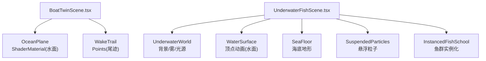
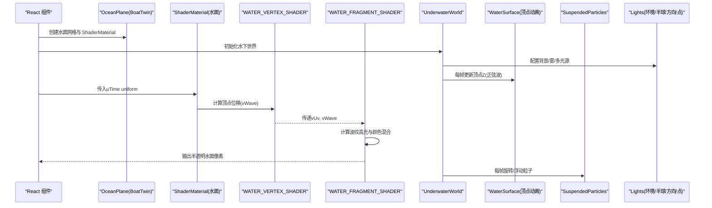
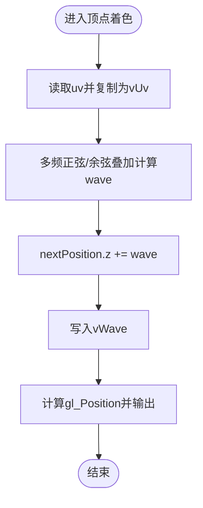
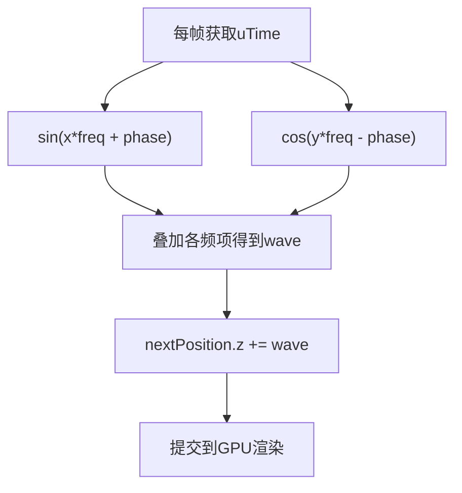
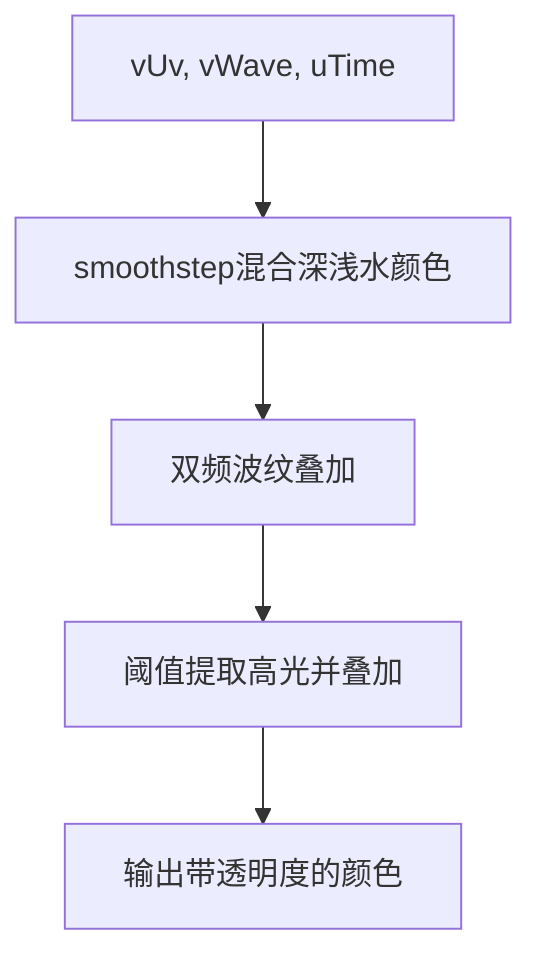
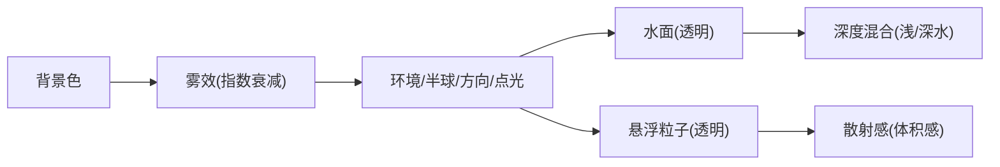
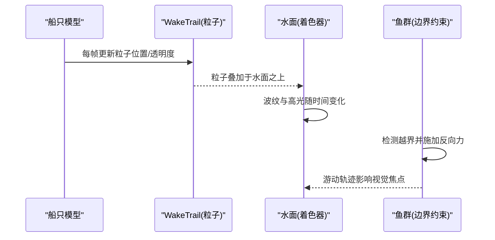
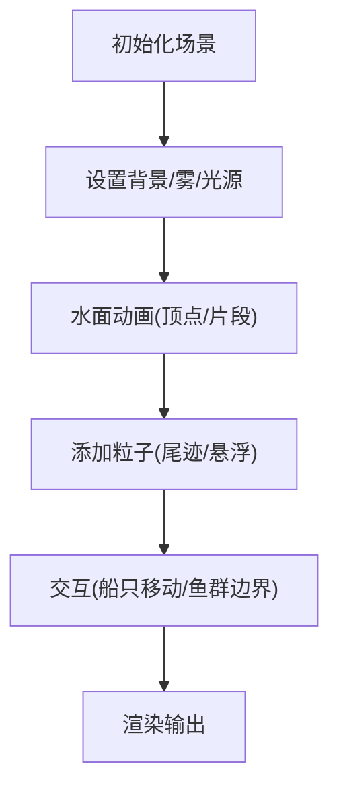
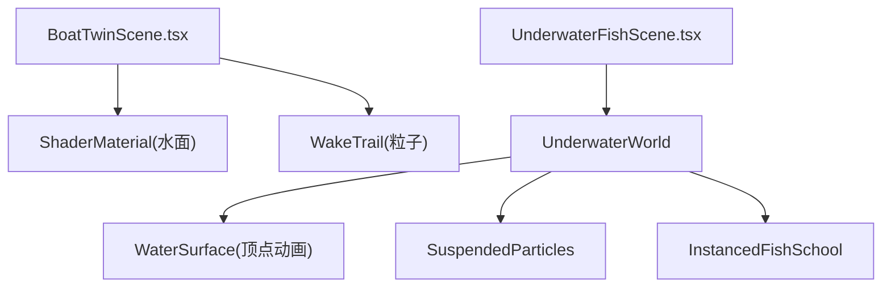

# 水下环境效果

<cite>
**本文引用的文件**
- [BoatTwinScene.tsx](file://fishery-digital-twin-platform/apps/frontend/src/components/three/BoatTwinScene.tsx)
- [UnderwaterFishScene.tsx](file://fishery-digital-twin-platform/apps/frontend/src/components/three/UnderwaterFishScene.tsx)
</cite>

## 目录
1. [简介](#简介)
2. [项目结构](#项目结构)
3. [核心组件](#核心组件)
4. [架构总览](#架构总览)
5. [详细组件分析](#详细组件分析)
6. [依赖关系分析](#依赖关系分析)
7. [性能考量](#性能考量)
8. [故障排查指南](#故障排查指南)
9. [结论](#结论)
10. [附录](#附录)

## 简介
本文件面向“渔场数字孪生平台”中的水面与水下环境渲染，系统性梳理并解释以下技术要点：
- 水面着色器实现：WATER_VERTEX_SHADER 与 WATER_FRAGMENT_SHADER 的作用、波浪算法、深度混合与高光模拟。
- 水面动画系统：时间驱动的多频率正弦波叠加、UV坐标变换、顶点位移计算。
- 水下光照与环境：背景色、雾效、多光源组合（环境光、半球光、方向光、点光）营造的水下氛围；悬浮粒子模拟水体散射感。
- 水面交互效果：船只尾迹生成、波纹扩散、粒子系统与物理碰撞响应（边界约束）。
- 环境效果定制指南：可调参数、新增视觉效果建议与渲染优化策略。
- 调试与性能监控：帧率控制、按需渲染、实例化绘制等实践。

## 项目结构
本项目在水面与水下环境的实现主要位于前端 Three.js 场景组件中：
- 船体与水面场景：BoatTwinScene.tsx
  - 定义并应用自定义水面着色器（顶点+片段），提供 OceanPlane 组件将水面网格与 ShaderMaterial 结合。
  - 提供 WakeTrail 粒子系统模拟船只尾流。
- 水下世界与鱼群：UnderwaterFishScene.tsx
  - 构建 UnderwaterWorld，包含背景、雾、多种光源、WaterSurface（基于几何顶点动画）、SeaFloor、SuspendedParticles、InstancedFishSchool。

图表来源
- [BoatTwinScene.tsx:92-126](file://fishery-digital-twin-platform/apps/frontend/src/components/three/BoatTwinScene.tsx#L92-L126)
- [BoatTwinScene.tsx:1060-1094](file://fishery-digital-twin-platform/apps/frontend/src/components/three/BoatTwinScene.tsx#L1060-L1094)
- [BoatTwinScene.tsx:781-807](file://fishery-digital-twin-platform/apps/frontend/src/components/three/BoatTwinScene.tsx#L781-L807)
- [UnderwaterFishScene.tsx:53-88](file://fishery-digital-twin-platform/apps/frontend/src/components/three/UnderwaterFishScene.tsx#L53-L88)
- [UnderwaterFishScene.tsx:252-283](file://fishery-digital-twin-platform/apps/frontend/src/components/three/UnderwaterFishScene.tsx#L252-L283)
- [UnderwaterFishScene.tsx:285-320](file://fishery-digital-twin-platform/apps/frontend/src/components/three/UnderwaterFishScene.tsx#L285-L320)
- [UnderwaterFishScene.tsx:322-355](file://fishery-digital-twin-platform/apps/frontend/src/components/three/UnderwaterFishScene.tsx#L322-L355)

章节来源
- [BoatTwinScene.tsx:92-126](file://fishery-digital-twin-platform/apps/frontend/src/components/three/BoatTwinScene.tsx#L92-L126)
- [BoatTwinScene.tsx:1060-1094](file://fishery-digital-twin-platform/apps/frontend/src/components/three/BoatTwinScene.tsx#L1060-L1094)
- [UnderwaterFishScene.tsx:53-88](file://fishery-digital-twin-platform/apps/frontend/src/components/three/UnderwaterFishScene.tsx#L53-L88)
- [UnderwaterFishScene.tsx:252-283](file://fishery-digital-twin-platform/apps/frontend/src/components/three/UnderwaterFishScene.tsx#L252-L283)

## 核心组件
- 水面着色器（BoatTwinScene.tsx）
  - WATER_VERTEX_SHADER：每帧根据 uTime 对顶点进行多频正弦波叠加，产生 Z 轴位移，并将位移写入 vWave 供片段着色使用。
  - WATER_FRAGMENT_SHADER：基于 vUv 与 uTime 计算波纹纹理式的高光与颜色混合，输出半透明水面。
- 水面网格与材质（BoatTwinScene.tsx）
  - OceanPlane：两层平面，底层为物理材质模拟基底水面，上层为 ShaderMaterial 覆盖动态水面效果。
- 水下世界（UnderwaterFishScene.tsx）
  - UnderwaterWorld：设置背景色、雾、多光源，组合 WaterSurface、SeaFloor、SuspendedParticles、InstancedFishSchool。
- 水面顶点动画（UnderwaterFishScene.tsx）
  - WaterSurface：在 CPU 侧逐顶点更新 Z 值，使用正弦函数随时间变化，形成波动。
- 悬浮粒子（UnderwaterFishScene.tsx）
  - SuspendedParticles：以 Points 形式呈现水体悬浮微粒，缓慢旋转与上下浮动，增强水体体积感与散射感。
- 鱼群（UnderwaterFishScene.tsx）
  - InstancedFishSchool：使用 InstancedMesh 高效绘制大量鱼体与尾部，按密度与观测数据驱动游动与聚集。

章节来源
- [BoatTwinScene.tsx:92-126](file://fishery-digital-twin-platform/apps/frontend/src/components/three/BoatTwinScene.tsx#L92-L126)
- [BoatTwinScene.tsx:1060-1094](file://fishery-digital-twin-platform/apps/frontend/src/components/three/BoatTwinScene.tsx#L1060-L1094)
- [UnderwaterFishScene.tsx:53-88](file://fishery-digital-twin-platform/apps/frontend/src/components/three/UnderwaterFishScene.tsx#L53-L88)
- [UnderwaterFishScene.tsx:252-283](file://fishery-digital-twin-platform/apps/frontend/src/components/three/UnderwaterFishScene.tsx#L252-L283)
- [UnderwaterFishScene.tsx:322-355](file://fishery-digital-twin-platform/apps/frontend/src/components/three/UnderwaterFishScene.tsx#L322-L355)

## 架构总览
下图展示水面与水下环境的关键模块及其交互关系：

图表来源
- [BoatTwinScene.tsx:92-126](file://fishery-digital-twin-platform/apps/frontend/src/components/three/BoatTwinScene.tsx#L92-L126)
- [BoatTwinScene.tsx:1060-1094](file://fishery-digital-twin-platform/apps/frontend/src/components/three/BoatTwinScene.tsx#L1060-L1094)
- [UnderwaterFishScene.tsx:53-88](file://fishery-digital-twin-platform/apps/frontend/src/components/three/UnderwaterFishScene.tsx#L53-L88)
- [UnderwaterFishScene.tsx:252-283](file://fishery-digital-twin-platform/apps/frontend/src/components/three/UnderwaterFishScene.tsx#L252-L283)
- [UnderwaterFishScene.tsx:322-355](file://fishery-digital-twin-platform/apps/frontend/src/components/three/UnderwaterFishScene.tsx#L322-L355)

## 详细组件分析

### 水面着色器：WATER_VERTEX_SHADER 与 WATER_FRAGMENT_SHADER
- 顶点着色器
  - 输入：position、uv、uniform uTime
  - 处理：以多频正弦/余弦叠加计算 wave，叠加到 nextPosition.z，并写入 vWave
  - 输出：gl_Position
- 片段着色器
  - 输入：vUv、vWave、uniform uTime
  - 处理：浅水与深水颜色混合、双频波纹叠加、高光阈值提升、最终输出带透明度的颜色
- 关键点
  - 多频率正弦波叠加带来更自然的波浪形态
  - vWave 从顶点传递到片段，用于局部高光增强
  - 透明度与 depthWrite=false 避免遮挡下层几何

图表来源
- [BoatTwinScene.tsx:92-107](file://fishery-digital-twin-platform/apps/frontend/src/components/three/BoatTwinScene.tsx#L92-L107)

章节来源
- [BoatTwinScene.tsx:92-126](file://fishery-digital-twin-platform/apps/frontend/src/components/three/BoatTwinScene.tsx#L92-L126)

### 水面动画系统：时间驱动与多频正弦波
- 时间驱动
  - 通过 uTime uniform 在每帧递增，驱动波浪相位变化
- 多频正弦波叠加
  - 不同频率与方向的 sin/cos 项叠加，形成复杂波形
- UV坐标变换
  - 片段着色中使用 vUv 计算波纹图案，使表面细节随时间流动
- 顶点位移计算
  - 顶点着色中直接修改 z 分量，实现可见的起伏

图表来源
- [BoatTwinScene.tsx:92-107](file://fishery-digital-twin-platform/apps/frontend/src/components/three/BoatTwinScene.tsx#L92-L107)
- [BoatTwinScene.tsx:109-126](file://fishery-digital-twin-platform/apps/frontend/src/components/three/BoatTwinScene.tsx#L109-L126)

章节来源
- [BoatTwinScene.tsx:92-126](file://fishery-digital-twin-platform/apps/frontend/src/components/three/BoatTwinScene.tsx#L92-L126)

### 深度混合与光线反射模拟
- 深度混合
  - 片段着色中基于 vUv.y 做 smoothstep 过渡，混合浅水与深水颜色
- 光线反射模拟
  - 通过双频波纹叠加后取高亮区域，再乘以强度，模拟水面高光
  - 使用 vWave 作为额外高光因子，增强波峰处的亮度
- 透明度
  - gl_FragColor 输出 alpha < 1 的颜色，配合 depthWrite=false 实现透明叠加

图表来源
- [BoatTwinScene.tsx:109-126](file://fishery-digital-twin-platform/apps/frontend/src/components/three/BoatTwinScene.tsx#L109-L126)

章节来源
- [BoatTwinScene.tsx:109-126](file://fishery-digital-twin-platform/apps/frontend/src/components/three/BoatTwinScene.tsx#L109-L126)

### 水下光照效果：折射、透明度、散射与环境遮蔽
- 背景与雾
  - 背景色设置为深青绿色，雾效由近到远衰减，模拟水下能见度
- 多光源组合
  - 环境光提供基础照明
  - 半球光模拟天光与地面反射
  - 方向光模拟入射阳光
  - 点光增加局部高光与体积感
- 透明度与散射
  - 水面与粒子均使用透明度与 depthWrite=false，避免错误遮挡
  - 悬浮粒子缓慢旋转与上下浮动，模拟水体悬浮颗粒与散射
- 环境遮蔽
  - 未显式实现 AO，但可通过雾与暗色背景近似表现遮蔽感

图表来源
- [UnderwaterFishScene.tsx:53-88](file://fishery-digital-twin-platform/apps/frontend/src/components/three/UnderwaterFishScene.tsx#L53-L88)
- [UnderwaterFishScene.tsx:322-355](file://fishery-digital-twin-platform/apps/frontend/src/components/three/UnderwaterFishScene.tsx#L322-L355)

章节来源
- [UnderwaterFishScene.tsx:53-88](file://fishery-digital-twin-platform/apps/frontend/src/components/three/UnderwaterFishScene.tsx#L53-L88)
- [UnderwaterFishScene.tsx:322-355](file://fishery-digital-twin-platform/apps/frontend/src/components/three/UnderwaterFishScene.tsx#L322-L355)

### 水面交互效果：尾迹、波纹、粒子与碰撞响应
- 船只尾迹
  - WakeTrail 使用 Points 与 BufferGeometry 生成尾流粒子，透明度随时间微变，模拟扩散
- 波纹扩散
  - 水面着色器中的波纹项可视为静态波纹；如需扩散波纹，可在片段着色中加入径向距离与时间衰减
- 粒子系统
  - 悬浮粒子与尾迹粒子均采用 Points，sizeAttenuation 确保近大远小
- 物理碰撞响应
  - 鱼群运动存在边界约束（X/Z/Y 范围），超出范围施加反向加速度，体现“碰撞”行为

图表来源
- [BoatTwinScene.tsx:781-807](file://fishery-digital-twin-platform/apps/frontend/src/components/three/BoatTwinScene.tsx#L781-L807)
- [BoatTwinScene.tsx:92-126](file://fishery-digital-twin-platform/apps/frontend/src/components/three/BoatTwinScene.tsx#L92-L126)
- [UnderwaterFishScene.tsx:162-236](file://fishery-digital-twin-platform/apps/frontend/src/components/three/UnderwaterFishScene.tsx#L162-L236)

章节来源
- [BoatTwinScene.tsx:781-807](file://fishery-digital-twin-platform/apps/frontend/src/components/three/BoatTwinScene.tsx#L781-L807)
- [UnderwaterFishScene.tsx:162-236](file://fishery-digital-twin-platform/apps/frontend/src/components/three/UnderwaterFishScene.tsx#L162-L236)

### 概念性总览
下图为概念流程，不直接映射具体代码：

[此图为概念流程图，无需来源标注]

## 依赖关系分析
- 组件耦合
  - BoatTwinScene.tsx 负责水面着色器与 OceanPlane，以及 WakeTrail 尾迹
  - UnderwaterFishScene.tsx 负责水下世界、水面顶点动画、海底与粒子、鱼群
- 外部依赖
  - React Three Fiber/Drei：Canvas、useFrame、OrbitControls、DreiLine 等
  - Three.js：几何、材质、光照、粒子系统
- 循环依赖
  - 未见明显循环依赖；各组件职责清晰，通过 props 与 useFrame 通信

图表来源
- [BoatTwinScene.tsx:92-126](file://fishery-digital-twin-platform/apps/frontend/src/components/three/BoatTwinScene.tsx#L92-L126)
- [BoatTwinScene.tsx:781-807](file://fishery-digital-twin-platform/apps/frontend/src/components/three/BoatTwinScene.tsx#L781-L807)
- [UnderwaterFishScene.tsx:53-88](file://fishery-digital-twin-platform/apps/frontend/src/components/three/UnderwaterFishScene.tsx#L53-L88)
- [UnderwaterFishScene.tsx:252-283](file://fishery-digital-twin-platform/apps/frontend/src/components/three/UnderwaterFishScene.tsx#L252-L283)
- [UnderwaterFishScene.tsx:322-355](file://fishery-digital-twin-platform/apps/frontend/src/components/three/UnderwaterFishScene.tsx#L322-L355)

章节来源
- [BoatTwinScene.tsx:92-126](file://fishery-digital-twin-platform/apps/frontend/src/components/three/BoatTwinScene.tsx#L92-L126)
- [UnderwaterFishScene.tsx:53-88](file://fishery-digital-twin-platform/apps/frontend/src/components/three/UnderwaterFishScene.tsx#L53-L88)

## 性能考量
- 帧率控制
  - SceneTicker 使用 requestAnimationFrame 与固定间隔触发 invalidate，限制重绘频率，降低CPU/GPU压力
- 按需渲染
  - Canvas frameloop 支持 "always" 或 "demand"，在非活跃时减少渲染
- 实例化绘制
  - InstancedMesh 用于鱼群，显著减少 draw call 数量
- 透明度与深度写入
  - 水面与粒子使用 transparent 与 depthWrite=false，避免不必要的深度测试开销
- 几何细分
  - 水面网格采用适度细分（如 36x36），平衡细节与性能

章节来源
- [BoatTwinScene.tsx:128-151](file://fishery-digital-twin-platform/apps/frontend/src/components/three/BoatTwinScene.tsx#L128-L151)
- [UnderwaterFishScene.tsx:41-50](file://fishery-digital-twin-platform/apps/frontend/src/components/three/UnderwaterFishScene.tsx#L41-L50)
- [UnderwaterFishScene.tsx:238-249](file://fishery-digital-twin-platform/apps/frontend/src/components/three/UnderwaterFishScene.tsx#L238-L249)

## 故障排查指南
- 水面无动画
  - 检查 uTime 是否每帧更新（OceanPlane 中 useFrame 赋值）
  - 确认 ShaderMaterial 已启用 transparent 且 depthWrite=false
- 水面遮挡问题
  - 若上层水面遮挡下层物体，检查 renderOrder 与 depthWrite 设置
- 粒子不可见
  - 检查 sizeAttenuation、opacity、depthWrite 与相机视锥剔除
- 鱼群异常
  - 检查边界约束逻辑与速度归一化，避免飞散或停滞
- 性能下降
  - 降低水面网格细分、减少粒子数量、关闭非必要的发光材质

章节来源
- [BoatTwinScene.tsx:1060-1094](file://fishery-digital-twin-platform/apps/frontend/src/components/three/BoatTwinScene.tsx#L1060-L1094)
- [BoatTwinScene.tsx:781-807](file://fishery-digital-twin-platform/apps/frontend/src/components/three/BoatTwinScene.tsx#L781-L807)
- [UnderwaterFishScene.tsx:162-236](file://fishery-digital-twin-platform/apps/frontend/src/components/three/UnderwaterFishScene.tsx#L162-L236)

## 结论
本项目通过自定义水面着色器与顶点动画相结合，实现了自然的水面波动与高光效果；水下世界借助背景、雾与多光源营造沉浸感，悬浮粒子增强水体体积与散射效果；鱼群使用实例化绘制保证性能，并通过边界约束实现基本“碰撞”行为。整体方案在视觉效果与性能之间取得平衡，适合在数字孪生场景中扩展更多交互与特效。

## 附录
- 可调参数建议
  - 水面：调整正弦波频率与振幅、波纹叠加权重、高光阈值与强度、透明度
  - 水下：调整雾密度、背景色、光源强度与颜色、粒子数量与大小
  - 鱼群：调整密度、速度、转向速率、边界范围
- 新增视觉效果建议
  - 在片段着色器中添加菲涅尔效应、反射贴图采样、焦散效果
  - 为尾迹添加生命周期与扩散半径，模拟真实尾流
  - 引入体积光或光柱效果增强水下氛围
- 调试工具与性能监控
  - 使用浏览器开发者工具的 Performance 面板记录帧耗时
  - 使用 stats-gl 或内置 FPS 显示监控渲染性能
  - 逐步关闭特效（粒子/雾/透明度）定位瓶颈

[本节为通用指导，不直接分析具体文件]