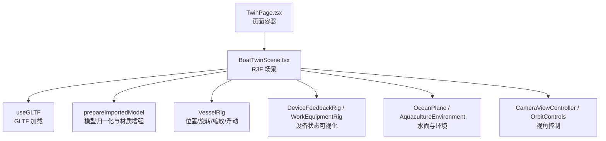
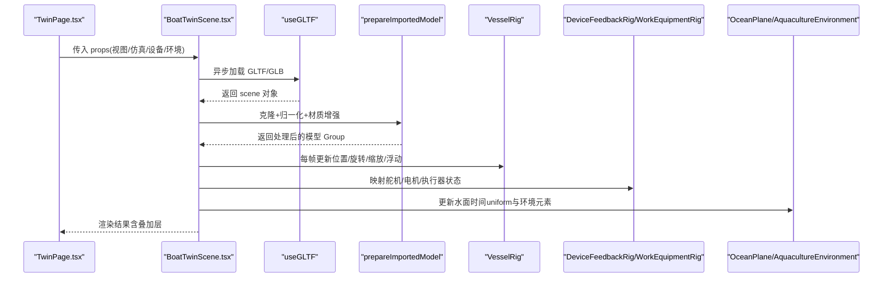
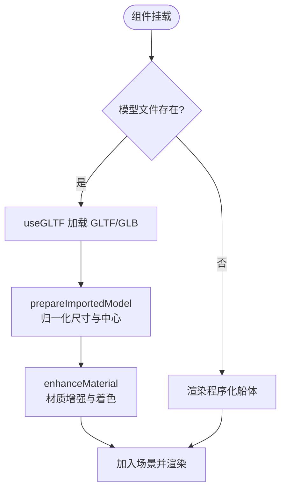
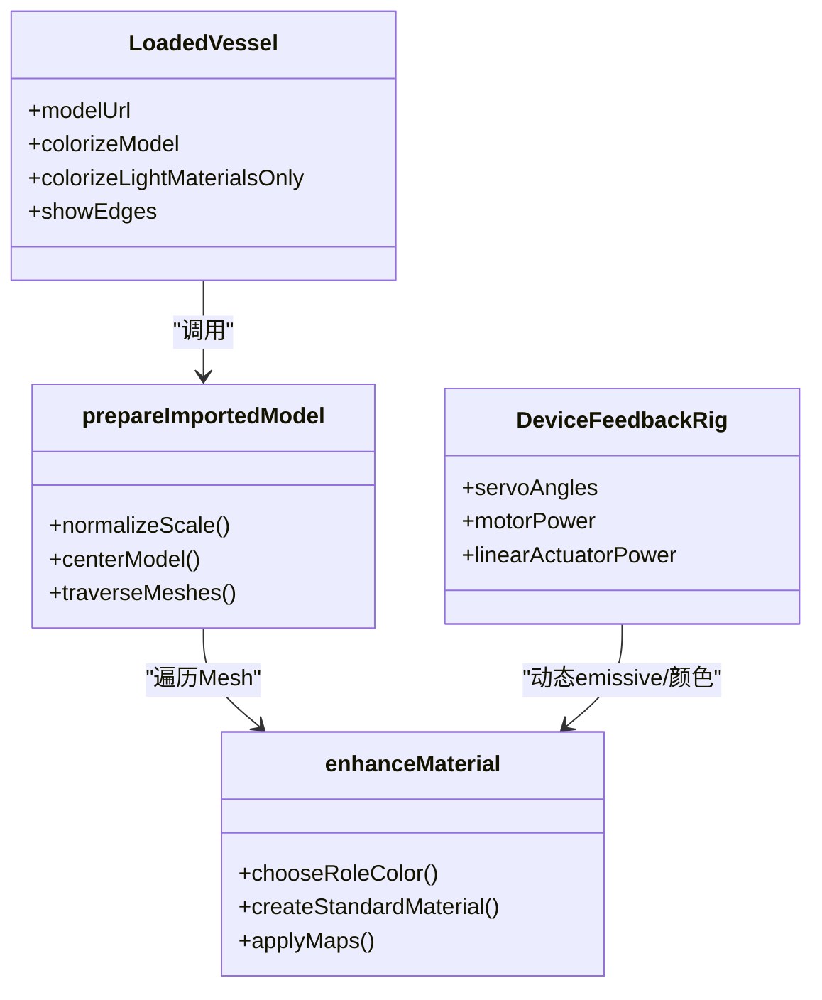
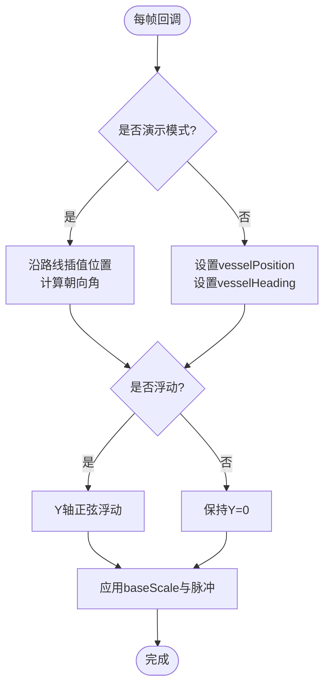
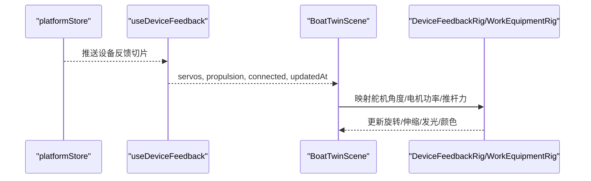
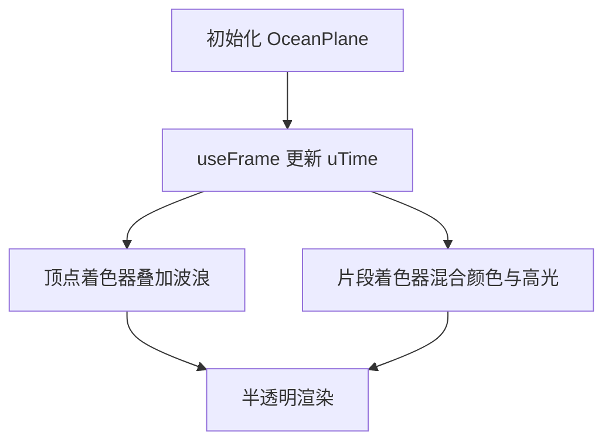
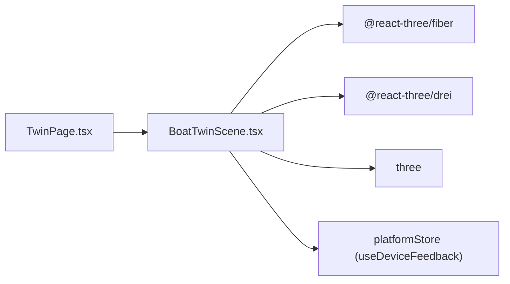

# 船模加载与渲染

<cite>
**本文引用的文件**
- [BoatTwinScene.tsx](file://fishery-digital-twin-platform/apps/frontend/src/components/three/BoatTwinScene.tsx)
- [TwinPage.tsx](file://fishery-digital-twin-platform/apps/frontend/src/components/dashboard/TwinPage.tsx)
- [README.md](file://fishery-digital-twin-platform/apps/frontend/public/models/README.md)
- [useDeviceFeedback.ts](file://fishery-digital-twin-platform/apps/frontend/src/hooks/useDeviceFeedback.ts)
</cite>

## 目录
1. [简介](#简介)
2. [项目结构](#项目结构)
3. [核心组件](#核心组件)
4. [架构总览](#架构总览)
5. [详细组件分析](#详细组件分析)
6. [依赖关系分析](#依赖关系分析)
7. [性能考量](#性能考量)
8. [故障排查指南](#故障排查指南)
9. [结论](#结论)
10. [附录：定制与优化指南](#附录：定制与优化指南)

## 简介
本文件面向基于 Three.js 的 3D 船模导入与渲染实现，覆盖 GLTF 模型加载流程、材质系统、变换控制、状态反馈可视化以及模型优化与常见问题解决方案。该实现位于前端 React + R3F（React Three Fiber）场景中，通过 useGLTF 钩子加载 GLB/GLTF 模型，并在运行时进行尺寸归一化、材质增强、设备状态映射与动画控制。

## 项目结构
- 场景主入口与渲染逻辑集中在 BoatTwinScene.tsx，封装了 Canvas、相机、灯光、模型加载、材质处理、设备反馈叠加、水面与海洋环境等。
- 页面集成在 TwinPage.tsx，以动态导入方式挂载 3D 场景，并传入仿真预览、工作设备显示、养殖环境等开关参数。
- 模型资源放置于 public/models 目录下，默认路径为 inspection-boat.glb；若不存在则回退到程序化生成的简易船体。
- 设备状态数据通过 useDeviceFeedback 从共享 store 同步至 UI，驱动 3D 场景中的舵机、电机、执行器等可视化部件。

图表来源
- [BoatTwinScene.tsx:1567-1721](file://fishery-digital-twin-platform/apps/frontend/src/components/three/BoatTwinScene.tsx#L1567-L1721)
- [TwinPage.tsx:87-102](file://fishery-digital-twin-platform/apps/frontend/src/components/dashboard/TwinPage.tsx#L87-L102)

章节来源
- [BoatTwinScene.tsx:1567-1721](file://fishery-digital-twin-platform/apps/frontend/src/components/three/BoatTwinScene.tsx#L1567-L1721)
- [TwinPage.tsx:87-102](file://fishery-digital-twin-platform/apps/frontend/src/components/dashboard/TwinPage.tsx#L87-L102)
- [README.md:1-13](file://fishery-digital-twin-platform/apps/frontend/public/models/README.md#L1-L13)

## 核心组件
- 场景容器与配置：Canvas、AdaptiveDpr、光照、雾效、帧循环策略、DPR 自适应、抗锯齿与高性能模式。
- 模型加载与预处理：useGLTF 异步加载 GLTF/GLB，clone 后按参考长度归一化尺寸与中心偏移，遍历 Mesh 替换材质并可选添加线框边。
- 材质系统：根据角色（船体、甲板、舱室、硬件）映射颜色，设置 roughness/metalness，保留贴图通道，支持仅高亮浅色材质或全量着色。
- 变换控制：每帧更新位置、航向、缩放与浮动动画；演示模式下沿预设路线插值移动并计算朝向。
- 设备反馈：将舵机角度、电机功率、线性推杆、摄像头云台等映射为 3D 部件的旋转、伸缩、发光强度与颜色。
- 水面与环境：自定义 Shader 实现波浪顶点位移与高光反射；养殖环境包含网箱、浮标、投饵站、增氧机等。

章节来源
- [BoatTwinScene.tsx:809-870](file://fishery-digital-twin-platform/apps/frontend/src/components/three/BoatTwinScene.tsx#L809-L870)
- [BoatTwinScene.tsx:872-985](file://fishery-digital-twin-platform/apps/frontend/src/components/three/BoatTwinScene.tsx#L872-L985)
- [BoatTwinScene.tsx:153-273](file://fishery-digital-twin-platform/apps/frontend/src/components/three/BoatTwinScene.tsx#L153-L273)
- [BoatTwinScene.tsx:275-379](file://fishery-digital-twin-platform/apps/frontend/src/components/three/BoatTwinScene.tsx#L275-L379)
- [BoatTwinScene.tsx:1060-1094](file://fishery-digital-twin-platform/apps/frontend/src/components/three/BoatTwinScene.tsx#L1060-L1094)

## 架构总览
下图展示了从页面到 3D 场景的数据流与控制流：页面注入仿真预览与工作设备开关；场景内 useGLTF 加载模型，prepareImportedModel 做归一化与材质增强；VesselRig 负责变换与动画；设备反馈驱动可视化部件；水面与环境提供沉浸感。

图表来源
- [BoatTwinScene.tsx:809-870](file://fishery-digital-twin-platform/apps/frontend/src/components/three/BoatTwinScene.tsx#L809-L870)
- [BoatTwinScene.tsx:153-273](file://fishery-digital-twin-platform/apps/frontend/src/components/three/BoatTwinScene.tsx#L153-L273)
- [BoatTwinScene.tsx:1060-1094](file://fishery-digital-twin-platform/apps/frontend/src/components/three/BoatTwinScene.tsx#L1060-L1094)
- [TwinPage.tsx:87-102](file://fishery-digital-twin-platform/apps/frontend/src/components/dashboard/TwinPage.tsx#L87-L102)

## 详细组件分析

### GLTF 模型加载与资源管理
- 使用 useGLTF(modelUrl) 异步加载模型，默认路径为 /models/inspection-boat.glb；若文件不存在，场景自动回退到程序化船体。
- 加载完成后通过 useMemo 调用 prepareImportedModel 对模型进行克隆、世界矩阵更新、边界计算、尺寸归一化与中心对齐。
- 资源预加载：模块级调用 useGLTF.preload(DEFAULT_MODEL_URL) 提前缓存模型，减少首次加载等待。
- 进度反馈：使用 useProgress 监听加载进度，展示“模型加载中”覆盖层。

图表来源
- [BoatTwinScene.tsx:809-870](file://fishery-digital-twin-platform/apps/frontend/src/components/three/BoatTwinScene.tsx#L809-L870)
- [BoatTwinScene.tsx:1762-1775](file://fishery-digital-twin-platform/apps/frontend/src/components/three/BoatTwinScene.tsx#L1762-L1775)
- [README.md:1-13](file://fishery-digital-twin-platform/apps/frontend/public/models/README.md#L1-L13)

章节来源
- [BoatTwinScene.tsx:809-870](file://fishery-digital-twin-platform/apps/frontend/src/components/three/BoatTwinScene.tsx#L809-L870)
- [BoatTwinScene.tsx:1762-1775](file://fishery-digital-twin-platform/apps/frontend/src/components/three/BoatTwinScene.tsx#L1762-L1775)
- [README.md:1-13](file://fishery-digital-twin-platform/apps/frontend/public/models/README.md#L1-L13)

### 材质系统：颜色映射、金属度粗糙度、发光效果与动态更新
- 角色颜色映射：根据 Mesh 名称与空间占比推断角色（船体、侧舷、甲板、舱室、硬件），分配对应颜色。
- 材质增强：创建新的 MeshStandardMaterial，保留原贴图通道（漫反射、法线、粗糙度、金属度、AO、自发光贴图），设置 roughness/metalness 范围限制，透明与深度写入保持原样。
- 浅色材质高亮：可仅对浅色低饱和度材质着色，避免金属件被错误染色。
- 发光效果：设备反馈部件（舵机臂、电机转子、线性推杆、摄像头云台指示灯）通过 emissive 与 emissiveIntensity 实现状态指示与脉冲动画。
- 动态更新：useFrame 中根据设备状态实时调整颜色、发光强度、旋转与伸缩。

图表来源
- [BoatTwinScene.tsx:809-870](file://fishery-digital-twin-platform/apps/frontend/src/components/three/BoatTwinScene.tsx#L809-L870)
- [BoatTwinScene.tsx:872-985](file://fishery-digital-twin-platform/apps/frontend/src/components/three/BoatTwinScene.tsx#L872-L985)
- [BoatTwinScene.tsx:275-379](file://fishery-digital-twin-platform/apps/frontend/src/components/three/BoatTwinScene.tsx#L275-L379)

章节来源
- [BoatTwinScene.tsx:872-985](file://fishery-digital-twin-platform/apps/frontend/src/components/three/BoatTwinScene.tsx#L872-L985)
- [BoatTwinScene.tsx:275-379](file://fishery-digital-twin-platform/apps/frontend/src/components/three/BoatTwinScene.tsx#L275-L379)

### 变换控制：位置、旋转、缩放与浮动动画
- 位置与航向：在非演示模式下，根据外部传入的 vesselPosition 与 vesselHeading 设置 group 的 position.x/z 与 rotation.y；演示模式下沿 DEMO_ROUTE 插值移动并计算朝向。
- 缩放：支持 compact 模式与 vesselScale 参数统一缩放；交互时带轻微脉冲放大。
- 浮动：启用 float 时，Y 轴按正弦函数产生上下浮动，模拟水面漂浮。
- 轨迹与尾迹：演示模式下生成 WakeTrail 粒子点集，随运动更新透明度与相位。

图表来源
- [BoatTwinScene.tsx:153-273](file://fishery-digital-twin-platform/apps/frontend/src/components/three/BoatTwinScene.tsx#L153-L273)
- [BoatTwinScene.tsx:781-807](file://fishery-digital-twin-platform/apps/frontend/src/components/three/BoatTwinScene.tsx#L781-L807)

章节来源
- [BoatTwinScene.tsx:153-273](file://fishery-digital-twin-platform/apps/frontend/src/components/three/BoatTwinScene.tsx#L153-L273)
- [BoatTwinScene.tsx:781-807](file://fishery-digital-twin-platform/apps/frontend/src/components/three/BoatTwinScene.tsx#L781-L807)

### 状态反馈机制：设备状态可视化、在线指示与故障模拟
- 舵机反馈：每个舵机臂根据 angle 与 online 状态设置旋转与发光颜色；离线或无角度时显示灰色。
- 电机反馈：根据 motorOnline 与 power 控制转子旋转速度与发光颜色；正负功率决定方向。
- 线性推杆：根据 dualPushrodPower 与 sxtlPower 控制伸缩长度与末端球体位置；冷却锁定或运行时锁止改变颜色。
- 摄像头云台：yaw/pitch 角度映射到三维旋转，在线或仿真时指示灯闪烁。
- 数据来源：useDeviceFeedback 订阅平台 store 的设备反馈切片，保证 UI 与 3D 场景一致。

图表来源
- [useDeviceFeedback.ts:1-22](file://fishery-digital-twin-platform/apps/frontend/src/hooks/useDeviceFeedback.ts#L1-L22)
- [BoatTwinScene.tsx:275-379](file://fishery-digital-twin-platform/apps/frontend/src/components/three/BoatTwinScene.tsx#L275-L379)
- [BoatTwinScene.tsx:512-576](file://fishery-digital-twin-platform/apps/frontend/src/components/three/BoatTwinScene.tsx#L512-L576)
- [BoatTwinScene.tsx:668-779](file://fishery-digital-twin-platform/apps/frontend/src/components/three/BoatTwinScene.tsx#L668-L779)

章节来源
- [useDeviceFeedback.ts:1-22](file://fishery-digital-twin-platform/apps/frontend/src/hooks/useDeviceFeedback.ts#L1-L22)
- [BoatTwinScene.tsx:275-379](file://fishery-digital-twin-platform/apps/frontend/src/components/three/BoatTwinScene.tsx#L275-L379)
- [BoatTwinScene.tsx:512-576](file://fishery-digital-twin-platform/apps/frontend/src/components/three/BoatTwinScene.tsx#L512-L576)
- [BoatTwinScene.tsx:668-779](file://fishery-digital-twin-platform/apps/frontend/src/components/three/BoatTwinScene.tsx#L668-L779)

### 水面与环境：Shader 波浪与养殖设施
- 水面 Shader：顶点着色器叠加多频正弦波位移，片段着色器混合浅蓝与清澈蓝，叠加波纹高光，半透明渲染。
- 养殖环境：网箱、浮标、投饵站、增氧机、漂浮垃圾等，均具备独立动画（旋转、浮动、气泡）。
- 控制：liveOcean 开关决定是否更新 uTime uniform；AquacultureEnvironment 按需渲染。

图表来源
- [BoatTwinScene.tsx:92-126](file://fishery-digital-twin-platform/apps/frontend/src/components/three/BoatTwinScene.tsx#L92-L126)
- [BoatTwinScene.tsx:1060-1094](file://fishery-digital-twin-platform/apps/frontend/src/components/three/BoatTwinScene.tsx#L1060-L1094)
- [BoatTwinScene.tsx:1103-1414](file://fishery-digital-twin-platform/apps/frontend/src/components/three/BoatTwinScene.tsx#L1103-L1414)

章节来源
- [BoatTwinScene.tsx:92-126](file://fishery-digital-twin-platform/apps/frontend/src/components/three/BoatTwinScene.tsx#L92-L126)
- [BoatTwinScene.tsx:1060-1094](file://fishery-digital-twin-platform/apps/frontend/src/components/three/BoatTwinScene.tsx#L1060-L1094)
- [BoatTwinScene.tsx:1103-1414](file://fishery-digital-twin-platform/apps/frontend/src/components/three/BoatTwinScene.tsx#L1103-L1414)

## 依赖关系分析
- 场景依赖 R3F 生态：@react-three/fiber（Canvas、useFrame、useThree）、@react-three/drei（OrbitControls、useGLTF、useProgress、AdaptiveDpr、Line）。
- 页面依赖 Next.js 动态导入以避免 SSR 问题，并通过 props 控制场景行为。
- 设备数据依赖 platformStore 提供的订阅与切片读取，确保多模块状态一致。

图表来源
- [TwinPage.tsx:14-17](file://fishery-digital-twin-platform/apps/frontend/src/components/dashboard/TwinPage.tsx#L14-L17)
- [BoatTwinScene.tsx:1-7](file://fishery-digital-twin-platform/apps/frontend/src/components/three/BoatTwinScene.tsx#L1-L7)
- [useDeviceFeedback.ts:1-22](file://fishery-digital-twin-platform/apps/frontend/src/hooks/useDeviceFeedback.ts#L1-L22)

章节来源
- [TwinPage.tsx:14-17](file://fishery-digital-twin-platform/apps/frontend/src/components/dashboard/TwinPage.tsx#L14-L17)
- [BoatTwinScene.tsx:1-7](file://fishery-digital-twin-platform/apps/frontend/src/components/three/BoatTwinScene.tsx#L1-L7)
- [useDeviceFeedback.ts:1-22](file://fishery-digital-twin-platform/apps/frontend/src/hooks/useDeviceFeedback.ts#L1-L22)

## 性能考量
- 帧循环策略：hero 模式且自动旋转时开启 always 帧循环，否则使用 demand 按需刷新；配合 AdaptiveDpr 降低高分屏开销。
- 渲染质量：开启抗锯齿、ACES 色调映射与 sRGB 输出；DPR 范围限制避免过度采样。
- 阴影与材质：关闭模型阴影以减少计算；材质贴图通道复用，避免重复创建；边缘线仅在网格面数较低时启用。
- 水面与粒子：使用 BufferGeometry 与 PointsMaterial 高效绘制；粒子透明度与大小衰减控制视觉与性能平衡。
- 资源预加载：useGLTF.preload 提前缓存模型，减少首帧卡顿。

章节来源
- [BoatTwinScene.tsx:1700-1710](file://fishery-digital-twin-platform/apps/frontend/src/components/three/BoatTwinScene.tsx#L1700-L1710)
- [BoatTwinScene.tsx:856-867](file://fishery-digital-twin-platform/apps/frontend/src/components/three/BoatTwinScene.tsx#L856-L867)
- [BoatTwinScene.tsx:987-1011](file://fishery-digital-twin-platform/apps/frontend/src/components/three/BoatTwinScene.tsx#L987-L1011)
- [BoatTwinScene.tsx:1762-1775](file://fishery-digital-twin-platform/apps/frontend/src/components/three/BoatTwinScene.tsx#L1762-L1775)

## 故障排查指南
- 模型未加载：检查 public/models 下是否存在 inspection-boat.glb；若缺失将自动回退到程序化船体。
- 材质异常：确认 colorizeModel 与 colorizeLightMaterialsOnly 组合是否符合预期；浅色材质可能被忽略着色。
- 设备状态不更新：确认 useDeviceFeedback 订阅的 platformStore 是否正常推送；检查舵机角度与在线标志是否为空。
- 水面不波动：确认 liveOcean 开关与 useFrame 更新 uTime 的逻辑；检查 Shader 是否被正确引用。
- 性能下降：关闭 showEdges、减少粒子数量、降低 DPR 上限或禁用 hero 模式的 always 帧循环。

章节来源
- [README.md:1-13](file://fishery-digital-twin-platform/apps/frontend/public/models/README.md#L1-L13)
- [BoatTwinScene.tsx:872-985](file://fishery-digital-twin-platform/apps/frontend/src/components/three/BoatTwinScene.tsx#L872-L985)
- [useDeviceFeedback.ts:1-22](file://fishery-digital-twin-platform/apps/frontend/src/hooks/useDeviceFeedback.ts#L1-L22)
- [BoatTwinScene.tsx:1060-1094](file://fishery-digital-twin-platform/apps/frontend/src/components/three/BoatTwinScene.tsx#L1060-L1094)

## 结论
该实现通过 useGLTF 与 R3F 生态实现了高效的 3D 船模加载与渲染，结合材质增强、设备反馈可视化与水面环境，提供了完整的数字孪生体验。通过合理的性能优化与回退机制，确保了在不同设备与网络条件下的稳定表现。开发者可在此基础上扩展新部件、调整材质参数与优化渲染管线。

## 附录：定制与优化指南
- 添加新船体部件：
  - 在模型命名规范中加入角色关键词（如 hull/deck/cabin/hardware），以便 chooseModelColor 自动识别并着色。
  - 如需特殊材质，可在 enhanceSingleMaterial 中针对特定名称或材质类型追加规则。
- 调整材质参数：
  - 修改 MODEL_COLORS/LIGHT_MATERIAL_COLORS 定义以适配品牌色。
  - 调整 getRoleRoughness/getRoleMetalness 返回值以匹配不同材质质感。
- 优化渲染性能：
  - 关闭 showEdges 或限制网格面数阈值。
  - 降低 liveOcean 更新频率或关闭水面动画。
  - 使用紧凑视图（compact=true）与较小的 vesselScale。
- 常见问题：
  - 模型比例不对：检查 REFERENCE_MODEL_LENGTH 与模型实际尺寸；必要时调整 normalizationScale。
  - 设备反馈错位：校准 DeviceFeedbackRig 的位置与旋转（importedModel 分支下的 rigPosition/rigRotation）。
  - 仿真预览不生效：确认 TwinPage 传入 simulationPreview 的 active 与 risk 字段。

章节来源
- [BoatTwinScene.tsx:872-985](file://fishery-digital-twin-platform/apps/frontend/src/components/three/BoatTwinScene.tsx#L872-L985)
- [BoatTwinScene.tsx:275-319](file://fishery-digital-twin-platform/apps/frontend/src/components/three/BoatTwinScene.tsx#L275-L319)
- [TwinPage.tsx:87-102](file://fishery-digital-twin-platform/apps/frontend/src/components/dashboard/TwinPage.tsx#L87-L102)