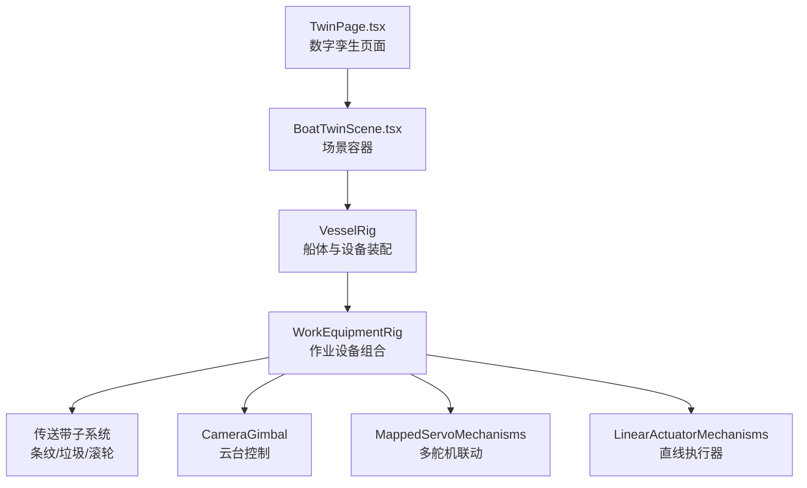
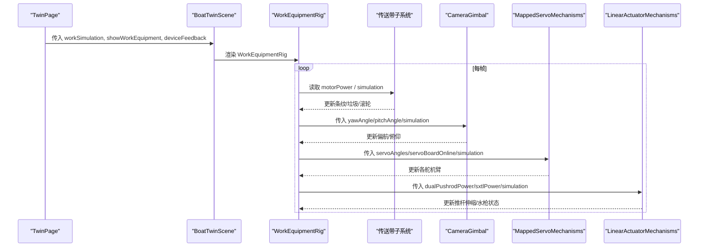
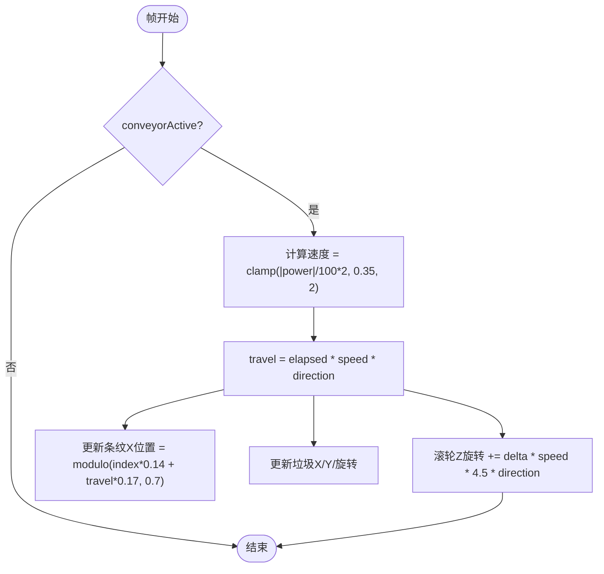
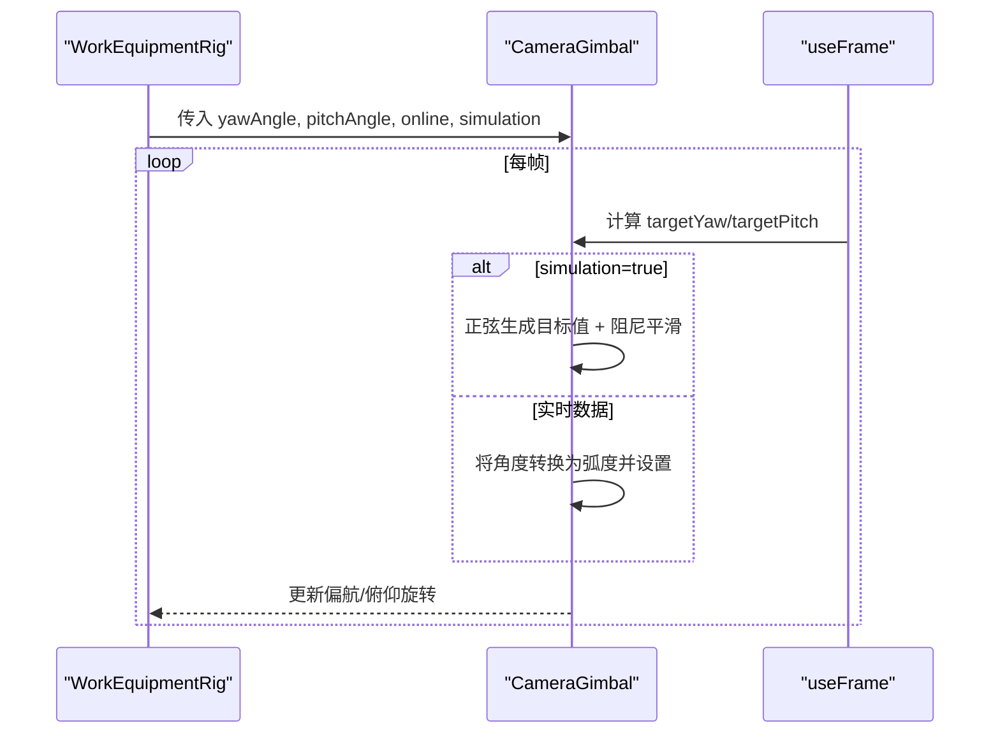
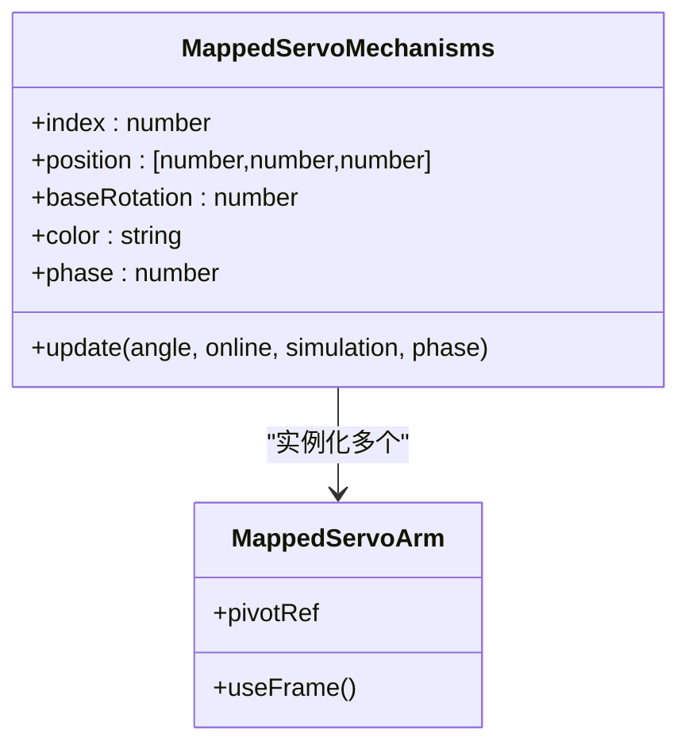
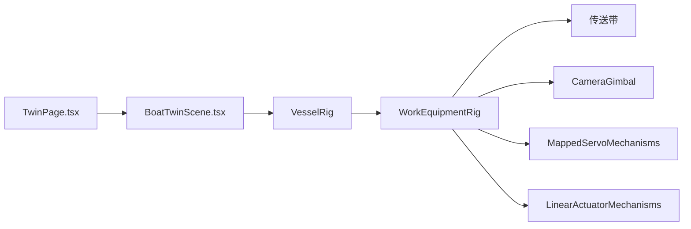

# 工作设备可视化

<cite>
**本文引用的文件**
- [BoatTwinScene.tsx](file://fishery-digital-twin-platform/apps/frontend/src/components/three/BoatTwinScene.tsx)
- [TwinPage.tsx](file://fishery-digital-twin-platform/apps/frontend/src/components/dashboard/TwinPage.tsx)
</cite>

## 目录
1. [简介](#简介)
2. [项目结构](#项目结构)
3. [核心组件](#核心组件)
4. [架构总览](#架构总览)
5. [详细组件分析](#详细组件分析)
6. [依赖关系分析](#依赖关系分析)
7. [性能考虑](#性能考虑)
8. [故障排查指南](#故障排查指南)
9. [结论](#结论)
10. [附录：配置与启用指南](#附录：配置与启用指南)

## 简介
本文件面向“工作设备可视化”子系统，聚焦 WorkEquipmentRig 及其子系统的实现与使用。内容涵盖：
- 传送带动画系统：条纹移动、垃圾收集模拟、滚轮旋转动画
- 相机云台控制：俯仰角与偏航角独立控制、模拟模式自动摆动、实时数据绑定
- 机械臂联动系统：MappedServoMechanisms 的协调、相位差控制与同步动画
- 工作设备配置：如何根据需求启用或禁用功能
- 模拟模式：支持演示与测试场景的自动化运行

## 项目结构
工作设备可视化位于前端 Three.js 场景中，由一个统一的场景组件编排多个子系统：
- 顶层场景入口：BoatTwinScene（负责渲染容器、参数透传）
- 船体与作业设备装配：VesselRig（根据 showWorkEquipment 决定是否挂载 WorkEquipmentRig）
- 作业设备组合：WorkEquipmentRig（传送带、相机云台、舵机机构、直线执行器）
- 页面集成：TwinPage（在数字孪生中心页面中开启 workSimulation 与 showWorkEquipment）

图表来源
- [BoatTwinScene.tsx:1567-1590](file://fishery-digital-twin-platform/apps/frontend/src/components/three/BoatTwinScene.tsx#L1567-L1590)
- [BoatTwinScene.tsx:153-273](file://fishery-digital-twin-platform/apps/frontend/src/components/three/BoatTwinScene.tsx#L153-L273)
- [BoatTwinScene.tsx:381-510](file://fishery-digital-twin-platform/apps/frontend/src/components/three/BoatTwinScene.tsx#L381-L510)
- [TwinPage.tsx:89-102](file://fishery-digital-twin-platform/apps/frontend/src/components/dashboard/TwinPage.tsx#L89-L102)

章节来源
- [BoatTwinScene.tsx:1567-1590](file://fishery-digital-twin-platform/apps/frontend/src/components/three/BoatTwinScene.tsx#L1567-L1590)
- [BoatTwinScene.tsx:153-273](file://fishery-digital-twin-platform/apps/frontend/src/components/three/BoatTwinScene.tsx#L153-L273)
- [TwinPage.tsx:89-102](file://fishery-digital-twin-platform/apps/frontend/src/components/dashboard/TwinPage.tsx#L89-L102)

## 核心组件
- WorkEquipmentRig：作业设备组合根节点，负责传送带、相机云台、舵机机构、直线执行器的装配与帧更新调度
- CameraGimbal：相机云台，支持偏航与俯仰独立控制，提供模拟自动摆动与实时数据绑定
- MappedServoMechanisms：多舵机联动，按索引映射到反馈角度，支持相位差驱动的同步动画
- LinearActuatorMechanisms：直线执行器集合，包含双推杆与水枪等执行器，支持功率驱动与冷却锁定状态显示
- 传送带子系统：条纹位移、垃圾回收轨迹、滚轮旋转，速度由电机功率决定

章节来源
- [BoatTwinScene.tsx:381-510](file://fishery-digital-twin-platform/apps/frontend/src/components/three/BoatTwinScene.tsx#L381-L510)
- [BoatTwinScene.tsx:512-576](file://fishery-digital-twin-platform/apps/frontend/src/components/three/BoatTwinScene.tsx#L512-L576)
- [BoatTwinScene.tsx:578-666](file://fishery-digital-twin-platform/apps/frontend/src/components/three/BoatTwinScene.tsx#L578-L666)
- [BoatTwinScene.tsx:668-779](file://fishery-digital-twin-platform/apps/frontend/src/components/three/BoatTwinScene.tsx#L668-L779)

## 架构总览
工作设备可视化采用“组合式组件 + 帧循环驱动”的架构：
- 数据流：页面层通过 props 传入 deviceFeedback（舵机角度、在线状态、电机功率、直线执行器功率等），WorkEquipmentRig 将数据分发至各子系统
- 渲染流：useFrame 每帧计算目标值并平滑更新 Three.js 对象属性（位置、旋转、材质发光强度）
- 模式切换：simulation 为 true 时，子系统进入模拟模式，使用正弦函数生成自动摆动/运动；否则以实时数据为准

图表来源
- [BoatTwinScene.tsx:381-510](file://fishery-digital-twin-platform/apps/frontend/src/components/three/BoatTwinScene.tsx#L381-L510)
- [BoatTwinScene.tsx:512-576](file://fishery-digital-twin-platform/apps/frontend/src/components/three/BoatTwinScene.tsx#L512-L576)
- [BoatTwinScene.tsx:578-666](file://fishery-digital-twin-platform/apps/frontend/src/components/three/BoatTwinScene.tsx#L578-L666)
- [BoatTwinScene.tsx:668-779](file://fishery-digital-twin-platform/apps/frontend/src/components/three/BoatTwinScene.tsx#L668-L779)
- [TwinPage.tsx:89-102](file://fishery-digital-twin-platform/apps/frontend/src/components/dashboard/TwinPage.tsx#L89-L102)

## 详细组件分析

### 传送带动画系统
- 条纹移动：使用 euclideanModulo 对时间累积位移取模，使条纹沿 X 轴周期性滚动，速度由电机功率绝对值映射得到，方向由功率正负决定
- 垃圾收集模拟：三块垃圾沿 X 轴线性插值从船头移动到收集箱，Y 轴叠加半波曲线模拟抛起下落，同时绕 Y 轴自转增强真实感
- 滚轮旋转：两个滚轮绕 Z 轴反向旋转，速度与条纹一致，体现机械传动关系
- 视觉反馈：条纹与收集箱发光强度随 conveyorActive 变化，指示设备是否运转

图表来源
- [BoatTwinScene.tsx:381-418](file://fishery-digital-twin-platform/apps/frontend/src/components/three/BoatTwinScene.tsx#L381-L418)

章节来源
- [BoatTwinScene.tsx:381-418](file://fishery-digital-twin-platform/apps/frontend/src/components/three/BoatTwinScene.tsx#L381-L418)

### 相机云台控制机制
- 独立控制：偏航（yaw）与俯仰（pitch）分别对应不同的旋转轴（Y 与 Z），互不干扰
- 模拟模式：当 simulation 为真时，使用正弦函数生成偏航与俯仰的目标值，并通过阻尼平滑过渡，避免突变
- 实时数据绑定：非模拟模式下，目标角度由外部传入的 servoAngles[0]（偏航）与 servoAngles[1]（俯仰）换算为弧度后直接赋值
- 发光效果：云台指示灯闪烁，增强在线/活动状态感知

图表来源
- [BoatTwinScene.tsx:512-576](file://fishery-digital-twin-platform/apps/frontend/src/components/three/BoatTwinScene.tsx#L512-L576)

章节来源
- [BoatTwinScene.tsx:512-576](file://fishery-digital-twin-platform/apps/frontend/src/components/three/BoatTwinScene.tsx#L512-L576)

### 机械臂联动系统（MappedServoMechanisms）
- 多舵机映射：每个机构定义 index、position、baseRotation、color、phase，index 对应 feedback.servoAngles 中的角度
- 相位差控制：每个机构的 simulationPhase 不同，使得在模拟模式下各舵机产生错开的正弦运动，形成协调联动效果
- 同步动画：非模拟模式下，各舵机根据实时角度统一更新；模拟模式下，使用阻尼平滑跟随目标值，保证整体同步性
- 颜色与发光：active 状态由 online 与 angle 判定，激活时赋予特定颜色与发光强度，便于区分工作状态

图表来源
- [BoatTwinScene.tsx:578-666](file://fishery-digital-twin-platform/apps/frontend/src/components/three/BoatTwinScene.tsx#L578-L666)

章节来源
- [BoatTwinScene.tsx:578-666](file://fishery-digital-twin-platform/apps/frontend/src/components/three/BoatTwinScene.tsx#L578-L666)

### 直线执行器与状态显示（LinearActuatorMechanisms）
- 双推杆：dualPushrodPower 的两路功率分别驱动两个执行器，功率正负决定伸缩方向，幅度受限于 0~1 范围
- 水枪执行器：sxtlPower 控制伸缩，若 sxtlRuntimeLockout 或冷却剩余时间大于 0，则显示阻塞状态（颜色变为警示色）
- 动画平滑：非模拟模式下，基于功率增量逐步更新伸缩长度；模拟模式下，使用正弦函数驱动伸缩，相位错开形成协同

章节来源
- [BoatTwinScene.tsx:668-779](file://fishery-digital-twin-platform/apps/frontend/src/components/three/BoatTwinScene.tsx#L668-L779)

## 依赖关系分析
- 页面层依赖：TwinPage 通过 props 注入 workSimulation 与 showWorkEquipment，决定是否启用工作设备可视化与模拟模式
- 场景层依赖：BoatTwinScene 作为容器，将 deviceFeedback 透传给 WorkEquipmentRig，并在 VesselRig 中条件挂载
- 子系统耦合：WorkEquipmentRig 内部耦合了传送带、云台、舵机、执行器；各子系统仅依赖传入的 props 与 useFrame，解耦良好
- 外部依赖：Three.js 用于几何与材质，React Three Fiber 用于帧循环与引用管理

图表来源
- [BoatTwinScene.tsx:1567-1590](file://fishery-digital-twin-platform/apps/frontend/src/components/three/BoatTwinScene.tsx#L1567-L1590)
- [BoatTwinScene.tsx:153-273](file://fishery-digital-twin-platform/apps/frontend/src/components/three/BoatTwinScene.tsx#L153-L273)
- [BoatTwinScene.tsx:381-510](file://fishery-digital-twin-platform/apps/frontend/src/components/three/BoatTwinScene.tsx#L381-L510)
- [TwinPage.tsx:89-102](file://fishery-digital-twin-platform/apps/frontend/src/components/dashboard/TwinPage.tsx#L89-L102)

章节来源
- [BoatTwinScene.tsx:1567-1590](file://fishery-digital-twin-platform/apps/frontend/src/components/three/BoatTwinScene.tsx#L1567-L1590)
- [BoatTwinScene.tsx:153-273](file://fishery-digital-twin-platform/apps/frontend/src/components/three/BoatTwinScene.tsx#L153-L273)
- [TwinPage.tsx:89-102](file://fishery-digital-twin-platform/apps/frontend/src/components/dashboard/TwinPage.tsx#L89-L102)

## 性能考虑
- 帧率控制：使用 requestAnimationFrame 与节流策略，避免每帧过度重绘
- 几何复用：条纹与垃圾使用少量 Mesh/Group，减少创建开销
- 材质优化：仅在 active 时提高 emissiveIntensity，降低常驻高亮带来的渲染压力
- 平滑过渡：使用阻尼函数（damp）避免角度突变导致的抖动
- 模型处理：导入模型进行标准化缩放与材质增强，减少运行时计算

[本节为通用指导，不直接分析具体文件]

## 故障排查指南
- 传送带不动：检查 conveyorActive 条件（功率绝对值阈值），确认 power 与 online 状态；模拟模式下应固定功率
- 云台无响应：确认传入的 servoAngles 是否为空；simulation 为 false 时需确保角度有效且在线
- 舵机不同步：检查各机构的 phase 差异是否过大；模拟模式下确认 damping 参数合理
- 执行器卡住：检查 sxtlRuntimeLockout 与冷却剩余时间；功率符号与方向是否正确
- 页面未显示：确认 TwinPage 中 workSimulation 与 showWorkEquipment 已启用

章节来源
- [BoatTwinScene.tsx:381-418](file://fishery-digital-twin-platform/apps/frontend/src/components/three/BoatTwinScene.tsx#L381-L418)
- [BoatTwinScene.tsx:512-576](file://fishery-digital-twin-platform/apps/frontend/src/components/three/BoatTwinScene.tsx#L512-L576)
- [BoatTwinScene.tsx:578-666](file://fishery-digital-twin-platform/apps/frontend/src/components/three/BoatTwinScene.tsx#L578-L666)
- [BoatTwinScene.tsx:668-779](file://fishery-digital-twin-platform/apps/frontend/src/components/three/BoatTwinScene.tsx#L668-L779)
- [TwinPage.tsx:89-102](file://fishery-digital-twin-platform/apps/frontend/src/components/dashboard/TwinPage.tsx#L89-L102)

## 结论
WorkEquipmentRig 通过模块化设计将传送带、云台、舵机与执行器有机组合，借助 useFrame 驱动与 props 数据绑定，实现了灵活的实时可视化与模拟演示能力。开发者可通过 TwinPage 的配置快速启用/禁用功能，并根据实际需求调整模拟参数与相位差，达到演示与测试目的。

[本节为总结，不直接分析具体文件]

## 附录：配置与启用指南
- 启用工作设备可视化：在 TwinPage 中将 showWorkEquipment 设为 true，并将 workSimulation 设为 true 以进入模拟模式
- 关闭工作设备可视化：将 showWorkEquipment 设为 false，场景将回退到仅显示基础设备反馈
- 切换视角与交互：BoatTwinScene 支持 viewMode、autoRotate、float 等参数，可根据展示需求调整
- 数据绑定：deviceFeedback 需包含 servoAngles、servoBoardOnline、motorPower、dualPushrodPower、sxtlPower 等字段，以确保各子系统正确驱动

章节来源
- [BoatTwinScene.tsx:1567-1590](file://fishery-digital-twin-platform/apps/frontend/src/components/three/BoatTwinScene.tsx#L1567-L1590)
- [TwinPage.tsx:89-102](file://fishery-digital-twin-platform/apps/frontend/src/components/dashboard/TwinPage.tsx#L89-L102)