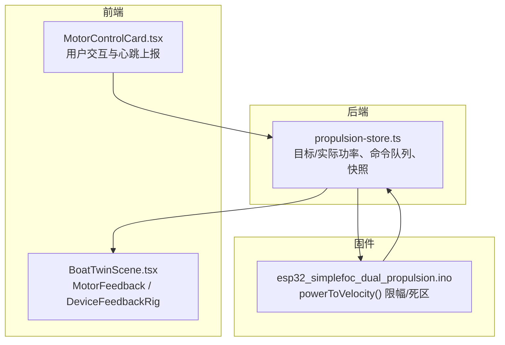
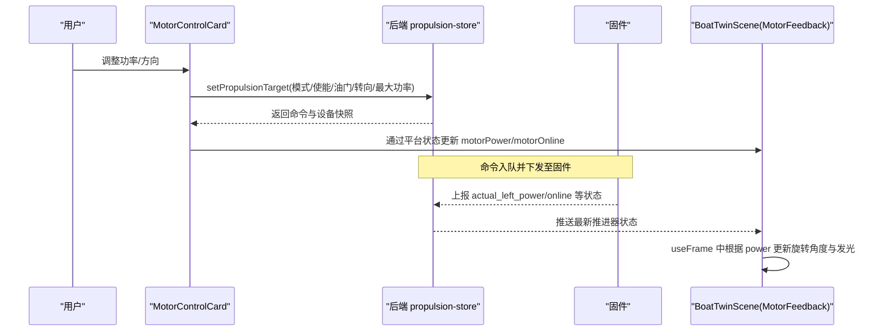
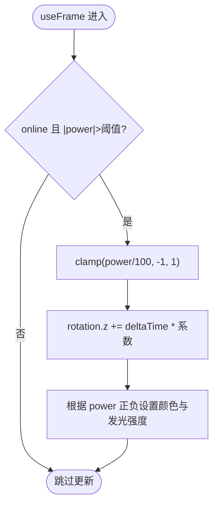
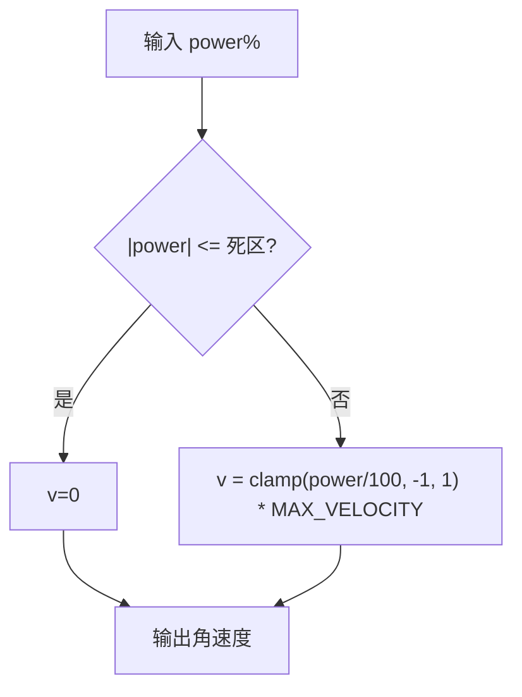
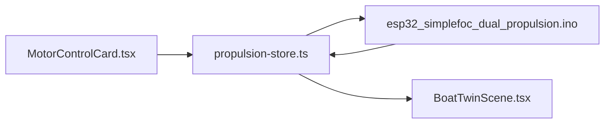

# 推进器功率可视化

<cite>
**本文引用的文件**
- [BoatTwinScene.tsx](file://fishery-digital-twin-platform/apps/frontend/src/components/three/BoatTwinScene.tsx)
- [MotorControlCard.tsx](file://fishery-digital-twin-platform/apps/frontend/src/components/dashboard/MotorControlCard.tsx)
- [propulsion-store.ts](file://fishery-digital-twin-platform/apps/backend/src/propulsion-store.ts)
- [esp32_simplefoc_dual_propulsion.ino](file://fishery-digital-twin-platform/firmware/esp32/esp32_simplefoc_dual_propulsion/esp32_simplefoc_dual_propulsion.ino)
</cite>

## 目录
1. [简介](#简介)
2. [项目结构](#项目结构)
3. [核心组件](#核心组件)
4. [架构总览](#架构总览)
5. [详细组件分析](#详细组件分析)
6. [依赖关系分析](#依赖关系分析)
7. [性能考虑](#性能考虑)
8. [故障排查指南](#故障排查指南)
9. [结论](#结论)
10. [附录](#附录)

## 简介
本文件聚焦“推进器功率可视化”的技术实现，围绕 MotorFeedback 组件展开，系统阐述：
- 功率到转速的映射算法（含功率范围处理、转速计算与方向控制）
- 旋转动画的实现机制（推进器叶片旋转效果、速度控制与实时响应）
- 发光效果与状态指示（功率等级颜色变化、发光强度调节、在线状态显示）
- 推进器位置配置方法（在不同船模中正确定位组件）
- 高帧率下的性能优化策略

## 项目结构
本项目采用前后端分离与固件协同的方式：
- 前端 Three.js 场景负责推进器的三维可视化与动画（MotorFeedback、DeviceFeedbackRig 等）
- 后端 propulsion-store 管理推进器设备状态、命令队列与快照
- 固件侧提供功率到速度的转换与安全限幅逻辑

图表来源
- [BoatTwinScene.tsx:275-319](file://fishery-digital-twin-platform/apps/frontend/src/components/three/BoatTwinScene.tsx#L275-L319)
- [MotorControlCard.tsx:95-131](file://fishery-digital-twin-platform/apps/frontend/src/components/dashboard/MotorControlCard.tsx#L95-L131)
- [propulsion-store.ts:166-231](file://fishery-digital-twin-platform/apps/backend/src/propulsion-store.ts#L166-L231)
- [esp32_simplefoc_dual_propulsion.ino:712-717](file://fishery-digital-twin-platform/firmware/esp32/esp32_simplefoc_dual_propulsion/esp32_simplefoc_dual_propulsion.ino#L712-L717)

章节来源
- [BoatTwinScene.tsx:275-319](file://fishery-digital-twin-platform/apps/frontend/src/components/three/BoatTwinScene.tsx#L275-L319)
- [MotorControlCard.tsx:95-131](file://fishery-digital-twin-platform/apps/frontend/src/components/dashboard/MotorControlCard.tsx#L95-L131)
- [propulsion-store.ts:166-231](file://fishery-digital-twin-platform/apps/backend/src/propulsion-store.ts#L166-L231)
- [esp32_simplefoc_dual_propulsion.ino:712-717](file://fishery-digital-twin-platform/firmware/esp32/esp32_simplefoc_dual_propulsion/esp32_simplefoc_dual_propulsion.ino#L712-L717)

## 核心组件
- MotorFeedback：基于 power 与 online 驱动推进器叶片的旋转与发光反馈
- DeviceFeedbackRig：将伺服、电机、执行器等设备反馈装配到模型上，并设置各部件位置
- MotorControlCard：用户界面与心跳上报，维护目标功率与方向
- propulsion-store：统一的目标/实际功率解析、限幅、命令队列与在线性判断
- 固件 powerToVelocity：将百分比功率映射为角速度，并应用死区与限幅

章节来源
- [BoatTwinScene.tsx:352-379](file://fishery-digital-twin-platform/apps/frontend/src/components/three/BoatTwinScene.tsx#L352-L379)
- [BoatTwinScene.tsx:275-319](file://fishery-digital-twin-platform/apps/frontend/src/components/three/BoatTwinScene.tsx#L275-L319)
- [MotorControlCard.tsx:95-131](file://fishery-digital-twin-platform/apps/frontend/src/components/dashboard/MotorControlCard.tsx#L95-L131)
- [propulsion-store.ts:166-231](file://fishery-digital-twin-platform/apps/backend/src/propulsion-store.ts#L166-L231)
- [esp32_simplefoc_dual_propulsion.ino:712-717](file://fishery-digital-twin-platform/firmware/esp32/esp32_simplefoc_dual_propulsion/esp32_simplefoc_dual_propulsion.ino#L712-L717)

## 架构总览
以下时序图展示从用户操作到三维动画更新的完整链路：

图表来源
- [MotorControlCard.tsx:95-131](file://fishery-digital-twin-platform/apps/frontend/src/components/dashboard/MotorControlCard.tsx#L95-L131)
- [propulsion-store.ts:166-231](file://fishery-digital-twin-platform/apps/backend/src/propulsion-store.ts#L166-L231)
- [BoatTwinScene.tsx:352-379](file://fishery-digital-twin-platform/apps/frontend/src/components/three/BoatTwinScene.tsx#L352-L379)

## 详细组件分析

### MotorFeedback：功率到转速映射与旋转动画
- 输入参数
  - position：推进器在模型中的局部坐标
  - power：当前功率百分比（-100~100），由设备反馈或仿真决定
  - online：设备是否在线
  - size：用于缩放几何体尺寸
- 关键行为
  - 仅在 online 且 |power| > 阈值时更新旋转，避免微小抖动
  - 每帧增量：deltaTime × clamp(power/100, -1, 1) × 系数，实现线性速率控制
  - 方向控制：power 正负直接决定旋转方向
  - 发光与颜色：active = online && |power| > 阈值；正向绿色、反向橙色、离线灰色；emissiveIntensity 随 active 切换
- 复杂度
  - 每帧 O(1) 的旋转与材质属性更新，无额外内存分配

图表来源
- [BoatTwinScene.tsx:352-379](file://fishery-digital-twin-platform/apps/frontend/src/components/three/BoatTwinScene.tsx#L352-L379)

章节来源
- [BoatTwinScene.tsx:352-379](file://fishery-digital-twin-platform/apps/frontend/src/components/three/BoatTwinScene.tsx#L352-L379)

### 功率到转速的映射算法（前端 + 固件）
- 前端 MotorFeedback
  - 使用线性映射：转速 ∝ clamp(power/100, -1, 1)，乘以固定系数得到每帧角增量
  - 优点：简单、稳定、可预测
- 固件 esp32_simplefoc_dual_propulsion
  - powerToVelocity：若 |power| ≤ 死区则输出 0；否则将 power% 归一化到 [-1,1] 后乘以最大角速度上限
  - 作用：保证低功率不启动、防止超调、保护硬件

图表来源
- [esp32_simplefoc_dual_propulsion.ino:712-717](file://fishery-digital-twin-platform/firmware/esp32/esp32_simplefoc_dual_propulsion/esp32_simplefoc_dual_propulsion.ino#L712-L717)

章节来源
- [esp32_simplefoc_dual_propulsion.ino:712-717](file://fishery-digital-twin-platform/firmware/esp32/esp32_simplefoc_dual_propulsion/esp32_simplefoc_dual_propulsion.ino#L712-L717)
- [BoatTwinScene.tsx:352-379](file://fishery-digital-twin-platform/apps/frontend/src/components/three/BoatTwinScene.tsx#L352-L379)

### 旋转动画与实时响应
- 使用 useFrame 钩子，按 deltaTime 累加旋转角度，确保不同刷新率下速度一致
- 通过 clamp 限制功率到 [-1,1]，避免过冲
- 当 |power| 低于阈值时停止更新，减少不必要的渲染开销
- 发光强度与颜色随 active 状态切换，提供直观的运行指示

章节来源
- [BoatTwinScene.tsx:352-379](file://fishery-digital-twin-platform/apps/frontend/src/components/three/BoatTwinScene.tsx#L352-L379)

### 发光效果与状态指示系统
- 颜色策略
  - 正向运行：绿色系
  - 反向运行：橙色系
  - 离线/未激活：灰色系
- 发光强度
  - active 时开启 emissive 并设置强度；非 active 时关闭
- 在线状态
  - online 标志来自设备反馈；结合 last_seen 时间戳判定在线性（后端/前端均参与）

章节来源
- [BoatTwinScene.tsx:352-379](file://fishery-digital-twin-platform/apps/frontend/src/components/three/BoatTwinScene.tsx#L352-L379)
- [propulsion-store.ts:139-147](file://fishery-digital-twin-platform/apps/backend/src/propulsion-store.ts#L139-L147)

### 推进器位置配置方法
- DeviceFeedbackRig 根据是否导入真实模型，分别定义不同的位置数组
- 对于 MotorFeedback，传入 position 以匹配具体船模的安装点
- 建议步骤
  - 确定推进器在模型坐标系中的安装位置（X/Y/Z）
  - 在 DeviceFeedbackRig 中为 MotorFeedback 指定对应 position
  - 如需适配不同船模，复制该 rig 并调整 position 与 size

章节来源
- [BoatTwinScene.tsx:275-319](file://fishery-digital-twin-platform/apps/frontend/src/components/three/BoatTwinScene.tsx#L275-L319)

### 用户交互与心跳上报
- MotorControlCard 维护 targetPower，并通过 setPropulsionTarget 周期性上报（心跳间隔约 800ms）
- 支持方向乘数 directionMultiplier，便于统一正负方向语义
- 异常与保护：运行时锁定、冷却倒计时、紧急停止等状态会禁用方向控制并提示

章节来源
- [MotorControlCard.tsx:95-131](file://fishery-digital-twin-platform/apps/frontend/src/components/dashboard/MotorControlCard.tsx#L95-L131)
- [MotorControlCard.tsx:152-179](file://fishery-digital-twin-platform/apps/frontend/src/components/dashboard/MotorControlCard.tsx#L152-L179)

## 依赖关系分析
- 前端依赖
  - BoatTwinScene.tsx 依赖 Three.js 与 React Three Fiber 进行渲染与动画
  - MotorControlCard.tsx 依赖平台存储与 API 调用
- 后端依赖
  - propulsion-store.ts 集中管理设备状态、命令队列与在线性判断
- 固件依赖
  - esp32_simplefoc_dual_propulsion.ino 提供功率到速度的安全映射

图表来源
- [MotorControlCard.tsx:95-131](file://fishery-digital-twin-platform/apps/frontend/src/components/dashboard/MotorControlCard.tsx#L95-L131)
- [propulsion-store.ts:166-231](file://fishery-digital-twin-platform/apps/backend/src/propulsion-store.ts#L166-L231)
- [BoatTwinScene.tsx:275-319](file://fishery-digital-twin-platform/apps/frontend/src/components/three/BoatTwinScene.tsx#L275-L319)
- [esp32_simplefoc_dual_propulsion.ino:712-717](file://fishery-digital-twin-platform/firmware/esp32/esp32_simplefoc_dual_propulsion/esp32_simplefoc_dual_propulsion.ino#L712-L717)

章节来源
- [MotorControlCard.tsx:95-131](file://fishery-digital-twin-platform/apps/frontend/src/components/dashboard/MotorControlCard.tsx#L95-L131)
- [propulsion-store.ts:166-231](file://fishery-digital-twin-platform/apps/backend/src/propulsion-store.ts#L166-L231)
- [BoatTwinScene.tsx:275-319](file://fishery-digital-twin-platform/apps/frontend/src/components/three/BoatTwinScene.tsx#L275-L319)
- [esp32_simplefoc_dual_propulsion.ino:712-717](file://fishery-digital-twin-platform/firmware/esp32/esp32_simplefoc_dual_propulsion/esp32_simplefoc_dual_propulsion.ino#L712-L717)

## 性能考虑
- 帧级节流与增量更新
  - 使用 deltaTime 累加旋转，避免帧率波动导致的动画速度不一致
  - 对 |power| 小于阈值的帧跳过更新，降低 CPU/GPU 压力
- 材质与着色
  - 仅对 active 状态启用 emissive，减少无效的光照计算
  - 使用简单的几何体与材质，避免复杂着色器开销
- 数据流优化
  - 心跳间隔合理（约 800ms），平衡实时性与网络负载
  - 后端对命令进行超时过滤，避免陈旧命令影响性能

[本节为通用性能指导，不直接分析具体文件]

## 故障排查指南
- 推进器不转
  - 检查 online 是否为真，以及 |power| 是否超过阈值
  - 确认固件死区设置是否导致低速不启动
- 方向相反
  - 检查 directionMultiplier 配置是否正确
  - 核对固件与实际接线方向
- 动画卡顿
  - 检查 useFrame 中是否有过多重计算
  - 适当提高阈值以减少小功率时的频繁更新
- 命令不生效
  - 查看后端日志与命令队列，确认设备在线
  - 检查紧急停止与冷却计时器状态

章节来源
- [MotorControlCard.tsx:152-179](file://fishery-digital-twin-platform/apps/frontend/src/components/dashboard/MotorControlCard.tsx#L152-L179)
- [propulsion-store.ts:166-231](file://fishery-digital-twin-platform/apps/backend/src/propulsion-store.ts#L166-L231)
- [esp32_simplefoc_dual_propulsion.ino:712-717](file://fishery-digital-twin-platform/firmware/esp32/esp32_simplefoc_dual_propulsion/esp32_simplefoc_dual_propulsion.ino#L712-L717)

## 结论
MotorFeedback 通过简洁而稳健的功率到转速映射、方向控制与发光反馈，实现了高帧率下的流畅推进器可视化。配合后端的状态管理与固件的安全限幅，系统在易用性、可靠性与性能之间取得良好平衡。开发者可通过 DeviceFeedbackRig 灵活配置推进器位置，适配不同船模。

[本节为总结性内容，不直接分析具体文件]

## 附录
- 关键接口与数据
  - 前端：MotorFeedback(position, power, online, size)
  - 后端：setPropulsionTarget(device_id, mode, enabled, emergency_stop, throttle, steering, max_power)
  - 固件：powerToVelocity(powerPercent) → 角速度
- 推荐实践
  - 合理设置功率阈值与系数，确保动画平滑且不过载
  - 使用 directionMultiplier 统一多设备的方向语义
  - 定期校准模型坐标系中的推进器位置，保证视觉一致性

[本节为补充信息，不直接分析具体文件]