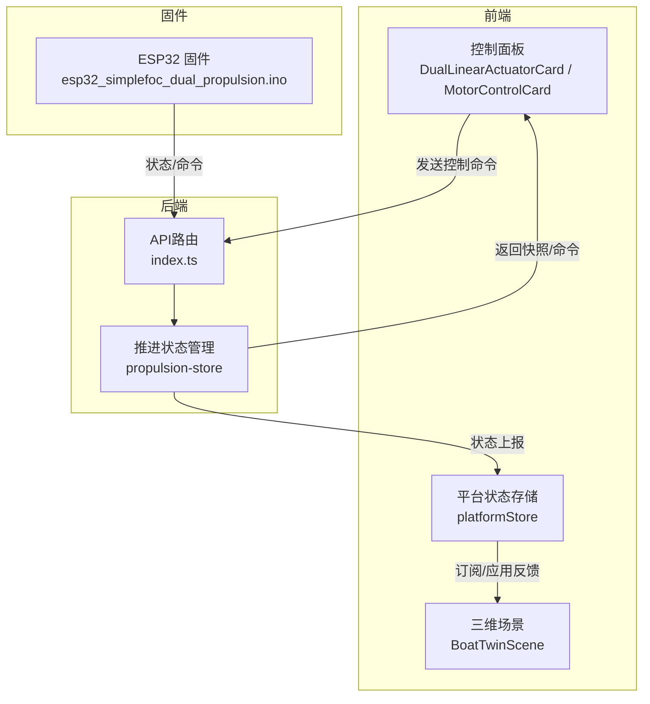
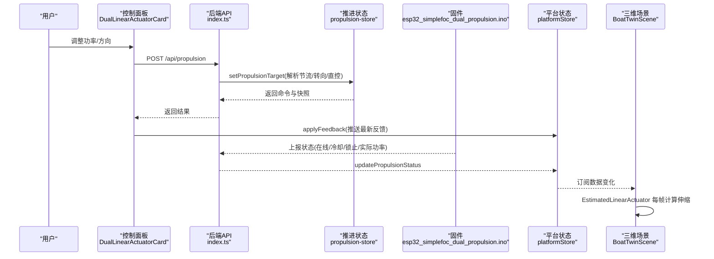
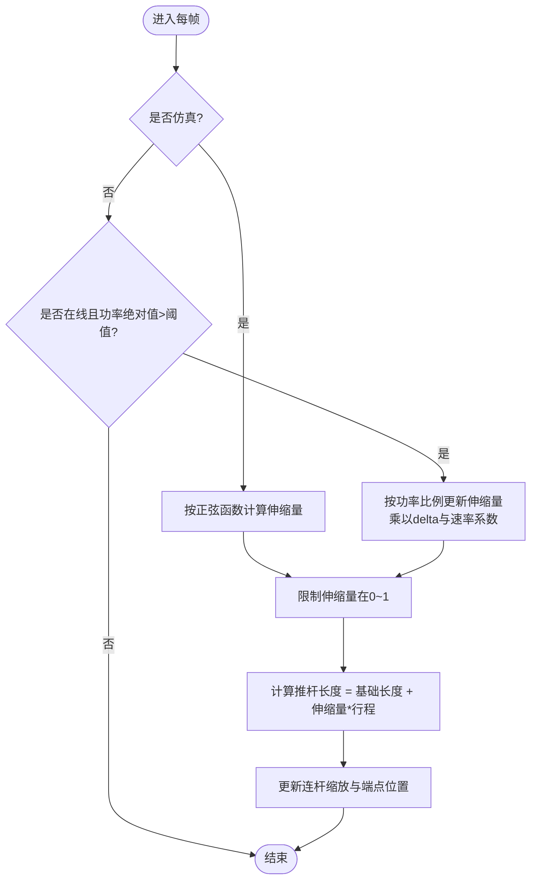
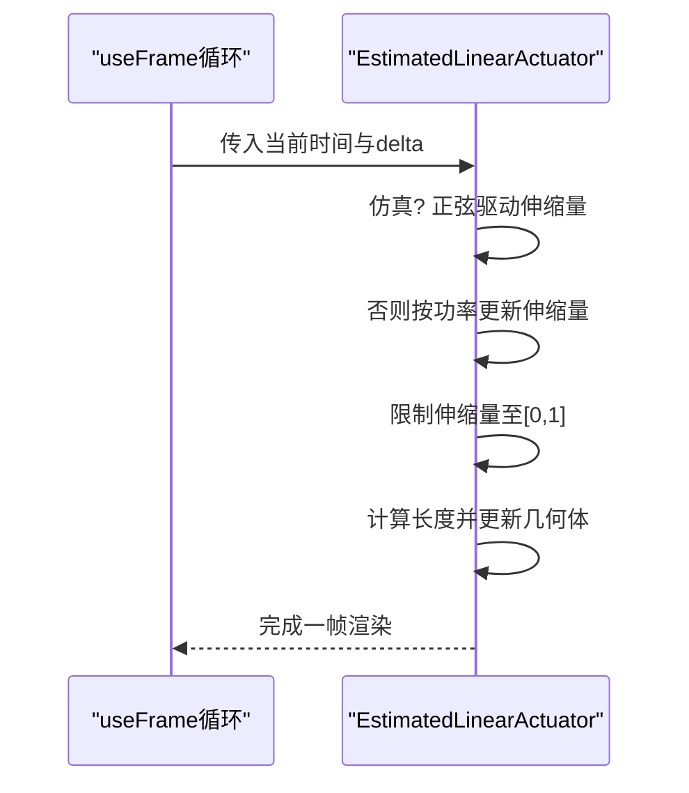
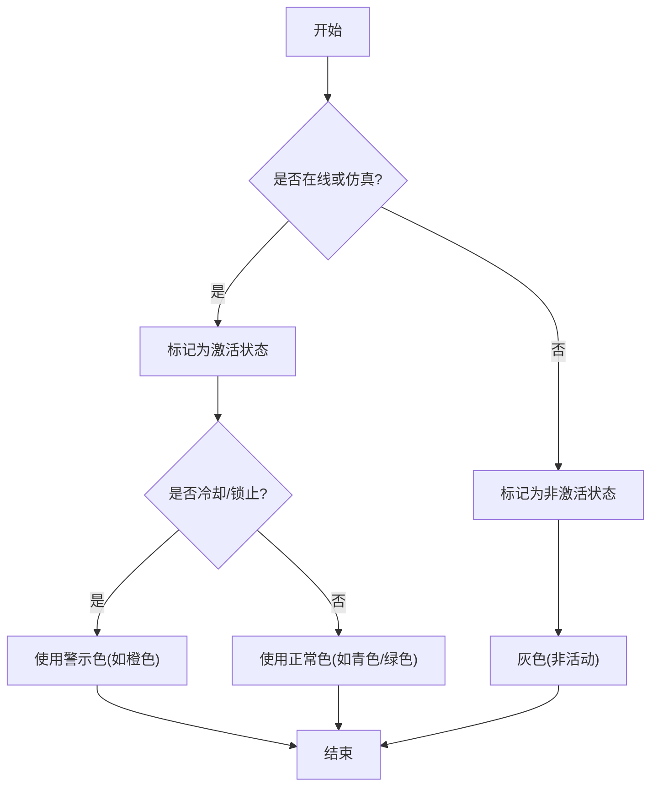
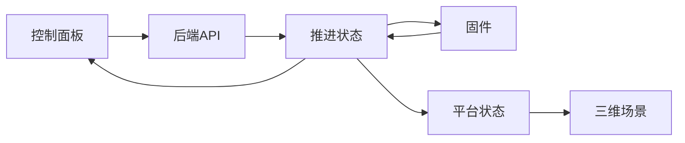

# 线性执行器可视化

<cite>
**本文引用的文件**
- [BoatTwinScene.tsx](file://fishery-digital-twin-platform/apps/frontend/src/components/three/BoatTwinScene.tsx)
- [DualLinearActuatorCard.tsx](file://fishery-digital-twin-platform/apps/frontend/src/components/dashboard/DualLinearActuatorCard.tsx)
- [MotorControlCard.tsx](file://fishery-digital-twin-platform/apps/frontend/src/components/dashboard/MotorControlCard.tsx)
- [platformStore.ts](file://fishery-digital-twin-platform/apps/frontend/src/lib/platformStore.ts)
- [propulsion-store.ts](file://fishery-digital-twin-platform/apps/backend/src/propulsion-store.ts)
- [index.ts](file://fishery-digital-twin-platform/apps/backend/src/index.ts)
- [esp32_simplefoc_dual_propulsion.ino](file://fishery-digital-twin-platform/firmware/esp32/esp32_simplefoc_dual_propulsion/esp32_simplefoc_dual_propulsion.ino)
</cite>

## 目录
1. [简介](#简介)
2. [项目结构](#项目结构)
3. [核心组件](#核心组件)
4. [架构总览](#架构总览)
5. [详细组件分析](#详细组件分析)
6. [依赖关系分析](#依赖关系分析)
7. [性能考虑](#性能考虑)
8. [故障排查指南](#故障排查指南)
9. [结论](#结论)
10. [附录](#附录)

## 简介
本文件面向“线性执行器可视化”的实现与使用，聚焦 EstimatedLinearActuator 组件及其在数字孪生场景中的完整链路：从后端推进控制、设备状态反馈到前端三维渲染。文档重点包括：
- 推杆长度计算算法：功率值到伸缩长度的映射、边界限制与插值平滑处理
- 伸缩动画机制：延伸/收缩效果、运动轨迹计算与物理模拟（仿真模式）
- 状态颜色系统：在线指示、功率等级显示、故障/冷却/锁定警告
- 多执行器配置方法：双路推杆与单路推杆的布置与联动
- 性能优化建议：多执行器同时工作时的渲染效率保障

## 项目结构
与线性执行器可视化相关的前后端关键位置如下：
- 前端三维场景与执行器组件：BoatTwinScene.tsx
- 前端控制面板与命令下发：DualLinearActuatorCard.tsx、MotorControlCard.tsx
- 前端数据总线与状态订阅：platformStore.ts
- 后端推进控制与状态管理：propulsion-store.ts、index.ts
- 固件侧安全与运行保护逻辑：esp32_simplefoc_dual_propulsion.ino

图表来源
- [BoatTwinScene.tsx:668-779](file://fishery-digital-twin-platform/apps/frontend/src/components/three/BoatTwinScene.tsx#L668-L779)
- [DualLinearActuatorCard.tsx:45-83](file://fishery-digital-twin-platform/apps/frontend/src/components/dashboard/DualLinearActuatorCard.tsx#L45-L83)
- [platformStore.ts:81-96](file://fishery-digital-twin-platform/apps/frontend/src/lib/platformStore.ts#L81-L96)
- [propulsion-store.ts:166-230](file://fishery-digital-twin-platform/apps/backend/src/propulsion-store.ts#L166-L230)
- [index.ts:510-538](file://fishery-digital-twin-platform/apps/backend/src/index.ts#L510-L538)
- [esp32_simplefoc_dual_propulsion.ino:656-688](file://fishery-digital-twin-platform/firmware/esp32/esp32_simplefoc_dual_propulsion/esp32_simplefoc_dual_propulsion.ino#L656-L688)

章节来源
- [BoatTwinScene.tsx:668-779](file://fishery-digital-twin-platform/apps/frontend/src/components/three/BoatTwinScene.tsx#L668-L779)
- [DualLinearActuatorCard.tsx:45-83](file://fishery-digital-twin-platform/apps/frontend/src/components/dashboard/DualLinearActuatorCard.tsx#L45-L83)
- [platformStore.ts:81-96](file://fishery-digital-twin-platform/apps/frontend/src/lib/platformStore.ts#L81-L96)
- [propulsion-store.ts:166-230](file://fishery-digital-twin-platform/apps/backend/src/propulsion-store.ts#L166-L230)
- [index.ts:510-538](file://fishery-digital-twin-platform/apps/backend/src/index.ts#L510-L538)
- [esp32_simplefoc_dual_propulsion.ino:656-688](file://fishery-digital-twin-platform/firmware/esp32/esp32_simplefoc_dual_propulsion/esp32_simplefoc_dual_propulsion.ino#L656-L688)

## 核心组件
- EstimatedLinearActuator：负责将功率信号转换为推杆伸缩长度，并在每帧更新几何体尺寸与端点位置；支持仿真正弦动画与实际功率驱动的平滑过渡。
- LinearActuatorMechanisms：装配多个执行器实例（双路推杆 + 单路推杆），并传入各自的位置、旋转、功率、在线状态与仿真相位。
- DualLinearActuatorCard / MotorControlCard：提供用户界面，设置目标功率、紧急停止、同步控制等，并通过平台接口下发命令。
- platformStore：统一维护平台快照与设备反馈，供三维场景消费。
- propulsion-store：解析并合并节流/转向或直接通道功率，输出左右通道目标功率，并生成命令队列。
- 固件：实现推杆运行周期、占空比限制、冷却与运行时锁止等安全策略，并将状态回传给后端。

章节来源
- [BoatTwinScene.tsx:668-779](file://fishery-digital-twin-platform/apps/frontend/src/components/three/BoatTwinScene.tsx#L668-L779)
- [DualLinearActuatorCard.tsx:45-83](file://fishery-digital-twin-platform/apps/frontend/src/components/dashboard/DualLinearActuatorCard.tsx#L45-L83)
- [MotorControlCard.tsx:140-173](file://fishery-digital-twin-platform/apps/frontend/src/components/dashboard/MotorControlCard.tsx#L140-L173)
- [platformStore.ts:81-96](file://fishery-digital-twin-platform/apps/frontend/src/lib/platformStore.ts#L81-L96)
- [propulsion-store.ts:166-230](file://fishery-digital-twin-platform/apps/backend/src/propulsion-store.ts#L166-L230)
- [esp32_simplefoc_dual_propulsion.ino:656-688](file://fishery-digital-twin-platform/firmware/esp32/esp32_simplefoc_dual_propulsion/esp32_simplefoc_dual_propulsion.ino#L656-L688)

## 架构总览
下图展示了从用户操作到三维渲染的端到端流程，以及固件安全保护对可视化的影响。

图表来源
- [DualLinearActuatorCard.tsx:45-83](file://fishery-digital-twin-platform/apps/frontend/src/components/dashboard/DualLinearActuatorCard.tsx#L45-L83)
- [index.ts:510-538](file://fishery-digital-twin-platform/apps/backend/src/index.ts#L510-L538)
- [propulsion-store.ts:166-230](file://fishery-digital-twin-platform/apps/backend/src/propulsion-store.ts#L166-L230)
- [platformStore.ts:81-96](file://fishery-digital-twin-platform/apps/frontend/src/lib/platformStore.ts#L81-L96)
- [BoatTwinScene.tsx:668-779](file://fishery-digital-twin-platform/apps/frontend/src/components/three/BoatTwinScene.tsx#L668-L779)
- [esp32_simplefoc_dual_propulsion.ino:656-688](file://fishery-digital-twin-platform/firmware/esp32/esp32_simplefoc_dual_propulsion/esp32_simplefoc_dual_propulsion.ino#L656-L688)

## 详细组件分析

### 推杆长度计算算法
EstimatedLinearActuator 的核心在于将输入功率映射为推杆的相对伸缩量，并在每帧进行平滑更新与边界限制。

- 功率到伸缩量的映射
  - 当处于仿真模式时，伸缩量由正弦函数驱动，形成周期性伸缩动画。
  - 当处于真实设备模式且在线且功率绝对值大于阈值时，伸缩量按功率比例随时间增量累积，速率受 delta 与系数控制。
- 边界限制
  - 伸缩量被限制在 0~1 范围内，避免超出机械行程。
  - 最终推杆长度由基础长度与伸缩量线性组合得到，确保最小/最大长度约束。
- 插值平滑
  - 通过每帧累加的方式实现连续平滑过渡，避免突变导致的视觉抖动。
  - 仿真模式下使用阻尼或正弦曲线保证自然运动。

图表来源
- [BoatTwinScene.tsx:736-755](file://fishery-digital-twin-platform/apps/frontend/src/components/three/BoatTwinScene.tsx#L736-L755)

章节来源
- [BoatTwinScene.tsx:736-755](file://fishery-digital-twin-platform/apps/frontend/src/components/three/BoatTwinScene.tsx#L736-L755)

### 伸缩动画机制
- 仿真模式
  - 使用正弦波驱动伸缩量，不同执行器通过 simulationPhase 错开相位，形成交错动画效果。
- 真实模式
  - 根据功率正负决定延伸或收缩方向，速率与功率大小成正比，结合 delta 实现帧率无关的平滑运动。
- 物理模拟
  - 虽然未引入质量与阻尼模型，但通过每帧增量与边界限制实现了近似物理的响应特性。

图表来源
- [BoatTwinScene.tsx:736-755](file://fishery-digital-twin-platform/apps/frontend/src/components/three/BoatTwinScene.tsx#L736-L755)

章节来源
- [BoatTwinScene.tsx:736-755](file://fishery-digital-twin-platform/apps/frontend/src/components/three/BoatTwinScene.tsx#L736-L755)

### 状态颜色变化系统
- 在线状态指示
  - 执行器主体材质颜色基于 online/simulation 切换，离线时使用中性灰。
- 功率等级显示
  - 激活状态下，推杆与端点颜色采用传入的 color，并启用自发光强度以突出活动状态。
- 故障/冷却/锁定警告
  - 单路推杆的颜色根据 sxtlRuntimeLockout 或冷却剩余时间动态切换为警示色，提示不可用或受限。

图表来源
- [BoatTwinScene.tsx:675-709](file://fishery-digital-twin-platform/apps/frontend/src/components/three/BoatTwinScene.tsx#L675-L709)
- [BoatTwinScene.tsx:757-779](file://fishery-digital-twin-platform/apps/frontend/src/components/three/BoatTwinScene.tsx#L757-L779)

章节来源
- [BoatTwinScene.tsx:675-709](file://fishery-digital-twin-platform/apps/frontend/src/components/three/BoatTwinScene.tsx#L675-L709)
- [BoatTwinScene.tsx:757-779](file://fishery-digital-twin-platform/apps/frontend/src/components/three/BoatTwinScene.tsx#L757-L779)

### 多执行器配置方法
- 双路推杆
  - 通过 dualPushrodPower 分别控制左右通道，支持独立功率设定与同步控制。
  - 在场景中放置两个 EstimatedLinearActuator，分别赋予不同 position、rotation 与 simulationPhase。
- 单路推杆
  - 通过 sxtlPower 控制单一执行器，并根据冷却/锁止状态改变颜色。
- 复杂机械结构中的布置
  - 使用不同的 position/rotation 将执行器对齐到机械臂或连接点。
  - 通过 simulationPhase 错开动画相位，避免视觉重叠与冲突。
- 联动策略
  - 前端面板可设置同步目标功率，后端根据 singleChannel 标志或直控通道参数计算左右通道输出。
  - 固件侧的安全限制（冷却、占空比、往返次数）会反映到前端状态，从而改变可视化颜色与可用性。

章节来源
- [BoatTwinScene.tsx:668-712](file://fishery-digital-twin-platform/apps/frontend/src/components/three/BoatTwinScene.tsx#L668-L712)
- [DualLinearActuatorCard.tsx:45-83](file://fishery-digital-twin-platform/apps/frontend/src/components/dashboard/DualLinearActuatorCard.tsx#L45-L83)
- [propulsion-store.ts:166-230](file://fishery-digital-twin-platform/apps/backend/src/propulsion-store.ts#L166-L230)
- [esp32_simplefoc_dual_propulsion.ino:656-688](file://fishery-digital-twin-platform/firmware/esp32/esp32_simplefoc_dual_propulsion/esp32_simplefoc_dual_propulsion.ino#L656-L688)

### 功率到伸缩长度的映射与边界限制
- 映射规则
  - 仿真模式：正弦函数驱动伸缩量，范围覆盖大部分行程。
  - 真实模式：功率百分比映射为速度向量，乘以 delta 与速率系数后累加到伸缩量。
- 边界限制
  - 伸缩量限制在 0~1，防止超程。
  - 推杆长度由基础长度与伸缩量线性组合，确保最小/最大长度。
- 平滑处理
  - 每帧增量更新，避免跳变；仿真模式使用阻尼或正弦曲线提升自然度。

章节来源
- [BoatTwinScene.tsx:736-755](file://fishery-digital-twin-platform/apps/frontend/src/components/three/BoatTwinScene.tsx#L736-L755)

### 运动轨迹计算与物理模拟
- 轨迹计算
  - 伸缩量变化直接映射为推杆长度变化，端点位置随长度线性移动。
- 物理模拟
  - 未引入质量与弹簧阻尼，但通过速率系数与边界限制实现近似物理响应。
  - 仿真模式使用正弦曲线模拟往复运动，便于演示与调试。

章节来源
- [BoatTwinScene.tsx:736-755](file://fishery-digital-twin-platform/apps/frontend/src/components/three/BoatTwinScene.tsx#L736-L755)

## 依赖关系分析
- 前端依赖
  - BoatTwinScene 依赖 platformStore 提供的设备反馈数据，用于驱动三维执行器动画。
  - DualLinearActuatorCard 与 MotorControlCard 通过 API 调用后端推进控制，并应用反馈到 store。
- 后端依赖
  - propulsion-store 解析节流/转向或直接通道功率，输出左右通道目标功率，并生成命令队列。
  - index.ts 暴露 REST 接口，接收控制命令与状态上报。
- 固件依赖
  - 固件实现推杆运行周期、占空比限制、冷却与锁止，并将状态上报给后端。

图表来源
- [DualLinearActuatorCard.tsx:45-83](file://fishery-digital-twin-platform/apps/frontend/src/components/dashboard/DualLinearActuatorCard.tsx#L45-L83)
- [index.ts:510-538](file://fishery-digital-twin-platform/apps/backend/src/index.ts#L510-L538)
- [propulsion-store.ts:166-230](file://fishery-digital-twin-platform/apps/backend/src/propulsion-store.ts#L166-L230)
- [platformStore.ts:81-96](file://fishery-digital-twin-platform/apps/frontend/src/lib/platformStore.ts#L81-L96)
- [BoatTwinScene.tsx:668-779](file://fishery-digital-twin-platform/apps/frontend/src/components/three/BoatTwinScene.tsx#L668-L779)
- [esp32_simplefoc_dual_propulsion.ino:656-688](file://fishery-digital-twin-platform/firmware/esp32/esp32_simplefoc_dual_propulsion/esp32_simplefoc_dual_propulsion.ino#L656-L688)

章节来源
- [DualLinearActuatorCard.tsx:45-83](file://fishery-digital-twin-platform/apps/frontend/src/components/dashboard/DualLinearActuatorCard.tsx#L45-L83)
- [index.ts:510-538](file://fishery-digital-twin-platform/apps/backend/src/index.ts#L510-L538)
- [propulsion-store.ts:166-230](file://fishery-digital-twin-platform/apps/backend/src/propulsion-store.ts#L166-L230)
- [platformStore.ts:81-96](file://fishery-digital-twin-platform/apps/frontend/src/lib/platformStore.ts#L81-L96)
- [BoatTwinScene.tsx:668-779](file://fishery-digital-twin-platform/apps/frontend/src/components/three/BoatTwinScene.tsx#L668-L779)
- [esp32_simplefoc_dual_propulsion.ino:656-688](file://fishery-digital-twin-platform/firmware/esp32/esp32_simplefoc_dual_propulsion/esp32_simplefoc_dual_propulsion.ino#L656-L688)

## 性能考虑
- 减少不必要的重绘
  - 仅在在线且功率绝对值大于阈值时更新伸缩量，避免空闲状态下的计算开销。
- 帧率无关的运动
  - 使用 delta 与速率系数确保在不同帧率下运动一致，避免卡顿或过冲。
- 批量更新几何体
  - 每帧仅更新必要的 mesh 属性（scale、position），减少 Three.js 的重算成本。
- 仿真相位错开
  - 通过 simulationPhase 错开多个执行器的动画相位，避免视觉干扰与资源竞争。
- 后端限流与去抖
  - 前端面板以固定间隔重复发送命令，后端通过命令队列与超时过滤保证稳定性。

章节来源
- [BoatTwinScene.tsx:736-755](file://fishery-digital-twin-platform/apps/frontend/src/components/three/BoatTwinScene.tsx#L736-L755)
- [DualLinearActuatorCard.tsx:76-83](file://fishery-digital-twin-platform/apps/frontend/src/components/dashboard/DualLinearActuatorCard.tsx#L76-L83)
- [propulsion-store.ts:310-318](file://fishery-digital-twin-platform/apps/backend/src/propulsion-store.ts#L310-L318)

## 故障排查指南
- 执行器无动作
  - 检查是否在线且功率绝对值大于阈值；确认仿真模式开关。
  - 查看固件是否处于冷却或锁止状态，必要时等待冷却完成或点击停止解除锁止。
- 颜色异常
  - 若单路推杆显示警示色，检查 sxtlRuntimeLockout 与冷却剩余时间。
  - 若执行器呈灰色，确认 online/simulation 状态。
- 命令无效
  - 确认设备在线且未触发急停；检查后端日志与命令队列。
  - 若设备离线，主动命令将被拒绝或排队失败。

章节来源
- [BoatTwinScene.tsx:675-709](file://fishery-digital-twin-platform/apps/frontend/src/components/three/BoatTwinScene.tsx#L675-L709)
- [MotorControlCard.tsx:140-173](file://fishery-digital-twin-platform/apps/frontend/src/components/dashboard/MotorControlCard.tsx#L140-L173)
- [propulsion-store.ts:166-230](file://fishery-digital-twin-platform/apps/backend/src/propulsion-store.ts#L166-L230)
- [esp32_simplefoc_dual_propulsion.ino:656-688](file://fishery-digital-twin-platform/firmware/esp32/esp32_simplefoc_dual_propulsion/esp32_simplefoc_dual_propulsion.ino#L656-L688)

## 结论
EstimatedLinearActuator 通过简洁而稳健的算法将功率信号映射为推杆伸缩长度，并结合仿真与真实模式实现平滑动画。配合前后端的状态管理与固件安全策略，系统在复杂机械结构中能够可靠地展示执行器状态与动作。通过合理的配置与性能优化，可在多执行器并发场景下保持流畅的渲染体验。

## 附录
- 关键接口与数据结构
  - 设备反馈类型包含伺服角度、电机功率、双路推杆功率、单路推杆功率及在线/冷却/锁止状态。
  - 推进控制支持节流/转向或直接通道功率，后端根据设备配置计算左右通道输出。
- 推荐实践
  - 在复杂结构中合理布置执行器位置与旋转，确保与机械连接点对齐。
  - 使用仿真相位错开动画，避免视觉重叠。
  - 关注固件安全限制，及时响应冷却与锁止状态，保障设备寿命与安全。