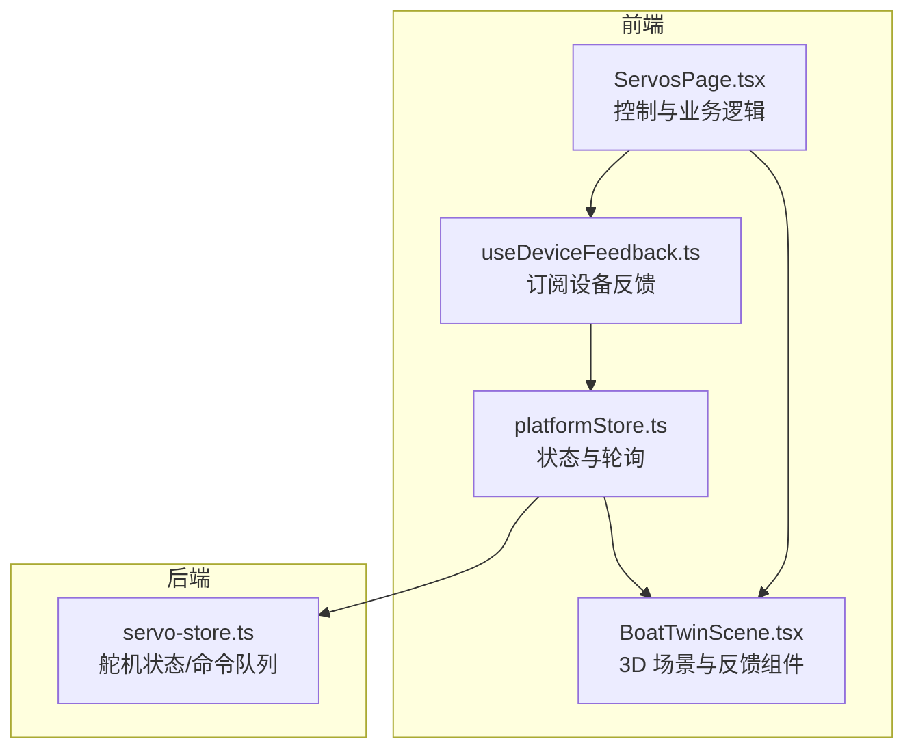
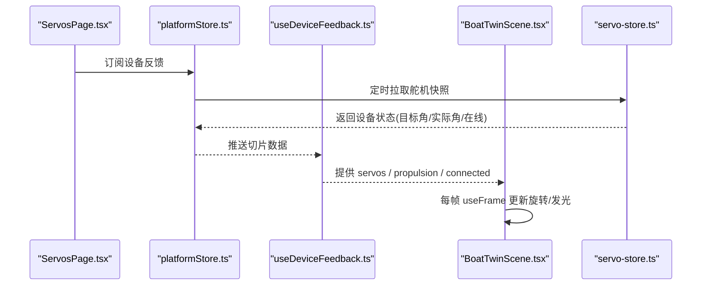
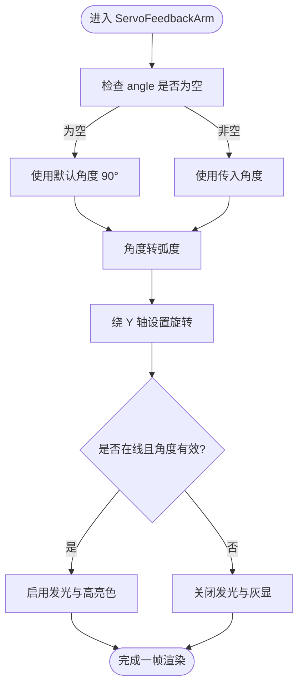
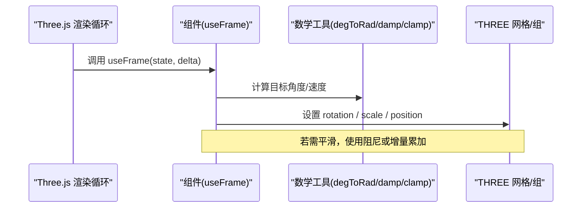
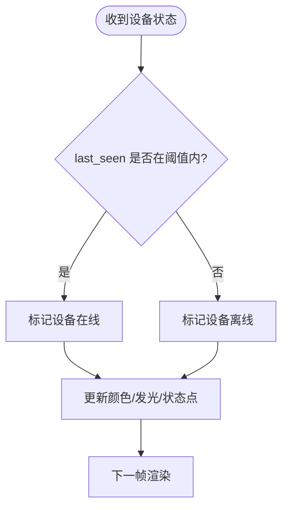
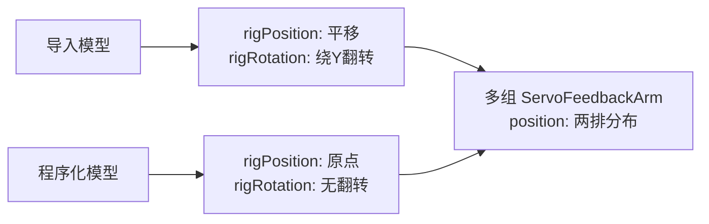
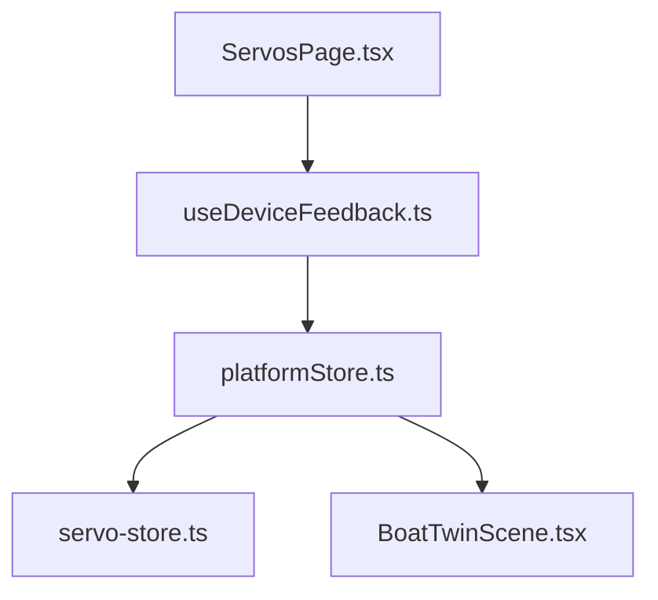

# 舵机角度可视化

<cite>
**本文引用的文件**
- [BoatTwinScene.tsx](file://fishery-digital-twin-platform/apps/frontend/src/components/three/BoatTwinScene.tsx)
- [ServosPage.tsx](file://fishery-digital-twin-platform/apps/frontend/src/components/dashboard/ServosPage.tsx)
- [useDeviceFeedback.ts](file://fishery-digital-twin-platform/apps/frontend/src/hooks/useDeviceFeedback.ts)
- [platformStore.ts](file://fishery-digital-twin-platform/apps/frontend/src/lib/platformStore.ts)
- [servo-store.ts](file://fishery-digital-twin-platform/apps/backend/src/servo-store.ts)
</cite>

## 目录
1. [简介](#简介)
2. [项目结构](#项目结构)
3. [核心组件](#核心组件)
4. [架构总览](#架构总览)
5. [详细组件分析](#详细组件分析)
6. [依赖关系分析](#依赖关系分析)
7. [性能考量](#性能考量)
8. [故障排查指南](#故障排查指南)
9. [结论](#结论)
10. [附录](#附录)

## 简介
本文件聚焦于“舵机角度可视化”的实现，围绕 ServoFeedbackArm 组件与相关数据流，系统阐述：
- 舵机角度到旋转矩阵的转换算法（角度值处理、弧度转换、旋转轴计算）
- 动态旋转动画机制（useFrame 钩子、插值与平滑过渡）
- 在线状态指示系统（设备连接检测、颜色变化与发光效果）
- 舵机位置配置指南（不同模型下的坐标与朝向）
- 性能优化建议与调试技巧，确保 3D 场景流畅准确

## 项目结构
前端通过 Three.js / React Three Fiber 构建 3D 场景，使用 useFrame 驱动每帧更新；后端维护舵机设备状态与命令队列。关键路径如下：
- 3D 场景与反馈组件：apps/frontend/src/components/three/BoatTwinScene.tsx
- 控制面板与业务逻辑：apps/frontend/src/components/dashboard/ServosPage.tsx
- 设备反馈订阅：apps/frontend/src/hooks/useDeviceFeedback.ts
- 平台状态存储与轮询：apps/frontend/src/lib/platformStore.ts
- 后端舵机状态与命令：apps/backend/src/servo-store.ts

图表来源
- [BoatTwinScene.tsx:275-350](file://fishery-digital-twin-platform/apps/frontend/src/components/three/BoatTwinScene.tsx#L275-L350)
- [ServosPage.tsx:111-145](file://fishery-digital-twin-platform/apps/frontend/src/components/dashboard/ServosPage.tsx#L111-L145)
- [useDeviceFeedback.ts:1-22](file://fishery-digital-twin-platform/apps/frontend/src/hooks/useDeviceFeedback.ts#L1-L22)
- [platformStore.ts:20-139](file://fishery-digital-twin-platform/apps/frontend/src/lib/platformStore.ts#L20-L139)
- [servo-store.ts:1-184](file://fishery-digital-twin-platform/apps/backend/src/servo-store.ts#L1-L184)

章节来源
- [BoatTwinScene.tsx:275-350](file://fishery-digital-twin-platform/apps/frontend/src/components/three/BoatTwinScene.tsx#L275-L350)
- [ServosPage.tsx:111-145](file://fishery-digital-twin-platform/apps/frontend/src/components/dashboard/ServosPage.tsx#L111-L145)
- [useDeviceFeedback.ts:1-22](file://fishery-digital-twin-platform/apps/frontend/src/hooks/useDeviceFeedback.ts#L1-L22)
- [platformStore.ts:20-139](file://fishery-digital-twin-platform/apps/frontend/src/lib/platformStore.ts#L20-L139)
- [servo-store.ts:1-184](file://fishery-digital-twin-platform/apps/backend/src/servo-store.ts#L1-L184)

## 核心组件
- ServoFeedbackArm：将单个舵机的角度映射为 3D 模型的局部旋转，并基于在线状态切换颜色与发光强度。
- DeviceFeedbackRig：按模型或程序化模型的不同，放置多个 ServoFeedbackArm 和电机反馈组件。
- MappedServoArm / CameraGimbal：对特定机械臂与云台进行角度映射与阻尼平滑。
- EstimatedLinearActuator：根据功率信号模拟伸缩运动。
- MotorFeedback：根据功率信号驱动转子旋转与发光。

章节来源
- [BoatTwinScene.tsx:275-350](file://fishery-digital-twin-platform/apps/frontend/src/components/three/BoatTwinScene.tsx#L275-L350)
- [BoatTwinScene.tsx:512-576](file://fishery-digital-twin-platform/apps/frontend/src/components/three/BoatTwinScene.tsx#L512-L576)
- [BoatTwinScene.tsx:617-666](file://fishery-digital-twin-platform/apps/frontend/src/components/three/BoatTwinScene.tsx#L617-L666)
- [BoatTwinScene.tsx:714-779](file://fishery-digital-twin-platform/apps/frontend/src/components/three/BoatTwinScene.tsx#L714-L779)
- [BoatTwinScene.tsx:352-379](file://fishery-digital-twin-platform/apps/frontend/src/components/three/BoatTwinScene.tsx#L352-L379)

## 架构总览
数据从后端 servo-store 经 platformStore 轮询获取，前端通过 useDeviceFeedback 订阅，最终在 3D 场景中渲染 ServoFeedbackArm 等组件。

图表来源
- [platformStore.ts:116-139](file://fishery-digital-twin-platform/apps/frontend/src/lib/platformStore.ts#L116-L139)
- [useDeviceFeedback.ts:1-22](file://fishery-digital-twin-platform/apps/frontend/src/hooks/useDeviceFeedback.ts#L1-L22)
- [servo-store.ts:89-104](file://fishery-digital-twin-platform/apps/backend/src/servo-store.ts#L89-L104)
- [BoatTwinScene.tsx:219-246](file://fishery-digital-twin-platform/apps/frontend/src/components/three/BoatTwinScene.tsx#L219-L246)

## 详细组件分析

### ServoFeedbackArm：角度到旋转的映射
- 输入：angle（度数，可为空）、online（布尔）、size（缩放）
- 角度处理：当 angle 为空时回退到 90°，避免异常旋转
- 弧度转换：使用度转弧度函数将角度转换为弧度
- 旋转轴：绕 Y 轴旋转，偏移量以 90° 为中心（即 90° 对应零偏转）
- 视觉反馈：
  - 在线且有角度时：高亮色与发光强度提升
  - 离线或无角度：灰色与关闭发光

图表来源
- [BoatTwinScene.tsx:321-350](file://fishery-digital-twin-platform/apps/frontend/src/components/three/BoatTwinScene.tsx#L321-L350)

章节来源
- [BoatTwinScene.tsx:321-350](file://fishery-digital-twin-platform/apps/frontend/src/components/three/BoatTwinScene.tsx#L321-L350)

### 动态旋转动画：useFrame 与平滑过渡
- 使用 useFrame 钩子在每帧回调中更新旋转或位移
- 平滑过渡策略：
  - 直接赋值：适用于实时跟随（如 ServoFeedbackArm）
  - 阻尼插值：使用阻尼函数实现平滑（如 CameraGimbal、MappedServoArm）
  - 时间步进：基于 deltaTime 累加旋转速度（如 MotorFeedback）

图表来源
- [BoatTwinScene.tsx:219-246](file://fishery-digital-twin-platform/apps/frontend/src/components/three/BoatTwinScene.tsx#L219-L246)
- [BoatTwinScene.tsx:529-544](file://fishery-digital-twin-platform/apps/frontend/src/components/three/BoatTwinScene.tsx#L529-L544)
- [BoatTwinScene.tsx:637-645](file://fishery-digital-twin-platform/apps/frontend/src/components/three/BoatTwinScene.tsx#L637-L645)
- [BoatTwinScene.tsx:355-358](file://fishery-digital-twin-platform/apps/frontend/src/components/three/BoatTwinScene.tsx#L355-L358)

章节来源
- [BoatTwinScene.tsx:219-246](file://fishery-digital-twin-platform/apps/frontend/src/components/three/BoatTwinScene.tsx#L219-L246)
- [BoatTwinScene.tsx:529-544](file://fishery-digital-twin-platform/apps/frontend/src/components/three/BoatTwinScene.tsx#L529-L544)
- [BoatTwinScene.tsx:637-645](file://fishery-digital-twin-platform/apps/frontend/src/components/three/BoatTwinScene.tsx#L637-L645)
- [BoatTwinScene.tsx:355-358](file://fishery-digital-twin-platform/apps/frontend/src/components/three/BoatTwinScene.tsx#L355-L358)

### 在线状态指示系统
- 设备在线判定：
  - 后端根据 last_seen 时间与阈值判断 online
  - 前端 platformStore 维护 feedbackConnected 与反馈时间戳
- 颜色与发光：
  - 在线且有角度：高亮色 + 发光强度提升
  - 离线或无角度：灰色 + 关闭发光
- 界面指示：
  - 控制面板显示开发板在线数量与状态点

图表来源
- [servo-store.ts:43-58](file://fishery-digital-twin-platform/apps/backend/src/servo-store.ts#L43-L58)
- [platformStore.ts:81-96](file://fishery-digital-twin-platform/apps/frontend/src/lib/platformStore.ts#L81-L96)
- [BoatTwinScene.tsx:321-350](file://fishery-digital-twin-platform/apps/frontend/src/components/three/BoatTwinScene.tsx#L321-L350)
- [ServosPage.tsx:599-605](file://fishery-digital-twin-platform/apps/frontend/src/components/dashboard/ServosPage.tsx#L599-L605)

章节来源
- [servo-store.ts:43-58](file://fishery-digital-twin-platform/apps/backend/src/servo-store.ts#L43-L58)
- [platformStore.ts:81-96](file://fishery-digital-twin-platform/apps/frontend/src/lib/platformStore.ts#L81-L96)
- [BoatTwinScene.tsx:321-350](file://fishery-digital-twin-platform/apps/frontend/src/components/three/BoatTwinScene.tsx#L321-L350)
- [ServosPage.tsx:599-605](file://fishery-digital-twin-platform/apps/frontend/src/components/dashboard/ServosPage.tsx#L599-L605)

### 舵机位置配置指南
- 导入模型 vs 程序化模型：
  - 导入模型：舵机位置相对船体坐标系较小，整体 rig 有平移与翻转
  - 程序化模型：舵机位置较大，rig 位于原点
- 位置数组：
  - 前四通道为一排，后四通道为另一排，Z 方向区分前后
- 朝向：
  - 导入模型下 rig 存在绕 Y 轴的翻转，使舵机面向正确方向
- 尺寸：
  - 导入模型使用较小 size，程序化模型使用较大 size

图表来源
- [BoatTwinScene.tsx:275-318](file://fishery-digital-twin-platform/apps/frontend/src/components/three/BoatTwinScene.tsx#L275-L318)

章节来源
- [BoatTwinScene.tsx:275-318](file://fishery-digital-twin-platform/apps/frontend/src/components/three/BoatTwinScene.tsx#L275-L318)

### 云台与映射机构：阻尼与相位
- CameraGimbal：
  - 水平/垂直角度映射到弧度
  - 使用阻尼函数平滑过渡，避免抖动
- MappedServoArm：
  - 支持仿真相位，使多个机构错开动画节奏
  - 同样采用阻尼平滑

章节来源
- [BoatTwinScene.tsx:512-576](file://fishery-digital-twin-platform/apps/frontend/src/components/three/BoatTwinScene.tsx#L512-L576)
- [BoatTwinScene.tsx:578-666](file://fishery-digital-twin-platform/apps/frontend/src/components/three/BoatTwinScene.tsx#L578-L666)

### 线性推杆与电机反馈
- EstimatedLinearActuator：
  - 根据功率正负与大小，逐步调整伸缩长度
  - 仿真模式使用正弦波驱动
- MotorFeedback：
  - 根据功率符号决定旋转方向与速度
  - 在线且功率超过阈值时激活发光

章节来源
- [BoatTwinScene.tsx:668-779](file://fishery-digital-twin-platform/apps/frontend/src/components/three/BoatTwinScene.tsx#L668-L779)
- [BoatTwinScene.tsx:352-379](file://fishery-digital-twin-platform/apps/frontend/src/components/three/BoatTwinScene.tsx#L352-L379)

## 依赖关系分析
- 前端依赖：
  - ServosPage 依赖 useDeviceFeedback 与 platformStore 获取设备状态
  - BoatTwinScene 依赖 platformStore 提供的 servos 数据渲染 3D 反馈
- 后端依赖：
  - servo-store 维护设备状态、角度限制、保留通道与命令队列
- 数据流：
  - 前端定时拉取后端快照，合并到 platformStore
  - 用户操作通过 API 写入后端，再触发前端状态更新

图表来源
- [ServosPage.tsx:111-145](file://fishery-digital-twin-platform/apps/frontend/src/components/dashboard/ServosPage.tsx#L111-L145)
- [useDeviceFeedback.ts:1-22](file://fishery-digital-twin-platform/apps/frontend/src/hooks/useDeviceFeedback.ts#L1-L22)
- [platformStore.ts:116-139](file://fishery-digital-twin-platform/apps/frontend/src/lib/platformStore.ts#L116-L139)
- [servo-store.ts:89-104](file://fishery-digital-twin-platform/apps/backend/src/servo-store.ts#L89-L104)
- [BoatTwinScene.tsx:275-318](file://fishery-digital-twin-platform/apps/frontend/src/components/three/BoatTwinScene.tsx#L275-L318)

章节来源
- [ServosPage.tsx:111-145](file://fishery-digital-twin-platform/apps/frontend/src/components/dashboard/ServosPage.tsx#L111-L145)
- [useDeviceFeedback.ts:1-22](file://fishery-digital-twin-platform/apps/frontend/src/hooks/useDeviceFeedback.ts#L1-L22)
- [platformStore.ts:116-139](file://fishery-digital-twin-platform/apps/frontend/src/lib/platformStore.ts#L116-L139)
- [servo-store.ts:89-104](file://fishery-digital-twin-platform/apps/backend/src/servo-store.ts#L89-L104)
- [BoatTwinScene.tsx:275-318](file://fishery-digital-twin-platform/apps/frontend/src/components/three/BoatTwinScene.tsx#L275-L318)

## 性能考量
- 减少不必要的重渲染：
  - 使用 useSyncExternalStore 仅在有数据变化时通知订阅者
  - 将 deviceFeedbackSlice 与 platformDataSlice 分离，避免无关页面重渲染
- 帧率控制：
  - 使用 requestAnimationFrame 与节流间隔控制刷新频率
  - 对非关键动画降低刷新频率（如 SceneTicker）
- 几何与材质：
  - 合理设置几何细分（如圆柱/球体分段数），平衡质量与性能
  - 发光材质仅在需要时开启，避免过度开销
- 插值与阻尼：
  - 使用阻尼函数替代硬切，提高视觉平滑度同时降低突变带来的性能抖动
- 网络请求：
  - 合并请求（Promise.allSettled）减少往返次数
  - 合理设置轮询间隔，避免频繁请求导致阻塞

[本节为通用指导，不直接分析具体文件]

## 故障排查指南
- 舵机无响应：
  - 检查设备是否在线（last_seen 超时）
  - 确认角度范围（0-180）与保留通道限制
  - 查看命令队列是否过期（TTL）
- 角度异常：
  - 校验前端传入角度是否被截断或舍入
  - 检查映射机构的 baseRotation 与相位设置
- 动画卡顿：
  - 检查 useFrame 中的计算复杂度
  - 降低几何细分或关闭不必要的发光
- 状态不同步：
  - 确认 platformStore 的订阅与更新逻辑
  - 验证 API 返回数据是否与预期一致

章节来源
- [servo-store.ts:60-87](file://fishery-digital-twin-platform/apps/backend/src/servo-store.ts#L60-L87)
- [servo-store.ts:106-153](file://fishery-digital-twin-platform/apps/backend/src/servo-store.ts#L106-L153)
- [servo-store.ts:175-183](file://fishery-digital-twin-platform/apps/backend/src/servo-store.ts#L175-L183)
- [platformStore.ts:116-139](file://fishery-digital-twin-platform/apps/frontend/src/lib/platformStore.ts#L116-L139)
- [BoatTwinScene.tsx:321-350](file://fishery-digital-twin-platform/apps/frontend/src/components/three/BoatTwinScene.tsx#L321-L350)

## 结论
通过 ServoFeedbackArm 与相关组件的配合，实现了舵机角度到 3D 旋转的直观可视化。结合 useFrame 的逐帧更新与阻尼平滑，保证了动画的流畅性；在线状态指示系统则提供了清晰的设备连接反馈。合理的舵机位置配置与性能优化策略，进一步提升了用户体验与系统稳定性。

[本节为总结性内容，不直接分析具体文件]

## 附录
- 角度到旋转矩阵的转换要点：
  - 角度值处理：空值回退到 90°，确保稳定初始状态
  - 弧度转换：使用度转弧度函数，避免单位混淆
  - 旋转轴计算：绕 Y 轴旋转，中心偏移 90°，简化物理映射
- 常用调试技巧：
  - 在 useFrame 中打印关键变量（角度、deltaTime、旋转值）
  - 临时关闭发光效果，观察几何与层级关系
  - 使用浏览器开发者工具的 Performance 面板分析帧耗时

[本节为补充说明，不直接分析具体文件]