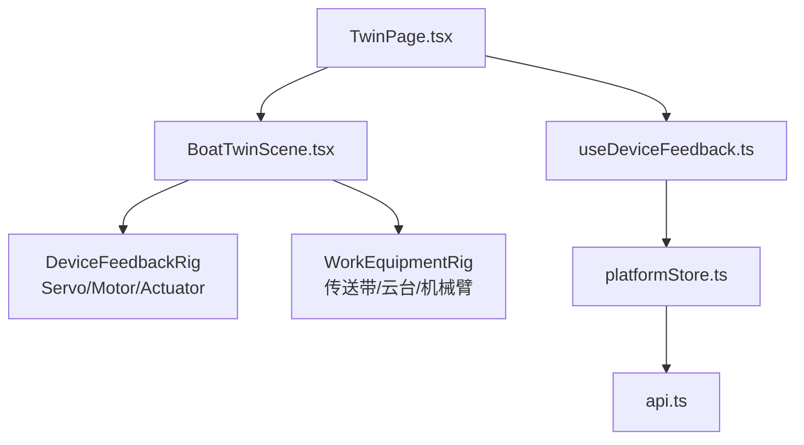
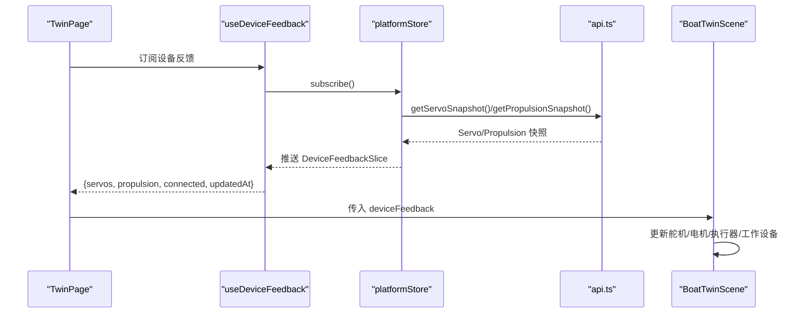
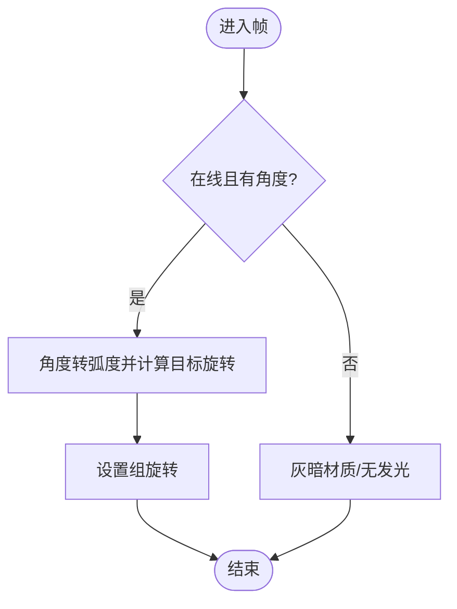
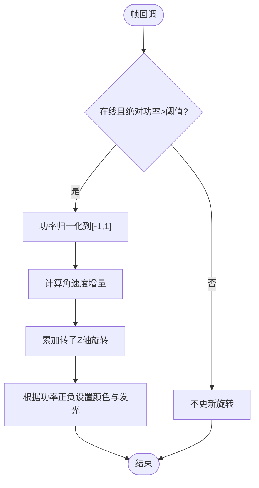
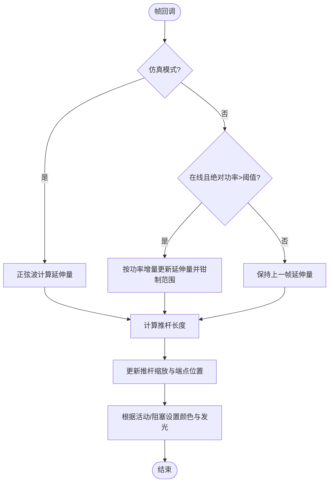
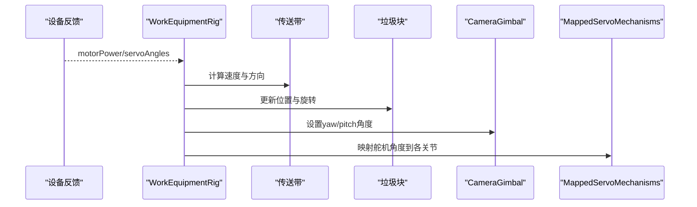
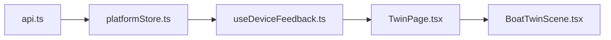

# 设备状态可视化

<cite>
**本文引用的文件**
- [BoatTwinScene.tsx](file://fishery-digital-twin-platform/apps/frontend/src/components/three/BoatTwinScene.tsx)
- [useDeviceFeedback.ts](file://fishery-digital-twin-platform/apps/frontend/src/hooks/useDeviceFeedback.ts)
- [platformStore.ts](file://fishery-digital-twin-platform/apps/frontend/src/lib/platformStore.ts)
- [api.ts](file://fishery-digital-twin-platform/apps/frontend/src/lib/api.ts)
- [TwinPage.tsx](file://fishery-digital-twin-platform/apps/frontend/src/components/dashboard/TwinPage.tsx)
</cite>

## 目录
1. [简介](#简介)
2. [项目结构](#项目结构)
3. [核心组件](#核心组件)
4. [架构总览](#架构总览)
5. [详细组件分析](#详细组件分析)
6. [依赖关系分析](#依赖关系分析)
7. [性能考虑](#性能考虑)
8. [故障排查指南](#故障排查指南)
9. [结论](#结论)
10. [附录：数据绑定与调试清单](#附录数据绑定与调试清单)

## 简介
本文件面向“数字孪生”前端中的设备状态实时可视化，聚焦于3D场景中舵机、推进器、线性执行器与工作设备的动态表现。文档从系统架构出发，逐步深入到各组件的实现细节，包括角度到旋转的映射、功率到转速的映射、伸缩动画与运动平滑、在线状态指示、发光效果等，并提供数据绑定指南、性能优化建议与调试技巧，帮助开发者将后端设备状态正确映射到3D可视化元素。

## 项目结构
该功能位于前端应用中，围绕一个统一的3D场景组件组织：
- 场景入口与装配：BoatTwinScene 负责加载模型、布置相机、渲染水面与网格，并挂载设备反馈与工作设备子树。
- 设备反馈装配：DeviceFeedbackRig 将舵机、电机等反馈数据映射到具体3D部件。
- 工作设备装配：WorkEquipmentRig 包含传送带、垃圾收集模拟、相机云台、机械臂联动等。
- 数据源与订阅：useDeviceFeedback 通过 useSyncExternalStore 订阅 platformStore 的设备反馈切片；platformStore 定时拉取快照并广播更新。
- 页面集成：TwinPage 作为数字孪生页面，注入仿真预览、视角控制与环境开关，并将设备反馈传入场景。

图表来源
- [TwinPage.tsx:88-102](file://fishery-digital-twin-platform/apps/frontend/src/components/dashboard/TwinPage.tsx#L88-L102)
- [BoatTwinScene.tsx:1567-1602](file://fishery-digital-twin-platform/apps/frontend/src/components/three/BoatTwinScene.tsx#L1567-L1602)
- [useDeviceFeedback.ts:8-21](file://fishery-digital-twin-platform/apps/frontend/src/hooks/useDeviceFeedback.ts#L8-L21)
- [platformStore.ts:116-139](file://fishery-digital-twin-platform/apps/frontend/src/lib/platformStore.ts#L116-L139)
- [api.ts:52-72](file://fishery-digital-twin-platform/apps/frontend/src/lib/api.ts#L52-L72)

章节来源
- [TwinPage.tsx:88-102](file://fishery-digital-twin-platform/apps/frontend/src/components/dashboard/TwinPage.tsx#L88-L102)
- [BoatTwinScene.tsx:1567-1602](file://fishery-digital-twin-platform/apps/frontend/src/components/three/BoatTwinScene.tsx#L1567-L1602)
- [useDeviceFeedback.ts:8-21](file://fishery-digital-twin-platform/apps/frontend/src/hooks/useDeviceFeedback.ts#L8-L21)
- [platformStore.ts:116-139](file://fishery-digital-twin-platform/apps/frontend/src/lib/platformStore.ts#L116-L139)
- [api.ts:52-72](file://fishery-digital-twin-platform/apps/frontend/src/lib/api.ts#L52-L72)

## 核心组件
- 舵机角度可视化：ServoFeedbackArm 与 MappedServoArm，将角度转换为绕轴旋转，并通过发光强度与颜色表达在线与活动状态。
- 推进器功率可视化：MotorFeedback，按功率大小与方向驱动转子旋转，并以颜色区分正负功率。
- 线性执行器可视化：EstimatedLinearActuator，根据功率计算推杆长度并进行平滑过渡，同时以颜色表示活动与阻塞状态。
- 工作设备可视化：WorkEquipmentRig 内的传送带动画、垃圾收集模拟、CameraGimbal 云台联动、MappedServoMechanisms 机械臂联动。

章节来源
- [BoatTwinScene.tsx:321-379](file://fishery-digital-twin-platform/apps/frontend/src/components/three/BoatTwinScene.tsx#L321-L379)
- [BoatTwinScene.tsx:512-576](file://fishery-digital-twin-platform/apps/frontend/src/components/three/BoatTwinScene.tsx#L512-L576)
- [BoatTwinScene.tsx:578-666](file://fishery-digital-twin-platform/apps/frontend/src/components/three/BoatTwinScene.tsx#L578-L666)
- [BoatTwinScene.tsx:668-779](file://fishery-digital-twin-platform/apps/frontend/src/components/three/BoatTwinScene.tsx#L668-L779)
- [BoatTwinScene.tsx:381-510](file://fishery-digital-twin-platform/apps/frontend/src/components/three/BoatTwinScene.tsx#L381-L510)

## 架构总览
设备反馈数据流从后端API经平台存储层到达3D场景，最终驱动各部件动画与外观变化。

图表来源
- [useDeviceFeedback.ts:8-21](file://fishery-digital-twin-platform/apps/frontend/src/hooks/useDeviceFeedback.ts#L8-L21)
- [platformStore.ts:116-139](file://fishery-digital-twin-platform/apps/frontend/src/lib/platformStore.ts#L116-L139)
- [api.ts:52-72](file://fishery-digital-twin-platform/apps/frontend/src/lib/api.ts#L52-L72)
- [TwinPage.tsx:88-102](file://fishery-digital-twin-platform/apps/frontend/src/components/dashboard/TwinPage.tsx#L88-L102)
- [BoatTwinScene.tsx:1567-1602](file://fishery-digital-twin-platform/apps/frontend/src/components/three/BoatTwinScene.tsx#L1567-L1602)

## 详细组件分析

### 舵机角度可视化（ServoFeedbackArm / MappedServoArm）
- 角度到旋转：将角度值转换为弧度，并映射为绕Y轴的旋转角，使舵臂指向对应角度。
- 在线状态指示：当在线且角度有效时，使用高亮色与自发光强度提升可见性；否则呈现灰暗态。
- 动态旋转：在真实模式下直接设置目标角度；在仿真模式下使用阻尼函数实现平滑过渡。

图表来源
- [BoatTwinScene.tsx:321-350](file://fishery-digital-twin-platform/apps/frontend/src/components/three/BoatTwinScene.tsx#L321-L350)
- [BoatTwinScene.tsx:617-666](file://fishery-digital-twin-platform/apps/frontend/src/components/three/BoatTwinScene.tsx#L617-L666)

章节来源
- [BoatTwinScene.tsx:321-350](file://fishery-digital-twin-platform/apps/frontend/src/components/three/BoatTwinScene.tsx#L321-L350)
- [BoatTwinScene.tsx:617-666](file://fishery-digital-twin-platform/apps/frontend/src/components/three/BoatTwinScene.tsx#L617-L666)

### 推进器功率可视化（MotorFeedback）
- 功率到转速：将功率归一化到[-1,1]区间后乘以基础速度系数，得到每帧增量角速度。
- 方向控制：功率正负决定旋转方向，用于直观表达前进/后退或左右推力差异。
- 发光与颜色：激活时根据功率正负切换颜色并提高自发光强度；低于阈值时视为静止。

图表来源
- [BoatTwinScene.tsx:352-379](file://fishery-digital-twin-platform/apps/frontend/src/components/three/BoatTwinScene.tsx#L352-L379)

章节来源
- [BoatTwinScene.tsx:352-379](file://fishery-digital-twin-platform/apps/frontend/src/components/three/BoatTwinScene.tsx#L352-L379)

### 线性执行器可视化（EstimatedLinearActuator）
- 伸缩动画：维护内部延伸量，仿真模式用正弦波驱动；真实模式按功率比例逐步调整延伸量。
- 推杆长度计算：基于延伸量计算当前长度，并同步更新推杆缩放与端点位置。
- 状态颜色变化：激活时使用主题色并开启发光；若处于运行时锁止或冷却中，则切换警示色。

图表来源
- [BoatTwinScene.tsx:714-779](file://fishery-digital-twin-platform/apps/frontend/src/components/three/BoatTwinScene.tsx#L714-L779)

章节来源
- [BoatTwinScene.tsx:714-779](file://fishery-digital-twin-platform/apps/frontend/src/components/three/BoatTwinScene.tsx#L714-L779)

### 工作设备可视化（传送带、垃圾收集、云台、机械臂）
- 传送带动画：根据功率计算速度与方向，周期性更新条纹位置与滚筒旋转；垃圾块沿路径移动并附带翻转。
- 垃圾收集模拟：正向功率将漂浮物从船头拉回收集箱，反向则释放；物体高度随相位变化模拟抛起落下。
- 相机云台控制：Yaw/Pitch由舵机角度映射，仿真模式使用阻尼平滑；发光环闪烁提示活动。
- 机械臂联动：多个MappedServoArm按索引映射到不同舵机通道，支持仿真与真实两种驱动方式。

图表来源
- [BoatTwinScene.tsx:381-510](file://fishery-digital-twin-platform/apps/frontend/src/components/three/BoatTwinScene.tsx#L381-L510)
- [BoatTwinScene.tsx:512-576](file://fishery-digital-twin-platform/apps/frontend/src/components/three/BoatTwinScene.tsx#L512-L576)
- [BoatTwinScene.tsx:578-666](file://fishery-digital-twin-platform/apps/frontend/src/components/three/BoatTwinScene.tsx#L578-L666)

章节来源
- [BoatTwinScene.tsx:381-510](file://fishery-digital-twin-platform/apps/frontend/src/components/three/BoatTwinScene.tsx#L381-L510)
- [BoatTwinScene.tsx:512-576](file://fishery-digital-twin-platform/apps/frontend/src/components/three/BoatTwinScene.tsx#L512-L576)
- [BoatTwinScene.tsx:578-666](file://fishery-digital-twin-platform/apps/frontend/src/components/three/BoatTwinScene.tsx#L578-L666)

## 依赖关系分析
- 数据层：platformStore 定时调用 api.ts 获取舵机与推进器快照，合并连接状态与时间戳，并通过稳定切片对象减少重渲染。
- 视图层：useDeviceFeedback 将 store 切片暴露给上层组件；TwinPage 将设备反馈传入 BoatTwinScene。
- 场景层：BoatTwinScene 根据反馈数据驱动各子组件的动画与外观。

图表来源
- [api.ts:52-72](file://fishery-digital-twin-platform/apps/frontend/src/lib/api.ts#L52-L72)
- [platformStore.ts:116-139](file://fishery-digital-twin-platform/apps/frontend/src/lib/platformStore.ts#L116-L139)
- [useDeviceFeedback.ts:8-21](file://fishery-digital-twin-platform/apps/frontend/src/hooks/useDeviceFeedback.ts#L8-L21)
- [TwinPage.tsx:88-102](file://fishery-digital-twin-platform/apps/frontend/src/components/dashboard/TwinPage.tsx#L88-L102)
- [BoatTwinScene.tsx:1567-1602](file://fishery-digital-twin-platform/apps/frontend/src/components/three/BoatTwinScene.tsx#L1567-L1602)

章节来源
- [platformStore.ts:116-139](file://fishery-digital-twin-platform/apps/frontend/src/lib/platformStore.ts#L116-L139)
- [api.ts:52-72](file://fishery-digital-twin-platform/apps/frontend/src/lib/api.ts#L52-L72)
- [useDeviceFeedback.ts:8-21](file://fishery-digital-twin-platform/apps/frontend/src/hooks/useDeviceFeedback.ts#L8-L21)
- [TwinPage.tsx:88-102](file://fishery-digital-twin-platform/apps/frontend/src/components/dashboard/TwinPage.tsx#L88-L102)
- [BoatTwinScene.tsx:1567-1602](file://fishery-digital-twin-platform/apps/frontend/src/components/three/BoatTwinScene.tsx#L1567-L1602)

## 性能考虑
- 帧率控制：场景内提供按需刷新机制，避免每帧强制重绘，降低CPU/GPU压力。
- 节流与阈值：推进器与执行器对低功率进行阈值过滤，减少无效动画与渲染开销。
- 稳定切片：platformStore 使用稳定对象引用，配合 useSyncExternalStore 的浅比较，避免无关组件重渲染。
- 几何与材质复用：尽量复用几何体与材质参数，减少创建销毁频率。
- 可选特性：关闭动态水面、网格或边缘线可显著降低渲染成本。

[本节为通用指导，无需特定文件引用]

## 故障排查指南
- 设备未显示或无动画：检查 online 标志与角度/功率是否有效；确认 useDeviceFeedback 已订阅且 platformStore 已启动定时器。
- 角度异常：核对角度单位转换与基准偏移；确认映射表索引与实际舵机通道一致。
- 推进器不转：检查功率绝对值是否超过阈值；确认方向乘数与物理安装方向匹配。
- 执行器不动：确认功率符号与安装方向；检查运行时锁止与冷却剩余时间是否导致阻塞。
- 数据不同步：查看 feedbackAt 与 feedbackConnected；必要时手动触发 refreshFeedback。

章节来源
- [platformStore.ts:116-139](file://fishery-digital-twin-platform/apps/frontend/src/lib/platformStore.ts#L116-L139)
- [BoatTwinScene.tsx:352-379](file://fishery-digital-twin-platform/apps/frontend/src/components/three/BoatTwinScene.tsx#L352-L379)
- [BoatTwinScene.tsx:714-779](file://fishery-digital-twin-platform/apps/frontend/src/components/three/BoatTwinScene.tsx#L714-L779)

## 结论
本方案通过统一的数据源与稳定的订阅机制，将后端设备状态实时映射到3D场景中的舵机、推进器、线性执行器与工作设备，实现了直观、流畅且高性能的可视化体验。借助角度到旋转、功率到转速、伸缩动画与发光状态的组合，用户可快速掌握设备运行状况。结合性能优化与调试技巧，可在复杂场景下保持稳定帧率与良好交互。

[本节为总结，无需特定文件引用]

## 附录：数据绑定与调试清单
- 数据绑定步骤
  - 在页面中通过 useDeviceFeedback 订阅设备反馈，获取 servos、propulsion、connected、updatedAt。
  - 将设备反馈传入 BoatTwinScene 的 deviceFeedback 属性。
  - 场景内部根据反馈字段映射到各子组件：
    - 舵机：servoAngles[index] 与 servoBoardOnline 分组。
    - 推进器：motorPower 与 motorOnline。
    - 线性执行器：dualPushrodPower、sxtlPower、online 与锁止/冷却状态。
    - 工作设备：motorPower 驱动传送带与云台联动。
- 关键映射参考
  - 舵机角度到旋转：角度转弧度并减去基准角，得到目标旋转。
  - 推进器功率到转速：功率归一化到[-1,1]，乘以速度系数得到角速度增量。
  - 执行器伸缩：功率按比例更新延伸量，计算推杆长度并应用缩放与位移。
- 调试技巧
  - 打开仿真模式观察预期行为，再切换到真实模式对比差异。
  - 打印 feedbackAt 与 feedbackConnected 判断数据链路是否正常。
  - 针对每个部件单独禁用动画，定位问题范围。
  - 调整功率阈值与速度系数，平衡响应性与稳定性。

章节来源
- [useDeviceFeedback.ts:8-21](file://fishery-digital-twin-platform/apps/frontend/src/hooks/useDeviceFeedback.ts#L8-L21)
- [TwinPage.tsx:88-102](file://fishery-digital-twin-platform/apps/frontend/src/components/dashboard/TwinPage.tsx#L88-L102)
- [BoatTwinScene.tsx:275-319](file://fishery-digital-twin-platform/apps/frontend/src/components/three/BoatTwinScene.tsx#L275-L319)
- [BoatTwinScene.tsx:381-510](file://fishery-digital-twin-platform/apps/frontend/src/components/three/BoatTwinScene.tsx#L381-L510)
- [BoatTwinScene.tsx:578-666](file://fishery-digital-twin-platform/apps/frontend/src/components/three/BoatTwinScene.tsx#L578-L666)
- [BoatTwinScene.tsx:668-779](file://fishery-digital-twin-platform/apps/frontend/src/components/three/BoatTwinScene.tsx#L668-L779)