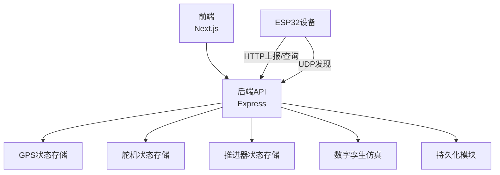
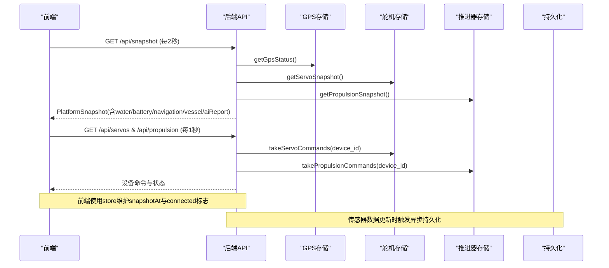
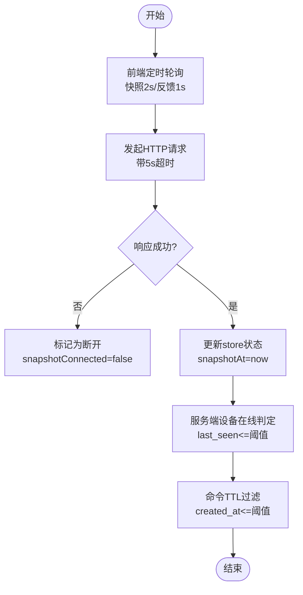
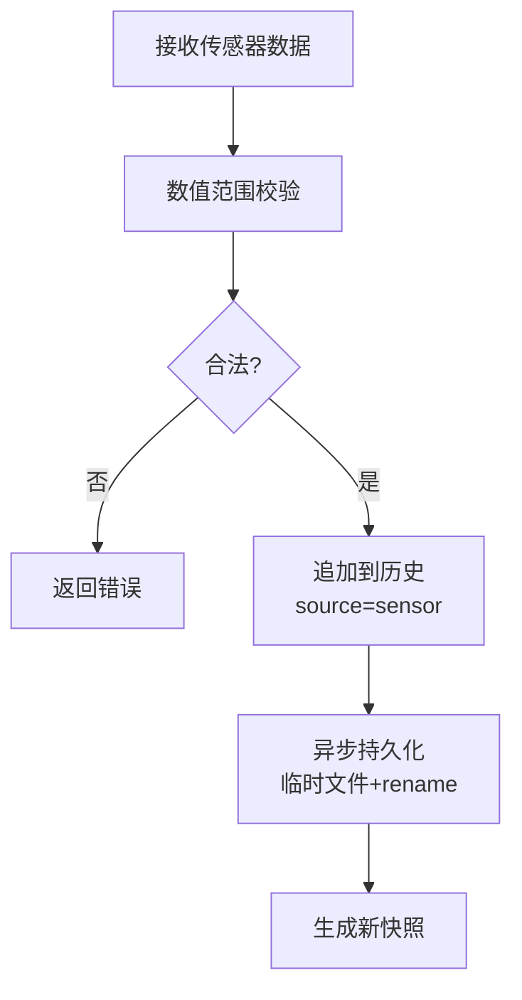
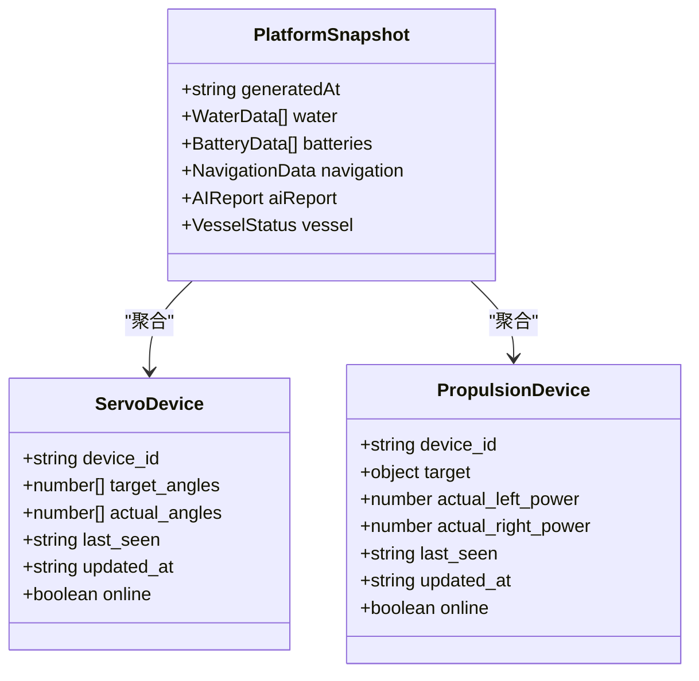
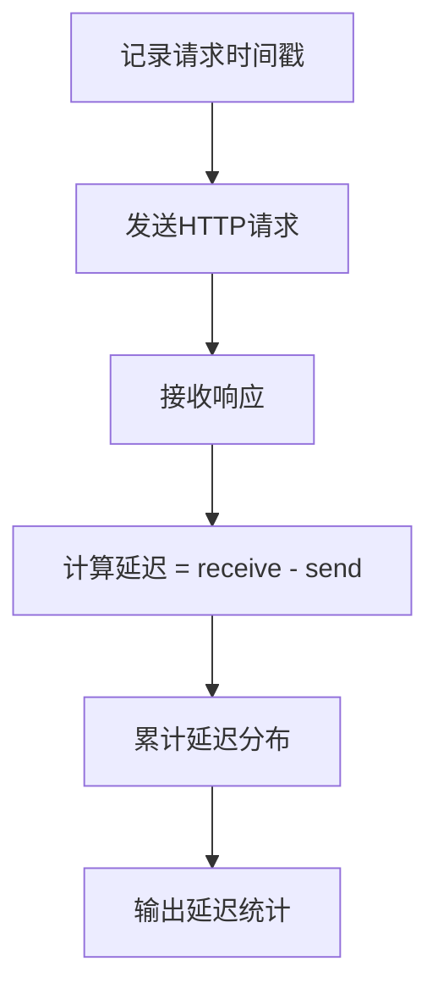
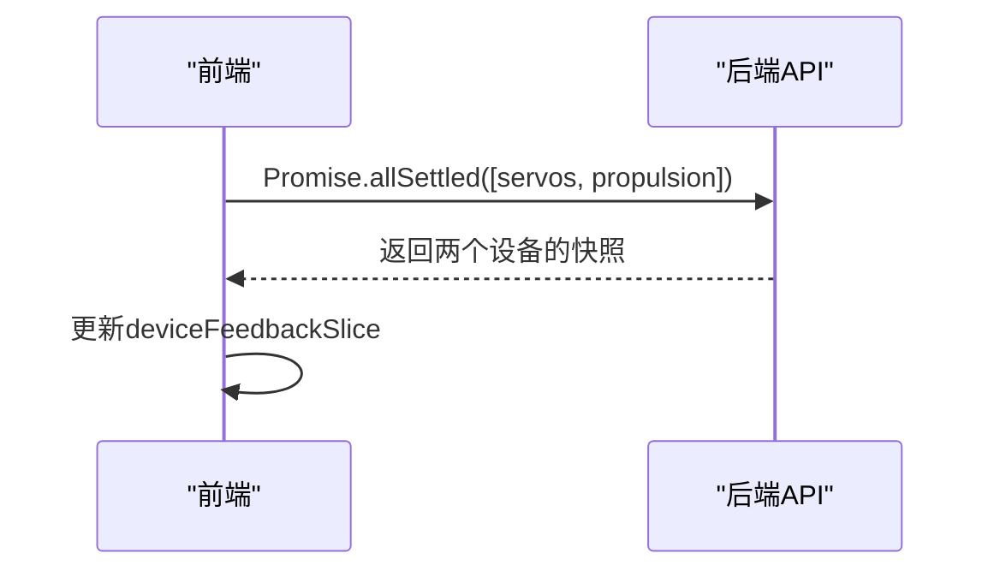
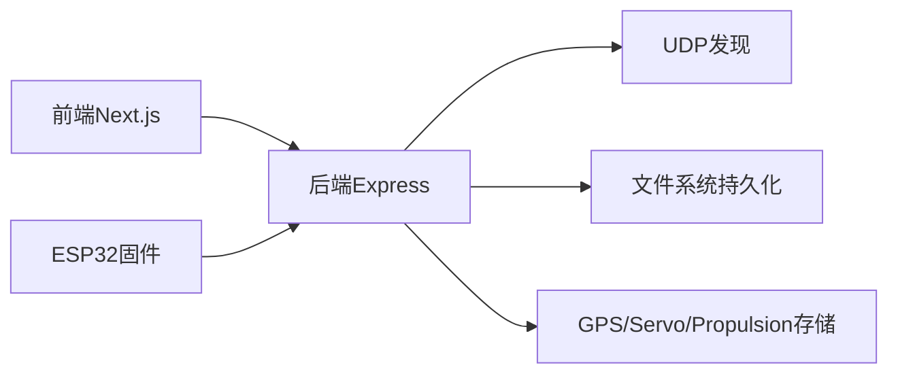

# 同步精度控制

<cite>
**本文引用的文件**
- [index.ts](file://fishery-digital-twin-platform/apps/backend/src/index.ts)
- [persistence.ts](file://fishery-digital-twin-platform/apps/backend/src/persistence.ts)
- [gps-store.ts](file://fishery-digital-twin-platform/apps/backend/src/gps-store.ts)
- [servo-store.ts](file://fishery-digital-twin-platform/apps/backend/src/servo-store.ts)
- [propulsion-store.ts](file://fishery-digital-twin-platform/apps/backend/src/propulsion-store.ts)
- [twin-simulator.ts](file://fishery-digital-twin-platform/apps/backend/src/twin-simulator.ts)
- [api.ts](file://fishery-digital-twin-platform/apps/frontend/src/lib/api.ts)
- [platformStore.ts](file://fishery-digital-twin-platform/apps/frontend/src/lib/platformStore.ts)
- [usePlatformData.ts](file://fishery-digital-twin-platform/apps/frontend/src/hooks/usePlatformData.ts)
- [TwinPage.tsx](file://fishery-digital-twin-platform/apps/frontend/src/components/dashboard/TwinPage.tsx)
- [mock-data.ts](file://fishery-digital-twin-platform/apps/backend/src/mock-data.ts)
</cite>

## 目录
1. [简介](#简介)
2. [项目结构](#项目结构)
3. [核心组件](#核心组件)
4. [架构总览](#架构总览)
5. [详细组件分析](#详细组件分析)
6. [依赖关系分析](#依赖关系分析)
7. [性能考量](#性能考量)
8. [故障排查指南](#故障排查指南)
9. [结论](#结论)
10. [附录：配置与调优](#附录：配置与调优)

## 简介
本文件面向数字孪生系统的“同步精度控制”，聚焦于实时状态同步的质量保证机制。结合仓库中的后端服务、前端轮询与设备状态管理，梳理网络延迟补偿、丢包处理、状态一致性、监控指标与性能优化策略，并给出可操作的配置调优建议，帮助开发者在不同网络与硬件环境下稳定实现高保真同步。

## 项目结构
系统采用前后端分离的 HTTP API 模式：
- 前端通过固定间隔轮询获取平台快照与设备反馈，使用 React store 集中管理状态，并在 UI 中展示。
- 后端提供统一的状态聚合接口（水质、电池、导航、AI 报告、设备状态等），并通过持久化模块落盘。
- 设备侧（ESP32）通过 UDP 发现后端并通过 HTTP 上报状态与控制命令；后端对命令进行 TTL 过滤与队列管理。

**图表来源**
- [index.ts:56-110](file://fishery-digital-twin-platform/apps/backend/src/index.ts#L56-L110)
- [platformStore.ts:20-21](file://fishery-digital-twin-platform/apps/frontend/src/lib/platformStore.ts#L20-L21)
- [api.ts:6-24](file://fishery-digital-twin-platform/apps/frontend/src/lib/api.ts#L6-L24)

**章节来源**
- [index.ts:56-110](file://fishery-digital-twin-platform/apps/backend/src/index.ts#L56-L110)
- [platformStore.ts:20-21](file://fishery-digital-twin-platform/apps/frontend/src/lib/platformStore.ts#L20-L21)
- [api.ts:6-24](file://fishery-digital-twin-platform/apps/frontend/src/lib/api.ts#L6-L24)

## 核心组件
- 前端轮询与状态管理：固定周期拉取快照与设备反馈，维护连接状态与更新时间戳，避免重复请求。
- 后端状态聚合：整合水质历史、电池、导航、AI 报告与设备在线状态，生成平台快照。
- 设备状态存储：GPS、舵机、推进器各自维护设备在线判定、目标与实际值、命令队列与 TTL。
- 持久化：异步合并写入 JSON 文件，保障重启后数据不丢失。
- 数字孪生仿真：基于当前快照与设备反馈计算航线预演、故障推演与疲劳损耗。

**章节来源**
- [platformStore.ts:20-21](file://fishery-digital-twin-platform/apps/frontend/src/lib/platformStore.ts#L20-L21)
- [index.ts:247-262](file://fishery-digital-twin-platform/apps/backend/src/index.ts#L247-L262)
- [gps-store.ts:40-53](file://fishery-digital-twin-platform/apps/backend/src/gps-store.ts#L40-L53)
- [servo-store.ts:43-58](file://fishery-digital-twin-platform/apps/backend/src/servo-store.ts#L43-L58)
- [propulsion-store.ts:82-147](file://fishery-digital-twin-platform/apps/backend/src/propulsion-store.ts#L82-L147)
- [persistence.ts:17-59](file://fishery-digital-twin-platform/apps/backend/src/persistence.ts#L17-L59)
- [twin-simulator.ts:74-253](file://fishery-digital-twin-platform/apps/backend/src/twin-simulator.ts#L74-L253)

## 架构总览
下图展示了从前端到后端再到设备状态的完整同步链路，以及关键的时间控制点（轮询间隔、命令 TTL、在线超时）。

**图表来源**
- [platformStore.ts:98-139](file://fishery-digital-twin-platform/apps/frontend/src/lib/platformStore.ts#L98-L139)
- [index.ts:322-346](file://fishery-digital-twin-platform/apps/backend/src/index.ts#L322-L346)
- [servo-store.ts:175-183](file://fishery-digital-twin-platform/apps/backend/src/servo-store.ts#L175-L183)
- [propulsion-store.ts:310-318](file://fishery-digital-twin-platform/apps/backend/src/propulsion-store.ts#L310-L318)
- [persistence.ts:51-59](file://fishery-digital-twin-platform/apps/backend/src/persistence.ts#L51-L59)

## 详细组件分析

### 网络延迟补偿与自适应调整
- 前端轮询间隔：快照每 2 秒、设备反馈每 1 秒，形成稳定的时间基线，降低瞬时抖动对 UI 的影响。
- 请求超时：默认 fetch 超时 5 秒，避免长时间阻塞导致界面卡顿。
- 连接状态标记：store 维护 snapshotConnected 与 feedbackConnected，用于在断网或失败时降级显示。
- 服务端在线判定：GPS、舵机、推进器均基于 last_seen 时间戳判断设备是否在线，超过阈值视为离线。
- 命令 TTL：舵机与推进器命令队列按 created_at 过滤，仅保留有效窗口内的命令，防止过期指令造成不一致。

**图表来源**
- [platformStore.ts:20-21](file://fishery-digital-twin-platform/apps/frontend/src/lib/platformStore.ts#L20-L21)
- [api.ts:6-24](file://fishery-digital-twin-platform/apps/frontend/src/lib/api.ts#L6-L24)
- [gps-store.ts:40-53](file://fishery-digital-twin-platform/apps/backend/src/gps-store.ts#L40-L53)
- [servo-store.ts:175-183](file://fishery-digital-twin-platform/apps/backend/src/servo-store.ts#L175-L183)
- [propulsion-store.ts:310-318](file://fishery-digital-twin-platform/apps/backend/src/propulsion-store.ts#L310-L318)

**章节来源**
- [platformStore.ts:20-21](file://fishery-digital-twin-platform/apps/frontend/src/lib/platformStore.ts#L20-L21)
- [api.ts:6-24](file://fishery-digital-twin-platform/apps/frontend/src/lib/api.ts#L6-L24)
- [gps-store.ts:40-53](file://fishery-digital-twin-platform/apps/backend/src/gps-store.ts#L40-L53)
- [servo-store.ts:175-183](file://fishery-digital-twin-platform/apps/backend/src/servo-store.ts#L175-L183)
- [propulsion-store.ts:310-318](file://fishery-digital-twin-platform/apps/backend/src/propulsion-store.ts#L310-L318)

### 数据丢包处理与完整性校验
- 幂等轮询：设备命令以短 TTL 队列形式存在，前端多次 GET 可确保至少一次成功消费，缓解丢包影响。
- 范围校验：后端对输入数值进行严格边界检查，防止异常值污染状态。
- 原子持久化：写入临时文件再 rename，减少损坏风险。
- 来源标记：水质数据携带 source 字段（sensor/demo/fallback），便于区分真实与演示数据，避免误判。

**图表来源**
- [index.ts:159-176](file://fishery-digital-twin-platform/apps/backend/src/index.ts#L159-L176)
- [index.ts:367-430](file://fishery-digital-twin-platform/apps/backend/src/index.ts#L367-L430)
- [persistence.ts:17-29](file://fishery-digital-twin-platform/apps/backend/src/persistence.ts#L17-L29)
- [index.ts:189-195](file://fishery-digital-twin-platform/apps/backend/src/index.ts#L189-L195)

**章节来源**
- [index.ts:159-176](file://fishery-digital-twin-platform/apps/backend/src/index.ts#L159-L176)
- [index.ts:367-430](file://fishery-digital-twin-platform/apps/backend/src/index.ts#L367-L430)
- [persistence.ts:17-29](file://fishery-digital-twin-platform/apps/backend/src/persistence.ts#L17-L29)
- [index.ts:189-195](file://fishery-digital-twin-platform/apps/backend/src/index.ts#L189-L195)

### 状态一致性与最终一致性协议
- 版本与时间戳：每个快照包含 generatedAt，设备状态包含 last_seen/updated_at，便于客户端判断新鲜度。
- 冲突解决：当设备离线时拒绝活动控制命令，避免并发写冲突；命令队列按 TTL 清理，保证只执行最近有效指令。
- 最终一致性：通过轮询与 TTL 机制，客户端最终会收到最新状态与未消费命令，达到弱一致。

**图表来源**
- [index.ts:247-262](file://fishery-digital-twin-platform/apps/backend/src/index.ts#L247-L262)
- [servo-store.ts:24-58](file://fishery-digital-twin-platform/apps/backend/src/servo-store.ts#L24-L58)
- [propulsion-store.ts:97-147](file://fishery-digital-twin-platform/apps/backend/src/propulsion-store.ts#L97-L147)

**章节来源**
- [index.ts:247-262](file://fishery-digital-twin-platform/apps/backend/src/index.ts#L247-L262)
- [servo-store.ts:24-58](file://fishery-digital-twin-platform/apps/backend/src/servo-store.ts#L24-L58)
- [propulsion-store.ts:97-147](file://fishery-digital-twin-platform/apps/backend/src/propulsion-store.ts#L97-L147)

### 同步精度监控指标
- 延迟统计：可通过 snapshotAt 与反馈 At 计算端到端延迟；前端可在日志中记录请求时间与响应时间。
- 丢包率分析：统计命令队列消费次数与下发次数比例，评估丢包情况。
- 质量评估算法：AI 报告与数字孪生结果中包含置信度与风险等级，可作为整体质量参考。

**图表来源**
- [platformStore.ts:71-96](file://fishery-digital-twin-platform/apps/frontend/src/lib/platformStore.ts#L71-L96)
- [api.ts:6-24](file://fishery-digital-twin-platform/apps/frontend/src/lib/api.ts#L6-L24)
- [twin-simulator.ts:181-189](file://fishery-digital-twin-platform/apps/backend/src/twin-simulator.ts#L181-L189)

**章节来源**
- [platformStore.ts:71-96](file://fishery-digital-twin-platform/apps/frontend/src/lib/platformStore.ts#L71-L96)
- [api.ts:6-24](file://fishery-digital-twin-platform/apps/frontend/src/lib/api.ts#L6-L24)
- [twin-simulator.ts:181-189](file://fishery-digital-twin-platform/apps/backend/src/twin-simulator.ts#L181-L189)

### 性能优化策略
- 批量传输：前端并行获取舵机与推进器状态，减少往返次数。
- 增量更新：后端仅返回必要字段，前端 store 使用不可变切片，避免不必要重渲染。
- 缓存机制：前端使用 no-store 强制刷新，但通过 store 本地缓存最新快照；后端持久化采用异步合并写入，降低磁盘压力。

**图表来源**
- [platformStore.ts:116-130](file://fishery-digital-twin-platform/apps/frontend/src/lib/platformStore.ts#L116-L130)
- [api.ts:52-72](file://fishery-digital-twin-platform/apps/frontend/src/lib/api.ts#L52-L72)

**章节来源**
- [platformStore.ts:116-130](file://fishery-digital-twin-platform/apps/frontend/src/lib/platformStore.ts#L116-L130)
- [api.ts:52-72](file://fishery-digital-twin-platform/apps/frontend/src/lib/api.ts#L52-L72)

## 依赖关系分析
- 前端依赖：Next.js、React、recharts；通过 api.ts 调用后端接口；platformStore.ts 统一管理状态。
- 后端依赖：Express、Node dgram（UDP 发现）、fs（持久化）；各 store 模块独立管理设备状态。
- 固件依赖：ESP32 通过 WiFi 连接，使用 UDP 发现后端，HTTP 上报状态与查询命令。

**图表来源**
- [index.ts:271-318](file://fishery-digital-twin-platform/apps/backend/src/index.ts#L271-L318)
- [persistence.ts:1-14](file://fishery-digital-twin-platform/apps/backend/src/persistence.ts#L1-L14)
- [api.ts:1-24](file://fishery-digital-twin-platform/apps/frontend/src/lib/api.ts#L1-L24)

**章节来源**
- [index.ts:271-318](file://fishery-digital-twin-platform/apps/backend/src/index.ts#L271-L318)
- [persistence.ts:1-14](file://fishery-digital-twin-platform/apps/backend/src/persistence.ts#L1-L14)
- [api.ts:1-24](file://fishery-digital-twin-platform/apps/frontend/src/lib/api.ts#L1-L24)

## 性能考量
- 轮询频率：2 秒快照与 1 秒反馈在大多数局域网环境足够平衡实时性与带宽占用。
- 超时设置：5 秒超时避免长尾请求拖慢界面。
- 持久化合并：250ms 合并写入减少频繁 I/O。
- 命令 TTL：2.5 秒窗口确保命令不过期且不被重复执行。
- 在线判定：10 秒内无心跳视为离线，快速反映设备状态变化。

[本节为通用性能讨论，不直接分析具体代码行]

## 故障排查指南
- 前端断连：检查 snapshotConnected 与 feedbackConnected 标志；确认 API_BASE 与令牌配置。
- 设备离线：查看 last_seen 是否超过阈值；确认 ESP32 是否能发现后端并建立 TCP 连接。
- 命令未生效：检查命令是否在 TTL 窗口内；确认设备处于在线状态。
- 数据异常：检查输入范围校验；确认 source 字段是否为 sensor。

**章节来源**
- [platformStore.ts:71-96](file://fishery-digital-twin-platform/apps/frontend/src/lib/platformStore.ts#L71-L96)
- [gps-store.ts:40-53](file://fishery-digital-twin-platform/apps/backend/src/gps-store.ts#L40-L53)
- [servo-store.ts:175-183](file://fishery-digital-twin-platform/apps/backend/src/servo-store.ts#L175-L183)
- [propulsion-store.ts:310-318](file://fishery-digital-twin-platform/apps/backend/src/propulsion-store.ts#L310-L318)
- [index.ts:159-176](file://fishery-digital-twin-platform/apps/backend/src/index.ts#L159-L176)

## 结论
该数字孪生系统通过前端固定轮询、后端状态聚合与设备 TTL 机制，实现了较为稳健的实时同步。虽然未实现复杂的延迟估计与自适应算法，但通过合理的超时、在线判定与命令 TTL，已能在一般局域网环境下保证基本的一致性与可用性。若需进一步提升精度，可在前端增加延迟测量与动态调整轮询频率，在后端引入更精细的命令去重与冲突解决策略。

[本节为总结性内容，不直接分析具体代码行]

## 附录：配置与调优
- 前端轮询间隔：修改 platformStore.ts 中的 SNAPSHOT_INTERVAL 与 FEEDBACK_INTERVAL，根据网络状况调整。
- 请求超时：在 api.ts 中调整 AbortSignal.timeout，平衡可靠性与响应速度。
- 设备在线阈值：在 gps-store.ts、servo-store.ts、propulsion-store.ts 中调整 isFresh 阈值，适应不同硬件心跳频率。
- 命令 TTL：在 servo-store.ts 与 propulsion-store.ts 中调整 COMMAND_TTL_MS，匹配网络延迟。
- 持久化合并：在 persistence.ts 中调整 schedulePersistState 的定时器间隔，平衡数据安全性与 I/O 压力。
- 环境变量：通过 index.ts 读取的环境变量（如 UISYS_API_TOKEN、CORS_ORIGIN、UISYS_SENSOR_FRESHNESS_MS）控制安全与数据新鲜度。

**章节来源**
- [platformStore.ts:20-21](file://fishery-digital-twin-platform/apps/frontend/src/lib/platformStore.ts#L20-L21)
- [api.ts:6-24](file://fishery-digital-twin-platform/apps/frontend/src/lib/api.ts#L6-L24)
- [gps-store.ts:40-53](file://fishery-digital-twin-platform/apps/backend/src/gps-store.ts#L40-L53)
- [servo-store.ts:175-183](file://fishery-digital-twin-platform/apps/backend/src/servo-store.ts#L175-L183)
- [propulsion-store.ts:310-318](file://fishery-digital-twin-platform/apps/backend/src/propulsion-store.ts#L310-L318)
- [persistence.ts:51-59](file://fishery-digital-twin-platform/apps/backend/src/persistence.ts#L51-L59)
- [index.ts:57-76](file://fishery-digital-twin-platform/apps/backend/src/index.ts#L57-L76)