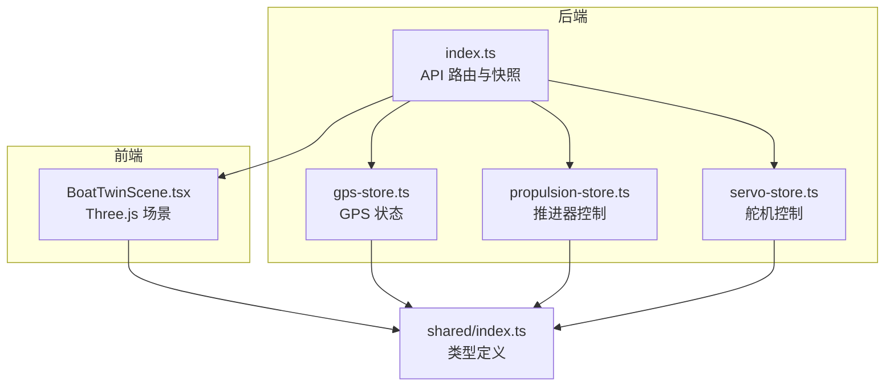
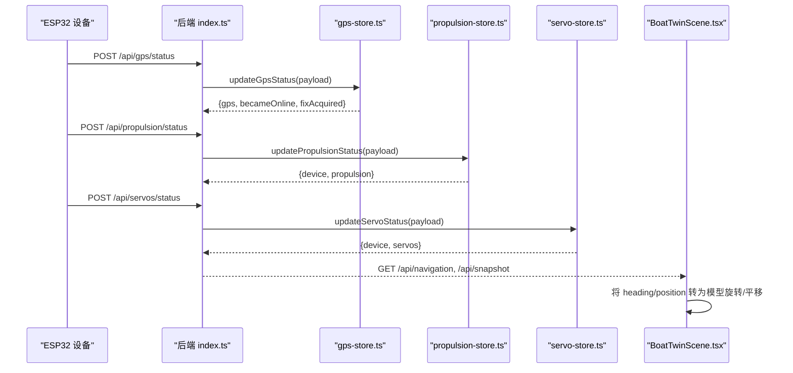
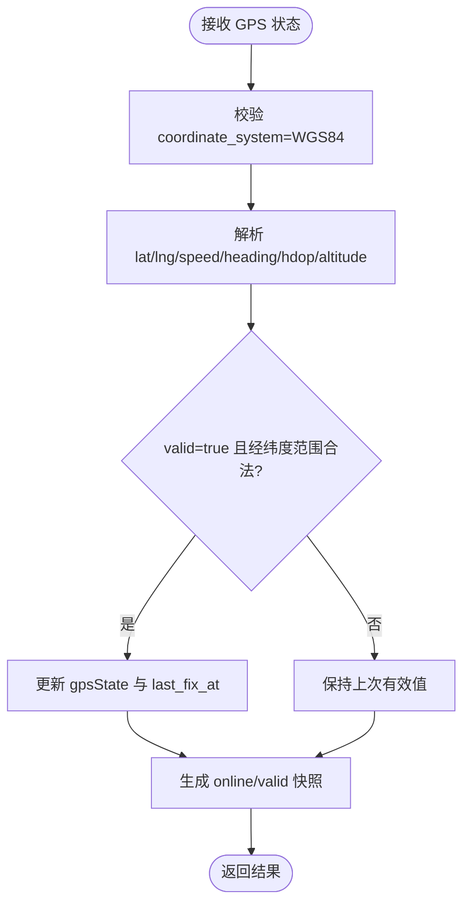
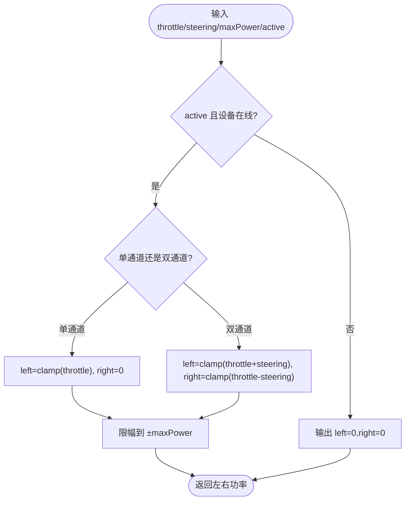
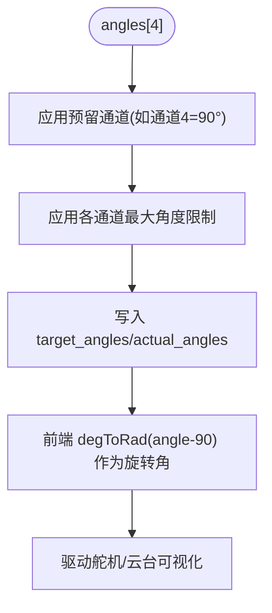
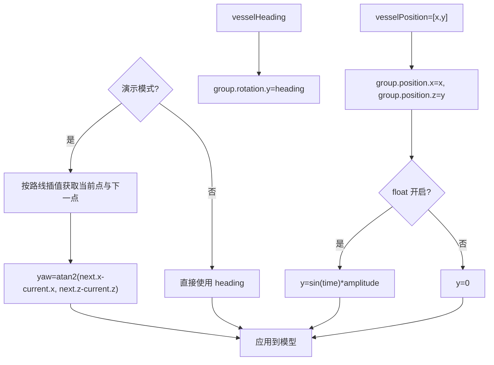
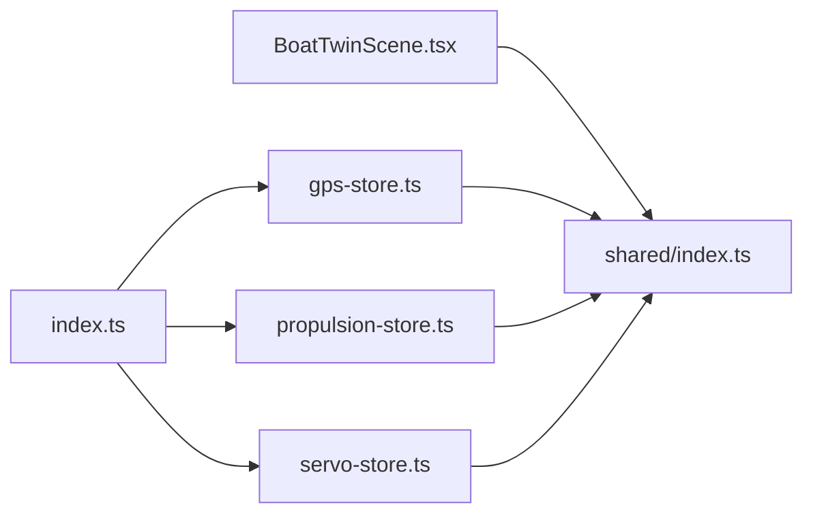

# 坐标系转换算法

<cite>
**本文引用的文件**
- [apps/backend/src/index.ts](file://fishery-digital-twin-platform/apps/backend/src/index.ts)
- [apps/backend/src/gps-store.ts](file://fishery-digital-twin-platform/apps/backend/src/gps-store.ts)
- [apps/backend/src/propulsion-store.ts](file://fishery-digital-twin-platform/apps/backend/src/propulsion-store.ts)
- [apps/backend/src/servo-store.ts](file://fishery-digital-twin-platform/apps/backend/src/servo-store.ts)
- [apps/frontend/src/components/three/BoatTwinScene.tsx](file://fishery-digital-twin-platform/apps/frontend/src/components/three/BoatTwinScene.tsx)
- [packages/shared/src/index.ts](file://fishery-digital-twin-platform/packages/shared/src/index.ts)
</cite>

## 目录
1. [简介](#简介)
2. [项目结构](#项目结构)
3. [核心组件](#核心组件)
4. [架构总览](#架构总览)
5. [详细组件分析](#详细组件分析)
6. [依赖关系分析](#依赖关系分析)
7. [性能与数值稳定性](#性能与数值稳定性)
8. [故障排查指南](#故障排查指南)
9. [结论](#结论)
10. [附录：坐标变换实现要点与示例路径](#附录坐标变换实现要点与示例路径)

## 简介
本文件围绕船舶数字孪生平台中的多坐标系数学转换机制，系统说明世界坐标系、船体坐标系与传感器坐标系之间的关系，并给出从传感器数据到世界坐标的映射流程。重点覆盖：
- GPS位置（WGS84经纬度、航向）如何进入平台导航状态；
- 推进器输出（左右推力百分比）在船体坐标系下的合成与限制；
- 舵机角度（0–180°）在三维可视化中的旋转表达；
- 前端 Three.js 中如何将 heading、position 转换为模型姿态与位移；
- 角度单位、坐标系原点、变换顺序等工程实践要点。

本项目未直接实现四元数与欧拉角之间的通用数学库函数，但广泛使用弧度/角度转换与局部旋转组合，满足数字孪生可视化的需求。

## 项目结构
后端提供设备状态与仿真接口，前端负责三维场景渲染与交互。关键路径如下：
- 后端入口聚合 GPS、舵机、推进器、水质、AI 等子系统，暴露 REST API；
- GPS 存储模块维护 WGS84 坐标、有效性与时间戳；
- 推进器模块将油门与转向混合为左右通道功率；
- 舵机模块管理目标与实际角度，并应用预留通道与角度上限；
- 前端 Three.js 场景根据传入的 vesselHeading 与 vesselPosition 更新模型姿态与位置。

图表来源
- [apps/backend/src/index.ts:197-222](file://fishery-digital-twin-platform/apps/backend/src/index.ts#L197-L222)
- [apps/backend/src/gps-store.ts:8-23](file://fishery-digital-twin-platform/apps/backend/src/gps-store.ts#L8-L23)
- [apps/backend/src/propulsion-store.ts:89-95](file://fishery-digital-twin-platform/apps/backend/src/propulsion-store.ts#L89-L95)
- [apps/backend/src/servo-store.ts:24-34](file://fishery-digital-twin-platform/apps/backend/src/servo-store.ts#L24-L34)
- [apps/frontend/src/components/three/BoatTwinScene.tsx:153-246](file://fishery-digital-twin-platform/apps/frontend/src/components/three/BoatTwinScene.tsx#L153-L246)
- [packages/shared/src/index.ts:35-63](file://fishery-digital-twin-platform/packages/shared/src/index.ts#L35-L63)

章节来源
- [apps/backend/src/index.ts:197-222](file://fishery-digital-twin-platform/apps/backend/src/index.ts#L197-L222)
- [apps/backend/src/gps-store.ts:8-23](file://fishery-digital-twin-platform/apps/backend/src/gps-store.ts#L8-L23)
- [apps/backend/src/propulsion-store.ts:89-95](file://fishery-digital-twin-platform/apps/backend/src/propulsion-store.ts#L89-L95)
- [apps/backend/src/servo-store.ts:24-34](file://fishery-digital-twin-platform/apps/backend/src/servo-store.ts#L24-L34)
- [apps/frontend/src/components/three/BoatTwinScene.tsx:153-246](file://fishery-digital-twin-platform/apps/frontend/src/components/three/BoatTwinScene.tsx#L153-L246)
- [packages/shared/src/index.ts:35-63](file://fishery-digital-twin-platform/packages/shared/src/index.ts#L35-L63)

## 核心组件
- GPS 状态管理：维护 WGS84 坐标、卫星数、HDOP、高度、速度、航向、有效性及时间戳；仅接受 WGS84 坐标系。
- 推进器控制：将油门与转向混合为左右通道功率，支持单通道或双通道模式，并进行限幅与安全检查。
- 舵机控制：管理四通道目标与实际角度，应用预留通道与最大角度限制。
- 三维场景：基于 Three.js，将 vesselHeading 与 vesselPosition 映射为模型的旋转与平移，并在演示模式下计算沿路线的姿态。

章节来源
- [apps/backend/src/gps-store.ts:59-102](file://fishery-digital-twin-platform/apps/backend/src/gps-store.ts#L59-L102)
- [apps/backend/src/propulsion-store.ts:166-231](file://fishery-digital-twin-platform/apps/backend/src/propulsion-store.ts#L166-L231)
- [apps/backend/src/servo-store.ts:106-153](file://fishery-digital-twin-platform/apps/backend/src/servo-store.ts#L106-L153)
- [apps/frontend/src/components/three/BoatTwinScene.tsx:153-246](file://fishery-digital-twin-platform/apps/frontend/src/components/three/BoatTwinScene.tsx#L153-L246)

## 架构总览
下图展示传感器数据到世界坐标的端到端流程：ESP32 上报 GPS/舵机/推进器状态至后端，后端聚合为平台快照，前端读取后驱动三维模型姿态与位置。

图表来源
- [apps/backend/src/index.ts:348-365](file://fishery-digital-twin-platform/apps/backend/src/index.ts#L348-L365)
- [apps/backend/src/index.ts:475-538](file://fishery-digital-twin-platform/apps/backend/src/index.ts#L475-L538)
- [apps/backend/src/gps-store.ts:59-102](file://fishery-digital-twin-platform/apps/backend/src/gps-store.ts#L59-L102)
- [apps/backend/src/propulsion-store.ts:233-308](file://fishery-digital-twin-platform/apps/backend/src/propulsion-store.ts#L233-L308)
- [apps/backend/src/servo-store.ts:155-173](file://fishery-digital-twin-platform/apps/backend/src/servo-store.ts#L155-L173)
- [apps/frontend/src/components/three/BoatTwinScene.tsx:153-246](file://fishery-digital-twin-platform/apps/frontend/src/components/three/BoatTwinScene.tsx#L153-L246)

## 详细组件分析

### GPS 与世界坐标映射
- 坐标系约定：GPS 数据采用 WGS84 坐标系，后端强制校验 coordinate_system 必须为 WGS84。
- 字段含义：lat/lng 为经纬度；heading_deg 为航向（度）；speed_mps 为速度；altitude_m 为海拔；hdop 为水平精度因子；valid 表示定位是否有效。
- 导航快照：当 GPS 在线且有效时，currentNavigation 使用 GPS 的 lat/lng、speed、heading 构建导航数据，否则回退到模拟数据。

图表来源
- [apps/backend/src/gps-store.ts:59-102](file://fishery-digital-twin-platform/apps/backend/src/gps-store.ts#L59-L102)

章节来源
- [apps/backend/src/gps-store.ts:8-23](file://fishery-digital-twin-platform/apps/backend/src/gps-store.ts#L8-L23)
- [apps/backend/src/gps-store.ts:59-102](file://fishery-digital-twin-platform/apps/backend/src/gps-store.ts#L59-L102)
- [apps/backend/src/index.ts:197-222](file://fishery-digital-twin-platform/apps/backend/src/index.ts#L197-L222)
- [packages/shared/src/index.ts:35-63](file://fishery-digital-twin-platform/packages/shared/src/index.ts#L35-L63)

### 推进器输出与船体坐标系
- 混合逻辑：mixPropulsion 将油门与转向混合为左右通道功率，支持限幅到 maxPower。
- 模式选择：WEB 模式下若设备离线则拒绝激活命令；单通道设备仅左通道生效；双通道可分别设置 left_power/right_power。
- 安全与限幅：所有功率值被限制在 [-maxPower, maxPower]，避免超调。

图表来源
- [apps/backend/src/propulsion-store.ts:89-95](file://fishery-digital-twin-platform/apps/backend/src/propulsion-store.ts#L89-L95)
- [apps/backend/src/propulsion-store.ts:166-231](file://fishery-digital-twin-platform/apps/backend/src/propulsion-store.ts#L166-L231)

章节来源
- [apps/backend/src/propulsion-store.ts:89-95](file://fishery-digital-twin-platform/apps/backend/src/propulsion-store.ts#L89-L95)
- [apps/backend/src/propulsion-store.ts:166-231](file://fishery-digital-twin-platform/apps/backend/src/propulsion-store.ts#L166-L231)
- [apps/backend/src/propulsion-store.ts:233-308](file://fishery-digital-twin-platform/apps/backend/src/propulsion-store.ts#L233-L308)

### 舵机角度与可视化旋转
- 角度范围：每通道角度 0–180°，默认中心 90°；部分通道预留（如第 4 通道固定 90°），并应用最大角度限制。
- 可视化映射：前端将角度转换为弧度，并以 90° 为中心进行偏转，用于驱动相机云台或机械臂的旋转。
- 反馈链路：实际角度由设备上报，前端根据 online 与 angle 决定显示颜色与动画。

图表来源
- [apps/backend/src/servo-store.ts:24-34](file://fishery-digital-twin-platform/apps/backend/src/servo-store.ts#L24-L34)
- [apps/backend/src/servo-store.ts:75-87](file://fishery-digital-twin-platform/apps/backend/src/servo-store.ts#L75-L87)
- [apps/backend/src/servo-store.ts:106-153](file://fishery-digital-twin-platform/apps/backend/src/servo-store.ts#L106-L153)
- [apps/frontend/src/components/three/BoatTwinScene.tsx:321-349](file://fishery-digital-twin-platform/apps/frontend/src/components/three/BoatTwinScene.tsx#L321-L349)
- [apps/frontend/src/components/three/BoatTwinScene.tsx:512-575](file://fishery-digital-twin-platform/apps/frontend/src/components/three/BoatTwinScene.tsx#L512-L575)

章节来源
- [apps/backend/src/servo-store.ts:24-34](file://fishery-digital-twin-platform/apps/backend/src/servo-store.ts#L24-L34)
- [apps/backend/src/servo-store.ts:75-87](file://fishery-digital-twin-platform/apps/backend/src/servo-store.ts#L75-L87)
- [apps/backend/src/servo-store.ts:106-153](file://fishery-digital-twin-platform/apps/backend/src/servo-store.ts#L106-L153)
- [apps/frontend/src/components/three/BoatTwinScene.tsx:321-349](file://fishery-digital-twin-platform/apps/frontend/src/components/three/BoatTwinScene.tsx#L321-L349)
- [apps/frontend/src/components/three/BoatTwinScene.tsx:512-575](file://fishery-digital-twin-platform/apps/frontend/src/components/three/BoatTwinScene.tsx#L512-L575)

### 三维场景中的姿态与位置
- 姿态：vesselHeading 直接赋给模型的 yaw 旋转（绕 Y 轴）。
- 位置：vesselPosition[x,y] 映射到模型 position.x 与 position.z；y 方向可选浮动。
- 演示模式：按预设路线插值计算当前位置与下一点方向，用 atan2 计算 yaw。

图表来源
- [apps/frontend/src/components/three/BoatTwinScene.tsx:153-246](file://fishery-digital-twin-platform/apps/frontend/src/components/three/BoatTwinScene.tsx#L153-L246)
- [apps/frontend/src/components/three/BoatTwinScene.tsx:1416-1429](file://fishery-digital-twin-platform/apps/frontend/src/components/three/BoatTwinScene.tsx#L1416-L1429)

章节来源
- [apps/frontend/src/components/three/BoatTwinScene.tsx:153-246](file://fishery-digital-twin-platform/apps/frontend/src/components/three/BoatTwinScene.tsx#L153-L246)
- [apps/frontend/src/components/three/BoatTwinScene.tsx:1416-1429](file://fishery-digital-twin-platform/apps/frontend/src/components/three/BoatTwinScene.tsx#L1416-L1429)

## 依赖关系分析
- 后端 index.ts 依赖 gps-store、propulsion-store、servo-store，统一对外提供导航与设备状态。
- 前端 BoatTwinScene.tsx 依赖 shared 类型定义，确保前后端数据结构一致。
- 设备固件通过 HTTP 上报 GPS/舵机/推进器状态，后端持久化并供前端消费。

图表来源
- [apps/backend/src/index.ts:21-44](file://fishery-digital-twin-platform/apps/backend/src/index.ts#L21-L44)
- [packages/shared/src/index.ts:35-63](file://fishery-digital-twin-platform/packages/shared/src/index.ts#L35-L63)

章节来源
- [apps/backend/src/index.ts:21-44](file://fishery-digital-twin-platform/apps/backend/src/index.ts#L21-L44)
- [packages/shared/src/index.ts:35-63](file://fishery-digital-twin-platform/packages/shared/src/index.ts#L35-L63)

## 性能与数值稳定性
- 限幅与舍入：推进器与舵机均对输入进行限幅与取整，避免数值溢出与抖动。
- 新鲜度判断：GPS、舵机、推进器均基于 last_seen 时间戳判断在线性，防止陈旧数据影响控制。
- 前端动画平滑：使用阻尼与插值减少突变，提升视觉稳定性。

章节来源
- [apps/backend/src/propulsion-store.ts:37-63](file://fishery-digital-twin-platform/apps/backend/src/propulsion-store.ts#L37-L63)
- [apps/backend/src/servo-store.ts:43-48](file://fishery-digital-twin-platform/apps/backend/src/servo-store.ts#L43-L48)
- [apps/backend/src/gps-store.ts:40-44](file://fishery-digital-twin-platform/apps/backend/src/gps-store.ts#L40-L44)
- [apps/frontend/src/components/three/BoatTwinScene.tsx:529-544](file://fishery-digital-twin-platform/apps/frontend/src/components/three/BoatTwinScene.tsx#L529-L544)

## 故障排查指南
- GPS 无效：检查 coordinate_system 是否为 WGS84，lat/lng 是否在合法范围，valid 标志与 last_fix_at 是否更新。
- 推进器无响应：确认 WEB 模式下设备在线；检查 emergency_stop 与 mode；查看 left_power/right_power 是否被限幅。
- 舵机角度异常：检查预留通道是否被占用；验证 angles 数组长度与范围；确认 actual_angles 是否上报。
- 前端姿态错误：核对 vesselHeading 单位（度）与 Three.js 弧度转换；确认 position 映射到 x/z 而非 y。

章节来源
- [apps/backend/src/gps-store.ts:59-102](file://fishery-digital-twin-platform/apps/backend/src/gps-store.ts#L59-L102)
- [apps/backend/src/propulsion-store.ts:166-231](file://fishery-digital-twin-platform/apps/backend/src/propulsion-store.ts#L166-L231)
- [apps/backend/src/servo-store.ts:106-153](file://fishery-digital-twin-platform/apps/backend/src/servo-store.ts#L106-L153)
- [apps/frontend/src/components/three/BoatTwinScene.tsx:153-246](file://fishery-digital-twin-platform/apps/frontend/src/components/three/BoatTwinScene.tsx#L153-L246)

## 结论
本项目实现了从传感器到三维可视化的完整坐标映射链：
- GPS 以 WGS84 为单位进入导航状态；
- 推进器在船体坐标系下合成左右推力；
- 舵机角度经限幅与预留通道处理后驱动可视化；
- 前端将 heading 与 position 映射为模型姿态与位移。
虽然未内置通用四元数/欧拉角转换库，但通过弧度/角度转换与局部旋转组合，已满足数字孪生平台的实际需求。后续可扩展统一的旋转表示（四元数）与复合变换矩阵，以提升复杂姿态计算的鲁棒性。

## 附录：坐标变换实现要点与示例路径
- 角度单位转换
  - 舵机角度到弧度：使用 degToRad(angle - 90) 作为相对旋转角。
  - 参考路径：[BoatTwinScene.tsx:321-349](file://fishery-digital-twin-platform/apps/frontend/src/components/three/BoatTwinScene.tsx#L321-L349)、[BoatTwinScene.tsx:512-575](file://fishery-digital-twin-platform/apps/frontend/src/components/three/BoatTwinScene.tsx#L512-L575)

- 坐标系原点选择
  - 模型归一化：根据模型尺寸与参考长度缩放，并将中心对齐到 REFERENCE_MODEL_CENTER。
  - 参考路径：[BoatTwinScene.tsx:833-870](file://fishery-digital-twin-platform/apps/frontend/src/components/three/BoatTwinScene.tsx#L833-L870)

- 变换顺序控制
  - 先平移（position.x/position.z），再旋转（rotation.y）；演示模式下按路线插值计算 yaw。
  - 参考路径：[BoatTwinScene.tsx:153-246](file://fishery-digital-twin-platform/apps/frontend/src/components/three/BoatTwinScene.tsx#L153-L246)、[BoatTwinScene.tsx:1416-1429](file://fishery-digital-twin-platform/apps/frontend/src/components/three/BoatTwinScene.tsx#L1416-L1429)

- 传感器数据到世界坐标映射
  - GPS：WGS84 经纬度与航向进入 navigation；当有效时覆盖模拟数据。
  - 推进器：左右功率在船体坐标系下合成，限幅到 maxPower。
  - 舵机：角度经限幅与预留通道处理，驱动可视化。
  - 参考路径：
    - GPS 更新：[gps-store.ts:59-102](file://fishery-digital-twin-platform/apps/backend/src/gps-store.ts#L59-L102)
    - 导航快照：[index.ts:197-222](file://fishery-digital-twin-platform/apps/backend/src/index.ts#L197-L222)
    - 推进器混合：[propulsion-store.ts:89-95](file://fishery-digital-twin-platform/apps/backend/src/propulsion-store.ts#L89-L95)
    - 舵机处理：[servo-store.ts:75-87](file://fishery-digital-twin-platform/apps/backend/src/servo-store.ts#L75-L87)

- 复合运算建议（扩展）
  - 齐次坐标：可使用 4x4 矩阵表示平移与旋转的组合，便于级联变换。
  - 旋转表示：引入四元数避免万向节锁，必要时转换为欧拉角用于显示。
  - 变换顺序：通常先旋转后平移（R·t），或在局部坐标系中先平移再旋转（t·R），需与模型坐标系约定一致。