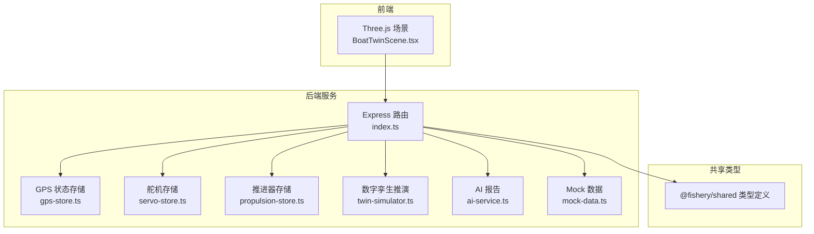
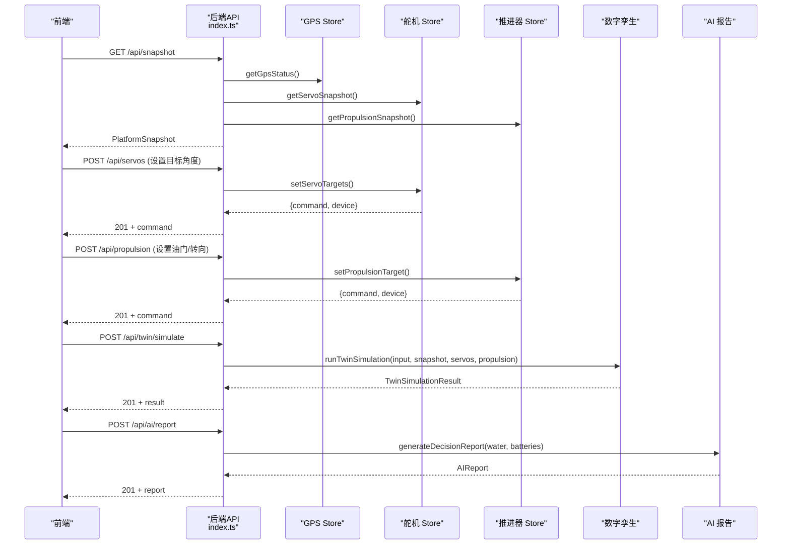
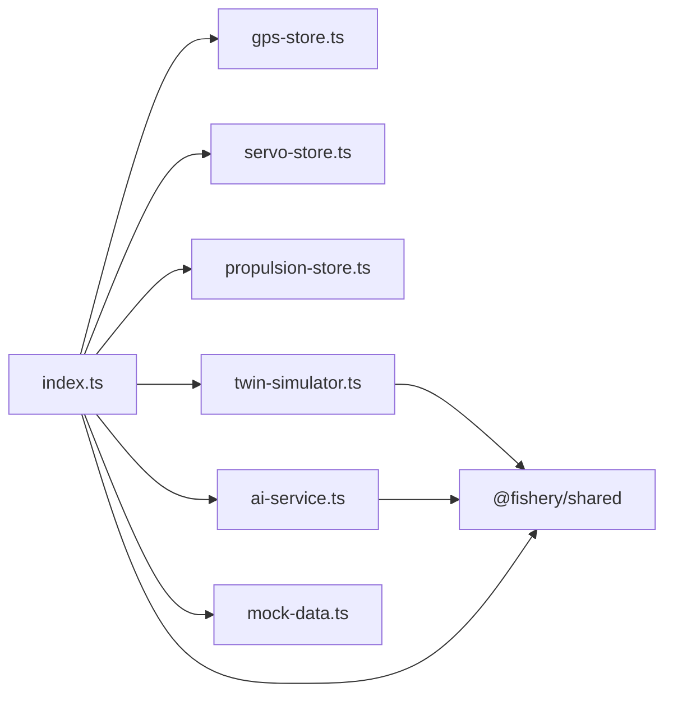

# 姿态同步算法

<cite>
**本文引用的文件**
- [index.ts](file://fishery-digital-twin-platform/apps/backend/src/index.ts)
- [twin-simulator.ts](file://fishery-digital-twin-platform/apps/backend/src/twin-simulator.ts)
- [gps-store.ts](file://fishery-digital-twin-platform/apps/backend/src/gps-store.ts)
- [servo-store.ts](file://fishery-digital-twin-platform/apps/backend/src/servo-store.ts)
- [propulsion-store.ts](file://fishery-digital-twin-platform/apps/backend/src/propulsion-store.ts)
- [mock-data.ts](file://fishery-digital-twin-platform/apps/backend/src/mock-data.ts)
- [ai-service.ts](file://fishery-digital-twin-platform/apps/backend/src/ai-service.ts)
- [shared types](file://fishery-digital-twin-platform/packages/shared/src/index.ts)
</cite>

## 目录
1. [简介](#简介)
2. [项目结构](#项目结构)
3. [核心组件](#核心组件)
4. [架构总览](#架构总览)
5. [详细组件分析](#详细组件分析)
6. [依赖关系分析](#依赖关系分析)
7. [性能与实时性](#性能与实时性)
8. [故障与异常处理](#故障与异常处理)
9. [调优指南](#调优指南)
10. [结论](#结论)

## 简介
本文件面向“船舶六自由度运动模拟与实时状态同步”的姿态同步算法，结合仓库中的后端服务、设备存储、数字孪生推演与前端可视化，给出可落地的实现说明。当前代码库未包含显式的坐标系转换矩阵或欧拉角/四元数数学库，但提供了：
- 世界坐标（WGS84）导航数据与航向、速度；
- 船体执行机构（舵机、推进器）的目标与实际反馈；
- 数字孪生对航线、能耗、故障与健康度的预测序列；
- 前端将角度映射为三维模型旋转，形成可视化的姿态同步。

因此，本文在“坐标系转换”部分以工程实践方式给出建议方案，并明确哪些能力已在代码中实现、哪些需要扩展。

## 项目结构
后端采用 Express 提供 HTTP API，并通过 UDP 广播进行设备发现；设备状态由独立的 Store 模块维护；数字孪生推演基于当前快照生成未来轨迹与风险；前端使用 Three.js 将舵机角度和推进器功率映射为三维模型的姿态变化。

图表来源
- [index.ts:1-120](file://fishery-digital-twin-platform/apps/backend/src/index.ts#L1-L120)
- [gps-store.ts:1-103](file://fishery-digital-twin-platform/apps/backend/src/gps-store.ts#L1-L103)
- [servo-store.ts:1-184](file://fishery-digital-twin-platform/apps/backend/src/servo-store.ts#L1-L184)
- [propulsion-store.ts:1-319](file://fishery-digital-twin-platform/apps/backend/src/propulsion-store.ts#L1-L319)
- [twin-simulator.ts:1-254](file://fishery-digital-twin-platform/apps/backend/src/twin-simulator.ts#L1-L254)
- [ai-service.ts:1-233](file://fishery-digital-twin-platform/apps/backend/src/ai-service.ts#L1-L233)
- [mock-data.ts:1-258](file://fishery-digital-twin-platform/apps/backend/src/mock-data.ts#L1-L258)
- [shared types:1-288](file://fishery-digital-twin-platform/packages/shared/src/index.ts#L1-L288)

章节来源
- [index.ts:1-120](file://fishery-digital-twin-platform/apps/backend/src/index.ts#L1-L120)
- [shared types:1-288](file://fishery-digital-twin-platform/packages/shared/src/index.ts#L1-L288)

## 核心组件
- GPS 状态管理：维护 WGS84 坐标、有效位、时间戳与在线状态，提供最新定位与航向、速度。
- 舵机存储：管理多通道舵机目标角度与实际角度，限制范围、保留通道与命令队列。
- 推进器存储：管理单/双通道推进器的油门、转向、左右功率输出、模式与安全锁。
- 数字孪生推演：基于输入参数与当前快照，生成航线预测、故障影响与健康度评估。
- AI 报告：基于水质统计与电池状态生成决策建议，支持本地基线与外部大模型回退。
- 前端可视化：将舵机角度与推进器功率映射到三维模型，形成姿态同步显示。

章节来源
- [gps-store.ts:1-103](file://fishery-digital-twin-platform/apps/backend/src/gps-store.ts#L1-L103)
- [servo-store.ts:1-184](file://fishery-digital-twin-platform/apps/backend/src/servo-store.ts#L1-L184)
- [propulsion-store.ts:1-319](file://fishery-digital-twin-platform/apps/backend/src/propulsion-store.ts#L1-L319)
- [twin-simulator.ts:1-254](file://fishery-digital-twin-platform/apps/backend/src/twin-simulator.ts#L1-L254)
- [ai-service.ts:1-233](file://fishery-digital-twin-platform/apps/backend/src/ai-service.ts#L1-L233)
- [BoatTwinScene.tsx:321-755](file://fishery-digital-twin-platform/apps/frontend/src/components/three/BoatTwinScene.tsx#L321-L755)

## 架构总览
后端通过统一入口暴露健康检查、传感器数据、设备控制、数字孪生推演等接口；设备状态由独立 Store 维护，保证命令下发与状态上报的解耦；前端通过轮询或长连接获取快照，驱动三维模型姿态更新。

图表来源
- [index.ts:320-555](file://fishery-digital-twin-platform/apps/backend/src/index.ts#L320-L555)
- [gps-store.ts:46-103](file://fishery-digital-twin-platform/apps/backend/src/gps-store.ts#L46-L103)
- [servo-store.ts:106-184](file://fishery-digital-twin-platform/apps/backend/src/servo-store.ts#L106-L184)
- [propulsion-store.ts:166-319](file://fishery-digital-twin-platform/apps/backend/src/propulsion-store.ts#L166-L319)
- [twin-simulator.ts:74-254](file://fishery-digital-twin-platform/apps/backend/src/twin-simulator.ts#L74-L254)
- [ai-service.ts:167-233](file://fishery-digital-twin-platform/apps/backend/src/ai-service.ts#L167-L233)

## 详细组件分析

### 坐标系与姿态同步
- 世界坐标系：GPS 使用 WGS84，提供经纬度、航向与速度；后端将其整合进导航数据。
- 船体坐标系：舵机角度与推进器功率代表俯仰、横滚、偏航与平移的控制面；前端将角度转换为模型旋转，形成姿态同步。
- 传感器坐标系：当前仓库未显式定义传感器局部坐标系；建议在 IMU/磁罗盘接入时定义传感器坐标系，并提供与世界坐标系的标定矩阵。

建议的数学转换流程（工程实践）：
- 从 WGS84 计算航向与速度矢量；
- 将舵机角度映射为俯仰/横滚/偏航增量；
- 将推进器功率映射为前后/左右平移与差速转向；
- 若接入 IMU，使用四元数或欧拉角进行姿态融合，再投影到三维模型。

章节来源
- [gps-store.ts:1-103](file://fishery-digital-twin-platform/apps/backend/src/gps-store.ts#L1-L103)
- [servo-store.ts:1-184](file://fishery-digital-twin-platform/apps/backend/src/servo-store.ts#L1-L184)
- [propulsion-store.ts:1-319](file://fishery-digital-twin-platform/apps/backend/src/propulsion-store.ts#L1-L319)
- [BoatTwinScene.tsx:321-755](file://fishery-digital-twin-platform/apps/frontend/src/components/three/BoatTwinScene.tsx#L321-L755)

### 运动学模型与仿真
- 平移：推进器左右功率合成产生前进/后退与差速转向；单通道模式下仅一侧输出。
- 旋转：舵机角度控制相机云台与连杆机构，形成偏航/俯仰/横滚的视觉效果；数字孪生根据跟踪误差与电机不对称估算航向漂移。
- 俯仰/横滚：舵机角度与线性执行器功率共同作用；前端根据功率动态调整伸缩长度与旋转角度。
- 偏航：推进器差速与舵机协同；数字孪生考虑海况与执行器反馈误差对航向的影响。

章节来源
- [propulsion-store.ts:89-95](file://fishery-digital-twin-platform/apps/backend/src/propulsion-store.ts#L89-L95)
- [servo-store.ts:75-87](file://fishery-digital-twin-platform/apps/backend/src/servo-store.ts#L75-L87)
- [twin-simulator.ts:82-106](file://fishery-digital-twin-platform/apps/backend/src/twin-simulator.ts#L82-L106)
- [BoatTwinScene.tsx:578-755](file://fishery-digital-twin-platform/apps/frontend/src/components/three/BoatTwinScene.tsx#L578-L755)

### 数据插值与预测
- 时间戳对齐：GPS 与传感器数据均带时间戳；后端维护历史窗口，按时间顺序累积。
- 数据平滑：演示数据使用步进逼近与噪声抑制；数字孪生对速度与能耗序列进行正弦波动模拟。
- 未来状态预测：数字孪生生成航线序列（分钟、距离、速度、电量），以及故障情景下的速度衰减曲线。

章节来源
- [mock-data.ts:48-140](file://fishery-digital-twin-platform/apps/backend/src/mock-data.ts#L48-L140)
- [twin-simulator.ts:107-153](file://fishery-digital-twin-platform/apps/backend/src/twin-simulator.ts#L107-L153)
- [index.ts:367-430](file://fishery-digital-twin-platform/apps/backend/src/index.ts#L367-L430)

### 同步精度控制
- 网络延迟补偿：命令队列带有 TTL（舵机与推进器均为约 2.5 秒），过期自动丢弃；后端通过 last_seen 判断设备在线。
- 数据丢包处理：Store 维护实际角度与功率的最近值；若缺失则保持上一帧或默认值；前端使用阻尼平滑避免突变。
- 状态一致性保证：命令下发前校验设备在线；急停命令可在反馈离线时强制下发；数字孪生置信度随在线设备数量提升。

章节来源
- [servo-store.ts:175-184](file://fishery-digital-twin-platform/apps/backend/src/servo-store.ts#L175-L184)
- [propulsion-store.ts:310-319](file://fishery-digital-twin-platform/apps/backend/src/propulsion-store.ts#L310-L319)
- [servo-store.ts:43-48](file://fishery-digital-twin-platform/apps/backend/src/servo-store.ts#L43-L48)
- [propulsion-store.ts:82-87](file://fishery-digital-twin-platform/apps/backend/src/propulsion-store.ts#L82-L87)
- [twin-simulator.ts:181-189](file://fishery-digital-twin-platform/apps/backend/src/twin-simulator.ts#L181-L189)

### 异常处理机制
- 传感器故障检测：GPS 非 WGS84 直接拒绝；有效位与时间戳用于判定定位质量；水质指标越界触发状态标记。
- 数据异常过滤：数值解析函数对非法输入返回空或默认值；角度与功率范围严格限制；保留通道不可控。
- 系统恢复策略：急停命令优先；命令队列 TTL 清理；持久化保存关键状态；关闭时安全释放资源。

章节来源
- [gps-store.ts:59-63](file://fishery-digital-twin-platform/apps/backend/src/gps-store.ts#L59-L63)
- [servo-store.ts:60-87](file://fishery-digital-twin-platform/apps/backend/src/servo-store.ts#L60-L87)
- [propulsion-store.ts:166-180](file://fishery-digital-twin-platform/apps/backend/src/propulsion-store.ts#L166-L180)
- [index.ts:559-599](file://fishery-digital-twin-platform/apps/backend/src/index.ts#L559-L599)

## 依赖关系分析
后端各模块职责清晰：
- index.ts 作为路由与协调层，聚合 GPS、舵机、推进器、数字孪生与 AI 报告；
- gps-store.ts、servo-store.ts、propulsion-store.ts 分别维护设备状态与命令队列；
- twin-simulator.ts 依赖共享类型与当前快照，输出预测结果；
- ai-service.ts 依赖水质与电池数据，生成决策报告；
- mock-data.ts 提供演示数据与导航路线；
- shared types 定义所有数据结构，确保前后端一致。

图表来源
- [index.ts:1-120](file://fishery-digital-twin-platform/apps/backend/src/index.ts#L1-L120)
- [gps-store.ts:1-103](file://fishery-digital-twin-platform/apps/backend/src/gps-store.ts#L1-L103)
- [servo-store.ts:1-184](file://fishery-digital-twin-platform/apps/backend/src/servo-store.ts#L1-L184)
- [propulsion-store.ts:1-319](file://fishery-digital-twin-platform/apps/backend/src/propulsion-store.ts#L1-L319)
- [twin-simulator.ts:1-254](file://fishery-digital-twin-platform/apps/backend/src/twin-simulator.ts#L1-L254)
- [ai-service.ts:1-233](file://fishery-digital-twin-platform/apps/backend/src/ai-service.ts#L1-L233)
- [mock-data.ts:1-258](file://fishery-digital-twin-platform/apps/backend/src/mock-data.ts#L1-L258)
- [shared types:1-288](file://fishery-digital-twin-platform/packages/shared/src/index.ts#L1-L288)

章节来源
- [index.ts:1-120](file://fishery-digital-twin-platform/apps/backend/src/index.ts#L1-L120)
- [shared types:1-288](file://fishery-digital-twin-platform/packages/shared/src/index.ts#L1-L288)

## 性能与实时性
- 命令队列 TTL：舵机与推进器命令有效期约 2.5 秒，避免陈旧指令导致姿态抖动。
- 设备在线判定：last_seen 超时 10 秒视为离线，防止对离线设备下发控制。
- 数据窗口：水质历史最多保留 180 条，平衡内存与趋势分析需求。
- 前端平滑：Three.js 中使用阻尼与 clamp 控制旋转与伸缩，降低视觉跳变。

优化建议：
- 提高采样频率时，适当缩短 TTL 并增加去抖滤波；
- 在网络不稳定时，增大滑动窗口与平滑系数；
- 对高负载场景，拆分数字孪生与 AI 报告为异步任务。

章节来源
- [servo-store.ts:175-184](file://fishery-digital-twin-platform/apps/backend/src/servo-store.ts#L175-L184)
- [propulsion-store.ts:310-319](file://fishery-digital-twin-platform/apps/backend/src/propulsion-store.ts#L310-L319)
- [index.ts:64-67](file://fishery-digital-twin-platform/apps/backend/src/index.ts#L64-L67)
- [BoatTwinScene.tsx:637-645](file://fishery-digital-twin-platform/apps/frontend/src/components/three/BoatTwinScene.tsx#L637-L645)

## 故障与异常处理
- GPS 坐标系统校验：仅接受 WGS84，其他系统直接报错；
- 舵机角度范围：0-180 度，保留通道固定为 90 度；
- 推进器模式与安全：WEB/AUTO/MANUAL 模式切换，急停优先，反馈离线仍可下发急停；
- 水质状态阈值：浊度、pH、溶解氧、氨氮越界触发污染或关注状态；
- 系统日志：所有关键操作记录日志，便于追踪与审计。

章节来源
- [gps-store.ts:59-63](file://fishery-digital-twin-platform/apps/backend/src/gps-store.ts#L59-L63)
- [servo-store.ts:60-87](file://fishery-digital-twin-platform/apps/backend/src/servo-store.ts#L60-L87)
- [propulsion-store.ts:166-180](file://fishery-digital-twin-platform/apps/backend/src/propulsion-store.ts#L166-L180)
- [index.ts:116-129](file://fishery-digital-twin-platform/apps/backend/src/index.ts#L116-L129)

## 调优指南
- 网络延迟补偿：根据实际网络状况调整命令 TTL 与设备在线超时；
- 数据平滑处理：在前端增加低通滤波，在后端增加滑动平均；
- 预测精度：数字孪生置信度随在线设备数量提升，建议增加 IMU 与电流传感器；
- 硬件特性适配：不同舵机与推进器最大角度/功率需配置限制；
- 故障注入：通过数字孪生模拟舵机卡滞、电机降额与反馈丢失，验证控制策略鲁棒性。

章节来源
- [twin-simulator.ts:181-189](file://fishery-digital-twin-platform/apps/backend/src/twin-simulator.ts#L181-L189)
- [servo-store.ts:10-13](file://fishery-digital-twin-platform/apps/backend/src/servo-store.ts#L10-L13)
- [propulsion-store.ts:7-26](file://fishery-digital-twin-platform/apps/backend/src/propulsion-store.ts#L7-L26)
- [BoatTwinScene.tsx:637-645](file://fishery-digital-twin-platform/apps/frontend/src/components/three/BoatTwinScene.tsx#L637-L645)

## 结论
该平台的姿态同步以“设备状态存储 + 数字孪生预测 + 前端可视化”为核心，实现了从传感器到三维模型的端到端同步。虽然未包含显式的坐标系转换矩阵，但通过 WGS84 导航数据、舵机角度与推进器功率的映射，已能完成六自由度运动的可视化与基础仿真。建议后续扩展 IMU 与传感器坐标系标定，完善欧拉角/四元数融合，进一步提升姿态同步精度与鲁棒性。