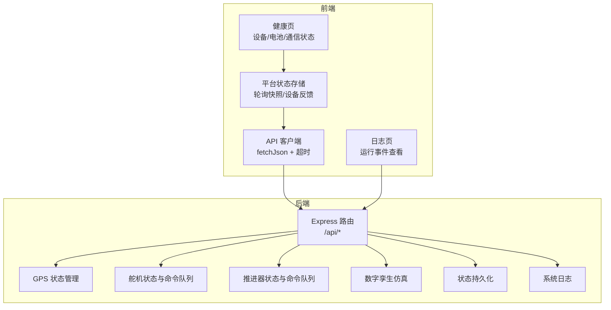
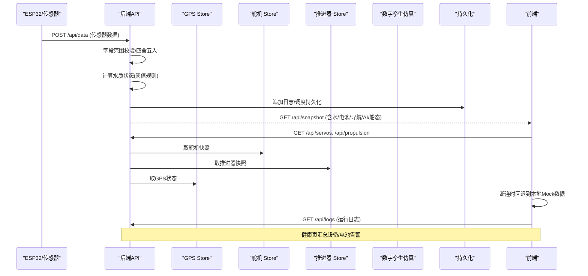
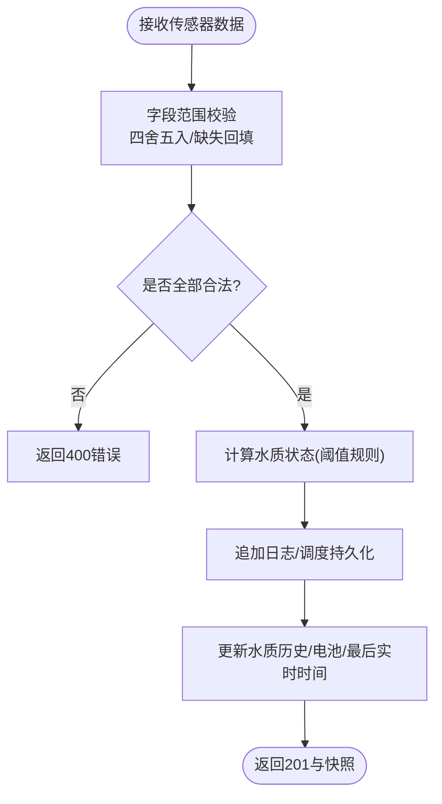
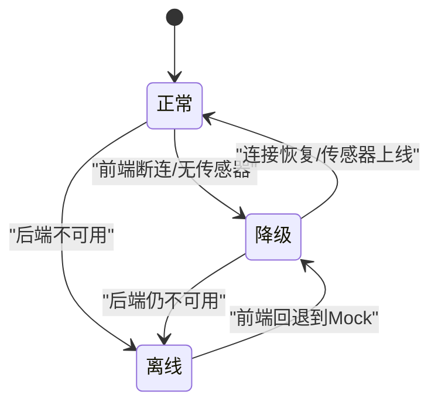
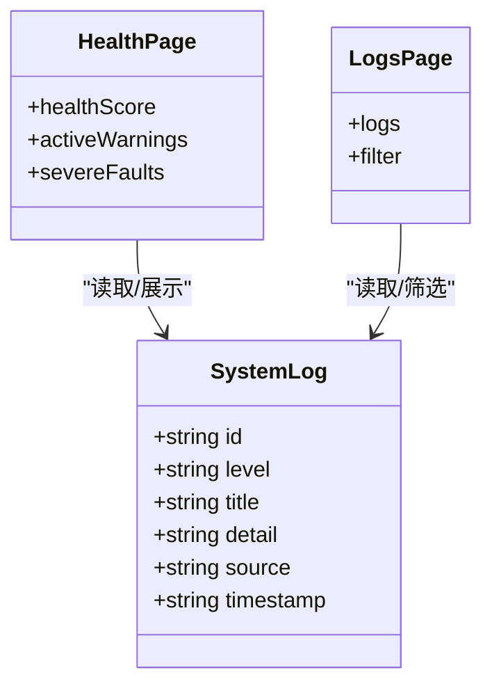
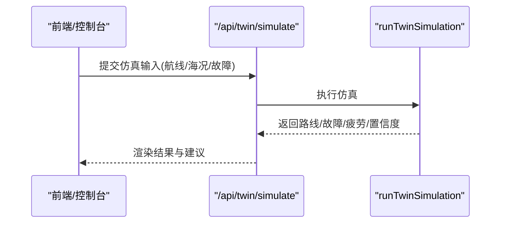
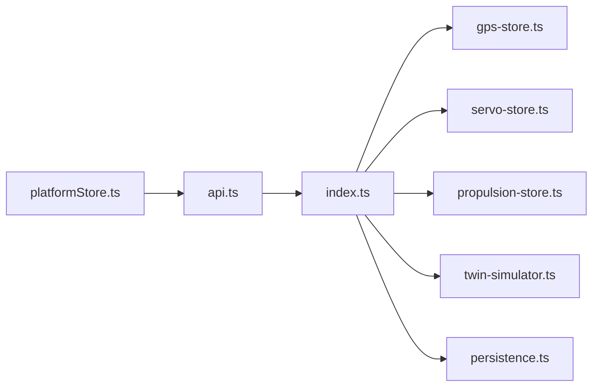

# 异常处理机制

<cite>
**本文引用的文件**
- [index.ts](file://fishery-digital-twin-platform/apps/backend/src/index.ts)
- [twin-simulator.ts](file://fishery-digital-twin-platform/apps/backend/src/twin-simulator.ts)
- [persistence.ts](file://fishery-digital-twin-platform/apps/backend/src/persistence.ts)
- [gps-store.ts](file://fishery-digital-twin-platform/apps/backend/src/gps-store.ts)
- [servo-store.ts](file://fishery-digital-twin-platform/apps/backend/src/servo-store.ts)
- [propulsion-store.ts](file://fishery-digital-twin-platform/apps/backend/src/propulsion-store.ts)
- [mock-data.ts](file://fishery-digital-twin-platform/apps/backend/src/mock-data.ts)
- [fallback-data.ts](file://fishery-digital-twin-platform/apps/frontend/src/lib/fallback-data.ts)
- [platformStore.ts](file://fishery-digital-twin-platform/apps/frontend/src/lib/platformStore.ts)
- [api.ts](file://fishery-digital-twin-platform/apps/frontend/src/lib/api.ts)
- [HealthPage.tsx](file://fishery-digital-twin-platform/apps/frontend/src/components/dashboard/HealthPage.tsx)
- [LogsPage.tsx](file://fishery-digital-twin-platform/apps/frontend/src/components/dashboard/LogsPage.tsx)
- [device-stores.test.ts](file://fishery-digital-twin-platform/apps/backend/src/device-stores.test.ts)
</cite>

## 目录
1. [简介](#简介)
2. [项目结构](#项目结构)
3. [核心组件](#核心组件)
4. [架构总览](#架构总览)
5. [详细组件分析](#详细组件分析)
6. [依赖关系分析](#依赖关系分析)
7. [性能与可靠性考量](#性能与可靠性考量)
8. [故障排查指南](#故障排查指南)
9. [结论](#结论)
10. [附录：配置与调试](#附录：配置与调试)

## 简介
本文件面向数字孪生系统中的异常处理机制，围绕“故障检测—数据过滤—恢复策略—告警通知—模拟测试—配置与调试”形成完整闭环。系统在后端实现了传感器数据合理性检查、信号质量评估、设备在线状态监控；在前端提供降级展示、连接状态感知与日志可视化；在仿真层提供故障注入与恢复推演能力；并通过持久化与日志体系支撑可观测性与排障。

## 项目结构
后端以 Express 服务为核心，聚合水质、电池、导航、AI、舵机、推进器与数字孪生仿真等模块；前端通过轮询获取平台快照与设备反馈，并在断连时回退到本地 Mock 数据；共享类型定义来自 @fishery/shared（由工程约定）。

图表来源
- [index.ts:56-110](file://fishery-digital-twin-platform/apps/backend/src/index.ts#L56-L110)
- [platformStore.ts:20-139](file://fishery-digital-twin-platform/apps/frontend/src/lib/platformStore.ts#L20-L139)
- [api.ts:6-24](file://fishery-digital-twin-platform/apps/frontend/src/lib/api.ts#L6-L24)

章节来源
- [index.ts:56-110](file://fishery-digital-twin-platform/apps/backend/src/index.ts#L56-L110)
- [platformStore.ts:20-139](file://fishery-digital-twin-platform/apps/frontend/src/lib/platformStore.ts#L20-L139)
- [api.ts:6-24](file://fishery-digital-twin-platform/apps/frontend/src/lib/api.ts#L6-L24)

## 核心组件
- 传感器数据接入与合理性校验：对水温、浊度、pH、溶解氧、氨氮、电导率进行范围限制与四舍五入，并基于阈值规则计算水质状态。
- 设备在线与信号质量：GPS、舵机、推进器均维护 last_seen 时间戳，结合超时判定 online/valid；舵机与推进器维护命令队列与 TTL。
- 数据源切换与降级：当无真实传感器数据时启用演示或回退数据；前端在断连时显示“回退数据”，并维持界面可用。
- 数字孪生故障推演：支持注入舵机卡滞、电机降额、反馈丢失等故障，输出风险等级、完成概率、能耗与疲劳预测。
- 日志与告警：统一 appendLog 写入系统日志，前端日志页按级别筛选；健康页汇总设备与电池告警。
- 持久化：平台状态（水质历史、电池、AI 报告、日志）异步落盘，进程退出前强制刷新。

章节来源
- [index.ts:116-129](file://fishery-digital-twin-platform/apps/backend/src/index.ts#L116-L129)
- [index.ts:367-430](file://fishery-digital-twin-platform/apps/backend/src/index.ts#L367-L430)
- [gps-store.ts:40-53](file://fishery-digital-twin-platform/apps/backend/src/gps-store.ts#L40-L53)
- [servo-store.ts:43-58](file://fishery-digital-twin-platform/apps/backend/src/servo-store.ts#L43-L58)
- [propulsion-store.ts:139-147](file://fishery-digital-twin-platform/apps/backend/src/propulsion-store.ts#L139-L147)
- [platformStore.ts:98-130](file://fishery-digital-twin-platform/apps/frontend/src/lib/platformStore.ts#L98-L130)
- [persistence.ts:17-67](file://fishery-digital-twin-platform/apps/backend/src/persistence.ts#L17-L67)

## 架构总览
下图展示了从传感器数据进入、异常检测、状态快照生成、前端降级与日志记录的整体流程。

图表来源
- [index.ts:367-430](file://fishery-digital-twin-platform/apps/backend/src/index.ts#L367-L430)
- [index.ts:322-346](file://fishery-digital-twin-platform/apps/backend/src/index.ts#L322-L346)
- [platformStore.ts:98-130](file://fishery-digital-twin-platform/apps/frontend/src/lib/platformStore.ts#L98-L130)
- [fallback-data.ts:152-163](file://fishery-digital-twin-platform/apps/frontend/src/lib/fallback-data.ts#L152-L163)

## 详细组件分析

### 传感器故障检测算法
- 数据合理性检查
  - 数值范围限制：水温、浊度、pH、溶解氧、氨氮、电导率、电量均有上下界约束，越界将拒绝请求。
  - 精度控制：对关键指标进行固定小数位四舍五入，避免浮点噪声。
  - 缺失值回填：未提供的字段使用最新历史值或默认值，保证快照连续性。
- 信号质量评估
  - GPS：坐标有效性校验（WGS84、经纬度范围），last_seen 超时判定 online/valid。
  - 舵机：角度解析为 0-180 整数，保留通道保护，目标角度上限裁剪。
  - 推进器：模式与功率混合计算，单通道/双通道差异化处理，紧急停止优先。
- 设备状态监控
  - 统一 last_seen 时间戳与超时阈值判断 online。
  - 组合设备在线性：船体 online 由 GPS/舵机/推进器/传感器综合判定。

图表来源
- [index.ts:159-176](file://fishery-digital-twin-platform/apps/backend/src/index.ts#L159-L176)
- [index.ts:367-430](file://fishery-digital-twin-platform/apps/backend/src/index.ts#L367-L430)
- [gps-store.ts:59-101](file://fishery-digital-twin-platform/apps/backend/src/gps-store.ts#L59-L101)
- [servo-store.ts:60-87](file://fishery-digital-twin-platform/apps/backend/src/servo-store.ts#L60-L87)
- [propulsion-store.ts:166-231](file://fishery-digital-twin-platform/apps/backend/src/propulsion-store.ts#L166-L231)

章节来源
- [index.ts:159-176](file://fishery-digital-twin-platform/apps/backend/src/index.ts#L159-L176)
- [index.ts:367-430](file://fishery-digital-twin-platform/apps/backend/src/index.ts#L367-L430)
- [gps-store.ts:59-101](file://fishery-digital-twin-platform/apps/backend/src/gps-store.ts#L59-L101)
- [servo-store.ts:60-87](file://fishery-digital-twin-platform/apps/backend/src/servo-store.ts#L60-L87)
- [propulsion-store.ts:166-231](file://fishery-digital-twin-platform/apps/backend/src/propulsion-store.ts#L166-L231)

### 数据异常过滤技术
- 阈值检测
  - 水质状态分级：污染、藻华风险、关注、正常，依据浊度、pH、溶解氧、氨氮阈值判定。
  - 电池告警：电量低或状态非在线触发预警。
- 模式识别
  - 数据源模式：live/mixed/demo/fallback，用于区分真实、混合、演示与回退数据。
  - 趋势识别：AI 报告中根据浊度变化判断上升/下降/稳定。
- 机器学习异常分类
  - 当前实现为规则基线；未来可扩展至模型分类（如基于时序的异常检测），需保持与现有阈值规则兼容。

章节来源
- [index.ts:264-269](file://fishery-digital-twin-platform/apps/backend/src/index.ts#L264-L269)
- [index.ts:189-195](file://fishery-digital-twin-platform/apps/backend/src/index.ts#L189-L195)
- [mock-data.ts:192-243](file://fishery-digital-twin-platform/apps/backend/src/mock-data.ts#L192-L243)
- [fallback-data.ts:17-22](file://fishery-digital-twin-platform/apps/frontend/src/lib/fallback-data.ts#L17-L22)

### 系统恢复策略
- 降级运行模式
  - 前端断连：自动切换到本地 Mock 数据，保持界面可用与健康页展示。
  - 后端无传感器数据：启用演示数据注入，维持快照连续性。
- 备用数据源切换
  - 数据源优先级：sensor > fallback > demo；混合数据标记 mixed。
- 状态重建机制
  - 启动加载持久化状态，限制历史长度与日志条目数量，避免内存膨胀。
  - 进程退出时强制刷新持久化，确保状态不丢失。

图表来源
- [platformStore.ts:98-130](file://fishery-digital-twin-platform/apps/frontend/src/lib/platformStore.ts#L98-L130)
- [fallback-data.ts:152-163](file://fishery-digital-twin-platform/apps/frontend/src/lib/fallback-data.ts#L152-L163)
- [index.ts:178-195](file://fishery-digital-twin-platform/apps/backend/src/index.ts#L178-L195)
- [persistence.ts:32-49](file://fishery-digital-twin-platform/apps/backend/src/persistence.ts#L32-L49)

章节来源
- [platformStore.ts:98-130](file://fishery-digital-twin-platform/apps/frontend/src/lib/platformStore.ts#L98-L130)
- [fallback-data.ts:152-163](file://fishery-digital-twin-platform/apps/frontend/src/lib/fallback-data.ts#L152-L163)
- [index.ts:178-195](file://fishery-digital-twin-platform/apps/backend/src/index.ts#L178-L195)
- [persistence.ts:32-49](file://fishery-digital-twin-platform/apps/backend/src/persistence.ts#L32-L49)

### 告警与通知机制
- 异常分级
  - 系统日志级别：info/success/warning/error，统一 appendLog 写入。
  - 健康评分：基于设备离线数、电池异常数与电量计算，输出良好/需关注/预警。
- 通知渠道
  - 当前为界面内日志与健康页展示；可扩展为邮件/短信/IM（需新增通知服务）。
- 用户界面反馈
  - 健康页：设备状态、电池电量、通信状态、最近告警列表。
  - 日志页：按级别筛选、自动刷新、统计面板。

图表来源
- [index.ts:116-129](file://fishery-digital-twin-platform/apps/backend/src/index.ts#L116-L129)
- [HealthPage.tsx:13-31](file://fishery-digital-twin-platform/apps/frontend/src/components/dashboard/HealthPage.tsx#L13-L31)
- [LogsPage.tsx:9-43](file://fishery-digital-twin-platform/apps/frontend/src/components/dashboard/LogsPage.tsx#L9-L43)

章节来源
- [index.ts:116-129](file://fishery-digital-twin-platform/apps/backend/src/index.ts#L116-L129)
- [HealthPage.tsx:13-31](file://fishery-digital-twin-platform/apps/frontend/src/components/dashboard/HealthPage.tsx#L13-L31)
- [LogsPage.tsx:9-43](file://fishery-digital-twin-platform/apps/frontend/src/components/dashboard/LogsPage.tsx#L9-L43)

### 故障模拟与测试方法
- 故障注入
  - 数字孪生仿真支持注入：舵机卡滞、电机降额、执行机构反馈丢失，并可调节严重度。
  - 仿真结果包含速度损失、航向漂移、完成概率、风险等级与建议措施。
- 验证恢复流程
  - 通过 /api/twin/simulate 输入不同海况与故障参数，观察推荐策略与能耗曲线。
  - 结合舵机/推进器命令队列与TTL，验证命令下发与失效窗口。
- 性能影响评估
  - 仿真计算复杂度线性于采样点与设备数；注意高并发下的 CPU 占用与响应延迟。
  - 建议对高频调用进行限流（当前 AI 报告已有限频）。

图表来源
- [index.ts:540-555](file://fishery-digital-twin-platform/apps/backend/src/index.ts#L540-L555)
- [twin-simulator.ts:74-253](file://fishery-digital-twin-platform/apps/backend/src/twin-simulator.ts#L74-L253)

章节来源
- [index.ts:540-555](file://fishery-digital-twin-platform/apps/backend/src/index.ts#L540-L555)
- [twin-simulator.ts:74-253](file://fishery-digital-twin-platform/apps/backend/src/twin-simulator.ts#L74-L253)
- [device-stores.test.ts:27-92](file://fishery-digital-twin-platform/apps/backend/src/device-stores.test.ts#L27-L92)

## 依赖关系分析
- 后端模块耦合
  - index.ts 聚合各 store 与仿真模块，承担路由、鉴权、日志与持久化协调。
  - gps-store/servo-store/propulsion-store 各自维护设备状态与命令队列，解耦清晰。
  - persistence.ts 独立负责状态落盘，降低主流程 IO 阻塞。
- 前后端交互
  - 前端 platformStore 定时拉取快照与设备反馈，失败时置为不连接并回退数据。
  - api.ts 统一封装 fetchJson，设置超时与令牌头，错误抛出供上层捕获。
- 外部依赖
  - Node.js 内置模块：crypto、dgram、fs、path、os。
  - Express、CORS、dotenv 等第三方库。

图表来源
- [index.ts:21-44](file://fishery-digital-twin-platform/apps/backend/src/index.ts#L21-L44)
- [platformStore.ts:1-5](file://fishery-digital-twin-platform/apps/frontend/src/lib/platformStore.ts#L1-L5)
- [api.ts:1-24](file://fishery-digital-twin-platform/apps/frontend/src/lib/api.ts#L1-L24)

章节来源
- [index.ts:21-44](file://fishery-digital-twin-platform/apps/backend/src/index.ts#L21-L44)
- [platformStore.ts:1-5](file://fishery-digital-twin-platform/apps/frontend/src/lib/platformStore.ts#L1-L5)
- [api.ts:1-24](file://fishery-digital-twin-platform/apps/frontend/src/lib/api.ts#L1-L24)

## 性能与可靠性考量
- 数据入库与持久化
  - 使用定时器批量持久化，减少频繁磁盘写入；进程退出时强制 flush。
  - 历史数据截断（水质最多180条，日志最多80条），控制内存增长。
- 网络与超时
  - 前端 fetch 设置 5 秒超时，避免长时间阻塞；断连后回退数据保障可用性。
- 并发与限流
  - AI 报告生成限制每分钟一次，防止重复计算；数字孪生仿真应避免高频调用。
- 资源安全
  - 端口冲突与权限不足时优雅退出；UDP 发现服务错误处理与清理。

[本节为通用指导，无需特定文件引用]

## 故障排查指南
- 常见问题定位
  - 传感器数据被拒：检查字段范围与类型，确认至少提供一个受支持的数值字段。
  - 设备离线：确认 last_seen 是否更新，检查设备心跳与网络连通性。
  - 命令未生效：检查命令 TTL 窗口与设备在线状态；推进器在非 WEB 模式或急停时不会下发动力。
- 日志与告警
  - 通过 /api/logs 查看系统事件，按级别筛选；健康页汇总设备与电池告警。
- 恢复验证
  - 使用 /api/demo/simulate 生成演示快照；通过 /api/twin/simulate 验证故障恢复策略。
- 单元测试参考
  - 舵机命令要求设备在线且保留通道；推进器禁止将请求目标作为实测反馈；急停可在反馈离线时下发。

章节来源
- [index.ts:367-430](file://fishery-digital-twin-platform/apps/backend/src/index.ts#L367-L430)
- [servo-store.ts:106-153](file://fishery-digital-twin-platform/apps/backend/src/servo-store.ts#L106-L153)
- [propulsion-store.ts:166-231](file://fishery-digital-twin-platform/apps/backend/src/propulsion-store.ts#L166-L231)
- [LogsPage.tsx:14-43](file://fishery-digital-twin-platform/apps/frontend/src/components/dashboard/LogsPage.tsx#L14-L43)
- [device-stores.test.ts:27-92](file://fishery-digital-twin-platform/apps/backend/src/device-stores.test.ts#L27-L92)

## 结论
该数字孪生平台构建了覆盖“检测—过滤—恢复—告警—仿真—持久化”的异常处理体系。通过严格的输入校验、设备在线判定与数据源切换，系统在传感器与通信异常时仍能保持稳定运行；数字孪生仿真提供了故障注入与恢复策略验证能力；日志与健康页为运维与排障提供了直观入口。后续可在此基础上扩展机器学习异常分类、多通道通知与更丰富的仿真模型。

[本节为总结，无需特定文件引用]

## 附录：配置与调试
- 环境变量
  - PORT/HOST：后端监听地址与端口。
  - UISYS_DISCOVERY_PORT：UDP 发现端口。
  - UISYS_DEMO_WATER_FEED/UISYS_DEMO_WATER_INTERVAL_MS：演示水质注入开关与间隔。
  - UISYS_SENSOR_FRESHNESS_MS：传感器新鲜度阈值。
  - UISYS_API_TOKEN：LAN 控制令牌。
  - CORS_ORIGIN：允许的前端来源。
  - UISYS_DATA_DIR：持久化数据目录。
- 调试工具
  - 健康页：手动触发健康检查，查看设备与电池状态。
  - 日志页：按级别筛选，观察系统事件。
  - 仿真接口：/api/twin/simulate 与 /api/demo/simulate 用于故障注入与演示数据生成。
  - 单元测试：device-stores.test.ts 覆盖舵机与推进器的边界条件与异常路径。

章节来源
- [index.ts:48-76](file://fishery-digital-twin-platform/apps/backend/src/index.ts#L48-L76)
- [persistence.ts:12-13](file://fishery-digital-twin-platform/apps/backend/src/persistence.ts#L12-L13)
- [HealthPage.tsx:37-47](file://fishery-digital-twin-platform/apps/frontend/src/components/dashboard/HealthPage.tsx#L37-L47)
- [LogsPage.tsx:14-43](file://fishery-digital-twin-platform/apps/frontend/src/components/dashboard/LogsPage.tsx#L14-L43)
- [device-stores.test.ts:12-92](file://fishery-digital-twin-platform/apps/backend/src/device-stores.test.ts#L12-L92)