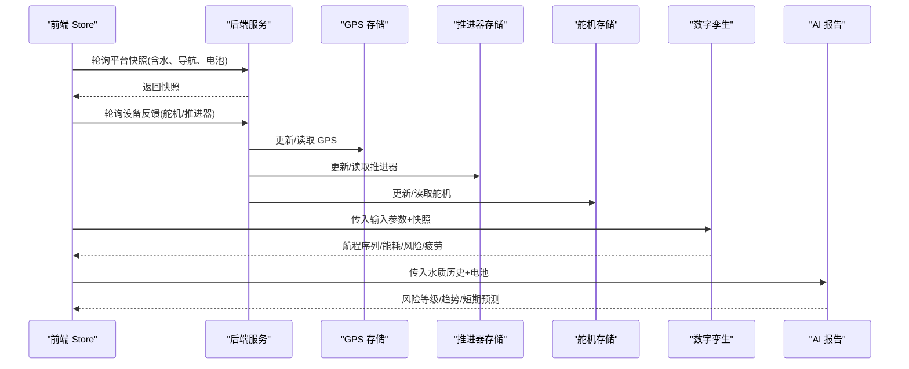
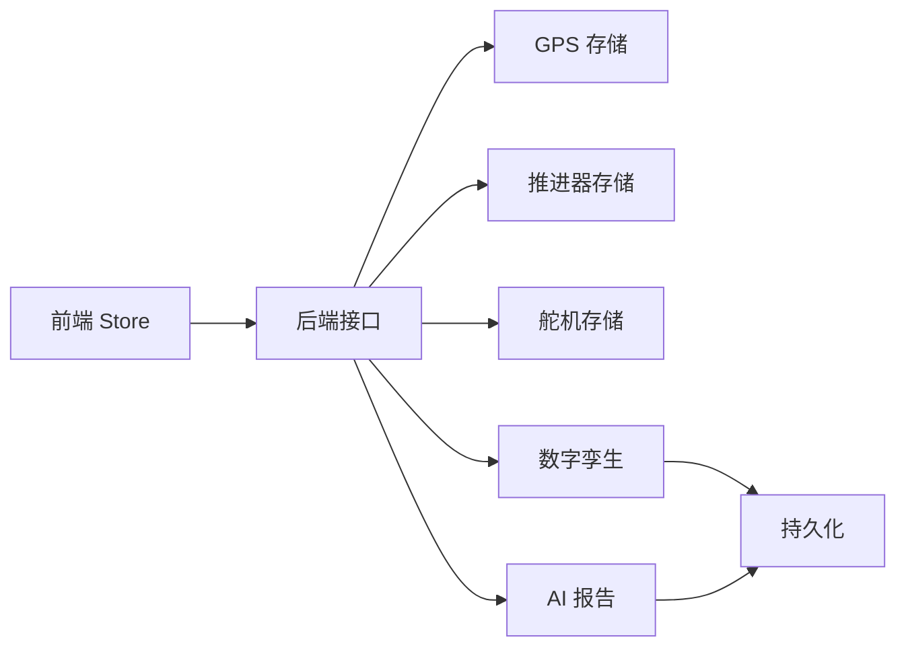

# 数据插值与预测

<cite>
**本文引用的文件**
- [twin-simulator.ts](file://fishery-digital-twin-platform/apps/backend/src/twin-simulator.ts)
- [gps-store.ts](file://fishery-digital-twin-platform/apps/backend/src/gps-store.ts)
- [propulsion-store.ts](file://fishery-digital-twin-platform/apps/backend/src/propulsion-store.ts)
- [servo-store.ts](file://fishery-digital-twin-platform/apps/backend/src/servo-store.ts)
- [mock-data.ts](file://fishery-digital-twin-platform/apps/backend/src/mock-data.ts)
- [ai-service.ts](file://fishery-digital-twin-platform/apps/backend/src/ai-service.ts)
- [persistence.ts](file://fishery-digital-twin-platform/apps/backend/src/persistence.ts)
- [platformStore.ts](file://fishery-digital-twin-platform/apps/frontend/src/lib/platformStore.ts)
- [fallback-data.ts](file://fishery-digital-twin-platform/apps/frontend/src/lib/fallback-data.ts)
</cite>

## 目录
1. [简介](#简介)
2. [项目结构](#项目结构)
3. [核心组件](#核心组件)
4. [架构总览](#架构总览)
5. [详细组件分析](#详细组件分析)
6. [依赖关系分析](#依赖关系分析)
7. [性能考量](#性能考量)
8. [故障排查指南](#故障排查指南)
9. [结论](#结论)
10. [附录：实现示例与最佳实践](#附录实现示例与最佳实践)

## 简介
本文件聚焦于“实时状态同步中的数据处理方法”，围绕时间戳对齐、数据平滑、未来状态预测、异常检测与插值策略展开，结合代码仓库中后端模拟器、设备状态存储、AI 报告生成与前端数据流，给出可落地的工程化方案与图示。文档既面向算法工程师，也便于非技术读者理解整体流程与关键取舍。

## 项目结构
本项目采用前后端分离的架构：
- 后端负责设备状态管理（GPS、推进器、舵机）、数字孪生仿真、水质与 AI 报告生成、持久化等。
- 前端通过轮询获取平台快照与设备反馈，使用共享 Store 统一分发，供各页面渲染。

```mermaid
graph TB
subgraph "前端"
UI["界面组件"]
Store["平台状态 Store<br/>platformStore.ts"]
end
subgraph "后端"
Twin["数字孪生仿真<br/>twin-simulator.ts"]
GPS["GPS 状态存储<br/>gps-store.ts"]
Prop["推进器状态存储<br/>propulsion-store.ts"]
Servo["舵机状态存储<br/>servo-store.ts"]
AI["AI 报告生成<br/>ai-service.ts"]
Mock["模拟数据生成<br/>mock-data.ts"]
Persist["状态持久化<br/>persistence.ts"]
end
UI --> Store
Store --> |"轮询快照/反馈"| Twin
Store --> |"轮询快照/反馈"| GPS
Store --> |"轮询快照/反馈"| Prop
Store --> |"轮询快照/反馈"| Servo
Twin --> |"组合输入"| AI
AI --> |"报告/置信度"| UI
Persist < --> |"读写历史"| Twin
```

图表来源
- [platformStore.ts:20-139](file://fishery-digital-twin-platform/apps/frontend/src/lib/platformStore.ts#L20-L139)
- [twin-simulator.ts:74-253](file://fishery-digital-twin-platform/apps/backend/src/twin-simulator.ts#L74-L253)
- [gps-store.ts:46-102](file://fishery-digital-twin-platform/apps/backend/src/gps-store.ts#L46-L102)
- [propulsion-store.ts:149-318](file://fishery-digital-twin-platform/apps/backend/src/propulsion-store.ts#L149-L318)
- [servo-store.ts:89-183](file://fishery-digital-twin-platform/apps/backend/src/servo-store.ts#L89-L183)
- [ai-service.ts:49-122](file://fishery-digital-twin-platform/apps/backend/src/ai-service.ts#L49-L122)
- [mock-data.ts:114-140](file://fishery-digital-twin-platform/apps/backend/src/mock-data.ts#L114-L140)
- [persistence.ts:17-67](file://fishery-digital-twin-platform/apps/backend/src/persistence.ts#L17-L67)

章节来源
- [platformStore.ts:20-139](file://fishery-digital-twin-platform/apps/frontend/src/lib/platformStore.ts#L20-L139)
- [twin-simulator.ts:74-253](file://fishery-digital-twin-platform/apps/backend/src/twin-simulator.ts#L74-L253)

## 核心组件
- 数字孪生仿真：将航行、推进、舵机、海况、故障等输入融合为航程序列、能耗、风险等级与疲劳评估。
- 设备状态存储：对 GPS、推进器、舵机的上报数据进行校验、限幅、在线性判断与命令队列管理。
- AI 报告生成：基于水质历史与电池状态计算统计量，输出风险等级、趋势与短期预测。
- 前端数据流：固定频率轮询平台快照与设备反馈，合并到单一 Store，保证多页面一致视图。

章节来源
- [twin-simulator.ts:74-253](file://fishery-digital-twin-platform/apps/backend/src/twin-simulator.ts#L74-L253)
- [gps-store.ts:46-102](file://fishery-digital-twin-platform/apps/backend/src/gps-store.ts#L46-L102)
- [propulsion-store.ts:149-318](file://fishery-digital-twin-platform/apps/backend/src/propulsion-store.ts#L149-L318)
- [servo-store.ts:89-183](file://fishery-digital-twin-platform/apps/backend/src/servo-store.ts#L89-L183)
- [ai-service.ts:49-122](file://fishery-digital-twin-platform/apps/backend/src/ai-service.ts#L49-L122)
- [platformStore.ts:20-139](file://fishery-digital-twin-platform/apps/frontend/src/lib/platformStore.ts#L20-L139)

## 架构总览
下图展示从数据采集、状态同步到插值与预测的关键路径。



图表来源
- [platformStore.ts:98-139](file://fishery-digital-twin-platform/apps/frontend/src/lib/platformStore.ts#L98-L139)
- [gps-store.ts:59-102](file://fishery-digital-twin-platform/apps/backend/src/gps-store.ts#L59-L102)
- [propulsion-store.ts:166-318](file://fishery-digital-twin-platform/apps/backend/src/propulsion-store.ts#L166-L318)
- [servo-store.ts:106-183](file://fishery-digital-twin-platform/apps/backend/src/servo-store.ts#L106-L183)
- [twin-simulator.ts:74-253](file://fishery-digital-twin-platform/apps/backend/src/twin-simulator.ts#L74-L253)
- [ai-service.ts:167-232](file://fishery-digital-twin-platform/apps/backend/src/ai-service.ts#L167-L232)

## 详细组件分析

### 时间戳对齐与不同频率数据的同步策略
- 前端轮询周期：
  - 平台快照：约 2 秒一次。
  - 设备反馈：约 1 秒一次。
- 后端在线性判定：
  - GPS 最后可见时间超过阈值视为离线。
  - 推进器/舵机以 last_seen 或目标更新时间判断在线。
- 建议的时间窗口管理：
  - 滑动窗口：维护最近 N 分钟的水质/传感器历史，用于趋势与预测。
  - 对齐策略：以最近一次有效样本为锚点，向前补齐缺失点；对高频设备（舵机/推进器）与低频数据（水质）分别建立独立时间轴，再在需要时按时间对齐。
  - 超时处理：对超时的设备数据标记为无效，避免污染统计与预测。

章节来源
- [platformStore.ts:20-22](file://fishery-digital-twin-platform/apps/frontend/src/lib/platformStore.ts#L20-L22)
- [gps-store.ts:40-53](file://fishery-digital-twin-platform/apps/backend/src/gps-store.ts#L40-L53)
- [propulsion-store.ts:82-147](file://fishery-digital-twin-platform/apps/backend/src/propulsion-store.ts#L82-L147)
- [servo-store.ts:43-58](file://fishery-digital-twin-platform/apps/backend/src/servo-store.ts#L43-L58)

### 数据平滑处理技术
- 移动平均滤波：适用于短时噪声抑制，如温度、浊度的滚动均值，降低瞬时抖动。
- 指数平滑：对近期变化更敏感，适合快速响应的指标（如溶解氧短期波动）。
- 卡尔曼滤波：当存在过程噪声与观测噪声模型时，可用于位置/速度估计或多源融合（例如 GPS 速度与推进器功率的联合估计）。
- 在本项目中：
  - 模拟数据生成器使用了确定性噪声与步长限制，体现“平滑过渡”的思想。
  - 数字孪生中对误差与负载进行限幅与加权，间接起到平滑作用。

章节来源
- [mock-data.ts:38-76](file://fishery-digital-twin-platform/apps/backend/src/mock-data.ts#L38-L76)
- [twin-simulator.ts:20-27](file://fishery-digital-twin-platform/apps/backend/src/twin-simulator.ts#L20-L27)

### 未来状态预测模型
- 线性外推：基于最近若干点的斜率预测短期趋势，适用于稳定工况下的指标（如电导率缓慢上升）。
- 趋势分析：通过区间差值与阈值规则识别上升/下降/稳定趋势，并映射到风险等级。
- 周期性模式识别：利用正弦/余弦函数或傅里叶分量捕捉昼夜、潮汐等周期影响（模拟数据中使用正弦函数模拟波浪与径流脉冲）。
- 在本项目中：
  - 数字孪生根据海况、跟踪误差、电机不对称等生成航程序列与到达电量。
  - AI 报告根据水质历史统计量与电池状态输出短期预测（藻华风险、浊度趋势、续航小时数）。

章节来源
- [twin-simulator.ts:107-116](file://fishery-digital-twin-platform/apps/backend/src/twin-simulator.ts#L107-L116)
- [ai-service.ts:49-122](file://fishery-digital-twin-platform/apps/backend/src/ai-service.ts#L49-L122)
- [mock-data.ts:23-76](file://fishery-digital-twin-platform/apps/backend/src/mock-data.ts#L23-L76)

### 异常数据检测与处理
- 离群点识别：对单点突变设置合理阈值（如 pH、溶解氧、氨氮），超出范围即标记异常。
- 数据修复：对无效或越界值进行回退（保持上一有效值）或插值填充。
- 置信度评估：依据在线设备数量、最新数据新鲜度、历史样本长度综合评估结果可信度。
- 在本项目中：
  - GPS/推进器/舵机均对数值进行解析与限幅，非法值被丢弃或置空。
  - 数字孪生根据在线设备数量与反馈质量计算置信度。
  - AI 报告根据数据来源与样本数量给出置信度与数据质量说明。

章节来源
- [gps-store.ts:29-38](file://fishery-digital-twin-platform/apps/backend/src/gps-store.ts#L29-L38)
- [propulsion-store.ts:41-67](file://fishery-digital-twin-platform/apps/backend/src/propulsion-store.ts#L41-L67)
- [servo-store.ts:60-87](file://fishery-digital-twin-platform/apps/backend/src/servo-store.ts#L60-L87)
- [twin-simulator.ts:181-189](file://fishery-digital-twin-platform/apps/backend/src/twin-simulator.ts#L181-L189)
- [ai-service.ts:167-232](file://fishery-digital-twin-platform/apps/backend/src/ai-service.ts#L167-L232)

### 插值算法的选择标准
- 线性插值：简单高效，适合缓变指标（如电导率、温度短时段内）。
- 样条插值：曲线更平滑，适合需要连续导数的场景（如轨迹插值、姿态角变化）。
- 基于物理模型的插值：当具备机理模型时（如阻力-能耗模型），优先使用物理约束插值，提高外推可靠性。
- 在本项目中：
  - 数字孪生使用准静态阻力与能耗模型生成航程序列，体现“物理模型优先”的原则。
  - 模拟数据生成器使用正弦函数与指数衰减模拟环境扰动，可作为周期性插值的参考。

章节来源
- [twin-simulator.ts:247-251](file://fishery-digital-twin-platform/apps/backend/src/twin-simulator.ts#L247-L251)
- [mock-data.ts:23-76](file://fishery-digital-twin-platform/apps/backend/src/mock-data.ts#L23-L76)

### 具体实现示例（数据预处理、插值计算、后处理）
- 数据预处理：
  - 解析与限幅：对角度、百分比、毫秒等字段进行类型转换与范围限制。
  - 在线性判定：基于 last_seen 或更新时间判断设备是否在线。
- 插值计算：
  - 时间对齐：以最近有效时间为锚点，对缺失点进行线性或物理模型插值。
  - 平滑处理：对高频噪声使用移动平均或指数平滑。
- 后处理：
  - 置信度计算：结合在线设备数量、反馈质量、样本长度。
  - 风险映射：将统计量与阈值规则映射为风险等级与建议。

章节来源
- [propulsion-store.ts:166-231](file://fishery-digital-twin-platform/apps/backend/src/propulsion-store.ts#L166-L231)
- [servo-store.ts:106-153](file://fishery-digital-twin-platform/apps/backend/src/servo-store.ts#L106-L153)
- [twin-simulator.ts:74-253](file://fishery-digital-twin-platform/apps/backend/src/twin-simulator.ts#L74-L253)
- [ai-service.ts:49-122](file://fishery-digital-twin-platform/apps/backend/src/ai-service.ts#L49-L122)

## 依赖关系分析
- 前端 Store 依赖后端接口获取快照与设备反馈，并通过定时器维持刷新。
- 后端各存储模块相互独立，但被数字孪生与 AI 报告共同消费。
- 持久化模块异步写入平台状态，避免阻塞主流程。



图表来源
- [platformStore.ts:98-139](file://fishery-digital-twin-platform/apps/frontend/src/lib/platformStore.ts#L98-L139)
- [persistence.ts:17-67](file://fishery-digital-twin-platform/apps/backend/src/persistence.ts#L17-L67)

章节来源
- [platformStore.ts:98-139](file://fishery-digital-twin-platform/apps/frontend/src/lib/platformStore.ts#L98-L139)
- [persistence.ts:17-67](file://fishery-digital-twin-platform/apps/backend/src/persistence.ts#L17-L67)

## 性能考量
- 轮询频率控制：前端快照与设备反馈分开定时，减少不必要的重渲染。
- 数据裁剪：持久化时仅保留最近一定数量的历史记录，避免内存膨胀。
- 限幅与舍入：对中间结果进行限幅与舍入，防止数值溢出与显示抖动。
- 并发请求：设备反馈同时拉取舵机与推进器，提升吞吐。

章节来源
- [platformStore.ts:20-22](file://fishery-digital-twin-platform/apps/frontend/src/lib/platformStore.ts#L20-L22)
- [persistence.ts:32-48](file://fishery-digital-twin-platform/apps/backend/src/persistence.ts#L32-L48)
- [twin-simulator.ts:20-27](file://fishery-digital-twin-platform/apps/backend/src/twin-simulator.ts#L20-L27)

## 故障排查指南
- 设备离线：检查 last_seen 是否超过阈值；确认设备上报是否正常。
- 数据异常：检查数值解析与限幅逻辑；确认输入字段是否符合预期。
- 预测不可信：查看置信度计算依据（在线设备数量、反馈质量、样本长度）；必要时增加采样频率或延长历史窗口。
- 持久化失败：检查数据目录权限与磁盘空间；确认写入临时文件与重命名流程。

章节来源
- [gps-store.ts:40-53](file://fishery-digital-twin-platform/apps/backend/src/gps-store.ts#L40-L53)
- [propulsion-store.ts:82-147](file://fishery-digital-twin-platform/apps/backend/src/propulsion-store.ts#L82-L147)
- [servo-store.ts:43-58](file://fishery-digital-twin-platform/apps/backend/src/servo-store.ts#L43-L58)
- [persistence.ts:17-30](file://fishery-digital-twin-platform/apps/backend/src/persistence.ts#L17-L30)

## 结论
本项目在实时状态同步中采用了明确的前后端职责划分与稳健的数据处理流程。通过设备在线性判定、数值限幅、历史窗口管理与置信度评估，保证了插值与预测的可靠性。数字孪生与 AI 报告将物理模型与统计方法结合，提供了航程预测、能耗估算与风险预警能力。后续可在以下方面增强：
- 引入更精细的卡尔曼滤波与多源融合。
- 扩展周期性模式识别（如潮汐、昼夜）以提升预测精度。
- 完善异常检测与自动修复策略，提高鲁棒性。

## 附录：实现示例与最佳实践
- 时间窗口管理：
  - 维护最近 N 分钟的滑动窗口，定期清理过期数据。
  - 对不同频率数据建立独立时间轴，按需对齐。
- 插值策略：
  - 线性插值用于缓变指标；样条插值用于平滑曲线；物理模型插值优先用于有机理支撑的场景。
- 平滑技术：
  - 移动平均与指数平滑结合，平衡响应速度与稳定性。
- 异常处理：
  - 严格解析与限幅；对越界值进行回退或插值；记录异常日志以便追溯。
- 置信度评估：
  - 综合在线设备数量、反馈质量、样本长度与历史一致性，动态调整置信度。

章节来源
- [twin-simulator.ts:181-189](file://fishery-digital-twin-platform/apps/backend/src/twin-simulator.ts#L181-L189)
- [ai-service.ts:167-232](file://fishery-digital-twin-platform/apps/backend/src/ai-service.ts#L167-L232)
- [mock-data.ts:114-140](file://fishery-digital-twin-platform/apps/backend/src/mock-data.ts#L114-L140)
- [platformStore.ts:98-139](file://fishery-digital-twin-platform/apps/frontend/src/lib/platformStore.ts#L98-L139)