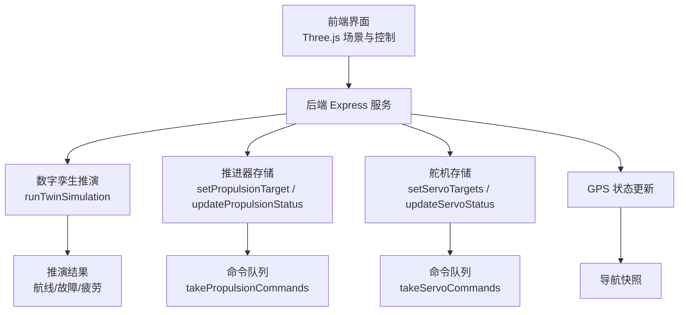
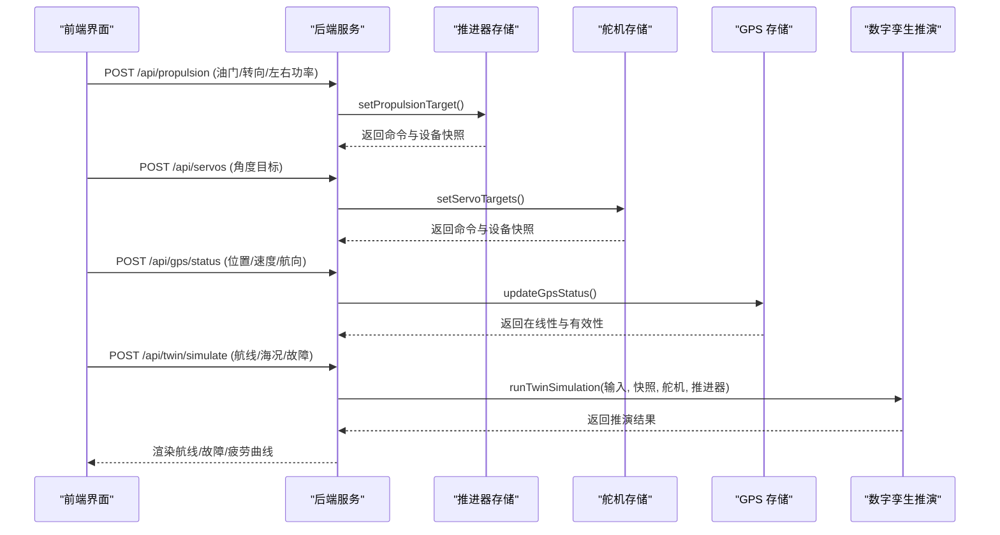
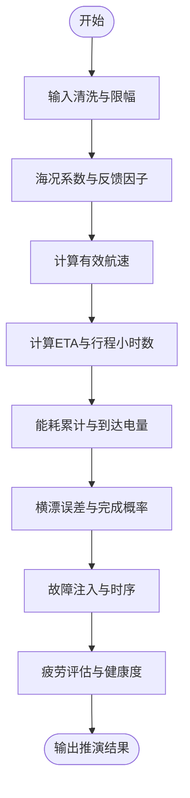
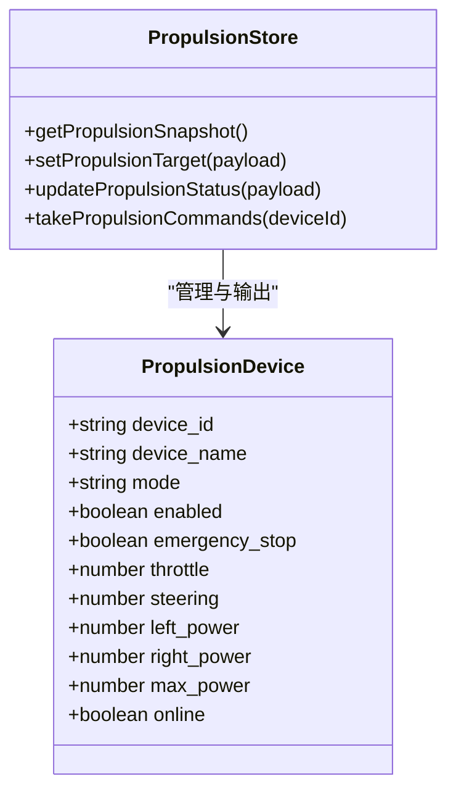
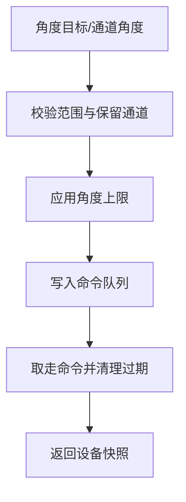
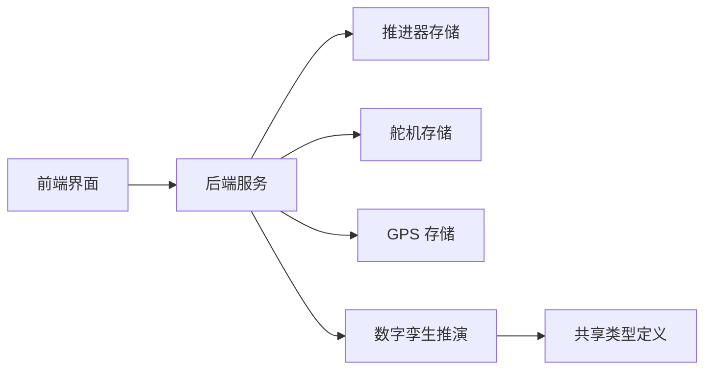

# 运动学模型

<cite>
**本文引用的文件**
- [twin-simulator.ts](file://fishery-digital-twin-platform/apps/backend/src/twin-simulator.ts)
- [propulsion-store.ts](file://fishery-digital-twin-platform/apps/backend/src/propulsion-store.ts)
- [servo-store.ts](file://fishery-digital-twin-platform/apps/backend/src/servo-store.ts)
- [gps-store.ts](file://fishery-digital-twin-platform/apps/backend/src/gps-store.ts)
- [index.ts](file://fishery-digital-twin-platform/apps/backend/src/index.ts)
- [BoatTwinScene.tsx](file://fishery-digital-twin-platform/apps/frontend/src/components/three/BoatTwinScene.tsx)
- [DualLinearActuatorCard.tsx](file://fishery-digital-twin-platform/apps/frontend/src/components/dashboard/DualLinearActuatorCard.tsx)
- [index.ts（共享类型）](file://fishery-digital-twin-platform/packages/shared/src/index.ts)
</cite>

## 目录
1. [简介](#简介)
2. [项目结构](#项目结构)
3. [核心组件](#核心组件)
4. [架构总览](#架构总览)
5. [详细组件分析](#详细组件分析)
6. [依赖关系分析](#依赖关系分析)
7. [性能与数值特性](#性能与数值特性)
8. [故障与排错指南](#故障与排错指南)
9. [结论](#结论)
10. [附录：接口与数据模型](#附录接口与数据模型)

## 简介
本文件围绕“船舶六自由度运动的物理仿真算法”目标，结合仓库中的后端数字孪生推演、推进器控制、舵机控制、GPS导航以及前端可视化等模块，系统梳理当前实现中可用于构建或扩展六自由度运动模型的工程化基础。需要特别说明的是：当前代码库并未提供完整的六自由度刚体动力学微分方程求解器；它提供了面向航线预演、能耗与疲劳估算、执行机构控制与反馈、以及三维可视化驱动的关键能力。本文将基于现有实现，给出可落地的扩展路径与参考流程，帮助读者在既有工程基础上逐步完善到包含平移（前后、左右、上下）与旋转（绕三轴）的完整六自由度仿真。

## 项目结构
- 后端服务负责设备状态管理（推进器、舵机、GPS）、数字孪生推演、API 暴露与日志记录。
- 前端提供三维场景可视化与交互控制，将推进器与舵机的目标/实际值映射为机械臂、线性推杆和云台的姿态变化。
- 共享类型定义贯穿前后端，确保数据契约一致。

图表来源
- [index.ts:322-555](file://fishery-digital-twin-platform/apps/backend/src/index.ts#L322-L555)
- [twin-simulator.ts:74-253](file://fishery-digital-twin-platform/apps/backend/src/twin-simulator.ts#L74-L253)
- [propulsion-store.ts:166-319](file://fishery-digital-twin-platform/apps/backend/src/propulsion-store.ts#L166-L319)
- [servo-store.ts:106-184](file://fishery-digital-twin-platform/apps/backend/src/servo-store.ts#L106-L184)
- [gps-store.ts:55-103](file://fishery-digital-twin-platform/apps/backend/src/gps-store.ts#L55-L103)

章节来源
- [index.ts:322-555](file://fishery-digital-twin-platform/apps/backend/src/index.ts#L322-L555)
- [twin-simulator.ts:74-253](file://fishery-digital-twin-platform/apps/backend/src/twin-simulator.ts#L74-L253)

## 核心组件
- 数字孪生推演：根据输入（航程、目标速度、海况、故障类型与严重度、运行工时、舵机日动作次数）计算有效航速、能耗、到达电量、横漂误差、完成概率、风险等级，并输出时间序列与疲劳评估。
- 推进器控制：支持油门与转向混合或直接左右通道控制，具备在线检测、超时、急停、冷却与循环保护。
- 舵机控制：四通道角度目标与实际反馈，预留通道保护与角度上限限制。
- GPS 状态：WGS84 坐标、速度、航向、定位有效性、在线性判断。
- 前端可视化：将推进器功率映射为线性推杆伸缩，将舵机角度映射为机械臂偏转，用于直观展示控制效果。

章节来源
- [twin-simulator.ts:74-253](file://fishery-digital-twin-platform/apps/backend/src/twin-simulator.ts#L74-L253)
- [propulsion-store.ts:89-231](file://fishery-digital-twin-platform/apps/backend/src/propulsion-store.ts#L89-L231)
- [servo-store.ts:24-184](file://fishery-digital-twin-platform/apps/backend/src/servo-store.ts#L24-L184)
- [gps-store.ts:8-103](file://fishery-digital-twin-platform/apps/backend/src/gps-store.ts#L8-L103)
- [BoatTwinScene.tsx:578-755](file://fishery-digital-twin-platform/apps/frontend/src/components/three/BoatTwinScene.tsx#L578-L755)
- [DualLinearActuatorCard.tsx:45-85](file://fishery-digital-twin-platform/apps/frontend/src/components/dashboard/DualLinearActuatorCard.tsx#L45-L85)

## 架构总览
下图展示了从用户输入到推演结果的全链路调用关系，包括传感器与执行器的反馈闭环。

图表来源
- [index.ts:510-555](file://fishery-digital-twin-platform/apps/backend/src/index.ts#L510-L555)
- [propulsion-store.ts:166-231](file://fishery-digital-twin-platform/apps/backend/src/propulsion-store.ts#L166-L231)
- [servo-store.ts:106-153](file://fishery-digital-twin-platform/apps/backend/src/servo-store.ts#L106-L153)
- [gps-store.ts:59-103](file://fishery-digital-twin-platform/apps/backend/src/gps-store.ts#L59-L103)
- [twin-simulator.ts:74-253](file://fishery-digital-twin-platform/apps/backend/src/twin-simulator.ts#L74-L253)

## 详细组件分析

### 数字孪生推演（航线预演与能耗/疲劳）
- 输入清洗与约束：航程、目标速度、海况等级、故障类型与严重度、运行工时、舵机日动作次数均被规范化与限幅。
- 有效速度与 ETA：考虑海况系数与执行机构反馈因子（电机不对称、舵机跟踪误差），得到有效航速与预计到达时间。
- 能耗与电量：按速度与海况负载计算每小时耗电，累计行程能耗，得出到达电量。
- 横漂误差与完成概率：综合海况、舵机跟踪误差与电机不对称，估计最大横漂误差与任务完成概率，并划分风险等级。
- 故障推演：对舵机卡滞、电机降额、反馈丢失三类故障注入，模拟速度损失与航向漂移，生成故障时序。
- 疲劳评估：推进器、舵机、船体、电池四类部件的等效工作时长与损伤百分比，给出健康度与下次检修建议。

图表来源
- [twin-simulator.ts:35-116](file://fishery-digital-twin-platform/apps/backend/src/twin-simulator.ts#L35-L116)
- [twin-simulator.ts:118-171](file://fishery-digital-twin-platform/apps/backend/src/twin-simulator.ts#L118-L171)
- [twin-simulator.ts:172-253](file://fishery-digital-twin-platform/apps/backend/src/twin-simulator.ts#L172-L253)

章节来源
- [twin-simulator.ts:35-253](file://fishery-digital-twin-platform/apps/backend/src/twin-simulator.ts#L35-L253)

### 推进系统（双推进器差速驱动与舵机转向）
- 混合控制：支持油门+转向合成左右通道功率，或直接设置左右通道功率，适用于双推进器差速驱动。
- 安全与保护：在线检测、命令超时、急停、冷却剩余时间、运行周期与占空比保护。
- 前端映射：将左右功率映射为线性推杆伸缩，便于可视化验证控制逻辑。

图表来源
- [propulsion-store.ts:97-231](file://fishery-digital-twin-platform/apps/backend/src/propulsion-store.ts#L97-L231)
- [propulsion-store.ts:233-319](file://fishery-digital-twin-platform/apps/backend/src/propulsion-store.ts#L233-L319)
- [index.ts:510-538](file://fishery-digital-twin-platform/apps/backend/src/index.ts#L510-L538)

章节来源
- [propulsion-store.ts:89-319](file://fishery-digital-twin-platform/apps/backend/src/propulsion-store.ts#L89-L319)
- [DualLinearActuatorCard.tsx:45-85](file://fishery-digital-twin-platform/apps/frontend/src/components/dashboard/DualLinearActuatorCard.tsx#L45-L85)

### 舵机系统（转向控制与角度限制）
- 四通道舵机：目标角度与实际角度数组，保留通道保护与角度上限限制。
- 命令队列：带 TTL 的命令队列，避免过期指令下发。
- 前端映射：将舵机角度映射为机械臂偏转，用于可视化展示。

图表来源
- [servo-store.ts:24-184](file://fishery-digital-twin-platform/apps/backend/src/servo-store.ts#L24-L184)

章节来源
- [servo-store.ts:24-184](file://fishery-digital-twin-platform/apps/backend/src/servo-store.ts#L24-L184)

### GPS 与导航（航向与速度）
- WGS84 坐标、速度、航向、卫星数、HDOP、高度等字段更新与有效性判断。
- 导航快照：若 GPS 不可用则回退到模拟导航数据。

章节来源
- [gps-store.ts:8-103](file://fishery-digital-twin-platform/apps/backend/src/gps-store.ts#L8-L103)
- [index.ts:197-222](file://fishery-digital-twin-platform/apps/backend/src/index.ts#L197-L222)

### 前端可视化（三维场景驱动）
- 线性推杆：根据推进器功率动态伸缩，反映差速驱动效果。
- 舵机臂：根据舵机角度进行偏转，体现转向控制。
- 云台：根据舵机角度调整 yaw/pitch，用于相机稳定。

章节来源
- [BoatTwinScene.tsx:578-755](file://fishery-digital-twin-platform/apps/frontend/src/components/three/BoatTwinScene.tsx#L578-L755)

## 依赖关系分析
- 后端服务依赖推进器、舵机、GPS 存储模块，统一通过 Express 路由暴露 API。
- 数字孪生推演依赖平台快照、舵机与推进器快照，以计算航线、故障与疲劳。
- 前端依赖后端 API 获取设备状态与推演结果，并在 Three.js 场景中驱动可视化。

图表来源
- [index.ts:322-555](file://fishery-digital-twin-platform/apps/backend/src/index.ts#L322-L555)
- [packages/shared/src/index.ts:1-288](file://fishery-digital-twin-platform/packages/shared/src/index.ts#L1-L288)

章节来源
- [index.ts:322-555](file://fishery-digital-twin-platform/apps/backend/src/index.ts#L322-L555)
- [packages/shared/src/index.ts:1-288](file://fishery-digital-twin-platform/packages/shared/src/index.ts#L1-L288)

## 性能与数值特性
- 数值限幅与舍入：广泛使用 clamp 与 round，保证参数在合理范围内，避免数值溢出与显示抖动。
- 命令队列 TTL：推进器与舵机命令具有短生命周期，防止过期指令造成误操作。
- 在线性判断：基于 last_seen 时间戳判定设备在线，减少无效控制。
- 推演复杂度：推演过程为 O(n) 时间复杂度（n 为序列长度），内存占用低，适合实时或近实时调用。

[本节为通用指导，不直接分析具体文件]

## 故障与排错指南
- 推进器离线：当设备未在线时，主动命令会被拒绝并抛出错误，需检查设备心跳与网络。
- 舵机离线：同样会拒绝离线设备的角度目标，需确认舵机板在线与通道可用。
- GPS 无效：坐标范围校验失败或串口未在线会导致定位无效，需检查串口与卫星信号。
- CORS 与令牌：跨域请求需配置允许源，LAN 控制需携带 X-UISYS-Token。

章节来源
- [propulsion-store.ts:177-180](file://fishery-digital-twin-platform/apps/backend/src/propulsion-store.ts#L177-L180)
- [servo-store.ts:109-111](file://fishery-digital-twin-platform/apps/backend/src/servo-store.ts#L109-L111)
- [gps-store.ts:60-63](file://fishery-digital-twin-platform/apps/backend/src/gps-store.ts#L60-L63)
- [index.ts:143-157](file://fishery-digital-twin-platform/apps/backend/src/index.ts#L143-L157)

## 结论
当前代码库已具备构建六自由度运动仿真的关键工程基础：数字孪生推演提供航线预演、能耗与疲劳评估；推进器与舵机控制提供差速驱动与转向控制；GPS 提供航向与速度；前端可视化可将控制效果直观呈现。若要进一步完善为完整的六自由度刚体动力学仿真，可在现有模块之上引入：
- 平移运动模型：前后（纵荡）、左右（横荡）、上下（垂荡）的微分方程与阻力/浮力/重力建模。
- 旋转运动模型：绕三轴（滚转、俯仰、偏航）的动力学方程，考虑水动力矩与惯性效应。
- 耦合关系：波浪激励下的姿态变化与推进器/舵机对姿态的反馈控制。
- 数值积分：采用稳定的数值方法（如 RK4）求解微分方程，并与现有推演框架集成。

[本节为总结性内容，不直接分析具体文件]

## 附录：接口与数据模型
- 数字孪生输入/输出：航线距离、目标速度、海况等级、故障类型与严重度、运行工时、舵机日动作次数；输出包含路线预测、故障预测、疲劳预测、置信度与假设说明。
- 推进器控制：模式（手动/网页/自动）、使能、急停、油门、转向、左右功率、最大功率。
- 舵机控制：四通道角度目标与实际角度，保留通道与角度上限。
- GPS 状态：坐标、速度、航向、卫星数、HDOP、高度、在线性与有效性。

章节来源
- [packages/shared/src/index.ts:205-288](file://fishery-digital-twin-platform/packages/shared/src/index.ts#L205-L288)
- [packages/shared/src/index.ts:108-194](file://fishery-digital-twin-platform/packages/shared/src/index.ts#L108-L194)
- [packages/shared/src/index.ts:35-63](file://fishery-digital-twin-platform/packages/shared/src/index.ts#L35-L63)