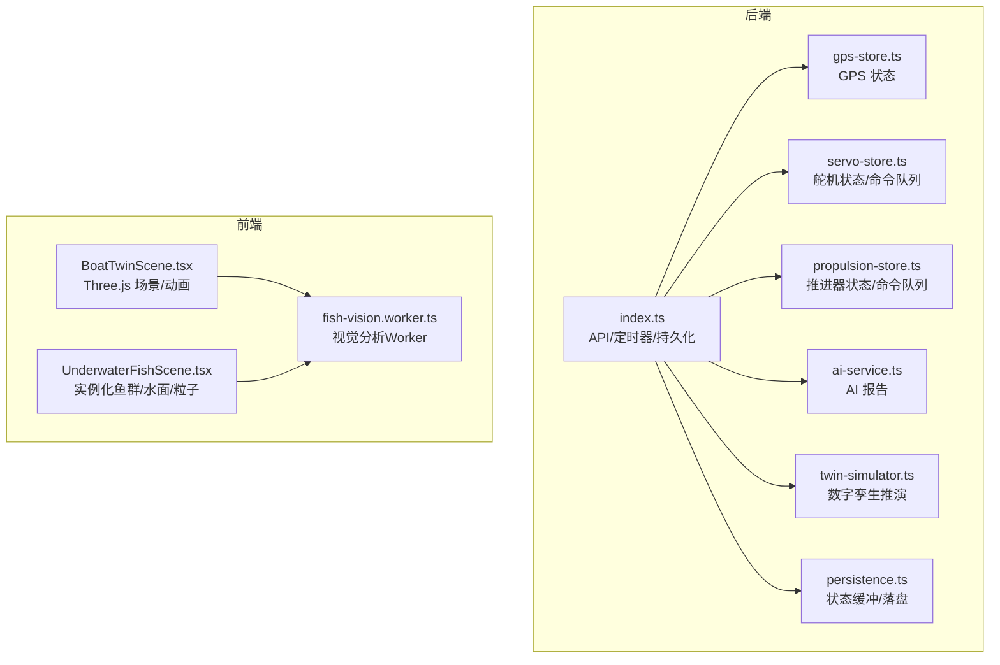
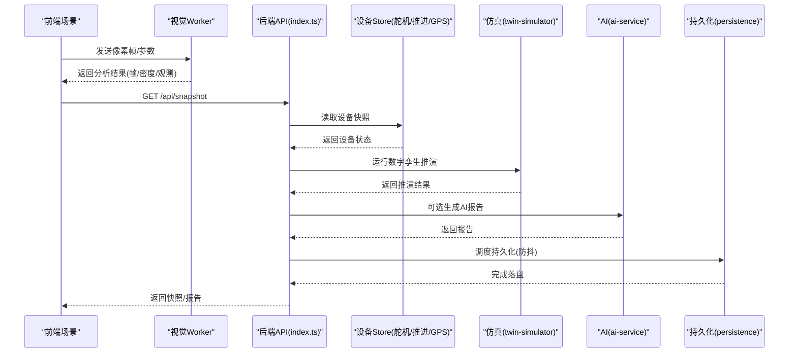
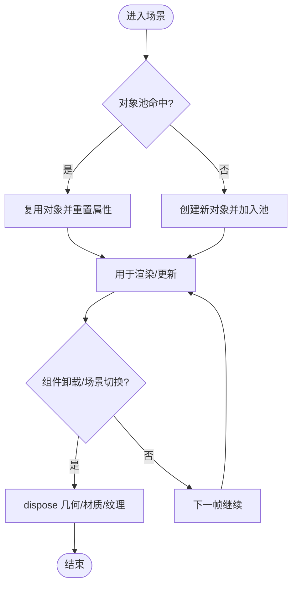
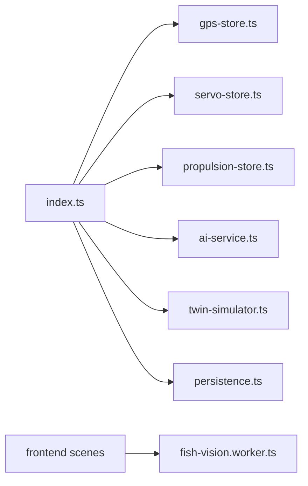
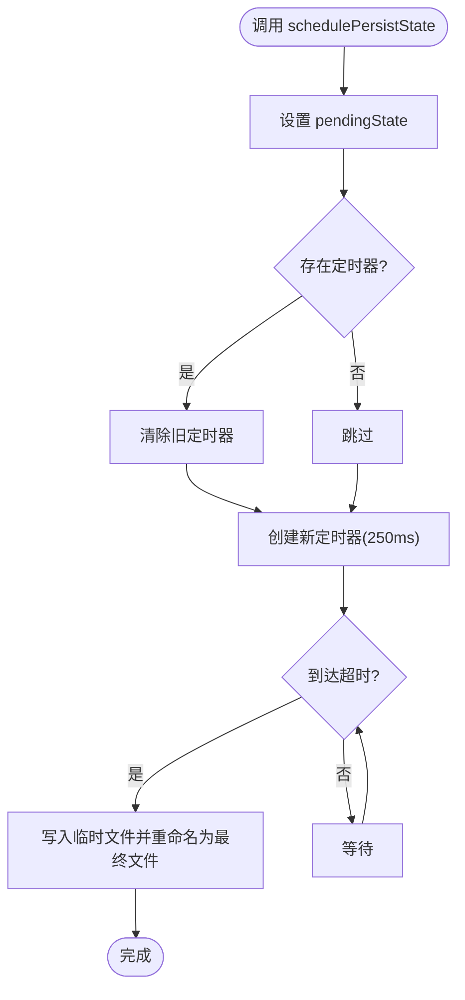
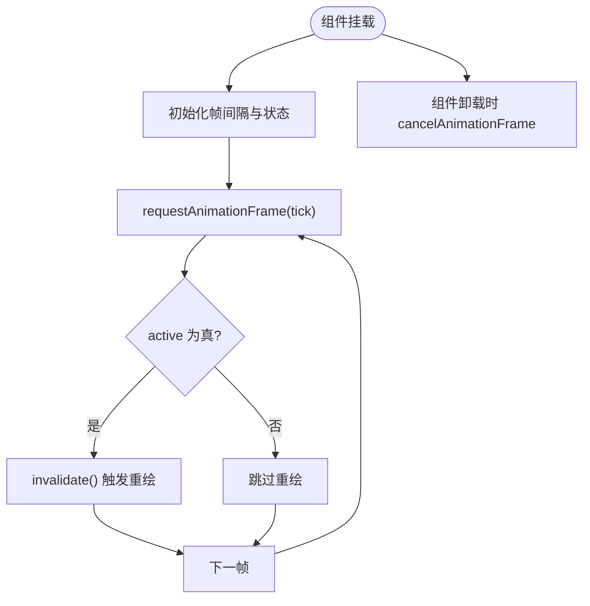
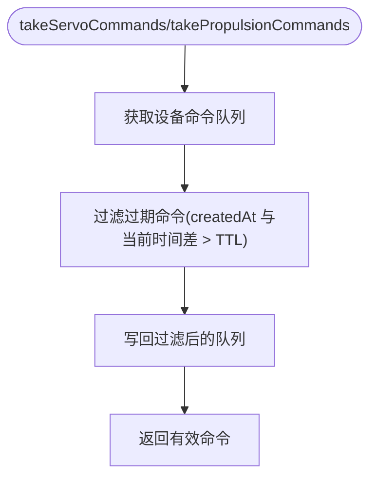

# 内存管理优化

<cite>
**本文引用的文件**
- [apps/backend/src/index.ts](file://fishery-digital-twin-platform/apps/backend/src/index.ts)
- [apps/backend/src/persistence.ts](file://fishery-digital-twin-platform/apps/backend/src/persistence.ts)
- [apps/backend/src/gps-store.ts](file://fishery-digital-twin-platform/apps/backend/src/gps-store.ts)
- [apps/backend/src/servo-store.ts](file://fishery-digital-twin-platform/apps/backend/src/servo-store.ts)
- [apps/backend/src/propulsion-store.ts](file://fishery-digital-twin-platform/apps/backend/src/propulsion-store.ts)
- [apps/backend/src/twin-simulator.ts](file://fishery-digital-twin-platform/apps/backend/src/twin-simulator.ts)
- [apps/backend/src/ai-service.ts](file://fishery-digital-twin-platform/apps/backend/src/ai-service.ts)
- [apps/frontend/src/components/three/BoatTwinScene.tsx](file://fishery-digital-twin-platform/apps/frontend/src/components/three/BoatTwinScene.tsx)
- [apps/frontend/src/components/three/UnderwaterFishScene.tsx](file://fishery-digital-twin-platform/apps/frontend/src/components/three/UnderwaterFishScene.tsx)
- [apps/frontend/src/lib/fish-vision.worker.ts](file://fishery-digital-twin-platform/apps/frontend/src/lib/fish-vision.worker.ts)
</cite>

## 目录
1. [简介](#简介)
2. [项目结构](#项目结构)
3. [核心组件](#核心组件)
4. [架构总览](#架构总览)
5. [详细组件分析](#详细组件分析)
6. [依赖关系分析](#依赖关系分析)
7. [性能与内存考量](#性能与内存考量)
8. [故障排查指南](#故障排查指南)
9. [结论](#结论)
10. [附录：代码级流程图与时序图](#附录代码级流程图与时序图)

## 简介
本文件面向数字孪生系统的内存管理优化，围绕对象池、垃圾回收优化、大对象缓存、内存监控以及前后端具体实现展开。结合仓库中的后端服务、状态存储、仿真计算与前端 Three.js 场景、Web Worker 视觉分析等模块，给出可落地的策略与调试建议，帮助在长时运行与高帧率渲染下保持稳定的内存占用与流畅体验。

## 项目结构
- 后端（Node.js/Express）
  - 入口与服务：HTTP API、UDP 发现广播、定时任务、持久化调度
  - 设备状态：GPS、舵机、推进器状态与命令队列
  - 业务逻辑：AI 报告生成、数字孪生推演
  - 持久化：平台状态缓冲写入与落盘
- 前端（React + Three.js）
  - 3D 场景：船体模型、水下鱼群、水面与粒子
  - 视觉分析：Web Worker 中执行图像分析，主线程仅收发像素与结果
  - UI 交互：控制面板、日志、健康页等

**图示来源**
- [apps/backend/src/index.ts:1-120](file://fishery-digital-twin-platform/apps/backend/src/index.ts#L1-L120)
- [apps/backend/src/persistence.ts:1-68](file://fishery-digital-twin-platform/apps/backend/src/persistence.ts#L1-L68)
- [apps/backend/src/gps-store.ts:1-103](file://fishery-digital-twin-platform/apps/backend/src/gps-store.ts#L1-L103)
- [apps/backend/src/servo-store.ts:1-184](file://fishery-digital-twin-platform/apps/backend/src/servo-store.ts#L1-L184)
- [apps/backend/src/propulsion-store.ts:1-319](file://fishery-digital-twin-platform/apps/backend/src/propulsion-store.ts#L1-L319)
- [apps/backend/src/twin-simulator.ts:1-254](file://fishery-digital-twin-platform/apps/backend/src/twin-simulator.ts#L1-L254)
- [apps/backend/src/ai-service.ts:1-233](file://fishery-digital-twin-platform/apps/backend/src/ai-service.ts#L1-L233)
- [apps/frontend/src/components/three/BoatTwinScene.tsx:1-170](file://fishery-digital-twin-platform/apps/frontend/src/components/three/BoatTwinScene.tsx#L1-L170)
- [apps/frontend/src/components/three/UnderwaterFishScene.tsx:1-120](file://fishery-digital-twin-platform/apps/frontend/src/components/three/UnderwaterFishScene.tsx#L1-L120)
- [apps/frontend/src/lib/fish-vision.worker.ts:1-28](file://fishery-digital-twin-platform/apps/frontend/src/lib/fish-vision.worker.ts#L1-L28)

**章节来源**
- [apps/backend/src/index.ts:1-120](file://fishery-digital-twin-platform/apps/backend/src/index.ts#L1-L120)
- [apps/backend/src/persistence.ts:1-68](file://fishery-digital-twin-platform/apps/backend/src/persistence.ts#L1-L68)

## 核心组件
- 后端状态与命令队列
  - GPS、舵机、推进器均使用 Map 维护设备状态，命令队列按设备隔离并带 TTL 清理，避免无限增长。
  - 快照函数返回浅拷贝或派生数据，减少对外部状态的意外引用。
- 持久化缓冲
  - 通过防抖写入与临时文件原子替换，降低频繁 I/O 对内存和磁盘的压力。
- 前端 3D 场景
  - 使用 requestAnimationFrame 的节流与条件渲染；实例化网格（InstancedMesh）批量绘制，减少 Draw Call 与对象分配。
  - Web Worker 承载图像分析，主线程只传递像素与结果，避免阻塞 UI 线程。
- 数字孪生与 AI 报告
  - 推演与报告生成采用纯函数式计算，输入校验与裁剪，输出结构化对象，便于缓存与序列化。

**章节来源**
- [apps/backend/src/servo-store.ts:1-184](file://fishery-digital-twin-platform/apps/backend/src/servo-store.ts#L1-L184)
- [apps/backend/src/propulsion-store.ts:1-319](file://fishery-digital-twin-platform/apps/backend/src/propulsion-store.ts#L1-L319)
- [apps/backend/src/gps-store.ts:1-103](file://fishery-digital-twin-platform/apps/backend/src/gps-store.ts#L1-L103)
- [apps/backend/src/persistence.ts:1-68](file://fishery-digital-twin-platform/apps/backend/src/persistence.ts#L1-L68)
- [apps/frontend/src/components/three/UnderwaterFishScene.tsx:90-250](file://fishery-digital-twin-platform/apps/frontend/src/components/three/UnderwaterFishScene.tsx#L90-L250)
- [apps/frontend/src/lib/fish-vision.worker.ts:1-28](file://fishery-digital-twin-platform/apps/frontend/src/lib/fish-vision.worker.ts#L1-L28)

## 架构总览
下图展示从前端到后端的请求流与内存关键点：前端通过 Canvas/WebGL 渲染，必要时将像素发送到 Worker 进行图像处理；后端提供 HTTP 接口聚合传感器、设备状态，并调用仿真与 AI 模块生成报告；所有状态变更通过持久化缓冲异步落盘。

**图示来源**
- [apps/backend/src/index.ts:322-346](file://fishery-digital-twin-platform/apps/backend/src/index.ts#L322-L346)
- [apps/backend/src/servo-store.ts:89-104](file://fishery-digital-twin-platform/apps/backend/src/servo-store.ts#L89-L104)
- [apps/backend/src/propulsion-store.ts:149-164](file://fishery-digital-twin-platform/apps/backend/src/propulsion-store.ts#L149-L164)
- [apps/backend/src/gps-store.ts:46-57](file://fishery-digital-twin-platform/apps/backend/src/gps-store.ts#L46-L57)
- [apps/backend/src/twin-simulator.ts:74-254](file://fishery-digital-twin-platform/apps/backend/src/twin-simulator.ts#L74-L254)
- [apps/backend/src/ai-service.ts:167-233](file://fishery-digital-twin-platform/apps/backend/src/ai-service.ts#L167-L233)
- [apps/backend/src/persistence.ts:51-68](file://fishery-digital-twin-platform/apps/backend/src/persistence.ts#L51-L68)

## 详细组件分析

### 对象池技术（3D 模型、几何体、材质）
- 现状与收益
  - 前端使用 InstancedMesh 批量绘制鱼群与尾部，显著减少对象创建与 Draw Call，适合高频更新场景。
  - 场景内多处复用 THREE 基础对象（Vector3、Color、Object3D、Quaternion），避免每帧 new 带来的 GC 压力。
- 建议实践
  - 3D 模型对象池：对重复出现的部件（如浮标、垃圾碎片）建立对象池，复用 Mesh/Group，仅在需要时激活/隐藏。
  - 几何体对象池：对常用几何（球体、锥体、平面）缓存共享实例，避免重复构造 BufferGeometry。
  - 材质对象池：对标准材质与物理材质进行缓存，按需设置颜色/粗糙度/金属度，避免频繁 new Material。
  - 释放策略：组件卸载或场景切换时显式 dispose 几何体与材质，断开引用，确保 GPU 资源释放。

**章节来源**
- [apps/frontend/src/components/three/UnderwaterFishScene.tsx:90-250](file://fishery-digital-twin-platform/apps/frontend/src/components/three/UnderwaterFishScene.tsx#L90-L250)
- [apps/frontend/src/components/three/BoatTwinScene.tsx:128-151](file://fishery-digital-twin-platform/apps/frontend/src/components/three/BoatTwinScene.tsx#L128-L151)

### 垃圾回收优化（弱引用、循环引用、及时释放）
- 现状
  - 后端 Store 使用 Map 保存设备状态，命令队列按设备隔离并在读取时按时间戳过滤过期项，避免历史堆积。
  - 前端使用 useRef 持有 DOM/GL 相关引用，配合 useEffect 清理定时器与事件监听。
- 建议实践
  - 弱引用：对大型对象集合（如历史轨迹、日志）使用 WeakMap/WeakSet 缓存视图层映射，避免阻止 GC。
  - 避免循环引用：在组件卸载或 Store 清理时主动断开回调链与订阅，防止闭包长期持有大对象。
  - 及时释放：对不再使用的 BufferGeometry、Texture、Material 调用 dispose；对 URL.createObjectURL 生成的 URL 及时 revoke。

**章节来源**
- [apps/backend/src/servo-store.ts:175-184](file://fishery-digital-twin-platform/apps/backend/src/servo-store.ts#L175-L184)
- [apps/backend/src/propulsion-store.ts:310-319](file://fishery-digital-twin-platform/apps/backend/src/propulsion-store.ts#L310-L319)
- [apps/frontend/src/components/three/BoatTwinScene.tsx:128-151](file://fishery-digital-twin-platform/apps/frontend/src/components/three/BoatTwinScene.tsx#L128-L151)

### 大对象缓存机制（LRU、内存限制、淘汰算法）
- 现状
  - 水质历史数组使用固定长度切片（最大历史点数量），避免无限增长。
  - 系统日志数组头部插入并限制长度，保证最新日志可见且内存可控。
- 建议实践
  - LRU 缓存：为 AI 报告、仿真结果、模型加载结果建立 LRU 缓存，基于访问频率淘汰旧项。
  - 内存限制：为缓存设定最大条目数与最大字节数阈值，超过阈值触发淘汰或降级。
  - 淘汰策略：优先淘汰冷数据（长时间未访问），保留热点数据；对大对象采用分片缓存与懒加载。

**章节来源**
- [apps/backend/src/index.ts:78-91](file://fishery-digital-twin-platform/apps/backend/src/index.ts#L78-L91)
- [apps/backend/src/index.ts:116-129](file://fishery-digital-twin-platform/apps/backend/src/index.ts#L116-L129)

### 内存监控方案（统计、泄漏检测、性能分析）
- 后端
  - 进程级监控：记录 RSS/HeapUsed/HeapTotal，定期采样并暴露健康接口。
  - 泄漏检测：启用 --inspect 或集成 APM，观察堆快照差异；关注 Store 中 Map 大小与命令队列长度。
  - 性能分析：使用 Node 内置 Profiler 或火焰图定位热点路径（如 AI 报告生成、仿真计算）。
- 前端
  - 浏览器性能面板：观察 FPS、JS Heap、GPU Memory；重点检查 WebGL 资源是否被正确释放。
  - 泄漏检测：对比不同页面/场景的堆快照，查找未被释放的 GL 资源与事件监听。
  - 工具建议：Chrome DevTools Performance/Memory、React DevTools Profiler、Three.js Inspector。

[本节为通用指导，不直接分析具体文件]

### 前端内存优化（组件卸载、事件监听、定时器）
- 现状
  - 使用 requestAnimationFrame 控制刷新频率，并在卸载时取消。
  - 多处使用 setInterval/setTimeout 进行轮询或延时，需在卸载时清理。
  - 视觉分析在 Worker 中进行，主线程仅处理消息，降低 UI 线程压力。
- 建议实践
  - 组件卸载：统一在 useEffect 返回清理函数中移除事件监听、取消定时器与动画帧。
  - 事件监听：对 window/document 的事件监听使用命名函数或封装 Hook，确保能准确移除。
  - 定时器管理：集中管理定时器 ID，避免重复启动；对高频定时器做节流/合并。
  - 资源释放：对创建的 Blob URL、OffscreenCanvas、WebGL 资源在卸载时释放。

**章节来源**
- [apps/frontend/src/components/three/BoatTwinScene.tsx:128-151](file://fishery-digital-twin-platform/apps/frontend/src/components/three/BoatTwinScene.tsx#L128-L151)
- [apps/frontend/src/lib/fish-vision.worker.ts:1-28](file://fishery-digital-twin-platform/apps/frontend/src/lib/fish-vision.worker.ts#L1-L28)

### 后端内存优化（进程管理、缓冲区、流式处理）
- 现状
  - Express 配置 JSON 解析大小限制，避免超大请求导致内存峰值。
  - 持久化采用缓冲+防抖写入，减少频繁 I/O 与锁竞争。
  - 设备命令队列带 TTL，读取时过滤过期命令，避免历史堆积。
- 建议实践
  - 进程管理：合理设置 Node 内存上限，监控 OOM 风险；对长任务拆分批处理。
  - 缓冲区优化：对大数组（如水样历史、日志）使用定长结构与惰性计算；避免不必要的深拷贝。
  - 流式处理：对大响应或大文件传输使用流式读写，降低峰值内存；对网络请求设置超时与重试。

**章节来源**
- [apps/backend/src/index.ts:101-110](file://fishery-digital-twin-platform/apps/backend/src/index.ts#L101-L110)
- [apps/backend/src/persistence.ts:17-30](file://fishery-digital-twin-platform/apps/backend/src/persistence.ts#L17-L30)
- [apps/backend/src/servo-store.ts:175-184](file://fishery-digital-twin-platform/apps/backend/src/servo-store.ts#L175-L184)
- [apps/backend/src/propulsion-store.ts:310-319](file://fishery-digital-twin-platform/apps/backend/src/propulsion-store.ts#L310-L319)

## 依赖关系分析
- 后端模块耦合
  - index.ts 作为入口，依赖各 Store 获取设备状态，调用仿真与 AI 模块生成结果，并通过 persistence 进行状态落盘。
  - Store 之间相对独立，通过统一的快照接口暴露状态，降低耦合度。
- 前后端交互
  - 前端通过 HTTP 获取快照与日志，必要时向 Worker 发送像素帧进行分析，提升渲染与计算效率。
- 潜在风险
  - 若 Store 中 Map 或数组无界增长，可能导致内存泄漏；需确保 TTL 与限长策略生效。
  - 前端场景若未正确释放 GL 资源，会导致 GPU 内存持续增长。

**图示来源**
- [apps/backend/src/index.ts:1-120](file://fishery-digital-twin-platform/apps/backend/src/index.ts#L1-L120)
- [apps/backend/src/gps-store.ts:1-103](file://fishery-digital-twin-platform/apps/backend/src/gps-store.ts#L1-L103)
- [apps/backend/src/servo-store.ts:1-184](file://fishery-digital-twin-platform/apps/backend/src/servo-store.ts#L1-L184)
- [apps/backend/src/propulsion-store.ts:1-319](file://fishery-digital-twin-platform/apps/backend/src/propulsion-store.ts#L1-L319)
- [apps/backend/src/ai-service.ts:1-233](file://fishery-digital-twin-platform/apps/backend/src/ai-service.ts#L1-L233)
- [apps/backend/src/twin-simulator.ts:1-254](file://fishery-digital-twin-platform/apps/backend/src/twin-simulator.ts#L1-L254)
- [apps/backend/src/persistence.ts:1-68](file://fishery-digital-twin-platform/apps/backend/src/persistence.ts#L1-L68)
- [apps/frontend/src/lib/fish-vision.worker.ts:1-28](file://fishery-digital-twin-platform/apps/frontend/src/lib/fish-vision.worker.ts#L1-L28)

**章节来源**
- [apps/backend/src/index.ts:1-120](file://fishery-digital-twin-platform/apps/backend/src/index.ts#L1-L120)

## 性能与内存考量
- 渲染性能
  - 使用 InstancedMesh 批量绘制，减少 Draw Call；复用几何与材质，避免重复创建。
  - 控制帧率与渲染范围，非活跃场景降低刷新频率或暂停渲染。
- 计算性能
  - 将耗时计算（如图像分析）放入 Worker，避免阻塞 UI 线程。
  - 后端仿真与 AI 报告生成采用纯函数与输入裁剪，减少不必要计算。
- 内存稳定性
  - 对历史数据与日志实施限长策略；对命令队列实施 TTL 清理。
  - 对大对象使用缓存与淘汰策略，避免无界增长。

[本节为通用指导，不直接分析具体文件]

## 故障排查指南
- 后端
  - 检查 Store 中 Map 大小与命令队列长度，确认 TTL 清理是否生效。
  - 观察持久化写入频率与失败日志，避免频繁 I/O 导致的抖动。
  - 使用 Node 性能分析工具定位热点函数（如 AI 报告生成、仿真计算）。
- 前端
  - 使用浏览器性能面板检查 FPS 与 JS Heap，关注 WebGL 资源是否释放。
  - 检查事件监听与定时器是否在组件卸载时被清理。
  - 对 Worker 进行消息量与处理时延监控，避免主线程过载。

**章节来源**
- [apps/backend/src/servo-store.ts:175-184](file://fishery-digital-twin-platform/apps/backend/src/servo-store.ts#L175-L184)
- [apps/backend/src/propulsion-store.ts:310-319](file://fishery-digital-twin-platform/apps/backend/src/propulsion-store.ts#L310-L319)
- [apps/backend/src/persistence.ts:17-30](file://fishery-digital-twin-platform/apps/backend/src/persistence.ts#L17-L30)
- [apps/frontend/src/components/three/BoatTwinScene.tsx:128-151](file://fishery-digital-twin-platform/apps/frontend/src/components/three/BoatTwinScene.tsx#L128-L151)

## 结论
该数字孪生系统在前后端均具备较好的内存管理基础：后端通过 Store 的 Map 与命令队列 TTL、持久化缓冲与限长历史，前端通过 InstancedMesh、对象复用与 Worker 计算，有效降低了内存峰值与 GC 压力。为进一步优化，建议引入对象池、LRU 缓存与更严格的资源释放策略，并结合监控与性能分析工具持续跟踪内存趋势，确保长时运行的稳定性与流畅性。

## 附录：代码级流程图与时序图

### 后端持久化流程（防抖写入）

**图示来源**
- [apps/backend/src/persistence.ts:51-68](file://fishery-digital-twin-platform/apps/backend/src/persistence.ts#L51-L68)

### 前端场景帧循环（节流与清理）

**图示来源**
- [apps/frontend/src/components/three/BoatTwinScene.tsx:128-151](file://fishery-digital-twin-platform/apps/frontend/src/components/three/BoatTwinScene.tsx#L128-L151)

### 设备命令队列清理（TTL）

**图示来源**
- [apps/backend/src/servo-store.ts:175-184](file://fishery-digital-twin-platform/apps/backend/src/servo-store.ts#L175-L184)
- [apps/backend/src/propulsion-store.ts:310-319](file://fishery-digital-twin-platform/apps/backend/src/propulsion-store.ts#L310-L319)