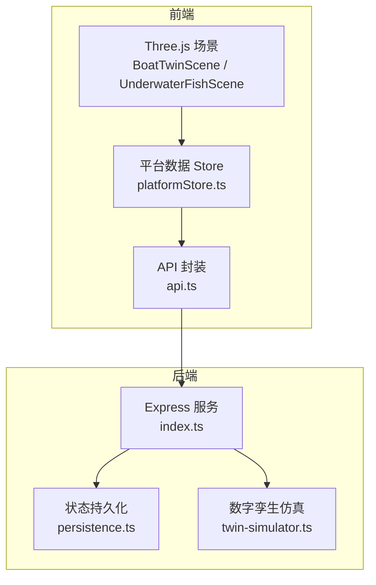
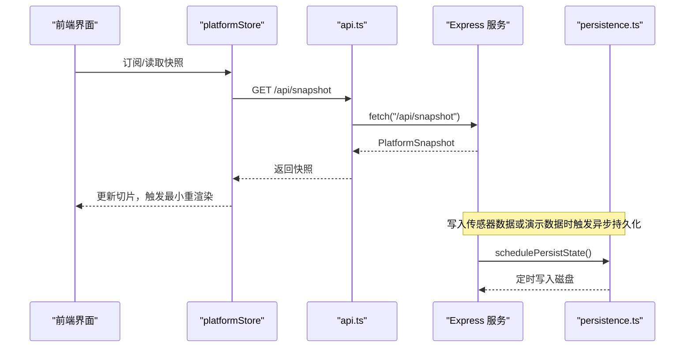
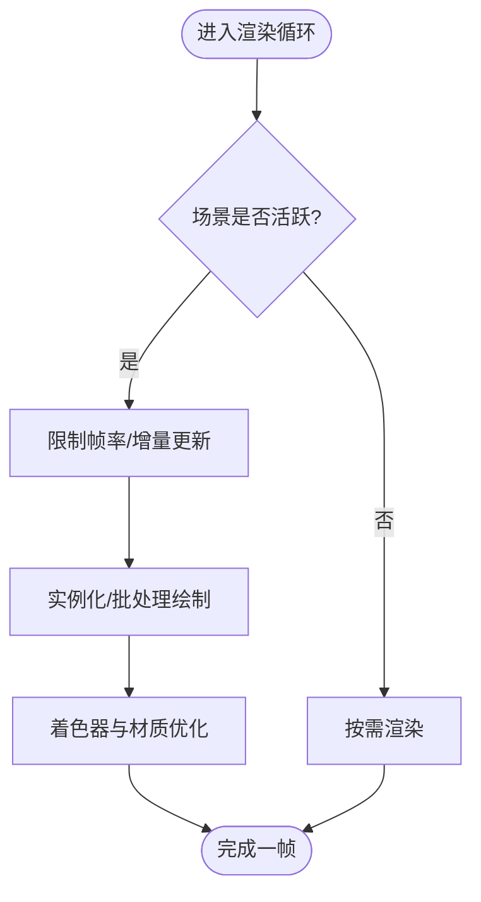
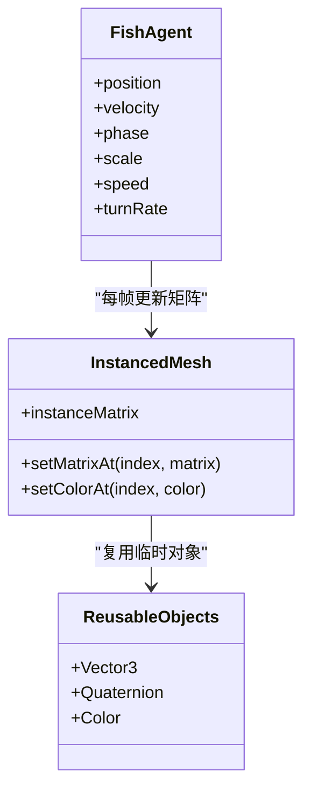
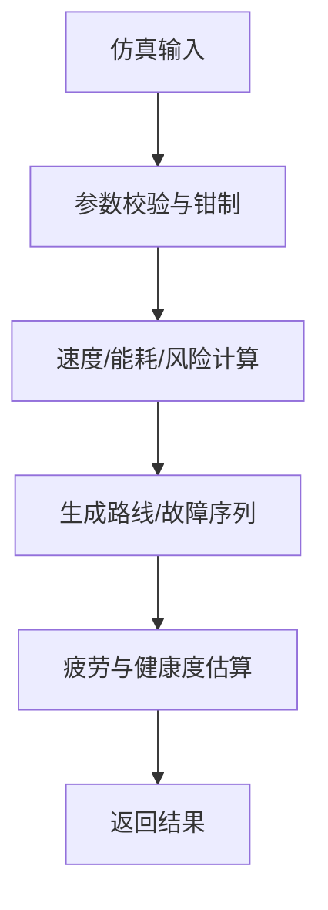
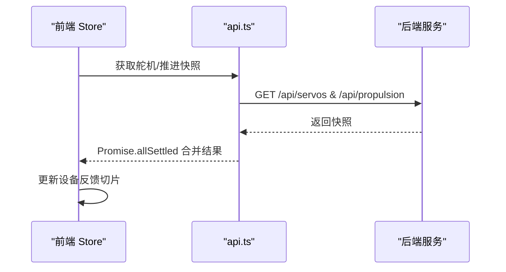
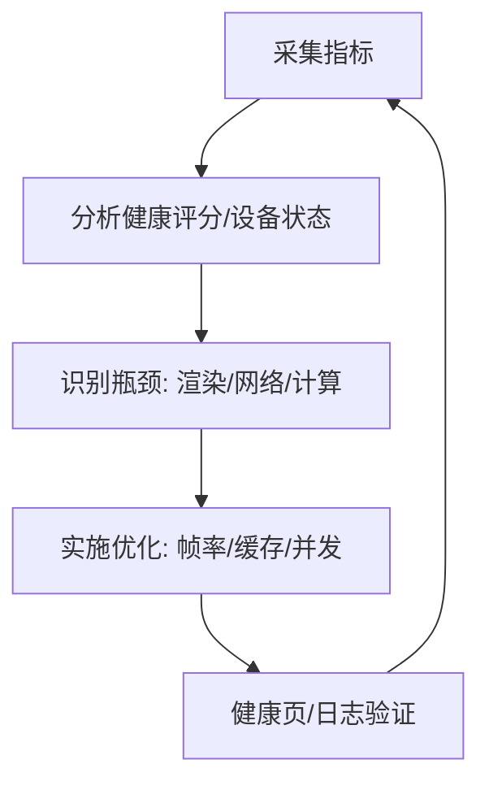
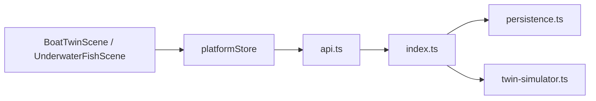

# 性能优化策略

<cite>
**本文引用的文件**
- [README.md](file://fishery-digital-twin-platform/README.md)
- [后端入口 index.ts](file://fishery-digital-twin-platform/apps/backend/src/index.ts)
- [持久化 persistence.ts](file://fishery-digital-twin-platform/apps/backend/src/persistence.ts)
- [数字孪生仿真 twin-simulator.ts](file://fishery-digital-twin-platform/apps/backend/src/twin-simulator.ts)
- [前端平台数据 store platformStore.ts](file://fishery-digital-twin-platform/apps/frontend/src/lib/platformStore.ts)
- [前端 API 封装 api.ts](file://fishery-digital-twin-platform/apps/frontend/src/lib/api.ts)
- [三维船模场景 BoatTwinScene.tsx](file://fishery-digital-twin-platform/apps/frontend/src/components/three/BoatTwinScene.tsx)
- [水下鱼群场景 UnderwaterFishScene.tsx](file://fishery-digital-twin-platform/apps/frontend/src/components/three/UnderwaterFishScene.tsx)
- [健康页面 HealthPage.tsx](file://fishery-digital-twin-platform/apps/frontend/src/components/dashboard/HealthPage.tsx)
</cite>

## 目录
1. [简介](#简介)
2. [项目结构](#项目结构)
3. [核心组件](#核心组件)
4. [架构总览](#架构总览)
5. [详细组件分析](#详细组件分析)
6. [依赖关系分析](#依赖关系分析)
7. [性能考量](#性能考量)
8. [故障排查指南](#故障排查指南)
9. [结论](#结论)
10. [附录](#附录)

## 简介
本文件面向数字孪生系统的性能调优与监控，覆盖渲染、内存、计算、网络通信和监控五大维度。内容基于仓库中前后端代码的实际实现，给出可落地的优化建议、流程图和架构图，帮助开发者定位瓶颈并持续改进系统表现。

## 项目结构
系统采用前后端分离：
- 后端使用 Express 提供 HTTP 接口、UDP 设备发现、状态持久化与数字孪生仿真。
- 前端使用 Next.js + React Three Fiber 构建 3D 可视化、图表与健康页，并通过轮询获取平台快照和设备反馈。
- 共享类型位于 packages/shared（未在本节展开）。

**图示来源**
- [后端入口 index.ts:56-110](file://fishery-digital-twin-platform/apps/backend/src/index.ts#L56-L110)
- [前端平台数据 store platformStore.ts:20-65](file://fishery-digital-twin-platform/apps/frontend/src/lib/platformStore.ts#L20-L65)
- [前端 API 封装 api.ts:6-24](file://fishery-digital-twin-platform/apps/frontend/src/lib/api.ts#L6-L24)

**章节来源**
- [README.md:16-28](file://fishery-digital-twin-platform/README.md#L16-L28)
- [后端入口 index.ts:56-110](file://fishery-digital-twin-platform/apps/backend/src/index.ts#L56-L110)
- [前端平台数据 store platformStore.ts:20-65](file://fishery-digital-twin-platform/apps/frontend/src/lib/platformStore.ts#L20-L65)

## 核心组件
- 后端服务：HTTP 路由、CORS、令牌鉴权、传感器数据接收、设备状态聚合、AI 报告限流、数字孪生推演、UDP 自动发现、状态持久化。
- 前端数据层：统一 Store 以固定间隔轮询平台快照和设备反馈，切片更新避免不必要重渲染。
- 3D 渲染：船模场景含自定义水面着色器、设备反馈动画；水下鱼群使用实例化网格与粒子系统。
- 健康与监控：健康页汇总设备状态、电池、告警，并提供手动检查能力。

**章节来源**
- [后端入口 index.ts:101-157](file://fishery-digital-twin-platform/apps/backend/src/index.ts#L101-L157)
- [后端入口 index.ts:322-557](file://fishery-digital-twin-platform/apps/backend/src/index.ts#L322-L557)
- [持久化 persistence.ts:17-68](file://fishery-digital-twin-platform/apps/backend/src/persistence.ts#L17-L68)
- [前端平台数据 store platformStore.ts:20-139](file://fishery-digital-twin-platform/apps/frontend/src/lib/platformStore.ts#L20-L139)
- [健康页面 HealthPage.tsx:37-47](file://fishery-digital-twin-platform/apps/frontend/src/components/dashboard/HealthPage.tsx#L37-L47)

## 架构总览
下图展示一次“平台快照”请求从前端到后端的调用链，以及后端内部的数据组装与持久化触发。

**图示来源**
- [前端平台数据 store platformStore.ts:98-139](file://fishery-digital-twin-platform/apps/frontend/src/lib/platformStore.ts#L98-L139)
- [前端 API 封装 api.ts:26-28](file://fishery-digital-twin-platform/apps/frontend/src/lib/api.ts#L26-L28)
- [后端入口 index.ts:336-341](file://fishery-digital-twin-platform/apps/backend/src/index.ts#L336-L341)
- [持久化 persistence.ts:51-68](file://fishery-digital-twin-platform/apps/backend/src/persistence.ts#L51-L68)

## 详细组件分析

### 渲染性能优化
- 帧率控制与按需渲染
  - 船模场景通过自定义 SceneTicker 限制刷新频率，降低无效绘制开销。
  - 水下场景根据 active 切换 frameloop 模式，非活跃时按需渲染。
- 实例化与批处理
  - 鱼群使用 InstancedMesh 批量绘制，减少 draw call。
  - 动态顶点缓冲仅标记 needsUpdate，避免全量重建。
- 着色器与材质
  - 水面使用轻量 GLSL 着色器，结合半透明材质与深度写关闭，提升视觉效率。
  - 合理设置抗锯齿、alpha 与 powerPreference，平衡画质与能耗。
- 模型与几何体
  - 使用低多边形基础几何体组合复杂效果，避免高面数模型带来的 GPU 压力。
  - 对可见性进行裁剪（如 frustumCulled=false 仅在必要时关闭），减少不可见对象开销。

**图示来源**
- [三维船模场景 BoatTwinScene.tsx:92-151](file://fishery-digital-twin-platform/apps/frontend/src/components/three/BoatTwinScene.tsx#L92-L151)
- [水下鱼群场景 UnderwaterFishScene.tsx:38-49](file://fishery-digital-twin-platform/apps/frontend/src/components/three/UnderwaterFishScene.tsx#L38-L49)
- [水下鱼群场景 UnderwaterFishScene.tsx:90-160](file://fishery-digital-twin-platform/apps/frontend/src/components/three/UnderwaterFishScene.tsx#L90-L160)
- [水下鱼群场景 UnderwaterFishScene.tsx:252-283](file://fishery-digital-twin-platform/apps/frontend/src/components/three/UnderwaterFishScene.tsx#L252-L283)

**章节来源**
- [三维船模场景 BoatTwinScene.tsx:92-151](file://fishery-digital-twin-platform/apps/frontend/src/components/three/BoatTwinScene.tsx#L92-L151)
- [水下鱼群场景 UnderwaterFishScene.tsx:90-160](file://fishery-digital-twin-platform/apps/frontend/src/components/three/UnderwaterFishScene.tsx#L90-L160)
- [水下鱼群场景 UnderwaterFishScene.tsx:252-283](file://fishery-digital-twin-platform/apps/frontend/src/components/three/UnderwaterFishScene.tsx#L252-L283)

### 内存管理优化
- 对象复用与缓存
  - 使用 useMemo 缓存颜色、向量、四元数等临时对象，避免每帧分配。
  - 实例化网格的 instanceMatrix 复用，仅更新必要属性。
- 垃圾回收友好
  - 避免在高频回调中创建新数组/对象；使用原地修改与 BufferAttribute 更新。
  - 将大对象（如 Float32Array）置于外部引用，生命周期可控。
- 资源卸载策略
  - 非活跃场景关闭渲染循环，减少内存占用。
  - 组件卸载时清理定时器与监听器，防止泄漏。

**图示来源**
- [水下鱼群场景 UnderwaterFishScene.tsx:102-134](file://fishery-digital-twin-platform/apps/frontend/src/components/three/UnderwaterFishScene.tsx#L102-L134)
- [水下鱼群场景 UnderwaterFishScene.tsx:162-236](file://fishery-digital-twin-platform/apps/frontend/src/components/three/UnderwaterFishScene.tsx#L162-L236)

**章节来源**
- [水下鱼群场景 UnderwaterFishScene.tsx:102-134](file://fishery-digital-twin-platform/apps/frontend/src/components/three/UnderwaterFishScene.tsx#L102-L134)
- [水下鱼群场景 UnderwaterFishScene.tsx:162-236](file://fishery-digital-twin-platform/apps/frontend/src/components/three/UnderwaterFishScene.tsx#L162-L236)

### 计算性能优化
- 并行与并发
  - 前端同时拉取舵机与推进状态，使用 Promise.allSettled 提高吞吐。
- 算法复杂度
  - 数字孪生仿真采用常数级数学运算与分段线性插值，避免昂贵迭代。
  - 输入参数钳制与归一化，减少分支判断与异常路径。
- 缓存策略
  - 后端维护水样历史与电池列表，限制最大长度，避免无限增长。
  - AI 报告生成限频，降低外部 API 压力。
- 批处理技术
  - 传感器数据批量写入，合并多次更新为一次持久化。

**图示来源**
- [数字孪生仿真 twin-simulator.ts:35-50](file://fishery-digital-twin-platform/apps/backend/src/twin-simulator.ts#L35-L50)
- [数字孪生仿真 twin-simulator.ts:74-116](file://fishery-digital-twin-platform/apps/backend/src/twin-simulator.ts#L74-L116)
- [数字孪生仿真 twin-simulator.ts:155-189](file://fishery-digital-twin-platform/apps/backend/src/twin-simulator.ts#L155-L189)

**章节来源**
- [前端平台数据 store platformStore.ts:116-130](file://fishery-digital-twin-platform/apps/frontend/src/lib/platformStore.ts#L116-L130)
- [数字孪生仿真 twin-simulator.ts:35-50](file://fishery-digital-twin-platform/apps/backend/src/twin-simulator.ts#L35-L50)
- [数字孪生仿真 twin-simulator.ts:74-116](file://fishery-digital-twin-platform/apps/backend/src/twin-simulator.ts#L74-L116)
- [数字孪生仿真 twin-simulator.ts:155-189](file://fishery-digital-twin-platform/apps/backend/src/twin-simulator.ts#L155-L189)

### 网络通信优化
- 数据压缩
  - 当前未启用服务端压缩；可在中间件层开启 gzip/br 以减少响应体积。
- 增量更新
  - 前端 Store 使用切片更新，避免整树重渲染；设备反馈与平台快照分片独立。
- 连接复用
  - 使用浏览器原生 fetch 复用 TCP 连接；统一封装添加超时与令牌头。
- 错误重试机制
  - 建议在 Store 层增加指数退避重试与失败降级（回退数据），当前已具备连接状态标志。

**图示来源**
- [前端平台数据 store platformStore.ts:116-130](file://fishery-digital-twin-platform/apps/frontend/src/lib/platformStore.ts#L116-L130)
- [前端 API 封装 api.ts:6-24](file://fishery-digital-twin-platform/apps/frontend/src/lib/api.ts#L6-L24)
- [后端入口 index.ts:475-538](file://fishery-digital-twin-platform/apps/backend/src/index.ts#L475-L538)

**章节来源**
- [前端平台数据 store platformStore.ts:116-130](file://fishery-digital-twin-platform/apps/frontend/src/lib/platformStore.ts#L116-L130)
- [前端 API 封装 api.ts:6-24](file://fishery-digital-twin-platform/apps/frontend/src/lib/api.ts#L6-L24)
- [后端入口 index.ts:475-538](file://fishery-digital-twin-platform/apps/backend/src/index.ts#L475-L538)

### 性能监控方案
- 关键指标采集
  - 健康页汇总在线设备、电池电量、告警数量与健康评分，便于快速识别问题。
  - 后端 /api/health 暴露服务状态、数据模式、AI/GPS/设备快照摘要。
- 性能瓶颈识别
  - 通过健康页与日志页观察设备离线、通信异常与数据延迟。
  - 关注 3D 场景帧率与渲染负载（实例化网格、着色器复杂度）。
- 自动化测试
  - 使用 npm test/typecheck/build/audit 保障质量基线。
- 持续优化流程
  - 结合健康检查按钮触发快照与反馈刷新，验证优化效果。
  - 定期运行诊断脚本，确保端口、防火墙与令牌配置正确。

**图示来源**
- [健康页面 HealthPage.tsx:13-35](file://fishery-digital-twin-platform/apps/frontend/src/components/dashboard/HealthPage.tsx#L13-L35)
- [后端入口 index.ts:322-334](file://fishery-digital-twin-platform/apps/backend/src/index.ts#L322-L334)

**章节来源**
- [健康页面 HealthPage.tsx:13-35](file://fishery-digital-twin-platform/apps/frontend/src/components/dashboard/HealthPage.tsx#L13-L35)
- [后端入口 index.ts:322-334](file://fishery-digital-twin-platform/apps/backend/src/index.ts#L322-L334)

## 依赖关系分析
- 前端依赖
  - 3D 场景依赖 React Three Fiber/Drei，Store 依赖统一数据源。
  - API 封装集中处理超时、令牌与错误。
- 后端依赖
  - Express 路由依赖共享类型定义；持久化模块负责磁盘 IO。
  - 数字孪生仿真依赖输入参数校验与常量模型。

**图示来源**
- [前端平台数据 store platformStore.ts:20-65](file://fishery-digital-twin-platform/apps/frontend/src/lib/platformStore.ts#L20-L65)
- [前端 API 封装 api.ts:26-28](file://fishery-digital-twin-platform/apps/frontend/src/lib/api.ts#L26-L28)
- [后端入口 index.ts:336-341](file://fishery-digital-twin-platform/apps/backend/src/index.ts#L336-L341)
- [持久化 persistence.ts:51-68](file://fishery-digital-twin-platform/apps/backend/src/persistence.ts#L51-L68)
- [数字孪生仿真 twin-simulator.ts:74-116](file://fishery-digital-twin-platform/apps/backend/src/twin-simulator.ts#L74-L116)

**章节来源**
- [前端平台数据 store platformStore.ts:20-65](file://fishery-digital-twin-platform/apps/frontend/src/lib/platformStore.ts#L20-L65)
- [前端 API 封装 api.ts:26-28](file://fishery-digital-twin-platform/apps/frontend/src/lib/api.ts#L26-L28)
- [后端入口 index.ts:336-341](file://fishery-digital-twin-platform/apps/backend/src/index.ts#L336-L341)
- [持久化 persistence.ts:51-68](file://fishery-digital-twin-platform/apps/backend/src/persistence.ts#L51-L68)
- [数字孪生仿真 twin-simulator.ts:74-116](file://fishery-digital-twin-platform/apps/backend/src/twin-simulator.ts#L74-L116)

## 性能考量
- 渲染
  - 优先使用实例化网格与低多边形几何体；关闭不必要的深度写与透明度混合。
  - 使用帧率限制与按需渲染，避免后台页面持续消耗 GPU。
- 内存
  - 复用临时对象，避免高频分配；及时清理定时器与监听器。
  - 控制历史数据长度，防止内存膨胀。
- 计算
  - 简化仿真模型，使用常数时间复杂度算法；输入参数钳制减少分支。
  - 利用并发请求合并结果，降低整体延迟。
- 网络
  - 统一封装请求，增加超时与令牌；考虑启用压缩与重试策略。
  - 使用切片更新减少重渲染，提升 UI 流畅度。
- 监控
  - 通过健康页与日志页持续观察系统状态；结合自动化测试保障质量。

[本节为通用指导，不直接分析具体文件]

## 故障排查指南
- 常见问题
  - 设备离线：检查健康页设备状态与通信模块；确认 UDP 端口与令牌配置。
  - 数据延迟：查看 Store 轮询间隔与 API 超时；必要时调整采样频率。
  - 渲染卡顿：降低实例数量、关闭非必要特效；检查着色器复杂度。
- 定位方法
  - 使用健康页手动检查，触发快照与反馈刷新。
  - 查看后端日志与 /api/health 输出，确认服务状态与数据模式。
  - 检查持久化文件是否被频繁写入导致 IO 阻塞。

**章节来源**
- [健康页面 HealthPage.tsx:37-47](file://fishery-digital-twin-platform/apps/frontend/src/components/dashboard/HealthPage.tsx#L37-L47)
- [后端入口 index.ts:322-334](file://fishery-digital-twin-platform/apps/backend/src/index.ts#L322-L334)
- [持久化 persistence.ts:51-68](file://fishery-digital-twin-platform/apps/backend/src/persistence.ts#L51-L68)

## 结论
该数字孪生系统在渲染、内存、计算与网络方面已具备多项优化实践：帧率控制、实例化绘制、并发请求、切片更新与限频持久化。建议在此基础上继续引入压缩、重试与更细粒度的监控指标，形成闭环的性能优化流程，持续提升用户体验与系统稳定性。

[本节为总结，不直接分析具体文件]

## 附录
- 启动与诊断命令参考 README，确保环境与服务正常。
- 安全与网络配置需遵循文档说明，避免局域网访问受限。

**章节来源**
- [README.md:36-76](file://fishery-digital-twin-platform/README.md#L36-L76)
- [README.md:143-185](file://fishery-digital-twin-platform/README.md#L143-L185)