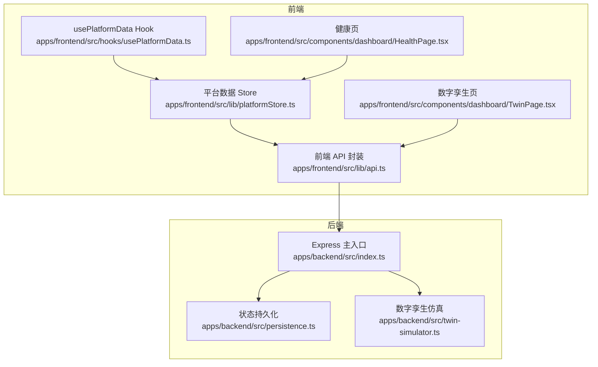
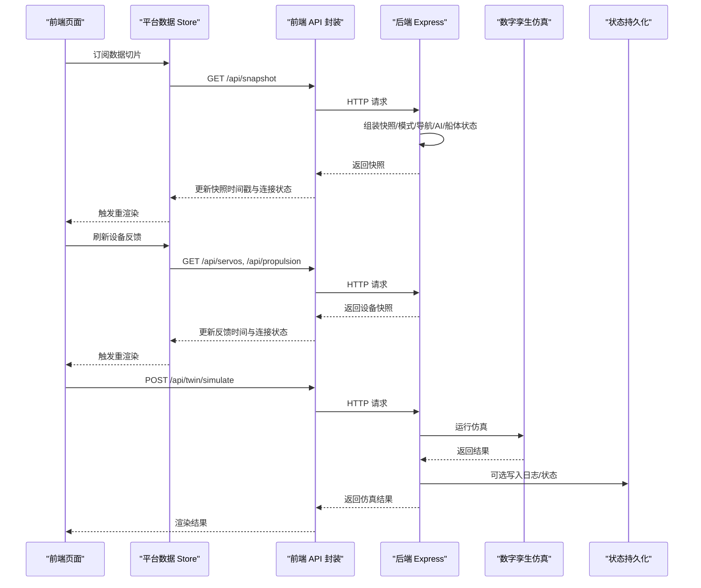
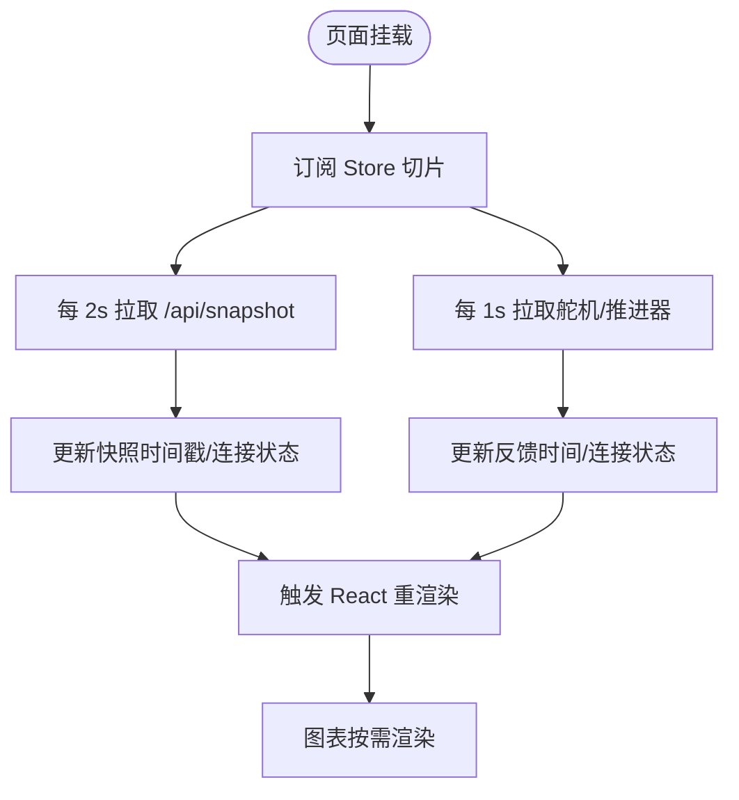
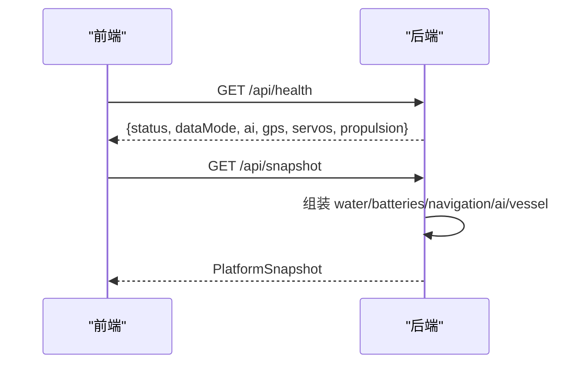
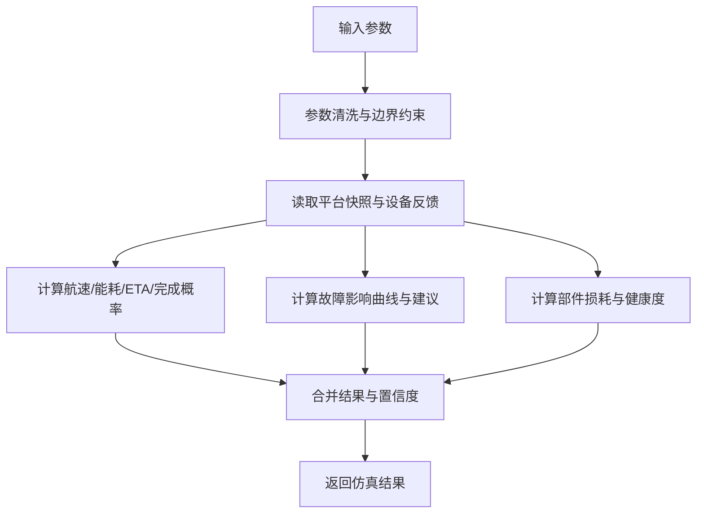
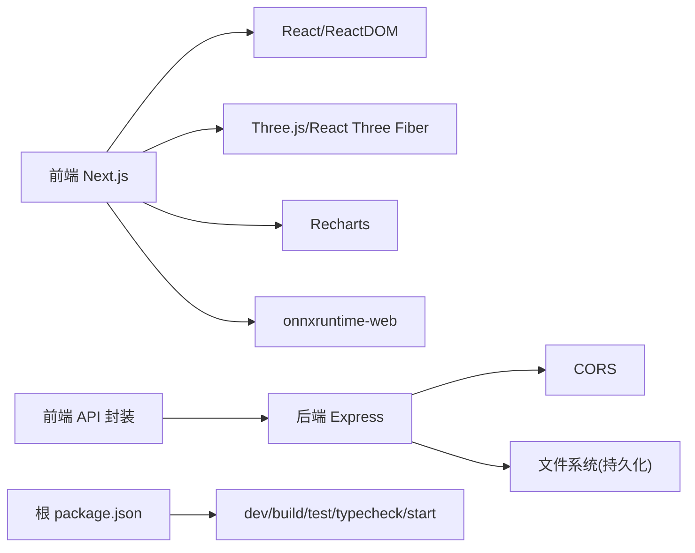

# 性能监控方案

<cite>
**本文引用的文件**
- [README.md](file://fishery-digital-twin-platform/README.md)
- [package.json](file://fishery-digital-twin-platform/package.json)
- [apps/backend/src/index.ts](file://fishery-digital-twin-platform/apps/backend/src/index.ts)
- [apps/backend/src/persistence.ts](file://fishery-digital-twin-platform/apps/backend/src/persistence.ts)
- [apps/backend/src/twin-simulator.ts](file://fishery-digital-twin-platform/apps/backend/src/twin-simulator.ts)
- [apps/backend/src/device-stores.test.ts](file://fishery-digital-twin-platform/apps/backend/src/device-stores.test.ts)
- [apps/frontend/src/lib/api.ts](file://fishery-digital-twin-platform/apps/frontend/src/lib/api.ts)
- [apps/frontend/src/lib/platformStore.ts](file://fishery-digital-twin-platform/apps/frontend/src/lib/platformStore.ts)
- [apps/frontend/src/hooks/usePlatformData.ts](file://fishery-digital-twin-platform/apps/frontend/src/hooks/usePlatformData.ts)
- [apps/frontend/src/components/dashboard/HealthPage.tsx](file://fishery-digital-twin-platform/apps/frontend/src/components/dashboard/HealthPage.tsx)
- [apps/frontend/src/components/dashboard/TwinPage.tsx](file://fishery-digital-twin-platform/apps/frontend/src/components/dashboard/TwinPage.tsx)
- [apps/frontend/src/components/dashboard/DashboardPrimitives.tsx](file://fishery-digital-twin-platform/apps/frontend/src/components/dashboard/DashboardPrimitives.tsx)
</cite>

## 目录
1. [引言](#引言)
2. [项目结构](#项目结构)
3. [核心组件](#核心组件)
4. [架构总览](#架构总览)
5. [详细组件分析](#详细组件分析)
6. [依赖关系分析](#依赖关系分析)
7. [性能考虑](#性能考虑)
8. [故障排查指南](#故障排查指南)
9. [结论](#结论)
10. [附录](#附录)

## 引言
本方案面向数字孪生系统，提供覆盖前端、后端与设备侧的端到端性能监控与诊断能力。重点包括：
- 关键指标采集：FPS、内存使用统计、CPU占用率、网络延迟测量等。
- 瓶颈识别：性能分析工具使用、热点代码定位、资源消耗分析。
- 自动化测试：性能回归测试、负载测试、压力测试框架。
- 持续优化：基线建立、A/B测试、渐进式优化。
- 前端监控：浏览器性能API、React Profiler、自定义指标。
- 后端监控：应用性能监控、数据库查询分析（当前为本地持久化）、服务器资源监控。
- 报告与告警：性能报告生成与告警机制配置。

## 项目结构
本项目采用前后端分离与多包工作区组织：
- 前端 Next.js 应用负责数据可视化、3D 场景渲染与用户交互。
- 后端 Express 服务聚合传感器、GPS、舵机、推进器状态，并提供数字孪生仿真接口。
- 共享类型包统一前后端契约。
- 桌面运行时集成前端与后端，便于打包分发。

**图表来源**
- [apps/frontend/src/lib/api.ts:1-101](file://fishery-digital-twin-platform/apps/frontend/src/lib/api.ts#L1-L101)
- [apps/frontend/src/lib/platformStore.ts:1-196](file://fishery-digital-twin-platform/apps/frontend/src/lib/platformStore.ts#L1-L196)
- [apps/frontend/src/hooks/usePlatformData.ts:1-23](file://fishery-digital-twin-platform/apps/frontend/src/hooks/usePlatformData.ts#L1-L23)
- [apps/frontend/src/components/dashboard/HealthPage.tsx:1-215](file://fishery-digital-twin-platform/apps/frontend/src/components/dashboard/HealthPage.tsx#L1-L215)
- [apps/frontend/src/components/dashboard/TwinPage.tsx:1-768](file://fishery-digital-twin-platform/apps/frontend/src/components/dashboard/TwinPage.tsx#L1-L768)
- [apps/backend/src/index.ts:1-599](file://fishery-digital-twin-platform/apps/backend/src/index.ts#L1-L599)
- [apps/backend/src/persistence.ts:1-68](file://fishery-digital-twin-platform/apps/backend/src/persistence.ts#L1-L68)
- [apps/backend/src/twin-simulator.ts:1-254](file://fishery-digital-twin-platform/apps/backend/src/twin-simulator.ts#L1-L254)

**章节来源**
- [README.md:1-208](file://fishery-digital-twin-platform/README.md#L1-L208)
- [package.json:1-96](file://fishery-digital-twin-platform/package.json#L1-L96)

## 核心组件
- 前端数据流：通过 store 定时轮询后端快照和设备反馈，Hook 暴露给页面消费。
- 后端接口：健康检查、平台快照、水质历史、AI 报告、设备控制、日志、数字孪生仿真。
- 持久化：将水质历史、电池、AI 报告、系统日志落盘，支持重启恢复。
- 仿真引擎：基于输入参数与实时快照计算航线预演、故障推演与疲劳损耗。

**章节来源**
- [apps/frontend/src/lib/platformStore.ts:1-196](file://fishery-digital-twin-platform/apps/frontend/src/lib/platformStore.ts#L1-L196)
- [apps/frontend/src/hooks/usePlatformData.ts:1-23](file://fishery-digital-twin-platform/apps/frontend/src/hooks/usePlatformData.ts#L1-L23)
- [apps/backend/src/index.ts:101-599](file://fishery-digital-twin-platform/apps/backend/src/index.ts#L101-L599)
- [apps/backend/src/persistence.ts:1-68](file://fishery-digital-twin-platform/apps/backend/src/persistence.ts#L1-L68)
- [apps/backend/src/twin-simulator.ts:1-254](file://fishery-digital-twin-platform/apps/backend/src/twin-simulator.ts#L1-L254)

## 架构总览
下图展示从前端到后端的请求链路以及内部处理流程，涵盖快照获取、设备反馈、仿真调用与日志记录。

**图表来源**
- [apps/frontend/src/lib/platformStore.ts:98-139](file://fishery-digital-twin-platform/apps/frontend/src/lib/platformStore.ts#L98-L139)
- [apps/frontend/src/lib/api.ts:26-100](file://fishery-digital-twin-platform/apps/frontend/src/lib/api.ts#L26-L100)
- [apps/backend/src/index.ts:322-557](file://fishery-digital-twin-platform/apps/backend/src/index.ts#L322-L557)
- [apps/backend/src/twin-simulator.ts:74-253](file://fishery-digital-twin-platform/apps/backend/src/twin-simulator.ts#L74-L253)
- [apps/backend/src/persistence.ts:51-67](file://fishery-digital-twin-platform/apps/backend/src/persistence.ts#L51-L67)

## 详细组件分析

### 前端数据与渲染管线
- 数据拉取周期：快照每 2 秒、设备反馈每 1 秒轮询，避免频繁重渲染。
- 连接感知：store 维护 snapshotConnected 与 feedbackConnected，用于 UI 显示“后端连接已断开”等提示。
- 渲染优化：使用 useSyncExternalStore 与稳定切片对象，减少无关重渲染；图表在视觉就绪后才绘制。

**图表来源**
- [apps/frontend/src/lib/platformStore.ts:20-21](file://fishery-digital-twin-platform/apps/frontend/src/lib/platformStore.ts#L20-L21)
- [apps/frontend/src/lib/platformStore.ts:98-139](file://fishery-digital-twin-platform/apps/frontend/src/lib/platformStore.ts#L98-L139)
- [apps/frontend/src/components/dashboard/DashboardPrimitives.tsx:95-101](file://fishery-digital-twin-platform/apps/frontend/src/components/dashboard/DashboardPrimitives.tsx#L95-L101)

**章节来源**
- [apps/frontend/src/lib/platformStore.ts:1-196](file://fishery-digital-twin-platform/apps/frontend/src/lib/platformStore.ts#L1-L196)
- [apps/frontend/src/hooks/usePlatformData.ts:1-23](file://fishery-digital-twin-platform/apps/frontend/src/hooks/usePlatformData.ts#L1-L23)
- [apps/frontend/src/components/dashboard/DashboardPrimitives.tsx:1-102](file://fishery-digital-twin-platform/apps/frontend/src/components/dashboard/DashboardPrimitives.tsx#L1-L102)

### 后端健康与快照接口
- 健康检查：返回服务状态、数据模式、AI/GPS/设备快照信息。
- 快照接口：组合水质历史、电池、导航、AI 报告与船体状态，并动态注入演示数据或真实数据。
- 设备控制：带令牌校验的受控接口，防止局域网误控。

**图表来源**
- [apps/backend/src/index.ts:322-346](file://fishery-digital-twin-platform/apps/backend/src/index.ts#L322-L346)
- [apps/backend/src/index.ts:247-262](file://fishery-digital-twin-platform/apps/backend/src/index.ts#L247-L262)

**章节来源**
- [apps/backend/src/index.ts:101-157](file://fishery-digital-twin-platform/apps/backend/src/index.ts#L101-L157)
- [apps/backend/src/index.ts:322-557](file://fishery-digital-twin-platform/apps/backend/src/index.ts#L322-L557)

### 数字孪生仿真引擎
- 输入清洗：对航程、航速、海况、故障类型与严重度进行边界约束。
- 模型计算：根据在线设备数量、实际输出、跟踪误差等计算有效速度、能耗、到达电量、完成概率与风险等级。
- 输出结构：包含航线预演、故障推演、疲劳损耗、置信度与假设说明。

**图表来源**
- [apps/backend/src/twin-simulator.ts:35-50](file://fishery-digital-twin-platform/apps/backend/src/twin-simulator.ts#L35-L50)
- [apps/backend/src/twin-simulator.ts:74-253](file://fishery-digital-twin-platform/apps/backend/src/twin-simulator.ts#L74-L253)

**章节来源**
- [apps/backend/src/twin-simulator.ts:1-254](file://fishery-digital-twin-platform/apps/backend/src/twin-simulator.ts#L1-L254)

### 健康页与告警展示
- 健康评分：综合设备在线数、电池状态与平均电量计算。
- 告警列表：低电量与离线设备高亮提示。
- 趋势图：基于当前快照推算的健康分趋势。

**章节来源**
- [apps/frontend/src/components/dashboard/HealthPage.tsx:13-204](file://fishery-digital-twin-platform/apps/frontend/src/components/dashboard/HealthPage.tsx#L13-L204)

### 数字孪生页与仿真工作台
- 场景控制：视角复位、全屏、动态水面开关。
- 仿真模式：航线预演、故障推演、疲劳损耗三种模式。
- 结果展示：关键指标、时序曲线、风险徽章与模型依据。

**章节来源**
- [apps/frontend/src/components/dashboard/TwinPage.tsx:24-768](file://fishery-digital-twin-platform/apps/frontend/src/components/dashboard/TwinPage.tsx#L24-L768)

## 依赖关系分析
- 前端依赖：Next.js、Three.js、Recharts、onnxruntime-web 等。
- 后端依赖：Express、CORS、dotenv、Node 标准库。
- 工作区脚本：统一构建、开发、测试、类型检查与打包。

**图表来源**
- [apps/frontend/package.json:14-42](file://fishery-digital-twin-platform/apps/frontend/package.json#L14-L42)
- [package.json:16-37](file://fishery-digital-twin-platform/package.json#L16-L37)
- [apps/backend/src/index.ts:1-6](file://fishery-digital-twin-platform/apps/backend/src/index.ts#L1-L6)

**章节来源**
- [package.json:1-96](file://fishery-digital-twin-platform/package.json#L1-L96)
- [apps/frontend/package.json:1-45](file://fishery-digital-twin-platform/apps/frontend/package.json#L1-L45)

## 性能考虑
- 前端渲染与 FPS
  - 建议：启用浏览器 Performance 面板与 Memory 面板，观察长任务与内存增长；对 3D 场景限制帧率或使用 requestAnimationFrame 节流；图表关闭动画以减少重绘。
  - 参考：TwinPage 中图表禁用动画、DashboardPrimitives 中视觉就绪后再渲染。
- 网络延迟与吞吐
  - 建议：在前端 API 层增加请求耗时埋点（fetch 开始/结束时间差），按接口维度统计 P50/P95；对高频轮询（快照 2s、反馈 1s）评估是否可自适应降频。
  - 参考：platformStore 的轮询间隔与连接状态管理。
- CPU 占用与热点
  - 建议：使用 Chrome Performance 录制定位热路径（如仿真结果渲染、大量数据排序/过滤）；在后端对仿真计算进行基准测试与采样。
  - 参考：twin-simulator 的计算逻辑与输入清洗。
- 内存使用
  - 建议：监控堆大小与事件循环积压；避免在高频回调中创建大对象；对历史数据做长度限制与惰性加载。
  - 参考：persistence 中的历史长度限制与批量落盘。
- 后端 I/O 与持久化
  - 建议：将写操作批量化与异步化，避免阻塞请求；对磁盘写入失败进行降级与重试。
  - 参考：persistence 的定时落盘与临时文件原子替换。

[本节为通用指导，不直接分析具体文件]

## 故障排查指南
- 后端启动与端口冲突
  - 现象：端口占用或权限错误导致退出。
  - 处理：检查端口配置与防火墙规则；查看错误码并终止进程。
  - 参考：index.ts 的错误监听与退出逻辑。
- 设备发现与通信
  - 现象：ESP32 无法自动发现后端。
  - 处理：确认 UDP 端口开放与广播地址；检查令牌与 CORS。
  - 参考：index.ts 的 UDP 发现与 announce 逻辑。
- 健康检查异常
  - 现象：/api/health 返回异常或数据模式非 live。
  - 处理：检查传感器数据接入、GPS 状态与 AI 报告可用性。
  - 参考：index.ts 的健康接口实现。
- 仿真失败
  - 现象：/api/twin/simulate 返回错误。
  - 处理：检查输入参数范围与设备在线状态；查看日志定位原因。
  - 参考：index.ts 的仿真路由与错误处理。
- 前端连接断开
  - 现象：页面显示“后端连接已断开”。
  - 处理：检查网络、代理与超时设置；降低轮询频率。
  - 参考：platformStore 的连接状态与超时配置。

**章节来源**
- [apps/backend/src/index.ts:559-599](file://fishery-digital-twin-platform/apps/backend/src/index.ts#L559-L599)
- [apps/backend/src/index.ts:271-318](file://fishery-digital-twin-platform/apps/backend/src/index.ts#L271-L318)
- [apps/frontend/src/lib/api.ts:6-24](file://fishery-digital-twin-platform/apps/frontend/src/lib/api.ts#L6-L24)
- [apps/frontend/src/lib/platformStore.ts:98-139](file://fishery-digital-twin-platform/apps/frontend/src/lib/platformStore.ts#L98-L139)

## 结论
本方案以现有前后端架构为基础，提出覆盖 FPS、内存、CPU、网络与仿真计算的完整性能监控与诊断体系。通过前端轮询与连接感知、后端健康与仿真、持久化与日志，形成闭环观测。结合自动化测试与持续优化流程，可在开发与生产环境中持续保障系统稳定性与性能表现。

[本节为总结性内容，不直接分析具体文件]

## 附录

### 关键指标采集清单
- 前端
  - FPS：Performance 面板帧率统计。
  - 内存：Heap Snapshot 与 Allocation Timeline。
  - CPU：Long Tasks 与 Scripting 时间分布。
  - 网络：Fetch 耗时、错误率、带宽占用。
- 后端
  - 接口耗时：P50/P95/P99。
  - 设备反馈延迟：轮询间隔与实际响应时间。
  - 仿真耗时：单次仿真计算时长。
  - 持久化 I/O：写入延迟与失败率。

[本节为通用指导，不直接分析具体文件]

### 自动化测试与性能回归
- 单元测试：验证设备存储与命令队列行为，确保控制安全与边界条件。
- 性能回归：对仿真引擎与数据组装路径添加基准用例，对比版本差异。
- 负载与压力：模拟多客户端并发请求 /api/snapshot 与 /api/twin/simulate，观察 QPS、延迟与资源占用。
- 参考：device-stores.test.ts 的行为断言风格。

**章节来源**
- [apps/backend/src/device-stores.test.ts:1-93](file://fishery-digital-twin-platform/apps/backend/src/device-stores.test.ts#L1-L93)

### 持续优化流程
- 基线建立：在生产环境采集默认配置下的性能基线（延迟、吞吐、资源）。
- A/B 测试：对前端渲染策略（如图表动画开关、3D 质量）与后端仿真参数进行对比。
- 渐进式优化：小步快跑，逐步引入缓存、懒加载与计算优化，配合监控回滚。

[本节为通用指导，不直接分析具体文件]

### 前端监控实践
- 浏览器性能 API：使用 Navigation Timing、Resource Timing、Performance Observer。
- React Profiler：捕获组件渲染耗时与重渲染次数。
- 自定义指标：在 platformStore 中记录每次轮询耗时与失败次数，上报至监控平台。

**章节来源**
- [apps/frontend/src/lib/platformStore.ts:98-139](file://fishery-digital-twin-platform/apps/frontend/src/lib/platformStore.ts#L98-L139)

### 后端监控实践
- 应用性能监控：为关键接口打点（健康、快照、仿真、日志）。
- 数据库查询分析：当前为本地 JSON 持久化，关注写入频率与文件大小。
- 服务器资源监控：CPU、内存、磁盘 I/O、网络带宽。

**章节来源**
- [apps/backend/src/index.ts:322-557](file://fishery-digital-twin-platform/apps/backend/src/index.ts#L322-L557)
- [apps/backend/src/persistence.ts:17-67](file://fishery-digital-twin-platform/apps/backend/src/persistence.ts#L17-L67)

### 性能报告与告警
- 报告生成：定期汇总前端与后端指标，输出趋势图与异常摘要。
- 告警机制：对关键阈值（如接口 P95 延迟、仿真失败率、内存峰值）配置告警规则。
- 通知渠道：邮件、IM 或工单系统。

[本节为通用指导，不直接分析具体文件]