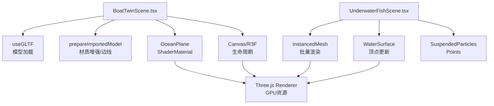
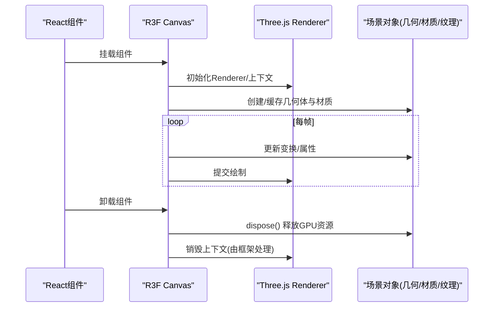
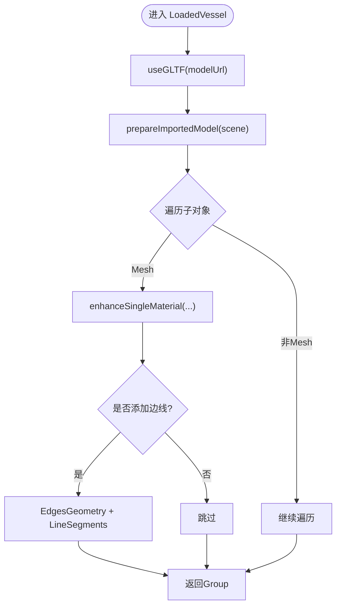
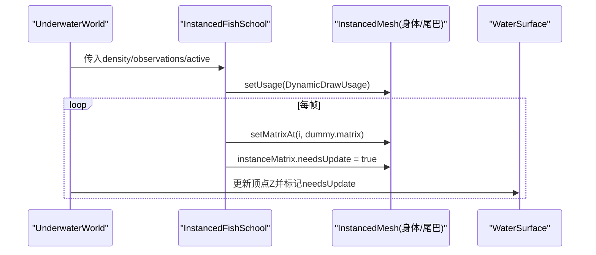
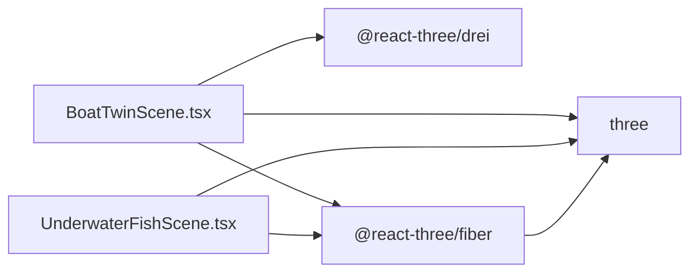

# 内存管理优化

<cite>
**本文引用的文件**
- [BoatTwinScene.tsx](file://fishery-digital-twin-platform/apps/frontend/src/components/three/BoatTwinScene.tsx)
- [UnderwaterFishScene.tsx](file://fishery-digital-twin-platform/apps/frontend/src/components/three/UnderwaterFishScene.tsx)
</cite>

## 目录
1. [简介](#简介)
2. [项目结构](#项目结构)
3. [核心组件](#核心组件)
4. [架构总览](#架构总览)
5. [详细组件分析](#详细组件分析)
6. [依赖关系分析](#依赖关系分析)
7. [性能考量](#性能考量)
8. [故障排查指南](#故障排查指南)
9. [结论](#结论)
10. [附录](#附录)

## 简介
本文件聚焦于Three.js与React Three Fiber（R3F）场景的内存管理优化，围绕对象池复用、GPU资源释放、引用计数与泄漏预防展开。结合本项目中的两个关键场景：
- BoatTwinScene：基于GLTF模型与程序化几何体构建的船舶数字孪生场景，包含材质增强、边缘线叠加、海洋水面动画等。
- UnderwaterFishScene：使用InstancedMesh实现大规模鱼群渲染，配合动态顶点更新与粒子系统。

文档将提供可操作的优化策略、代码级流程图与时序图，并给出在两个场景中落地的具体实践建议。

## 项目结构
- 前端应用位于 apps/frontend，Three.js场景组件集中在 src/components/three 下。
- BoatTwinScene 负责加载GLTF模型、材质增强、水波着色器、设备反馈可视化与相机控制。
- UnderwaterFishScene 通过 InstancedMesh 高效绘制大量鱼类，并在每帧更新矩阵与颜色。

图表来源
- [BoatTwinScene.tsx:809-870](file://fishery-digital-twin-platform/apps/frontend/src/components/three/BoatTwinScene.tsx#L809-L870)
- [BoatTwinScene.tsx:1060-1094](file://fishery-digital-twin-platform/apps/frontend/src/components/three/BoatTwinScene.tsx#L1060-L1094)
- [UnderwaterFishScene.tsx:90-250](file://fishery-digital-twin-platform/apps/frontend/src/components/three/UnderwaterFishScene.tsx#L90-L250)
- [UnderwaterFishScene.tsx:252-283](file://fishery-digital-twin-platform/apps/frontend/src/components/three/UnderwaterFishScene.tsx#L252-L283)

章节来源
- [BoatTwinScene.tsx:1-1776](file://fishery-digital-twin-platform/apps/frontend/src/components/three/BoatTwinScene.tsx#L1-L1776)
- [UnderwaterFishScene.tsx:1-356](file://fishery-digital-twin-platform/apps/frontend/src/components/three/UnderwaterFishScene.tsx#L1-L356)

## 核心组件
- 模型加载与预处理：BoatTwinScene 使用 useGLTF 加载GLTF，并通过 prepareImportedModel 对模型进行归一化、材质替换与可选边缘线叠加。
- 材质增强：enhanceSingleMaterial 创建新的 MeshStandardMaterial，保留贴图但调整粗糙度、金属度与环境映射强度，避免重复纹理导致的显存膨胀。
- 实例化渲染：UnderwaterFishScene 使用 InstancedMesh 批量绘制鱼体与尾鳍，减少 draw call 与CPU开销。
- 动态顶点更新：WaterSurface 每帧修改平面几何的顶点Z值以模拟波浪，需标记 needsUpdate。
- 粒子系统：SuspendedParticles 使用 Points + BufferGeometry 表现悬浮微粒，降低渲染成本。

章节来源
- [BoatTwinScene.tsx:809-923](file://fishery-digital-twin-platform/apps/frontend/src/components/three/BoatTwinScene.tsx#L809-L923)
- [BoatTwinScene.tsx:987-1011](file://fishery-digital-twin-platform/apps/frontend/src/components/three/BoatTwinScene.tsx#L987-L1011)
- [UnderwaterFishScene.tsx:90-250](file://fishery-digital-twin-platform/apps/frontend/src/components/three/UnderwaterFishScene.tsx#L90-L250)
- [UnderwaterFishScene.tsx:252-283](file://fishery-digital-twin-platform/apps/frontend/src/components/three/UnderwaterFishScene.tsx#L252-L283)
- [UnderwaterFishScene.tsx:322-355](file://fishery-digital-twin-platform/apps/frontend/src/components/three/UnderwaterFishScene.tsx#L322-L355)

## 架构总览
下图展示R3F Canvas生命周期与Three.js GPU资源的交互关系，以及场景组件如何参与渲染循环与资源管理。

图表来源
- [BoatTwinScene.tsx:1698-1759](file://fishery-digital-twin-platform/apps/frontend/src/components/three/BoatTwinScene.tsx#L1698-L1759)
- [UnderwaterFishScene.tsx:38-51](file://fishery-digital-twin-platform/apps/frontend/src/components/three/UnderwaterFishScene.tsx#L38-L51)

## 详细组件分析

### BoatTwinScene 内存优化要点
- 模型加载与缓存
  - 使用 useGLTF 加载模型，并通过 useMemo 调用 prepareImportedModel 生成可复用的场景树。建议在顶层维护一个全局缓存表，按 modelUrl 缓存已处理的 Group，避免重复 clone 与材质重建。
  - 参考路径：[useGLTF与模型准备:809-870](file://fishery-digital-twin-platform/apps/frontend/src/components/three/BoatTwinScene.tsx#L809-L870)

- 材质与纹理复用
  - enhanceSingleMaterial 会复制原始材质的贴图引用，避免重复加载纹理；同时设置 envMapIntensity 与 roughness/metalness，减少不必要的重计算。
  - 若存在多材质数组，统一映射为新材料数组，确保每个mesh只持有唯一材质实例。
  - 参考路径：[材质增强逻辑:872-923](file://fishery-digital-twin-platform/apps/frontend/src/components/three/BoatTwinScene.tsx#L872-L923)

- 边缘线与几何体
  - 仅在顶点数较小且需要时添加 EdgesGeometry 与 LineSegments，避免大网格产生额外显存。
  - 参考路径：[边缘线条件与创建:987-1011](file://fishery-digital-twin-platform/apps/frontend/src/components/three/BoatTwinScene.tsx#L987-L1011)

- 着色器与uniforms
  - OceanPlane 使用 ShaderMaterial 与 uniforms.uTime 驱动动画，避免每帧新建材质或着色器对象。
  - 参考路径：[水面着色器与uniforms:1060-1094](file://fishery-digital-twin-platform/apps/frontend/src/components/three/BoatTwinScene.tsx#L1060-L1094)

- 渲染循环控制
  - SceneTicker 根据 active/fps 控制 invalidate，减少空闲时的GPU压力。
  - 参考路径：[帧率控制:128-151](file://fishery-digital-twin-platform/apps/frontend/src/components/three/BoatTwinScene.tsx#L128-L151)

- 生命周期与清理
  - 当前未显式调用 dispose，建议在组件卸载时遍历场景树，对 geometry/material/texture 调用 dispose，并移除事件监听与定时器。
  - 参考路径：[Canvas与生命周期:1698-1759](file://fishery-digital-twin-platform/apps/frontend/src/components/three/BoatTwinScene.tsx#L1698-L1759)

图表来源
- [BoatTwinScene.tsx:809-870](file://fishery-digital-twin-platform/apps/frontend/src/components/three/BoatTwinScene.tsx#L809-L870)
- [BoatTwinScene.tsx:872-923](file://fishery-digital-twin-platform/apps/frontend/src/components/three/BoatTwinScene.tsx#L872-L923)
- [BoatTwinScene.tsx:987-1011](file://fishery-digital-twin-platform/apps/frontend/src/components/three/BoatTwinScene.tsx#L987-L1011)

章节来源
- [BoatTwinScene.tsx:809-1011](file://fishery-digital-twin-platform/apps/frontend/src/components/three/BoatTwinScene.tsx#L809-L1011)
- [BoatTwinScene.tsx:128-151](file://fishery-digital-twin-platform/apps/frontend/src/components/three/BoatTwinScene.tsx#L128-L151)
- [BoatTwinScene.tsx:1698-1759](file://fishery-digital-twin-platform/apps/frontend/src/components/three/BoatTwinScene.tsx#L1698-L1759)

### UnderwaterFishScene 内存优化要点
- 实例化渲染
  - 使用 InstancedMesh 分别承载鱼体与尾鳍，设置 DynamicDrawUsage 并每帧更新 instanceMatrix，显著降低draw call与CPU开销。
  - 参考路径：[实例化鱼群:90-250](file://fishery-digital-twin-platform/apps/frontend/src/components/three/UnderwaterFishScene.tsx#L90-L250)

- 动态顶点更新
  - WaterSurface 每帧修改 planeGeometry.attributes.position 的Z值，并标记 needsUpdate，避免重建几何体。
  - 参考路径：[水面顶点更新:252-283](file://fishery-digital-twin-platform/apps/frontend/src/components/three/UnderwaterFishScene.tsx#L252-L283)

- 粒子系统
  - SuspendedParticles 使用 BufferGeometry + bufferAttribute 存储位置，减少JS对象分配。
  - 参考路径：[粒子系统:322-355](file://fishery-digital-twin-platform/apps/frontend/src/components/three/UnderwaterFishScene.tsx#L322-L355)

- 渲染循环控制
  - Canvas 的 frameloop 根据 active 切换 always/demand，减少不可见时的GPU占用。
  - 参考路径：[Canvas配置:38-51](file://fishery-digital-twin-platform/apps/frontend/src/components/three/UnderwaterFishScene.tsx#L38-L51)

图表来源
- [UnderwaterFishScene.tsx:90-250](file://fishery-digital-twin-platform/apps/frontend/src/components/three/UnderwaterFishScene.tsx#L90-L250)
- [UnderwaterFishScene.tsx:252-283](file://fishery-digital-twin-platform/apps/frontend/src/components/three/UnderwaterFishScene.tsx#L252-L283)

章节来源
- [UnderwaterFishScene.tsx:38-51](file://fishery-digital-twin-platform/apps/frontend/src/components/three/UnderwaterFishScene.tsx#L38-L51)
- [UnderwaterFishScene.tsx:90-250](file://fishery-digital-twin-platform/apps/frontend/src/components/three/UnderwaterFishScene.tsx#L90-L250)
- [UnderwaterFishScene.tsx:252-283](file://fishery-digital-twin-platform/apps/frontend/src/components/three/UnderwaterFishScene.tsx#L252-L283)
- [UnderwaterFishScene.tsx:322-355](file://fishery-digital-twin-platform/apps/frontend/src/components/three/UnderwaterFishScene.tsx#L322-L355)

## 依赖关系分析
- BoatTwinScene 依赖 @react-three/drei 的 useGLTF、AdaptiveDpr、Bounds、OrbitControls 等工具，用于模型加载、自适应像素比、边界适配与交互。
- UnderwaterFishScene 依赖 @react-three/fiber 的 Canvas、useFrame，以及 THREE 的 InstancedMesh、BufferGeometry、PointsMaterial。
- 两者均通过 R3F 的 Canvas 生命周期管理渲染循环与资源创建/销毁时机。

图表来源
- [BoatTwinScene.tsx:1-7](file://fishery-digital-twin-platform/apps/frontend/src/components/three/BoatTwinScene.tsx#L1-L7)
- [UnderwaterFishScene.tsx:1-7](file://fishery-digital-twin-platform/apps/frontend/src/components/three/UnderwaterFishScene.tsx#L1-L7)

章节来源
- [BoatTwinScene.tsx:1-7](file://fishery-digital-twin-platform/apps/frontend/src/components/three/BoatTwinScene.tsx#L1-L7)
- [UnderwaterFishScene.tsx:1-7](file://fishery-digital-twin-platform/apps/frontend/src/components/three/UnderwaterFishScene.tsx#L1-L7)

## 性能考量
- 对象池复用
  - 几何体：对频繁创建的几何体（如小部件）建立池，复用而非每次 new。
  - 材质：共享材质实例，避免重复创建；对贴图保持引用但不重复加载。
  - 纹理：使用统一的纹理管理器，按URL缓存 Texture，防止重复下载与显存占用。
- GPU资源释放
  - 组件卸载时，遍历场景树，对 geometry、material、texture 调用 dispose，并移除事件监听与定时器。
  - 对于 InstancedMesh，确保 instanceMatrix 的 needsUpdate 仅在必要时设置，避免多余同步。
- 引用计数与泄漏预防
  - 避免在闭包中持有场景对象的强引用；使用 useRef 保存临时对象，并在卸载时清空。
  - 对 useGLTF 加载的场景，考虑在顶层缓存并延迟 dispose，直到明确不再需要。
- 渲染循环控制
  - 使用 frameloop="demand" 与按需 invalidate，减少空闲帧的GPU负载。
  - 根据活动状态动态调整fps，平衡流畅度与能耗。

## 故障排查指南
- 常见内存问题
  - 纹理重复加载：检查是否多处 new TextureLoader().load(url)，改为全局缓存。
  - 几何体未释放：确认组件卸载时调用 geometry.dispose()。
  - 材质未释放：确认 material.dispose()，尤其是自定义 ShaderMaterial。
  - 事件监听未移除：确保 useEffect 返回清理函数，移除 addEventListener 与 requestAnimationFrame。
- 诊断方法
  - 使用浏览器开发者工具的 Memory 面板，拍摄堆快照对比组件切换前后的变化。
  - 使用 Performance 面板观察长任务与GC频率，定位异常分配点。
  - 在R3F中使用 onCreated 获取 gl，并在卸载时记录 gl.info.memory 的变化趋势。
- 解决方案
  - 引入资源管理器：集中管理纹理、几何体、材质，提供 get/put/dispose 接口。
  - 在组件卸载钩子中执行统一清理：遍历 scene.children，递归调用 dispose。
  - 对大数据集（如鱼群）使用 InstancedMesh，并限制最大数量与LOD策略。

章节来源
- [BoatTwinScene.tsx:1698-1759](file://fishery-digital-twin-platform/apps/frontend/src/components/three/BoatTwinScene.tsx#L1698-L1759)
- [UnderwaterFishScene.tsx:38-51](file://fishery-digital-twin-platform/apps/frontend/src/components/three/UnderwaterFishScene.tsx#L38-L51)

## 结论
通过对BoatTwinScene与UnderwaterFishScene的分析，可见本项目已在材质增强、实例化渲染与动态顶点更新方面具备良好的基础。为进一步优化内存：
- 引入全局资源缓存与生命周期清理机制，确保几何体、材质、纹理的正确释放。
- 强化渲染循环控制，依据活动状态动态调整帧率与渲染频率。
- 建立监控与诊断流程，持续跟踪显存占用与GC行为，及时定位泄漏点。

## 附录
- 推荐实践清单
  - 使用 useMemo/useRef 缓存昂贵对象，避免重复创建。
  - 在组件卸载时显式 dispose 所有Three.js资源。
  - 对大图纹理进行压缩与mipmap优化，减少显存占用。
  - 使用 InstancedMesh 替代大量独立mesh，降低draw call。
  - 合理设置 Canvas 的 dpr 与 frameloop，平衡画质与性能。
- 相关代码路径
  - 模型加载与材质增强：[BoatTwinScene.tsx:809-923](file://fishery-digital-twin-platform/apps/frontend/src/components/three/BoatTwinScene.tsx#L809-L923)
  - 边缘线条件与创建：[BoatTwinScene.tsx:987-1011](file://fishery-digital-twin-platform/apps/frontend/src/components/three/BoatTwinScene.tsx#L987-L1011)
  - 水面着色器与uniforms：[BoatTwinScene.tsx:1060-1094](file://fishery-digital-twin-platform/apps/frontend/src/components/three/BoatTwinScene.tsx#L1060-L1094)
  - 实例化鱼群与顶点更新：[UnderwaterFishScene.tsx:90-283](file://fishery-digital-twin-platform/apps/frontend/src/components/three/UnderwaterFishScene.tsx#L90-L283)
  - 粒子系统与缓冲数据：[UnderwaterFishScene.tsx:322-355](file://fishery-digital-twin-platform/apps/frontend/src/components/three/UnderwaterFishScene.tsx#L322-L355)