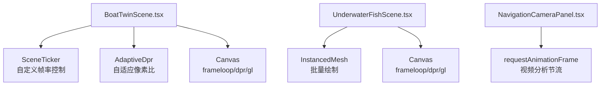
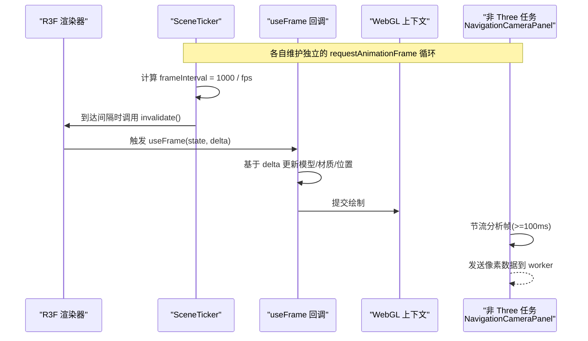
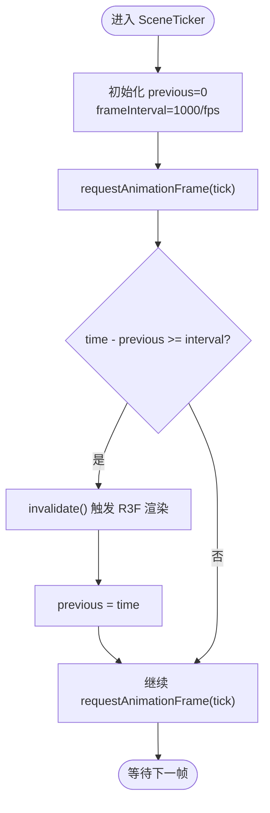
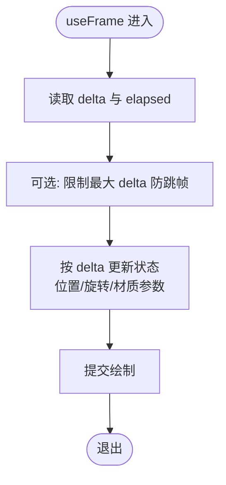
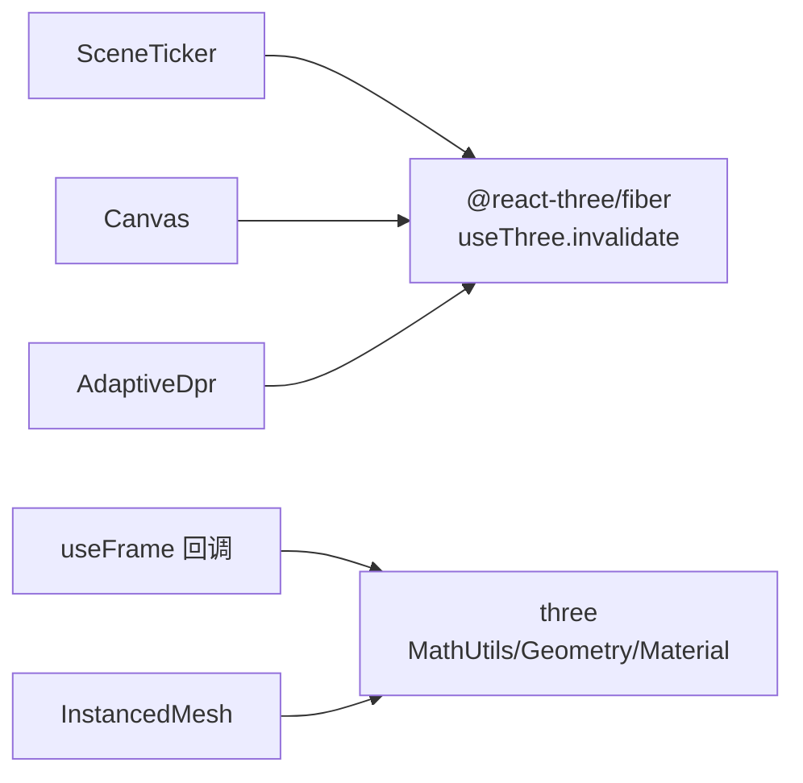

# 帧率控制机制

<cite>
**本文引用的文件**
- [BoatTwinScene.tsx](file://fishery-digital-twin-platform/apps/frontend/src/components/three/BoatTwinScene.tsx)
- [UnderwaterFishScene.tsx](file://fishery-digital-twin-platform/apps/frontend/src/components/three/UnderwaterFishScene.tsx)
- [NavigationCameraPanel.tsx](file://fishery-digital-twin-platform/apps/frontend/src/components/dashboard/NavigationCameraPanel.tsx)
</cite>

## 目录
1. [简介](#简介)
2. [项目结构](#项目结构)
3. [核心组件](#核心组件)
4. [架构总览](#架构总览)
5. [详细组件分析](#详细组件分析)
6. [依赖关系分析](#依赖关系分析)
7. [性能考量](#性能考量)
8. [故障排查指南](#故障排查指南)
9. [结论](#结论)
10. [附录](#附录)

## 简介
本文件面向 Three.js/React Three Fiber 应用的帧率控制与优化，聚焦以下目标：
- 解释 SceneTicker 组件的自适应刷新率控制与请求动画帧节流策略。
- 说明 useFrame 钩子的使用、delta 时间处理与渲染频率控制。
- 描述性能自适应技术：根据设备能力动态调整 DPR、渲染循环模式与特效开关。
- 提供实现稳定 30fps 的实践方法与避免过度渲染的技巧。
- 给出帧率监控与性能瓶颈分析方法。

## 项目结构
本项目在 apps/frontend/src/components/three 下包含两个关键 Three.js 场景组件：
- BoatTwinScene.tsx：主船体数字孪生场景，内置 SceneTicker 自定义帧率控制、AdaptiveDpr 自适应像素比、Canvas frameloop 按需渲染等。
- UnderwaterFishScene.tsx：水下鱼群场景，采用 instancedMesh 批量绘制、限制最大实例数、按密度缩放数量，并在 Canvas 层配置 powerPreference 与 DPR 范围。

图表来源
- [BoatTwinScene.tsx:128-151](file://fishery-digital-twin-platform/apps/frontend/src/components/three/BoatTwinScene.tsx#L128-L151)
- [BoatTwinScene.tsx:1700-1715](file://fishery-digital-twin-platform/apps/frontend/src/components/three/BoatTwinScene.tsx#L1700-L1715)
- [UnderwaterFishScene.tsx:38-50](file://fishery-digital-twin-platform/apps/frontend/src/components/three/UnderwaterFishScene.tsx#L38-L50)
- [NavigationCameraPanel.tsx:413-447](file://fishery-digital-twin-platform/apps/frontend/src/components/dashboard/NavigationCameraPanel.tsx#L413-L447)

章节来源
- [BoatTwinScene.tsx:128-151](file://fishery-digital-twin-platform/apps/frontend/src/components/three/BoatTwinScene.tsx#L128-L151)
- [BoatTwinScene.tsx:1700-1715](file://fishery-digital-twin-platform/apps/frontend/src/components/three/BoatTwinScene.tsx#L1700-L1715)
- [UnderwaterFishScene.tsx:38-50](file://fishery-digital-twin-platform/apps/frontend/src/components/three/UnderwaterFishScene.tsx#L38-L50)
- [NavigationCameraPanel.tsx:413-447](file://fishery-digital-twin-platform/apps/frontend/src/components/dashboard/NavigationCameraPanel.tsx#L413-L447)

## 核心组件
- SceneTicker（自定义帧率控制器）
  - 通过 requestAnimationFrame 驱动 invalidate()，以固定间隔触发渲染，达到目标 fps（默认 30）。
  - 使用 time 差值判断是否到达下一帧，避免每帧都重绘。
- Canvas 渲染循环与 DPR
  - frameloop 支持 "always" 与 "demand"，结合交互状态按需渲染。
  - dpr 设置范围，配合 AdaptiveDpr 自动适配屏幕像素比。
  - gl.powerPreference 设置为 high-performance，优先 GPU 性能。
- useFrame 与 delta 时间
  - 所有动画逻辑基于 state.clock.elapsedTime 与 delta 进行时间步进，保证不同刷新率下的运动一致性。
  - 对速度/旋转/位移等增量乘以 delta，避免高刷新率下加速。
- 批量绘制与实例化
  - 使用 InstancedMesh 将大量对象合并为少量 draw call，降低 CPU/GPU 开销。
  - 根据 density 计算可见实例数量，限制最大实例数，避免过多绘制。

章节来源
- [BoatTwinScene.tsx:128-151](file://fishery-digital-twin-platform/apps/frontend/src/components/three/BoatTwinScene.tsx#L128-L151)
- [BoatTwinScene.tsx:1700-1715](file://fishery-digital-twin-platform/apps/frontend/src/components/three/BoatTwinScene.tsx#L1700-L1715)
- [UnderwaterFishScene.tsx:38-50](file://fishery-digital-twin-platform/apps/frontend/src/components/three/UnderwaterFishScene.tsx#L38-L50)
- [UnderwaterFishScene.tsx:162-236](file://fishery-digital-twin-platform/apps/frontend/src/components/three/UnderwaterFishScene.tsx#L162-L236)

## 架构总览
下图展示了帧率控制的关键路径：SceneTicker 定时触发 R3F 的 invalidate；useFrame 中统一使用 delta 推进动画；Canvas 层通过 frameloop 与 DPR 控制渲染时机与质量；非 Three.js 的 requestAnimationFrame 用于视频分析等旁路任务，并做节流。

图表来源
- [BoatTwinScene.tsx:128-151](file://fishery-digital-twin-platform/apps/frontend/src/components/three/BoatTwinScene.tsx#L128-L151)
- [BoatTwinScene.tsx:219-246](file://fishery-digital-twin-platform/apps/frontend/src/components/three/BoatTwinScene.tsx#L219-L246)
- [BoatTwinScene.tsx:1700-1715](file://fishery-digital-twin-platform/apps/frontend/src/components/three/BoatTwinScene.tsx#L1700-L1715)
- [NavigationCameraPanel.tsx:413-447](file://fishery-digital-twin-platform/apps/frontend/src/components/dashboard/NavigationCameraPanel.tsx#L413-L447)

## 详细组件分析

### SceneTicker 组件：自适应刷新率与请求动画帧优化
- 原理
  - 使用 window.requestAnimationFrame 持续调度 tick。
  - 维护 previous 时间戳与 frameInterval=1000/fps，仅当当前时间与上次时间差超过间隔时才调用 invalidate()，从而将渲染频率限制为目标 fps。
  - 组件销毁时取消动画帧，防止内存泄漏。
- 适用场景
  - 需要稳定 30fps 展示或演示模式，避免高刷新率带来的不必要负载。
  - 与 Canvas.frameloop="demand" 配合，仅在需要时渲染。

图表来源
- [BoatTwinScene.tsx:128-151](file://fishery-digital-twin-platform/apps/frontend/src/components/three/BoatTwinScene.tsx#L128-L151)

章节来源
- [BoatTwinScene.tsx:128-151](file://fishery-digital-twin-platform/apps/frontend/src/components/three/BoatTwinScene.tsx#L128-L151)

### useFrame 与 delta 时间处理：动画一致性与节流
- 关键点
  - 所有随时间变化的属性（位置、旋转、透明度、强度）均以 delta 作为步进因子，确保在不同刷新率下行为一致。
  - 示例包括：
    - 船体进度推进与浮动动画使用 deltaTime 平滑插值。
    - 电机转子旋转速度与功率成正比，乘以 deltaTime。
    - 传送带条纹与碎片的移动基于 elapsed 与 delta 计算。
    - 云台与机械臂角度使用阻尼函数 damp(target, strength, delta)。
- 效果
  - 避免高刷新率导致动画过快，低刷新率导致卡顿。
  - 将“物理时间”与“渲染帧率”解耦。

图表来源
- [BoatTwinScene.tsx:219-246](file://fishery-digital-twin-platform/apps/frontend/src/components/three/BoatTwinScene.tsx#L219-L246)
- [BoatTwinScene.tsx:355-358](file://fishery-digital-twin-platform/apps/frontend/src/components/three/BoatTwinScene.tsx#L355-L358)
- [BoatTwinScene.tsx:400-418](file://fishery-digital-twin-platform/apps/frontend/src/components/three/BoatTwinScene.tsx#L400-L418)
- [BoatTwinScene.tsx:529-544](file://fishery-digital-twin-platform/apps/frontend/src/components/three/BoatTwinScene.tsx#L529-L544)
- [BoatTwinScene.tsx:637-645](file://fishery-digital-twin-platform/apps/frontend/src/components/three/BoatTwinScene.tsx#L637-L645)
- [BoatTwinScene.tsx:736-755](file://fishery-digital-twin-platform/apps/frontend/src/components/three/BoatTwinScene.tsx#L736-L755)

章节来源
- [BoatTwinScene.tsx:219-246](file://fishery-digital-twin-platform/apps/frontend/src/components/three/BoatTwinScene.tsx#L219-L246)
- [BoatTwinScene.tsx:355-358](file://fishery-digital-twin-platform/apps/frontend/src/components/three/BoatTwinScene.tsx#L355-L358)
- [BoatTwinScene.tsx:400-418](file://fishery-digital-twin-platform/apps/frontend/src/components/three/BoatTwinScene.tsx#L400-L418)
- [BoatTwinScene.tsx:529-544](file://fishery-digital-twin-platform/apps/frontend/src/components/three/BoatTwinScene.tsx#L529-L544)
- [BoatTwinScene.tsx:637-645](file://fishery-digital-twin-platform/apps/frontend/src/components/three/BoatTwinScene.tsx#L637-L645)
- [BoatTwinScene.tsx:736-755](file://fishery-digital-twin-platform/apps/frontend/src/components/three/BoatTwinScene.tsx#L736-L755)

### Canvas 渲染循环与 DPR 自适应
- frameloop
  - "always"：始终渲染，适合自动旋转或持续动画。
  - "demand"：仅在需要时渲染，减少空闲功耗。
- dpr 范围
  - 设置最小/最大像素比，平衡清晰度与性能。
  - 配合 AdaptiveDpr 自动选择合适 DPR。
- WebGL 选项
  - antialias 开启抗锯齿。
  - powerPreference 设为 high-performance，优先 GPU。
- 颜色空间与色调映射
  - ACESFilmicToneMapping 与 sRGB 输出，提升视觉一致性。

章节来源
- [BoatTwinScene.tsx:1700-1715](file://fishery-digital-twin-platform/apps/frontend/src/components/three/BoatTwinScene.tsx#L1700-L1715)
- [UnderwaterFishScene.tsx:38-50](file://fishery-digital-twin-platform/apps/frontend/src/components/three/UnderwaterFishScene.tsx#L38-L50)

### 性能自适应：LOD、特效与实例化
- 实例化绘制
  - 使用 InstancedMesh 将鱼群身体与尾部分别批量绘制，减少 draw call。
  - 根据 density 计算可见数量，上限 MAX_FISH，避免过密。
- 密度到数量的映射
  - fishCountFromDensity 将 0-100 的密度映射到合理数量区间，线性缩放。
- 粒子与水面
  - 悬浮粒子与水面网格仅在 active 时更新，降低无效计算。
- 其他优化
  - 限制最大 delta，避免大跳帧导致的数值爆炸。
  - 关闭不必要的 alpha 通道，减少混合开销。

章节来源
- [UnderwaterFishScene.tsx:33-36](file://fishery-digital-twin-platform/apps/frontend/src/components/three/UnderwaterFishScene.tsx#L33-L36)
- [UnderwaterFishScene.tsx:90-160](file://fishery-digital-twin-platform/apps/frontend/src/components/three/UnderwaterFishScene.tsx#L90-L160)
- [UnderwaterFishScene.tsx:162-236](file://fishery-digital-twin-platform/apps/frontend/src/components/three/UnderwaterFishScene.tsx#L162-L236)
- [UnderwaterFishScene.tsx:252-283](file://fishery-digital-twin-platform/apps/frontend/src/components/three/UnderwaterFishScene.tsx#L252-L283)
- [UnderwaterFishScene.tsx:322-355](file://fishery-digital-twin-platform/apps/frontend/src/components/three/UnderwaterFishScene.tsx#L322-L355)

### 非 Three.js 的 requestAnimationFrame 节流
- 视频分析流程
  - 使用 requestAnimationFrame 驱动分析循环，内部维护 previousAnalysisTime，至少间隔 100ms 才执行一次图像分析与 worker 通信。
  - 将 ImageData 的底层 buffer 转移给 worker，避免拷贝开销。
- 作用
  - 降低主线程压力，避免视频分析阻塞 UI 与渲染。

章节来源
- [NavigationCameraPanel.tsx:413-447](file://fishery-digital-twin-platform/apps/frontend/src/components/dashboard/NavigationCameraPanel.tsx#L413-L447)

## 依赖关系分析
- 组件耦合
  - SceneTicker 依赖 R3F 的 useThree.invalidate，属于弱耦合，便于替换为其他帧率控制方案。
  - useFrame 回调内仅依赖 THREE.MathUtils 与 ref 引用，无外部状态强依赖。
- 外部依赖
  - @react-three/fiber 提供 Canvas、useFrame、useThree。
  - @react-three/drei 提供 AdaptiveDpr、Bounds、OrbitControls 等工具。
  - three 提供数学工具与几何/材质。
- 潜在循环依赖
  - 未发现直接循环引用；各组件职责清晰，通过 props/state 传递数据。

图表来源
- [BoatTwinScene.tsx:128-151](file://fishery-digital-twin-platform/apps/frontend/src/components/three/BoatTwinScene.tsx#L128-L151)
- [BoatTwinScene.tsx:1700-1715](file://fishery-digital-twin-platform/apps/frontend/src/components/three/BoatTwinScene.tsx#L1700-L1715)
- [UnderwaterFishScene.tsx:90-160](file://fishery-digital-twin-platform/apps/frontend/src/components/three/UnderwaterFishScene.tsx#L90-L160)

章节来源
- [BoatTwinScene.tsx:128-151](file://fishery-digital-twin-platform/apps/frontend/src/components/three/BoatTwinScene.tsx#L128-L151)
- [BoatTwinScene.tsx:1700-1715](file://fishery-digital-twin-platform/apps/frontend/src/components/three/BoatTwinScene.tsx#L1700-L1715)
- [UnderwaterFishScene.tsx:90-160](file://fishery-digital-twin-platform/apps/frontend/src/components/three/UnderwaterFishScene.tsx#L90-L160)

## 性能考量
- 目标 30fps 的实现要点
  - 使用 SceneTicker 将渲染频率限制为 30fps。
  - 所有动画基于 delta 步进，避免高刷新率加速。
  - 使用 Canvas.frameloop="demand" 在非交互或非动画阶段停止渲染。
  - 限制 DPR 范围，避免高分屏带来过高像素填充。
- 避免过度渲染
  - 仅在必要时调用 invalidate()，由 SceneTicker 控制。
  - 使用 InstancedMesh 合并绘制，减少 draw call。
  - 关闭不必要的透明/混合与深度写入。
- 动画性能优化
  - 使用 MathUtils.damp 平滑过渡，避免突变。
  - 限制最大 delta，防止长时间未渲染后的跳帧。
  - 将复杂计算移出 useFrame，或使用 useMemo 预计算静态数据。
- 设备自适应
  - AdaptiveDpr 自动选择合适像素比。
  - 根据 density 动态调整实例数量，避免低端设备过载。
  - 非 Three.js 任务（如视频分析）节流至 10fps 左右。

[本节为通用指导，不直接分析具体文件]

## 故障排查指南
- 帧率不稳定
  - 检查 SceneTicker 的 fps 配置是否正确，确认 frameInterval 计算无误。
  - 检查 useFrame 中是否存在耗时操作（如创建对象、分配内存），应移至初始化阶段。
  - 确认 Canvas.frameloop 与交互状态匹配，避免后台仍持续渲染。
- 动画抖动或加速
  - 确认所有增量均乘以 delta，且对异常大 delta 做了钳制。
  - 检查是否有重复注册 useFrame 或未清理的 requestAnimationFrame。
- 低端设备卡顿
  - 降低 DPR 上限，减少像素填充。
  - 降低实例数量（density 映射），关闭部分特效（雾、粒子、透明混合）。
  - 将非关键动画降级或暂停。
- 视频分析阻塞
  - 确认 NavigationCameraPanel 的分析间隔不低于 100ms。
  - 使用 transferable buffer 传输像素数据，避免主线程拷贝。

章节来源
- [BoatTwinScene.tsx:128-151](file://fishery-digital-twin-platform/apps/frontend/src/components/three/BoatTwinScene.tsx#L128-L151)
- [BoatTwinScene.tsx:1700-1715](file://fishery-digital-twin-platform/apps/frontend/src/components/three/BoatTwinScene.tsx#L1700-L1715)
- [UnderwaterFishScene.tsx:162-236](file://fishery-digital-twin-platform/apps/frontend/src/components/three/UnderwaterFishScene.tsx#L162-L236)
- [NavigationCameraPanel.tsx:413-447](file://fishery-digital-twin-platform/apps/frontend/src/components/dashboard/NavigationCameraPanel.tsx#L413-L447)

## 结论
该代码库通过 SceneTicker 精确控制渲染频率，结合 useFrame 的 delta 时间驱动与 Canvas 的 frameloop/DPR 自适应，实现了稳定高效的帧率管理。配合 InstancedMesh 批量绘制与非关键任务的节流，能够在多设备上保持流畅体验。建议在生产环境中结合性能监控工具持续观察 FPS、draw call 与 GPU 占用，并根据设备能力动态调整渲染质量与特效开关。

[本节为总结性内容，不直接分析具体文件]

## 附录
- 快速实践清单
  - 设置 SceneTicker 的 fps=30，确保演示模式稳定。
  - 所有动画使用 delta 步进，并对异常大 delta 做钳制。
  - 使用 Canvas.frameloop="demand"，仅在需要时渲染。
  - 限制 DPR 范围，启用 AdaptiveDpr。
  - 使用 InstancedMesh 合并绘制，控制实例数量。
  - 非 Three.js 任务节流至 10fps 左右。
- 参考实现路径
  - 帧率控制：[BoatTwinScene.tsx:128-151](file://fishery-digital-twin-platform/apps/frontend/src/components/three/BoatTwinScene.tsx#L128-L151)
  - 渲染循环与 DPR：[BoatTwinScene.tsx:1700-1715](file://fishery-digital-twin-platform/apps/frontend/src/components/three/BoatTwinScene.tsx#L1700-L1715)
  - Delta 时间使用：[BoatTwinScene.tsx:219-246](file://fishery-digital-twin-platform/apps/frontend/src/components/three/BoatTwinScene.tsx#L219-L246)
  - 实例化鱼群：[UnderwaterFishScene.tsx:90-160](file://fishery-digital-twin-platform/apps/frontend/src/components/three/UnderwaterFishScene.tsx#L90-L160)
  - 视频分析节流：[NavigationCameraPanel.tsx:413-447](file://fishery-digital-twin-platform/apps/frontend/src/components/dashboard/NavigationCameraPanel.tsx#L413-L447)