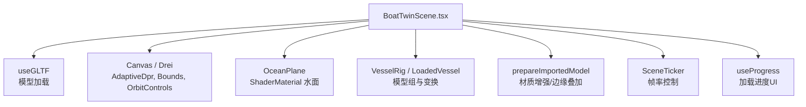
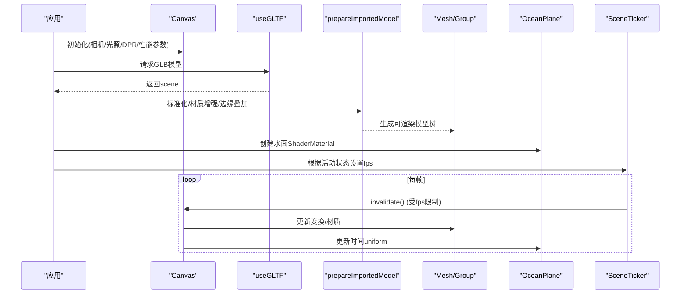
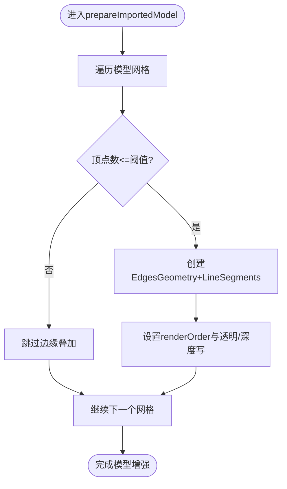
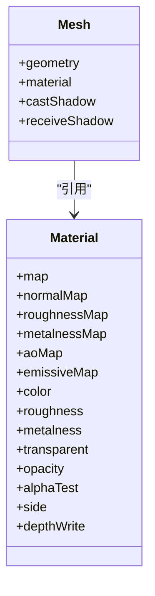
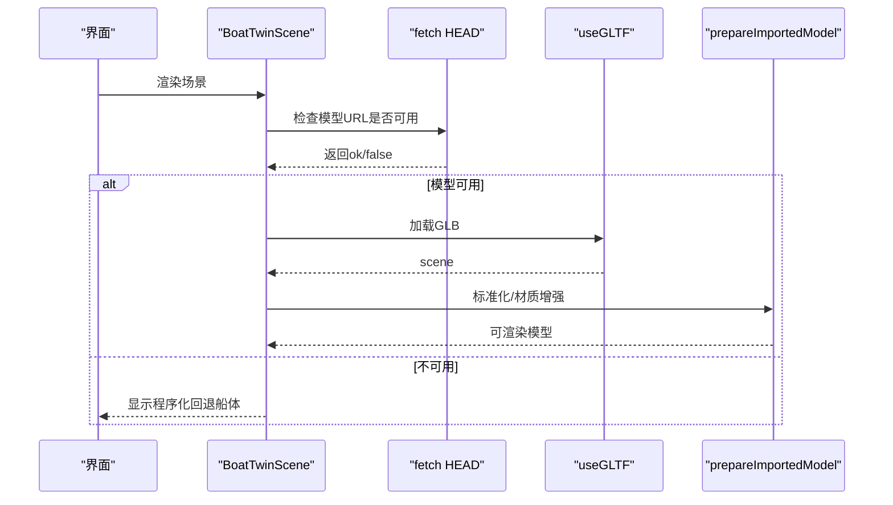
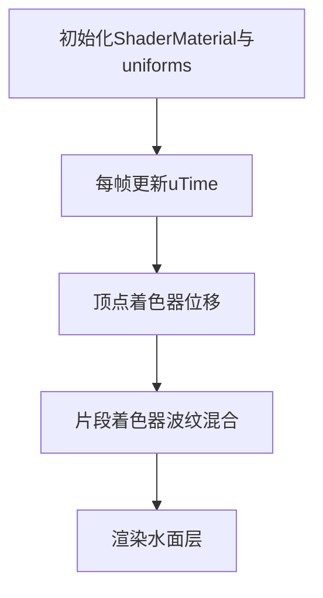
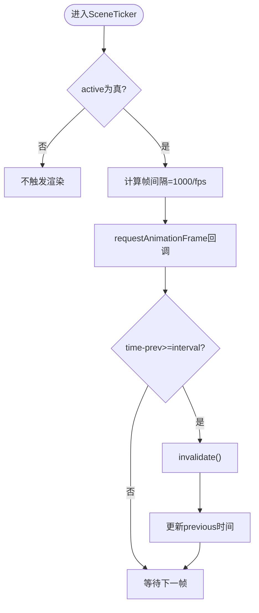
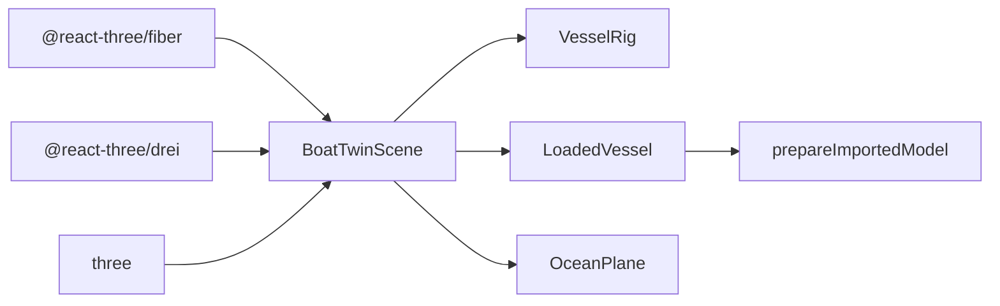

# 模型优化策略

<cite>
**本文引用的文件**
- [BoatTwinScene.tsx](file://fishery-digital-twin-platform/apps/frontend/src/components/three/BoatTwinScene.tsx)
- [README.md](file://fishery-digital-twin-platform/apps/frontend/public/models/README.md)
</cite>

## 目录
1. [简介](#简介)
2. [项目结构](#项目结构)
3. [核心组件](#核心组件)
4. [架构总览](#架构总览)
5. [详细组件分析](#详细组件分析)
6. [依赖关系分析](#依赖关系分析)
7. [性能考量](#性能考量)
8. [故障排查指南](#故障排查指南)
9. [结论](#结论)
10. [附录](#附录)

## 简介
本文件面向Three.js模型的渲染优化，聚焦于几何体面数优化、LOD（细节层次）系统原理与配置、纹理压缩算法选择与应用、GLTF模型加载优化、内存占用控制、模型简化技术（顶点合并、法线计算优化、材质实例化），以及在BoatTwinScene中实现动态LOD切换、按需加载模型和优化3D资产的具体方法。同时提供性能监控工具的使用方法与常见问题诊断技巧，帮助在复杂3D场景中稳定维持高帧率与低资源消耗。

## 项目结构
本项目的前端采用React + Three.js生态（@react-three/fiber、@react-three/drei），核心3D场景位于BoatTwinScene组件中，负责：
- GLTF模型加载与预处理
- 材质增强与边缘叠加
- 水面动画与海洋环境
- 相机控制与自适应像素密度
- 渲染循环节流与按需刷新
- 模型可用性检测与回退方案

图表来源
- [BoatTwinScene.tsx:1698-1759](file://fishery-digital-twin-platform/apps/frontend/src/components/three/BoatTwinScene.tsx#L1698-L1759)
- [BoatTwinScene.tsx:809-870](file://fishery-digital-twin-platform/apps/frontend/src/components/three/BoatTwinScene.tsx#L809-L870)
- [BoatTwinScene.tsx:1060-1094](file://fishery-digital-twin-platform/apps/frontend/src/components/three/BoatTwinScene.tsx#L1060-L1094)

章节来源
- [BoatTwinScene.tsx:1698-1759](file://fishery-digital-twin-platform/apps/frontend/src/components/three/BoatTwinScene.tsx#L1698-L1759)
- [README.md:1-31](file://fishery-digital-twin-platform/apps/frontend/public/models/README.md#L1-L31)

## 核心组件
- BoatTwinScene：主场景容器，管理Canvas、相机、光照、模型加载、渲染循环控制与交互。
- VesselRig：承载船体与设备反馈的组对象，处理位置、旋转、缩放与演示动画。
- LoadedVessel：通过useGLTF加载GLB模型，并调用prepareImportedModel进行标准化与材质增强。
- prepareImportedModel：对导入模型进行归一化缩放与居中、遍历网格设置阴影、材质增强与可选边缘叠加。
- OceanPlane：基于自定义Shader的水面效果，使用ShaderMaterial与uniform时间驱动波浪。
- SceneTicker：根据活动状态与目标FPS限制渲染频率，降低空闲时的GPU压力。
- useProgress：显示模型加载进度，提升用户体验。

章节来源
- [BoatTwinScene.tsx:1567-1759](file://fishery-digital-twin-platform/apps/frontend/src/components/three/BoatTwinScene.tsx#L1567-L1759)
- [BoatTwinScene.tsx:153-273](file://fishery-digital-twin-platform/apps/frontend/src/components/three/BoatTwinScene.tsx#L153-L273)
- [BoatTwinScene.tsx:809-870](file://fishery-digital-twin-platform/apps/frontend/src/components/three/BoatTwinScene.tsx#L809-L870)
- [BoatTwinScene.tsx:1060-1094](file://fishery-digital-twin-platform/apps/frontend/src/components/three/BoatTwinScene.tsx#L1060-L1094)
- [BoatTwinScene.tsx:128-151](file://fishery-digital-twin-platform/apps/frontend/src/components/three/BoatTwinScene.tsx#L128-L151)
- [BoatTwinScene.tsx:1762-1773](file://fishery-digital-twin-platform/apps/frontend/src/components/three/BoatTwinScene.tsx#L1762-L1773)

## 架构总览
下图展示了从模型加载到渲染的关键流程，包括GLTF加载、模型预处理、材质增强、边缘叠加、水面动画与帧率控制。

图表来源
- [BoatTwinScene.tsx:1698-1759](file://fishery-digital-twin-platform/apps/frontend/src/components/three/BoatTwinScene.tsx#L1698-L1759)
- [BoatTwinScene.tsx:809-870](file://fishery-digital-twin-platform/apps/frontend/src/components/three/BoatTwinScene.tsx#L809-L870)
- [BoatTwinScene.tsx:1060-1094](file://fishery-digital-twin-platform/apps/frontend/src/components/three/BoatTwinScene.tsx#L1060-L1094)
- [BoatTwinScene.tsx:128-151](file://fishery-digital-twin-platform/apps/frontend/src/components/three/BoatTwinScene.tsx#L128-L151)

## 详细组件分析

### 几何体面数优化与边缘叠加策略
- 边缘叠加条件判断：仅当网格顶点数量不超过阈值时才添加EdgesGeometry，避免高面数模型产生过多线条绘制开销。
- 边缘颜色与透明度：根据网格在场景中的相对高度决定颜色与透明度，确保视觉一致性与可读性。
- 建议实践：
  - 对高面数模型优先启用LOD或简化，再考虑边缘叠加。
  - 将EdgesGeometry与mesh分离渲染顺序，减少深度写入带来的重绘。

图表来源
- [BoatTwinScene.tsx:987-1011](file://fishery-digital-twin-platform/apps/frontend/src/components/three/BoatTwinScene.tsx#L987-L1011)

章节来源
- [BoatTwinScene.tsx:987-1011](file://fishery-digital-twin-platform/apps/frontend/src/components/three/BoatTwinScene.tsx#L987-L1011)

### 材质增强与实例化
- 材质克隆与属性保留：为每个原始材质创建新的MeshStandardMaterial，保留贴图通道（漫反射、法线、粗糙度、金属度、AO、自发光）。
- 角色着色：根据网格名称与空间位置推断角色（船体、甲板、舱室、硬件），统一调整roughness与metalness，提升视觉一致性。
- 材质实例化建议：
  - 对重复部件（如螺丝、支架）共享材质实例，减少材质切换开销。
  - 对大量相同几何体的粒子或装饰物，使用InstancedMesh进一步降低draw call。

图表来源
- [BoatTwinScene.tsx:872-923](file://fishery-digital-twin-platform/apps/frontend/src/components/three/BoatTwinScene.tsx#L872-L923)

章节来源
- [BoatTwinScene.tsx:872-923](file://fishery-digital-twin-platform/apps/frontend/src/components/three/BoatTwinScene.tsx#L872-L923)

### 模型加载与预处理
- 模型可用性检测：通过HEAD请求检查模型是否存在，存在则加载，否则使用程序化回退船体。
- 模型标准化：计算包围盒，按参考长度缩放并居中，保证不同模型尺寸一致。
- 预加载：在组件外调用useGLTF.preload默认模型，减少首次加载延迟。
- 建议实践：
  - 对大型GLB分块加载或使用异步加载器，结合Suspense展示加载进度。
  - 对纹理进行压缩与多分辨率适配，降低带宽与显存占用。

图表来源
- [BoatTwinScene.tsx:1641-1658](file://fishery-digital-twin-platform/apps/frontend/src/components/three/BoatTwinScene.tsx#L1641-L1658)
- [BoatTwinScene.tsx:809-870](file://fishery-digital-twin-platform/apps/frontend/src/components/three/BoatTwinScene.tsx#L809-L870)
- [BoatTwinScene.tsx:1775-1776](file://fishery-digital-twin-platform/apps/frontend/src/components/three/BoatTwinScene.tsx#L1775-L1776)

章节来源
- [BoatTwinScene.tsx:1641-1658](file://fishery-digital-twin-platform/apps/frontend/src/components/three/BoatTwinScene.tsx#L1641-L1658)
- [BoatTwinScene.tsx:809-870](file://fishery-digital-twin-platform/apps/frontend/src/components/three/BoatTwinScene.tsx#L809-L870)
- [BoatTwinScene.tsx:1775-1776](file://fishery-digital-twin-platform/apps/frontend/src/components/three/BoatTwinScene.tsx#L1775-L1776)
- [README.md:1-31](file://fishery-digital-twin-platform/apps/frontend/public/models/README.md#L1-L31)

### 水面动画与Shader优化
- 水面由两个平面组成：底层物理材质与上层ShaderMaterial。
- ShaderMaterial使用顶点着色器位移与片段着色器波纹混合，配合uTime uniform实现动态波浪。
- 建议实践：
  - 降低平面细分等级以减少顶点计算。
  - 使用更高效的噪声函数或预计算纹理替代实时计算。
  - 关闭不必要的深度写入与透明混合，减少overdraw。

图表来源
- [BoatTwinScene.tsx:1060-1094](file://fishery-digital-twin-platform/apps/frontend/src/components/three/BoatTwinScene.tsx#L1060-L1094)

章节来源
- [BoatTwinScene.tsx:1060-1094](file://fishery-digital-twin-platform/apps/frontend/src/components/three/BoatTwinScene.tsx#L1060-L1094)

### 帧率控制与渲染节流
- SceneTicker根据活动状态与目标FPS限制invalidate调用频率，空闲时降至12fps，活动时提升至30fps。
- Canvas配置demand模式与自适应DPR，减少不必要渲染与高分屏开销。
- 建议实践：
  - 根据设备性能动态调整DPR范围。
  - 在非交互场景关闭自动旋转与动画，降低GPU负载。

图表来源
- [BoatTwinScene.tsx:128-151](file://fishery-digital-twin-platform/apps/frontend/src/components/three/BoatTwinScene.tsx#L128-L151)
- [BoatTwinScene.tsx:1664-1676](file://fishery-digital-twin-platform/apps/frontend/src/components/three/BoatTwinScene.tsx#L1664-L1676)

章节来源
- [BoatTwinScene.tsx:128-151](file://fishery-digital-twin-platform/apps/frontend/src/components/three/BoatTwinScene.tsx#L128-L151)
- [BoatTwinScene.tsx:1664-1676](file://fishery-digital-twin-platform/apps/frontend/src/components/three/BoatTwinScene.tsx#L1664-L1676)

## 依赖关系分析
- 外部库依赖：
  - @react-three/fiber：Canvas、useFrame、useThree等核心API。
  - @react-three/drei：AdaptiveDpr、Bounds、OrbitControls、useGLTF、useProgress等实用工具。
  - three：Three.js核心对象与数学工具。
- 内部模块依赖：
  - BoatTwinScene依赖VesselRig、LoadedVessel、OceanPlane等子组件。
  - LoadedVessel依赖prepareImportedModel进行模型增强。
  - OceanPlane依赖自定义ShaderMaterial与uniforms。

图表来源
- [BoatTwinScene.tsx:1-8](file://fishery-digital-twin-platform/apps/frontend/src/components/three/BoatTwinScene.tsx#L1-L8)
- [BoatTwinScene.tsx:1567-1759](file://fishery-digital-twin-platform/apps/frontend/src/components/three/BoatTwinScene.tsx#L1567-L1759)

章节来源
- [BoatTwinScene.tsx:1-8](file://fishery-digital-twin-platform/apps/frontend/src/components/three/BoatTwinScene.tsx#L1-L8)
- [BoatTwinScene.tsx:1567-1759](file://fishery-digital-twin-platform/apps/frontend/src/components/three/BoatTwinScene.tsx#L1567-L1759)

## 性能考量
- 几何体面数优化：
  - 对高面数模型启用LOD或简化，减少顶点与索引数量。
  - 仅在必要时添加边缘叠加，避免额外绘制开销。
- LOD系统实现原理与配置：
  - 使用THREE.LOD在不同距离切换不同精度的模型。
  - 为每个LOD级别准备独立的几何体与材质，合理分配资源。
  - 在BoatTwinScene中可通过监听相机距离动态切换LOD级别。
- 纹理压缩与格式转换：
  - 推荐使用KTX2/BC7或WebP等浏览器友好格式，减少带宽与显存占用。
  - 对GLTF模型进行纹理压缩与mipmap生成，提升加载速度与渲染效率。
- 内存占用控制：
  - 及时释放不再使用的几何体与材质，避免内存泄漏。
  - 使用InstancedMesh批量渲染重复物体，降低内存与draw call。
- 模型简化技术：
  - 顶点合并：对相邻且共面的顶点进行合并，减少冗余数据。
  - 法线计算优化：使用平滑法线或烘焙法线贴图，减少实时计算。
  - 材质实例化：共享材质与几何体，减少状态切换。
- 动态LOD切换与按需加载：
  - 在BoatTwinScene中根据相机距离与视锥剔除动态切换LOD。
  - 使用useGLTF与Suspense实现按需加载，结合进度提示提升体验。
- 3D资产优化：
  - 对GLB模型进行拓扑清理、UV展开与纹理压缩。
  - 使用工具（如Blender、gltf-pipeline）进行自动化优化。

[本节为通用指导，不直接分析具体文件]

## 故障排查指南
- 模型未加载或回退：
  - 检查模型URL是否正确，确认HEAD请求返回成功。
  - 查看控制台错误信息，确认网络与权限问题。
- 渲染卡顿或帧率低：
  - 降低DPR范围或关闭抗锯齿。
  - 减少阴影与复杂材质，优化Shader复杂度。
  - 使用性能监控工具（如浏览器开发者工具的Performance面板）定位瓶颈。
- 内存泄漏：
  - 检查是否有未释放的几何体、材质或事件监听器。
  - 在组件卸载时清理相关资源。
- 水面动画异常：
  - 确认uTime uniform正确更新。
  - 检查Shader代码逻辑与性能。

章节来源
- [BoatTwinScene.tsx:1641-1658](file://fishery-digital-twin-platform/apps/frontend/src/components/three/BoatTwinScene.tsx#L1641-L1658)
- [BoatTwinScene.tsx:1060-1094](file://fishery-digital-twin-platform/apps/frontend/src/components/three/BoatTwinScene.tsx#L1060-L1094)

## 结论
通过对BoatTwinScene的分析，可以看到项目在模型加载、材质增强、水面动画与帧率控制方面已具备较好的基础。进一步优化方向包括引入LOD系统、纹理压缩、模型简化与内存管理，以提升渲染性能与用户体验。建议在大型项目中结合性能监控工具持续评估与调优，确保在不同设备与网络环境下均能稳定运行。

[本节为总结性内容，不直接分析具体文件]

## 附录
- 模型放置路径与说明：
  - 将GLB模型放置于public/models目录下，应用会自动检测并加载。
  - 若模型不存在，将显示程序化回退船体。
- 训练模型放置：
  - 将ONNX模型放置于public/models目录下，并在构建时配置环境变量。

章节来源
- [README.md:1-31](file://fishery-digital-twin-platform/apps/frontend/public/models/README.md#L1-L31)