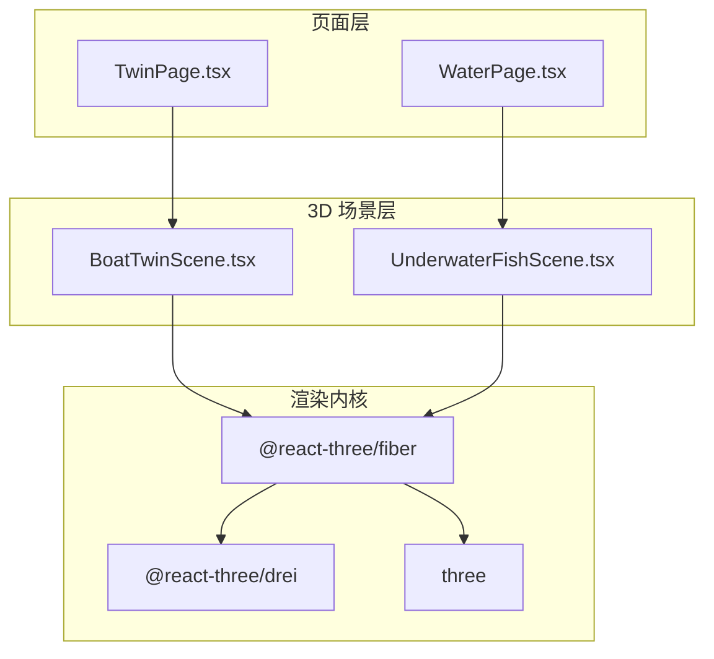
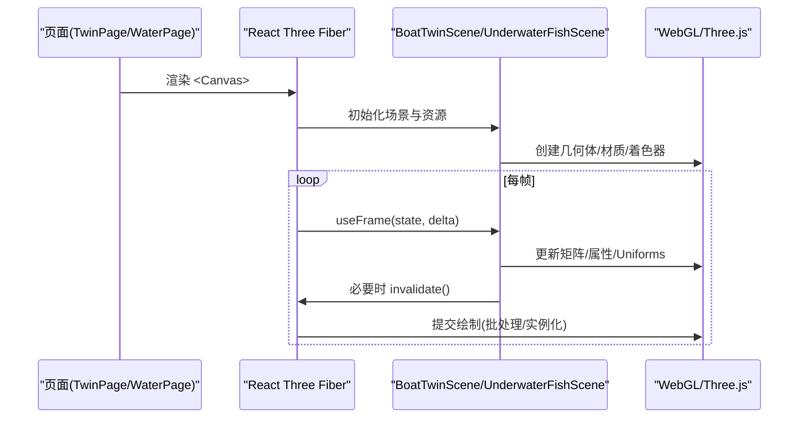
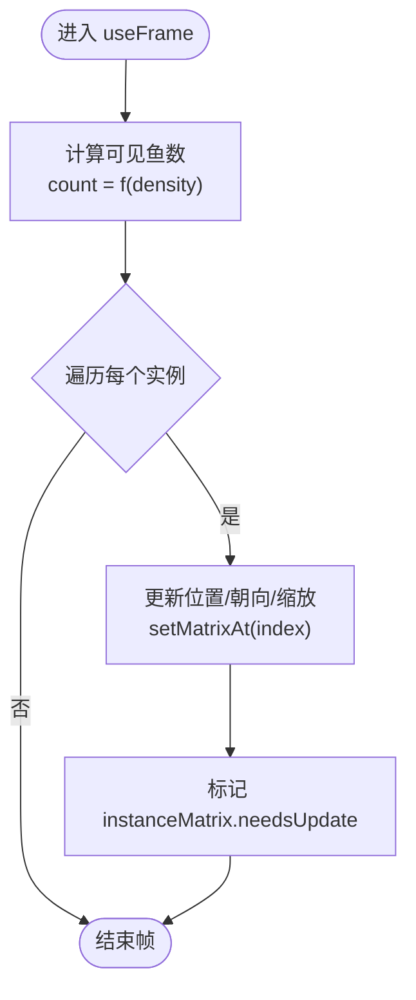
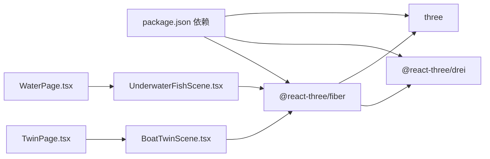

# 渲染性能优化

<cite>
**本文引用的文件**
- [BoatTwinScene.tsx](file://apps/frontend/src/components/three/BoatTwinScene.tsx)
- [UnderwaterFishScene.tsx](file://apps/frontend/src/components/three/UnderwaterFishScene.tsx)
- [TwinPage.tsx](file://apps/frontend/src/components/dashboard/TwinPage.tsx)
- [WaterPage.tsx](file://apps/frontend/src/components/dashboard/WaterPage.tsx)
- [DashboardPrimitives.tsx](file://apps/frontend/src/components/dashboard/DashboardPrimitives.tsx)
- [package.json](file://apps/frontend/package.json)
</cite>

## 目录
1. [简介](#简介)
2. [项目结构](#项目结构)
3. [核心组件](#核心组件)
4. [架构总览](#架构总览)
5. [详细组件分析](#详细组件分析)
6. [依赖关系分析](#依赖关系分析)
7. [性能考量](#性能考量)
8. [故障排查指南](#故障排查指南)
9. [结论](#结论)
10. [附录](#附录)

## 简介
本文件围绕 Three.js 与 React Three Fiber（R3F）在该渔业数字孪生平台中的渲染性能优化实践，系统梳理模型简化、着色器优化、帧率控制、内存管理以及渲染管线优化等关键主题。文档结合仓库中实际代码实现，提供可视化流程图与时序图，并给出可操作的诊断与调优建议，帮助开发者在复杂 3D 场景中稳定维持高帧率与低内存占用。

## 项目结构
前端应用基于 Next.js + React，使用 @react-three/fiber 与 drei 构建 3D 场景；Three.js 作为底层渲染引擎。主要 3D 相关代码集中在：
- 船舶数字孪生场景：BoatTwinScene.tsx
- 水下鱼群场景：UnderwaterFishScene.tsx
- 页面集成：TwinPage.tsx、WaterPage.tsx
- 通用 UI 基础组件：DashboardPrimitives.tsx
- 依赖版本：package.json

图表来源
- [TwinPage.tsx:14-102](file://apps/frontend/src/components/dashboard/TwinPage.tsx#L14-L102)
- [BoatTwinScene.tsx:1-10](file://apps/frontend/src/components/three/BoatTwinScene.tsx#L1-L10)
- [UnderwaterFishScene.tsx:1-10](file://apps/frontend/src/components/three/UnderwaterFishScene.tsx#L1-L10)
- [package.json:14-31](file://apps/frontend/package.json#L14-L31)

章节来源
- [TwinPage.tsx:14-102](file://apps/frontend/src/components/dashboard/TwinPage.tsx#L14-L102)
- [package.json:14-31](file://apps/frontend/package.json#L14-L31)

## 核心组件
- 船舶数字孪生场景（BoatTwinScene.tsx）
  - 自定义水波顶点/片段着色器，实现水面动态波纹与高光
  - 自适应刷新率与帧率节流：通过 SceneTicker 以固定 FPS 触发 invalidate，降低 CPU/GPU 压力
  - useFrame 驱动船体运动、设备反馈动画、传送带与尾迹效果
  - 使用 OrbitControls、useGLTF、Bounds 等 drei 工具提升交互与加载体验
- 水下鱼群场景（UnderwaterFishScene.tsx）
  - 使用 InstancedMesh 批量绘制鱼体与鱼尾，显著减少 draw call
  - 动态密度控制：根据 density 计算可见鱼数，限制最大数量 MAX_FISH
  - 主动设置 instanceMatrix.setUsage(DynamicDrawUsage)，提高频繁更新矩阵的性能
  - Canvas 配置 dpr 范围与 frameloop 策略，按需渲染
- 页面集成（TwinPage.tsx、WaterPage.tsx）
  - 动态导入 3D 场景，避免首屏阻塞
  - 通过 key 重置场景实例，便于切换参数或恢复状态
  - 提供全屏、视角复位、开关“实时水面”等交互，间接影响渲染负载

章节来源
- [BoatTwinScene.tsx:92-151](file://apps/frontend/src/components/three/BoatTwinScene.tsx#L92-L151)
- [BoatTwinScene.tsx:219-273](file://apps/frontend/src/components/three/BoatTwinScene.tsx#L219-L273)
- [UnderwaterFishScene.tsx:38-50](file://apps/frontend/src/components/three/UnderwaterFishScene.tsx#L38-L50)
- [UnderwaterFishScene.tsx:90-160](file://apps/frontend/src/components/three/UnderwaterFishScene.tsx#L90-L160)
- [UnderwaterFishScene.tsx:162-236](file://apps/frontend/src/components/three/UnderwaterFishScene.tsx#L162-L236)
- [TwinPage.tsx:14-102](file://apps/frontend/src/components/dashboard/TwinPage.tsx#L14-L102)
- [WaterPage.tsx:45-217](file://apps/frontend/src/components/dashboard/WaterPage.tsx#L45-L217)

## 架构总览
下图展示了从页面到 3D 场景再到渲染内核的调用链，以及关键性能优化点的位置。

图表来源
- [BoatTwinScene.tsx:128-151](file://apps/frontend/src/components/three/BoatTwinScene.tsx#L128-L151)
- [UnderwaterFishScene.tsx:162-236](file://apps/frontend/src/components/three/UnderwaterFishScene.tsx#L162-L236)
- [TwinPage.tsx:86-102](file://apps/frontend/src/components/dashboard/TwinPage.tsx#L86-L102)

## 详细组件分析

### 模型简化与几何体面数优化
- 几何体选择与分段数控制
  - 鱼群场景使用低多边形球体与锥体作为鱼体与鱼尾，降低三角面数
  - 水面使用平面几何体，分段数适中，配合顶点着色器产生波浪
- 实例化渲染
  - 使用 InstancedMesh 同时绘制鱼体与鱼尾，将大量对象合并为少量 draw call
  - 通过 setMatrixAt 与 needsUpdate 高效更新实例矩阵
- 视距与可见性
  - 通过 Canvas 的 dpr 范围限制像素密度，减少高分屏下的过度采样
  - 使用 frustumCulled=false 时需谨慎，当前鱼群关闭剔除以提升稳定性，但需评估代价

图表来源
- [UnderwaterFishScene.tsx:90-160](file://apps/frontend/src/components/three/UnderwaterFishScene.tsx#L90-L160)
- [UnderwaterFishScene.tsx:162-236](file://apps/frontend/src/components/three/UnderwaterFishScene.tsx#L162-L236)

章节来源
- [UnderwaterFishScene.tsx:90-160](file://apps/frontend/src/components/three/UnderwaterFishScene.tsx#L90-L160)
- [UnderwaterFishScene.tsx:162-236](file://apps/frontend/src/components/three/UnderwaterFishScene.tsx#L162-L236)

### LOD（细节层次）系统实现
- 当前未显式实现 LOD 组件，但可通过以下策略达到类似效果：
  - 按距离切换模型：在 useFrame 中根据相机距离选择不同精度的模型或材质
  - 按屏幕占比降级：根据对象投影大小决定启用/禁用阴影、反射或后处理
  - 结合 useGLTF 的缓存与按需加载，延迟加载远处模型的纹理与网格
- 建议落地方式
  - 在 VesselRig 或 WorkEquipmentRig 中增加距离判断，切换 geometry 或 material
  - 对大型模型使用多级 glb 资源，按视距动态替换

[本节为概念性说明，不直接分析具体文件]

### 纹理压缩与资源管理
- 当前代码未直接使用纹理压缩库，但可通过以下方式优化：
  - 使用 KTX2/BC 纹理格式并通过 three-stdlib 的 TextureLoader 加载
  - 对重复使用的纹理进行全局缓存，避免重复解码与上传
  - 合理设置纹理 mipmaps 与 wrap 模式，减少过采样与混叠
- 结合项目现状
  - 场景内多为程序化几何与简单材质，纹理压力较小
  - 若引入外部模型，建议优先采用压缩纹理与按需加载

[本节为概念性说明，不直接分析具体文件]

### 着色器优化技术
- 自定义水波着色器（BoatTwinScene.tsx）
  - 顶点着色器叠加多层正弦/余弦波，产生自然水面起伏
  - 片段着色器混合浅水色与深水色，叠加波纹高光，透明度可控
  - 使用 uniform uTime 驱动时间变化，避免 CPU 端高频更新
- 光照与阴影优化
  - 合理使用环境光、半球光与方向光，避免过多光源
  - 对非关键对象关闭阴影接收/投射，或使用共享阴影贴图
  - 使用 MeshStandardMaterial/MeshPhysicalMaterial 时控制 roughness/metalness，减少复杂光照计算
- 性能要点
  - 将复杂数学运算尽量放在 GPU 端（着色器），CPU 仅传递必要 uniform
  - 避免每帧重建着色器或材质，复用对象

章节来源
- [BoatTwinScene.tsx:92-126](file://apps/frontend/src/components/three/BoatTwinScene.tsx#L92-L126)
- [UnderwaterFishScene.tsx:62-87](file://apps/frontend/src/components/three/UnderwaterFishScene.tsx#L62-L87)

### 帧率控制机制
- 自适应刷新率与请求动画帧优化
  - 使用 R3F 的 useFrame 统一调度，避免手动 requestAnimationFrame 造成的重复循环
  - 在非必要动画区域使用 SceneTicker 以固定 FPS 触发 invalidate，降低主线程压力
- 渲染节流策略
  - 通过 frameInterval 控制刷新频率，适合演示/预览场景
  - 在数据密集更新时（如鱼群轨迹）限制 delta 上限，防止跳帧抖动
- 最佳实践
  - 将昂贵计算放入 useFrame 的早期阶段，尽早 return 跳过无意义更新
  - 使用 demand 模式（frameloop="demand"）在非活跃场景暂停渲染

章节来源
- [BoatTwinScene.tsx:128-151](file://apps/frontend/src/components/three/BoatTwinScene.tsx#L128-L151)
- [UnderwaterFishScene.tsx:38-50](file://apps/frontend/src/components/three/UnderwaterFishScene.tsx#L38-L50)
- [UnderwaterFishScene.tsx:162-171](file://apps/frontend/src/components/three/UnderwaterFishScene.tsx#L162-L171)

### 内存管理优化
- 对象池复用
  - 使用 useMemo 预分配常用对象（Vector3、Quaternion、Color、Object3D），减少 GC 压力
  - 在鱼群场景中复用 dummy、direction、side 等临时对象
- 纹理与 GPU 资源释放
  - 卸载不再使用的模型/纹理，调用 dispose 释放 GPU 内存
  - 避免在 useFrame 中创建新材质或几何体
- 实例化与 Draw Call 优化
  - 使用 InstancedMesh 合并同类对象，减少 draw call
  - 合理设置 instanceMatrix.setUsage(DynamicDrawUsage) 提升频繁更新性能

章节来源
- [UnderwaterFishScene.tsx:125-160](file://apps/frontend/src/components/three/UnderwaterFishScene.tsx#L125-L160)
- [UnderwaterFishScene.tsx:162-236](file://apps/frontend/src/components/three/UnderwaterFishScene.tsx#L162-L236)

### 渲染管线优化
- 批处理渲染
  - 将静态背景元素（海底、岩石）一次性构建，避免每帧重建
  - 使用 BufferGeometry 与 attributes 直接操作顶点数据
- 实例化渲染
  - 鱼群主体与尾部分别使用 InstancedMesh，按索引设置矩阵与颜色
- 视锥剔除
  - 默认开启剔除；当前鱼群关闭剔除以保证稳定性，可根据需求重新开启
  - 对大场景使用分组与层级管理，减少不可见对象的计算

章节来源
- [UnderwaterFishScene.tsx:238-249](file://apps/frontend/src/components/three/UnderwaterFishScene.tsx#L238-L249)
- [UnderwaterFishScene.tsx:285-319](file://apps/frontend/src/components/three/UnderwaterFishScene.tsx#L285-L319)

## 依赖关系分析
- 运行时依赖
  - @react-three/fiber 提供 Canvas、useFrame、useThree 等能力
  - @react-three/drei 提供 OrbitControls、useGLTF、Bounds 等实用工具
  - three 为底层 WebGL 抽象与渲染内核
- 页面与场景耦合
  - TwinPage 动态导入 BoatTwinScene，避免首屏阻塞
  - WaterPage 展示水质数据与图表，与 3D 场景解耦

图表来源
- [package.json:14-31](file://apps/frontend/package.json#L14-L31)
- [TwinPage.tsx:14-102](file://apps/frontend/src/components/dashboard/TwinPage.tsx#L14-L102)
- [BoatTwinScene.tsx:1-10](file://apps/frontend/src/components/three/BoatTwinScene.tsx#L1-L10)
- [UnderwaterFishScene.tsx:1-10](file://apps/frontend/src/components/three/UnderwaterFishScene.tsx#L1-L10)

章节来源
- [package.json:14-31](file://apps/frontend/package.json#L14-L31)
- [TwinPage.tsx:14-102](file://apps/frontend/src/components/dashboard/TwinPage.tsx#L14-L102)

## 性能考量
- 模型与几何
  - 优先使用低多边形几何；对远距离对象使用简化版本
  - 合并静态几何，减少 draw call
- 着色器与材质
  - 将复杂计算移至 GPU；避免每帧创建材质/着色器
  - 控制透明与深度写入，减少排序与重绘开销
- 帧率与动画
  - 使用 useFrame 统一管理；对非关键动画使用节流
  - 在不可见或后台标签页中暂停渲染（frameloop="never"/"demand"）
- 内存与资源
  - 复用对象，避免频繁分配
  - 及时释放不再使用的纹理与几何
- 渲染管线
  - 使用 InstancedMesh 批量绘制
  - 谨慎关闭视锥剔除，仅在必要时使用

[本节为通用指导，不直接分析具体文件]

## 故障排查指南
- 帧率下降
  - 检查是否存在每帧创建材质/几何体的行为
  - 确认 useFrame 中是否有昂贵计算或未提前 return
  - 观察是否启用了过多光源或阴影
- 内存泄漏
  - 检查是否在卸载场景时释放了纹理与几何
  - 确认是否重复订阅事件或未清理定时器
- 卡顿与掉帧
  - 检查 instanceMatrix 更新是否频繁且未正确标记 needsUpdate
  - 确认是否误用 frustumCulled=false 导致大量不可见对象参与渲染
- 调试建议
  - 使用浏览器性能面板记录帧耗时，定位热点函数
  - 逐步关闭特效（如水波、粒子）验证性能瓶颈

[本节为通用指导，不直接分析具体文件]

## 结论
本项目在 3D 渲染方面已具备多项高性能实践：自定义水波着色器、实例化鱼群、帧率节流与按需渲染、对象复用与动态绘制标记等。为进一步优化，建议引入 LOD、纹理压缩、更精细的视锥剔除与资源生命周期管理，并结合性能监控持续迭代。通过这些措施，可在复杂数字孪生场景中稳定维持高帧率与低内存占用。

[本节为总结性内容，不直接分析具体文件]

## 附录
- 关键实现路径参考
  - 水波着色器：BoatTwinScene.tsx
  - 鱼群实例化与更新：UnderwaterFishScene.tsx
  - 页面集成与动态导入：TwinPage.tsx
  - 基础 UI 与视觉就绪钩子：DashboardPrimitives.tsx
  - 依赖版本：package.json

章节来源
- [BoatTwinScene.tsx:92-151](file://apps/frontend/src/components/three/BoatTwinScene.tsx#L92-L151)
- [UnderwaterFishScene.tsx:90-236](file://apps/frontend/src/components/three/UnderwaterFishScene.tsx#L90-L236)
- [TwinPage.tsx:14-102](file://apps/frontend/src/components/dashboard/TwinPage.tsx#L14-L102)
- [DashboardPrimitives.tsx:95-101](file://apps/frontend/src/components/dashboard/DashboardPrimitives.tsx#L95-L101)
- [package.json:14-31](file://apps/frontend/package.json#L14-L31)