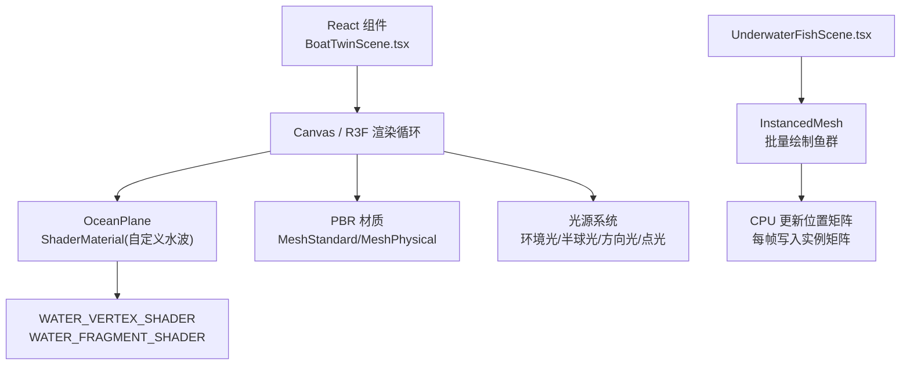
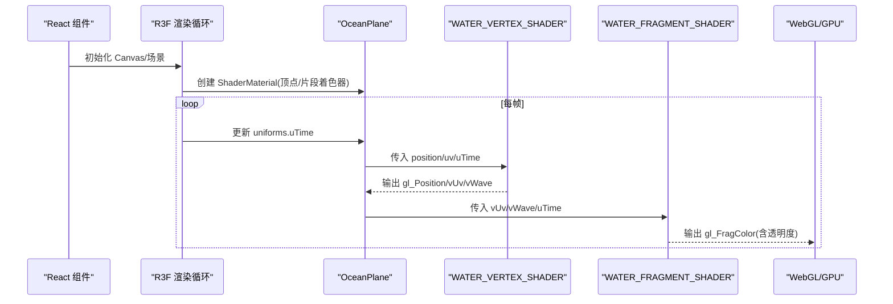
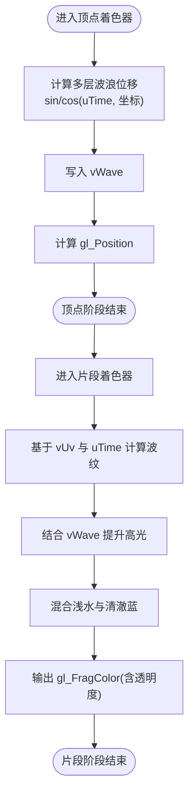
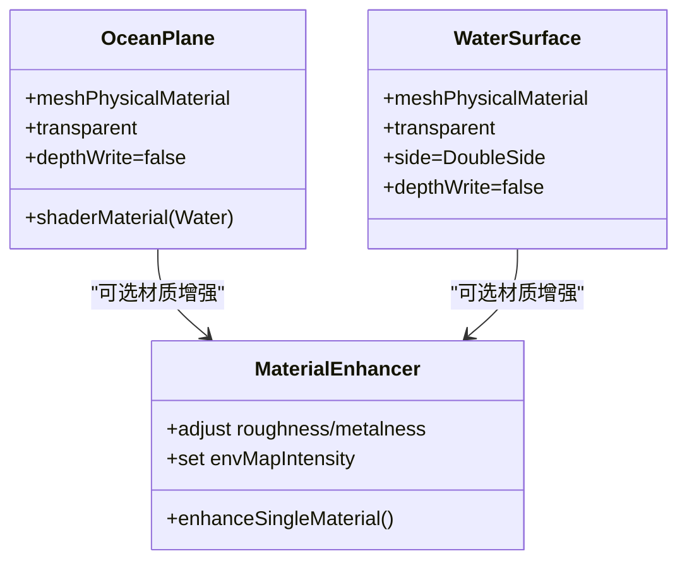
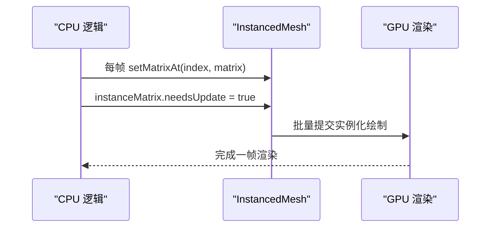
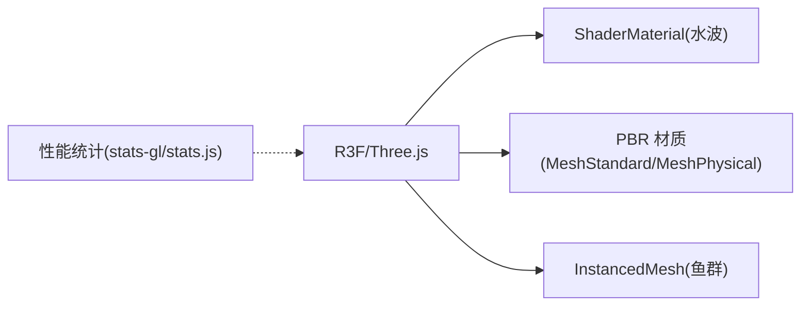

# 着色器优化技术

<cite>
**本文引用的文件**
- [BoatTwinScene.tsx](file://fishery-digital-twin-platform/apps/frontend/src/components/three/BoatTwinScene.tsx)
- [UnderwaterFishScene.tsx](file://fishery-digital-twin-platform/apps/frontend/src/components/three/UnderwaterFishScene.tsx)
</cite>

## 目录
1. [简介](#简介)
2. [项目结构](#项目结构)
3. [核心组件](#核心组件)
4. [架构总览](#架构总览)
5. [详细组件分析](#详细组件分析)
6. [依赖关系分析](#依赖关系分析)
7. [性能考量](#性能考量)
8. [故障排查指南](#故障排查指南)
9. [结论](#结论)
10. [附录](#附录)

## 简介
本文件聚焦于本项目中自定义水波着色器的实现与优化，涵盖顶点着色器与片段着色器的编写技巧、光照计算优化（PBR材质、阴影渲染优化、实时光照）、GPU资源管理（uniform变量优化、批处理渲染）以及调试与性能分析方法。文档以代码级事实为依据，结合可视化图示帮助读者理解数据流与渲染管线。

## 项目结构
- 前端Three.js场景位于 React + R3F 组件中，水波效果通过自定义 ShaderMaterial 实现，包含内联的顶点着色器与片段着色器常量。
- 水下鱼群场景使用 InstancedMesh 进行批量绘制，并通过 CPU 侧更新几何位置，体现批处理与动态绘制策略。
- 场景整体采用 PBR 材质体系（MeshStandardMaterial/MeshPhysicalMaterial），配合多光源与环境映射强度控制，形成真实感光照。

图表来源
- [BoatTwinScene.tsx:92-126](file://fishery-digital-twin-platform/apps/frontend/src/components/three/BoatTwinScene.tsx#L92-L126)
- [BoatTwinScene.tsx:1060-1093](file://fishery-digital-twin-platform/apps/frontend/src/components/three/BoatTwinScene.tsx#L1060-L1093)
- [UnderwaterFishScene.tsx:238-283](file://fishery-digital-twin-platform/apps/frontend/src/components/three/UnderwaterFishScene.tsx#L238-L283)

章节来源
- [BoatTwinScene.tsx:92-126](file://fishery-digital-twin-platform/apps/frontend/src/components/three/BoatTwinScene.tsx#L92-L126)
- [BoatTwinScene.tsx:1060-1093](file://fishery-digital-twin-platform/apps/frontend/src/components/three/BoatTwinScene.tsx#L1060-L1093)
- [UnderwaterFishScene.tsx:238-283](file://fishery-digital-twin-platform/apps/frontend/src/components/three/UnderwaterFishScene.tsx#L238-L283)

## 核心组件
- 自定义水波着色器：通过内联常量定义顶点与片段着色器，使用 uniform uTime 驱动动画，在顶点阶段叠加多层正弦波位移，在片段阶段基于 UV 和时间生成波纹与高光。
- OceanPlane：将平面网格与 ShaderMaterial 组合，设置透明与深度写入关闭，避免遮挡后续透明物体。
- PBR 材质增强：对导入模型材质进行统一增强，调整 roughness/metalness/envMapIntensity，并依据角色颜色策略覆盖材质属性。
- 水下水面：使用 MeshPhysicalMaterial 模拟半透明水面，配合 CPU 侧逐顶点更新波浪高度。
- 鱼群批处理：使用 InstancedMesh 批量绘制，每帧更新 instanceMatrix，减少 draw call。

章节来源
- [BoatTwinScene.tsx:92-126](file://fishery-digital-twin-platform/apps/frontend/src/components/three/BoatTwinScene.tsx#L92-L126)
- [BoatTwinScene.tsx:1060-1093](file://fishery-digital-twin-platform/apps/frontend/src/components/three/BoatTwinScene.tsx#L1060-L1093)
- [BoatTwinScene.tsx:872-946](file://fishery-digital-twin-platform/apps/frontend/src/components/three/BoatTwinScene.tsx#L872-L946)
- [UnderwaterFishScene.tsx:252-283](file://fishery-digital-twin-platform/apps/frontend/src/components/three/UnderwaterFishScene.tsx#L252-L283)
- [UnderwaterFishScene.tsx:238-283](file://fishery-digital-twin-platform/apps/frontend/src/components/three/UnderwaterFishScene.tsx#L238-L283)

## 架构总览
下图展示从 React 组件到 GPU 渲染的关键路径：组件初始化 Canvas，创建 OceanPlane 并绑定自定义着色器；每帧通过 useFrame 更新 uniform uTime；片段着色器根据 UV 和时间计算波纹与高光；同时 PBR 材质与多光源参与光照计算。

图表来源
- [BoatTwinScene.tsx:92-126](file://fishery-digital-twin-platform/apps/frontend/src/components/three/BoatTwinScene.tsx#L92-L126)
- [BoatTwinScene.tsx:1060-1093](file://fishery-digital-twin-platform/apps/frontend/src/components/three/BoatTwinScene.tsx#L1060-L1093)

## 详细组件分析

### 自定义水波着色器（WATER_VERTEX_SHADER / WATER_FRAGMENT_SHADER）
- 顶点着色器
  - 输入：position、uv、uTime
  - 处理：叠加多个正弦/余弦项产生三维波浪位移，并将位移结果写入 varying vWave
  - 输出：gl_Position 与 varying 值
- 片段着色器
  - 输入：vUv、vWave、uTime
  - 处理：基于 UV 与时间生成波纹纹理，结合 vWave 提升高光区域；混合浅水与清澈蓝色；输出带透明度的颜色
- 优化要点
  - 使用少量三角函数与线性插值，避免复杂噪声或多次采样
  - 将高频细节限制在片段阶段，降低顶点计算压力
  - 合理设置 depthWrite=false 与透明度，确保正确排序与融合

图表来源
- [BoatTwinScene.tsx:92-126](file://fishery-digital-twin-platform/apps/frontend/src/components/three/BoatTwinScene.tsx#L92-L126)

章节来源
- [BoatTwinScene.tsx:92-126](file://fishery-digital-twin-platform/apps/frontend/src/components/three/BoatTwinScene.tsx#L92-L126)

### 水面与 PBR 材质
- OceanPlane 使用 ShaderMaterial 渲染水波，底层平面使用 MeshPhysicalMaterial 提供清漆层与反射特性，增强水体质感。
- 水下水面使用 MeshPhysicalMaterial，开启透明与双面渲染，关闭深度写入以避免遮挡问题。
- 模型材质增强：统一调整 roughness/metalness/envMapIntensity，按角色颜色策略覆盖材质，保证视觉一致性与性能稳定。

图表来源
- [BoatTwinScene.tsx:1060-1093](file://fishery-digital-twin-platform/apps/frontend/src/components/three/BoatTwinScene.tsx#L1060-L1093)
- [UnderwaterFishScene.tsx:252-283](file://fishery-digital-twin-platform/apps/frontend/src/components/three/UnderwaterFishScene.tsx#L252-L283)
- [BoatTwinScene.tsx:872-946](file://fishery-digital-twin-platform/apps/frontend/src/components/three/BoatTwinScene.tsx#L872-L946)

章节来源
- [BoatTwinScene.tsx:1060-1093](file://fishery-digital-twin-platform/apps/frontend/src/components/three/BoatTwinScene.tsx#L1060-L1093)
- [UnderwaterFishScene.tsx:252-283](file://fishery-digital-twin-platform/apps/frontend/src/components/three/UnderwaterFishScene.tsx#L252-L283)
- [BoatTwinScene.tsx:872-946](file://fishery-digital-twin-platform/apps/frontend/src/components/three/BoatTwinScene.tsx#L872-L946)

### 批处理渲染与 GPU 资源管理
- 鱼群使用 InstancedMesh，每帧更新 instanceMatrix，减少 draw call 数量，提高吞吐。
- 使用 DynamicDrawUsage 标记频繁更新的实例缓冲，提示 GPU 优化路径。
- 通过 useMemo/useRef 缓存对象与数组，避免每帧分配内存，降低 GC 压力。
- 场景帧率自适应：在高运动或交互时提高刷新频率，否则降频至较低 fps，节省 GPU 功耗。

图表来源
- [UnderwaterFishScene.tsx:135-160](file://fishery-digital-twin-platform/apps/frontend/src/components/three/UnderwaterFishScene.tsx#L135-L160)
- [UnderwaterFishScene.tsx:162-236](file://fishery-digital-twin-platform/apps/frontend/src/components/three/UnderwaterFishScene.tsx#L162-L236)
- [BoatTwinScene.tsx:1664-1677](file://fishery-digital-twin-platform/apps/frontend/src/components/three/BoatTwinScene.tsx#L1664-L1677)

章节来源
- [UnderwaterFishScene.tsx:135-160](file://fishery-digital-twin-platform/apps/frontend/src/components/three/UnderwaterFishScene.tsx#L135-L160)
- [UnderwaterFishScene.tsx:162-236](file://fishery-digital-twin-platform/apps/frontend/src/components/three/UnderwaterFishScene.tsx#L162-L236)
- [BoatTwinScene.tsx:1664-1677](file://fishery-digital-twin-platform/apps/frontend/src/components/three/BoatTwinScene.tsx#L1664-L1677)

### 光照计算优化（PBR、阴影、实时光照）
- PBR 材质：通过 MeshStandardMaterial/MeshPhysicalMaterial 的 roughness/metalness/envMapIntensity 控制反射与漫反射，提升真实感。
- 光源配置：环境光、半球光、方向光与点光组合，提供基础照明与局部高光。
- 阴影优化：模型网格默认关闭 castShadow/receiveShadow，减少阴影计算开销；如需阴影，建议仅对关键地面接收阴影。
- 实时光照：通过多光源与合理的强度/距离参数，平衡视觉效果与性能。

章节来源
- [BoatTwinScene.tsx:872-946](file://fishery-digital-twin-platform/apps/frontend/src/components/three/BoatTwinScene.tsx#L872-L946)
- [BoatTwinScene.tsx:1717-1723](file://fishery-digital-twin-platform/apps/frontend/src/components/three/BoatTwinScene.tsx#L1717-L1723)
- [UnderwaterFishScene.tsx:62-74](file://fishery-digital-twin-platform/apps/frontend/src/components/three/UnderwaterFishScene.tsx#L62-L74)

## 依赖关系分析
- 组件依赖：BoatTwinScene 依赖 R3F Canvas、Drei 工具与 Three.js 材质/几何体；UnderwaterFishScene 依赖 InstancedMesh 与 BufferGeometry。
- 渲染管线：着色器作为 ShaderMaterial 的一部分被 R3F 管线调用；PBR 材质与光源由 Three.js 内置管线处理。
- 外部库：stats-gl/stats.js 等可用于性能监控（在包依赖中可见）。

图表来源
- [BoatTwinScene.tsx:1060-1093](file://fishery-digital-twin-platform/apps/frontend/src/components/three/BoatTwinScene.tsx#L1060-L1093)
- [UnderwaterFishScene.tsx:238-283](file://fishery-digital-twin-platform/apps/frontend/src/components/three/UnderwaterFishScene.tsx#L238-L283)

章节来源
- [BoatTwinScene.tsx:1060-1093](file://fishery-digital-twin-platform/apps/frontend/src/components/three/BoatTwinScene.tsx#L1060-L1093)
- [UnderwaterFishScene.tsx:238-283](file://fishery-digital-twin-platform/apps/frontend/src/components/three/UnderwaterFishScene.tsx#L238-L283)

## 性能考量
- 着色器复杂度：当前水波着色器使用少量三角函数与线性插值，避免昂贵噪声或多次采样，适合移动端与低端设备。
- 批处理与实例化：鱼群使用 InstancedMesh 显著减少 draw call，提升吞吐。
- 帧率自适应：根据交互与运动状态动态调整刷新频率，降低空闲时的 GPU 负载。
- 透明与深度写入：水波与水面关闭 depthWrite，避免不必要的重绘与排序问题。
- 材质与环境映射：通过 envMapIntensity 控制反射强度，避免过度采样带来的性能损失。

[本节为通用性能指导，不直接分析具体文件]

## 故障排查指南
- 常见问题
  - 水面闪烁或遮挡：检查 transparent 与 depthWrite 设置，确保顺序正确。
  - 性能下降：确认是否启用了过多阴影或过高的分辨率（dpr），必要时降低 dpr 或关闭非必要特效。
  - 着色器编译错误：检查 uniform 名称与类型是否与 JS 端一致，避免未定义变量。
- 调试方法
  - 使用浏览器开发者工具的 WebGL 面板查看 draw call 与着色器信息。
  - 使用 stats-gl/stats.js 监控帧率与 GPU/CPU 占用。
  - 逐步注释着色器代码定位瓶颈（如移除高频波纹项观察性能变化）。

章节来源
- [BoatTwinScene.tsx:1060-1093](file://fishery-digital-twin-platform/apps/frontend/src/components/three/BoatTwinScene.tsx#L1060-L1093)
- [UnderwaterFishScene.tsx:252-283](file://fishery-digital-twin-platform/apps/frontend/src/components/three/UnderwaterFishScene.tsx#L252-L283)

## 结论
本项目通过自定义水波着色器与 PBR 材质体系实现了高质量的水面效果，并在批处理渲染、帧率自适应与材质优化方面采取了多项措施以提升性能。未来可进一步引入预计算法线贴图、屏幕空间反射/折射、LOD 与更精细的光照烘焙，以在保持流畅的同时提升视觉表现。

[本节为总结性内容，不直接分析具体文件]

## 附录
- 代码示例路径（用于参考实现与优化思路）
  - 水波顶点/片段着色器：[BoatTwinScene.tsx:92-126](file://fishery-digital-twin-platform/apps/frontend/src/components/three/BoatTwinScene.tsx#L92-L126)
  - OceanPlane 与 ShaderMaterial 绑定：[BoatTwinScene.tsx:1060-1093](file://fishery-digital-twin-platform/apps/frontend/src/components/three/BoatTwinScene.tsx#L1060-L1093)
  - 水下水面与 PBR 材质：[UnderwaterFishScene.tsx:252-283](file://fishery-digital-twin-platform/apps/frontend/src/components/three/UnderwaterFishScene.tsx#L252-L283)
  - 鱼群批处理与实例矩阵更新：[UnderwaterFishScene.tsx:135-236](file://fishery-digital-twin-platform/apps/frontend/src/components/three/UnderwaterFishScene.tsx#L135-L236)
  - 材质增强与 PBR 参数调优：[BoatTwinScene.tsx:872-946](file://fishery-digital-twin-platform/apps/frontend/src/components/three/BoatTwinScene.tsx#L872-L946)
  - 帧率自适应与渲染循环控制：[BoatTwinScene.tsx:1664-1677](file://fishery-digital-twin-platform/apps/frontend/src/components/three/BoatTwinScene.tsx#L1664-L1677)