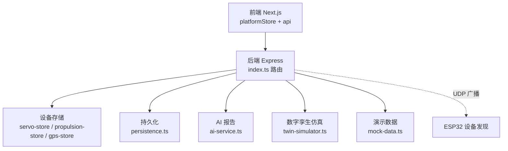
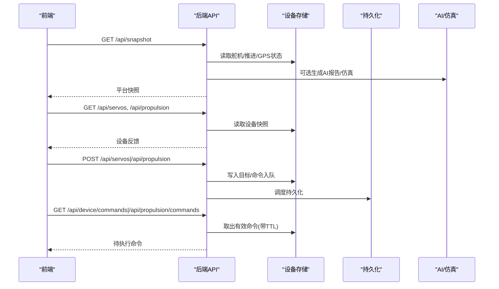
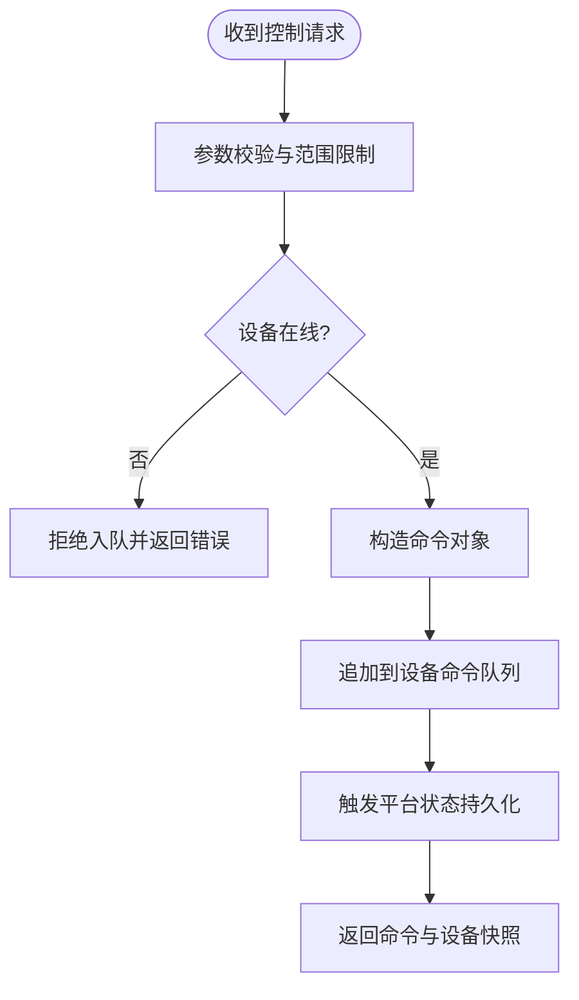
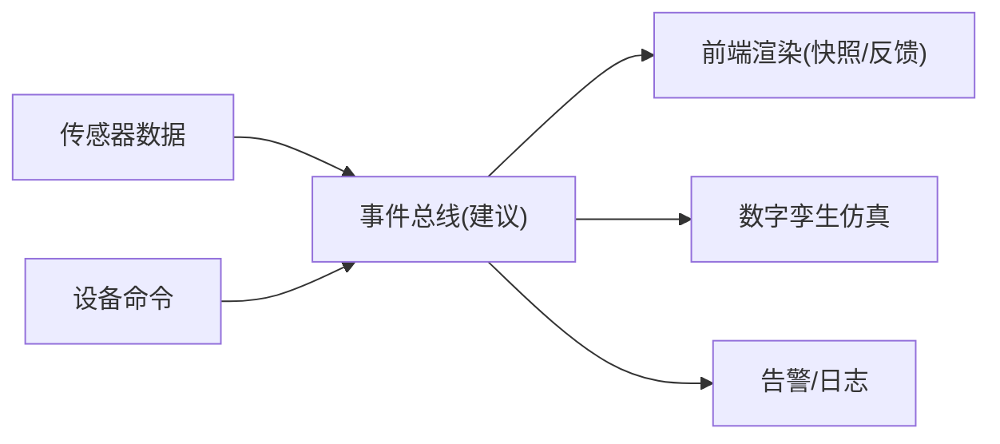
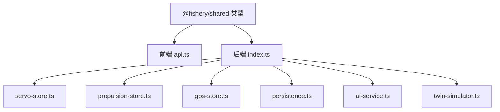

# 实时通信优化

<cite>
**本文引用的文件**
- [index.ts](file://fishery-digital-twin-platform/apps/backend/src/index.ts)
- [persistence.ts](file://fishery-digital-twin-platform/apps/backend/src/persistence.ts)
- [twin-simulator.ts](file://fishery-digital-twin-platform/apps/backend/src/twin-simulator.ts)
- [gps-store.ts](file://fishery-digital-twin-platform/apps/backend/src/gps-store.ts)
- [propulsion-store.ts](file://fishery-digital-twin-platform/apps/backend/src/propulsion-store.ts)
- [servo-store.ts](file://fishery-digital-twin-platform/apps/backend/src/servo-store.ts)
- [ai-service.ts](file://fishery-digital-twin-platform/apps/backend/src/ai-service.ts)
- [mock-data.ts](file://fishery-digital-twin-platform/apps/backend/src/mock-data.ts)
- [index.ts（共享类型）](file://fishery-digital-twin-platform/packages/shared/src/index.ts)
- [api.ts（前端API）](file://fishery-digital-twin-platform/apps/frontend/src/lib/api.ts)
- [platformStore.ts（前端状态）](file://fishery-digital-twin-platform/apps/frontend/src/lib/platformStore.ts)
- [usePlatformData.ts（前端Hook）](file://fishery-digital-twin-platform/apps/frontend/src/hooks/usePlatformData.ts)
</cite>

## 目录
1. [简介](#简介)
2. [项目结构](#项目结构)
3. [核心组件](#核心组件)
4. [架构总览](#架构总览)
5. [详细组件分析](#详细组件分析)
6. [依赖关系分析](#依赖关系分析)
7. [性能与高并发优化](#性能与高并发优化)
8. [监控与调试指南](#监控与调试指南)
9. [结论](#结论)
10. [附录：接口与数据模型速查](#附录接口与数据模型速查)

## 简介
本文件面向数字孪生平台的“实时通信优化”，围绕后端HTTP服务、设备命令队列、持久化、事件驱动的数据聚合、状态同步与仿真推演，给出可落地的优化方案。当前仓库未实现WebSocket长连接，但已具备轮询拉取快照、设备命令队列、UDP发现广播、内存状态与文件持久化的基础能力。本文在尊重现有代码的前提下，补充消息队列、事件路由、背压处理、增量同步、协议扩展与扩容策略等设计建议，并给出基于现有接口的监控与调试方法。

## 项目结构
- 后端（Node/Express）
  - 入口与路由：[index.ts](file://fishery-digital-twin-platform/apps/backend/src/index.ts)
  - 设备状态与命令队列：舵机[servo-store.ts](file://fishery-digital-twin-platform/apps/backend/src/servo-store.ts)、推进器[propulsion-store.ts](file://fishery-digital-twin-platform/apps/backend/src/propulsion-store.ts)、GPS[gps-store.ts](file://fishery-digital-twin-platform/apps/backend/src/gps-store.ts)
  - 平台状态持久化：[persistence.ts](file://fishery-digital-twin-platform/apps/backend/src/persistence.ts)
  - AI报告生成：[ai-service.ts](file://fishery-digital-twin-platform/apps/backend/src/ai-service.ts)
  - 仿真与演示数据：[twin-simulator.ts](file://fishery-digital-twin-platform/apps/backend/src/twin-simulator.ts)、[mock-data.ts](file://fishery-digital-twin-platform/apps/backend/src/mock-data.ts)
- 前端（Next.js）
  - API封装：[api.ts](file://fishery-digital-twin-platform/apps/frontend/src/lib/api.ts)
  - 全局状态与轮询：[platformStore.ts](file://fishery-digital-twin-platform/apps/frontend/src/lib/platformStore.ts)
  - React Hook集成：[usePlatformData.ts](file://fishery-digital-twin-platform/apps/frontend/src/hooks/usePlatformData.ts)
- 共享类型定义：[index.ts（共享类型）](file://fishery-digital-twin-platform/packages/shared/src/index.ts)

**图示来源**
- [index.ts:56-110](file://fishery-digital-twin-platform/apps/backend/src/index.ts#L56-L110)
- [servo-store.ts:17-18](file://fishery-digital-twin-platform/apps/backend/src/servo-store.ts#L17-L18)
- [propulsion-store.ts:30-31](file://fishery-digital-twin-platform/apps/backend/src/propulsion-store.ts#L30-L31)
- [persistence.ts:12-15](file://fishery-digital-twin-platform/apps/backend/src/persistence.ts#L12-L15)

**章节来源**
- [index.ts:56-110](file://fishery-digital-twin-platform/apps/backend/src/index.ts#L56-L110)
- [platformStore.ts:20-21](file://fishery-digital-twin-platform/apps/frontend/src/lib/platformStore.ts#L20-L21)
- [api.ts:6-24](file://fishery-digital-twin-platform/apps/frontend/src/lib/api.ts#L6-L24)

## 核心组件
- HTTP API 与CORS/鉴权：统一入口、跨域控制、LAN控制令牌校验、健康检查与日志记录。
- 设备命令队列：舵机与推进器各自维护命令队列，带TTL过期清理，供设备侧轮询消费。
- 状态聚合与快照：将水质历史、电池、导航、AI报告、设备在线状态组合为平台快照。
- 持久化：内存状态定时落盘，进程退出时强制刷新，避免丢失关键状态。
- 仿真与AI：数字孪生仿真与AI报告生成，作为决策辅助输出。
- 前端轮询：客户端按固定间隔拉取快照和设备反馈，使用React外部存储模式稳定更新。

**章节来源**
- [index.ts:112-129](file://fishery-digital-twin-platform/apps/backend/src/index.ts#L112-L129)
- [servo-store.ts:106-153](file://fishery-digital-twin-platform/apps/backend/src/servo-store.ts#L106-L153)
- [propulsion-store.ts:166-231](file://fishery-digital-twin-platform/apps/backend/src/propulsion-store.ts#L166-L231)
- [persistence.ts:51-67](file://fishery-digital-twin-platform/apps/backend/src/persistence.ts#L51-L67)
- [platformStore.ts:98-139](file://fishery-digital-twin-platform/apps/frontend/src/lib/platformStore.ts#L98-L139)

## 架构总览
系统采用“HTTP轮询 + 内存状态 + 文件持久化”的轻量实时方案。前端每2秒拉取平台快照，每1秒拉取设备反馈；后端通过内存Map维护设备状态与命令队列，并通过定时器批量落盘。UDP广播用于局域网设备发现。

**图示来源**
- [index.ts:322-557](file://fishery-digital-twin-platform/apps/backend/src/index.ts#L322-L557)
- [servo-store.ts:175-183](file://fishery-digital-twin-platform/apps/backend/src/servo-store.ts#L175-L183)
- [propulsion-store.ts:310-318](file://fishery-digital-twin-platform/apps/backend/src/propulsion-store.ts#L310-L318)
- [persistence.ts:51-67](file://fishery-digital-twin-platform/apps/backend/src/persistence.ts#L51-L67)

## 详细组件分析

### 消息队列技术（设备命令队列）
- 队列形态：每个设备一个数组队列，命令对象包含id、type、device_id、参数与创建时间。
- 顺序保证：命令按写入顺序入队；消费端按时间过滤保留有效窗口内的命令。
- 持久化：命令本身不持久化，仅设备状态与平台快照持久化；命令通过TTL过期自动清理。
- 背压处理：当前为单设备单队列，无限增长风险存在；建议增加最大长度限制与丢弃策略（如覆盖最新或拒绝新命令）。
- 消费方式：设备侧通过GET命令接口轮询拉取，服务端返回有效窗口内命令并裁剪队列。

**图示来源**
- [servo-store.ts:106-153](file://fishery-digital-twin-platform/apps/backend/src/servo-store.ts#L106-L153)
- [propulsion-store.ts:166-231](file://fishery-digital-twin-platform/apps/backend/src/propulsion-store.ts#L166-L231)
- [servo-store.ts:175-183](file://fishery-digital-twin-platform/apps/backend/src/servo-store.ts#L175-L183)
- [propulsion-store.ts:310-318](file://fishery-digital-twin-platform/apps/backend/src/propulsion-store.ts#L310-L318)

**章节来源**
- [servo-store.ts:17-18](file://fishery-digital-twin-platform/apps/backend/src/servo-store.ts#L17-L18)
- [propulsion-store.ts:30-31](file://fishery-digital-twin-platform/apps/backend/src/propulsion-store.ts#L30-L31)
- [servo-store.ts:175-183](file://fishery-digital-twin-platform/apps/backend/src/servo-store.ts#L175-L183)
- [propulsion-store.ts:310-318](file://fishery-digital-twin-platform/apps/backend/src/propulsion-store.ts#L310-L318)

### 事件驱动架构（发布/订阅、路由、状态同步）
- 现状：未实现显式事件总线；通过HTTP接口完成“发布”（写状态/命令）与“订阅”（读快照/命令）。
- 建议：引入内存事件总线，将“传感器数据到达”“设备上线/离线”“命令入队”“AI报告生成”等作为事件源；订阅者包括UI渲染、仿真引擎、告警模块。
- 路由：按主题路由（如water、servo、propulsion、gps、ai），支持多订阅者与优先级。
- 状态同步：事件携带版本号或时间戳，消费者以“最后已知版本”做增量合并，避免重复计算。

[此图为概念性示意，不对应具体源码]

### 状态同步算法（冲突解决、版本控制、增量同步）
- 版本控制：所有状态对象包含时间戳或版本号字段（如last_seen、updated_at、generatedAt）。
- 冲突解决：设备状态以最近一次上报为准；命令队列以时间窗口过滤，避免陈旧命令生效。
- 增量同步：前端可按“上次更新时间”只拉取变更片段；当前实现为全量快照，可在后续扩展为diff响应。
- 一致性：设备在线判定基于last_seen超时；GPS有效性结合valid标志与时间新鲜度。

**章节来源**
- [gps-store.ts:40-53](file://fishery-digital-twin-platform/apps/backend/src/gps-store.ts#L40-L53)
- [servo-store.ts:43-58](file://fishery-digital-twin-platform/apps/backend/src/servo-store.ts#L43-L58)
- [propulsion-store.ts:82-147](file://fishery-digital-twin-platform/apps/backend/src/propulsion-store.ts#L82-L147)
- [index.ts:247-262](file://fishery-digital-twin-platform/apps/backend/src/index.ts#L247-L262)

### 实时协议优化（WebSocket扩展、消息压缩、连接复用）
- 现状：纯HTTP轮询，无WebSocket；命令下发与状态查询均为REST。
- 建议：
  - WebSocket扩展：新增/ws/snapshot与/ws/commands通道，推送快照与命令；前端维持长连接，降低请求开销。
  - 消息压缩：启用Gzip/Br压缩传输JSON；对高频小消息进行二进制编码（如MessagePack）。
  - 连接复用：同一会话复用连接，减少握手与TLS开销；心跳保活与断线重连。
- 兼容性：保持HTTP接口不变，逐步引入WS通道，前端根据环境选择协议。

[本节为通用优化建议，不直接映射具体源码]

### 数字孪生仿真与AI报告
- 仿真：输入航线、海况、故障类型与严重程度，输出ETA、能耗、完成概率、疲劳与健康评估。
- AI报告：本地基线与可选外部大模型融合，输出风险等级、发现与建议。
- 集成点：仿真与AI结果纳入平台快照，供前端展示与决策。

**章节来源**
- [twin-simulator.ts:74-253](file://fishery-digital-twin-platform/apps/backend/src/twin-simulator.ts#L74-L253)
- [ai-service.ts:167-233](file://fishery-digital-twin-platform/apps/backend/src/ai-service.ts#L167-L233)
- [index.ts:447-473](file://fishery-digital-twin-platform/apps/backend/src/index.ts#L447-L473)

## 依赖关系分析
- 后端入口依赖各store、AI、仿真与持久化模块；前端通过api.ts调用后端接口；共享类型定义贯穿前后端。
- 设备命令与状态由独立store管理，避免耦合；快照聚合函数集中组装。

**图示来源**
- [index.ts:21-44](file://fishery-digital-twin-platform/apps/backend/src/index.ts#L21-L44)
- [api.ts:1-101](file://fishery-digital-twin-platform/apps/frontend/src/lib/api.ts#L1-L101)
- [index.ts（共享类型）:1-288](file://fishery-digital-twin-platform/packages/shared/src/index.ts#L1-L288)

**章节来源**
- [index.ts:21-44](file://fishery-digital-twin-platform/apps/backend/src/index.ts#L21-L44)
- [api.ts:1-101](file://fishery-digital-twin-platform/apps/frontend/src/lib/api.ts#L1-L101)

## 性能与高并发优化
- 轮询频率调优：前端默认快照2秒、设备反馈1秒；在高并发场景可降低频率或按需拉取。
- 批处理与节流：后端持久化已采用定时器合并写入；可增加AI报告与仿真计算的节流与缓存。
- 内存容量控制：水质历史与日志有上限；命令队列需增加最大长度与丢弃策略。
- 连接与请求优化：启用Gzip/Br压缩；前端合并请求（如Promise.allSettled并行获取设备状态）。
- 水平扩展：无状态HTTP服务可横向扩容；设备命令与状态需迁移至共享存储（Redis/DB）以支持多实例。
- 背压策略：当设备上报速率超过消费能力时，服务端应丢弃旧命令或限流，避免内存膨胀。

[本节提供通用指导，不直接引用具体源码行]

## 监控与调试指南
- 健康检查：GET /api/health，查看服务状态、数据模式、AI与设备在线情况。
- 日志查询：GET /api/logs，查看系统日志与操作审计。
- 设备命令调试：GET /api/device/commands?device_id=... 与 GET /api/propulsion/commands?device_id=...，确认命令是否入队与过期。
- 状态快照：GET /api/snapshot、/api/water、/api/batteries、/api/navigation、/api/gps、/api/vessel，验证数据一致性。
- 控制接口：POST /api/servos、/api/propulsion，配合命令接口观察设备行为。
- 前端调试：platformStore中snapshotConnected与feedbackConnected指示连接状态；usePlatformData提供loading与更新时间。

**章节来源**
- [index.ts:322-557](file://fishery-digital-twin-platform/apps/backend/src/index.ts#L322-L557)
- [platformStore.ts:71-96](file://fishery-digital-twin-platform/apps/frontend/src/lib/platformStore.ts#L71-L96)
- [usePlatformData.ts:10-23](file://fishery-digital-twin-platform/apps/frontend/src/hooks/usePlatformData.ts#L10-L23)

## 结论
当前系统以HTTP轮询为核心，具备设备命令队列、状态聚合与持久化能力，适合中小规模部署。为实现更高性能的实时通信，建议引入事件总线与WebSocket通道，完善背压与增量同步机制，并在多实例环境下将状态与队列迁移至共享存储。同时，利用现有健康检查与日志接口建立完善的监控与调试流程，保障系统稳定性与可观测性。

## 附录：接口与数据模型速查
- 平台快照与数据
  - GET /api/snapshot：返回平台快照（含水质、电池、导航、AI、设备状态）
  - GET /api/water：水质历史
  - GET /api/batteries：电池状态
  - GET /api/navigation：导航信息
  - GET /api/gps：GPS状态
  - GET /api/vessel：船舶状态
- 设备控制与反馈
  - GET /api/servos：舵机快照
  - POST /api/servos：设置舵机目标角度（需鉴权）
  - GET /api/device/commands：拉取舵机命令（需鉴权）
  - GET /api/propulsion：推进器快照
  - POST /api/propulsion：设置推进器目标（需鉴权）
  - GET /api/propulsion/commands：拉取推进器命令（需鉴权）
- AI与仿真
  - GET /api/ai/status：AI配置状态
  - POST /api/ai/report：生成AI报告（限频）
  - POST /api/twin/simulate：运行数字孪生仿真（需鉴权）
- 健康与日志
  - GET /api/health：健康检查
  - GET /api/logs：系统日志

**章节来源**
- [index.ts:322-557](file://fishery-digital-twin-platform/apps/backend/src/index.ts#L322-L557)
- [index.ts（共享类型）:1-288](file://fishery-digital-twin-platform/packages/shared/src/index.ts#L1-L288)