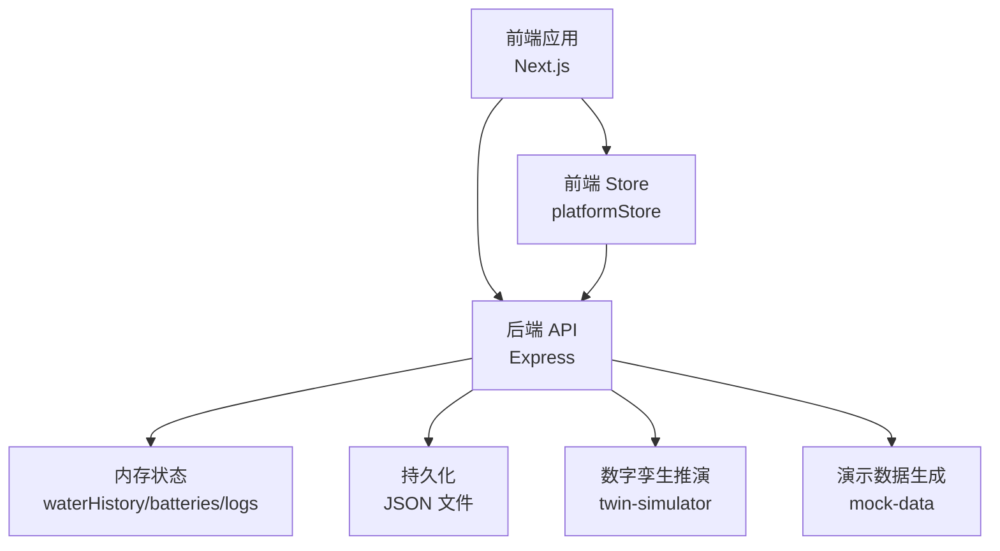
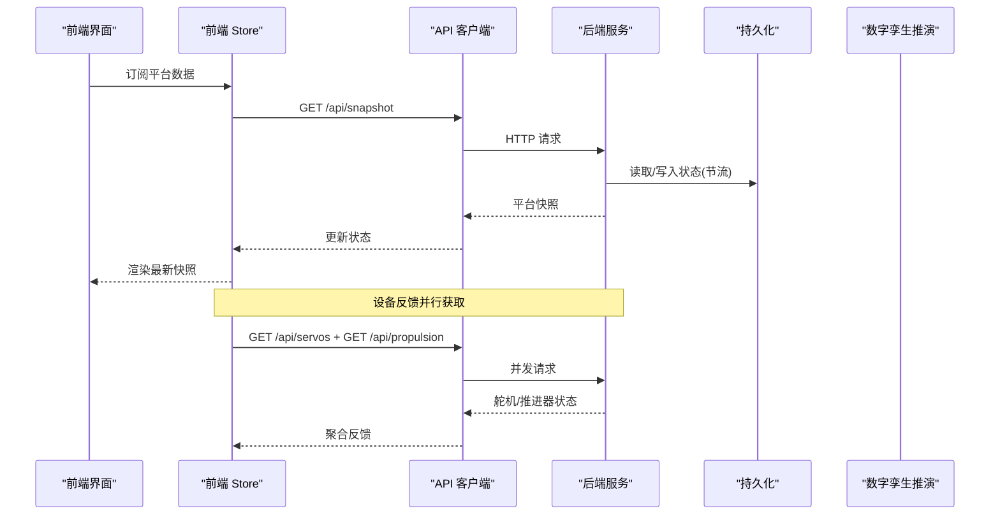
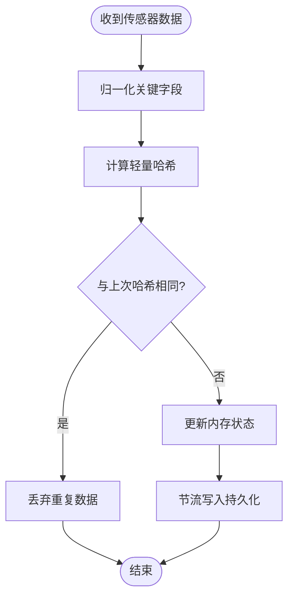
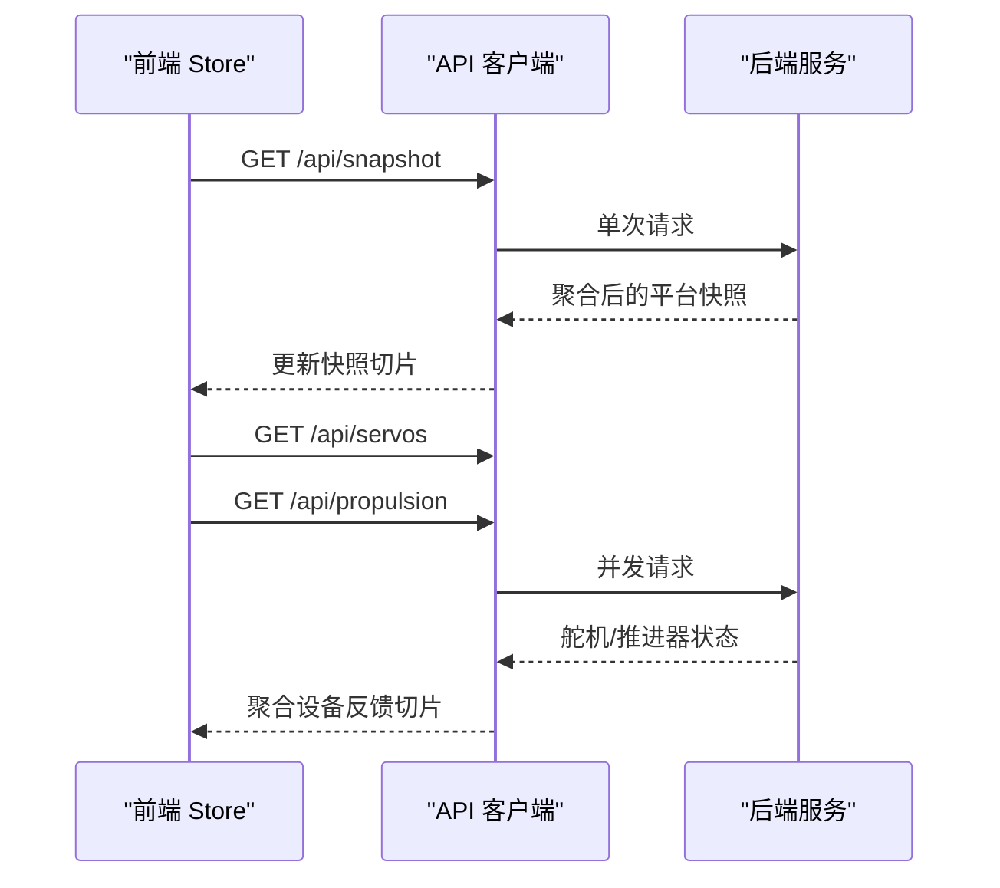
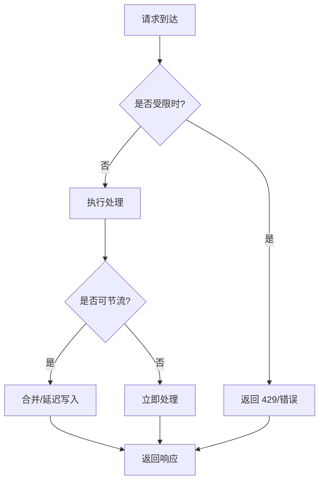
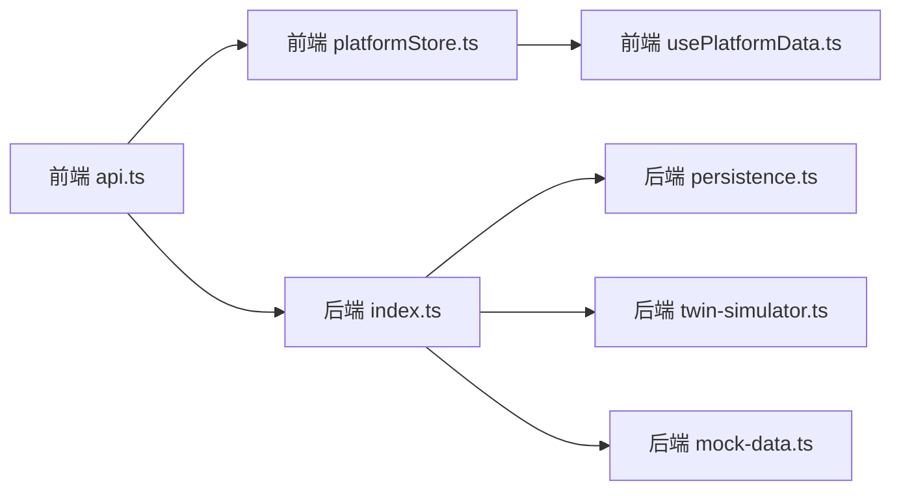

# 带宽优化策略

<cite>
**本文引用的文件**
- [index.ts](file://fishery-digital-twin-platform/apps/backend/src/index.ts)
- [persistence.ts](file://fishery-digital-twin-platform/apps/backend/src/persistence.ts)
- [twin-simulator.ts](file://fishery-digital-twin-platform/apps/backend/src/twin-simulator.ts)
- [mock-data.ts](file://fishery-digital-twin-platform/apps/backend/src/mock-data.ts)
- [api.ts](file://fishery-digital-twin-platform/apps/frontend/src/lib/api.ts)
- [platformStore.ts](file://fishery-digital-twin-platform/apps/frontend/src/lib/platformStore.ts)
- [usePlatformData.ts](file://fishery-digital-twin-platform/apps/frontend/src/hooks/usePlatformData.ts)
- [security-and-network.md](file://fishery-digital-twin-platform/docs/security-and-network.md)
</cite>

## 目录
1. [简介](#简介)
2. [项目结构](#项目结构)
3. [核心组件](#核心组件)
4. [架构总览](#架构总览)
5. [详细组件分析](#详细组件分析)
6. [依赖关系分析](#依赖关系分析)
7. [性能与带宽优化建议](#性能与带宽优化建议)
8. [故障排查指南](#故障排查指南)
9. [结论](#结论)
10. [附录：不同网络环境配置建议](#附录不同网络环境配置建议)

## 简介
本文件面向数字孪生系统的带宽优化，聚焦于降低前端与后端之间的网络流量、提升响应时效性与稳定性。文档围绕以下主题展开：数据去重机制（重复检测、哈希计算思路与存储优化）、请求合并技术（批量构建、异步处理、响应聚合）、响应缓存策略（浏览器/服务端/CDN）、流量控制（限流、优先级调度、拥塞避免），以及带宽监控与分析工具的使用方法与调优建议。内容基于仓库中后端 API、前端轮询与状态管理、持久化与模拟数据的实现进行归纳与扩展。

## 项目结构
系统由前端 Next.js 应用与 Node.js 后端 Express 服务组成，前后端通过 HTTP JSON 接口通信；后端还通过 UDP 广播进行设备发现。关键路径包括：
- 前端统一 API 客户端与全局平台数据 Store，负责定时拉取快照与设备反馈，并聚合结果。
- 后端提供健康检查、平台快照、水质历史、AI 报告、舵机/推进器控制等接口，同时维护内存中的历史数据与本地持久化。
- 安全与网络文档定义了令牌、CORS、端口与防火墙规则。

图表来源
- [index.ts:56-110](file://fishery-digital-twin-platform/apps/backend/src/index.ts#L56-L110)
- [platformStore.ts:20-139](file://fishery-digital-twin-platform/apps/frontend/src/lib/platformStore.ts#L20-L139)
- [persistence.ts:12-68](file://fishery-digital-twin-platform/apps/backend/src/persistence.ts#L12-L68)
- [twin-simulator.ts:74-253](file://fishery-digital-twin-platform/apps/backend/src/twin-simulator.ts#L74-L253)
- [mock-data.ts:114-258](file://fishery-digital-twin-platform/apps/backend/src/mock-data.ts#L114-L258)

章节来源
- [index.ts:56-110](file://fishery-digital-twin-platform/apps/backend/src/index.ts#L56-L110)
- [platformStore.ts:20-139](file://fishery-digital-twin-platform/apps/frontend/src/lib/platformStore.ts#L20-L139)
- [security-and-network.md:17-44](file://fishery-digital-twin-platform/docs/security-and-network.md#L17-L44)

## 核心组件
- 前端 API 客户端：封装 fetch，统一设置超时、令牌与无缓存策略，暴露各业务方法。
- 前端 Store：集中管理平台快照与设备反馈的轮询、并发与连接状态，按固定间隔刷新。
- 后端 API：提供快照、水质、电池、导航、AI 报告、设备控制等接口；内置鉴权、限流与日志记录。
- 持久化模块：对平台状态进行节流写入磁盘，避免频繁 I/O。
- 数字孪生推演：根据输入参数与当前快照计算能耗、风险与健康度，返回结构化结果。
- 演示数据：在真实传感器未接入时生成合理的水质序列与导航轨迹。

章节来源
- [api.ts:6-24](file://fishery-digital-twin-platform/apps/frontend/src/lib/api.ts#L6-L24)
- [platformStore.ts:20-139](file://fishery-digital-twin-platform/apps/frontend/src/lib/platformStore.ts#L20-L139)
- [index.ts:322-557](file://fishery-digital-twin-platform/apps/backend/src/index.ts#L322-L557)
- [persistence.ts:12-68](file://fishery-digital-twin-platform/apps/backend/src/persistence.ts#L12-L68)
- [twin-simulator.ts:74-253](file://fishery-digital-twin-platform/apps/backend/src/twin-simulator.ts#L74-L253)
- [mock-data.ts:114-258](file://fishery-digital-twin-platform/apps/backend/src/mock-data.ts#L114-L258)

## 架构总览
下图展示了典型的数据流与控制流：前端以固定频率拉取平台快照和设备反馈，后端从内存状态与持久化文件中读取或更新数据，必要时触发 AI 报告或数字孪生推演。

图表来源
- [platformStore.ts:98-139](file://fishery-digital-twin-platform/apps/frontend/src/lib/platformStore.ts#L98-L139)
- [api.ts:26-99](file://fishery-digital-twin-platform/apps/frontend/src/lib/api.ts#L26-L99)
- [index.ts:322-557](file://fishery-digital-twin-platform/apps/backend/src/index.ts#L322-L557)
- [persistence.ts:17-68](file://fishery-digital-twin-platform/apps/backend/src/persistence.ts#L17-L68)

## 详细组件分析

### 数据去重机制
- 重复数据检测
  - 后端在接收传感器数据时，会基于最近一次样本值进行“最小变化”判断（例如温度、浊度、pH 等字段采用步进逼近目标值），从而避免微小波动导致的冗余上报。该逻辑体现在演示数据生成与实时数据合并过程中。
  - 对于历史队列，后端维护固定长度窗口（如水质历史最大条目数），新数据进入时会裁剪旧数据，天然形成“时间维度去重”。
- 哈希计算
  - 仓库未直接实现基于内容哈希的去重。可借鉴的做法是：对关键指标（温度、浊度、pH、溶解氧、氨氮、电导率）做归一化后拼接为字符串，再计算轻量级哈希（如 xxhash 或 CRC32），用于快速比对是否发生实质性变化。
- 存储优化
  - 后端将平台状态（水质历史、电池、AI 报告、系统日志）序列化到 JSON 文件，并通过定时器节流写入，减少磁盘 I/O 次数，间接降低因频繁落盘引发的系统抖动与网络拥塞风险。
  - 前端 Store 使用切片对象与不可变更新，避免不必要的重渲染，减少 UI 层与网络层的联动开销。

图表来源
- [index.ts:367-430](file://fishery-digital-twin-platform/apps/backend/src/index.ts#L367-L430)
- [persistence.ts:17-68](file://fishery-digital-twin-platform/apps/backend/src/persistence.ts#L17-L68)
- [mock-data.ts:122-140](file://fishery-digital-twin-platform/apps/backend/src/mock-data.ts#L122-L140)

章节来源
- [index.ts:367-430](file://fishery-digital-twin-platform/apps/backend/src/index.ts#L367-L430)
- [persistence.ts:17-68](file://fishery-digital-twin-platform/apps/backend/src/persistence.ts#L17-L68)
- [mock-data.ts:122-140](file://fishery-digital-twin-platform/apps/backend/src/mock-data.ts#L122-L140)

### 请求合并技术
- 批量请求构建
  - 前端 Store 在刷新设备反馈时，使用 Promise.allSettled 并发获取舵机与推进器状态，减少往返次数并提高吞吐。
  - 后端在构造平台快照时，将水质、电池、导航、AI 报告与船体状态聚合为一个响应，避免前端多次请求。
- 异步处理
  - 所有网络请求均支持 AbortSignal 超时控制，防止慢请求占用资源。
  - 后端对 AI 报告生成实施每分钟一次的限流，避免高负载下的拥塞。
- 响应聚合
  - 前端 Store 将快照与设备反馈分别维护为独立切片，仅在各自数据变化时触发更新，降低渲染压力。
  - 后端在写入持久化时使用节流合并，避免高频写盘。

图表来源
- [platformStore.ts:98-139](file://fishery-digital-twin-platform/apps/frontend/src/lib/platformStore.ts#L98-L139)
- [api.ts:26-99](file://fishery-digital-twin-platform/apps/frontend/src/lib/api.ts#L26-L99)
- [index.ts:322-346](file://fishery-digital-twin-platform/apps/backend/src/index.ts#L322-L346)

章节来源
- [platformStore.ts:98-139](file://fishery-digital-twin-platform/apps/frontend/src/lib/platformStore.ts#L98-L139)
- [index.ts:456-473](file://fishery-digital-twin-platform/apps/backend/src/index.ts#L456-L473)

### 响应缓存策略
- 浏览器缓存
  - 当前 API 客户端显式设置 no-store，确保每次请求都从服务器获取最新数据，适合实时性要求高的场景。若需引入缓存，可对静态资源与低频变化的只读接口启用强缓存（ETag/Last-Modified）。
- 服务端缓存
  - 后端在内存中维护 waterHistory、batteries、latestAiReport、systemLogs，并以固定窗口限制大小，避免无限增长。
  - 持久化模块对写入进行节流，降低 I/O 压力。
- CDN 加速
  - 本项目主要运行在局域网/本地环境，CDN 通常不适用。若部署至公网，可将静态资源（JS/CSS/模型文件）托管至 CDN，并对长生命周期资源开启缓存。

章节来源
- [api.ts:6-24](file://fishery-digital-twin-platform/apps/frontend/src/lib/api.ts#L6-L24)
- [index.ts:78-99](file://fishery-digital-twin-platform/apps/backend/src/index.ts#L78-L99)
- [persistence.ts:17-68](file://fishery-digital-twin-platform/apps/backend/src/persistence.ts#L17-L68)

### 流量控制机制
- 限流算法
  - 后端对 AI 报告生成实施时间窗口限流（每分钟一次），返回 429 状态码提示。
  - 后端对 JSON 请求体大小设置上限（1MB），防止恶意大包。
- 优先级调度
  - 前端 Store 将“平台快照”与“设备反馈”分为两个独立轮询任务，前者关注整体状态，后者关注执行机构，互不阻塞。
  - 后端在构造快照时优先保证基础数据（水质、电池、导航）的可用性，AI 报告按需生成。
- 拥塞避免
  - 前端使用固定间隔轮询（快照 2s，反馈 1s），避免突发流量。
  - 后端通过节流持久化与固定窗口历史，避免内存与磁盘拥塞。

图表来源
- [index.ts:110-110](file://fishery-digital-twin-platform/apps/backend/src/index.ts#L110-L110)
- [index.ts:456-473](file://fishery-digital-twin-platform/apps/backend/src/index.ts#L456-L473)
- [platformStore.ts:20-21](file://fishery-digital-twin-platform/apps/frontend/src/lib/platformStore.ts#L20-L21)
- [persistence.ts:51-68](file://fishery-digital-twin-platform/apps/backend/src/persistence.ts#L51-L68)

章节来源
- [index.ts:110-110](file://fishery-digital-twin-platform/apps/backend/src/index.ts#L110-L110)
- [index.ts:456-473](file://fishery-digital-twin-platform/apps/backend/src/index.ts#L456-L473)
- [platformStore.ts:20-21](file://fishery-digital-twin-platform/apps/frontend/src/lib/platformStore.ts#L20-L21)
- [persistence.ts:51-68](file://fishery-digital-twin-platform/apps/backend/src/persistence.ts#L51-L68)

### 带宽监控与分析工具使用方法
- 浏览器开发者工具
  - Network 面板：查看请求大小、耗时、状态码；筛选 JSON 类型请求，观察 /api/snapshot、/api/servos、/api/propulsion 的体积与频率。
  - Performance 面板：录制页面交互，定位渲染瓶颈与多余重绘。
- 后端日志
  - 系统日志接口 /api/logs 返回最近系统事件，可用于追踪数据接收、AI 报告生成与仿真结果。
- 网络抓包
  - 使用 Wireshark 或 tcpdump 捕获 HTTP/UDP 流量，分析请求/响应结构与异常重传。
- 指标采集建议
  - 统计每秒请求数、平均响应时间、错误率、带宽占用；结合前端轮询间隔调整，平衡实时性与带宽消耗。

章节来源
- [index.ts:557-557](file://fishery-digital-twin-platform/apps/backend/src/index.ts#L557-L557)

## 依赖关系分析
- 前端依赖
  - api.ts 依赖环境变量配置 API 基址与令牌；usePlatformData.ts 依赖 platformStore.ts 提供的订阅与切片能力。
- 后端依赖
  - index.ts 依赖 ai-service、gps-store、propulsion-store、servo-store、twin-simulator、mock-data 与 persistence。
  - twin-simulator 依赖共享类型定义，输出包含路线、故障、疲劳等多维结果。
- 外部集成
  - 安全与网络文档定义了令牌、CORS、端口与防火墙规则，影响前后端通信可达性与安全性。

图表来源
- [api.ts:6-24](file://fishery-digital-twin-platform/apps/frontend/src/lib/api.ts#L6-L24)
- [platformStore.ts:20-139](file://fishery-digital-twin-platform/apps/frontend/src/lib/platformStore.ts#L20-L139)
- [usePlatformData.ts:6-23](file://fishery-digital-twin-platform/apps/frontend/src/hooks/usePlatformData.ts#L6-L23)
- [index.ts:21-44](file://fishery-digital-twin-platform/apps/backend/src/index.ts#L21-L44)
- [persistence.ts:12-68](file://fishery-digital-twin-platform/apps/backend/src/persistence.ts#L12-L68)
- [twin-simulator.ts:74-253](file://fishery-digital-twin-platform/apps/backend/src/twin-simulator.ts#L74-L253)
- [mock-data.ts:114-258](file://fishery-digital-twin-platform/apps/backend/src/mock-data.ts#L114-L258)

章节来源
- [api.ts:6-24](file://fishery-digital-twin-platform/apps/frontend/src/lib/api.ts#L6-L24)
- [platformStore.ts:20-139](file://fishery-digital-twin-platform/apps/frontend/src/lib/platformStore.ts#L20-L139)
- [usePlatformData.ts:6-23](file://fishery-digital-twin-platform/apps/frontend/src/hooks/usePlatformData.ts#L6-L23)
- [index.ts:21-44](file://fishery-digital-twin-platform/apps/backend/src/index.ts#L21-L44)
- [persistence.ts:12-68](file://fishery-digital-twin-platform/apps/backend/src/persistence.ts#L12-L68)
- [twin-simulator.ts:74-253](file://fishery-digital-twin-platform/apps/backend/src/twin-simulator.ts#L74-L253)
- [mock-data.ts:114-258](file://fishery-digital-twin-platform/apps/backend/src/mock-data.ts#L114-L258)

## 性能与带宽优化建议
- 降低轮询频率
  - 在无操作或低活跃场景下，适当增大快照与反馈的轮询间隔，减少无效请求。
- 增量更新
  - 在后端增加字段级差异对比，仅返回变更字段；前端按需合并，减少 payload 大小。
- 压缩传输
  - 启用 gzip/br 压缩；对大体积响应（如 AI 报告、仿真系列）考虑分片或分页。
- 缓存策略
  - 对只读且变化缓慢的数据（如导航路线、设备型号信息）启用强缓存；对实时数据保持 no-store。
- 请求合并
  - 将多个小请求合并为批量接口；前端使用并发与重试策略，避免雪崩。
- 拥塞避免
  - 后端对热点接口实施令牌桶或滑动窗口限流；前端实现指数退避重试。
- 资源优化
  - 静态资源与模型文件使用 CDN；前端按需加载模块，减少首屏体积。

[本节为通用指导，不直接分析具体文件]

## 故障排查指南
- 常见问题
  - 401/403：令牌缺失或不匹配；检查 X-UISYS-Token 与后端 CORS 配置。
  - 429：AI 报告生成过于频繁；等待限流窗口或使用缓存。
  - 500/503：后端内部错误或外部依赖失败；查看系统日志与错误堆栈。
- 诊断步骤
  - 使用浏览器 Network 面板确认请求是否成功、响应体大小与耗时。
  - 调用 /api/health 检查后端服务状态与数据模式。
  - 调用 /api/logs 查看系统事件，定位问题来源。
- 恢复措施
  - 调整轮询间隔与重试策略；清理浏览器缓存；重启后端服务。

章节来源
- [index.ts:143-157](file://fishery-digital-twin-platform/apps/backend/src/index.ts#L143-L157)
- [index.ts:456-473](file://fishery-digital-twin-platform/apps/backend/src/index.ts#L456-L473)
- [index.ts:557-557](file://fishery-digital-twin-platform/apps/backend/src/index.ts#L557-L557)

## 结论
本系统在前端与后端已具备基础的带宽优化能力：前端通过固定间隔轮询与并发请求减少冗余；后端通过内存状态、节流持久化与限流保护服务稳定性。为进一步降低带宽占用，建议引入增量更新、压缩传输、更细粒度的缓存策略与更智能的请求合并。结合监控与日志，持续评估网络质量与用户体验，动态调优参数。

[本节为总结，不直接分析具体文件]

## 附录：不同网络环境配置建议
- 本地开发
  - 使用 localhost 与默认端口；关闭严格 CORS；轮询间隔可较短以提升调试效率。
- 局域网
  - 确保设备与后端在同一子网，开放 UDP 42110 与 TCP 5000；配置令牌与 CORS；禁用客户端隔离。
- 弱网/移动网络
  - 增大轮询间隔；启用重试与退避；对大响应启用压缩与分页；必要时降级功能（如关闭实时仿真）。
- 公网/云端
  - 使用 HTTPS 与反向代理；静态资源走 CDN；对敏感接口加强鉴权与限流；监控带宽与错误率。

章节来源
- [security-and-network.md:17-44](file://fishery-digital-twin-platform/docs/security-and-network.md#L17-L44)