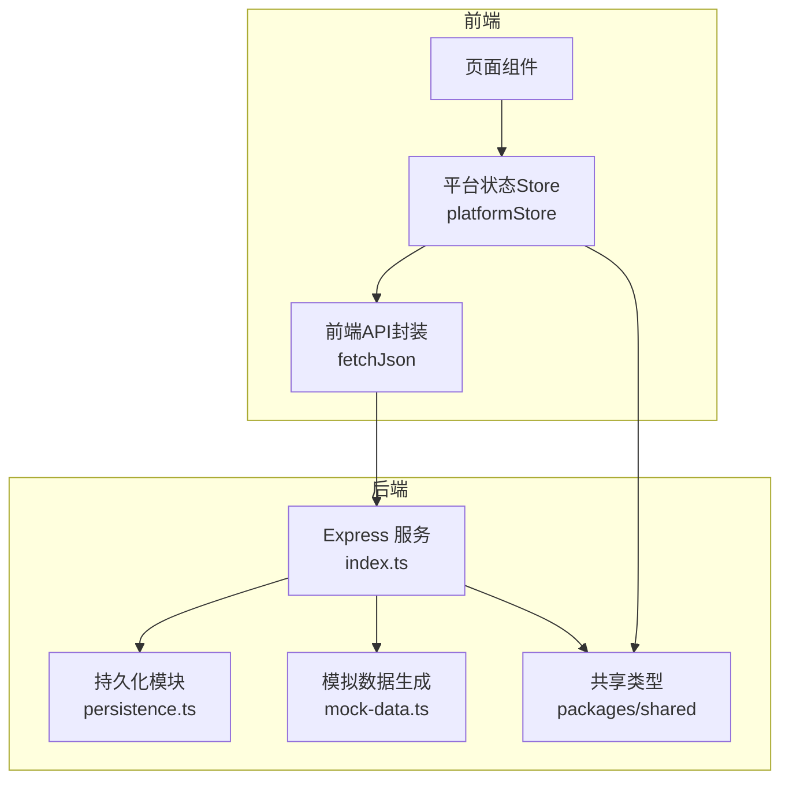
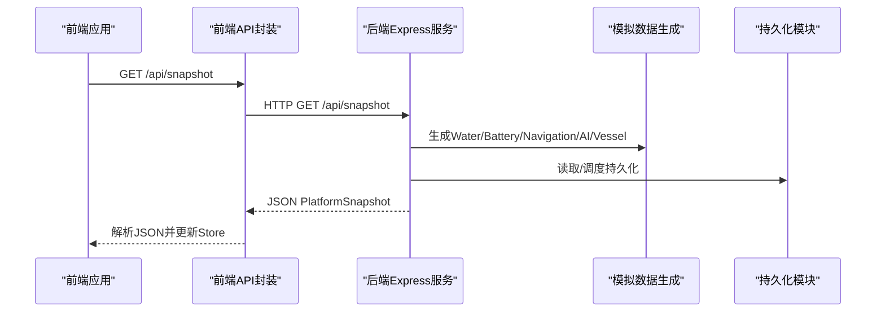
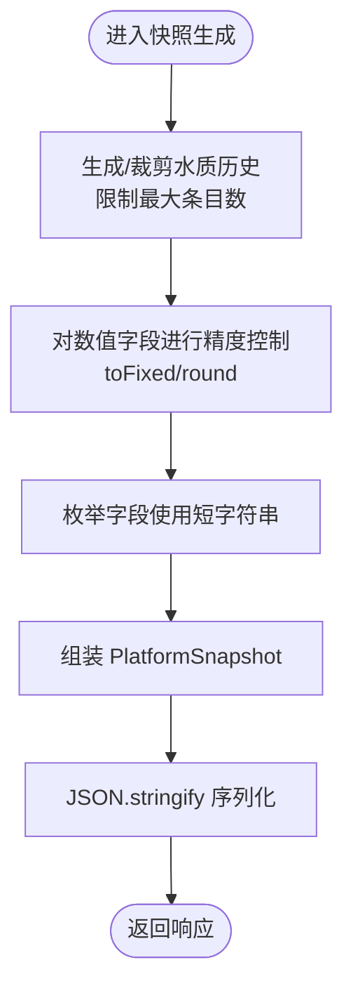
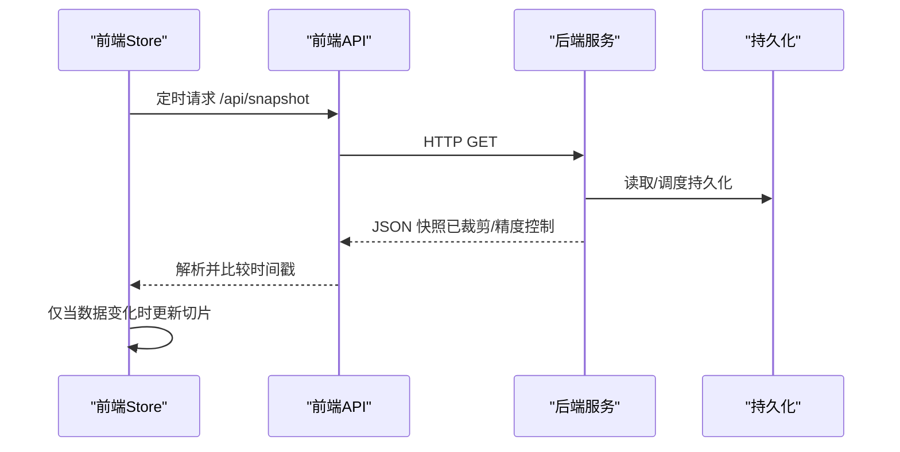
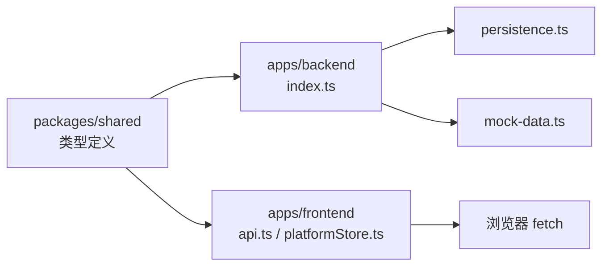

# 数据压缩技术

<cite>
**本文引用的文件**
- [apps/backend/src/index.ts](file://fishery-digital-twin-platform/apps/backend/src/index.ts)
- [apps/backend/src/persistence.ts](file://fishery-digital-twin-platform/apps/backend/src/persistence.ts)
- [apps/backend/src/mock-data.ts](file://fishery-digital-twin-platform/apps/backend/src/mock-data.ts)
- [packages/shared/src/index.ts](file://fishery-digital-twin-platform/packages/shared/src/index.ts)
- [apps/frontend/src/lib/api.ts](file://fishery-digital-twin-platform/apps/frontend/src/lib/api.ts)
- [apps/frontend/src/lib/platformStore.ts](file://fishery-digital-twin-platform/apps/frontend/src/lib/platformStore.ts)
</cite>

## 目录
1. [简介](#简介)
2. [项目结构](#项目结构)
3. [核心组件](#核心组件)
4. [架构总览](#架构总览)
5. [详细组件分析](#详细组件分析)
6. [依赖关系分析](#依赖关系分析)
7. [性能考量](#性能考量)
8. [故障排查指南](#故障排查指南)
9. [结论](#结论)
10. [附录](#附录)

## 简介
本文件面向数字孪生平台的数据传输优化，聚焦于“数据压缩技术”的落地方案与工程实践。当前仓库以 JSON 作为主要序列化格式，通过字段精简、数值精度控制、数据类型优化等手段降低网络负载；同时给出二进制传输（Protocol Buffers、MessagePack）的引入建议与增量更新机制（差异计算、状态同步、去重策略）的设计思路，并配套配置项、性能基准测试方法与评估指标，帮助在真实业务中实现高效的数据压缩与解压。

## 项目结构
本项目采用前后端分离架构：
- 后端提供 REST API，负责聚合传感器、导航、AI 报告、设备状态等数据，并以 JSON 形式返回给前端。
- 前端通过轮询获取平台快照和设备反馈，使用共享 Store 管理状态，驱动 UI 渲染。
- 共享类型定义位于 packages/shared，确保前后端数据结构一致。

图表来源
- [apps/backend/src/index.ts:56-110](file://fishery-digital-twin-platform/apps/backend/src/index.ts#L56-L110)
- [apps/backend/src/persistence.ts:12-29](file://fishery-digital-twin-platform/apps/backend/src/persistence.ts#L12-L29)
- [apps/backend/src/mock-data.ts:114-140](file://fishery-digital-twin-platform/apps/backend/src/mock-data.ts#L114-L140)
- [packages/shared/src/index.ts:7-106](file://fishery-digital-twin-platform/packages/shared/src/index.ts#L7-L106)
- [apps/frontend/src/lib/api.ts:6-24](file://fishery-digital-twin-platform/apps/frontend/src/lib/api.ts#L6-L24)
- [apps/frontend/src/lib/platformStore.ts:20-25](file://fishery-digital-twin-platform/apps/frontend/src/lib/platformStore.ts#L20-L25)

章节来源
- [apps/backend/src/index.ts:56-110](file://fishery-digital-twin-platform/apps/backend/src/index.ts#L56-L110)
- [apps/frontend/src/lib/api.ts:6-24](file://fishery-digital-twin-platform/apps/frontend/src/lib/api.ts#L6-L24)
- [apps/frontend/src/lib/platformStore.ts:20-25](file://fishery-digital-twin-platform/apps/frontend/src/lib/platformStore.ts#L20-L25)

## 核心组件
- 后端 Express 服务：统一暴露 /api/snapshot、/api/water、/api/batteries、/api/navigation、/api/gps、/api/vessel 等接口，内部组装 PlatformSnapshot。
- 持久化模块：将历史水质、电池、AI 报告、系统日志落盘为 JSON，支持定时合并写入与优雅关闭。
- 模拟数据生成：构造符合实际水域特征的 WaterData 序列，用于演示与回退场景。
- 前端 API 封装：统一的 fetchJson 函数，设置超时、CORS Token 头，解析 JSON。
- 前端 Store：定时拉取快照与设备反馈，维护切片对象以减少不必要的重渲染。

章节来源
- [apps/backend/src/index.ts:247-262](file://fishery-digital-twin-platform/apps/backend/src/index.ts#L247-L262)
- [apps/backend/src/persistence.ts:17-29](file://fishery-digital-twin-platform/apps/backend/src/persistence.ts#L17-L29)
- [apps/backend/src/mock-data.ts:114-140](file://fishery-digital-twin-platform/apps/backend/src/mock-data.ts#L114-L140)
- [apps/frontend/src/lib/api.ts:6-24](file://fishery-digital-twin-platform/apps/frontend/src/lib/api.ts#L6-L24)
- [apps/frontend/src/lib/platformStore.ts:98-139](file://fishery-digital-twin-platform/apps/frontend/src/lib/platformStore.ts#L98-L139)

## 架构总览
下图展示了从前端到后端的请求流程以及数据组装路径，重点标注了 JSON 序列化与响应体构成。

图表来源
- [apps/frontend/src/lib/api.ts:26-28](file://fishery-digital-twin-platform/apps/frontend/src/lib/api.ts#L26-L28)
- [apps/backend/src/index.ts:336-346](file://fishery-digital-twin-platform/apps/backend/src/index.ts#L336-L346)
- [apps/backend/src/mock-data.ts:192-257](file://fishery-digital-twin-platform/apps/backend/src/mock-data.ts#L192-L257)
- [apps/backend/src/persistence.ts:32-49](file://fishery-digital-twin-platform/apps/backend/src/persistence.ts#L32-L49)

## 详细组件分析

### JSON 数据压缩策略（字段精简、数值精度控制、数据类型优化）
- 字段精简
  - 后端在组装 PlatformSnapshot 时仅包含必要字段（water、batteries、navigation、aiReport、vessel），避免冗余信息。
  - 前端 Store 使用切片对象（snapshot 与 deviceFeedback 分片），减少跨组件传递的数据体积。
- 数值精度控制
  - 水质字段在生成与接收时进行固定小数位处理（如水温保留一位小数、pH 两位小数、电导率取整），在保证可读性的同时减少字符串长度。
  - 导航距离、速度等数值也进行合理舍入，避免过长浮点表示。
- 数据类型优化
  - 枚举类型（如 WaterStatus、DeviceStatus、PlatformDataMode）使用短字符串标识，便于压缩与解析。
  - 时间戳统一使用 ISO 字符串，便于跨端解析与排序。
  - 列表型数据（如 waterHistory）限制最大长度，避免无限增长导致响应过大。

图表来源
- [apps/backend/src/index.ts:247-262](file://fishery-digital-twin-platform/apps/backend/src/index.ts#L247-L262)
- [apps/backend/src/mock-data.ts:78-94](file://fishery-digital-twin-platform/apps/backend/src/mock-data.ts#L78-L94)
- [packages/shared/src/index.ts:7-106](file://fishery-digital-twin-platform/packages/shared/src/index.ts#L7-L106)

章节来源
- [apps/backend/src/index.ts:247-262](file://fishery-digital-twin-platform/apps/backend/src/index.ts#L247-L262)
- [apps/backend/src/mock-data.ts:78-94](file://fishery-digital-twin-platform/apps/backend/src/mock-data.ts#L78-L94)
- [packages/shared/src/index.ts:7-106](file://fishery-digital-twin-platform/packages/shared/src/index.ts#L7-L106)

### 二进制数据传输格式（Protocol Buffers、MessagePack）
当前仓库未直接集成 Protocol Buffers 或 MessagePack，但可基于现有接口平滑引入：
- 适用场景
  - 高频小数据包（如舵机/推进器命令、设备心跳）适合用 MessagePack 提升吞吐。
  - 强类型契约与跨语言互操作（如固件与后端）适合用 Protocol Buffers。
- 接入建议
  - 新增专用二进制端点（例如 /api/snapshot/bin），保持 JSON 兼容的同时提供二进制版本。
  - 前端根据环境或协商选择 JSON 或二进制解码路径，保证向后兼容。
  - 后端在响应头中声明内容类型（application/x-protobuf 或 application/msgpack）。

[本节为概念性说明，不直接分析具体代码文件]

### 增量更新机制（差异计算、状态同步、数据去重）
- 差异计算
  - 后端可对 waterHistory 做滑动窗口裁剪，仅返回最近 N 条记录，减少重复传输。
  - 前端 Store 对比新旧快照的时间戳与连接状态，仅在必要时触发重渲染。
- 状态同步
  - 前端使用 useSyncExternalStore 订阅 store 变化，保证多组件共享同一份快照，避免重复请求。
  - 设备反馈（servos、propulsion）独立刷新，降低主快照的抖动影响。
- 数据去重
  - 后端在接收传感器数据时，若未收到真实数据则使用演示数据填充，避免空值导致的重复重建。
  - 持久化层采用临时文件+原子替换的方式，防止部分写入造成不一致。

图表来源
- [apps/frontend/src/lib/platformStore.ts:98-139](file://fishery-digital-twin-platform/apps/frontend/src/lib/platformStore.ts#L98-L139)
- [apps/backend/src/index.ts:336-346](file://fishery-digital-twin-platform/apps/backend/src/index.ts#L336-L346)
- [apps/backend/src/persistence.ts:51-67](file://fishery-digital-twin-platform/apps/backend/src/persistence.ts#L51-L67)

章节来源
- [apps/frontend/src/lib/platformStore.ts:98-139](file://fishery-digital-twin-platform/apps/frontend/src/lib/platformStore.ts#L98-L139)
- [apps/backend/src/index.ts:336-346](file://fishery-digital-twin-platform/apps/backend/src/index.ts#L336-L346)
- [apps/backend/src/persistence.ts:51-67](file://fishery-digital-twin-platform/apps/backend/src/persistence.ts#L51-L67)

### 压缩配置选项（压缩级别、内存使用、CPU开销）
- 压缩级别设置
  - JSON 层面可通过字段精简与精度控制间接实现“轻量级压缩”。
  - 引入二进制格式时，可根据带宽与延迟需求选择不同编码级别（如 Protobuf 的 packed 编码、MessagePack 的二进制紧凑模式）。
- 内存使用优化
  - 后端持久化使用临时文件与原子替换，避免大对象长时间驻留内存。
  - 前端 Store 使用切片对象，减少不必要的全量复制。
- CPU 开销控制
  - 前端轮询间隔可调（快照 2s、设备反馈 1s），在高负载时可适当放宽。
  - 后端对 AI 报告生成进行频率限制，避免频繁计算造成 CPU 峰值。

章节来源
- [apps/backend/src/index.ts:456-473](file://fishery-digital-twin-platform/apps/backend/src/index.ts#L456-L473)
- [apps/backend/src/persistence.ts:17-29](file://fishery-digital-twin-platform/apps/backend/src/persistence.ts#L17-L29)
- [apps/frontend/src/lib/platformStore.ts:20-25](file://fishery-digital-twin-platform/apps/frontend/src/lib/platformStore.ts#L20-L25)

### 实际代码示例（高效压缩与解压的实现位置）
- 后端 JSON 序列化与精度控制
  - 参考路径：[apps/backend/src/mock-data.ts:78-94](file://fishery-digital-twin-platform/apps/backend/src/mock-data.ts#L78-L94)
- 后端快照组装与字段精简
  - 参考路径：[apps/backend/src/index.ts:247-262](file://fishery-digital-twin-platform/apps/backend/src/index.ts#L247-L262)
- 前端 JSON 请求与解析
  - 参考路径：[apps/frontend/src/lib/api.ts:6-24](file://fishery-digital-twin-platform/apps/frontend/src/lib/api.ts#L6-L24)
- 前端 Store 增量更新与切片
  - 参考路径：[apps/frontend/src/lib/platformStore.ts:71-96](file://fishery-digital-twin-platform/apps/frontend/src/lib/platformStore.ts#L71-L96)

[以上为代码片段路径引用，不包含具体代码内容]

## 依赖关系分析
- 后端依赖 Express、dotenv、cors，并通过 persistence 模块读写本地 JSON 文件。
- 前端依赖 Next.js 运行时与浏览器 fetch API，通过 api.ts 统一访问后端。
- 共享类型定义位于 packages/shared，被前后端共同引用，确保契约一致。

图表来源
- [packages/shared/src/index.ts:7-106](file://fishery-digital-twin-platform/packages/shared/src/index.ts#L7-L106)
- [apps/backend/src/index.ts:56-110](file://fishery-digital-twin-platform/apps/backend/src/index.ts#L56-L110)
- [apps/frontend/src/lib/api.ts:6-24](file://fishery-digital-twin-platform/apps/frontend/src/lib/api.ts#L6-L24)

章节来源
- [packages/shared/src/index.ts:7-106](file://fishery-digital-twin-platform/packages/shared/src/index.ts#L7-L106)
- [apps/backend/src/index.ts:56-110](file://fishery-digital-twin-platform/apps/backend/src/index.ts#L56-L110)
- [apps/frontend/src/lib/api.ts:6-24](file://fishery-digital-twin-platform/apps/frontend/src/lib/api.ts#L6-L24)

## 性能考量
- 网络负载
  - 通过字段精简与精度控制显著降低 JSON 体积；未来可引入二进制格式进一步提升吞吐。
- 计算开销
  - 前端轮询间隔与后端 AI 报告频率限制平衡实时性与资源占用。
- 存储与内存
  - 持久化采用异步批写与原子替换，避免阻塞主线程与内存泄漏。
- 可扩展性
  - 共享类型定义使前后端契约稳定，便于后续引入更高效的序列化方案。

[本节提供通用指导，不直接分析具体代码文件]

## 故障排查指南
- CORS 与 Token
  - 后端启用 CORS 并校验 X-UISYS-Token，错误时返回明确错误信息。
- 端口与绑定
  - 启动失败时检查端口占用与权限，错误码 EADDRINUSE/EACCES 会终止进程。
- 持久化异常
  - 写入失败会记录错误日志，不影响服务运行；可检查磁盘空间与权限。
- 前端超时
  - 默认请求超时 5s，若网络不稳定可适当调整或增加重试逻辑。

章节来源
- [apps/backend/src/index.ts:101-109](file://fishery-digital-twin-platform/apps/backend/src/index.ts#L101-L109)
- [apps/backend/src/index.ts:573-579](file://fishery-digital-twin-platform/apps/backend/src/index.ts#L573-L579)
- [apps/backend/src/persistence.ts:22-29](file://fishery-digital-twin-platform/apps/backend/src/persistence.ts#L22-L29)
- [apps/frontend/src/lib/api.ts:6-24](file://fishery-digital-twin-platform/apps/frontend/src/lib/api.ts#L6-L24)

## 结论
当前仓库以 JSON 为核心序列化格式，通过字段精简、数值精度控制、数据类型优化等手段实现了基础的数据压缩效果。结合前端 Store 的增量更新与后端持久化的批写策略，整体传输效率与稳定性良好。未来可在关键路径引入二进制格式（Protocol Buffers、MessagePack），配合差异计算与去重策略，进一步降低带宽与 CPU 开销，提升数字孪生系统的实时性与可扩展性。

[本节总结性内容，不直接分析具体代码文件]

## 附录

### 性能基准测试方法
- 指标定义
  - 压缩比 = 原始字节数 / 压缩后字节数
  - 端到端延迟 = 请求发出到响应解析完成的时间
  - CPU 占用 = 压缩/解压过程的 CPU 使用率
  - 内存峰值 = 压缩/解压过程中的最大内存占用
- 测试步骤
  - 构造典型 Payload（含 waterHistory、batteries、navigation、aiReport、vessel）。
  - 分别执行 JSON 与二进制（Protobuf/MessagePack）序列化/反序列化。
  - 记录上述指标，对比不同压缩级别下的表现。
- 工具建议
  - Node.js：perf_hooks、node:vm、heapdump。
  - 浏览器：performance.now()、PerformanceObserver、Chrome DevTools Memory/CPU 面板。

[本节为方法论说明，不直接分析具体代码文件]

### 压缩效果评估指标
- 网络侧
  - 平均响应体大小、P95/P99 延迟、丢包率（弱网环境下）。
- 计算侧
  - 压缩/解压耗时、CPU 利用率、GC 次数与停顿。
- 业务侧
  - 首帧渲染时间、数据新鲜度（最新快照时间差）、UI 卡顿率。

[本节为方法论说明，不直接分析具体代码文件]