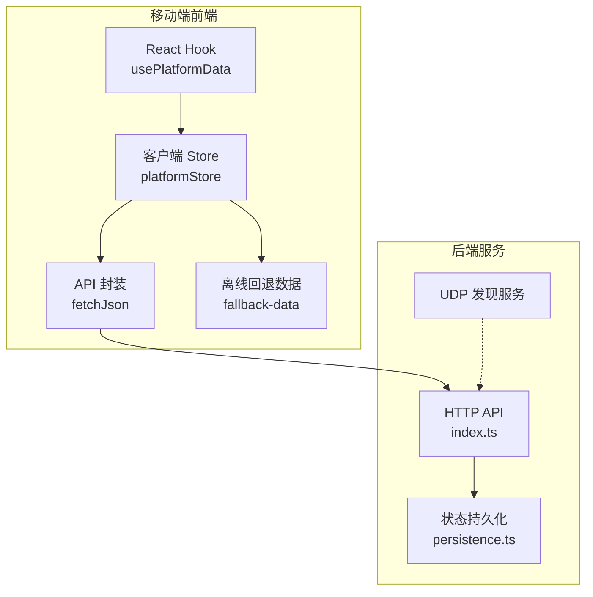
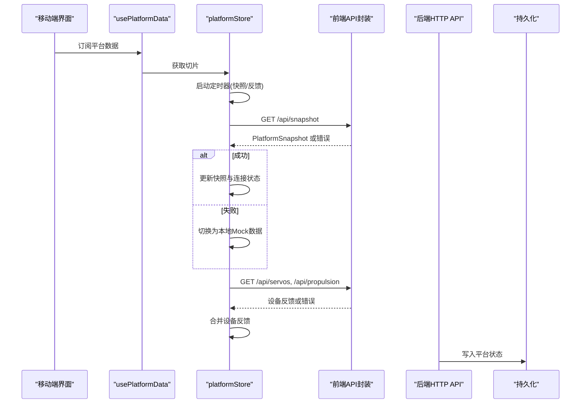
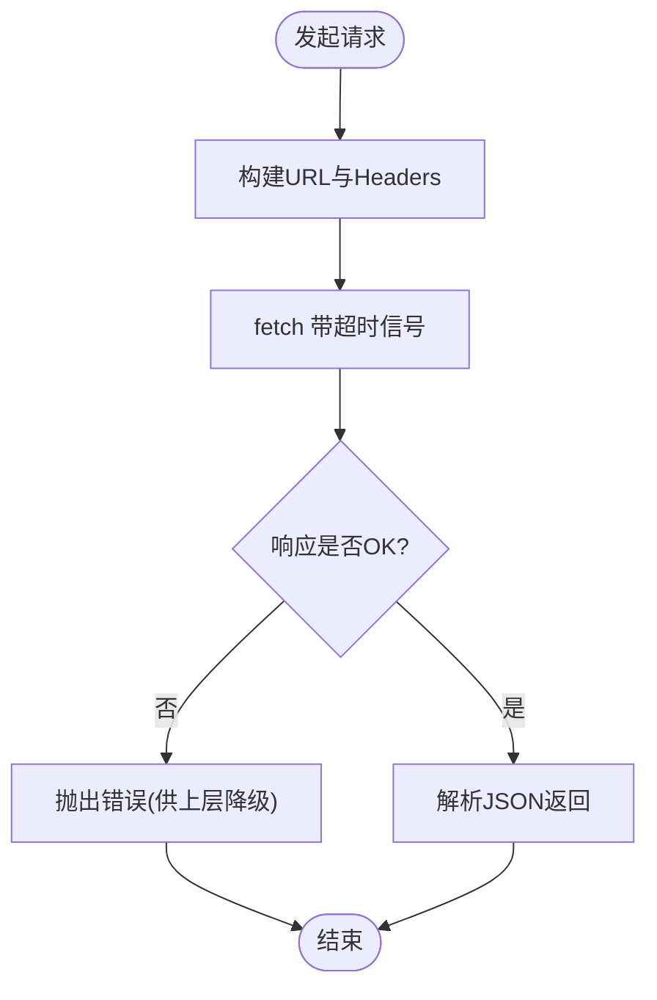
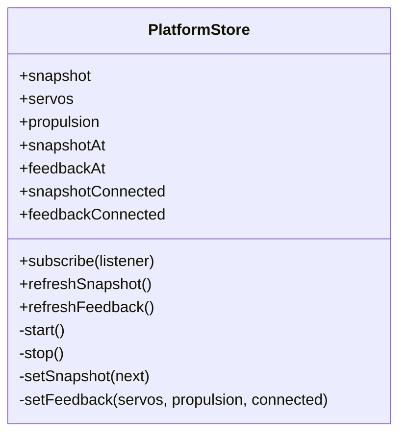
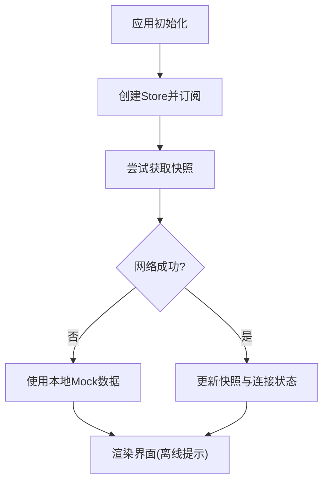
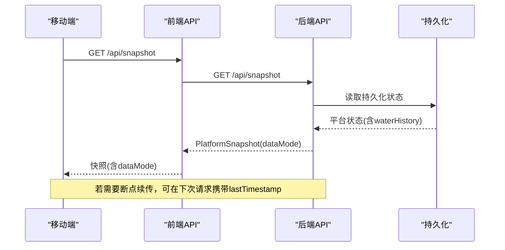
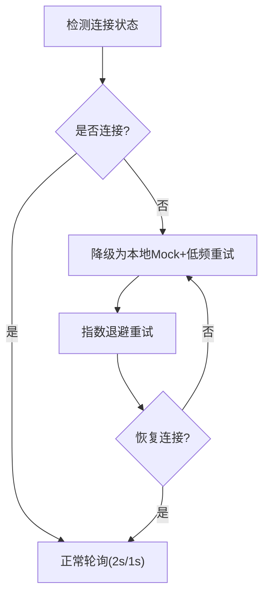
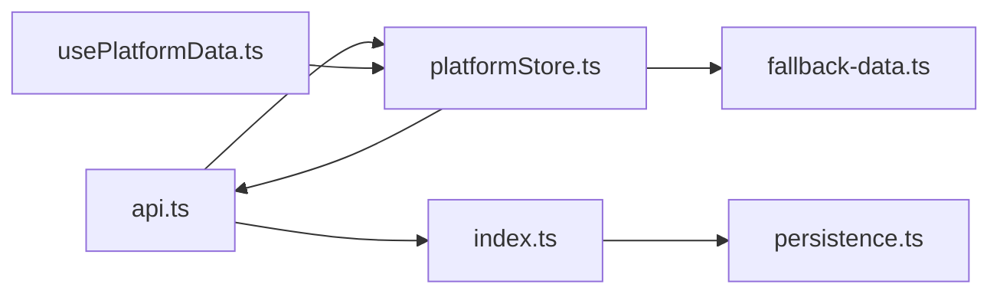

# 移动端网络优化

<cite>
**本文引用的文件**
- [api.ts](file://fishery-digital-twin-platform/apps/frontend/src/lib/api.ts)
- [platformStore.ts](file://fishery-digital-twin-platform/apps/frontend/src/lib/platformStore.ts)
- [usePlatformData.ts](file://fishery-digital-twin-platform/apps/frontend/src/hooks/usePlatformData.ts)
- [fallback-data.ts](file://fishery-digital-twin-platform/apps/frontend/src/lib/fallback-data.ts)
- [index.ts](file://fishery-digital-twin-platform/apps/backend/src/index.ts)
- [persistence.ts](file://fishery-digital-twin-platform/apps/backend/src/persistence.ts)
- [security-and-network.md](file://fishery-digital-twin-platform/docs/security-and-network.md)
</cite>

## 目录
1. [简介](#简介)
2. [项目结构](#项目结构)
3. [核心组件](#核心组件)
4. [架构总览](#架构总览)
5. [详细组件分析](#详细组件分析)
6. [依赖关系分析](#依赖关系分析)
7. [性能考量](#性能考量)
8. [故障排查指南](#故障排查指南)
9. [结论](#结论)
10. [附录](#附录)

## 简介
本文件面向数字孪生系统在移动设备上的网络优化，聚焦以下目标：离线支持机制（本地数据、同步与冲突）、数据同步策略（增量/全量/断点续传）、网络状态检测（连接质量评估、切换处理、自适应调整）、移动端特定优化（电池、内存、后台任务调度）、调试工具与性能分析方法，以及不同移动网络环境的适配方案与用户体验建议。文档基于仓库中前端 API 层、客户端存储与轮询、后端持久化与安全配置等实现进行归纳与扩展说明。

## 项目结构
- 前端（Next.js）提供统一的 HTTP 请求封装、共享的客户端 Store 与 React Hook，负责拉取平台快照与设备反馈，并在无网络时回退到本地 Mock 数据。
- 后端（Express）暴露 REST API，维护水质、电池、导航、AI 报告与系统日志，并具备状态持久化能力；同时提供 UDP 发现服务用于局域网设备发现。
- 安全与网络文档定义了令牌、CORS、端口与防火墙策略，确保移动端在可信局域网内访问后端。

**图示来源**
- [api.ts:6-24](file://fishery-digital-twin-platform/apps/frontend/src/lib/api.ts#L6-L24)
- [platformStore.ts:20-139](file://fishery-digital-twin-platform/apps/frontend/src/lib/platformStore.ts#L20-L139)
- [usePlatformData.ts:10-23](file://fishery-digital-twin-platform/apps/frontend/src/hooks/usePlatformData.ts#L10-L23)
- [fallback-data.ts:152-163](file://fishery-digital-twin-platform/apps/frontend/src/lib/fallback-data.ts#L152-L163)
- [index.ts:101-110](file://fishery-digital-twin-platform/apps/backend/src/index.ts#L101-L110)
- [persistence.ts:12-68](file://fishery-digital-twin-platform/apps/backend/src/persistence.ts#L12-L68)

**章节来源**
- [api.ts:6-24](file://fishery-digital-twin-platform/apps/frontend/src/lib/api.ts#L6-L24)
- [platformStore.ts:20-139](file://fishery-digital-twin-platform/apps/frontend/src/lib/platformStore.ts#L20-L139)
- [usePlatformData.ts:10-23](file://fishery-digital-twin-platform/apps/frontend/src/hooks/usePlatformData.ts#L10-L23)
- [fallback-data.ts:152-163](file://fishery-digital-twin-platform/apps/frontend/src/lib/fallback-data.ts#L152-L163)
- [index.ts:101-110](file://fishery-digital-twin-platform/apps/backend/src/index.ts#L101-L110)
- [persistence.ts:12-68](file://fishery-digital-twin-platform/apps/backend/src/persistence.ts#L12-L68)

## 核心组件
- 前端 API 封装：统一超时、错误处理与鉴权头注入，所有接口调用均通过该函数发起。
- 客户端 Store：集中管理快照与设备反馈的拉取频率、连接状态与失败回退，避免重复请求与竞态。
- 后端 API：提供健康检查、快照、传感器数据、控制命令、AI 报告、日志等接口；内置 CORS、限流与令牌校验。
- 持久化模块：将平台状态（水质历史、电池、AI 报告、系统日志）落盘，支持重启恢复。
- 安全与网络：定义令牌、CORS、端口与防火墙规则，保障移动端在局域网内的安全访问。

**章节来源**
- [api.ts:6-24](file://fishery-digital-twin-platform/apps/frontend/src/lib/api.ts#L6-L24)
- [platformStore.ts:20-139](file://fishery-digital-twin-platform/apps/frontend/src/lib/platformStore.ts#L20-L139)
- [index.ts:101-110](file://fishery-digital-twin-platform/apps/backend/src/index.ts#L101-L110)
- [persistence.ts:12-68](file://fishery-digital-twin-platform/apps/backend/src/persistence.ts#L12-L68)
- [security-and-network.md:17-44](file://fishery-digital-twin-platform/docs/security-and-network.md#L17-L44)

## 架构总览
下图展示了移动端从 UI 到后端的数据流与关键节点：UI 通过 Hook 订阅 Store，Store 定时拉取快照与设备反馈；当网络不可用时，使用本地 Mock 数据维持界面可用；后端对写入类接口进行令牌校验与限流，并将状态持久化。

**图示来源**
- [usePlatformData.ts:10-23](file://fishery-digital-twin-platform/apps/frontend/src/hooks/usePlatformData.ts#L10-L23)
- [platformStore.ts:98-139](file://fishery-digital-twin-platform/apps/frontend/src/lib/platformStore.ts#L98-L139)
- [api.ts:6-24](file://fishery-digital-twin-platform/apps/frontend/src/lib/api.ts#L6-L24)
- [index.ts:322-346](file://fishery-digital-twin-platform/apps/backend/src/index.ts#L322-L346)
- [persistence.ts:17-68](file://fishery-digital-twin-platform/apps/backend/src/persistence.ts#L17-L68)

## 详细组件分析

### 前端 API 封装与超时控制
- 统一 fetchJson 封装：设置 no-store 缓存、默认 5 秒超时、自动附加鉴权头 X-UISYS-Token。
- 错误处理：非 2xx 响应抛出错误，便于上层捕获并降级。
- 移动端意义：短超时与 no-store 降低弱网下的等待时间与缓存不一致问题。

**图示来源**
- [api.ts:6-24](file://fishery-digital-twin-platform/apps/frontend/src/lib/api.ts#L6-L24)

**章节来源**
- [api.ts:6-24](file://fishery-digital-twin-platform/apps/frontend/src/lib/api.ts#L6-L24)

### 客户端 Store：轮询、去重与回退
- 固定周期拉取：快照每 2 秒、设备反馈每 1 秒，避免频繁刷新导致电量浪费。
- 并发保护：同一时刻仅允许一个快照/反馈刷新 Promise，防止抖动。
- 连接状态：记录 snapshotConnected/feedbackConnected，供 UI 显示在线/离线。
- 失败回退：请求失败时将 snapshotConnected 置为 false，UI 可据此切换到本地 Mock。

**图示来源**
- [platformStore.ts:7-196](file://fishery-digital-twin-platform/apps/frontend/src/lib/platformStore.ts#L7-L196)

**章节来源**
- [platformStore.ts:20-139](file://fishery-digital-twin-platform/apps/frontend/src/lib/platformStore.ts#L20-L139)
- [platformStore.ts:150-159](file://fishery-digital-twin-platform/apps/frontend/src/lib/platformStore.ts#L150-L159)

### 离线支持与本地数据
- 本地 Mock：当网络不可用或首次加载时，使用 fallback-data 生成稳定的初始快照与水质序列，保证界面可用。
- 数据来源标记：后端快照包含 dataMode（live/mixed/demo/fallback），前端可据此提示用户当前数据源。
- 用户体验：在无网络时展示“离线模式”标识，并提供手动刷新入口。

**图示来源**
- [fallback-data.ts:152-163](file://fishery-digital-twin-platform/apps/frontend/src/lib/fallback-data.ts#L152-L163)
- [platformStore.ts:98-114](file://fishery-digital-twin-platform/apps/frontend/src/lib/platformStore.ts#L98-L114)
- [index.ts:247-262](file://fishery-digital-twin-platform/apps/backend/src/index.ts#L247-L262)

**章节来源**
- [fallback-data.ts:152-163](file://fishery-digital-twin-platform/apps/frontend/src/lib/fallback-data.ts#L152-L163)
- [platformStore.ts:98-114](file://fishery-digital-twin-platform/apps/frontend/src/lib/platformStore.ts#L98-L114)
- [index.ts:247-262](file://fishery-digital-twin-platform/apps/backend/src/index.ts#L247-L262)

### 数据同步策略
- 增量同步：后端维护 waterHistory 最近 N 条（如 180 条），前端每次拉取最新快照即可获得增量数据；传感器上报接口 /api/data 追加新样本并限制长度。
- 全量备份：后端持久化 platform-state.json，包含水质历史、电池、AI 报告与系统日志，支持重启恢复与导出备份。
- 断点续传：当前实现未显式实现断点续传字段；建议在移动端侧记录上次拉取时间戳或游标，在网络恢复后请求自该时间点之后的增量数据（需后端扩展查询参数）。

**图示来源**
- [index.ts:322-346](file://fishery-digital-twin-platform/apps/backend/src/index.ts#L322-L346)
- [persistence.ts:32-49](file://fishery-digital-twin-platform/apps/backend/src/persistence.ts#L32-L49)

**章节来源**
- [index.ts:322-346](file://fishery-digital-twin-platform/apps/backend/src/index.ts#L322-L346)
- [persistence.ts:32-49](file://fishery-digital-twin-platform/apps/backend/src/persistence.ts#L32-L49)

### 网络状态检测与自适应调整
- 连接质量评估：通过 snapshotConnected/feedbackConnected 判断网络可用性；结合 dataMode 区分 live/mixed/demo/fallback。
- 网络切换处理：Store 在失败时切换为离线状态，UI 可据此提示；后端健康接口 /api/health 可用于快速探测。
- 自适应调整：根据网络质量动态调整轮询频率（例如弱网下延长间隔），减少请求次数与电量消耗。

**图示来源**
- [platformStore.ts:98-139](file://fishery-digital-twin-platform/apps/frontend/src/lib/platformStore.ts#L98-L139)
- [index.ts:322-346](file://fishery-digital-twin-platform/apps/backend/src/index.ts#L322-L346)

**章节来源**
- [platformStore.ts:98-139](file://fishery-digital-twin-platform/apps/frontend/src/lib/platformStore.ts#L98-L139)
- [index.ts:322-346](file://fishery-digital-twin-platform/apps/backend/src/index.ts#L322-L346)

### 移动端特定优化
- 电池优化：合理设置轮询间隔（2s/1s），避免高频请求；在后台或屏幕关闭时降低频率或暂停轮询（可通过 refCount 与页面生命周期控制）。
- 内存管理：Store 使用稳定切片对象，减少不必要的重渲染；限制历史数据长度（后端 waterHistory 最大 180）。
- 后台任务调度：利用浏览器/系统后台策略限制网络活动；必要时使用 Web Workers 或 Service Worker 进行后台同步（需额外实现）。

**章节来源**
- [platformStore.ts:53-63](file://fishery-digital-twin-platform/apps/frontend/src/lib/platformStore.ts#L53-L63)
- [index.ts:79-98](file://fishery-digital-twin-platform/apps/backend/src/index.ts#L79-L98)

### 安全与网络配置
- 令牌与鉴权：控制类接口要求 X-UISYS-Token；本机回环地址可绕过令牌校验。
- CORS：允许指定来源，默认允许 localhost。
- 端口与防火墙：HTTP 5000，UDP 发现 42110，客户端公告 42111-42114；需在可信局域网内运行。

**章节来源**
- [index.ts:136-157](file://fishery-digital-twin-platform/apps/backend/src/index.ts#L136-L157)
- [index.ts:101-110](file://fishery-digital-twin-platform/apps/backend/src/index.ts#L101-L110)
- [security-and-network.md:17-44](file://fishery-digital-twin-platform/docs/security-and-network.md#L17-L44)

## 依赖关系分析
- 前端依赖：
  - api.ts 被 platformStore.ts 调用以获取快照与设备反馈。
  - usePlatformData.ts 订阅 platformStore 提供的切片。
  - fallback-data.ts 作为离线回退数据源。
- 后端依赖：
  - index.ts 聚合多个 store（GPS、舵机、推进器）与 AI、模拟数据，并通过 persistence.ts 持久化。
  - security-and-network.md 指导部署与网络配置。

**图示来源**
- [platformStore.ts:3-5](file://fishery-digital-twin-platform/apps/frontend/src/lib/platformStore.ts#L3-L5)
- [usePlatformData.ts:3-5](file://fishery-digital-twin-platform/apps/frontend/src/hooks/usePlatformData.ts#L3-L5)
- [index.ts:21-44](file://fishery-digital-twin-platform/apps/backend/src/index.ts#L21-L44)
- [persistence.ts:1-10](file://fishery-digital-twin-platform/apps/backend/src/persistence.ts#L1-L10)

**章节来源**
- [platformStore.ts:3-5](file://fishery-digital-twin-platform/apps/frontend/src/lib/platformStore.ts#L3-L5)
- [usePlatformData.ts:3-5](file://fishery-digital-twin-platform/apps/frontend/src/hooks/usePlatformData.ts#L3-L5)
- [index.ts:21-44](file://fishery-digital-twin-platform/apps/backend/src/index.ts#L21-L44)
- [persistence.ts:1-10](file://fishery-digital-twin-platform/apps/backend/src/persistence.ts#L1-L10)

## 性能考量
- 请求频率：快照 2 秒、设备反馈 1 秒，适合实时性要求不高的监控场景；可根据网络状况动态调整。
- 数据体积：waterHistory 限制为 180 条，避免大负载传输；前端应分页或按需加载历史。
- 缓存策略：API 使用 no-store，避免陈旧数据；如需提升性能可引入条件缓存（ETag/Last-Modified）。
- 错误重试：失败时立即切换离线模式，避免阻塞 UI；建议加入指数退避与最大重试次数。

[本节为通用性能讨论，不直接分析具体文件]

## 故障排查指南
- 无法连接后端：
  - 检查 CORS 配置与允许的 origin。
  - 确认令牌配置一致且未被拦截。
  - 使用 /api/health 快速探测服务状态。
- 数据不更新：
  - 检查 Store 的 snapshotConnected/feedbackConnected 状态。
  - 查看网络请求是否被超时或拒绝。
  - 确认后端持久化是否正常写入。
- 离线模式：
  - 确认 fallback-data 已正确生成初始快照。
  - 在网络恢复后触发一次刷新以恢复真实数据。

**章节来源**
- [index.ts:101-110](file://fishery-digital-twin-platform/apps/backend/src/index.ts#L101-L110)
- [index.ts:322-346](file://fishery-digital-twin-platform/apps/backend/src/index.ts#L322-L346)
- [platformStore.ts:98-114](file://fishery-digital-twin-platform/apps/frontend/src/lib/platformStore.ts#L98-L114)
- [fallback-data.ts:152-163](file://fishery-digital-twin-platform/apps/frontend/src/lib/fallback-data.ts#L152-L163)

## 结论
该数字孪生平台在前端提供了健壮的离线支持与稳定的轮询机制，在后端实现了状态持久化与安全控制。针对移动端网络优化，建议结合网络质量动态调整轮询频率、引入断点续传与更精细的缓存策略，以提升弱网环境下的用户体验与能效表现。

[本节为总结性内容，不直接分析具体文件]

## 附录
- 环境变量与配置：参考安全与网络文档中的令牌、CORS、端口与防火墙设置。
- 扩展建议：
  - 增加 lastTimestamp 或游标参数，实现服务端增量查询。
  - 引入 Service Worker 缓存与后台同步，提升离线体验。
  - 增加网络质量指标（延迟、丢包率）以驱动自适应策略。

**章节来源**
- [security-and-network.md:17-44](file://fishery-digital-twin-platform/docs/security-and-network.md#L17-L44)