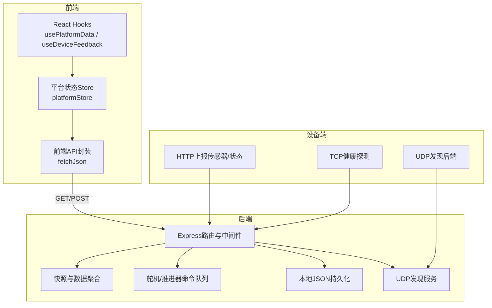
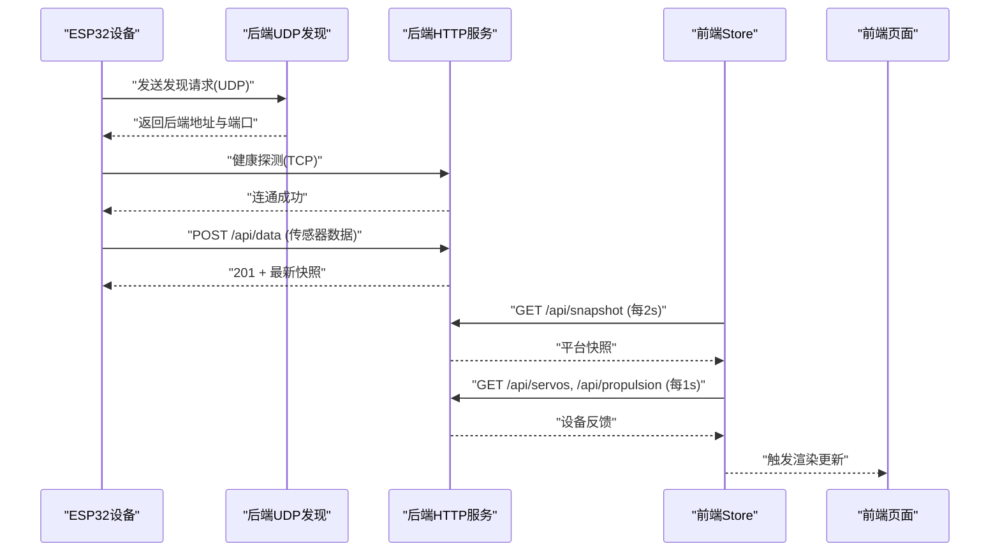
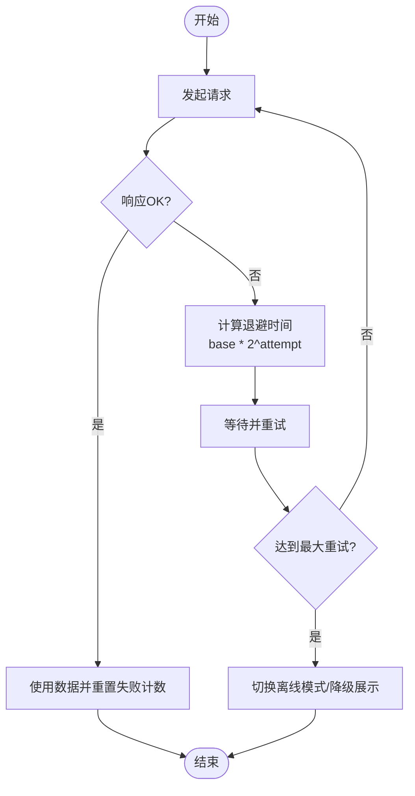
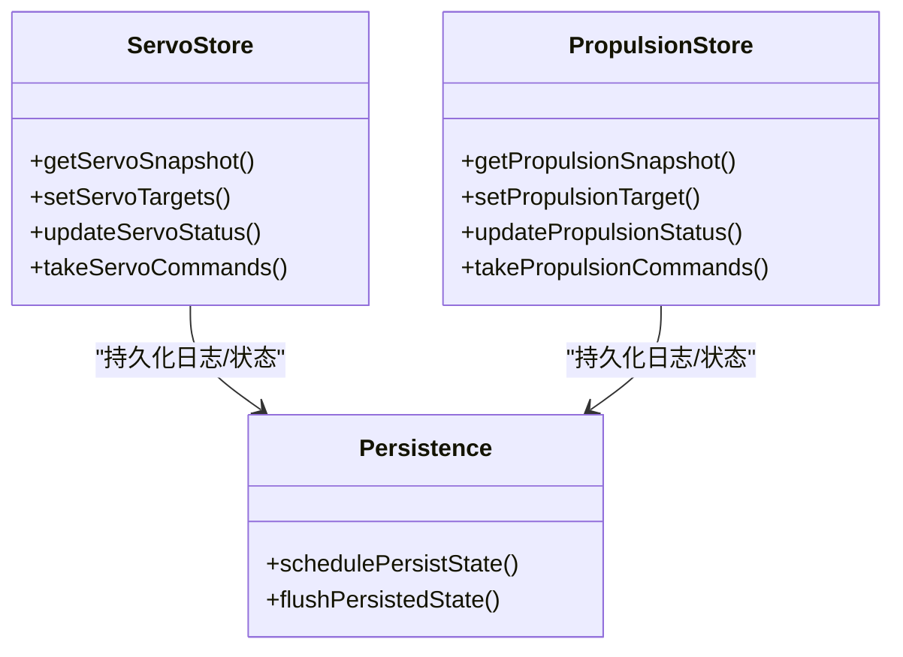
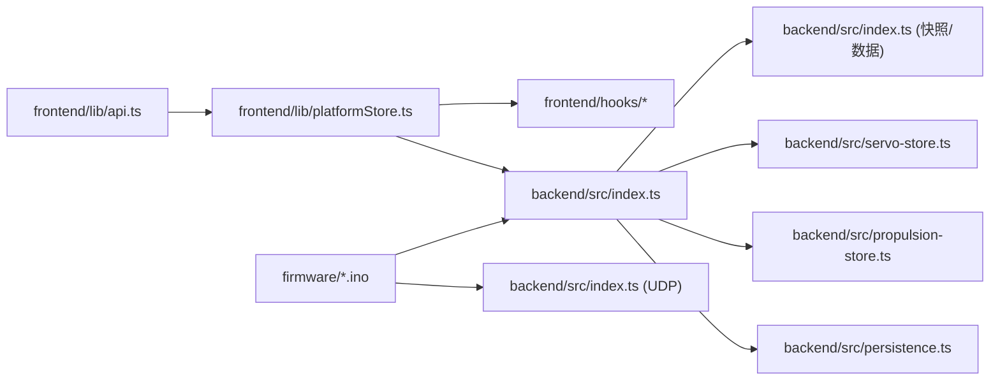

# 网络通信优化

<cite>
**本文引用的文件**
- [apps/backend/src/index.ts](file://fishery-digital-twin-platform/apps/backend/src/index.ts)
- [apps/backend/src/persistence.ts](file://fishery-digital-twin-platform/apps/backend/src/persistence.ts)
- [apps/backend/src/gps-store.ts](file://fishery-digital-twin-platform/apps/backend/src/gps-store.ts)
- [apps/backend/src/servo-store.ts](file://fishery-digital-twin-platform/apps/backend/src/servo-store.ts)
- [apps/backend/src/propulsion-store.ts](file://fishery-digital-twin-platform/apps/backend/src/propulsion-store.ts)
- [apps/frontend/src/lib/api.ts](file://fishery-digital-twin-platform/apps/frontend/src/lib/api.ts)
- [apps/frontend/src/lib/platformStore.ts](file://fishery-digital-twin-platform/apps/frontend/src/lib/platformStore.ts)
- [apps/frontend/src/hooks/usePlatformData.ts](file://fishery-digital-twin-platform/apps/frontend/src/hooks/usePlatformData.ts)
- [apps/frontend/src/hooks/useDeviceFeedback.ts](file://fishery-digital-twin-platform/apps/frontend/src/hooks/useDeviceFeedback.ts)
- [apps/frontend/src/lib/fallback-data.ts](file://fishery-digital-twin-platform/apps/frontend/src/lib/fallback-data.ts)
- [firmware/esp32/esp32_simplefoc_dual_propulsion/esp32_simplefoc_dual_propulsion.ino](file://fishery-digital-twin-platform/firmware/esp32/esp32_simplefoc_dual_propulsion/esp32_simplefoc_dual_propulsion.ino)
- [firmware/esp32/maker_esp32_pro_four_servo_02/maker_esp32_pro_four_servo_02.ino](file://fishery-digital-twin-platform/firmware/esp32/maker_esp32_pro_four_servo_02/maker_esp32_pro_four_servo_02.ino)
- [firmware/esp32/maker_esp32_pro_gps_only/maker_esp32_pro_gps_only.ino](file://fishery-digital-twin-platform/firmware/esp32/maker_esp32_pro_gps_only/maker_esp32_pro_gps_only.ino)
- [firmware/esp32/maker_esp32_pro_servo_temp_01/maker_esp32_pro_servo_temp_01.ino](file://fishery-digital-twin-platform/firmware/esp32/maker_esp32_pro_servo_temp_01/maker_esp32_pro_servo_temp_01.ino)
- [docs/security-and-network.md](file://fishery-digital-twin-platform/docs/security-and-network.md)
</cite>

## 目录
1. [简介](#简介)
2. [项目结构](#项目结构)
3. [核心组件](#核心组件)
4. [架构总览](#架构总览)
5. [详细组件分析](#详细组件分析)
6. [依赖关系分析](#依赖关系分析)
7. [性能考量](#性能考量)
8. [故障诊断与排错指南](#故障诊断与排错指南)
9. [结论](#结论)
10. [附录](#附录)

## 简介
本文件面向数字孪生系统的网络通信优化，围绕数据压缩、连接复用、错误重试、带宽优化、实时通信、移动端优化以及监控与诊断等方面，结合仓库中的后端 API、前端轮询与状态管理、固件设备发现与上报等实现，给出可落地的策略与改进建议。当前代码以 HTTP REST 为主，未使用 WebSocket；通过定时轮询、命令队列与本地持久化实现了高可用的数据同步与控制闭环。

## 项目结构
- 后端 Express 服务提供统一 REST API，负责水质、电池、导航、AI 报告、舵机与推进器状态与指令、日志与健康检查，并通过 UDP 广播进行局域网设备发现。
- 前端 Next.js 应用通过集中式 store 定时轮询后端接口，聚合平台快照和设备反馈，驱动 UI 渲染。
- ESP32 固件通过 UDP 广播发现后端，并周期性发起 TCP 健康探测与 HTTP 上报/拉取控制指令。

**图表来源**
- [apps/backend/src/index.ts:56-110](file://fishery-digital-twin-platform/apps/backend/src/index.ts#L56-L110)
- [apps/backend/src/index.ts:271-318](file://fishery-digital-twin-platform/apps/backend/src/index.ts#L271-L318)
- [apps/frontend/src/lib/api.ts:6-24](file://fishery-digital-twin-platform/apps/frontend/src/lib/api.ts#L6-L24)
- [apps/frontend/src/lib/platformStore.ts:98-139](file://fishery-digital-twin-platform/apps/frontend/src/lib/platformStore.ts#L98-L139)
- [firmware/esp32/esp32_simplefoc_dual_propulsion/esp32_simplefoc_dual_propulsion.ino:364-474](file://fishery-digital-twin-platform/firmware/esp32/esp32_simplefoc_dual_propulsion/esp32_simplefoc_dual_propulsion.ino#L364-L474)

**章节来源**
- [apps/backend/src/index.ts:56-110](file://fishery-digital-twin-platform/apps/backend/src/index.ts#L56-L110)
- [apps/backend/src/index.ts:271-318](file://fishery-digital-twin-platform/apps/backend/src/index.ts#L271-L318)
- [apps/frontend/src/lib/api.ts:6-24](file://fishery-digital-twin-platform/apps/frontend/src/lib/api.ts#L6-L24)
- [apps/frontend/src/lib/platformStore.ts:98-139](file://fishery-digital-twin-platform/apps/frontend/src/lib/platformStore.ts#L98-L139)
- [docs/security-and-network.md:17-30](file://fishery-digital-twin-platform/docs/security-and-network.md#L17-L30)

## 核心组件
- 后端REST与发现服务：提供健康检查、快照、传感器数据写入、设备控制、AI报告、日志查询；同时监听UDP端口进行设备发现与公告。
- 前端轮询与状态管理：统一的 fetchJson 封装，设置超时与令牌；store 内维护快照与设备反馈的定时刷新，避免重复请求与竞态。
- 设备端发现与上报：ESP32 通过UDP广播发现后端，周期进行TCP连通性测试，并在可用时上报传感器数据或拉取控制指令。

**章节来源**
- [apps/backend/src/index.ts:322-557](file://fishery-digital-twin-platform/apps/backend/src/index.ts#L322-L557)
- [apps/frontend/src/lib/api.ts:6-24](file://fishery-digital-twin-platform/apps/frontend/src/lib/api.ts#L6-L24)
- [apps/frontend/src/lib/platformStore.ts:20-21](file://fishery-digital-twin-platform/apps/frontend/src/lib/platformStore.ts#L20-L21)
- [firmware/esp32/esp32_simplefoc_dual_propulsion/esp32_simplefoc_dual_propulsion.ino:364-474](file://fishery-digital-twin-platform/firmware/esp32/esp32_simplefoc_dual_propulsion/esp32_simplefoc_dual_propulsion.ino#L364-L474)

## 架构总览
系统采用“前端轮询 + 后端集中状态 + 设备侧UDP发现”的模式。前端每2秒拉取一次平台快照，每1秒拉取舵机与推进器反馈；后端将传感器历史、设备状态、AI报告与日志保存在内存中，并异步落盘到本地JSON文件；设备端通过UDP发现后端地址，再走HTTP上报/拉取。

**图表来源**
- [apps/backend/src/index.ts:271-318](file://fishery-digital-twin-platform/apps/backend/src/index.ts#L271-L318)
- [apps/backend/src/index.ts:367-430](file://fishery-digital-twin-platform/apps/backend/src/index.ts#L367-L430)
- [apps/frontend/src/lib/platformStore.ts:98-139](file://fishery-digital-twin-platform/apps/frontend/src/lib/platformStore.ts#L98-L139)
- [firmware/esp32/esp32_simplefoc_dual_propulsion/esp32_simplefoc_dual_propulsion.ino:364-474](file://fishery-digital-twin-platform/firmware/esp32/esp32_simplefoc_dual_propulsion/esp32_simplefoc_dual_propulsion.ino#L364-L474)

## 详细组件分析

### 数据压缩与传输优化
- JSON压缩
  - 后端使用 express.json({ limit: "1mb" }) 解析请求体，限制最大请求大小，避免过大负载影响吞吐。
  - 前端统一通过 fetch 发送 application/json 内容，便于服务端解析与后续接入压缩层。
  - 建议：在反向代理（如Nginx）开启 gzip/br 压缩响应体；对高频小响应启用压缩，对大体积二进制流考虑分块传输。
- 二进制数据传输
  - 当前主要传输结构化JSON；若未来需要传输图像或模型权重，建议改用分块上传/下载与流式处理，减少内存峰值。
- 增量更新机制
  - 后端维护最近 N 条水质历史（默认180条），并提供 /api/water 与 /api/snapshot 接口；前端每次获取完整快照。
  - 建议：为 /api/water 增加 lastTimestamp 参数，仅返回新增数据点，降低带宽与前端合并成本。

**章节来源**
- [apps/backend/src/index.ts:110-110](file://fishery-digital-twin-platform/apps/backend/src/index.ts#L110-L110)
- [apps/backend/src/index.ts:338-341](file://fishery-digital-twin-platform/apps/backend/src/index.ts#L338-L341)
- [apps/frontend/src/lib/api.ts:6-24](file://fishery-digital-twin-platform/apps/frontend/src/lib/api.ts#L6-L24)

### 连接复用与长连接管理
- HTTP/2多路复用
  - 当前未显式配置HTTP/2；可在反向代理层启用HTTP/2，使同一域名下的多个并发请求复用连接，减少握手开销。
- WebSocket连接池与长连接
  - 当前未实现WebSocket；所有数据通过定时轮询获取。
  - 建议：对高频推送场景（如舵机/推进器状态、GPS定位）引入WebSocket，建立连接池并按设备ID路由消息，降低轮询频率与CPU占用。
- 长连接管理
  - 前端通过 setInterval 维持轮询；后端通过心跳与在线判定（last_seen）判断设备是否在线。
  - 建议：在WebSocket模式下实现心跳保活、断线重连与连接池回收。

**章节来源**
- [apps/frontend/src/lib/platformStore.ts:20-21](file://fishery-digital-twin-platform/apps/frontend/src/lib/platformStore.ts#L20-L21)
- [apps/backend/src/gps-store.ts:40-53](file://fishery-digital-twin-platform/apps/backend/src/gps-store.ts#L40-L53)
- [apps/backend/src/servo-store.ts:43-58](file://fishery-digital-twin-platform/apps/backend/src/servo-store.ts#L43-L58)
- [apps/backend/src/propulsion-store.ts:82-147](file://fishery-digital-twin-platform/apps/backend/src/propulsion-store.ts#L82-L147)

### 错误重试与健壮性
- 指数退避算法
  - 前端当前使用固定间隔轮询，未实现指数退避；建议在轮询失败时按失败次数递增等待时间，避免雪崩。
- 故障转移策略
  - 前端在请求失败时将 snapshotConnected/feedbackConnected 置为 false，UI可据此降级显示。
  - 设备端具备WiFi重连与后端发现重试逻辑，失败后定期重试。
- 连接健康检查
  - 后端提供 /api/health；设备端会尝试TCP连接测试，失败则标记后端不可用并重新发现。

**图表来源**
- [apps/frontend/src/lib/platformStore.ts:98-139](file://fishery-digital-twin-platform/apps/frontend/src/lib/platformStore.ts#L98-L139)
- [firmware/esp32/esp32_simplefoc_dual_propulsion/esp32_simplefoc_dual_propulsion.ino:422-474](file://fishery-digital-twin-platform/firmware/esp32/esp32_simplefoc_dual_propulsion/esp32_simplefoc_dual_propulsion.ino#L422-L474)

**章节来源**
- [apps/frontend/src/lib/platformStore.ts:98-139](file://fishery-digital-twin-platform/apps/frontend/src/lib/platformStore.ts#L98-L139)
- [firmware/esp32/esp32_simplefoc_dual_propulsion/esp32_simplefoc_dual_propulsion.ino:422-474](file://fishery-digital-twin-platform/firmware/esp32/esp32_simplefoc_dual_propulsion/esp32_simplefoc_dual_propulsion.ino#L422-L474)

### 带宽优化
- 数据去重
  - 后端对水质历史保持固定长度滑动窗口，避免无限增长；AI报告生成有每分钟限流。
- 请求合并
  - 前端通过 Promise.allSettled 并行拉取舵机与推进器状态，减少RTT；建议进一步合并为单一批量接口。
- 响应缓存
  - 前端当前禁用浏览器缓存（cache: "no-store"），适合实时数据；对于不频繁变化的配置类数据，可启用ETag/Last-Modified以减少带宽。

**章节来源**
- [apps/backend/src/index.ts:456-473](file://fishery-digital-twin-platform/apps/backend/src/index.ts#L456-L473)
- [apps/frontend/src/lib/platformStore.ts:116-130](file://fishery-digital-twin-platform/apps/frontend/src/lib/platformStore.ts#L116-L130)
- [apps/frontend/src/lib/api.ts:6-24](file://fishery-digital-twin-platform/apps/frontend/src/lib/api.ts#L6-L24)

### 实时通信优化
- 消息队列
  - 后端为舵机与推进器维护命令队列，带TTL过期清理，确保设备能拉取有效指令。
- 事件驱动架构
  - 当前为请求-响应模式；建议引入事件总线或消息中间件，将设备状态变更推送到订阅者。
- 状态同步算法
  - 前端基于时间戳与连接状态进行局部更新；建议引入版本号或序列号，支持冲突解决与增量同步。

**图表来源**
- [apps/backend/src/servo-store.ts:89-184](file://fishery-digital-twin-platform/apps/backend/src/servo-store.ts#L89-L184)
- [apps/backend/src/propulsion-store.ts:149-319](file://fishery-digital-twin-platform/apps/backend/src/propulsion-store.ts#L149-L319)
- [apps/backend/src/persistence.ts:17-68](file://fishery-digital-twin-platform/apps/backend/src/persistence.ts#L17-L68)

**章节来源**
- [apps/backend/src/servo-store.ts:106-184](file://fishery-digital-twin-platform/apps/backend/src/servo-store.ts#L106-L184)
- [apps/backend/src/propulsion-store.ts:166-319](file://fishery-digital-twin-platform/apps/backend/src/propulsion-store.ts#L166-L319)
- [apps/backend/src/persistence.ts:17-68](file://fishery-digital-twin-platform/apps/backend/src/persistence.ts#L17-L68)

### 移动端网络优化
- 离线支持
  - 前端具备 fallback-data 生成确定性初始快照，保证无网络时的基础展示。
- 数据同步
  - 恢复网络后自动继续轮询；建议加入待提交操作队列，在网络恢复后批量上报。
- 网络状态检测
  - 前端根据 snapshotConnected/feedbackConnected 判断连接状态；建议扩展为更细粒度的网络质量指标（延迟、丢包率）。

**章节来源**
- [apps/frontend/src/lib/fallback-data.ts:152-164](file://fishery-digital-twin-platform/apps/frontend/src/lib/fallback-data.ts#L152-L164)
- [apps/frontend/src/lib/platformStore.ts:98-139](file://fishery-digital-twin-platform/apps/frontend/src/lib/platformStore.ts#L98-L139)

### 安全与访问控制
- 令牌鉴权
  - 后端要求局域网控制请求携带 X-UISYS-Token；回环地址可免鉴权。
- CORS配置
  - 允许指定来源访问，防止跨站请求滥用。
- 防火墙与发现
  - 设备通过UDP 42110发现后端，HTTP API使用TCP 5000；需确保同网段且关闭客户端隔离。

**章节来源**
- [apps/backend/src/index.ts:143-157](file://fishery-digital-twin-platform/apps/backend/src/index.ts#L143-L157)
- [apps/backend/src/index.ts:101-110](file://fishery-digital-twin-platform/apps/backend/src/index.ts#L101-L110)
- [docs/security-and-network.md:17-30](file://fishery-digital-twin-platform/docs/security-and-network.md#L17-L30)

## 依赖关系分析
- 前端依赖
  - api.ts 提供统一HTTP封装；platformStore.ts 管理轮询与状态切片；hooks 暴露给页面消费。
- 后端依赖
  - index.ts 注册路由与中间件；各 store 管理设备状态与命令队列；persistence.ts 负责落盘。
- 设备端依赖
  - 固件通过UDP发现后端，再进行HTTP交互；具备WiFi重连与发现重试。

**图表来源**
- [apps/frontend/src/lib/api.ts:6-24](file://fishery-digital-twin-platform/apps/frontend/src/lib/api.ts#L6-L24)
- [apps/frontend/src/lib/platformStore.ts:98-139](file://fishery-digital-twin-platform/apps/frontend/src/lib/platformStore.ts#L98-L139)
- [apps/backend/src/index.ts:56-110](file://fishery-digital-twin-platform/apps/backend/src/index.ts#L56-L110)
- [apps/backend/src/servo-store.ts:89-184](file://fishery-digital-twin-platform/apps/backend/src/servo-store.ts#L89-L184)
- [apps/backend/src/propulsion-store.ts:149-319](file://fishery-digital-twin-platform/apps/backend/src/propulsion-store.ts#L149-L319)
- [apps/backend/src/persistence.ts:17-68](file://fishery-digital-twin-platform/apps/backend/src/persistence.ts#L17-L68)
- [firmware/esp32/esp32_simplefoc_dual_propulsion/esp32_simplefoc_dual_propulsion.ino:364-474](file://fishery-digital-twin-platform/firmware/esp32/esp32_simplefoc_dual_propulsion/esp32_simplefoc_dual_propulsion.ino#L364-L474)

**章节来源**
- [apps/frontend/src/lib/api.ts:6-24](file://fishery-digital-twin-platform/apps/frontend/src/lib/api.ts#L6-L24)
- [apps/frontend/src/lib/platformStore.ts:98-139](file://fishery-digital-twin-platform/apps/frontend/src/lib/platformStore.ts#L98-L139)
- [apps/backend/src/index.ts:56-110](file://fishery-digital-twin-platform/apps/backend/src/index.ts#L56-L110)
- [apps/backend/src/servo-store.ts:89-184](file://fishery-digital-twin-platform/apps/backend/src/servo-store.ts#L89-L184)
- [apps/backend/src/propulsion-store.ts:149-319](file://fishery-digital-twin-platform/apps/backend/src/propulsion-store.ts#L149-L319)
- [apps/backend/src/persistence.ts:17-68](file://fishery-digital-twin-platform/apps/backend/src/persistence.ts#L17-L68)
- [firmware/esp32/esp32_simplefoc_dual_propulsion/esp32_simplefoc_dual_propulsion.ino:364-474](file://fishery-digital-twin-platform/firmware/esp32/esp32_simplefoc_dual_propulsion/esp32_simplefoc_dual_propulsion.ino#L364-L474)

## 性能考量
- 轮询频率调优
  - 当前快照2秒、反馈1秒；可根据网络质量与设备数量动态调整，避免过载。
- 批量化与合并
  - 将舵机与推进器状态合并为单接口；为水质历史提供增量接口。
- 压缩与缓存
  - 启用响应压缩；对静态或低频数据启用缓存头。
- 资源限制
  - 限制请求体大小；对AI报告生成进行限流，避免CPU尖峰。

[本节为通用指导，无需具体文件引用]

## 故障诊断与排错指南
- 健康检查
  - 调用 /api/health 验证后端状态；观察 dataMode、ai、gps、servos、propulsion 字段。
- 日志查看
  - 调用 /api/logs 获取系统日志，辅助定位问题。
- 设备发现与连通性
  - 确认设备与后端在同一网段，UDP 42110 开放；设备端会进行TCP健康探测，失败则重新发现。
- 令牌与CORS
  - 确保设备与前端均携带正确令牌；CORS源配置正确，避免跨域拦截。

**章节来源**
- [apps/backend/src/index.ts:322-334](file://fishery-digital-twin-platform/apps/backend/src/index.ts#L322-L334)
- [apps/backend/src/index.ts:557-557](file://fishery-digital-twin-platform/apps/backend/src/index.ts#L557-L557)
- [docs/security-and-network.md:17-30](file://fishery-digital-twin-platform/docs/security-and-network.md#L17-L30)
- [firmware/esp32/esp32_simplefoc_dual_propulsion/esp32_simplefoc_dual_propulsion.ino:422-474](file://fishery-digital-twin-platform/firmware/esp32/esp32_simplefoc_dual_propulsion/esp32_simplefoc_dual_propulsion.ino#L422-L474)

## 结论
当前系统通过HTTP REST与UDP发现实现了稳定的数据同步与控制闭环。为进一步提升网络效率与用户体验，建议引入响应压缩、增量更新、请求合并、HTTP/2多路复用与WebSocket长连接，并完善前端重试与退避策略。同时，强化健康检查与日志诊断能力，有助于快速定位与解决问题。

[本节为总结性内容，无需具体文件引用]

## 附录
- 环境变量与安全
  - 后端需配置 UISYS_API_TOKEN 与 CORS_ORIGIN；设备固件需配置相同令牌。
  - 确保防火墙放行UDP 42110与HTTP 5000端口。
- 常用接口
  - GET /api/health：服务健康检查
  - GET /api/snapshot：平台快照
  - POST /api/data：传感器数据上报
  - GET /api/servos, POST /api/servos：舵机状态与控制
  - GET /api/propulsion, POST /api/propulsion：推进器状态与控制
  - GET /api/logs：系统日志

**章节来源**
- [docs/security-and-network.md:17-30](file://fishery-digital-twin-platform/docs/security-and-network.md#L17-L30)
- [apps/backend/src/index.ts:322-557](file://fishery-digital-twin-platform/apps/backend/src/index.ts#L322-L557)