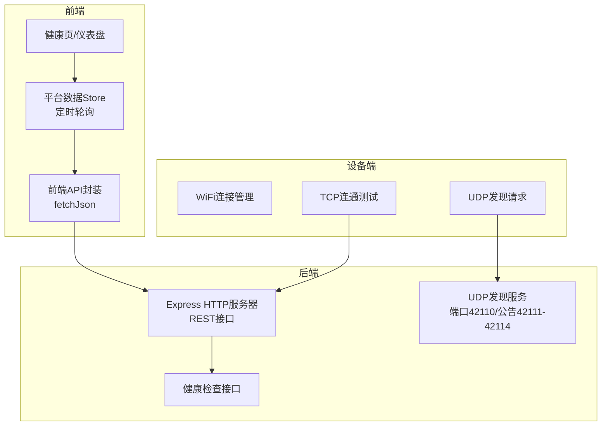
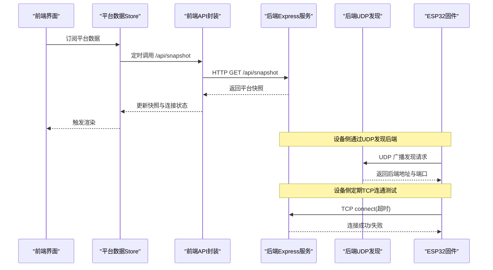
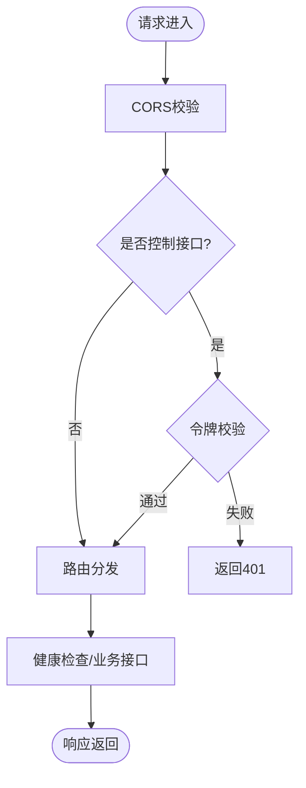
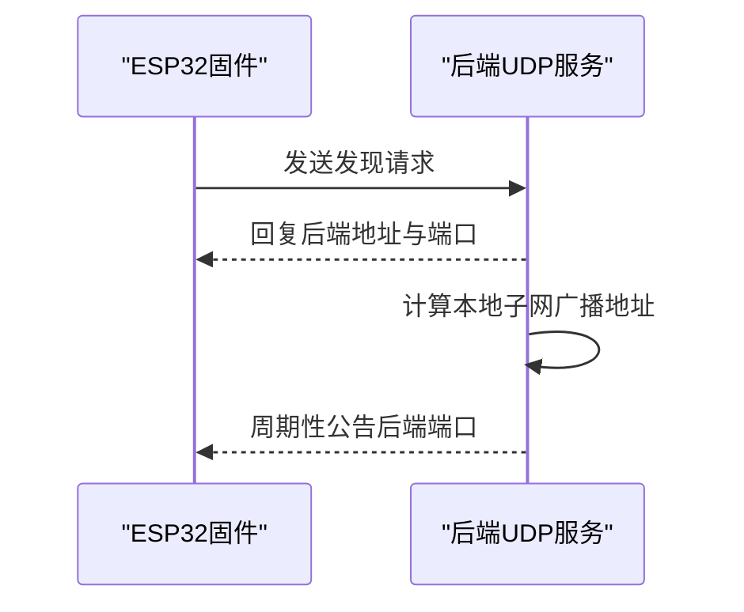
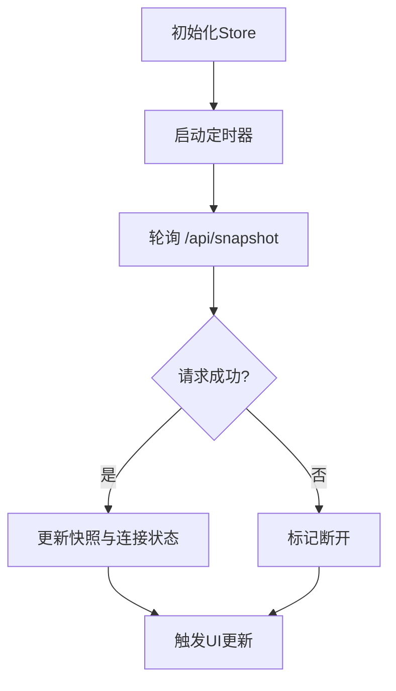
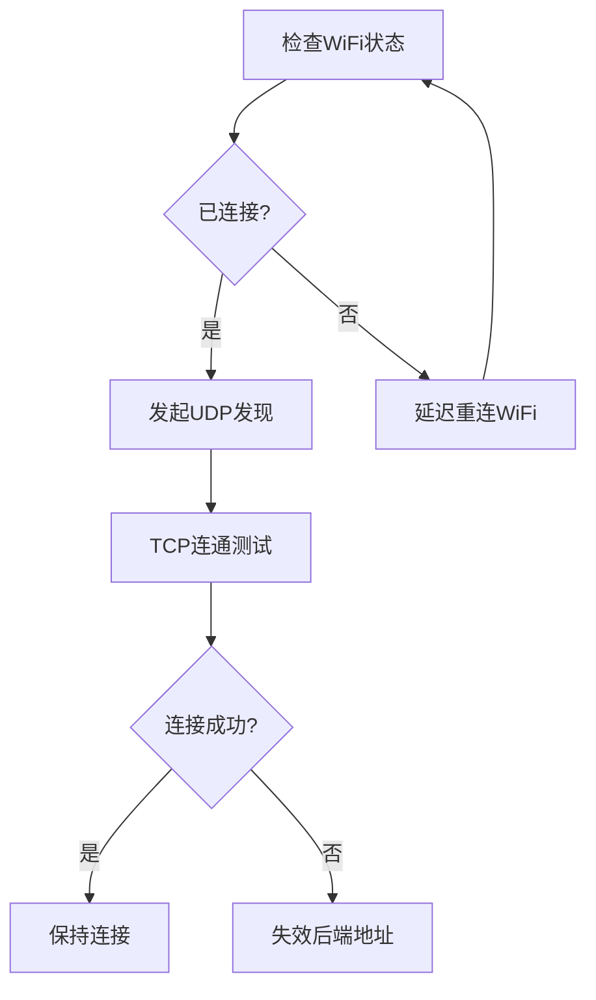
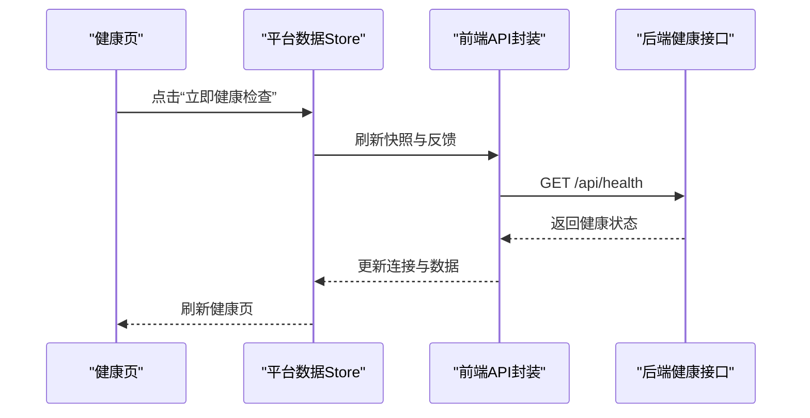
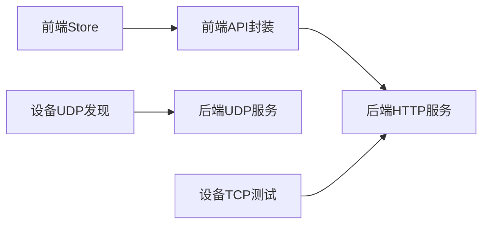

# 连接管理优化

<cite>
**本文引用的文件**
- [apps/backend/src/index.ts](file://fishery-digital-twin-platform/apps/backend/src/index.ts)
- [apps/frontend/src/lib/api.ts](file://fishery-digital-twin-platform/apps/frontend/src/lib/api.ts)
- [apps/frontend/src/lib/platformStore.ts](file://fishery-digital-twin-platform/apps/frontend/src/lib/platformStore.ts)
- [apps/frontend/src/hooks/usePlatformData.ts](file://fishery-digital-twin-platform/apps/frontend/src/hooks/usePlatformData.ts)
- [apps/frontend/src/components/dashboard/HealthPage.tsx](file://fishery-digital-twin-platform/apps/frontend/src/components/dashboard/HealthPage.tsx)
- [firmware/esp32/maker_esp32_pro_gps_only/maker_esp32_pro_gps_only.ino](file://fishery-digital-twin-platform/firmware/esp32/maker_esp32_pro_gps_only/maker_esp32_pro_gps_only.ino)
- [firmware/esp32/maker_esp32_pro_servo_temp_01/maker_esp32_pro_servo_temp_01.ino](file://fishery-digital-twin-platform/firmware/esp32/maker_esp32_pro_servo_temp_01/maker_esp32_pro_servo_temp_01.ino)
- [firmware/esp32/esp32_simplefoc_dual_propulsion/esp32_simplefoc_dual_propulsion.ino](file://fishery-digital-twin-platform/firmware/esp32/esp32_simplefoc_dual_propulsion/esp32_simplefoc_dual_propulsion.ino)
- [docs/security-and-network.md](file://fishery-digital-twin-platform/docs/security-and-network.md)
- [apps/desktop/runtime/frontend/apps/frontend/server.js](file://fishery-digital-twin-platform/apps/desktop/runtime/frontend/apps/frontend/server.js)
</cite>

## 目录
1. [简介](#简介)
2. [项目结构](#项目结构)
3. [核心组件](#核心组件)
4. [架构总览](#架构总览)
5. [详细组件分析](#详细组件分析)
6. [依赖关系分析](#依赖关系分析)
7. [性能考虑](#性能考虑)
8. [故障排查指南](#故障排查指南)
9. [结论](#结论)
10. [附录](#附录)

## 简介
本文件面向数字孪生系统的“连接管理优化”，聚焦于后端 HTTP API、前端轮询与设备侧 UDP 发现/TCP 连通性检测的协同机制，并在此基础上给出可落地的连接优化策略。当前仓库未内置 WebSocket 或显式 HTTP/2 多路复用实现，因此文档将：
- 基于现有代码总结已实现的连接模式（HTTP 轮询 + UDP 发现 + TCP 连通探测）；
- 结合工程实践，给出 HTTP/2 多路复用、WebSocket 连接池、长连接维护、负载均衡与监控诊断的优化方案与参数建议；
- 提供与现有代码一致的流程图和时序图，便于对照落地。

## 项目结构
系统由三部分组成：
- 后端服务：Express 提供 REST API，UDP 广播用于设备发现，进程级健康检查与健康状态聚合。
- 前端应用：Next.js 页面通过统一的平台数据 Store 定时拉取快照和设备反馈，展示健康与遥测信息。
- 固件设备：ESP32 通过 UDP 广播发现后端，周期性进行 TCP 连通测试，具备 WiFi 重连与退避逻辑。

图表来源
- [apps/backend/src/index.ts:56-110](file://fishery-digital-twin-platform/apps/backend/src/index.ts#L56-L110)
- [apps/backend/src/index.ts:271-318](file://fishery-digital-twin-platform/apps/backend/src/index.ts#L271-L318)
- [apps/frontend/src/lib/api.ts:6-24](file://fishery-digital-twin-platform/apps/frontend/src/lib/api.ts#L6-L24)
- [apps/frontend/src/lib/platformStore.ts:20-21](file://fishery-digital-twin-platform/apps/frontend/src/lib/platformStore.ts#L20-L21)
- [firmware/esp32/maker_esp32_pro_gps_only/maker_esp32_pro_gps_only.ino:154-186](file://fishery-digital-twin-platform/firmware/esp32/maker_esp32_pro_gps_only/maker_esp32_pro_gps_only.ino#L154-L186)

章节来源
- [apps/backend/src/index.ts:56-110](file://fishery-digital-twin-platform/apps/backend/src/index.ts#L56-L110)
- [apps/backend/src/index.ts:271-318](file://fishery-digital-twin-platform/apps/backend/src/index.ts#L271-L318)
- [apps/frontend/src/lib/api.ts:6-24](file://fishery-digital-twin-platform/apps/frontend/src/lib/api.ts#L6-L24)
- [apps/frontend/src/lib/platformStore.ts:20-21](file://fishery-digital-twin-platform/apps/frontend/src/lib/platformStore.ts#L20-L21)
- [firmware/esp32/maker_esp32_pro_gps_only/maker_esp32_pro_gps_only.ino:154-186](file://fishery-digital-twin-platform/firmware/esp32/maker_esp32_pro_gps_only/maker_esp32_pro_gps_only.ino#L154-L186)

## 核心组件
- 后端 HTTP 服务与中间件：CORS、JSON 解析、控制鉴权、健康检查、数据接口。
- 设备发现与公告：UDP 监听与广播，支持客户端端口公告。
- 前端数据轮询：统一 Store 以固定间隔轮询快照与设备反馈，暴露连接状态。
- 设备侧网络维护：WiFi 断线重连、UDP 发现、TCP 连通测试。

章节来源
- [apps/backend/src/index.ts:101-110](file://fishery-digital-twin-platform/apps/backend/src/index.ts#L101-L110)
- [apps/backend/src/index.ts:143-157](file://fishery-digital-twin-platform/apps/backend/src/index.ts#L143-L157)
- [apps/backend/src/index.ts:322-334](file://fishery-digital-twin-platform/apps/backend/src/index.ts#L322-L334)
- [apps/backend/src/index.ts:271-318](file://fishery-digital-twin-platform/apps/backend/src/index.ts#L271-L318)
- [apps/frontend/src/lib/platformStore.ts:98-139](file://fishery-digital-twin-platform/apps/frontend/src/lib/platformStore.ts#L98-L139)
- [firmware/esp32/maker_esp32_pro_gps_only/maker_esp32_pro_gps_only.ino:154-186](file://fishery-digital-twin-platform/firmware/esp32/maker_esp32_pro_gps_only/maker_esp32_pro_gps_only.ino#L154-L186)

## 架构总览
下图展示了从前端到后端、再到设备的完整连接路径与关键节点。

图表来源
- [apps/frontend/src/lib/platformStore.ts:98-139](file://fishery-digital-twin-platform/apps/frontend/src/lib/platformStore.ts#L98-L139)
- [apps/frontend/src/lib/api.ts:6-24](file://fishery-digital-twin-platform/apps/frontend/src/lib/api.ts#L6-L24)
- [apps/backend/src/index.ts:322-334](file://fishery-digital-twin-platform/apps/backend/src/index.ts#L322-L334)
- [apps/backend/src/index.ts:271-318](file://fishery-digital-twin-platform/apps/backend/src/index.ts#L271-L318)
- [firmware/esp32/maker_esp32_pro_gps_only/maker_esp32_pro_gps_only.ino:154-186](file://fishery-digital-twin-platform/firmware/esp32/maker_esp32_pro_gps_only/maker_esp32_pro_gps_only.ino#L154-L186)

## 详细组件分析

### 后端 HTTP 服务与鉴权
- 使用 Express 启动 HTTP 服务，配置 CORS 白名单与 JSON 大小限制。
- 对局域网控制类接口实施令牌校验，回环地址放行。
- 提供健康检查接口，聚合 AI、GPS、舵机、推进器状态。

图表来源
- [apps/backend/src/index.ts:101-110](file://fishery-digital-twin-platform/apps/backend/src/index.ts#L101-L110)
- [apps/backend/src/index.ts:143-157](file://fishery-digital-twin-platform/apps/backend/src/index.ts#L143-L157)
- [apps/backend/src/index.ts:322-334](file://fishery-digital-twin-platform/apps/backend/src/index.ts#L322-L334)

章节来源
- [apps/backend/src/index.ts:101-110](file://fishery-digital-twin-platform/apps/backend/src/index.ts#L101-L110)
- [apps/backend/src/index.ts:143-157](file://fishery-digital-twin-platform/apps/backend/src/index.ts#L143-L157)
- [apps/backend/src/index.ts:322-334](file://fishery-digital-twin-platform/apps/backend/src/index.ts#L322-L334)

### 设备发现与公告（UDP）
- 后端创建 UDP Socket，监听发现端口并接收设备请求，向设备源地址回复后端地址与端口。
- 同时向多个客户端端口广播公告，便于前端或桌面端快速发现。
- 错误处理包含端口占用与权限问题，必要时退出进程。

图表来源
- [apps/backend/src/index.ts:271-318](file://fishery-digital-twin-platform/apps/backend/src/index.ts#L271-L318)

章节来源
- [apps/backend/src/index.ts:271-318](file://fishery-digital-twin-platform/apps/backend/src/index.ts#L271-L318)

### 前端轮询与连接状态管理
- 统一 Store 以固定间隔轮询平台快照与设备反馈，分别设置不同频率。
- 每次请求成功后标记连接正常，失败时置为断开，供 UI 显示。
- 使用 React Hook 订阅 Store，避免重复刷新与过度渲染。

图表来源
- [apps/frontend/src/lib/platformStore.ts:20-21](file://fishery-digital-twin-platform/apps/frontend/src/lib/platformStore.ts#L20-L21)
- [apps/frontend/src/lib/platformStore.ts:98-139](file://fishery-digital-twin-platform/apps/frontend/src/lib/platformStore.ts#L98-L139)
- [apps/frontend/src/hooks/usePlatformData.ts:10-23](file://fishery-digital-twin-platform/apps/frontend/src/hooks/usePlatformData.ts#L10-L23)

章节来源
- [apps/frontend/src/lib/platformStore.ts:20-21](file://fishery-digital-twin-platform/apps/frontend/src/lib/platformStore.ts#L20-L21)
- [apps/frontend/src/lib/platformStore.ts:98-139](file://fishery-digital-twin-platform/apps/frontend/src/lib/platformStore.ts#L98-L139)
- [apps/frontend/src/hooks/usePlatformData.ts:10-23](file://fishery-digital-twin-platform/apps/frontend/src/hooks/usePlatformData.ts#L10-L23)

### 设备侧网络维护与自动重连
- WiFi 连接维护：检测到断线后延迟重试，保持最小重试间隔。
- 后端发现：周期内若未找到后端则跳过，避免频繁广播。
- TCP 连通测试：尝试连接后端端口，失败则清空发现结果，等待下次重试。

图表来源
- [firmware/esp32/maker_esp32_pro_gps_only/maker_esp32_pro_gps_only.ino:154-186](file://fishery-digital-twin-platform/firmware/esp32/maker_esp32_pro_gps_only/maker_esp32_pro_gps_only.ino#L154-L186)
- [firmware/esp32/maker_esp32_pro_servo_temp_01/maker_esp32_pro_servo_temp_01.ino:344-408](file://fishery-digital-twin-platform/firmware/esp32/maker_esp32_pro_servo_temp_01/maker_esp32_pro_servo_temp_01.ino#L344-L408)
- [firmware/esp32/esp32_simplefoc_dual_propulsion/esp32_simplefoc_dual_propulsion.ino:364-445](file://fishery-digital-twin-platform/firmware/esp32/esp32_simplefoc_dual_propulsion/esp32_simplefoc_dual_propulsion.ino#L364-L445)

章节来源
- [firmware/esp32/maker_esp32_pro_gps_only/maker_esp32_pro_gps_only.ino:154-186](file://fishery-digital-twin-platform/firmware/esp32/maker_esp32_pro_gps_only/maker_esp32_pro_gps_only.ino#L154-L186)
- [firmware/esp32/maker_esp32_pro_servo_temp_01/maker_esp32_pro_servo_temp_01.ino:344-408](file://fishery-digital-twin-platform/firmware/esp32/maker_esp32_pro_servo_temp_01/maker_esp32_pro_servo_temp_01.ino#L344-L408)
- [firmware/esp32/esp32_simplefoc_dual_propulsion/esp32_simplefoc_dual_propulsion.ino:364-445](file://fishery-digital-twin-platform/firmware/esp32/esp32_simplefoc_dual_propulsion/esp32_simplefoc_dual_propulsion.ino#L364-L445)

### 健康检查与诊断
- 前端健康页提供手动触发检查按钮，调用平台数据刷新接口，展示最近检测时间与通信状态。
- 后端健康接口返回服务状态、AI、GPS、执行机构等综合信息。

图表来源
- [apps/frontend/src/components/dashboard/HealthPage.tsx:37-47](file://fishery-digital-twin-platform/apps/frontend/src/components/dashboard/HealthPage.tsx#L37-L47)
- [apps/backend/src/index.ts:322-334](file://fishery-digital-twin-platform/apps/backend/src/index.ts#L322-L334)

章节来源
- [apps/frontend/src/components/dashboard/HealthPage.tsx:37-47](file://fishery-digital-twin-platform/apps/frontend/src/components/dashboard/HealthPage.tsx#L37-L47)
- [apps/backend/src/index.ts:322-334](file://fishery-digital-twin-platform/apps/backend/src/index.ts#L322-L334)

## 依赖关系分析
- 前端依赖后端 REST 接口获取数据，Store 统一管理轮询与连接状态。
- 设备侧依赖 UDP 发现与 TCP 连通测试，确保能定位并验证后端可用性。
- 后端依赖 Express 与 dgram 模块，提供 HTTP 与 UDP 能力。

图表来源
- [apps/frontend/src/lib/api.ts:6-24](file://fishery-digital-twin-platform/apps/frontend/src/lib/api.ts#L6-L24)
- [apps/frontend/src/lib/platformStore.ts:98-139](file://fishery-digital-twin-platform/apps/frontend/src/lib/platformStore.ts#L98-L139)
- [apps/backend/src/index.ts:271-318](file://fishery-digital-twin-platform/apps/backend/src/index.ts#L271-L318)

章节来源
- [apps/frontend/src/lib/api.ts:6-24](file://fishery-digital-twin-platform/apps/frontend/src/lib/api.ts#L6-L24)
- [apps/frontend/src/lib/platformStore.ts:98-139](file://fishery-digital-twin-platform/apps/frontend/src/lib/platformStore.ts#L98-L139)
- [apps/backend/src/index.ts:271-318](file://fishery-digital-twin-platform/apps/backend/src/index.ts#L271-L318)

## 性能考虑
- 轮询频率调优：
  - 快照轮询默认 2 秒，设备反馈默认 1 秒，可根据带宽与负载调整。
  - 降低高频接口压力，避免在低带宽环境下造成拥塞。
- 请求超时与缓存：
  - 前端 fetch 设置超时时间，防止阻塞；禁用缓存以保证实时性。
- 连接保活：
  - 后端 HTTP keep-alive 可通过环境变量配置，减少握手开销。
- 设备侧重连退避：
  - WiFi 重连与后端发现存在最小间隔，避免风暴式重试。

章节来源
- [apps/frontend/src/lib/platformStore.ts:20-21](file://fishery-digital-twin-platform/apps/frontend/src/lib/platformStore.ts#L20-L21)
- [apps/frontend/src/lib/api.ts:6-24](file://fishery-digital-twin-platform/apps/frontend/src/lib/api.ts#L6-L24)
- [apps/desktop/runtime/frontend/apps/frontend/server.js:14-17](file://fishery-digital-twin-platform/apps/desktop/runtime/frontend/apps/frontend/server.js#L14-L17)
- [firmware/esp32/maker_esp32_pro_gps_only/maker_esp32_pro_gps_only.ino:177-186](file://fishery-digital-twin-platform/firmware/esp32/maker_esp32_pro_gps_only/maker_esp32_pro_gps_only.ino#L177-L186)

## 故障排查指南
- 后端端口冲突或权限不足：
  - 监听端口被占用或无权限时会记录错误并退出，需检查端口占用与运行用户权限。
- 局域网控制被拒绝：
  - 未配置令牌时，非回环地址的控制请求将被拒绝，需配置令牌并确保前后端一致。
- 设备无法发现后端：
  - 确认防火墙允许 UDP 42110 与公告端口 42111-42114，且设备与后端在同一可信网络。
- 前端健康检查失败：
  - 检查后端健康接口可达性与网络连通性，查看 Store 的连接状态标志。

章节来源
- [apps/backend/src/index.ts:305-318](file://fishery-digital-twin-platform/apps/backend/src/index.ts#L305-L318)
- [apps/backend/src/index.ts:573-579](file://fishery-digital-twin-platform/apps/backend/src/index.ts#L573-L579)
- [docs/security-and-network.md:17-30](file://fishery-digital-twin-platform/docs/security-and-network.md#L17-L30)
- [apps/frontend/src/components/dashboard/HealthPage.tsx:37-47](file://fishery-digital-twin-platform/apps/frontend/src/components/dashboard/HealthPage.tsx#L37-L47)

## 结论
当前系统在连接管理方面采用“HTTP 轮询 + UDP 发现 + TCP 连通测试”的组合策略，具备基础的健康检查与设备重连能力。为进一步优化连接性能与稳定性，建议在后续迭代中引入：
- HTTP/2 多路复用：启用服务端 HTTP/2，利用头部压缩与管道化提升吞吐。
- WebSocket 连接池：建立双向长连接，实现心跳检测与自动重连，降低轮询开销。
- 长连接维护：统一超时与空闲回收策略，保障资源释放。
- 负载均衡与健康检查：多实例部署配合会话保持与健康探针。
- 监控与诊断：完善指标采集与日志追踪，辅助定位瓶颈。

## 附录

### HTTP/2 多路复用优化建议（概念性）
- 请求管道化：在单连接上并发发送多个请求，减少握手与队头阻塞。
- 头部压缩：使用 HPACK 压缩请求/响应头，降低带宽占用。
- 服务器推送：预推关键资源，缩短首屏加载时间。
- 适用场景：高并发短请求、静态资源密集的前端页面。

[本节为概念性说明，不直接对应具体源码]

### WebSocket 连接池管理（概念性）
- 连接生命周期：建立、心跳、关闭、清理。
- 心跳检测：定时 ping/pong，超时判定断线。
- 自动重连：指数退避与最大重试次数，避免雪崩。
- 连接池：按设备或会话维度复用连接，减少资源消耗。

[本节为概念性说明，不直接对应具体源码]

### 长连接维护策略（概念性）
- 连接超时：读写超时与空闲超时，及时释放僵尸连接。
- 空闲回收：定期扫描空闲连接，回收资源。
- 资源清理：关闭 socket、释放内存、清理定时器。

[本节为概念性说明，不直接对应具体源码]

### 连接负载均衡（概念性）
- 多实例部署：水平扩展后端实例，提升吞吐与容错。
- 会话保持：粘性会话或共享会话存储，保证状态一致性。
- 健康检查：主动探测实例健康，剔除异常节点。

[本节为概念性说明，不直接对应具体源码]

### 连接监控与诊断工具（概念性）
- 指标采集：QPS、延迟、错误率、连接数、带宽。
- 日志追踪：请求链路 ID、关键步骤耗时、异常堆栈。
- 可视化看板：实时监控与告警阈值。

[本节为概念性说明，不直接对应具体源码]

### 连接性能调优参数与最佳实践（概念性）
- 前端：合理设置轮询间隔与请求超时，禁用不必要缓存。
- 后端：开启 HTTP/2、调整 keep-alive 超时、限制请求体大小。
- 设备：重连退避、最小发现间隔、连接超时与失败回退。
- 网络：防火墙规则最小化开放端口，避免跨网段广播风暴。

[本节为概念性说明，不直接对应具体源码]