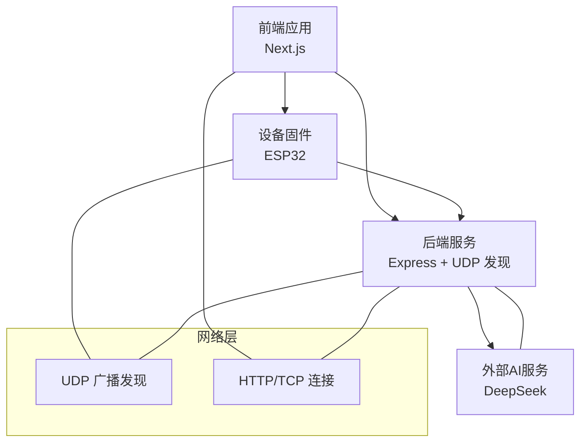
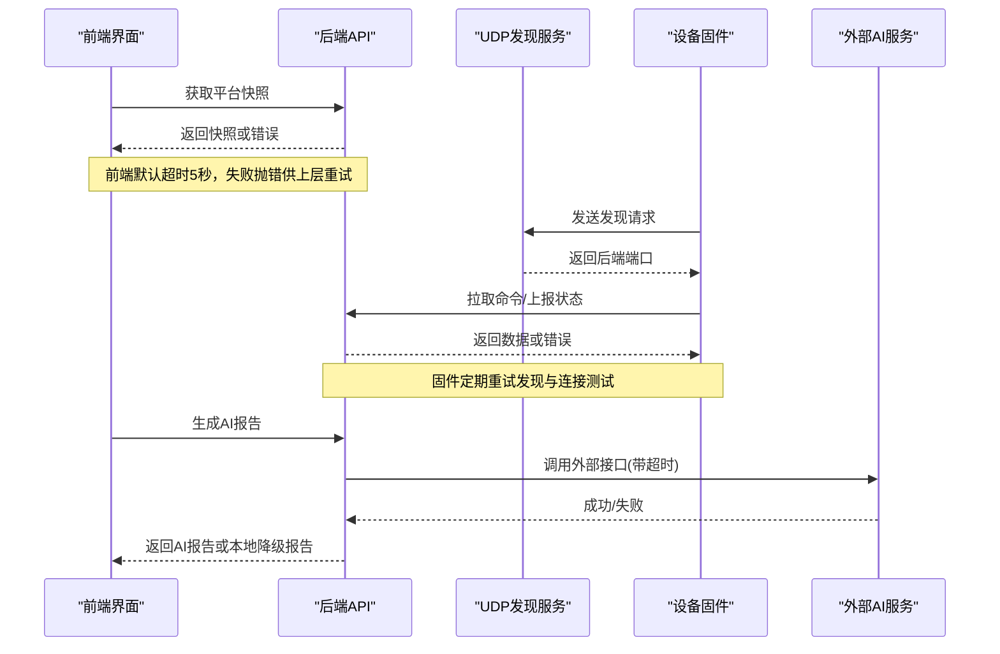
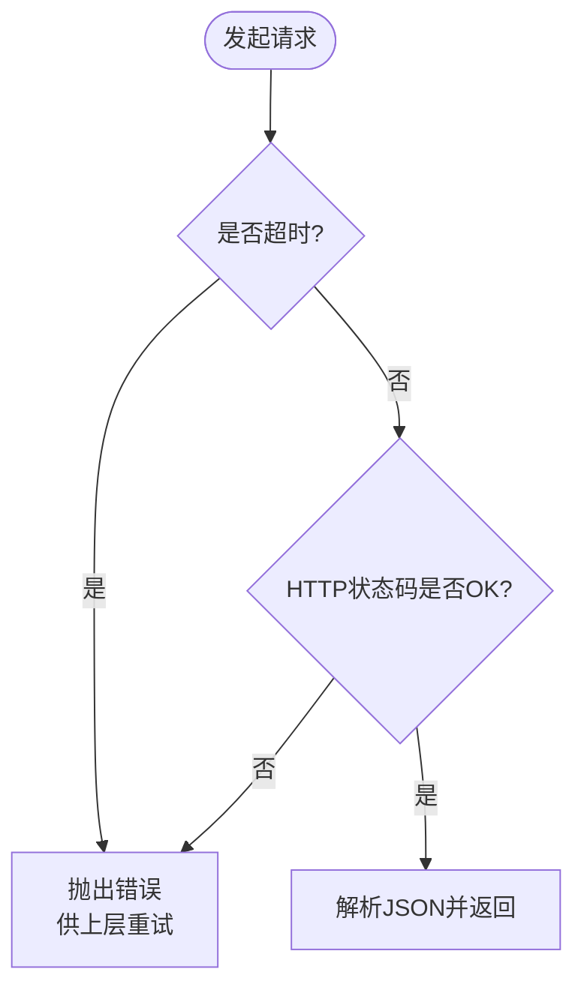
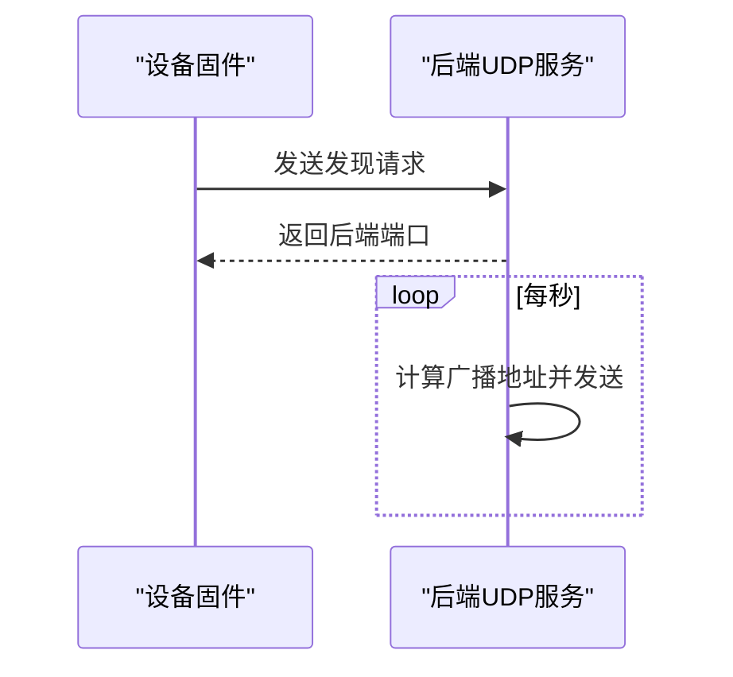
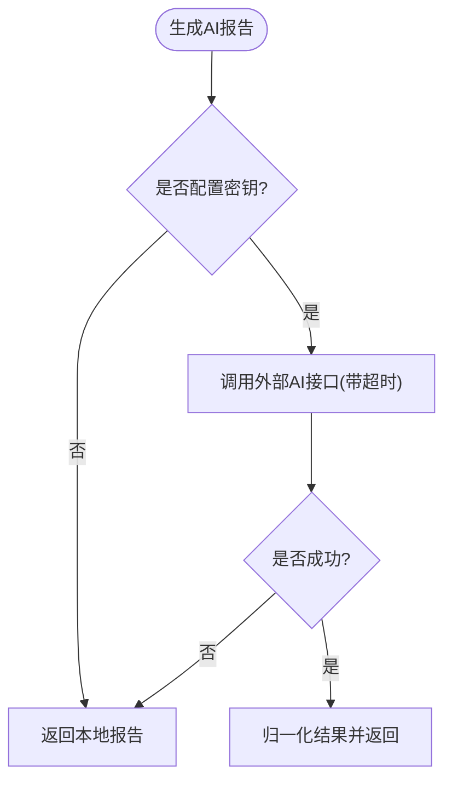
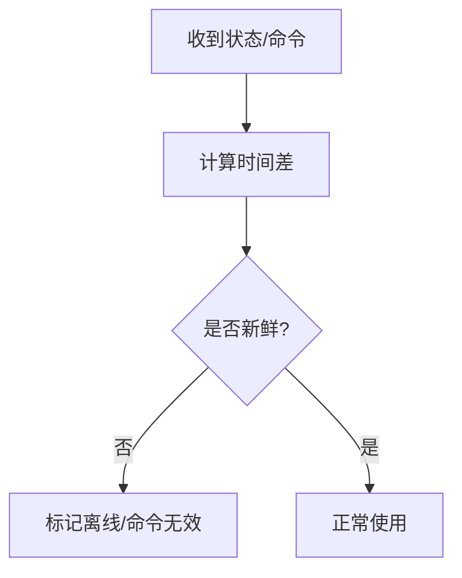
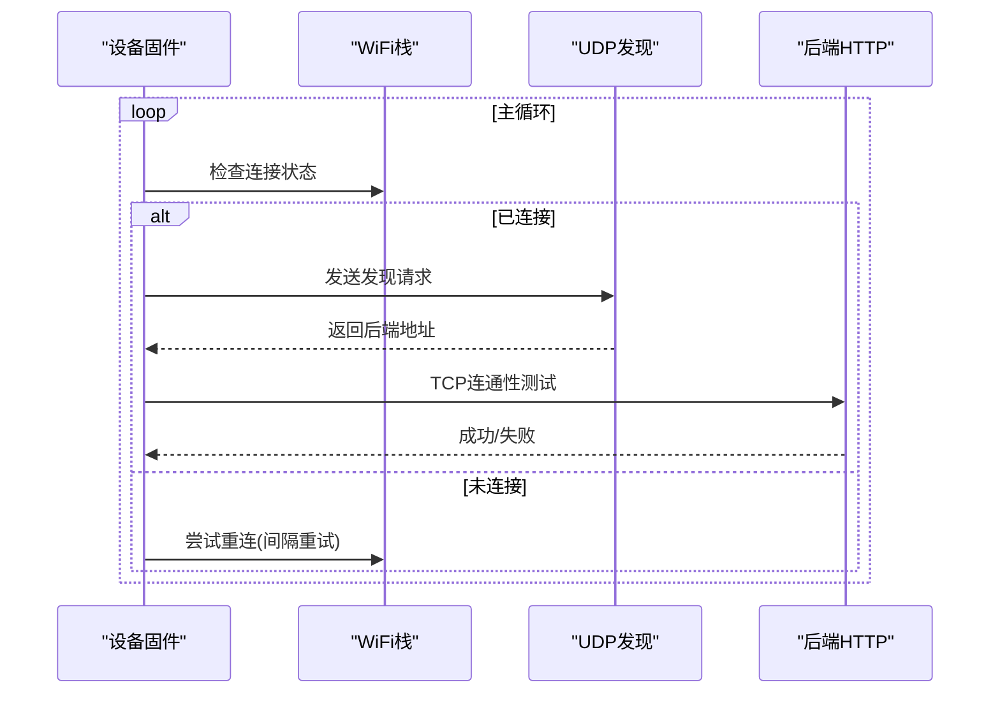
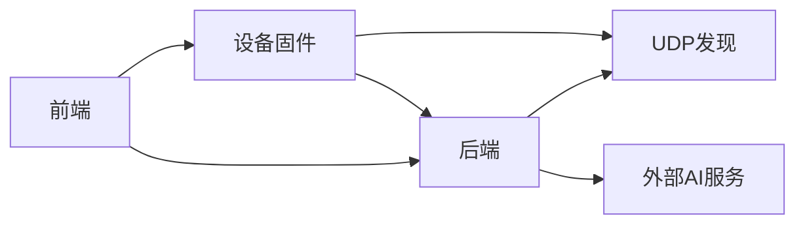

# 错误重试机制

<cite>
**本文引用的文件**
- [apps/backend/src/index.ts](file://fishery-digital-twin-platform/apps/backend/src/index.ts)
- [apps/backend/src/ai-service.ts](file://fishery-digital-twin-platform/apps/backend/src/ai-service.ts)
- [apps/backend/src/propulsion-store.ts](file://fishery-digital-twin-platform/apps/backend/src/propulsion-store.ts)
- [apps/frontend/src/lib/api.ts](file://fishery-digital-twin-platform/apps/frontend/src/lib/api.ts)
- [firmware/esp32/maker_esp32_pro_four_servo_02/maker_esp32_pro_four_servo_02.ino](file://fishery-digital-twin-platform/firmware/esp32/maker_esp32_pro_four_servo_02/maker_esp32_pro_four_servo_02.ino)
- [firmware/esp32/esp32_simplefoc_dual_propulsion/esp32_simplefoc_dual_propulsion.ino](file://fishery-digital-twin-platform/firmware/esp32/esp32_simplefoc_dual_propulsion/esp32_simplefoc_dual_propulsion.ino)
- [firmware/esp32/maker_esp32_pro_servo_temp_01/maker_esp32_pro_servo_temp_01.ino](file://fishery-digital-twin-platform/firmware/esp32/maker_esp32_pro_servo_temp_01/maker_esp32_pro_servo_temp_01.ino)
</cite>

## 目录
1. [简介](#简介)
2. [项目结构](#项目结构)
3. [核心组件](#核心组件)
4. [架构总览](#架构总览)
5. [详细组件分析](#详细组件分析)
6. [依赖关系分析](#依赖关系分析)
7. [性能考量](#性能考量)
8. [故障排查指南](#故障排查指南)
9. [结论](#结论)
10. [附录：配置模板与调试建议](#附录：配置模板与调试建议)

## 简介
本文件面向数字孪生平台的网络容错与错误重试机制，聚焦以下目标：
- 指数退避算法实现要点：初始延迟、最大重试次数、随机抖动因子。
- 故障转移策略：备用服务器选择、服务降级、数据缓存机制。
- 连接健康检查：主动探测、被动监控、故障检测阈值。
- 重试分类策略：可重试错误识别、幂等性保证、事务一致性。
- 重试配置模板与调试工具使用方法。
- 重试效果监控与告警机制实现。

当前仓库在多处实现了“超时+重连/重试”的基础能力，包括前端请求超时、后端对外部服务的超时控制、UDP 设备发现广播与轮询、以及固件侧的 WiFi 重连与后端发现重试。这些能力为构建统一的指数退避重试框架提供了坚实基础。

## 项目结构
从网络容错视角看，系统由三层组成：
- 前端（Next.js）：统一 HTTP 客户端封装，提供默认超时与鉴权头注入。
- 后端（Express）：HTTP API 与 UDP 设备发现服务；对外部 AI 服务调用具备超时保护；内部状态存储具备新鲜度判断与降级逻辑。
- 固件（ESP32）：WiFi 维护、UDP 发现后端、TCP 连通性测试、命令/状态轮询与超时保护。

**图表来源**
- [apps/frontend/src/lib/api.ts:6-24](file://fishery-digital-twin-platform/apps/frontend/src/lib/api.ts#L6-L24)
- [apps/backend/src/index.ts:271-318](file://fishery-digital-twin-platform/apps/backend/src/index.ts#L271-L318)
- [apps/backend/src/ai-service.ts:167-232](file://fishery-digital-twin-platform/apps/backend/src/ai-service.ts#L167-L232)
- [firmware/esp32/maker_esp32_pro_four_servo_02/maker_esp32_pro_four_servo_02.ino:344-400](file://fishery-digital-twin-platform/firmware/esp32/maker_esp32_pro_four_servo_02/maker_esp32_pro_four_servo_02.ino#L344-L400)

**章节来源**
- [apps/frontend/src/lib/api.ts:6-24](file://fishery-digital-twin-platform/apps/frontend/src/lib/api.ts#L6-L24)
- [apps/backend/src/index.ts:271-318](file://fishery-digital-twin-platform/apps/backend/src/index.ts#L271-L318)
- [apps/backend/src/ai-service.ts:167-232](file://fishery-digital-twin-platform/apps/backend/src/ai-service.ts#L167-L232)
- [firmware/esp32/maker_esp32_pro_four_servo_02/maker_esp32_pro_four_servo_02.ino:344-400](file://fishery-digital-twin-platform/firmware/esp32/maker_esp32_pro_four_servo_02/maker_esp32_pro_four_servo_02.ino#L344-L400)

## 核心组件
- 前端 HTTP 客户端：统一封装 fetch，设置默认超时与鉴权头，非 2xx 响应抛出错误，便于上层重试。
- 后端 UDP 发现服务：周期性广播后端地址，处理设备端发现请求，启动失败时快速退出并记录错误。
- 后端 AI 服务调用：带超时保护的远程调用，失败时回退到本地报告。
- 后端状态新鲜度：基于时间戳判断设备在线与命令有效性，支撑降级与提示。
- 固件 WiFi 维护与后端发现：固定间隔重试发现、TCP 连通性测试、断网重连。

**章节来源**
- [apps/frontend/src/lib/api.ts:6-24](file://fishery-digital-twin-platform/apps/frontend/src/lib/api.ts#L6-L24)
- [apps/backend/src/index.ts:271-318](file://fishery-digital-twin-platform/apps/backend/src/index.ts#L271-L318)
- [apps/backend/src/ai-service.ts:167-232](file://fishery-digital-twin-platform/apps/backend/src/ai-service.ts#L167-L232)
- [apps/backend/src/propulsion-store.ts:82-87](file://fishery-digital-twin-platform/apps/backend/src/propulsion-store.ts#L82-L87)
- [firmware/esp32/maker_esp32_pro_four_servo_02/maker_esp32_pro_four_servo_02.ino:344-400](file://fishery-digital-twin-platform/firmware/esp32/maker_esp32_pro_four_servo_02/maker_esp32_pro_four_servo_02.ino#L344-L400)

## 架构总览
下图展示一次典型的数据采集与控制链路中的重试与健康检查点：

**图表来源**
- [apps/frontend/src/lib/api.ts:6-24](file://fishery-digital-twin-platform/apps/frontend/src/lib/api.ts#L6-L24)
- [apps/backend/src/index.ts:271-318](file://fishery-digital-twin-platform/apps/backend/src/index.ts#L271-L318)
- [apps/backend/src/ai-service.ts:167-232](file://fishery-digital-twin-platform/apps/backend/src/ai-service.ts#L167-L232)
- [firmware/esp32/maker_esp32_pro_four_servo_02/maker_esp32_pro_four_servo_02.ino:344-400](file://fishery-digital-twin-platform/firmware/esp32/maker_esp32_pro_four_servo_02/maker_esp32_pro_four_servo_02.ino#L344-L400)

## 详细组件分析

### 前端请求超时与重试基础
- 默认超时：前端统一使用 AbortSignal 设置 5 秒超时，避免长阻塞。
- 错误传播：非 2xx 响应会抛出错误，便于上层实现重试逻辑。
- 鉴权头：自动附加 X-UISYS-Token，确保受控接口访问。

**图表来源**
- [apps/frontend/src/lib/api.ts:6-24](file://fishery-digital-twin-platform/apps/frontend/src/lib/api.ts#L6-L24)

**章节来源**
- [apps/frontend/src/lib/api.ts:6-24](file://fishery-digital-twin-platform/apps/frontend/src/lib/api.ts#L6-L24)

### 后端UDP发现与广播
- 广播周期：每 1 秒向局域网多个客户端端口广播后端端口信息。
- 发现协议：固定请求/响应前缀，设备端解析端口并建立 HTTP 连接。
- 启动失败：端口占用或权限不足时立即退出，避免僵尸进程。

**图表来源**
- [apps/backend/src/index.ts:271-318](file://fishery-digital-twin-platform/apps/backend/src/index.ts#L271-L318)

**章节来源**
- [apps/backend/src/index.ts:271-318](file://fishery-digital-twin-platform/apps/backend/src/index.ts#L271-L318)

### 外部AI服务调用与降级
- 超时控制：通过环境变量配置超时（秒），转换为毫秒并限制范围，使用 AbortSignal 中断请求。
- 降级策略：未配置密钥或调用失败时，返回本地生成的报告，保障可用性。
- 结果归一化：对远端返回进行字段校验与裁剪，确保输出稳定。

**图表来源**
- [apps/backend/src/ai-service.ts:167-232](file://fishery-digital-twin-platform/apps/backend/src/ai-service.ts#L167-L232)

**章节来源**
- [apps/backend/src/ai-service.ts:167-232](file://fishery-digital-twin-platform/apps/backend/src/ai-service.ts#L167-L232)

### 设备状态新鲜度与降级
- 新鲜度判定：基于 last_seen 与 updated_at 的时间戳，结合阈值判断设备在线与命令有效性。
- 降级显示：当命令过期或设备离线时，前端可提示降级模式或冻结控制。

**图表来源**
- [apps/backend/src/propulsion-store.ts:82-87](file://fishery-digital-twin-platform/apps/backend/src/propulsion-store.ts#L82-L87)

**章节来源**
- [apps/backend/src/propulsion-store.ts:82-87](file://fishery-digital-twin-platform/apps/backend/src/propulsion-store.ts#L82-L87)

### 固件侧WiFi维护与后端发现重试
- WiFi 维护：检测到断开后按固定间隔尝试重连，并在重新连接后失效旧的后端发现缓存。
- 后端发现：周期性发送UDP发现请求，超时则等待下一次重试。
- 连接测试：定时尝试TCP连接到后端，失败则失效后端并触发重新发现。

**图表来源**
- [firmware/esp32/maker_esp32_pro_four_servo_02/maker_esp32_pro_four_servo_02.ino:344-400](file://fishery-digital-twin-platform/firmware/esp32/maker_esp32_pro_four_servo_02/maker_esp32_pro_four_servo_02.ino#L344-L400)

**章节来源**
- [firmware/esp32/maker_esp32_pro_four_servo_02/maker_esp32_pro_four_servo_02.ino:344-400](file://fishery-digital-twin-platform/firmware/esp32/maker_esp32_pro_four_servo_02/maker_esp32_pro_four_servo_02.ino#L344-L400)
- [firmware/esp32/esp32_simplefoc_dual_propulsion/esp32_simplefoc_dual_propulsion.ino:418-474](file://fishery-digital-twin-platform/firmware/esp32/esp32_simplefoc_dual_propulsion/esp32_simplefoc_dual_propulsion.ino#L418-L474)
- [firmware/esp32/maker_esp32_pro_servo_temp_01/maker_esp32_pro_servo_temp_01.ino:399-437](file://fishery-digital-twin-platform/firmware/esp32/maker_esp32_pro_servo_temp_01/maker_esp32_pro_servo_temp_01.ino#L399-L437)

## 依赖关系分析
- 前端依赖后端API：所有数据读取与控制均通过统一客户端，便于集中管理超时与重试。
- 后端依赖UDP发现：设备端通过UDP发现后端端口，再走HTTP通道交互。
- 后端依赖外部AI服务：可选依赖，失败时回退到本地报告。
- 固件依赖WiFi与UDP：网络不稳定时通过重试与超时保护维持基本功能。

**图表来源**
- [apps/frontend/src/lib/api.ts:6-24](file://fishery-digital-twin-platform/apps/frontend/src/lib/api.ts#L6-L24)
- [apps/backend/src/index.ts:271-318](file://fishery-digital-twin-platform/apps/backend/src/index.ts#L271-L318)
- [apps/backend/src/ai-service.ts:167-232](file://fishery-digital-twin-platform/apps/backend/src/ai-service.ts#L167-L232)
- [firmware/esp32/maker_esp32_pro_four_servo_02/maker_esp32_pro_four_servo_02.ino:344-400](file://fishery-digital-twin-platform/firmware/esp32/maker_esp32_pro_four_servo_02/maker_esp32_pro_four_servo_02.ino#L344-L400)

**章节来源**
- [apps/frontend/src/lib/api.ts:6-24](file://fishery-digital-twin-platform/apps/frontend/src/lib/api.ts#L6-L24)
- [apps/backend/src/index.ts:271-318](file://fishery-digital-twin-platform/apps/backend/src/index.ts#L271-L318)
- [apps/backend/src/ai-service.ts:167-232](file://fishery-digital-twin-platform/apps/backend/src/ai-service.ts#L167-L232)
- [firmware/esp32/maker_esp32_pro_four_servo_02/maker_esp32_pro_four_servo_02.ino:344-400](file://fishery-digital-twin-platform/firmware/esp32/maker_esp32_pro_four_servo_02/maker_esp32_pro_four_servo_02.ino#L344-L400)

## 性能考量
- 前端超时较短（5秒），避免界面长时间阻塞，适合高频轮询场景。
- 后端UDP广播频率较低（1秒），减少网络负载。
- 外部AI调用超时上限被限制，防止极端情况下资源耗尽。
- 固件侧重连与发现间隔合理，避免频繁重连导致网络拥塞。

[本节为通用指导，不直接分析具体文件]

## 故障排查指南
- 前端请求失败：检查网络连通性与后端端口；查看浏览器控制台错误信息；确认 X-UISYS-Token 是否正确。
- 后端UDP异常：关注端口占用与权限错误；检查防火墙与路由器广播策略。
- 外部AI调用失败：核对密钥与模型配置；观察超时日志；确认本地降级报告是否正常返回。
- 固件无法发现后端：确认局域网广播可达；检查设备与后端在同一子网；查看串口日志中的发现与连接测试结果。

**章节来源**
- [apps/backend/src/index.ts:305-318](file://fishery-digital-twin-platform/apps/backend/src/index.ts#L305-L318)
- [apps/backend/src/ai-service.ts:167-232](file://fishery-digital-twin-platform/apps/backend/src/ai-service.ts#L167-L232)
- [firmware/esp32/maker_esp32_pro_four_servo_02/maker_esp32_pro_four_servo_02.ino:344-400](file://fishery-digital-twin-platform/firmware/esp32/maker_esp32_pro_four_servo_02/maker_esp32_pro_four_servo_02.ino#L344-L400)

## 结论
当前系统在多层实现了基础的超时与重试能力：前端统一超时、后端外部调用超时与降级、UDP发现广播与设备端重连。这些能力为构建统一的指数退避重试框架提供了良好基础。建议在后续迭代中引入更完善的指数退避、抖动因子、最大重试次数与可观测性指标，以提升整体容错与稳定性。

[本节为总结性内容，不直接分析具体文件]

## 附录：配置模板与调试建议

### 指数退避参数建议
- 初始延迟：根据网络质量设定，例如 1-2 秒。
- 最大重试次数：区分关键与非关键操作，关键操作建议不超过 5 次。
- 随机抖动因子：在每次重试中加入随机抖动，避免雪崩效应。
- 退避公式：delay = min(initial * 2^attempt + jitter, max_delay)。

[本节为通用指导，不直接分析具体文件]

### 故障转移策略
- 备用服务器选择：优先选择最近成功响应的节点；若不可用则切换下一候选。
- 服务降级：外部依赖不可用时，返回本地缓存或模拟数据，保证核心流程可用。
- 数据缓存：对读多写少的数据采用短时缓存，降低后端压力。

[本节为通用指导，不直接分析具体文件]

### 连接健康检查
- 主动探测：定时发送轻量请求或心跳包，验证链路可用性。
- 被动监控：基于请求成功率、延迟分布与错误类型统计健康度。
- 故障检测阈值：连续失败次数或失败率超过阈值时触发降级或告警。

[本节为通用指导，不直接分析具体文件]

### 重试分类策略
- 可重试错误识别：网络超时、临时性服务端错误（如 503）可重试；参数错误（如 400）不应重试。
- 幂等性保证：对读操作与幂等写操作启用重试；非幂等操作需加锁或去重。
- 事务一致性：跨服务调用需考虑补偿事务或最终一致性方案。

[本节为通用指导，不直接分析具体文件]

### 重试配置模板（示例）
- 前端请求：
  - 超时：5 秒
  - 重试：最多 3 次
  - 退避：初始 1 秒，指数增长，抖动 ±20%
  - 仅重试：超时、5xx、429
- 后端外部调用：
  - 超时：45 秒（可配置）
  - 重试：最多 2 次
  - 退避：初始 2 秒，指数增长，抖动 ±30%
  - 降级：无密钥或失败时返回本地报告
- 固件发现：
  - 发现间隔：5 秒
  - TCP测试：固定超时
  - WiFi重连：5 秒间隔

[本节为通用指导，不直接分析具体文件]

### 调试工具使用方法
- 前端：打开浏览器开发者工具，查看 Network 面板的请求与错误；检查超时与重试行为。
- 后端：查看控制台日志与 /api/logs 接口，定位错误来源与上下文。
- 固件：通过串口日志观察发现与连接过程，确认重连与超时行为。

**章节来源**
- [apps/backend/src/index.ts:557-561](file://fishery-digital-twin-platform/apps/backend/src/index.ts#L557-L561)
- [apps/frontend/src/lib/api.ts:6-24](file://fishery-digital-twin-platform/apps/frontend/src/lib/api.ts#L6-L24)
- [firmware/esp32/maker_esp32_pro_four_servo_02/maker_esp32_pro_four_servo_02.ino:344-400](file://fishery-digital-twin-platform/firmware/esp32/maker_esp32_pro_four_servo_02/maker_esp32_pro_four_servo_02.ino#L344-L400)