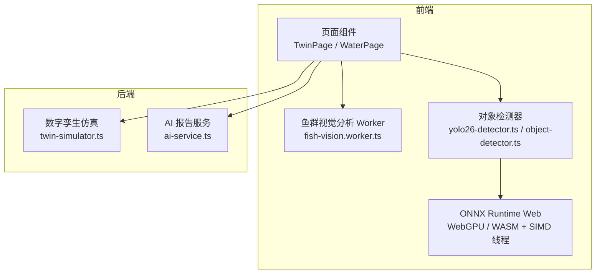
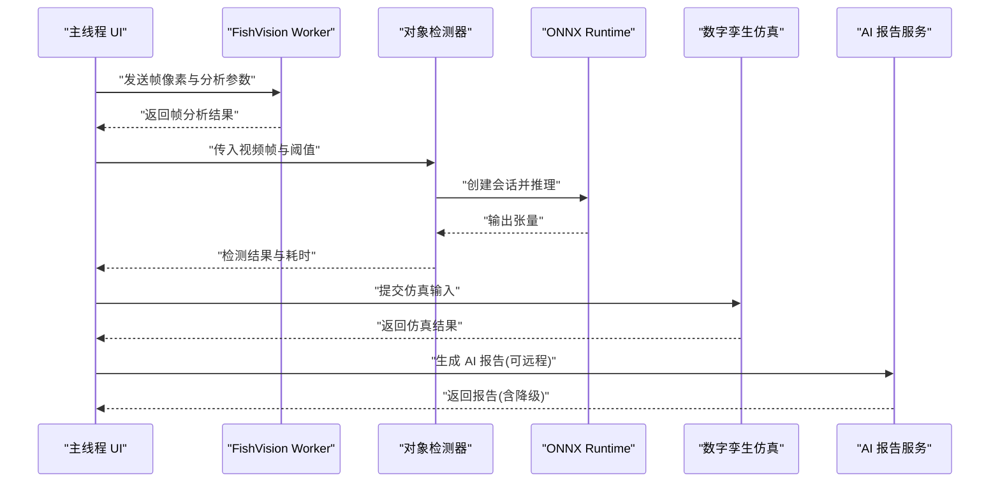
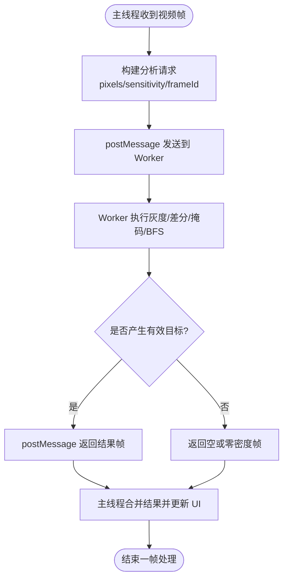
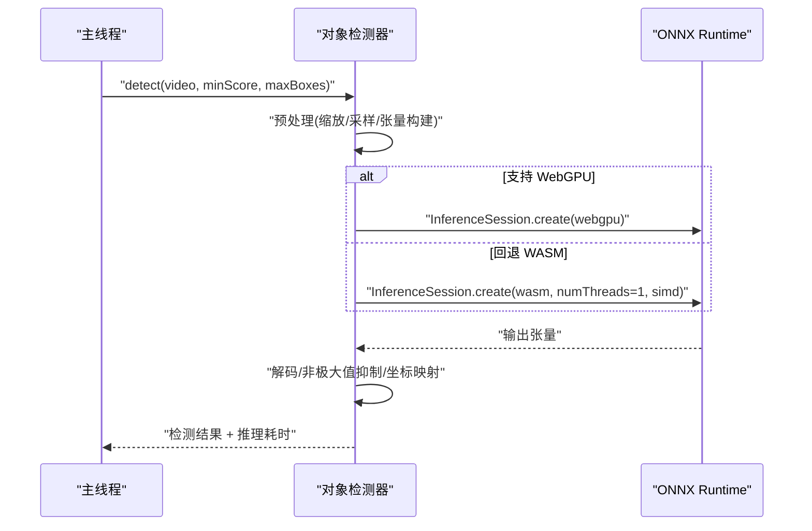
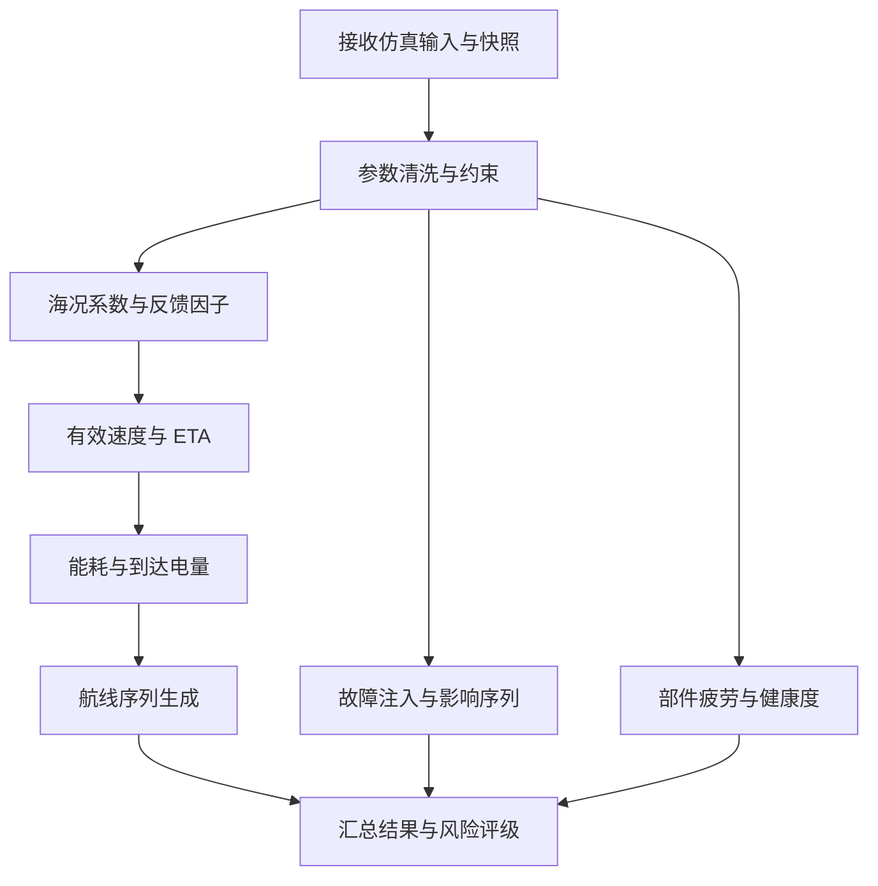
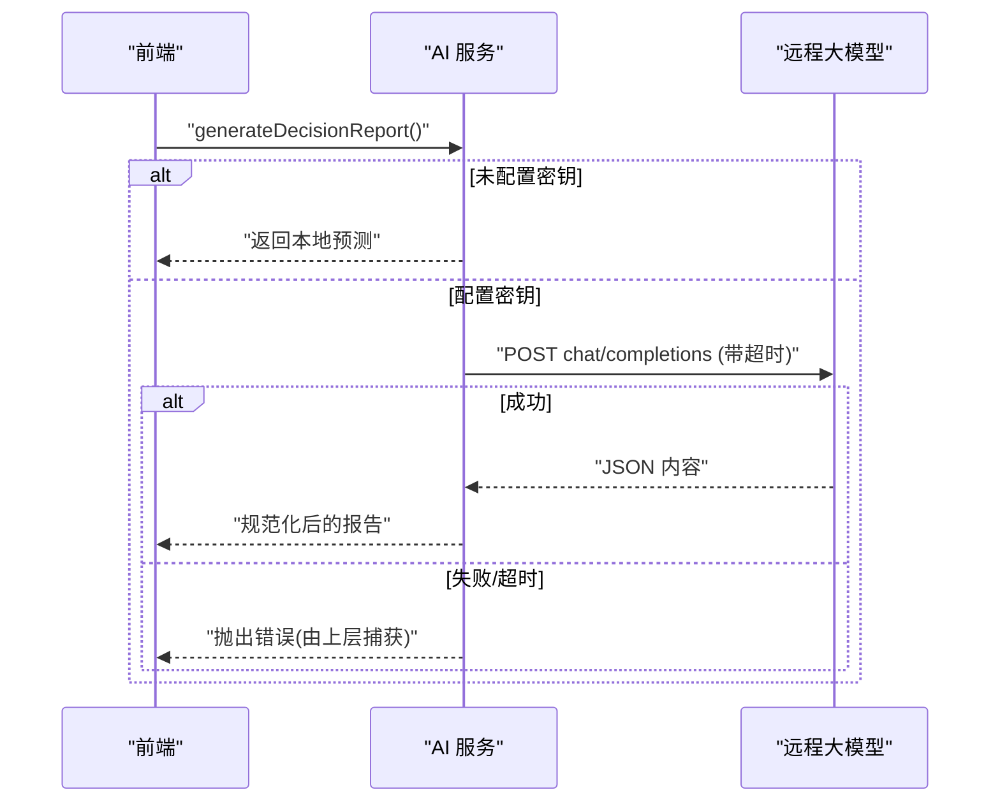
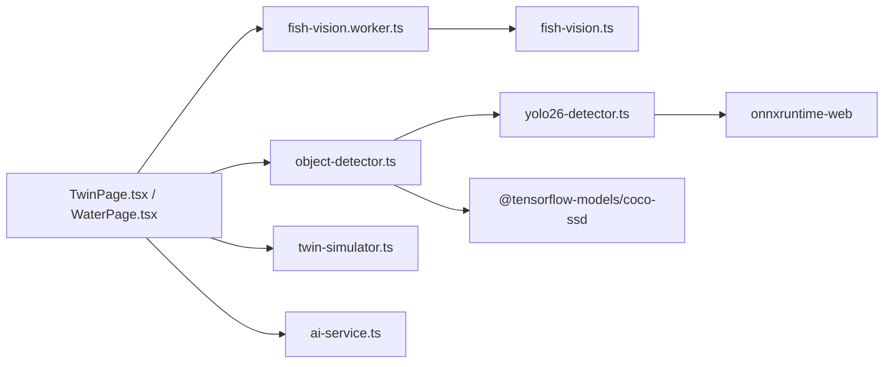

# 并行计算策略

<cite>
**本文引用的文件**   
- [fish-vision.worker.ts](file://fishery-digital-twin-platform/apps/frontend/src/lib/fish-vision.worker.ts)
- [fish-vision.ts](file://fishery-digital-twin-platform/apps/frontend/src/lib/fish-vision.ts)
- [yolo26-detector.ts](file://fishery-digital-twin-platform/apps/frontend/src/lib/yolo26-detector.ts)
- [object-detector.ts](file://fishery-digital-twin-platform/apps/frontend/src/lib/object-detector.ts)
- [twin-simulator.ts](file://fishery-digital-twin-platform/apps/backend/src/twin-simulator.ts)
- [ai-service.ts](file://fishery-digital-twin-platform/apps/backend/src/ai-service.ts)
- [TwinPage.tsx](file://fishery-digital-twin-platform/apps/frontend/src/components/dashboard/TwinPage.tsx)
- [WaterPage.tsx](file://fishery-digital-twin-platform/apps/frontend/src/components/dashboard/WaterPage.tsx)
</cite>

## 目录
1. [简介](#简介)
2. [项目结构](#项目结构)
3. [核心组件](#核心组件)
4. [架构总览](#架构总览)
5. [详细组件分析](#详细组件分析)
6. [依赖关系分析](#依赖关系分析)
7. [性能考量](#性能考量)
8. [故障排查指南](#故障排查指南)
9. [结论](#结论)
10. [附录](#附录)

## 简介
本文件面向数字孪生平台的并行计算策略，系统性梳理前端与后端的并行化实现：Web Workers 主从通信、数据分片与结果合并；多线程处理（Node.js Worker Threads 能力与 Promise 并发控制）；异步任务调度（优先级、资源竞争避免、错误恢复）；GPU 加速（WebGL/WebGPU、ONNX Runtime Web 的 SIMD 线程化、TensorFlow.js 推理）；以及典型并行场景示例（图像处理、数值计算、机器学习推理）。同时给出监控与调试方法，帮助定位性能瓶颈。

## 项目结构
本项目在前后端均采用了多种并行技术：
- 前端：使用 Web Worker 进行图像帧分析，将密集像素处理移出 UI 线程；通过 ONNX Runtime Web 选择 WebGPU 或 WASM 执行器，并启用 SIMD 与多线程；提供 YOLO 与 COCO-SSD 两种检测后端，自动回退。
- 后端：数字孪生仿真为 CPU 密集型计算，采用同步函数式实现；AI 报告生成支持本地统计与远程大模型调用，具备超时与降级机制。

图表来源
- [TwinPage.tsx:67-78](file://fishery-digital-twin-platform/apps/frontend/src/components/dashboard/TwinPage.tsx#L67-L78)
- [WaterPage.tsx:445-461](file://fishery-digital-twin-platform/apps/frontend/src/components/dashboard/WaterPage.tsx#L445-L461)
- [fish-vision.worker.ts:19-27](file://fishery-digital-twin-platform/apps/frontend/src/lib/fish-vision.worker.ts#L19-L27)
- [yolo26-detector.ts:147-186](file://fishery-digital-twin-platform/apps/frontend/src/lib/yolo26-detector.ts#L147-L186)
- [twin-simulator.ts:74-253](file://fishery-digital-twin-platform/apps/backend/src/twin-simulator.ts#L74-L253)
- [ai-service.ts:167-232](file://fishery-digital-twin-platform/apps/backend/src/ai-service.ts#L167-L232)

章节来源
- [TwinPage.tsx:67-78](file://fishery-digital-twin-platform/apps/frontend/src/components/dashboard/TwinPage.tsx#L67-L78)
- [WaterPage.tsx:445-461](file://fishery-digital-twin-platform/apps/frontend/src/components/dashboard/WaterPage.tsx#L445-L461)
- [fish-vision.worker.ts:19-27](file://fishery-digital-twin-platform/apps/frontend/src/lib/fish-vision.worker.ts#L19-L27)
- [yolo26-detector.ts:147-186](file://fishery-digital-twin-platform/apps/frontend/src/lib/yolo26-detector.ts#L147-L186)
- [twin-simulator.ts:74-253](file://fishery-digital-twin-platform/apps/backend/src/twin-simulator.ts#L74-L253)
- [ai-service.ts:167-232](file://fishery-digital-twin-platform/apps/backend/src/ai-service.ts#L167-L232)

## 核心组件
- Web Worker 图像分析：在主线程与 Worker 之间传递原始像素，Worker 内完成灰度转换、运动掩码、连通域分析与密度估计，结果返回主线程用于渲染与状态更新。
- 对象检测器：优先加载 YOLO26（ONNX），根据环境选择 WebGPU 或 WASM 执行器；WASM 路径下开启 SIMD 与多线程；失败时回退到 COCO-SSD（TensorFlow.js WebGL/CPU）。
- 数字孪生仿真：纯函数式计算，输入校验、海况修正、能耗与疲劳评估、风险分级与时间序列生成。
- AI 报告服务：本地统计+规则判断为主，可选远程大模型调用，带超时与降级。

章节来源
- [fish-vision.worker.ts:19-27](file://fishery-digital-twin-platform/apps/frontend/src/lib/fish-vision.worker.ts#L19-L27)
- [fish-vision.ts:41-223](file://fishery-digital-twin-platform/apps/frontend/src/lib/fish-vision.ts#L41-L223)
- [yolo26-detector.ts:147-263](file://fishery-digital-twin-platform/apps/frontend/src/lib/yolo26-detector.ts#L147-L263)
- [object-detector.ts:193-267](file://fishery-digital-twin-platform/apps/frontend/src/lib/object-detector.ts#L193-L267)
- [twin-simulator.ts:74-253](file://fishery-digital-twin-platform/apps/backend/src/twin-simulator.ts#L74-L253)
- [ai-service.ts:167-232](file://fishery-digital-twin-platform/apps/backend/src/ai-service.ts#L167-L232)

## 架构总览
前端并行链路：
- 视频流帧进入主线程后，构造请求消息发送至 Worker；Worker 执行密集像素处理，返回结构化结果；主线程负责 UI 渲染与状态管理。
- 对象检测流程中，YOLO 优先尝试 WebGPU 执行器，不可用时回退至 WASM；WASM 运行时配置 SIMD 与线程数，提升吞吐。

后端并行链路：
- 数字孪生仿真为单进程同步计算，适合短耗时、高确定性的工程估算。
- AI 报告生成可并行发起远程 API 调用，并通过 AbortSignal 设置超时，失败时回退到本地预测。

图表来源
- [fish-vision.worker.ts:19-27](file://fishery-digital-twin-platform/apps/frontend/src/lib/fish-vision.worker.ts#L19-L27)
- [yolo26-detector.ts:147-263](file://fishery-digital-twin-platform/apps/frontend/src/lib/yolo26-detector.ts#L147-L263)
- [twin-simulator.ts:74-253](file://fishery-digital-twin-platform/apps/backend/src/twin-simulator.ts#L74-L253)
- [ai-service.ts:167-232](file://fishery-digital-twin-platform/apps/backend/src/ai-service.ts#L167-L232)

## 详细组件分析

### Web Workers 主从通信与数据分片
- 主线程向 Worker 发送包含像素数组、灵敏度与帧 ID 的分析请求；Worker 内部维护状态（上一帧灰度图、平滑密度、保留观测），确保 BFS 洪水填充等密集计算不阻塞 UI。
- 结果以统一的消息格式返回，包含帧结果与帧 ID，便于主线程按序合并与展示。

图表来源
- [fish-vision.worker.ts:19-27](file://fishery-digital-twin-platform/apps/frontend/src/lib/fish-vision.worker.ts#L19-L27)
- [fish-vision.ts:41-223](file://fishery-digital-twin-platform/apps/frontend/src/lib/fish-vision.ts#L41-L223)

章节来源
- [fish-vision.worker.ts:19-27](file://fishery-digital-twin-platform/apps/frontend/src/lib/fish-vision.worker.ts#L19-L27)
- [fish-vision.ts:41-223](file://fishery-digital-twin-platform/apps/frontend/src/lib/fish-vision.ts#L41-L223)

### 对象检测并行化与 GPU 加速
- 执行器选择：若浏览器支持 WebGPU，则优先加载 WebGPU 执行器；否则回退到 WASM。WASM 模式下显式设置 SIMD 与线程数，利用多核提升吞吐。
- 预处理与推理：将视频帧缩放至固定尺寸，提取 RGB 通道并归一化为张量；运行推理后解码输出框，应用非极大值抑制，映射回原图坐标。
- 回退策略：当 YOLO 加载失败时，自动切换至 COCO-SSD（TensorFlow.js），并可选择 WebGL 或 CPU 后端。

图表来源
- [yolo26-detector.ts:147-263](file://fishery-digital-twin-platform/apps/frontend/src/lib/yolo26-detector.ts#L147-L263)
- [object-detector.ts:193-267](file://fishery-digital-twin-platform/apps/frontend/src/lib/object-detector.ts#L193-L267)

章节来源
- [yolo26-detector.ts:147-263](file://fishery-digital-twin-platform/apps/frontend/src/lib/yolo26-detector.ts#L147-L263)
- [object-detector.ts:193-267](file://fishery-digital-twin-platform/apps/frontend/src/lib/object-detector.ts#L193-L267)

### 数字孪生仿真（CPU 密集型计算）
- 输入清洗与约束：对航程、速度、海况、故障类型与严重度等进行边界裁剪与四舍五入。
- 核心计算：基于海况系数、电机功率与舵机跟踪误差计算有效速度与能耗；生成航线时间序列、故障影响序列与部件疲劳评估；综合健康度与下次检查间隔。
- 输出：包含置信度、风险等级、系列数据与数据来源说明。

图表来源
- [twin-simulator.ts:35-253](file://fishery-digital-twin-platform/apps/backend/src/twin-simulator.ts#L35-L253)

章节来源
- [twin-simulator.ts:35-253](file://fishery-digital-twin-platform/apps/backend/src/twin-simulator.ts#L35-L253)

### 异步任务调度与错误恢复（AI 报告）
- 本地预测作为基线，若配置了远程大模型密钥，则发起网络请求；通过 AbortSignal 设置超时，防止长时间阻塞。
- 响应解析与规范化：将外部 JSON 内容解析为统一结构，并对置信度等字段做范围限制；异常时抛出明确错误信息。
- 降级策略：当远程调用失败或未配置密钥时，直接返回本地预测结果，保证可用性。

图表来源
- [ai-service.ts:167-232](file://fishery-digital-twin-platform/apps/backend/src/ai-service.ts#L167-L232)

章节来源
- [ai-service.ts:167-232](file://fishery-digital-twin-platform/apps/backend/src/ai-service.ts#L167-L232)

### 前端页面中的并行调用与状态管理
- 数字孪生仿真：用户触发后，界面显示“模型计算中”，成功后渲染结果；失败时显示错误提示。
- 水质分析与演示：支持动画采集与图表渲染，演示模式与实时模式分离，避免相互干扰。

章节来源
- [TwinPage.tsx:67-78](file://fishery-digital-twin-platform/apps/frontend/src/components/dashboard/TwinPage.tsx#L67-L78)
- [WaterPage.tsx:88-127](file://fishery-digital-twin-platform/apps/frontend/src/components/dashboard/WaterPage.tsx#L88-L127)
- [WaterPage.tsx:445-461](file://fishery-digital-twin-platform/apps/frontend/src/components/dashboard/WaterPage.tsx#L445-L461)

## 依赖关系分析
- 前端依赖：
  - fish-vision.worker.ts 依赖 fish-vision.ts 提供的分析器与类型定义。
  - yolo26-detector.ts 依赖 onnxruntime-web，并根据环境动态导入 webgpu 或 wasm 模块。
  - object-detector.ts 提供统一的检测器接口与回退逻辑，封装 YOLO 与 COCO-SSD。
- 后端依赖：
  - twin-simulator.ts 依赖共享类型定义，执行纯函数式仿真。
  - ai-service.ts 依赖 mock-data 与 fetch API，支持环境变量控制远程模型。

图表来源
- [fish-vision.worker.ts:1-6](file://fishery-digital-twin-platform/apps/frontend/src/lib/fish-vision.worker.ts#L1-L6)
- [yolo26-detector.ts:1-5](file://fishery-digital-twin-platform/apps/frontend/src/lib/yolo26-detector.ts#L1-L5)
- [object-detector.ts:1-3](file://fishery-digital-twin-platform/apps/frontend/src/lib/object-detector.ts#L1-L3)
- [TwinPage.tsx:67-78](file://fishery-digital-twin-platform/apps/frontend/src/components/dashboard/TwinPage.tsx#L67-L78)
- [WaterPage.tsx:445-461](file://fishery-digital-twin-platform/apps/frontend/src/components/dashboard/WaterPage.tsx#L445-L461)

章节来源
- [fish-vision.worker.ts:1-6](file://fishery-digital-twin-platform/apps/frontend/src/lib/fish-vision.worker.ts#L1-L6)
- [yolo26-detector.ts:1-5](file://fishery-digital-twin-platform/apps/frontend/src/lib/yolo26-detector.ts#L1-L5)
- [object-detector.ts:1-3](file://fishery-digital-twin-platform/apps/frontend/src/lib/object-detector.ts#L1-L3)
- [TwinPage.tsx:67-78](file://fishery-digital-twin-platform/apps/frontend/src/components/dashboard/TwinPage.tsx#L67-L78)
- [WaterPage.tsx:445-461](file://fishery-digital-twin-platform/apps/frontend/src/components/dashboard/WaterPage.tsx#L445-L461)

## 性能考量
- 主线程保护：将像素级处理放入 Worker，避免 BFS 与邻域扫描阻塞 UI 渲染。
- GPU 加速：优先使用 WebGPU 执行器；不可用时使用 WASM 并启用 SIMD 与多线程，减少推理延迟。
- 回退机制：YOLO 加载失败时自动回退到 COCO-SSD，保障功能可用性与稳定性。
- 超时与降级：AI 报告远程调用设置超时，失败时返回本地预测，避免长时间等待。
- 内存与资源：检测器提供 dispose 方法释放会话；WASM 路径下合理设置线程数，避免过度占用 CPU。

[本节为通用指导，不直接分析具体文件]

## 故障排查指南
- Worker 无响应：检查主线程是否正确发送 analyze 消息与 frameId；确认 Worker 已正确监听 onmessage 并 postMessage 结果。
- 检测失败：查看 YOLO 加载日志与环境变量（如模型 URL、WASM 路径）；若 WebGPU 不可用，确认回退到 WASM；必要时切换到 COCO-SSD。
- 仿真错误：检查输入参数是否在约束范围内；确认设备快照与在线数量；核对海况与故障类型。
- AI 报告失败：检查远程 API 密钥与超时配置；捕获并记录错误信息；验证返回 JSON 结构与字段范围。

章节来源
- [fish-vision.worker.ts:19-27](file://fishery-digital-twin-platform/apps/frontend/src/lib/fish-vision.worker.ts#L19-L27)
- [yolo26-detector.ts:147-202](file://fishery-digital-twin-platform/apps/frontend/src/lib/yolo26-detector.ts#L147-L202)
- [twin-simulator.ts:35-50](file://fishery-digital-twin-platform/apps/backend/src/twin-simulator.ts#L35-L50)
- [ai-service.ts:174-232](file://fishery-digital-twin-platform/apps/backend/src/ai-service.ts#L174-L232)

## 结论
该数字孪生平台在前端通过 Web Workers 与 GPU 加速实现了高效的图像处理与机器学习推理，在后端通过纯函数式仿真与异步远程调用提供了稳定可靠的决策支持。整体设计强调主线程保护、执行器自适应、回退与降级策略，兼顾性能与鲁棒性。建议在生产环境中持续监控 Worker 负载、GPU 利用率与网络超时情况，结合性能分析工具定位瓶颈并优化。

[本节为总结性内容，不直接分析具体文件]

## 附录
- 并行计算示例
  - 图像处理并行化：将每帧像素转换为灰度、差分、掩码与连通域分析，全部在 Worker 中完成，主线程仅负责渲染与状态更新。
  - 数值计算并行化：数字孪生仿真的能耗、疲劳与风险计算为 CPU 密集型，可在后端扩展为多线程任务队列（例如 Node.js Worker Threads）以支持批量仿真。
  - 机器学习推理并行化：YOLO 推理在 ONNX Runtime 中执行，优先 WebGPU，其次 WASM 多线程；COCO-SSD 作为回退方案，支持 WebGL/CPU。
- 监控与调试
  - 使用 performance.now() 测量推理耗时与帧处理耗时。
  - 观察 Worker 消息频率与大小，避免频繁小消息导致开销过大。
  - 在浏览器开发者工具中查看 WebAssembly 与 WebGPU 使用情况，识别瓶颈。

[本节为补充说明，不直接分析具体文件]