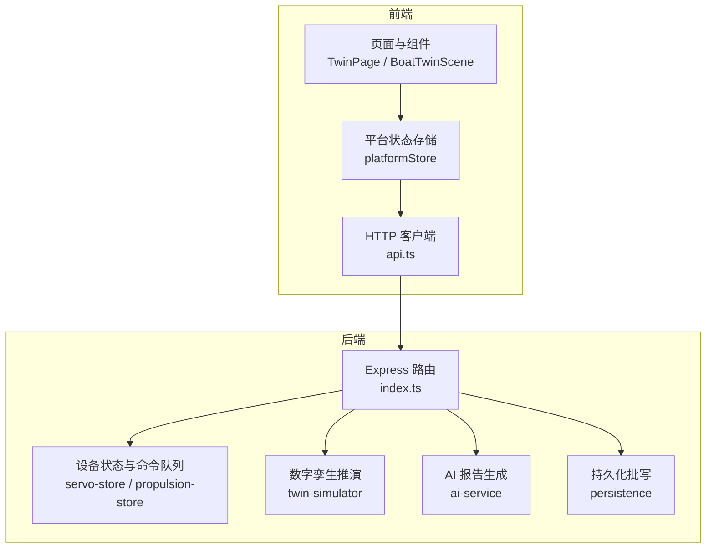
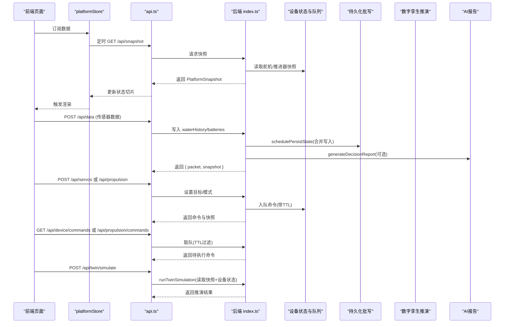
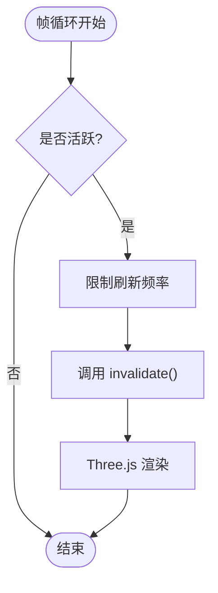
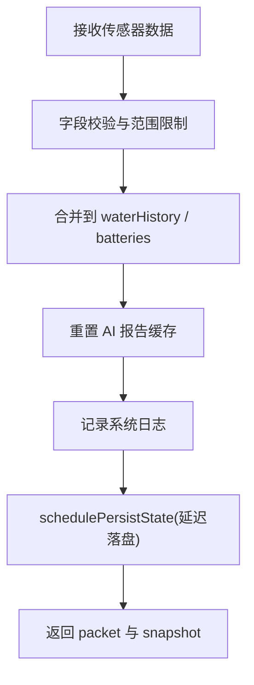
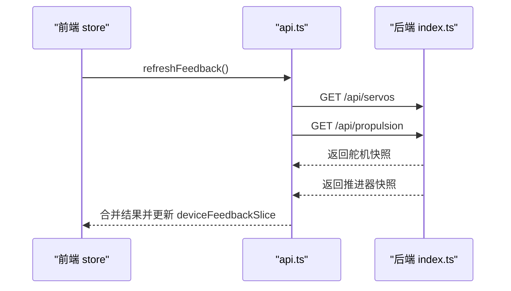
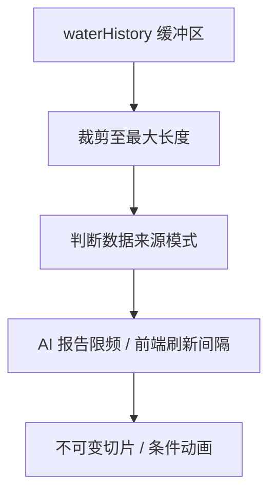
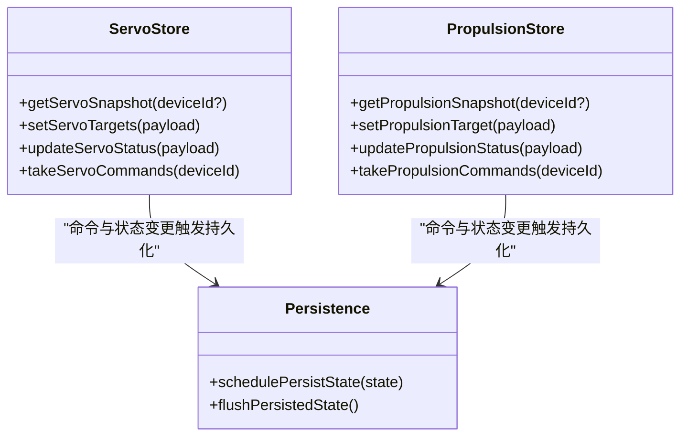
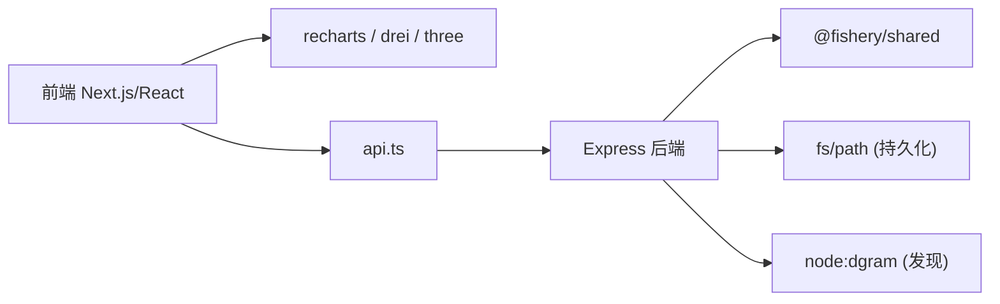

# 批处理技术

<cite>
**本文引用的文件**
- [index.ts](file://fishery-digital-twin-platform/apps/backend/src/index.ts)
- [persistence.ts](file://fishery-digital-twin-platform/apps/backend/src/persistence.ts)
- [servo-store.ts](file://fishery-digital-twin-platform/apps/backend/src/servo-store.ts)
- [propulsion-store.ts](file://fishery-digital-twin-platform/apps/backend/src/propulsion-store.ts)
- [ai-service.ts](file://fishery-digital-twin-platform/apps/backend/src/ai-service.ts)
- [twin-simulator.ts](file://fishery-digital-twin-platform/apps/backend/src/twin-simulator.ts)
- [platformStore.ts](file://fishery-digital-twin-platform/apps/frontend/src/lib/platformStore.ts)
- [usePlatformData.ts](file://fishery-digital-twin-platform/apps/frontend/src/hooks/usePlatformData.ts)
- [api.ts](file://fishery-digital-twin-platform/apps/frontend/src/lib/api.ts)
- [BoatTwinScene.tsx](file://fishery-digital-twin-platform/apps/frontend/src/components/three/BoatTwinScene.tsx)
- [TwinPage.tsx](file://fishery-digital-twin-platform/apps/frontend/src/components/dashboard/TwinPage.tsx)
</cite>

## 目录
1. [简介](#简介)
2. [项目结构](#项目结构)
3. [核心组件](#核心组件)
4. [架构总览](#架构总览)
5. [详细组件分析](#详细组件分析)
6. [依赖关系分析](#依赖关系分析)
7. [性能考量](#性能考量)
8. [故障排查指南](#故障排查指南)
9. [结论](#结论)
10. [附录](#附录)

## 简介
本文件面向数字孪生系统的“批处理优化”主题，围绕批量渲染、批量计算、批量网络请求与流式数据处理四个维度，结合仓库中的后端服务、前端状态管理、3D场景与仿真模块，给出可落地的实现思路与调优方法。文档既提供概念性说明，也通过具体代码路径定位到系统中的相关实现位置，便于读者对照源码理解并扩展。

## 项目结构
系统由前后端组成：
- 后端（Node/Express）提供平台快照、设备控制、AI报告、数字孪生推演等接口，并在内存中维护水质历史、电池、日志、舵机与推进器状态，同时具备命令队列与持久化批写能力。
- 前端（Next.js + React Three Fiber）负责数据拉取、状态聚合、3D场景渲染与用户交互，采用集中式 store 与定时器进行周期性刷新。

**图表来源**
- [index.ts:56-110](file://fishery-digital-twin-platform/apps/backend/src/index.ts#L56-L110)
- [platformStore.ts:20-65](file://fishery-digital-twin-platform/apps/frontend/src/lib/platformStore.ts#L20-L65)
- [api.ts:6-24](file://fishery-digital-twin-platform/apps/frontend/src/lib/api.ts#L6-L24)

**章节来源**
- [index.ts:56-110](file://fishery-digital-twin-platform/apps/backend/src/index.ts#L56-L110)
- [platformStore.ts:20-65](file://fishery-digital-twin-platform/apps/frontend/src/lib/platformStore.ts#L20-L65)
- [api.ts:6-24](file://fishery-digital-twin-platform/apps/frontend/src/lib/api.ts#L6-L24)

## 核心组件
- 后端服务入口与路由：统一鉴权、CORS、限流与错误处理；暴露快照、传感器数据、设备控制、AI报告、数字孪生推演等接口。
- 设备状态与命令队列：舵机与推进器各自维护设备状态与命令队列，支持按设备ID查询与消费，带TTL过期清理。
- 持久化批写：将高频写入合并为定时批量落盘，降低磁盘IO压力。
- 前端状态与刷新：集中式 store 以固定周期轮询平台快照与设备反馈，使用 useSyncExternalStore 避免多余重渲染。
- 3D场景渲染：基于 React Three Fiber 的帧循环与自适应刷新，减少无效绘制。
- 数字孪生推演与AI报告：对当前快照与设备反馈进行离线计算，输出航线预测、故障推演与疲劳损耗评估。

**章节来源**
- [index.ts:112-129](file://fishery-digital-twin-platform/apps/backend/src/index.ts#L112-L129)
- [servo-store.ts:17-18](file://fishery-digital-twin-platform/apps/backend/src/servo-store.ts#L17-L18)
- [propulsion-store.ts:30-31](file://fishery-digital-twin-platform/apps/backend/src/propulsion-store.ts#L30-L31)
- [persistence.ts:51-58](file://fishery-digital-twin-platform/apps/backend/src/persistence.ts#L51-L58)
- [platformStore.ts:20-65](file://fishery-digital-twin-platform/apps/frontend/src/lib/platformStore.ts#L20-L65)
- [BoatTwinScene.tsx:128-151](file://fishery-digital-twin-platform/apps/frontend/src/components/three/BoatTwinScene.tsx#L128-L151)
- [twin-simulator.ts:74-253](file://fishery-digital-twin-platform/apps/backend/src/twin-simulator.ts#L74-L253)
- [ai-service.ts:167-232](file://fishery-digital-twin-platform/apps/backend/src/ai-service.ts#L167-L232)

## 架构总览
下图展示从前端触发到后端批处理的关键流程：前端定时拉取快照与设备反馈，后端在接收传感器数据时合并写入历史并触发AI报告与持久化批写；设备控制命令进入队列后由消费端按TTL取出执行；数字孪生推演读取快照与设备状态进行离线计算。

**图表来源**
- [platformStore.ts:98-139](file://fishery-digital-twin-platform/apps/frontend/src/lib/platformStore.ts#L98-L139)
- [api.ts:26-100](file://fishery-digital-twin-platform/apps/frontend/src/lib/api.ts#L26-L100)
- [index.ts:336-557](file://fishery-digital-twin-platform/apps/backend/src/index.ts#L336-L557)
- [servo-store.ts:106-183](file://fishery-digital-twin-platform/apps/backend/src/servo-store.ts#L106-L183)
- [propulsion-store.ts:166-318](file://fishery-digital-twin-platform/apps/backend/src/propulsion-store.ts#L166-L318)
- [persistence.ts:51-58](file://fishery-digital-twin-platform/apps/backend/src/persistence.ts#L51-L58)
- [twin-simulator.ts:74-253](file://fishery-digital-twin-platform/apps/backend/src/twin-simulator.ts#L74-L253)
- [ai-service.ts:167-232](file://fishery-digital-twin-platform/apps/backend/src/ai-service.ts#L167-L232)

## 详细组件分析

### 批量渲染技术（Canvas/3D场景与UI组件）
- 3D场景帧率控制：通过 SceneTicker 限制 invalidate 频率，避免每帧强制重绘，降低GPU压力。
- 按需更新：仅在设备在线且功率超过阈值时驱动旋转或动画，减少无意义计算。
- 数据切片与稳定引用：前端 store 将快照与设备反馈拆分为独立切片，使用 useSyncExternalStore 比较 Object.is，避免无关数据变化导致的全局重渲染。
- 可视化图表关闭动画：图表组件禁用 isAnimationActive，减少频繁重绘。

**图表来源**
- [BoatTwinScene.tsx:128-151](file://fishery-digital-twin-platform/apps/frontend/src/components/three/BoatTwinScene.tsx#L128-L151)
- [BoatTwinScene.tsx:352-379](file://fishery-digital-twin-platform/apps/frontend/src/components/three/BoatTwinScene.tsx#L352-L379)
- [platformStore.ts:53-96](file://fishery-digital-twin-platform/apps/frontend/src/lib/platformStore.ts#L53-L96)
- [TwinPage.tsx:295-309](file://fishery-digital-twin-platform/apps/frontend/src/components/dashboard/TwinPage.tsx#L295-L309)

**章节来源**
- [BoatTwinScene.tsx:128-151](file://fishery-digital-twin-platform/apps/frontend/src/components/three/BoatTwinScene.tsx#L128-L151)
- [BoatTwinScene.tsx:352-379](file://fishery-digital-twin-platform/apps/frontend/src/components/three/BoatTwinScene.tsx#L352-L379)
- [platformStore.ts:53-96](file://fishery-digital-twin-platform/apps/frontend/src/lib/platformStore.ts#L53-L96)
- [TwinPage.tsx:295-309](file://fishery-digital-twin-platform/apps/frontend/src/components/dashboard/TwinPage.tsx#L295-L309)

### 批量计算处理（传感器数据聚合、状态同步批处理、计算任务合并）
- 传感器数据聚合：后端接收传感器数据后，合并到 waterHistory 并更新 batteries，同时重置AI报告缓存，保证后续报告基于最新数据。
- 状态同步批处理：设备状态（舵机/推进器）在内存中维护，快照接口聚合多设备状态一次性返回，减少多次往返。
- 计算任务合并：AI报告生成限制每分钟一次，避免频繁外部API调用；数字孪生推演读取快照与设备状态进行离线计算，不直接下发控制命令。

**图表来源**
- [index.ts:367-430](file://fishery-digital-twin-platform/apps/backend/src/index.ts#L367-L430)
- [persistence.ts:51-58](file://fishery-digital-twin-platform/apps/backend/src/persistence.ts#L51-L58)
- [ai-service.ts:167-232](file://fishery-digital-twin-platform/apps/backend/src/ai-service.ts#L167-L232)
- [twin-simulator.ts:74-253](file://fishery-digital-twin-platform/apps/backend/src/twin-simulator.ts#L74-L253)

**章节来源**
- [index.ts:367-430](file://fishery-digital-twin-platform/apps/backend/src/index.ts#L367-L430)
- [persistence.ts:51-58](file://fishery-digital-twin-platform/apps/backend/src/persistence.ts#L51-L58)
- [ai-service.ts:167-232](file://fishery-digital-twin-platform/apps/backend/src/ai-service.ts#L167-L232)
- [twin-simulator.ts:74-253](file://fishery-digital-twin-platform/apps/backend/src/twin-simulator.ts#L74-L253)

### 批量网络请求优化（HTTP请求合并、WebSocket消息批处理、API调用节流）
- HTTP请求合并：前端 store 使用 Promise.allSettled 并行获取舵机与推进器快照，提升吞吐；每次只更新对应切片，避免全局重渲染。
- WebSocket消息批处理：当前仓库未实现WebSocket，建议未来在设备侧将高频遥测打包为批次消息，服务端按时间窗口聚合后再推送。
- API调用节流：AI报告生成限制每分钟一次；前端定时器统一控制快照与反馈刷新间隔，避免过载。

**图表来源**
- [platformStore.ts:116-130](file://fishery-digital-twin-platform/apps/frontend/src/lib/platformStore.ts#L116-L130)
- [api.ts:52-72](file://fishery-digital-twin-platform/apps/frontend/src/lib/api.ts#L52-L72)
- [index.ts:475-538](file://fishery-digital-twin-platform/apps/backend/src/index.ts#L475-L538)

**章节来源**
- [platformStore.ts:116-130](file://fishery-digital-twin-platform/apps/frontend/src/lib/platformStore.ts#L116-L130)
- [api.ts:52-72](file://fishery-digital-twin-platform/apps/frontend/src/lib/api.ts#L52-L72)
- [index.ts:475-538](file://fishery-digital-twin-platform/apps/backend/src/index.ts#L475-L538)

### 流式数据处理（数据流缓冲、背压处理、内存优化）
- 数据流缓冲：waterHistory 保持最近 N 条记录，防止无限增长；演示数据与真实数据混合时自动切换数据模式。
- 背压处理：AI报告生成限频；前端定时器控制刷新频率；设备命令队列带TTL，避免堆积。
- 内存优化：store 使用不可变切片替换，减少无用渲染；3D场景仅对活跃部件执行动画逻辑。

**图表来源**
- [index.ts:78-99](file://fishery-digital-twin-platform/apps/backend/src/index.ts#L78-L99)
- [index.ts:178-195](file://fishery-digital-twin-platform/apps/backend/src/index.ts#L178-L195)
- [index.ts:456-473](file://fishery-digital-twin-platform/apps/backend/src/index.ts#L456-L473)
- [platformStore.ts:20-65](file://fishery-digital-twin-platform/apps/frontend/src/lib/platformStore.ts#L20-L65)
- [BoatTwinScene.tsx:352-379](file://fishery-digital-twin-platform/apps/frontend/src/components/three/BoatTwinScene.tsx#L352-L379)

**章节来源**
- [index.ts:78-99](file://fishery-digital-twin-platform/apps/backend/src/index.ts#L78-L99)
- [index.ts:178-195](file://fishery-digital-twin-platform/apps/backend/src/index.ts#L178-L195)
- [index.ts:456-473](file://fishery-digital-twin-platform/apps/backend/src/index.ts#L456-L473)
- [platformStore.ts:20-65](file://fishery-digital-twin-platform/apps/frontend/src/lib/platformStore.ts#L20-L65)
- [BoatTwinScene.tsx:352-379](file://fishery-digital-twin-platform/apps/frontend/src/components/three/BoatTwinScene.tsx#L352-L379)

### 批处理实现示例
- 设备命令批量发送：舵机与推进器命令入队，消费端按设备ID取出并过滤TTL，适合批量下发给ESP32。
- 数据查询批量执行：前端并行获取舵机与推进器快照，合并后更新设备反馈切片。
- 日志记录批量写入：系统日志追加后触发 schedulePersistState，延迟落盘减少IO。

**图表来源**
- [servo-store.ts:89-183](file://fishery-digital-twin-platform/apps/backend/src/servo-store.ts#L89-L183)
- [propulsion-store.ts:149-318](file://fishery-digital-twin-platform/apps/backend/src/propulsion-store.ts#L149-L318)
- [persistence.ts:51-68](file://fishery-digital-twin-platform/apps/backend/src/persistence.ts#L51-L68)

**章节来源**
- [servo-store.ts:89-183](file://fishery-digital-twin-platform/apps/backend/src/servo-store.ts#L89-L183)
- [propulsion-store.ts:149-318](file://fishery-digital-twin-platform/apps/backend/src/propulsion-store.ts#L149-L318)
- [persistence.ts:51-68](file://fishery-digital-twin-platform/apps/backend/src/persistence.ts#L51-L68)

## 依赖关系分析
- 前端依赖：Next.js、React、Recharts、React Three Fiber/Drei、Three.js。
- 后端依赖：Express、cors、dotenv、node:dgram（UDP发现）、node:crypto、fs/path（持久化）。
- 共享类型：@fishery/shared 定义平台快照、设备状态、AI报告等数据结构。

**图表来源**
- [package.json](file://fishery-digital-twin-platform/apps/frontend/package.json)
- [package.json](file://fishery-digital-twin-platform/apps/backend/package.json)
- [index.ts:1-21](file://fishery-digital-twin-platform/apps/backend/src/index.ts#L1-L21)

**章节来源**
- [index.ts:1-21](file://fishery-digital-twin-platform/apps/backend/src/index.ts#L1-L21)

## 性能考量
- 吞吐量分析：通过并行获取设备快照、限制AI报告频率、批量持久化落盘，提高整体吞吐。
- 延迟优化：前端定时器统一刷新节奏；3D场景限制帧率；设备命令队列TTL避免陈旧命令影响实时性。
- 资源利用率监控：关注CPU/GPU占用（3D场景动画）、内存增长（waterHistory长度）、磁盘IO（持久化频率）。

[本节为通用指导，不直接分析具体文件]

## 故障排查指南
- CORS与鉴权：CORS配置不当会导致跨域失败；LAN控制需携带X-UISYS-Token，否则返回401/503。
- 设备离线：舵机/推进器命令要求设备在线，否则抛出错误不入队。
- 持久化失败：文件系统权限或路径问题会导致状态无法保存，检查日志与异常信息。
- 3D渲染卡顿：检查SceneTicker频率与动画条件，确保仅在必要时更新。

**章节来源**
- [index.ts:101-157](file://fishery-digital-twin-platform/apps/backend/src/index.ts#L101-L157)
- [servo-store.ts:106-153](file://fishery-digital-twin-platform/apps/backend/src/servo-store.ts#L106-L153)
- [propulsion-store.ts:166-231](file://fishery-digital-twin-platform/apps/backend/src/propulsion-store.ts#L166-L231)
- [persistence.ts:17-30](file://fishery-digital-twin-platform/apps/backend/src/persistence.ts#L17-L30)
- [BoatTwinScene.tsx:128-151](file://fishery-digital-twin-platform/apps/frontend/src/components/three/BoatTwinScene.tsx#L128-L151)

## 结论
该数字孪生系统在多个层面实现了批处理优化：前端通过定时器与并行请求减少网络与渲染压力；后端通过命令队列、持久化批写与计算限频提升吞吐与稳定性；3D场景通过帧率控制与条件动画降低GPU负载。建议在后续演进中引入WebSocket消息批处理与更细粒度的背压机制，以进一步提升高并发下的系统表现。

[本节为总结性内容，不直接分析具体文件]

## 附录
- 关键接口路径参考：
  - 平台快照：GET /api/snapshot
  - 传感器数据：POST /api/data
  - 舵机控制：POST /api/servos；命令消费：GET /api/device/commands
  - 推进器控制：POST /api/propulsion；命令消费：GET /api/propulsion/commands
  - AI报告：GET/POST /api/ai/report
  - 数字孪生推演：POST /api/twin/simulate

**章节来源**
- [index.ts:322-557](file://fishery-digital-twin-platform/apps/backend/src/index.ts#L322-L557)
- [api.ts:26-100](file://fishery-digital-twin-platform/apps/frontend/src/lib/api.ts#L26-L100)