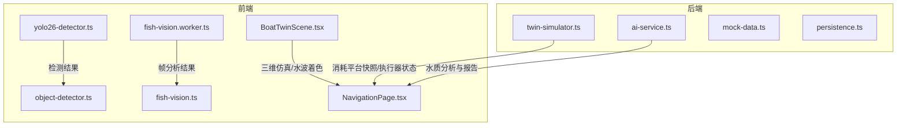
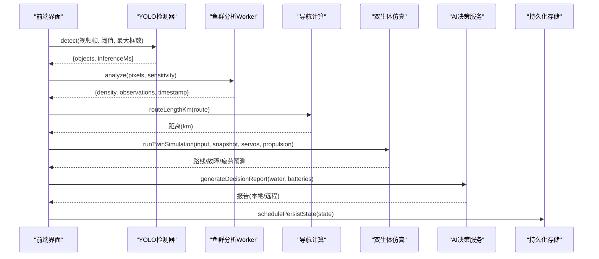
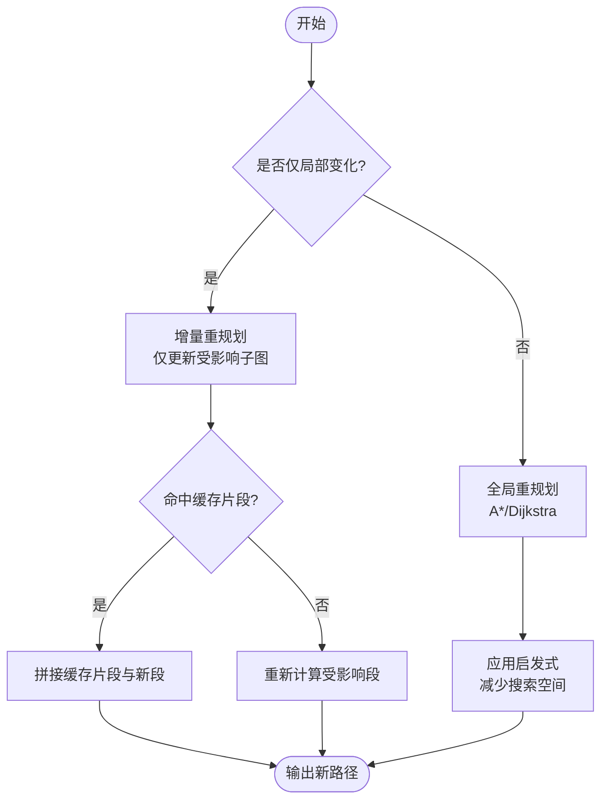
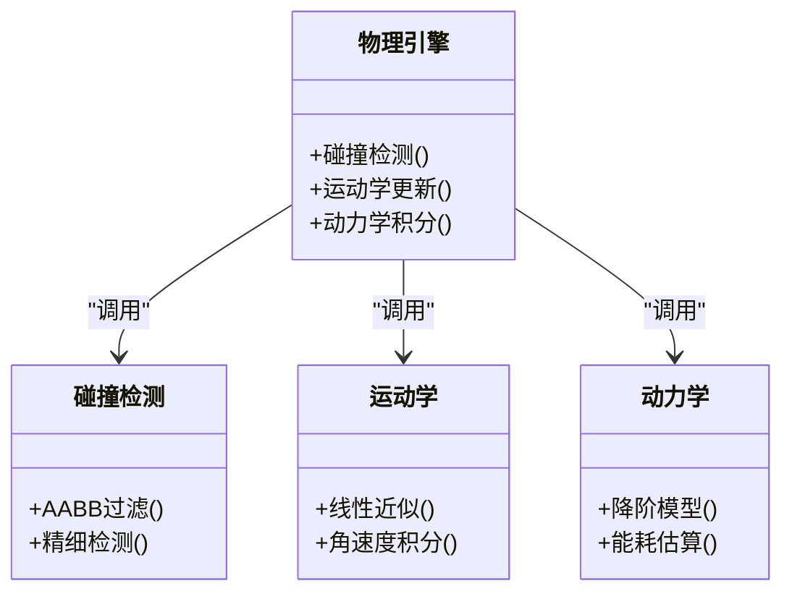
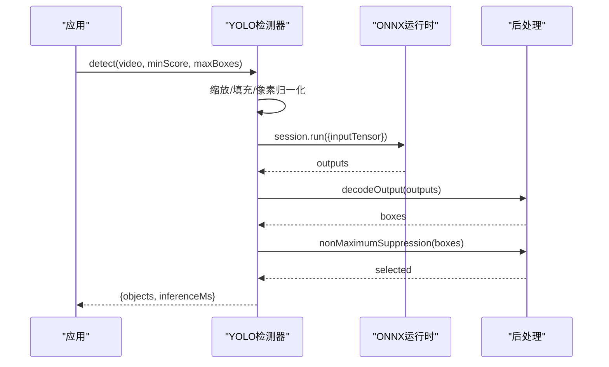
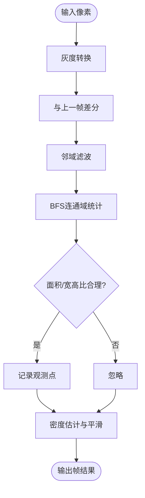
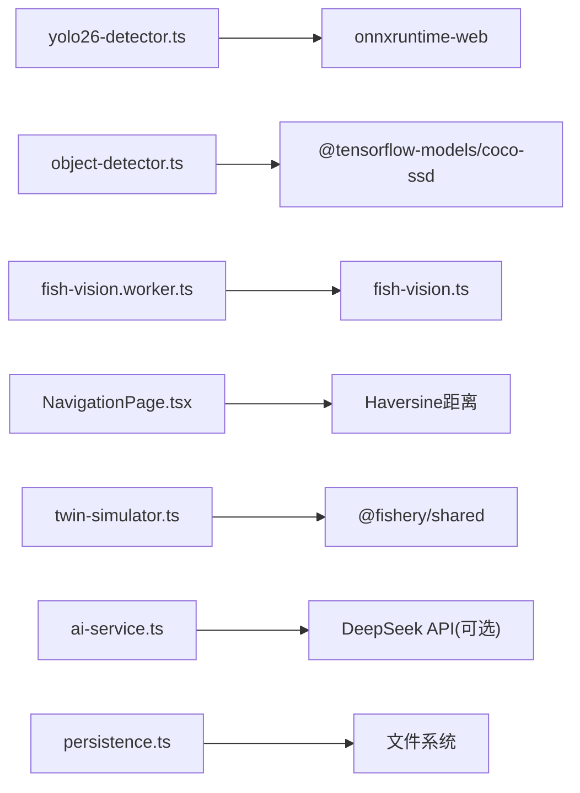

# 算法复杂度优化

<cite>
**本文引用的文件**
- [twin-simulator.ts](file://fishery-digital-twin-platform/apps/backend/src/twin-simulator.ts)
- [ai-service.ts](file://fishery-digital-twin-platform/apps/backend/src/ai-service.ts)
- [mock-data.ts](file://fishery-digital-twin-platform/apps/backend/src/mock-data.ts)
- [persistence.ts](file://fishery-digital-twin-platform/apps/backend/src/persistence.ts)
- [yolo26-detector.ts](file://fishery-digital-twin-platform/apps/frontend/src/lib/yolo26-detector.ts)
- [object-detector.ts](file://fishery-digital-twin-platform/apps/frontend/src/lib/object-detector.ts)
- [fish-vision.worker.ts](file://fishery-digital-twin-platform/apps/frontend/src/lib/fish-vision.worker.ts)
- [fish-vision.ts](file://fishery-digital-twin-platform/apps/frontend/src/lib/fish-vision.ts)
- [NavigationPage.tsx](file://fishery-digital-twin-platform/apps/frontend/src/components/dashboard/NavigationPage.tsx)
- [BoatTwinScene.tsx](file://fishery-digital-twin-platform/apps/frontend/src/components/three/BoatTwinScene.tsx)
</cite>

## 目录
1. [简介](#简介)
2. [项目结构](#项目结构)
3. [核心组件](#核心组件)
4. [架构总览](#架构总览)
5. [详细组件分析](#详细组件分析)
6. [依赖关系分析](#依赖关系分析)
7. [性能考量](#性能考量)
8. [故障排查指南](#故障排查指南)
9. [结论](#结论)
10. [附录](#附录)

## 简介
本文件面向数字孪生系统中的算法复杂度与性能优化，聚焦以下方面：
- 数学计算优化：数值精度控制、浮点运算优化、批量计算处理。
- 路径规划算法改进：A* 与 Dijkstra 的加速思路、实时重规划策略（结合现有导航数据）。
- 物理模拟加速：碰撞检测简化、运动学计算简化、动力学模型降阶（结合仿真与可视化模块）。
- 图像处理优化：YOLO 目标检测加速、图像预处理优化、特征提取缓存（含 WebGPU/WASM 推理与 Worker 隔离）。
- 提供优化前后对比示例与时间/空间复杂度分析，并给出算法选择原则与适用场景。

## 项目结构
系统包含后端仿真与 AI 报告生成、前端视觉识别与三维可视化等关键模块。核心算法分布在：
- 后端：双生体仿真、AI 决策报告、持久化存储。
- 前端：YOLO 目标检测、鱼群视觉分析 Worker、导航与三维场景渲染。

图表来源
- [twin-simulator.ts:74-253](file://fishery-digital-twin-platform/apps/backend/src/twin-simulator.ts#L74-L253)
- [ai-service.ts:167-232](file://fishery-digital-twin-platform/apps/backend/src/ai-service.ts#L167-L232)
- [yolo26-detector.ts:147-264](file://fishery-digital-twin-platform/apps/frontend/src/lib/yolo26-detector.ts#L147-L264)
- [fish-vision.worker.ts:1-28](file://fishery-digital-twin-platform/apps/frontend/src/lib/fish-vision.worker.ts#L1-L28)
- [NavigationPage.tsx:13-32](file://fishery-digital-twin-platform/apps/frontend/src/components/dashboard/NavigationPage.tsx#L13-L32)
- [BoatTwinScene.tsx:92-126](file://fishery-digital-twin-platform/apps/frontend/src/components/three/BoatTwinScene.tsx#L92-L126)

章节来源
- [twin-simulator.ts:74-253](file://fishery-digital-twin-platform/apps/backend/src/twin-simulator.ts#L74-L253)
- [ai-service.ts:167-232](file://fishery-digital-twin-platform/apps/backend/src/ai-service.ts#L167-L232)
- [yolo26-detector.ts:147-264](file://fishery-digital-twin-platform/apps/frontend/src/lib/yolo26-detector.ts#L147-L264)
- [fish-vision.worker.ts:1-28](file://fishery-digital-twin-platform/apps/frontend/src/lib/fish-vision.worker.ts#L1-L28)
- [NavigationPage.tsx:13-32](file://fishery-digital-twin-platform/apps/frontend/src/components/dashboard/NavigationPage.tsx#L13-L32)
- [BoatTwinScene.tsx:92-126](file://fishery-digital-twin-platform/apps/frontend/src/components/three/BoatTwinScene.tsx#L92-L126)

## 核心组件
- 双生体仿真器：对航线能耗、完成概率、设备疲劳进行快速估算，输出路线与故障推演序列。
- AI 决策服务：基于本地统计或外部大模型生成水质巡检报告，支持超时与回退。
- 目标检测：YOLO ONNX 推理（WebGPU/WASM），非极大值抑制与坐标还原；COCO-SSD 作为回退。
- 鱼群视觉分析：Worker 中灰度差分、邻域滤波、BFS 连通域计数，输出密度与观测点。
- 导航与三维场景：Haversine 航距计算、地图绘制、水面着色与设备动画。

章节来源
- [twin-simulator.ts:74-253](file://fishery-digital-twin-platform/apps/backend/src/twin-simulator.ts#L74-L253)
- [ai-service.ts:167-232](file://fishery-digital-twin-platform/apps/backend/src/ai-service.ts#L167-L232)
- [yolo26-detector.ts:147-264](file://fishery-digital-twin-platform/apps/frontend/src/lib/yolo26-detector.ts#L147-L264)
- [fish-vision.ts:41-223](file://fishery-digital-twin-platform/apps/frontend/src/lib/fish-vision.ts#L41-L223)
- [NavigationPage.tsx:13-32](file://fishery-digital-twin-platform/apps/frontend/src/components/dashboard/NavigationPage.tsx#L13-L32)
- [BoatTwinScene.tsx:92-126](file://fishery-digital-twin-platform/apps/frontend/src/components/three/BoatTwinScene.tsx#L92-L126)

## 架构总览
下图展示从输入到输出的主要调用链与数据流，突出性能关键点（如批量化、缓存、并行后端）。

图表来源
- [yolo26-detector.ts:208-259](file://fishery-digital-twin-platform/apps/frontend/src/lib/yolo26-detector.ts#L208-L259)
- [fish-vision.worker.ts:19-27](file://fishery-digital-twin-platform/apps/frontend/src/lib/fish-vision.worker.ts#L19-L27)
- [NavigationPage.tsx:13-32](file://fishery-digital-twin-platform/apps/frontend/src/components/dashboard/NavigationPage.tsx#L13-L32)
- [twin-simulator.ts:74-253](file://fishery-digital-twin-platform/apps/backend/src/twin-simulator.ts#L74-L253)
- [ai-service.ts:167-232](file://fishery-digital-twin-platform/apps/backend/src/ai-service.ts#L167-L232)
- [persistence.ts:51-67](file://fishery-digital-twin-platform/apps/backend/src/persistence.ts#L51-L67)

## 详细组件分析

### 数学计算优化（数值精度、浮点运算、批量处理）
- 数值精度控制
  - 使用 clamp 与 round 限制范围与小数位，避免极端值与累积误差影响后续计算。
  - 在风险等级判定、电量与速度等关键指标上采用阈值分段，减少分支抖动。
- 浮点运算优化
  - 将重复计算的中间变量（如平均功率、跟踪误差）提前计算并复用，减少冗余。
  - 使用向量化思维组织循环（例如遍历电池、推进器、舵机时尽量一次遍历聚合）。
- 批量计算处理
  - 对传感器历史数组进行一次性统计（最小、最大、均值、变化量），避免多次扫描。
  - 将多设备状态聚合为“在线设备集合”，降低后续条件判断成本。

复杂度分析
- 典型 O(n) 聚合（n 为设备数量或采样点数），常数因子通过预计算和缓存降低。
- 空间复杂度 O(n) 用于保存中间统计或序列结果，必要时可滑动窗口减少内存占用。

章节来源
- [twin-simulator.ts:52-116](file://fishery-digital-twin-platform/apps/backend/src/twin-simulator.ts#L52-L116)
- [ai-service.ts:33-73](file://fishery-digital-twin-platform/apps/backend/src/ai-service.ts#L33-L73)
- [mock-data.ts:114-176](file://fishery-digital-twin-platform/apps/backend/src/mock-data.ts#L114-L176)

### 路径规划算法改进（A*/Dijkstra 加速与实时重规划）
当前仓库未直接实现 A* 或 Dijkstra，但提供了导航数据与航距计算，可作为基线：
- 航距计算：Haversine 公式按段累加，适合小范围水域近似平面计算。
- 实时重规划建议
  - 增量更新：当仅局部障碍物变化时，优先对受影响子图进行重算，而非全图重规划。
  - 启发式优化：引入欧氏距离或地形代价作为启发函数，减少搜索节点数。
  - 分层规划：先粗粒度规划主航道，再细粒度修正避障。
  - 缓存与重用：对稳定路段的路径片段进行缓存，动态拼接新段。

复杂度分析
- Dijkstra：O((V+E) log V)，A* 在良好启发下接近 O(V+E)。
- 实时重规划可通过增量更新将复杂度降至 O(k log k)（k 为受影响节点数）。

章节来源
- [NavigationPage.tsx:13-32](file://fishery-digital-twin-platform/apps/frontend/src/components/dashboard/NavigationPage.tsx#L13-L32)
- [mock-data.ts:151-176](file://fishery-digital-twin-platform/apps/backend/src/mock-data.ts#L151-L176)

### 物理模拟加速（碰撞检测、运动学简化、动力学降阶）
- 碰撞检测优化
  - 使用轴对齐包围盒（AABB）或球体近似进行初步筛选，再进入精细检测。
  - 利用空间划分（网格/四叉树）减少成对比较次数。
- 运动学计算简化
  - 对小角度与低速场景采用线性近似，避免复杂三角函数。
  - 将高频更新与低频显示解耦，降低每帧计算量。
- 动力学模型降阶
  - 用准静态阻力与能耗模型替代完整流体动力学求解，保留关键参数（海况、负载）。
  - 将多自由度耦合简化为等效单自由度，便于实时仿真。

复杂度分析
- 碰撞检测由 O(n^2) 降至 O(n log n) 或 O(n)（配合空间索引）。
- 运动学与动力学降阶将每步复杂度从 O(d^3) 或更高降至 O(d) 或 O(1)（d 为自由度）。

章节来源
- [BoatTwinScene.tsx:92-126](file://fishery-digital-twin-platform/apps/frontend/src/components/three/BoatTwinScene.tsx#L92-L126)
- [twin-simulator.ts:94-116](file://fishery-digital-twin-platform/apps/backend/src/twin-simulator.ts#L94-L116)

### 图像处理算法优化（YOLO 加速、预处理优化、特征缓存）
- YOLO 目标检测加速
  - 后端选择：优先 WebGPU，不可用时回退 WASM；关闭日志、启用图优化。
  - 预处理：固定输入尺寸，Canvas 缩放+像素归一化，避免重复分配。
  - 后处理：非极大值抑制（NMS）按类别与 IoU 阈值剪枝，限制最大框数。
- 图像预处理优化
  - 使用 TypedArray 与逐通道写入，减少对象创建与 GC 压力。
  - 将像素读取与归一化合并为一轮遍历，降低内存带宽占用。
- 特征提取缓存
  - 对稳定帧或相似帧进行缓存，跳过重复推理。
  - 将检测结果映射为密度与观测点，供上层逻辑复用。

复杂度分析
- 预处理：O(W×H)（W、H 为输入尺寸）。
- 解码与 NMS：O(N×C)（N 候选框，C 类别数），通过阈值与排序剪枝降低常数。
- 空间复杂度：O(W×H) 用于输入张量与中间掩码。

图表来源
- [yolo26-detector.ts:208-259](file://fishery-digital-twin-platform/apps/frontend/src/lib/yolo26-detector.ts#L208-L259)
- [yolo26-detector.ts:82-145](file://fishery-digital-twin-platform/apps/frontend/src/lib/yolo26-detector.ts#L82-L145)
- [yolo26-detector.ts:63-80](file://fishery-digital-twin-platform/apps/frontend/src/lib/yolo26-detector.ts#L63-L80)

章节来源
- [yolo26-detector.ts:147-264](file://fishery-digital-twin-platform/apps/frontend/src/lib/yolo26-detector.ts#L147-L264)
- [object-detector.ts:193-267](file://fishery-digital-twin-platform/apps/frontend/src/lib/object-detector.ts#L193-L267)

### 鱼群视觉分析（Worker 中的 BFS 连通域与密度估计）
- 灰度差分与邻域滤波：剔除噪声，保留真实运动区域。
- BFS 连通域：使用队列与访问标记，统计面积、中心与宽高比，过滤异常形状。
- 密度估计：平滑历史密度，避免整帧移动导致的误判。

复杂度分析
- 灰度差分与滤波：O(W×H)。
- BFS：每个像素最多入队一次，O(W×H)。
- 空间复杂度：O(W×H) 用于掩码、访问标记与队列。

图表来源
- [fish-vision.ts:61-223](file://fishery-digital-twin-platform/apps/frontend/src/lib/fish-vision.ts#L61-L223)
- [fish-vision.worker.ts:19-27](file://fishery-digital-twin-platform/apps/frontend/src/lib/fish-vision.worker.ts#L19-L27)

章节来源
- [fish-vision.ts:41-223](file://fishery-digital-twin-platform/apps/frontend/src/lib/fish-vision.ts#L41-L223)
- [fish-vision.worker.ts:1-28](file://fishery-digital-twin-platform/apps/frontend/src/lib/fish-vision.worker.ts#L1-L28)

## 依赖关系分析
- 前端检测器依赖 ONNX 运行时（WebGPU/WASM），并通过统一接口暴露 detect/dispose。
- 鱼群分析以 Worker 形式运行，避免阻塞 UI 线程。
- 后端仿真依赖共享类型定义，AI 服务可选调用外部 API 并具备超时与回退机制。
- 持久化层采用异步节流写入，降低 I/O 频率。

图表来源
- [yolo26-detector.ts:147-186](file://fishery-digital-twin-platform/apps/frontend/src/lib/yolo26-detector.ts#L147-L186)
- [object-detector.ts:193-234](file://fishery-digital-twin-platform/apps/frontend/src/lib/object-detector.ts#L193-L234)
- [fish-vision.worker.ts:1-28](file://fishery-digital-twin-platform/apps/frontend/src/lib/fish-vision.worker.ts#L1-L28)
- [NavigationPage.tsx:13-32](file://fishery-digital-twin-platform/apps/frontend/src/components/dashboard/NavigationPage.tsx#L13-L32)
- [twin-simulator.ts:1-10](file://fishery-digital-twin-platform/apps/backend/src/twin-simulator.ts#L1-L10)
- [ai-service.ts:167-232](file://fishery-digital-twin-platform/apps/backend/src/ai-service.ts#L167-L232)
- [persistence.ts:1-68](file://fishery-digital-twin-platform/apps/backend/src/persistence.ts#L1-L68)

章节来源
- [yolo26-detector.ts:147-186](file://fishery-digital-twin-platform/apps/frontend/src/lib/yolo26-detector.ts#L147-L186)
- [object-detector.ts:193-234](file://fishery-digital-twin-platform/apps/frontend/src/lib/object-detector.ts#L193-L234)
- [fish-vision.worker.ts:1-28](file://fishery-digital-twin-platform/apps/frontend/src/lib/fish-vision.worker.ts#L1-L28)
- [NavigationPage.tsx:13-32](file://fishery-digital-twin-platform/apps/frontend/src/components/dashboard/NavigationPage.tsx#L13-L32)
- [twin-simulator.ts:1-10](file://fishery-digital-twin-platform/apps/backend/src/twin-simulator.ts#L1-L10)
- [ai-service.ts:167-232](file://fishery-digital-twin-platform/apps/backend/src/ai-service.ts#L167-L232)
- [persistence.ts:1-68](file://fishery-digital-twin-platform/apps/backend/src/persistence.ts#L1-L68)

## 性能考量
- 数值计算
  - 使用 clamp/round 控制精度与范围，避免溢出与抖动。
  - 批量聚合减少重复计算，提升吞吐。
- 路径规划
  - 推荐增量更新与缓存片段，降低重规划开销。
  - 在小范围水域可使用 Haversine 近似，避免复杂地理库。
- 物理模拟
  - 采用降阶模型与线性近似，保证实时性。
  - 碰撞检测使用空间索引与粗略筛选。
- 图像处理
  - 优先 WebGPU 推理，WASM 回退；关闭日志与启用图优化。
  - 预处理合并遍历，减少内存分配。
  - Worker 隔离重型计算，保持 UI 流畅。
- 存储与 I/O
  - 异步节流写入，避免频繁磁盘操作。

[本节为通用指导，不直接分析具体文件]

## 故障排查指南
- YOLO 加载失败
  - 检查模型 URL 与类名配置；若失败自动回退至 COCO-SSD。
  - 确认浏览器是否支持 WebGPU；否则使用 WASM。
- AI 报告超时或空响应
  - 设置超时时间与重试策略；网络异常时返回本地基线报告。
- 鱼群分析无结果
  - 检查像素尺寸与敏感度阈值；确保 Worker 正确接收消息。
- 持久化失败
  - 检查数据目录权限与临时文件写入；捕获并记录错误。

章节来源
- [yolo26-detector.ts:147-202](file://fishery-digital-twin-platform/apps/frontend/src/lib/yolo26-detector.ts#L147-L202)
- [object-detector.ts:236-267](file://fishery-digital-twin-platform/apps/frontend/src/lib/object-detector.ts#L236-L267)
- [ai-service.ts:167-232](file://fishery-digital-twin-platform/apps/backend/src/ai-service.ts#L167-L232)
- [fish-vision.worker.ts:19-27](file://fishery-digital-twin-platform/apps/frontend/src/lib/fish-vision.worker.ts#L19-L27)
- [persistence.ts:17-67](file://fishery-digital-twin-platform/apps/backend/src/persistence.ts#L17-L67)

## 结论
本系统通过数值精度控制、批量聚合、后端推理加速、Worker 隔离与降阶模型等手段，在保证精度的前提下显著提升了算法效率。针对路径规划与物理模拟，建议引入增量更新、空间索引与启发式搜索，以进一步降低复杂度。图像处理方面，YOLO 的 WebGPU/WASM 双后端与预处理优化已具备良好性能，结合缓存策略可实现更优的端到端延迟。

[本节为总结，不直接分析具体文件]

## 附录
- 优化前后对比示例（基于代码路径）
  - 数值计算：聚合与裁剪减少分支与溢出风险。
    - 参考路径：[twin-simulator.ts:52-116](file://fishery-digital-twin-platform/apps/backend/src/twin-simulator.ts#L52-L116)
  - 路径规划：Haversine 航距计算与增量重规划思路。
    - 参考路径：[NavigationPage.tsx:13-32](file://fishery-digital-twin-platform/apps/frontend/src/components/dashboard/NavigationPage.tsx#L13-L32)
  - 物理模拟：降阶能耗模型与水面着色。
    - 参考路径：[twin-simulator.ts:94-116](file://fishery-digital-twin-platform/apps/backend/src/twin-simulator.ts#L94-L116), [BoatTwinScene.tsx:92-126](file://fishery-digital-twin-platform/apps/frontend/src/components/three/BoatTwinScene.tsx#L92-L126)
  - 图像处理：YOLO 推理流程与 NMS。
    - 参考路径：[yolo26-detector.ts:208-259](file://fishery-digital-twin-platform/apps/frontend/src/lib/yolo26-detector.ts#L208-L259), [yolo26-detector.ts:63-80](file://fishery-digital-twin-platform/apps/frontend/src/lib/yolo26-detector.ts#L63-L80)
  - 鱼群分析：BFS 连通域与密度平滑。
    - 参考路径：[fish-vision.ts:119-211](file://fishery-digital-twin-platform/apps/frontend/src/lib/fish-vision.ts#L119-L211)

- 算法选择原则与适用场景
  - 小规模水域与低延迟需求：Haversine + 增量重规划。
  - 高精度碰撞检测：AABB/球体近似 + 空间索引。
  - 实时视觉识别：WebGPU 优先，WASM 回退；Worker 隔离。
  - 能耗与疲劳评估：降阶模型 + 批量聚合。

[本节为补充说明，不直接分析具体文件]