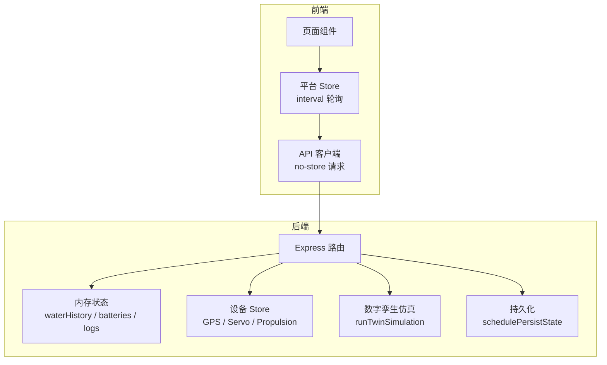
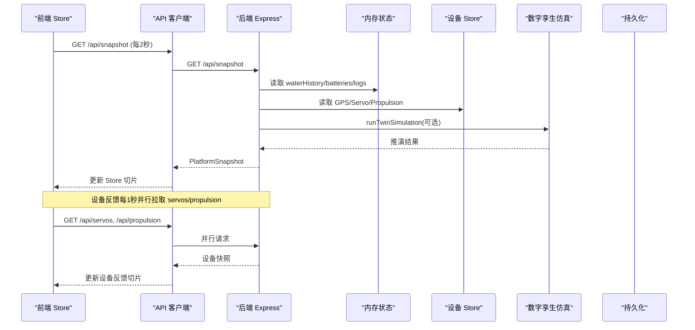
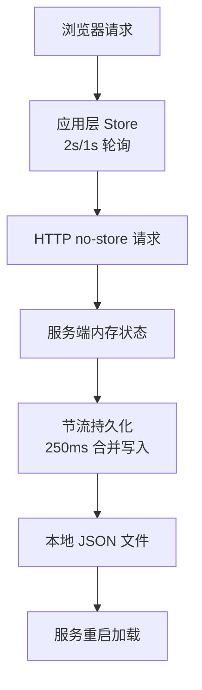
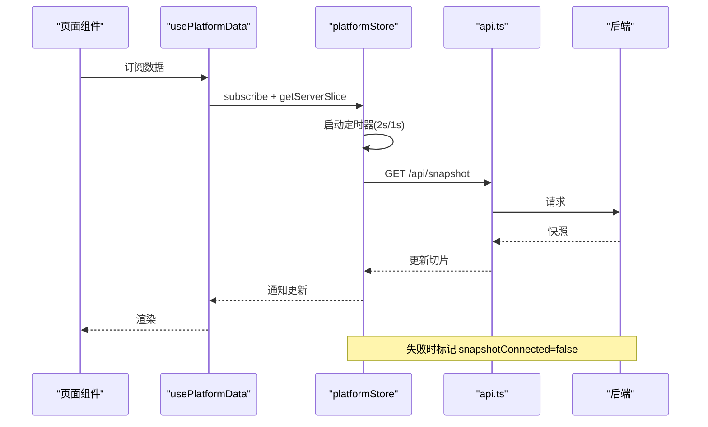
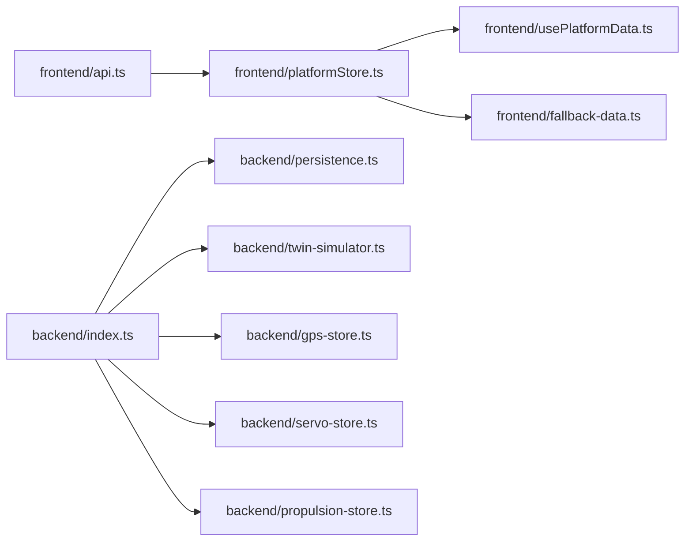

# 缓存策略

<cite>
**本文引用的文件**
- [index.ts](file://fishery-digital-twin-platform/apps/backend/src/index.ts)
- [persistence.ts](file://fishery-digital-twin-platform/apps/backend/src/persistence.ts)
- [twin-simulator.ts](file://fishery-digital-twin-platform/apps/backend/src/twin-simulator.ts)
- [gps-store.ts](file://fishery-digital-twin-platform/apps/backend/src/gps-store.ts)
- [propulsion-store.ts](file://fishery-digital-twin-platform/apps/backend/src/propulsion-store.ts)
- [servo-store.ts](file://fishery-digital-twin-platform/apps/backend/src/servo-store.ts)
- [platformStore.ts](file://fishery-digital-twin-platform/apps/frontend/src/lib/platformStore.ts)
- [api.ts](file://fishery-digital-twin-platform/apps/frontend/src/lib/api.ts)
- [usePlatformData.ts](file://fishery-digital-twin-platform/apps/frontend/src/hooks/usePlatformData.ts)
- [fallback-data.ts](file://fishery-digital-twin-platform/apps/frontend/src/lib/fallback-data.ts)
</cite>

## 目录
1. [简介](#简介)
2. [项目结构](#项目结构)
3. [核心组件](#核心组件)
4. [架构总览](#架构总览)
5. [详细组件分析](#详细组件分析)
6. [依赖关系分析](#依赖关系分析)
7. [性能考量](#性能考量)
8. [故障排查指南](#故障排查指南)
9. [结论](#结论)
10. [附录](#附录)

## 简介
本文件面向数字孪生平台的“缓存与数据一致性”主题，基于仓库中后端状态管理、持久化、前端轮询与降级机制，系统梳理并扩展出可落地的多级缓存策略。内容覆盖：
- 计算结果缓存：纯函数结果缓存、复杂计算结果存储、失效策略
- 数据预加载：预测性获取、懒加载实现、内存管理
- 智能更新：增量更新、版本控制、一致性保证
- 多级缓存：浏览器缓存、服务端缓存、数据库（本地文件）协同
- 具体实现示例：LRU、TTL、分布式缓存思路
- 监控与优化：命中率、内存使用、策略调优

## 项目结构
本项目采用前后端分离的单体应用形态：
- 后端 Express API：维护运行时内存状态（水质历史、电池、设备状态）、定时持久化到本地 JSON、提供快照与仿真接口
- 前端 Next.js：通过固定间隔轮询后端快照与设备反馈，使用共享 Store 统一分发；离线时回退为确定性 Mock 数据
- 数字孪生仿真：服务端纯函数计算，输出航线、能耗、疲劳与健康度等结果

图表来源
- [platformStore.ts:20-139](file://fishery-digital-twin-platform/apps/frontend/src/lib/platformStore.ts#L20-L139)
- [api.ts:6-24](file://fishery-digital-twin-platform/apps/frontend/src/lib/api.ts#L6-L24)
- [index.ts:322-346](file://fishery-digital-twin-platform/apps/backend/src/index.ts#L322-L346)
- [persistence.ts:51-67](file://fishery-digital-twin-platform/apps/backend/src/persistence.ts#L51-L67)
- [twin-simulator.ts:74-253](file://fishery-digital-twin-platform/apps/backend/src/twin-simulator.ts#L74-L253)

章节来源
- [platformStore.ts:20-139](file://fishery-digital-twin-platform/apps/frontend/src/lib/platformStore.ts#L20-L139)
- [api.ts:6-24](file://fishery-digital-twin-platform/apps/frontend/src/lib/api.ts#L6-L24)
- [index.ts:322-346](file://fishery-digital-twin-platform/apps/backend/src/index.ts#L322-L346)
- [persistence.ts:51-67](file://fishery-digital-twin-platform/apps/backend/src/persistence.ts#L51-L67)
- [twin-simulator.ts:74-253](file://fishery-digital-twin-platform/apps/backend/src/twin-simulator.ts#L74-L253)

## 核心组件
- 前端轮询与共享 Store：以固定周期拉取后端快照和设备反馈，合并为稳定切片，避免不必要重渲染
- 后端内存状态与持久化：水质历史、电池、日志等保存在内存，按节流策略写入本地 JSON
- 设备 Store：GPS、舵机、推进器各自维护在线状态、命令队列与 TTL 清理
- 数字孪生仿真：纯函数计算，输入当前快照与设备状态，输出推演结果
- 降级与初始态：前端在首次渲染或无网络时使用确定性 Mock 数据，保障体验一致

章节来源
- [platformStore.ts:20-139](file://fishery-digital-twin-platform/apps/frontend/src/lib/platformStore.ts#L20-L139)
- [usePlatformData.ts:1-24](file://fishery-digital-twin-platform/apps/frontend/src/hooks/usePlatformData.ts#L1-L24)
- [persistence.ts:32-67](file://fishery-digital-twin-platform/apps/backend/src/persistence.ts#L32-L67)
- [gps-store.ts:40-57](file://fishery-digital-twin-platform/apps/backend/src/gps-store.ts#L40-L57)
- [servo-store.ts:43-58](file://fishery-digital-twin-platform/apps/backend/src/servo-store.ts#L43-L58)
- [propulsion-store.ts:82-164](file://fishery-digital-twin-platform/apps/backend/src/propulsion-store.ts#L82-L164)
- [twin-simulator.ts:74-253](file://fishery-digital-twin-platform/apps/backend/src/twin-simulator.ts#L74-L253)
- [fallback-data.ts:152-163](file://fishery-digital-twin-platform/apps/frontend/src/lib/fallback-data.ts#L152-L163)

## 架构总览
下图展示从前端到后端的完整数据流，以及后端内部的状态、仿真与持久化协作关系。

图表来源
- [platformStore.ts:98-139](file://fishery-digital-twin-platform/apps/frontend/src/lib/platformStore.ts#L98-L139)
- [api.ts:26-72](file://fishery-digital-twin-platform/apps/frontend/src/lib/api.ts#L26-L72)
- [index.ts:322-346](file://fishery-digital-twin-platform/apps/backend/src/index.ts#L322-L346)
- [twin-simulator.ts:74-253](file://fishery-digital-twin-platform/apps/backend/src/twin-simulator.ts#L74-L253)

## 详细组件分析

### 计算结果缓存
- 纯函数结果缓存
  - 数字孪生仿真 runTwinSimulation 是纯函数，相同输入应返回相同结果。可在调用层引入 LRU/TTL 缓存，键由输入参数序列化生成，命中则直接返回，未命中再计算并写入缓存。
  - 建议缓存粒度：按“场景+参数”维度缓存，如 waveLevel、faultType、routeDistanceKm、targetSpeedMps 等组合。
- 复杂计算结果存储
  - AI 报告 latestAiReport 在服务端内存中缓存，并在写入新传感器数据或触发重新生成时失效。
  - 持久化模块将最新 AI 报告与水质历史、电池、日志一起落盘，重启后可恢复，具备“冷启动快速恢复”的效果。
- 缓存失效策略
  - 写扩散失效：收到传感器数据后清空 AI 报告缓存，确保下次查询重新生成
  - 时间失效：AI 报告生成限频（每分钟一次），避免频繁重算
  - 事件驱动失效：设备在线/离线、仿真输入变更时，可考虑对关联结果进行局部失效

章节来源
- [index.ts:418-473](file://fishery-digital-twin-platform/apps/backend/src/index.ts#L418-L473)
- [persistence.ts:32-67](file://fishery-digital-twin-platform/apps/backend/src/persistence.ts#L32-L67)
- [twin-simulator.ts:74-253](file://fishery-digital-twin-platform/apps/backend/src/twin-simulator.ts#L74-L253)

### 数据预加载与懒加载
- 预测性数据获取
  - 进入“数字孪生推演”页面时，可提前发起一次轻量级仿真预热，或将常用仿真参数组合预缓存
  - 导航与地图相关数据可按视口范围预取，减少首屏延迟
- 懒加载实现
  - 前端 Store 仅在订阅者存在时启动定时器，减少空闲资源占用
  - 设备反馈与平台快照分别独立轮询，按需启用
- 内存管理
  - 水质历史限制最大长度（例如最近 180 条），防止无限增长
  - 命令队列设置 TTL，过期自动清理
  - 设备在线判定基于 last_seen 时间戳，超时即视为离线

章节来源
- [platformStore.ts:59-139](file://fishery-digital-twin-platform/apps/frontend/src/lib/platformStore.ts#L59-L139)
- [index.ts:78-91](file://fishery-digital-twin-platform/apps/backend/src/index.ts#L78-L91)
- [servo-store.ts:175-183](file://fishery-digital-twin-platform/apps/backend/src/servo-store.ts#L175-L183)
- [propulsion-store.ts:310-318](file://fishery-digital-twin-platform/apps/backend/src/propulsion-store.ts#L310-L318)
- [gps-store.ts:40-57](file://fishery-digital-twin-platform/apps/backend/src/gps-store.ts#L40-L57)

### 智能缓存更新
- 增量更新
  - 传感器数据到达后仅追加最新点并裁剪历史，保持 O(1) 追加与有限内存
  - 设备状态更新只修改必要字段，避免全量重建
- 版本控制
  - 仿真结果包含 modelVersion 与 generatedAt，便于前端识别版本变化与缓存失效
  - 持久化文件作为“最终一致性”基线，重启后恢复至最近一次落盘状态
- 一致性保证
  - 前端使用共享 Store 切片，所有组件读取同一份快照，避免多源不一致
  - 设备命令带 TTL，消费端只处理有效窗口内的命令，避免重复执行

章节来源
- [index.ts:367-430](file://fishery-digital-twin-platform/apps/backend/src/index.ts#L367-L430)
- [twin-simulator.ts:191-253](file://fishery-digital-twin-platform/apps/backend/src/twin-simulator.ts#L191-L253)
- [persistence.ts:32-67](file://fishery-digital-twin-platform/apps/backend/src/persistence.ts#L32-L67)
- [servo-store.ts:175-183](file://fishery-digital-twin-platform/apps/backend/src/servo-store.ts#L175-L183)
- [propulsion-store.ts:310-318](file://fishery-digital-twin-platform/apps/backend/src/propulsion-store.ts#L310-L318)

### 多级缓存架构
- 浏览器层
  - fetch 显式禁用浏览器 HTTP 缓存（no-store），由应用层 Store 承担短时缓存职责
  - 首次渲染使用确定性 Mock 数据，避免 SSR/Hydration 差异
- 服务端层
  - 内存状态作为热路径缓存，配合节流持久化降低 I/O 压力
  - 设备命令队列 TTL 作为短期缓存，避免陈旧命令被消费
- 数据库层（本地文件）
  - platform-state.json 作为持久化介质，保存水质历史、电池、AI 报告与日志
  - 启动时加载，关闭时 flush，保证进程重启后的状态连续性

图表来源
- [api.ts:6-24](file://fishery-digital-twin-platform/apps/frontend/src/lib/api.ts#L6-L24)
- [platformStore.ts:20-139](file://fishery-digital-twin-platform/apps/frontend/src/lib/platformStore.ts#L20-L139)
- [persistence.ts:51-67](file://fishery-digital-twin-platform/apps/backend/src/persistence.ts#L51-L67)

章节来源
- [api.ts:6-24](file://fishery-digital-twin-platform/apps/frontend/src/lib/api.ts#L6-L24)
- [platformStore.ts:20-139](file://fishery-digital-twin-platform/apps/frontend/src/lib/platformStore.ts#L20-L139)
- [persistence.ts:51-67](file://fishery-digital-twin-platform/apps/backend/src/persistence.ts#L51-L67)

### 具体缓存实现示例
- LRU 缓存（适用于仿真/AI 报告）
  - 键：输入参数序列化（如 routeDistanceKm、targetSpeedMps、waveLevel、faultType 等）
  - 值：仿真结果对象
  - 淘汰：容量满时移除最久未使用的条目
  - 适用：高频重复参数组合的仿真结果复用
- TTL 缓存（适用于设备状态/命令）
  - 键：设备 ID
  - 值：设备快照或命令
  - 过期：超过阈值（如 2.5s）自动清理
  - 适用：命令队列、临时状态
- 分布式缓存（扩展方向）
  - 当多实例部署时，可将仿真结果与 AI 报告迁移至 Redis 等 KV 存储
  - 结合版本号与失效事件，保证跨实例一致性

章节来源
- [twin-simulator.ts:74-253](file://fishery-digital-twin-platform/apps/backend/src/twin-simulator.ts#L74-L253)
- [servo-store.ts:175-183](file://fishery-digital-twin-platform/apps/backend/src/servo-store.ts#L175-L183)
- [propulsion-store.ts:310-318](file://fishery-digital-twin-platform/apps/backend/src/propulsion-store.ts#L310-L318)

### 前端轮询与降级流程

图表来源
- [usePlatformData.ts:1-24](file://fishery-digital-twin-platform/apps/frontend/src/hooks/usePlatformData.ts#L1-L24)
- [platformStore.ts:98-139](file://fishery-digital-twin-platform/apps/frontend/src/lib/platformStore.ts#L98-L139)
- [api.ts:26-28](file://fishery-digital-twin-platform/apps/frontend/src/lib/api.ts#L26-L28)

章节来源
- [usePlatformData.ts:1-24](file://fishery-digital-twin-platform/apps/frontend/src/hooks/usePlatformData.ts#L1-L24)
- [platformStore.ts:98-139](file://fishery-digital-twin-platform/apps/frontend/src/lib/platformStore.ts#L98-L139)
- [api.ts:26-28](file://fishery-digital-twin-platform/apps/frontend/src/lib/api.ts#L26-L28)

## 依赖关系分析
- 前端依赖
  - usePlatformData 依赖 platformStore 提供的订阅与切片
  - platformStore 依赖 api.ts 的网络请求与 fallback-data.ts 的初始态
- 后端依赖
  - index.ts 依赖 persistence.ts、twin-simulator.ts、各设备 store
  - 设备 store 之间相互独立，通过 index.ts 聚合暴露

图表来源
- [platformStore.ts:1-139](file://fishery-digital-twin-platform/apps/frontend/src/lib/platformStore.ts#L1-L139)
- [usePlatformData.ts:1-24](file://fishery-digital-twin-platform/apps/frontend/src/hooks/usePlatformData.ts#L1-L24)
- [fallback-data.ts:152-163](file://fishery-digital-twin-platform/apps/frontend/src/lib/fallback-data.ts#L152-L163)
- [index.ts:21-44](file://fishery-digital-twin-platform/apps/backend/src/index.ts#L21-L44)
- [persistence.ts:1-67](file://fishery-digital-twin-platform/apps/backend/src/persistence.ts#L1-L67)
- [twin-simulator.ts:1-253](file://fishery-digital-twin-platform/apps/backend/src/twin-simulator.ts#L1-L253)
- [gps-store.ts:1-103](file://fishery-digital-twin-platform/apps/backend/src/gps-store.ts#L1-L103)
- [servo-store.ts:1-184](file://fishery-digital-twin-platform/apps/backend/src/servo-store.ts#L1-L184)
- [propulsion-store.ts:1-319](file://fishery-digital-twin-platform/apps/backend/src/propulsion-store.ts#L1-L319)

章节来源
- [platformStore.ts:1-139](file://fishery-digital-twin-platform/apps/frontend/src/lib/platformStore.ts#L1-L139)
- [usePlatformData.ts:1-24](file://fishery-digital-twin-platform/apps/frontend/src/hooks/usePlatformData.ts#L1-L24)
- [fallback-data.ts:152-163](file://fishery-digital-twin-platform/apps/frontend/src/lib/fallback-data.ts#L152-L163)
- [index.ts:21-44](file://fishery-digital-twin-platform/apps/backend/src/index.ts#L21-L44)
- [persistence.ts:1-67](file://fishery-digital-twin-platform/apps/backend/src/persistence.ts#L1-L67)
- [twin-simulator.ts:1-253](file://fishery-digital-twin-platform/apps/backend/src/twin-simulator.ts#L1-L253)
- [gps-store.ts:1-103](file://fishery-digital-twin-platform/apps/backend/src/gps-store.ts#L1-L103)
- [servo-store.ts:1-184](file://fishery-digital-twin-platform/apps/backend/src/servo-store.ts#L1-L184)
- [propulsion-store.ts:1-319](file://fishery-digital-twin-platform/apps/backend/src/propulsion-store.ts#L1-L319)

## 性能考量
- 轮询频率
  - 平台快照 2 秒、设备反馈 1 秒，平衡实时性与带宽消耗
  - 可通过配置调整频率，或在低优先级页面降低频率
- 内存占用
  - 限制水质历史长度、日志数量，避免内存膨胀
  - 设备命令队列 TTL 清理，避免堆积
- I/O 压力
  - 持久化节流 250ms，合并多次写入，降低磁盘抖动
- 计算开销
  - 仿真为 CPU 密集型，建议加入 LRU 缓存与并发限制
  - AI 报告生成限频，避免频繁重算

[本节为通用指导，不直接分析具体文件]

## 故障排查指南
- 前端连接异常
  - 检查 snapshotConnected/feedbackConnected 标志位，定位网络或服务端问题
  - 确认 API 基础地址与 Token 配置正确
- 后端状态不一致
  - 检查持久化是否成功写入，关注 schedulePersistState 与 flush 时机
  - 设备在线判定基于 last_seen，若长时间无心跳将被视为离线
- 仿真结果异常
  - 检查输入参数合法性与边界条件
  - 查看 modelVersion 与 confidence，评估结果可信度

章节来源
- [platformStore.ts:98-139](file://fishery-digital-twin-platform/apps/frontend/src/lib/platformStore.ts#L98-L139)
- [api.ts:6-24](file://fishery-digital-twin-platform/apps/frontend/src/lib/api.ts#L6-L24)
- [persistence.ts:51-67](file://fishery-digital-twin-platform/apps/backend/src/persistence.ts#L51-L67)
- [gps-store.ts:40-57](file://fishery-digital-twin-platform/apps/backend/src/gps-store.ts#L40-L57)
- [servo-store.ts:43-58](file://fishery-digital-twin-platform/apps/backend/src/servo-store.ts#L43-L58)
- [propulsion-store.ts:82-164](file://fishery-digital-twin-platform/apps/backend/src/propulsion-store.ts#L82-L164)
- [twin-simulator.ts:181-253](file://fishery-digital-twin-platform/apps/backend/src/twin-simulator.ts#L181-L253)

## 结论
该数字孪生平台在当前实现中已具备：
- 前端应用层短时缓存与降级能力
- 服务端内存状态与节流持久化
- 设备命令 TTL 与在线判定
- 纯函数仿真与结果落盘

在此基础上，建议逐步引入：
- 仿真与 AI 报告的 LRU/TTL 缓存
- 更细粒度的失效策略（事件驱动）
- 分布式缓存以支持多实例部署
- 完善的监控指标（命中率、内存、I/O、CPU）

[本节为总结，不直接分析具体文件]

## 附录
- 关键常量与阈值
  - 前端轮询：快照 2s，设备反馈 1s
  - 后端持久化：250ms 节流
  - 设备命令 TTL：舵机 2.5s，推进器 2.5s
  - 水质历史上限：约 180 条
  - AI 报告生成限频：每分钟一次

章节来源
- [platformStore.ts:20-21](file://fishery-digital-twin-platform/apps/frontend/src/lib/platformStore.ts#L20-L21)
- [persistence.ts:51-58](file://fishery-digital-twin-platform/apps/backend/src/persistence.ts#L51-L58)
- [servo-store.ts:5](file://fishery-digital-twin-platform/apps/backend/src/servo-store.ts#L5)
- [propulsion-store.ts:6](file://fishery-digital-twin-platform/apps/backend/src/propulsion-store.ts#L6)
- [index.ts:64](file://fishery-digital-twin-platform/apps/backend/src/index.ts#L64)
- [index.ts:457-462](file://fishery-digital-twin-platform/apps/backend/src/index.ts#L457-L462)