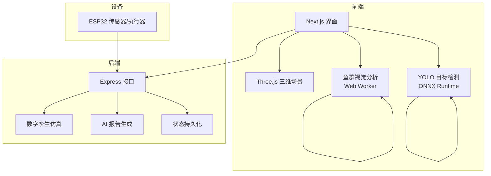
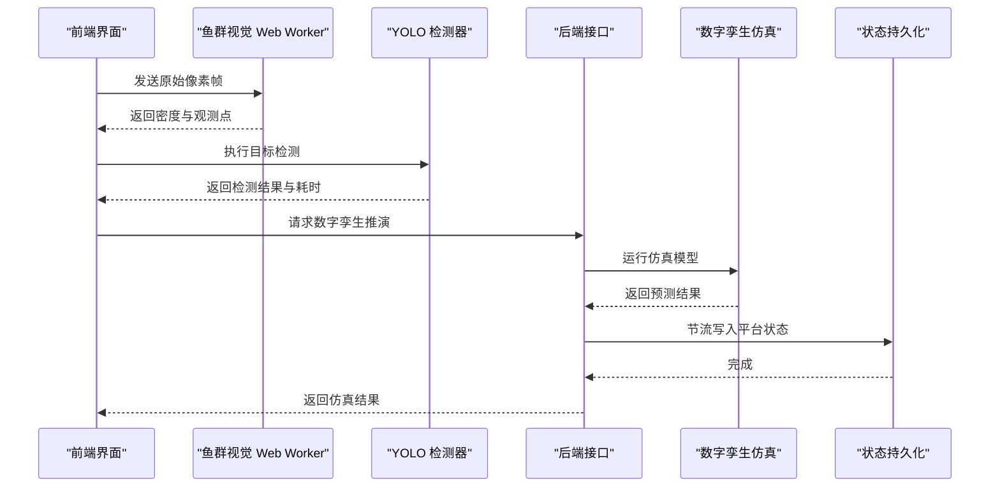
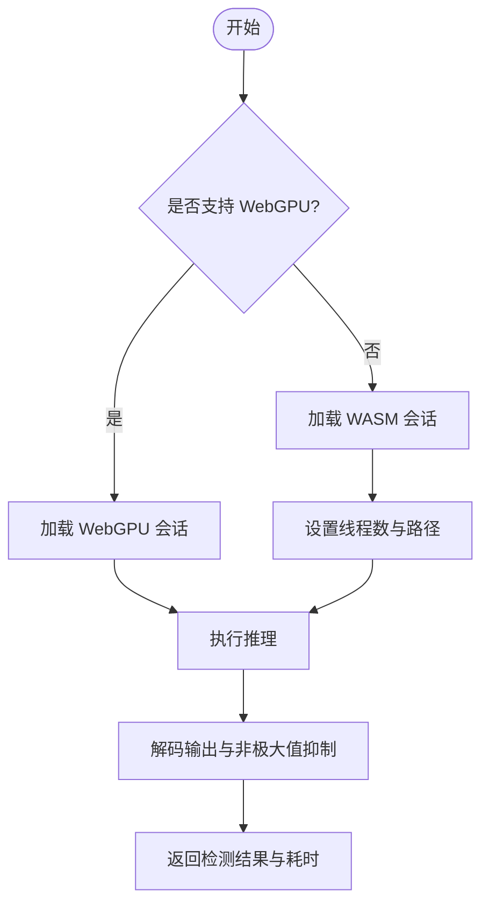
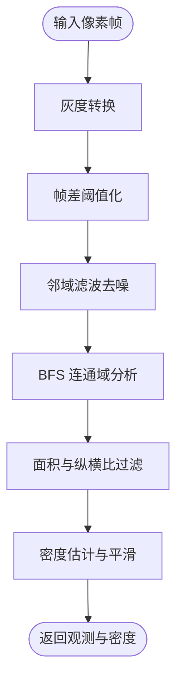
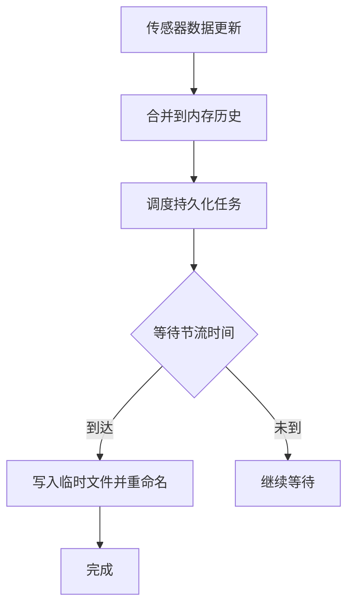
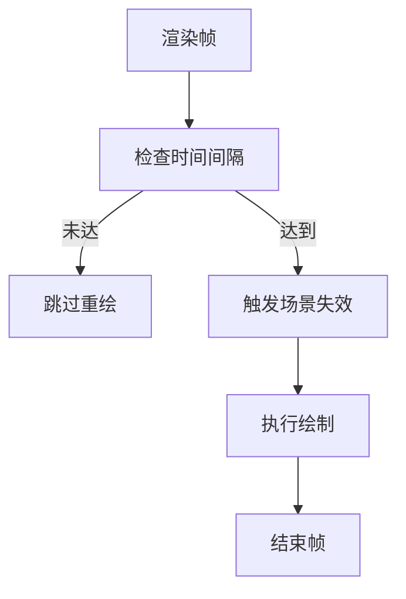
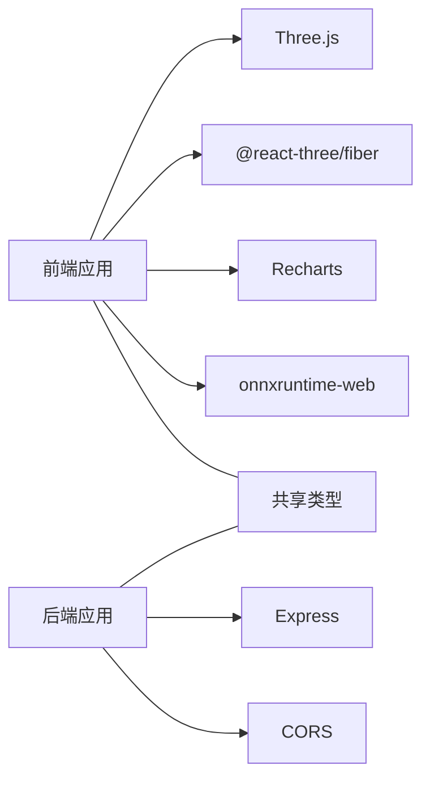

# 计算性能优化

<cite>
**本文引用的文件**
- [README.md](file://fishery-digital-twin-platform/README.md)
- [后端入口 index.ts](file://fishery-digital-twin-platform/apps/backend/src/index.ts)
- [数字孪生仿真 twin-simulator.ts](file://fishery-digital-twin-platform/apps/backend/src/twin-simulator.ts)
- [AI 报告服务 ai-service.ts](file://fishery-digital-twin-platform/apps/backend/src/ai-service.ts)
- [状态持久化 persistence.ts](file://fishery-digital-twin-platform/apps/backend/src/persistence.ts)
- [前端鱼群视觉分析 fish-vision.worker.ts](file://fishery-digital-twin-platform/apps/frontend/src/lib/fish-vision.worker.ts)
- [前端鱼群算法 fish-vision.ts](file://fishery-digital-twin-platform/apps/frontend/src/lib/fish-vision.ts)
- [YOLO 目标检测 yolo26-detector.ts](file://fishery-digital-twin-platform/apps/frontend/src/lib/yolo26-detector.ts)
- [三维场景 BoatTwinScene.tsx](file://fishery-digital-twin-platform/apps/frontend/src/components/three/BoatTwinScene.tsx)
- [数字孪生页面 TwinPage.tsx](file://fishery-digital-twin-platform/apps/frontend/src/components/dashboard/TwinPage.tsx)
- [后端依赖 package.json](file://fishery-digital-twin-platform/apps/backend/package.json)
- [前端依赖 package.json](file://fishery-digital-twin-platform/apps/frontend/package.json)
</cite>

## 目录
1. [简介](#简介)
2. [项目结构](#项目结构)
3. [核心组件](#核心组件)
4. [架构总览](#架构总览)
5. [详细组件分析](#详细组件分析)
6. [依赖关系分析](#依赖关系分析)
7. [性能考虑](#性能考虑)
8. [故障排查指南](#故障排查指南)
9. [结论](#结论)
10. [附录](#附录)

## 简介
本文件面向“智慧渔业巡检船数字孪生与 AI 决策平台”的计算性能优化，围绕并行计算、算法复杂度优化、缓存策略、批处理技术、前端渲染与图像处理优化、后端数据库与 API 并发优化，以及性能基准测试与评估方法展开。文档以仓库中实际实现为依据，结合可视化图示说明数据流与控制流，帮助读者在不深入源码的情况下理解系统如何提升吞吐、降低延迟并保证稳定性。

## 项目结构
系统采用前后端分离的模块化设计：
- 后端基于 Express 提供设备控制、传感器数据接入、AI 报告生成、数字孪生仿真和状态持久化能力。
- 前端基于 Next.js + React Three Fiber 构建三维孪生场景、图表与地图，并在浏览器侧使用 Web Worker 与 ONNX Runtime（WebGPU/WASM）进行图像识别与目标检测。
- 固件层通过 UDP 自动发现后端端口，HTTP 上报传感器和设备状态。

**图表来源**
- [后端入口 index.ts:56-110](file://fishery-digital-twin-platform/apps/backend/src/index.ts#L56-L110)
- [数字孪生仿真 twin-simulator.ts:74-116](file://fishery-digital-twin-platform/apps/backend/src/twin-simulator.ts#L74-L116)
- [AI 报告服务 ai-service.ts:167-232](file://fishery-digital-twin-platform/apps/backend/src/ai-service.ts#L167-L232)
- [状态持久化 persistence.ts:17-58](file://fishery-digital-twin-platform/apps/backend/src/persistence.ts#L17-L58)
- [鱼群视觉分析 fish-vision.worker.ts:1-28](file://fishery-digital-twin-platform/apps/frontend/src/lib/fish-vision.worker.ts#L1-L28)
- [YOLO 目标检测 yolo26-detector.ts:147-264](file://fishery-digital-twin-platform/apps/frontend/src/lib/yolo26-detector.ts#L147-L264)
- [三维场景 BoatTwinScene.tsx:128-151](file://fishery-digital-twin-platform/apps/frontend/src/components/three/BoatTwinScene.tsx#L128-L151)

**章节来源**
- [README.md:1-28](file://fishery-digital-twin-platform/README.md#L1-L28)
- [后端入口 index.ts:56-110](file://fishery-digital-twin-platform/apps/backend/src/index.ts#L56-L110)

## 核心组件
- 数字孪生仿真模块：根据航线、海况、设备反馈估算能耗、ETA、完成概率与疲劳损耗，输出预测曲线与风险等级。
- AI 报告服务：基于水质历史与电池状态生成本地报告，可选调用外部 LLM 增强建议。
- 状态持久化：对水质历史、电池、AI 报告与日志进行节流写入磁盘，避免频繁 I/O。
- 前端视觉分析：在 Web Worker 中执行帧间差分、连通域分析与密度估计，保持 UI 线程流畅。
- YOLO 目标检测：优先使用 WebGPU，回退到 WASM；支持半精度张量解码与非极大值抑制。
- 三维场景渲染：按需刷新帧率、动态水面着色器、设备反馈可视化。

**章节来源**
- [数字孪生仿真 twin-simulator.ts:74-253](file://fishery-digital-twin-platform/apps/backend/src/twin-simulator.ts#L74-L253)
- [AI 报告服务 ai-service.ts:49-122](file://fishery-digital-twin-platform/apps/backend/src/ai-service.ts#L49-L122)
- [状态持久化 persistence.ts:17-58](file://fishery-digital-twin-platform/apps/backend/src/persistence.ts#L17-L58)
- [鱼群视觉分析 fish-vision.worker.ts:1-28](file://fishery-digital-twin-platform/apps/frontend/src/lib/fish-vision.worker.ts#L1-L28)
- [鱼群算法 fish-vision.ts:41-223](file://fishery-digital-twin-platform/apps/frontend/src/lib/fish-vision.ts#L41-L223)
- [YOLO 目标检测 yolo26-detector.ts:147-264](file://fishery-digital-twin-platform/apps/frontend/src/lib/yolo26-detector.ts#L147-L264)
- [三维场景 BoatTwinScene.tsx:128-151](file://fishery-digital-twin-platform/apps/frontend/src/components/three/BoatTwinScene.tsx#L128-L151)

## 架构总览
系统的关键性能路径包括：
- 前端视频流进入 Web Worker 进行像素级处理，结果返回主线程用于叠加显示。
- 前端发起数字孪生推演请求，后端读取当前快照与设备状态，运行仿真模型并返回预测结果。
- 传感器数据通过 HTTP 上报，后端更新内存中的历史序列，并节流持久化。
- AI 报告生成可降级为本地统计，或异步调用外部 API，带超时保护。

**图表来源**
- [鱼群视觉分析 fish-vision.worker.ts:19-27](file://fishery-digital-twin-platform/apps/frontend/src/lib/fish-vision.worker.ts#L19-L27)
- [YOLO 目标检测 yolo26-detector.ts:208-259](file://fishery-digital-twin-platform/apps/frontend/src/lib/yolo26-detector.ts#L208-L259)
- [后端入口 index.ts:540-555](file://fishery-digital-twin-platform/apps/backend/src/index.ts#L540-L555)
- [数字孪生仿真 twin-simulator.ts:74-116](file://fishery-digital-twin-platform/apps/backend/src/twin-simulator.ts#L74-L116)
- [状态持久化 persistence.ts:51-58](file://fishery-digital-twin-platform/apps/backend/src/persistence.ts#L51-L58)

## 详细组件分析

### 并行计算与多线程处理
- 前端鱼群视觉分析在独立 Worker 中运行，避免阻塞 UI 线程；帧间差分、邻域滤波与 BFS 连通域分析均在 Worker 内完成。
- YOLO 检测器优先选择 WebGPU 推理，若不可用则回退到 WASM；WASM 运行时启用 SIMD 与线程池以提升吞吐。
- 后端通过 Express 提供 REST 接口，配合 Node.js 事件循环处理并发请求；UDP 广播用于设备自动发现，减少网络握手开销。

**图表来源**
- [YOLO 目标检测 yolo26-detector.ts:147-186](file://fishery-digital-twin-platform/apps/frontend/src/lib/yolo26-detector.ts#L147-L186)
- [YOLO 目标检测 yolo26-detector.ts:208-259](file://fishery-digital-twin-platform/apps/frontend/src/lib/yolo26-detector.ts#L208-L259)

**章节来源**
- [鱼群视觉分析 fish-vision.worker.ts:1-28](file://fishery-digital-twin-platform/apps/frontend/src/lib/fish-vision.worker.ts#L1-L28)
- [鱼群算法 fish-vision.ts:41-223](file://fishery-digital-twin-platform/apps/frontend/src/lib/fish-vision.ts#L41-L223)
- [YOLO 目标检测 yolo26-detector.ts:147-264](file://fishery-digital-twin-platform/apps/frontend/src/lib/yolo26-detector.ts#L147-L264)
- [后端入口 index.ts:271-318](file://fishery-digital-twin-platform/apps/backend/src/index.ts#L271-L318)

### 算法复杂度优化
- 鱼群视觉分析将分辨率降至固定尺寸，使用一维数组存储灰度图与掩码，BFS 连通域遍历限制最大面积与纵横比，减少无效区域计算。
- YOLO 输出解码支持多种维度布局，按通道优先或候选优先读取，最小分数过滤减少后续 NMS 压力。
- 数字孪生仿真采用分段线性近似与经验系数，将复杂物理过程简化为可快速计算的能耗与误差模型。

**图表来源**
- [鱼群算法 fish-vision.ts:61-219](file://fishery-digital-twin-platform/apps/frontend/src/lib/fish-vision.ts#L61-L219)

**章节来源**
- [鱼群算法 fish-vision.ts:41-223](file://fishery-digital-twin-platform/apps/frontend/src/lib/fish-vision.ts#L41-L223)
- [YOLO 目标检测 yolo26-detector.ts:82-145](file://fishery-digital-twin-platform/apps/frontend/src/lib/yolo26-detector.ts#L82-L145)
- [数字孪生仿真 twin-simulator.ts:74-116](file://fishery-digital-twin-platform/apps/backend/src/twin-simulator.ts#L74-L116)

### 缓存策略
- 后端维护内存中的水质历史、电池状态与最新 AI 报告，查询接口直接返回快照，避免重复计算。
- 持久化采用节流写入，合并多次变更后再落盘，降低磁盘 I/O 频率。
- AI 报告生成具备本地降级能力，当外部 API 不可用时仍返回结构化报告，提高可用性。

**图表来源**
- [状态持久化 persistence.ts:17-58](file://fishery-digital-twin-platform/apps/backend/src/persistence.ts#L17-L58)

**章节来源**
- [后端入口 index.ts:367-430](file://fishery-digital-twin-platform/apps/backend/src/index.ts#L367-L430)
- [状态持久化 persistence.ts:17-58](file://fishery-digital-twin-platform/apps/backend/src/persistence.ts#L17-L58)
- [AI 报告服务 ai-service.ts:167-232](file://fishery-digital-twin-platform/apps/backend/src/ai-service.ts#L167-L232)

### 批处理技术
- 三维场景使用自定义帧率控制器，仅在达到间隔时触发重绘，降低 GPU 压力。
- 图表渲染关闭动画以减少每帧计算；批量展示多条曲线时禁用逐条动画。
- 后端批量生成演示数据与快照，避免实时历史被覆盖，同时满足演示需求。

**图表来源**
- [三维场景 BoatTwinScene.tsx:128-151](file://fishery-digital-twin-platform/apps/frontend/src/components/three/BoatTwinScene.tsx#L128-L151)

**章节来源**
- [三维场景 BoatTwinScene.tsx:128-151](file://fishery-digital-twin-platform/apps/frontend/src/components/three/BoatTwinScene.tsx#L128-L151)
- [数字孪生页面 TwinPage.tsx:597-610](file://fishery-digital-twin-platform/apps/frontend/src/components/dashboard/TwinPage.tsx#L597-L610)
- [后端入口 index.ts:432-441](file://fishery-digital-twin-platform/apps/backend/src/index.ts#L432-L441)

### 前端计算优化
- Canvas 绘制优化：使用固定输入尺寸与预分配 Float32Array，减少内存分配与拷贝；willReadFrequently 提示浏览器优化画布访问。
- 图像处理算法优化：灰度转换使用加权公式，帧差阈值与邻域滤波降低噪声；BFS 使用队列与访问标记避免重复遍历。
- 实时数据过滤：仅保留前若干观测点并按面积排序，限制渲染数量，提升交互响应。

**章节来源**
- [YOLO 目标检测 yolo26-detector.ts:195-229](file://fishery-digital-twin-platform/apps/frontend/src/lib/yolo26-detector.ts#L195-L229)
- [鱼群算法 fish-vision.ts:61-219](file://fishery-digital-twin-platform/apps/frontend/src/lib/fish-vision.ts#L61-L219)

### 后端计算优化
- 数据库查询优化：当前实现以内存数组为主，查询为 O(1) 或 O(n) 扫描；可通过索引或分片进一步优化大规模历史数据。
- API 响应缓存：快照接口直接返回内存状态，AI 报告具备本地缓存与限流，避免高频外部调用。
- 并发处理优化：Express 单进程事件循环适合 I/O 密集；如需 CPU 密集可拆分子进程或使用 worker_threads。

**章节来源**
- [后端入口 index.ts:247-262](file://fishery-digital-twin-platform/apps/backend/src/index.ts#L247-L262)
- [AI 报告服务 ai-service.ts:167-232](file://fishery-digital-twin-platform/apps/backend/src/ai-service.ts#L167-L232)

## 依赖关系分析
- 前端依赖 Three.js、React Three Fiber、Recharts、onnxruntime-web 等库，支撑三维渲染、图表与模型推理。
- 后端依赖 Express、cors、dotenv，提供轻量 API 与服务配置。
- 共享类型定义位于 packages/shared，确保前后端数据结构一致。

**图表来源**
- [前端依赖 package.json:14-31](file://fishery-digital-twin-platform/apps/frontend/package.json#L14-L31)
- [后端依赖 package.json:13-18](file://fishery-digital-twin-platform/apps/backend/package.json#L13-L18)

**章节来源**
- [前端依赖 package.json:14-31](file://fishery-digital-twin-platform/apps/frontend/package.json#L14-L31)
- [后端依赖 package.json:13-18](file://fishery-digital-twin-platform/apps/backend/package.json#L13-L18)

## 性能考虑
- 并行计算：充分利用 Web Worker 与 WebGPU/WASM 线程池，将图像处理与推理从主线程卸载。
- 算法复杂度：降低分辨率、限制搜索范围、使用高效数据结构（TypedArray、队列），减少不必要的对象创建。
- 缓存策略：内存快照+节流持久化，外部 API 调用具备超时与降级，保障高可用。
- 批处理：控制渲染帧率、关闭图表动画、批量生成演示数据，降低瞬时负载。
- 前端优化：Canvas 预分配、图像预处理向量化、观测点数量限制。
- 后端优化：内存数据访问、接口聚合、AI 报告限流与本地降级。

[本节为通用指导，不直接分析具体文件]

## 故障排查指南
- 启动失败：检查端口占用与权限错误，后端会记录并退出。
- 设备无法发现：确认 UDP 端口与防火墙规则，后端会周期性广播自身地址。
- AI 报告失败：检查环境变量与网络超时，服务会返回本地降级报告。
- 三维场景卡顿：调整帧率、关闭动态水面或减少设备反馈可视化元素。

**章节来源**
- [后端入口 index.ts:559-599](file://fishery-digital-twin-platform/apps/backend/src/index.ts#L559-L599)
- [AI 报告服务 ai-service.ts:167-232](file://fishery-digital-twin-platform/apps/backend/src/ai-service.ts#L167-L232)

## 结论
该数字孪生平台通过前端 Worker 与 ONNX Runtime 的并行推理、后端内存快照与节流持久化、三维场景的帧率控制与批处理渲染，构建了兼顾实时性与稳定性的计算体系。未来可在以下方向继续优化：
- 引入 IndexedDB 或 SQLite 替代纯内存历史，支持更大规模数据查询与回放。
- 使用 worker_threads 拆分 CPU 密集型仿真任务，提升后端吞吐。
- 增加前端性能埋点与 A/B 对比，持续评估优化效果。

[本节为总结性内容，不直接分析具体文件]

## 附录
- 性能基准测试建议：
  - 前端：测量 Web Worker 处理帧耗时、YOLO 推理耗时、Canvas 绘制耗时。
  - 后端：测量 /api/snapshot 与 /api/twin/simulate 的 P95/P99 延迟与吞吐量。
  - 持久化：监控磁盘写入频率与文件大小增长。
- 优化效果评估方法：
  - 对比优化前后的 FPS、CPU 占用、内存峰值与端到端延迟。
  - 使用浏览器 Performance 面板与 Node.js Profiler 定位热点。
  - 通过 A/B 实验验证不同参数（如帧率、模型大小、阈值）对体验的影响。

[本节为通用指导，不直接分析具体文件]