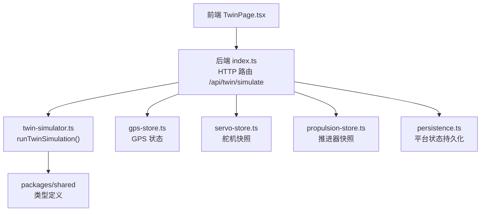
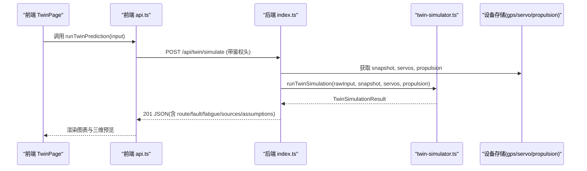
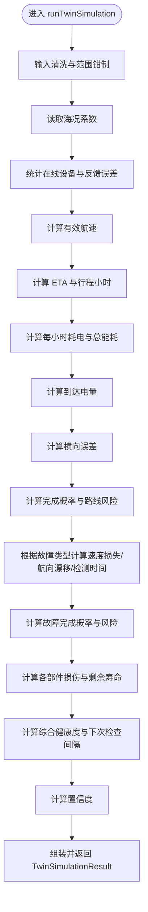
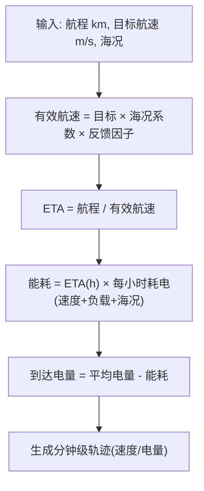
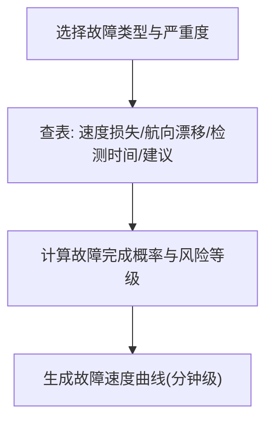
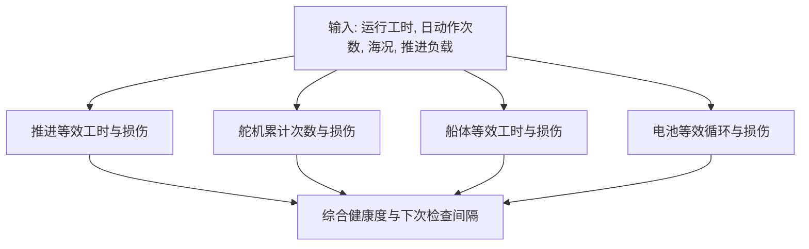
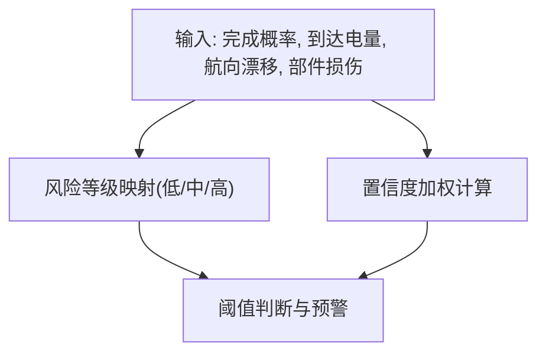
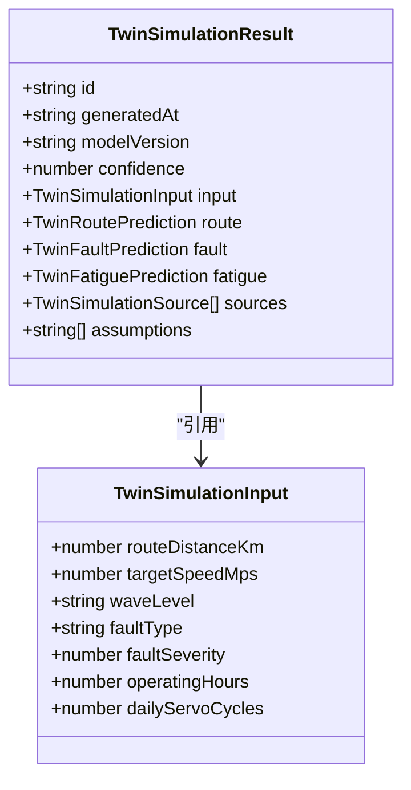
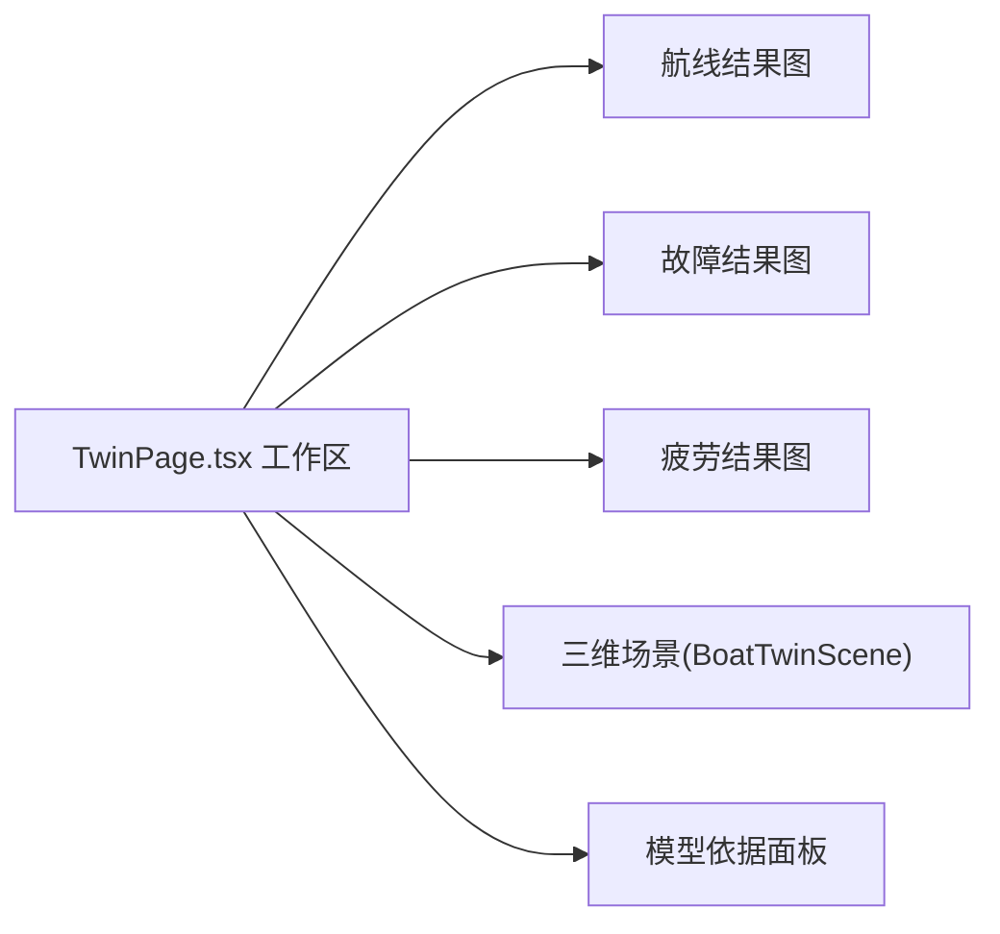
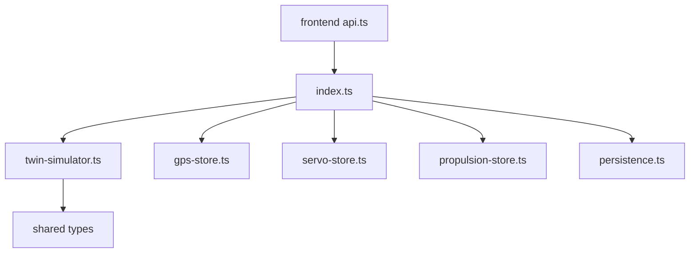

# 数字孪生推演

<cite>
**本文引用的文件**
- [twin-simulator.ts](file://fishery-digital-twin-platform/apps/backend/src/twin-simulator.ts)
- [index.ts](file://fishery-digital-twin-platform/apps/backend/src/index.ts)
- [propulsion-store.ts](file://fishery-digital-twin-platform/apps/backend/src/propulsion-store.ts)
- [servo-store.ts](file://fishery-digital-twin-platform/apps/backend/src/servo-store.ts)
- [gps-store.ts](file://fishery-digital-twin-platform/apps/backend/src/gps-store.ts)
- [persistence.ts](file://fishery-digital-twin-platform/apps/backend/src/persistence.ts)
- [shared index.ts](file://fishery-digital-twin-platform/packages/shared/src/index.ts)
- [TwinPage.tsx](file://fishery-digital-twin-platform/apps/frontend/src/components/dashboard/TwinPage.tsx)
- [frontend api.ts](file://fishery-digital-twin-platform/apps/frontend/src/lib/api.ts)
</cite>

## 目录
1. [简介](#简介)
2. [项目结构](#项目结构)
3. [核心组件](#核心组件)
4. [架构总览](#架构总览)
5. [详细组件分析](#详细组件分析)
6. [依赖关系分析](#依赖关系分析)
7. [性能考虑](#性能考虑)
8. [故障排查指南](#故障排查指南)
9. [结论](#结论)
10. [附录](#附录)

## 简介
本文件面向“数字孪生推演”能力，系统性说明虚拟环境中的未来状态预测与故障模拟。内容覆盖：
- 推演引擎架构：输入参数校验、物理模型计算、结果生成与数据序列化。
- 航线预演算法：距离、ETA、能耗估算、到达电池状态。
- 故障模拟机制：舵机卡滞、电机降额、反馈丢失的数学建模与影响评估。
- 疲劳寿命预测：推进系统、舵机、船体、电池的磨损与剩余寿命估算。
- 风险评估体系：风险等级划分、置信度计算、预警阈值。
- 可视化指南：如何理解并展示推演结果。

## 项目结构
后端以 Express 提供 HTTP API，集中处理传感器、设备状态与数字孪生推演；前端通过 Next.js 页面调用 API 并渲染图表与三维场景。共享类型定义位于 packages/shared。

**图示来源**
- [index.ts:540-555](file://fishery-digital-twin-platform/apps/backend/src/index.ts#L540-L555)
- [twin-simulator.ts:74-253](file://fishery-digital-twin-platform/apps/backend/src/twin-simulator.ts#L74-L253)
- [gps-store.ts:55-103](file://fishery-digital-twin-platform/apps/backend/src/gps-store.ts#L55-L103)
- [servo-store.ts:89-104](file://fishery-digital-twin-platform/apps/backend/src/servo-store.ts#L89-L104)
- [propulsion-store.ts:149-164](file://fishery-digital-twin-platform/apps/backend/src/propulsion-store.ts#L149-L164)
- [persistence.ts:32-68](file://fishery-digital-twin-platform/apps/backend/src/persistence.ts#L32-L68)
- [shared index.ts:205-288](file://fishery-digital-twin-platform/packages/shared/src/index.ts#L205-L288)

**章节来源**
- [index.ts:540-555](file://fishery-digital-twin-platform/apps/backend/src/index.ts#L540-L555)
- [shared index.ts:205-288](file://fishery-digital-twin-platform/packages/shared/src/index.ts#L205-L288)

## 核心组件
- 推演引擎 twin-simulator.ts：负责输入清洗、海况修正、能耗与ETA计算、故障注入、疲劳寿命与健康度评估、置信度与结果序列化。
- 设备状态存储：
  - propulsion-store.ts：推进器目标、实际输出、在线状态、命令队列。
  - servo-store.ts：舵机目标角度、实际角度、在线状态、命令队列。
  - gps-store.ts：GPS 定位、速度、航向、有效性。
- 持久化 persistence.ts：水质历史、电池、AI报告、系统日志的落盘与加载。
- 前端 TwinPage.tsx：仿真模式选择、参数配置、结果可视化（航线、故障、疲劳）。
- 前端 API 客户端：封装对 /api/twin/simulate 等端点的调用。

**章节来源**
- [twin-simulator.ts:74-253](file://fishery-digital-twin-platform/apps/backend/src/twin-simulator.ts#L74-L253)
- [propulsion-store.ts:149-164](file://fishery-digital-twin-platform/apps/backend/src/propulsion-store.ts#L149-L164)
- [servo-store.ts:89-104](file://fishery-digital-twin-platform/apps/backend/src/servo-store.ts#L89-L104)
- [gps-store.ts:55-103](file://fishery-digital-twin-platform/apps/backend/src/gps-store.ts#L55-L103)
- [persistence.ts:32-68](file://fishery-digital-twin-platform/apps/backend/src/persistence.ts#L32-L68)
- [TwinPage.tsx:24-78](file://fishery-digital-twin-platform/apps/frontend/src/components/dashboard/TwinPage.tsx#L24-L78)
- [frontend api.ts:95-100](file://fishery-digital-twin-platform/apps/frontend/src/lib/api.ts#L95-L100)

## 架构总览
数字孪生推演的端到端流程如下：

**图示来源**
- [TwinPage.tsx:67-78](file://fishery-digital-twin-platform/apps/frontend/src/components/dashboard/TwinPage.tsx#L67-L78)
- [frontend api.ts:95-100](file://fishery-digital-twin-platform/apps/frontend/src/lib/api.ts#L95-L100)
- [index.ts:540-555](file://fishery-digital-twin-platform/apps/backend/src/index.ts#L540-L555)
- [twin-simulator.ts:74-253](file://fishery-digital-twin-platform/apps/backend/src/twin-simulator.ts#L74-L253)

## 详细组件分析

### 推演引擎 twin-simulator.ts
职责与要点：
- 输入参数验证与归一化：
  - 海况级别限制为 calm/moderate/rough。
  - 故障类型限制为 servo-stuck/motor-derate/feedback-loss。
  - 数值范围钳制：航程、目标航速、故障严重度、运行工时、舵机日动作次数。
- 物理模型计算：
  - 有效航速 = 目标航速 × 海况速度系数 × 反馈因子（基于推进不对称与舵机跟踪误差）。
  - ETA = 航程 / 有效航速。
  - 能耗 = 时间 × 每小时耗电（包含速度与负载项，叠加海况载荷）。
  - 到达电量 = 平均初始电量 - 能耗。
  - 横向误差 = 海况横向漂移 + 舵机跟踪误差贡献 + 推进不对称贡献。
  - 完成概率 = 基于到达电量与横向误差的函数，并受海况影响。
- 故障模拟：
  - 三种故障分别映射到速度损失、航向漂移、检测延迟与处置建议。
  - 故障后完成概率与风险等级由速度损失与航向漂移共同决定。
  - 故障序列按分钟粒度生成正常速度与故障速度曲线。
- 疲劳寿命与健康度：
  - 推进等效工时、舵机循环寿命、船体等效工时、电池等效循环。
  - 各部件损伤百分比与剩余寿命小时数。
  - 综合健康度 = 最高风险部件权重 + 平均损伤权重。
  - 下次检查间隔依据最高风险部件风险等级动态设定。
- 置信度：
  - 基于在线推进数量、在线舵机数量、航行速度、水样数据可用性加权计算。
- 结果序列化：
  - 返回 id、时间戳、模型版本、置信度、输入、route/fault/fatigue、sources、assumptions。

**图示来源**
- [twin-simulator.ts:35-50](file://fishery-digital-twin-platform/apps/backend/src/twin-simulator.ts#L35-L50)
- [twin-simulator.ts:74-253](file://fishery-digital-twin-platform/apps/backend/src/twin-simulator.ts#L74-L253)

**章节来源**
- [twin-simulator.ts:35-50](file://fishery-digital-twin-platform/apps/backend/src/twin-simulator.ts#L35-L50)
- [twin-simulator.ts:74-253](file://fishery-digital-twin-platform/apps/backend/src/twin-simulator.ts#L74-L253)

### 航线预演算法
- 距离与ETA：
  - 使用输入航程与有效航速计算 ETA（分钟）。
- 能耗估算：
  - 每小时耗电由基础值、速度平方项、海况载荷与推进负载组成。
- 到达电池状态：
  - 到达电量 = 平均初始电量 - 能耗，并钳制在合理范围。
- 轨迹序列：
  - 按17个时间点生成每分钟的航速与电量变化，叠加海况脉动。

**图示来源**
- [twin-simulator.ts:81-116](file://fishery-digital-twin-platform/apps/backend/src/twin-simulator.ts#L81-L116)

**章节来源**
- [twin-simulator.ts:81-116](file://fishery-digital-twin-platform/apps/backend/src/twin-simulator.ts#L81-L116)

### 故障模拟机制
- 故障类型与数学建模：
  - 舵机卡滞：速度损失与航向漂移随严重度线性增长，检测时间短。
  - 电机降额：显著速度损失，较小航向漂移，检测时间短。
  - 反馈丢失：速度损失与航向漂移中等，检测时间较长。
- 影响评估：
  - 速度损失与航向漂移共同决定任务完成概率与风险等级。
  - 生成故障前后速度对比序列，便于可视化降级过程。
- 处置建议：
  - 针对每种故障给出降级控制策略与返航建议。

**图示来源**
- [twin-simulator.ts:118-153](file://fishery-digital-twin-platform/apps/backend/src/twin-simulator.ts#L118-L153)

**章节来源**
- [twin-simulator.ts:118-153](file://fishery-digital-twin-platform/apps/backend/src/twin-simulator.ts#L118-L153)

### 疲劳寿命预测
- 推进系统：
  - 等效工时 = 运行工时 × 负载系数 × 海况载荷。
  - 损伤 = 等效工时 / 额定寿命 × 100%。
- 舵机：
  - 累计动作次数 = 日动作次数 × (运行工时/8)。
  - 循环寿命上限受跟踪误差影响。
  - 损伤 = 累计次数 / 循环寿命 × 100%。
- 船体：
  - 等效工时 = 运行工时 × 海况载荷 × 速度相关系数。
  - 损伤 = 等效工时 / 额定寿命 × 100%。
- 电池：
  - 等效循环 = 运行工时/基准周期 × 速度相关系数。
  - 损伤 = 等效循环 / 额定循环 × 100%。
- 健康度与检查间隔：
  - 综合健康度由最高风险部件与平均损伤加权得出。
  - 下次检查间隔依据最高风险部件风险等级动态设置。

**图示来源**
- [twin-simulator.ts:155-179](file://fishery-digital-twin-platform/apps/backend/src/twin-simulator.ts#L155-L179)

**章节来源**
- [twin-simulator.ts:155-179](file://fishery-digital-twin-platform/apps/backend/src/twin-simulator.ts#L155-L179)

### 风险评估体系
- 风险等级划分：
  - 路线风险：基于完成概率与到达电量阈值。
  - 故障风险：基于故障完成概率与航向漂移阈值。
  - 部件风险：基于损伤百分比映射为低/中/高。
- 置信度计算：
  - 基于在线推进数量、在线舵机数量、航行速度、水样数据可用性加权，并钳制范围。
- 预警阈值：
  - 完成概率低于阈值或电量过低触发高风险。
  - 航向漂移过大触发高风险。
  - 部件损伤超过阈值触发高风险。

**图示来源**
- [twin-simulator.ts:29-33](file://fishery-digital-twin-platform/apps/backend/src/twin-simulator.ts#L29-L33)
- [twin-simulator.ts:101-106](file://fishery-digital-twin-platform/apps/backend/src/twin-simulator.ts#L101-L106)
- [twin-simulator.ts:141-144](file://fishery-digital-twin-platform/apps/backend/src/twin-simulator.ts#L141-L144)
- [twin-simulator.ts:181-189](file://fishery-digital-twin-platform/apps/backend/src/twin-simulator.ts#L181-L189)

**章节来源**
- [twin-simulator.ts:29-33](file://fishery-digital-twin-platform/apps/backend/src/twin-simulator.ts#L29-L33)
- [twin-simulator.ts:101-106](file://fishery-digital-twin-platform/apps/backend/src/twin-simulator.ts#L101-L106)
- [twin-simulator.ts:141-144](file://fishery-digital-twin-platform/apps/backend/src/twin-simulator.ts#L141-L144)
- [twin-simulator.ts:181-189](file://fishery-digital-twin-platform/apps/backend/src/twin-simulator.ts#L181-L189)

### 数据流与序列化
- 输入：
  - TwinSimulationInput 字段包括航程、目标航速、海况、故障类型、严重度、运行工时、舵机日动作次数。
- 输出：
  - TwinSimulationResult 包含 route、fault、fatigue、sources、assumptions 等结构化字段，便于前端渲染与归档。
- 数据来源标注：
  - sources 记录执行机构反馈、推进反馈、航行与电池快照、结构寿命参数的来源类型（实测/快照/假设）与细节。

**图示来源**
- [shared index.ts:209-217](file://fishery-digital-twin-platform/packages/shared/src/index.ts#L209-L217)
- [shared index.ts:276-288](file://fishery-digital-twin-platform/packages/shared/src/index.ts#L276-L288)

**章节来源**
- [shared index.ts:209-217](file://fishery-digital-twin-platform/packages/shared/src/index.ts#L209-L217)
- [shared index.ts:276-288](file://fishery-digital-twin-platform/packages/shared/src/index.ts#L276-L288)

### 前端可视化指南
- 模式切换：
  - 航线预演：显示 ETA、到达电量、最大横向误差、完成概率与速度/电量曲线。
  - 故障推演：显示速度损失、航向漂移、检测时间、完成概率与故障前后速度对比曲线，以及降级策略建议。
  - 疲劳损耗：显示综合健康度、建议检查间隔、最高风险部件与各部件损伤进度条。
- 三维场景：
  - 支持俯视模式与动态水面，仿真预测图层叠加但不代表真实位置。
- 模型依据：
  - 展示数据来源类型（实测/快照/假设）与模型假设与限制。

**图示来源**
- [TwinPage.tsx:358-495](file://fishery-digital-twin-platform/apps/frontend/src/components/dashboard/TwinPage.tsx#L358-L495)
- [TwinPage.tsx:586-768](file://fishery-digital-twin-platform/apps/frontend/src/components/dashboard/TwinPage.tsx#L586-L768)

**章节来源**
- [TwinPage.tsx:358-495](file://fishery-digital-twin-platform/apps/frontend/src/components/dashboard/TwinPage.tsx#L358-L495)
- [TwinPage.tsx:586-768](file://fishery-digital-twin-platform/apps/frontend/src/components/dashboard/TwinPage.tsx#L586-L768)

## 依赖关系分析
- 模块耦合：
  - 后端入口 index.ts 聚合设备存储与 AI、GPS、水质、日志接口，并暴露 /api/twin/simulate。
  - twin-simulator.ts 依赖 shared 类型定义，不直接访问设备存储，解耦良好。
  - 设备存储各自维护状态与命令队列，提供只读快照供推演使用。
- 外部依赖：
  - 前端通过 api.ts 调用后端 REST API，携带可选鉴权头。
  - 持久化模块将平台状态写入本地 JSON 文件，用于服务重启恢复。

**图示来源**
- [index.ts:540-555](file://fishery-digital-twin-platform/apps/backend/src/index.ts#L540-L555)
- [twin-simulator.ts:74-253](file://fishery-digital-twin-platform/apps/backend/src/twin-simulator.ts#L74-L253)
- [frontend api.ts:95-100](file://fishery-digital-twin-platform/apps/frontend/src/lib/api.ts#L95-L100)

**章节来源**
- [index.ts:540-555](file://fishery-digital-twin-platform/apps/backend/src/index.ts#L540-L555)
- [frontend api.ts:95-100](file://fishery-digital-twin-platform/apps/frontend/src/lib/api.ts#L95-L100)

## 性能考虑
- 计算复杂度：
  - 推演引擎为常数时间与线性时间操作（固定长度序列生成），整体开销较低。
- I/O 与网络：
  - 前端请求超时设置为 5 秒，避免长时间阻塞。
  - 设备状态快照为内存数据结构，读取开销小。
- 资源占用：
  - 持久化采用异步定时保存，减少频繁磁盘写入。
- 可扩展性：
  - 可通过增加更多传感器与更精细的物理模型提升精度，但需权衡实时性与算力。

[本节为通用指导，无需特定文件引用]

## 故障排查指南
- 常见错误与处理：
  - 输入参数非法：推演引擎会进行范围钳制与类型校验，异常时返回错误信息。
  - 设备离线：设备存储会在命令下发前检查在线状态，若离线则拒绝或抛出错误。
  - 鉴权失败：非回环地址请求需要有效的 X-UISYS-Token，否则返回 401。
  - CORS 限制：跨域请求需配置允许的 Origin，否则返回 403。
- 日志与诊断：
  - 系统日志记录推演成功/失败、设备在线状态变更、传感器数据接收等信息。
  - 持久化失败会打印错误日志，不影响服务继续运行。

**章节来源**
- [index.ts:143-157](file://fishery-digital-twin-platform/apps/backend/src/index.ts#L143-L157)
- [index.ts:559-561](file://fishery-digital-twin-platform/apps/backend/src/index.ts#L559-L561)
- [propulsion-store.ts:178-180](file://fishery-digital-twin-platform/apps/backend/src/propulsion-store.ts#L178-L180)
- [servo-store.ts:109-111](file://fishery-digital-twin-platform/apps/backend/src/servo-store.ts#L109-L111)
- [persistence.ts:22-29](file://fishery-digital-twin-platform/apps/backend/src/persistence.ts#L22-L29)

## 结论
该数字孪生推演系统以轻量级物理模型与工程经验为基础，结合设备实时反馈，提供航线预演、故障模拟与疲劳寿命预测能力。其优势在于：
- 输入校验严格，结果可追溯（sources 与 assumptions）。
- 风险分级明确，置信度量化，便于决策。
- 前端可视化直观，支持三维场景与多类图表。
后续可通过接入更多传感器（电流、振动、应变）与更精确的水动力模型进一步提升预测精度与可靠性。

[本节为总结，无需特定文件引用]

## 附录
- API 参考：
  - POST /api/twin/simulate：提交推演输入，返回 TwinSimulationResult。
  - GET /api/snapshot：获取平台快照（水质、电池、导航、AI报告、设备状态）。
  - GET /api/servos、POST /api/servos：舵机快照与控制。
  - GET /api/propulsion、POST /api/propulsion：推进器快照与控制。
  - GET /api/gps、POST /api/gps/status：GPS 状态查询与更新。
  - GET /api/logs：系统日志。
- 环境变量与安全：
  - PORT/HOST：服务监听端口与主机。
  - UISYS_API_TOKEN：LAN 控制鉴权令牌。
  - CORS_ORIGIN：允许的前端源。
  - UISYS_DISCOVERY_PORT：UDP 发现端口。

**章节来源**
- [index.ts:322-557](file://fishery-digital-twin-platform/apps/backend/src/index.ts#L322-L557)
- [frontend api.ts:26-100](file://fishery-digital-twin-platform/apps/frontend/src/lib/api.ts#L26-L100)