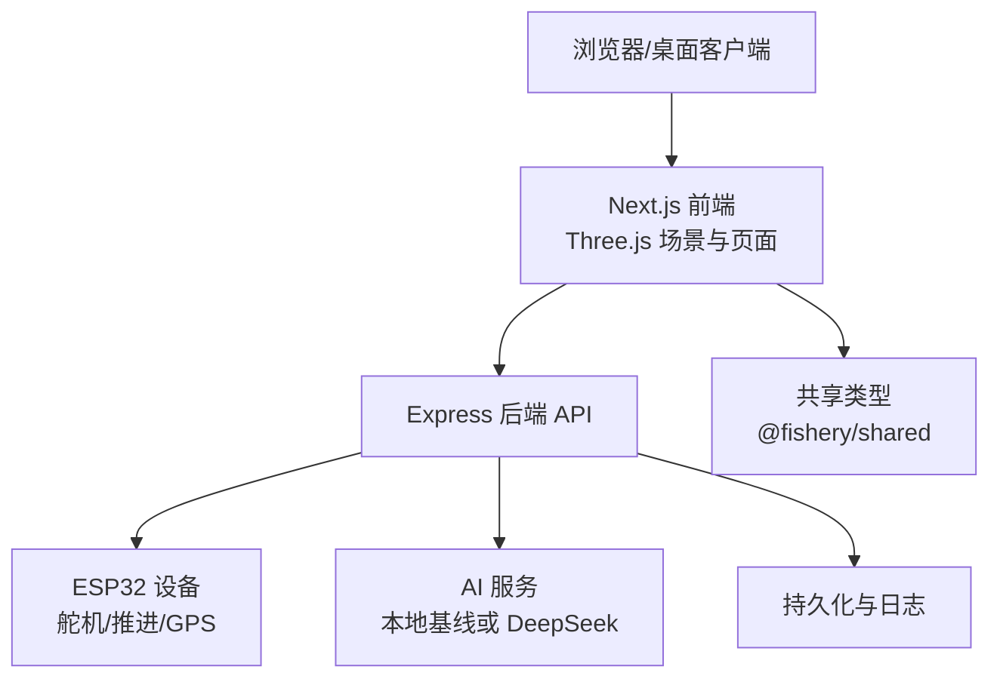
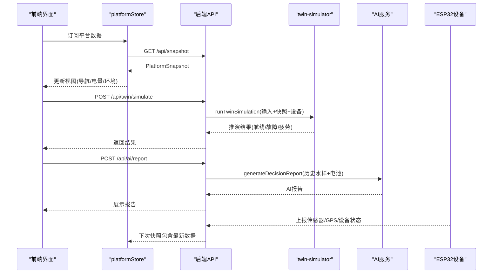
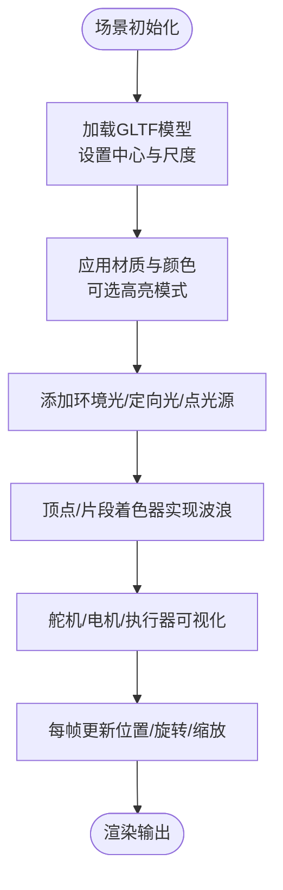
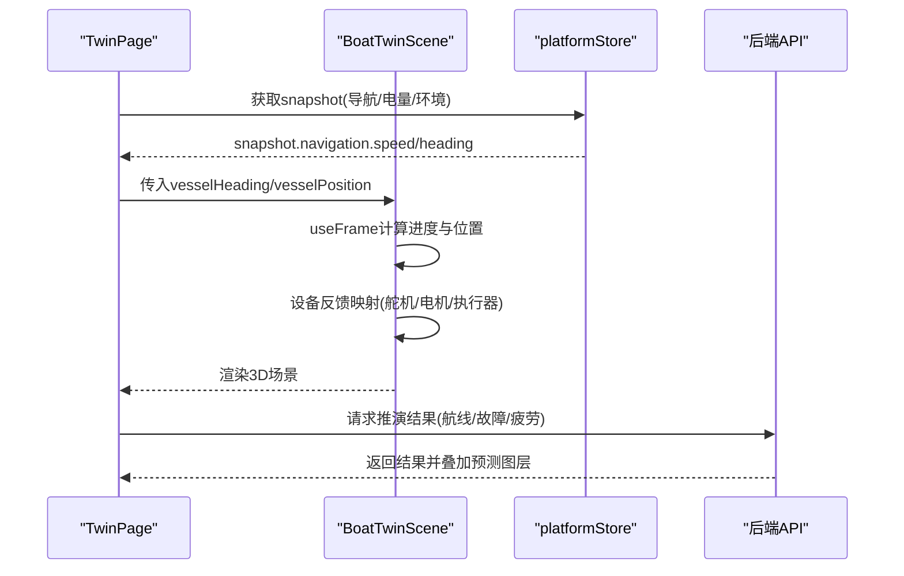
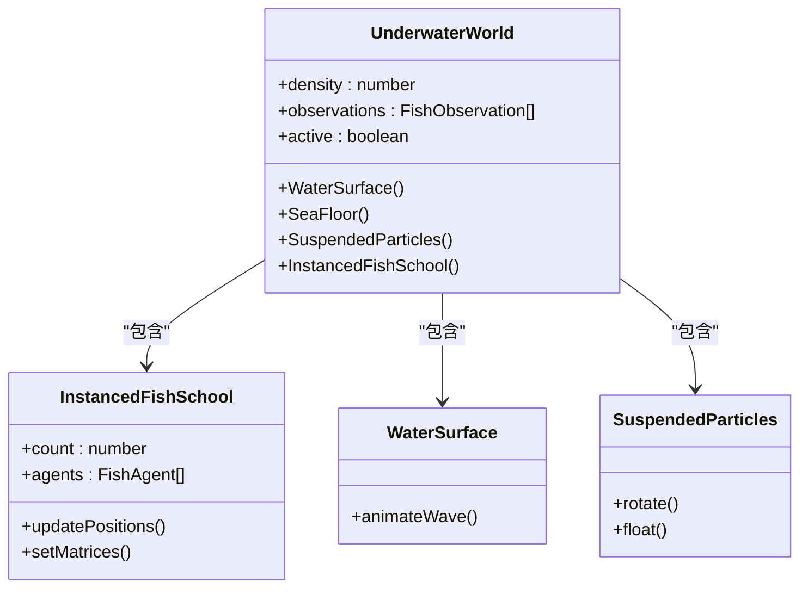
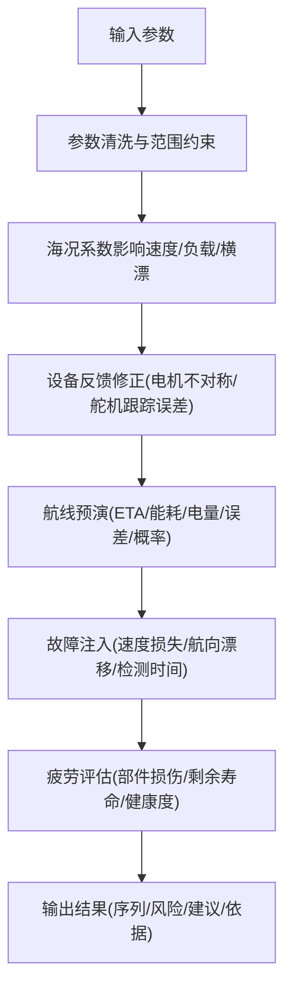
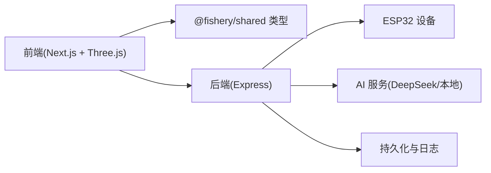

# 数字孪生系统

<cite>
**本文引用的文件**
- [README.md](file://fishery-digital-twin-platform/README.md)
- [后端入口 index.ts](file://fishery-digital-twin-platform/apps/backend/src/index.ts)
- [数字孪生推演 twin-simulator.ts](file://fishery-digital-twin-platform/apps/backend/src/twin-simulator.ts)
- [模拟数据 mock-data.ts](file://fishery-digital-twin-platform/apps/backend/src/mock-data.ts)
- [AI 服务 ai-service.ts](file://fishery-digital-twin-platform/apps/backend/src/ai-service.ts)
- [前端孪生页面 TwinPage.tsx](file://fishery-digital-twin-platform/apps/frontend/src/components/dashboard/TwinPage.tsx)
- [3D 船模场景 BoatTwinScene.tsx](file://fishery-digital-twin-platform/apps/frontend/src/components/three/BoatTwinScene.tsx)
- [水下鱼群场景 UnderwaterFishScene.tsx](file://fishery-digital-twin-platform/apps/frontend/src/components/three/UnderwaterFishScene.tsx)
- [平台状态存储 platformStore.ts](file://fishery-digital-twin-platform/apps/frontend/src/lib/platformStore.ts)
- [共享类型 shared/index.ts](file://fishery-digital-twin-platform/packages/shared/src/index.ts)
</cite>

## 目录
1. [简介](#简介)
2. [项目结构](#项目结构)
3. [核心组件](#核心组件)
4. [架构总览](#架构总览)
5. [详细组件分析](#详细组件分析)
6. [依赖关系分析](#依赖关系分析)
7. [性能考虑](#性能考虑)
8. [故障排查指南](#故障排查指南)
9. [结论](#结论)
10. [附录：扩展与定制指南](#附录扩展与定制指南)

## 简介
本数字孪生系统面向智慧渔业巡检船，提供“3D 虚拟模型 + 物理实体”的实时同步、水下场景渲染、数字孪生推演（未来状态预测、故障模拟、疲劳评估）以及用户交互控制。系统由 Next.js 前端、Express 后端、ESP32 固件与共享 TypeScript 类型组成，支持在线传感器数据接入、演示数据回退、AI 水质报告与设备健康监控。

## 项目结构
- 前端 apps/frontend：Next.js 应用，包含 3D 场景、仪表盘页面、数据拉取与状态管理。
- 后端 apps/backend：Express API，负责数据聚合、设备命令路由、UDP 自动发现、AI 报告生成与数字孪生推演。
- 固件 firmware/esp32：舵机、推进器、GPS 等设备的控制与上报逻辑。
- 共享 packages/shared：前后端共用的数据类型定义，确保接口契约一致。

图表来源
- [后端入口 index.ts:56-110](file://fishery-digital-twin-platform/apps/backend/src/index.ts#L56-L110)
- [前端孪生页面 TwinPage.tsx:14-102](file://fishery-digital-twin-platform/apps/frontend/src/components/dashboard/TwinPage.tsx#L14-L102)
- [共享类型 shared/index.ts:98-106](file://fishery-digital-twin-platform/packages/shared/src/index.ts#L98-L106)

章节来源
- [README.md:1-77](file://fishery-digital-twin-platform/README.md#L1-L77)
- [后端入口 index.ts:56-110](file://fishery-digital-twin-platform/apps/backend/src/index.ts#L56-L110)
- [前端孪生页面 TwinPage.tsx:14-102](file://fishery-digital-twin-platform/apps/frontend/src/components/dashboard/TwinPage.tsx#L14-L102)
- [共享类型 shared/index.ts:98-106](file://fishery-digital-twin-platform/packages/shared/src/index.ts#L98-L106)

## 核心组件
- 3D 船模场景：加载 GLTF 模型、材质与光照、动态水面、设备反馈可视化（舵机角度、电机功率、执行机构）。
- 水下场景：鱼群粒子与实例化渲染、水面折射、悬浮颗粒、海底地形。
- 数字孪生推演：航线预演、故障注入、疲劳损耗估算，输出风险等级与建议。
- 平台数据流：前端定时拉取快照与设备反馈，后端聚合传感器、GPS、电池、AI 报告并暴露统一接口。
- 设备控制：舵机与推进器命令下发、状态上报、令牌鉴权与日志记录。

章节来源
- [3D 船模场景 BoatTwinScene.tsx:57-127](file://fishery-digital-twin-platform/apps/frontend/src/components/three/BoatTwinScene.tsx#L57-L127)
- [水下鱼群场景 UnderwaterFishScene.tsx:38-88](file://fishery-digital-twin-platform/apps/frontend/src/components/three/UnderwaterFishScene.tsx#L38-L88)
- [数字孪生推演 twin-simulator.ts:74-253](file://fishery-digital-twin-platform/apps/backend/src/twin-simulator.ts#L74-L253)
- [平台状态存储 platformStore.ts:98-139](file://fishery-digital-twin-platform/apps/frontend/src/lib/platformStore.ts#L98-L139)
- [后端入口 index.ts:336-557](file://fishery-digital-twin-platform/apps/backend/src/index.ts#L336-L557)

## 架构总览
系统采用前后端分离与设备直连模式：
- 前端通过 Next.js 渲染页面与 Three.js 场景，使用 platformStore 定时拉取平台快照与设备反馈。
- 后端提供 REST API，聚合传感器、GPS、电池、AI 报告，并提供数字孪生推演接口。
- ESP32 通过 UDP 自动发现后端端口，HTTP 上报传感器与设备状态；控制命令需携带令牌鉴权。
- AI 服务优先调用 DeepSeek API，未配置时回退到本地基线报告。

图表来源
- [平台状态存储 platformStore.ts:98-139](file://fishery-digital-twin-platform/apps/frontend/src/lib/platformStore.ts#L98-L139)
- [后端入口 index.ts:336-557](file://fishery-digital-twin-platform/apps/backend/src/index.ts#L336-L557)
- [数字孪生推演 twin-simulator.ts:74-253](file://fishery-digital-twin-platform/apps/backend/src/twin-simulator.ts#L74-L253)
- [AI 服务 ai-service.ts:167-233](file://fishery-digital-twin-platform/apps/backend/src/ai-service.ts#L167-L233)

## 详细组件分析

### 3D 场景构建与船模加载
- 模型加载与坐标中心：默认模型路径为 inspection-boat.glb，使用引用中心与长度进行归一化定位。
- 材质与光照：支持颜色化模型与仅高亮材料两种模式，内置浅蓝/青色系配色方案。
- 动态水面：顶点着色器叠加多频正弦波，片段着色器混合浅水与深蓝，加入波纹高光。
- 设备反馈可视化：舵机角度映射为机械臂旋转，电机功率驱动螺旋桨旋转，线性执行器伸缩动画。
- 工作设备模拟：传送带、收集箱、相机云台随仿真或真实反馈运动。

图表来源
- [3D 船模场景 BoatTwinScene.tsx:57-127](file://fishery-digital-twin-platform/apps/frontend/src/components/three/BoatTwinScene.tsx#L57-L127)
- [3D 船模场景 BoatTwinScene.tsx:153-273](file://fishery-digital-twin-platform/apps/frontend/src/components/three/BoatTwinScene.tsx#L153-L273)
- [3D 船模场景 BoatTwinScene.tsx:275-379](file://fishery-digital-twin-platform/apps/frontend/src/components/three/BoatTwinScene.tsx#L275-L379)
- [3D 船模场景 BoatTwinScene.tsx:381-510](file://fishery-digital-twin-platform/apps/frontend/src/components/three/BoatTwinScene.tsx#L381-L510)

章节来源
- [3D 船模场景 BoatTwinScene.tsx:57-127](file://fishery-digital-twin-platform/apps/frontend/src/components/three/BoatTwinScene.tsx#L57-L127)
- [3D 船模场景 BoatTwinScene.tsx:153-273](file://fishery-digital-twin-platform/apps/frontend/src/components/three/BoatTwinScene.tsx#L153-L273)
- [3D 船模场景 BoatTwinScene.tsx:275-379](file://fishery-digital-twin-platform/apps/frontend/src/components/three/BoatTwinScene.tsx#L275-L379)
- [3D 船模场景 BoatTwinScene.tsx:381-510](file://fishery-digital-twin-platform/apps/frontend/src/components/three/BoatTwinScene.tsx#L381-L510)

### 姿态同步算法与实时更新机制
- 六自由度运动模拟：船体位置与航向由 vesselPosition 与 vesselHeading 驱动，结合 DEMO_ROUTE 与 PREDICTION_ROUTE 实现演示与预测轨迹。
- 坐标系转换：模型中心与参考长度用于将世界坐标映射到模型局部空间，保证姿态对齐。
- 实时更新：useFrame 中根据 deltaTime 平滑插值进度，避免跳变；浮动效果通过正弦函数叠加。
- 设备反馈映射：舵机角度转换为关节旋转，电机功率驱动螺旋桨转速，线性执行器按功率伸缩。

图表来源
- [前端孪生页面 TwinPage.tsx:24-102](file://fishery-digital-twin-platform/apps/frontend/src/components/dashboard/TwinPage.tsx#L24-L102)
- [3D 船模场景 BoatTwinScene.tsx:153-273](file://fishery-digital-twin-platform/apps/frontend/src/components/three/BoatTwinScene.tsx#L153-L273)
- [平台状态存储 platformStore.ts:98-139](file://fishery-digital-twin-platform/apps/frontend/src/lib/platformStore.ts#L98-L139)

章节来源
- [前端孪生页面 TwinPage.tsx:24-102](file://fishery-digital-twin-platform/apps/frontend/src/components/dashboard/TwinPage.tsx#L24-L102)
- [3D 船模场景 BoatTwinScene.tsx:153-273](file://fishery-digital-twin-platform/apps/frontend/src/components/three/BoatTwinScene.tsx#L153-L273)
- [平台状态存储 platformStore.ts:98-139](file://fishery-digital-twin-platform/apps/frontend/src/lib/platformStore.ts#L98-L139)

### 水下场景渲染
- 鱼群模型：使用 InstancedMesh 批量绘制鱼体与尾鳍，基于确定性噪声生成初始速度与相位。
- 水流效果：水面平面几何在 useFrame 中逐点修改 Z 轴高度，形成波浪。
- 光照折射：使用 meshPhysicalMaterial 透明材质与深度写入关闭，模拟水下折射与散射。
- 粒子系统：悬浮颗粒以 Points 形式呈现，缓慢旋转与上下浮动增强水体氛围。

图表来源
- [水下鱼群场景 UnderwaterFishScene.tsx:53-88](file://fishery-digital-twin-platform/apps/frontend/src/components/three/UnderwaterFishScene.tsx#L53-L88)
- [水下鱼群场景 UnderwaterFishScene.tsx:90-250](file://fishery-digital-twin-platform/apps/frontend/src/components/three/UnderwaterFishScene.tsx#L90-L250)
- [水下鱼群场景 UnderwaterFishScene.tsx:252-356](file://fishery-digital-twin-platform/apps/frontend/src/components/three/UnderwaterFishScene.tsx#L252-L356)

章节来源
- [水下鱼群场景 UnderwaterFishScene.tsx:38-88](file://fishery-digital-twin-platform/apps/frontend/src/components/three/UnderwaterFishScene.tsx#L38-L88)
- [水下鱼群场景 UnderwaterFishScene.tsx:90-250](file://fishery-digital-twin-platform/apps/frontend/src/components/three/UnderwaterFishScene.tsx#L90-L250)
- [水下鱼群场景 UnderwaterFishScene.tsx:252-356](file://fishery-digital-twin-platform/apps/frontend/src/components/three/UnderwaterFishScene.tsx#L252-L356)

### 数字孪生推演功能
- 输入参数：航程、目标航速、海况等级、故障类型与严重度、累计工时、舵机日动作次数。
- 航线预演：计算有效航速、ETA、能耗、到达电量、横向误差与完成概率，生成时间序列。
- 故障模拟：注入舵机卡滞、电机降额、反馈丢失，评估速度损失、航向漂移与任务完成概率。
- 疲劳评估：推进、舵机、船体、电池四类部件损伤率与剩余寿命，综合健康度与建议检查间隔。
- 置信度与依据：基于在线设备数量、实测反馈与快照数据计算置信度，并列出假设与限制。

图表来源
- [数字孪生推演 twin-simulator.ts:35-50](file://fishery-digital-twin-platform/apps/backend/src/twin-simulator.ts#L35-L50)
- [数字孪生推演 twin-simulator.ts:74-253](file://fishery-digital-twin-platform/apps/backend/src/twin-simulator.ts#L74-L253)

章节来源
- [数字孪生推演 twin-simulator.ts:35-50](file://fishery-digital-twin-platform/apps/backend/src/twin-simulator.ts#L35-L50)
- [数字孪生推演 twin-simulator.ts:74-253](file://fishery-digital-twin-platform/apps/backend/src/twin-simulator.ts#L74-L253)

### 用户交互设计
- 视角切换：俯视模式、全屏查看、视角复位按钮。
- 缩放旋转：OrbitControls 支持拖拽平移与滚轮缩放。
- 点击选择：通过页面控件选择仿真模式（航线/故障/疲劳），调整参数后运行推演。
- 状态查询：显示 GPS 坐标、航向、续航、环境采样数据与任务进度。

章节来源
- [前端孪生页面 TwinPage.tsx:55-143](file://fishery-digital-twin-platform/apps/frontend/src/components/dashboard/TwinPage.tsx#L55-L143)
- [前端孪生页面 TwinPage.tsx:319-356](file://fishery-digital-twin-platform/apps/frontend/src/components/dashboard/TwinPage.tsx#L319-L356)

## 依赖关系分析
- 前端依赖：Three.js、React Three Fiber/Drei、Recharts、Next.js 路由与状态管理。
- 后端依赖：Express、CORS、dotenv、dgram（UDP）、crypto、os。
- 共享类型：@fishery/shared 定义平台快照、设备状态、推演输入输出等契约。
- 设备通信：ESP32 通过 UDP 自动发现后端端口，HTTP 上报传感器与设备状态，控制命令需令牌鉴权。

图表来源
- [共享类型 shared/index.ts:98-106](file://fishery-digital-twin-platform/packages/shared/src/index.ts#L98-L106)
- [后端入口 index.ts:56-110](file://fishery-digital-twin-platform/apps/backend/src/index.ts#L56-L110)
- [平台状态存储 platformStore.ts:98-139](file://fishery-digital-twin-platform/apps/frontend/src/lib/platformStore.ts#L98-L139)

章节来源
- [共享类型 shared/index.ts:98-106](file://fishery-digital-twin-platform/packages/shared/src/index.ts#L98-L106)
- [后端入口 index.ts:56-110](file://fishery-digital-twin-platform/apps/backend/src/index.ts#L56-L110)
- [平台状态存储 platformStore.ts:98-139](file://fishery-digital-twin-platform/apps/frontend/src/lib/platformStore.ts#L98-L139)

## 性能考虑
- 模型简化：使用低面数几何与实例化网格（InstancedMesh）提升鱼群渲染效率。
- 纹理压缩：当前场景主要使用程序化材质与颜色，减少纹理加载开销。
- 渲染管线优化：按需刷新帧率（SceneTicker 控制 fps）、关闭不必要的深度写入、使用 demand 模式暂停非活跃场景。
- 内存管理：平台状态切片稳定更新，避免频繁重渲染；设备反馈与快照分离，降低 UI 抖动。
- 网络优化：前端定时拉取快照（2s）与设备反馈（1s），合并请求与错误处理，避免阻塞主线程。

章节来源
- [水下鱼群场景 UnderwaterFishScene.tsx:90-250](file://fishery-digital-twin-platform/apps/frontend/src/components/three/UnderwaterFishScene.tsx#L90-L250)
- [3D 船模场景 BoatTwinScene.tsx:128-151](file://fishery-digital-twin-platform/apps/frontend/src/components/three/BoatTwinScene.tsx#L128-L151)
- [平台状态存储 platformStore.ts:20-25](file://fishery-digital-twin-platform/apps/frontend/src/lib/platformStore.ts#L20-L25)

## 故障排查指南
- 设备无法连接：检查 ESP32 是否在同一热点、防火墙是否开放 TCP 5000 与 UDP 42110、令牌是否配置正确。
- 传感器数据不更新：确认 /api/data 接口是否收到数据、waterHistory 是否被覆盖、demo 模式是否启用。
- 推演失败：检查输入参数是否在允许范围、设备反馈是否在线、后端日志是否记录错误。
- AI 报告异常：确认 DeepSeek API Key 是否配置、超时设置是否合理、本地基线是否可用。
- 3D 场景卡顿：降低鱼群密度、关闭动态水面、减少实例化对象数量、调整帧率限制。

章节来源
- [后端入口 index.ts:143-157](file://fishery-digital-twin-platform/apps/backend/src/index.ts#L143-L157)
- [后端入口 index.ts:367-430](file://fishery-digital-twin-platform/apps/backend/src/index.ts#L367-L430)
- [后端入口 index.ts:540-555](file://fishery-digital-twin-platform/apps/backend/src/index.ts#L540-L555)
- [AI 服务 ai-service.ts:167-233](file://fishery-digital-twin-platform/apps/backend/src/ai-service.ts#L167-L233)

## 结论
本数字孪生系统实现了从 3D 场景构建、设备反馈可视化到数字孪生推演的完整闭环。通过稳定的数据流与清晰的接口契约，系统支持实时同步、水下渲染、故障模拟与性能优化。开发者可基于现有模块快速扩展新模型、新功能与自定义推演逻辑。

## 附录：扩展与定制指南
- 添加新模型：替换默认 GLTF 路径，调整模型中心与尺度，确保坐标对齐。
- 自定义材质：修改 MODEL_COLORS 与 LIGHT_MATERIAL_COLORS，支持更多配色方案。
- 扩展推演模型：在 twin-simulator 中添加新的故障类型或海况等级，更新风险阈值与建议。
- 集成新设备：在后端新增设备状态接口，前端 platformStore 增加对应字段与更新逻辑。
- 优化渲染：调整鱼群密度、水面复杂度、粒子数量，平衡视觉效果与性能。

章节来源
- [3D 船模场景 BoatTwinScene.tsx:57-75](file://fishery-digital-twin-platform/apps/frontend/src/components/three/BoatTwinScene.tsx#L57-L75)
- [数字孪生推演 twin-simulator.ts:35-50](file://fishery-digital-twin-platform/apps/backend/src/twin-simulator.ts#L35-L50)
- [平台状态存储 platformStore.ts:98-139](file://fishery-digital-twin-platform/apps/frontend/src/lib/platformStore.ts#L98-L139)